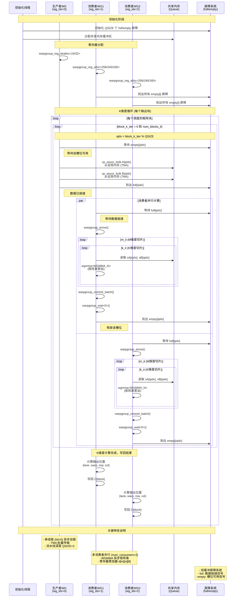

```mermaid
sequenceDiagram
    participant Init as 初始化线程
    participant Producer as 生产者WG<br/>(wg_idx=0)
    participant Consumer1 as 消费者WG1<br/>(wg_idx=1)
    participant Consumer2 as 消费者WG2<br/>(wg_idx=2)
    participant SMEM as 共享内存<br/>(Queue)
    participant Barrier as 屏障系统<br/>(full/empty)

    Note over Init,Barrier: 初始化阶段
    Init->>Barrier: 初始化 QSIZE 个 full/empty 屏障
    Init->>SMEM: 分配共享内存缓冲区
    
    Note over Producer,Consumer2: 寄存器分配
    Producer->>Producer: warpgroup_reg_dealloc<24/32>
    Consumer1->>Consumer1: warpgroup_reg_alloc<256/240/160>
    Consumer2->>Consumer2: warpgroup_reg_alloc<256/240/160>
    
    Consumer1->>Barrier: 到达所有 empty[i] 屏障
    Consumer2->>Barrier: 到达所有 empty[i] 屏障

    Note over Producer,Barrier: K维度循环 (每个输出块)
    
    loop 每个调度的矩阵块
        loop block_k_iter = 0 到 num_blocks_k
            Note over Producer,Barrier: qidx = block_k_iter % QSIZE
            
            Producer->>Barrier: 等待 empty[qidx]
            Note right of Producer: 等待该槽位可用
            
            Producer->>SMEM: cp_async_bulk A[qidx]<br/>从全局内存 (TMA)
            Producer->>SMEM: cp_async_bulk B[qidx]<br/>从全局内存 (TMA)
            Producer->>Barrier: 到达 full[qidx]
            Note right of Producer: 数据已就绪
            
            par 消费者并行计算
                Consumer1->>Barrier: 等待 full[qidx]
                Note right of Consumer1: 等待数据就绪
                Consumer1->>Consumer1: warpgroup_arrive()
                
                loop m_it (M维度切片)
                    loop k_it (K维度切片)
                        Consumer1->>SMEM: 读取 sA[qidx], sB[qidx]
                        Consumer1->>Consumer1: wgmma<WGMMA_N><br/>(矩阵乘累加)
                    end
                end
                
                Consumer1->>Consumer1: warpgroup_commit_batch()
                Consumer1->>Consumer1: warpgroup_wait<0>()
                Consumer1->>Barrier: 到达 empty[qidx]
                Note right of Consumer1: 释放该槽位
            and
                Consumer2->>Barrier: 等待 full[qidx]
                Consumer2->>Consumer2: warpgroup_arrive()
                
                loop m_it (M维度切片)
                    loop k_it (K维度切片)
                        Consumer2->>SMEM: 读取 sA[qidx], sB[qidx]
                        Consumer2->>Consumer2: wgmma<WGMMA_N><br/>(矩阵乘累加)
                    end
                end
                
                Consumer2->>Consumer2: warpgroup_commit_batch()
                Consumer2->>Consumer2: warpgroup_wait<0>()
                Consumer2->>Barrier: 到达 empty[qidx]
            end
        end
        
        Note over Consumer1,Consumer2: K维度计算完成，写回结果
        
        Consumer1->>Consumer1: 计算输出位置<br/>(lane, warp, row, col)
        Consumer1->>Consumer1: 写回 C[block]
        
        Consumer2->>Consumer2: 计算输出位置<br/>(lane, warp, row, col)
        Consumer2->>Consumer2: 写回 C[block]
    end

    Note over Init,Barrier: 关键特性说明
    Note over Producer: - 单线程 (tid=0) 异步加载<br/>- TMA 批量传输<br/>- 流水线深度 QSIZE=3
    Note over Consumer1,Consumer2: - 多消费者并行 (num_consumers=2)<br/>- WGMMA 异步矩阵乘<br/>- 寄存器累加器 d[m][n][8]
    Note over Barrier: - 双缓冲屏障系统<br/>- full: 数据就绪信号<br/>- empty: 槽位可用信号
```

