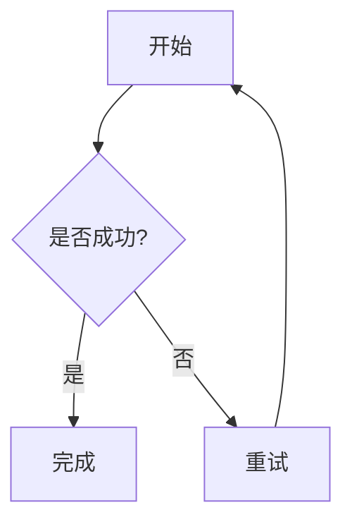
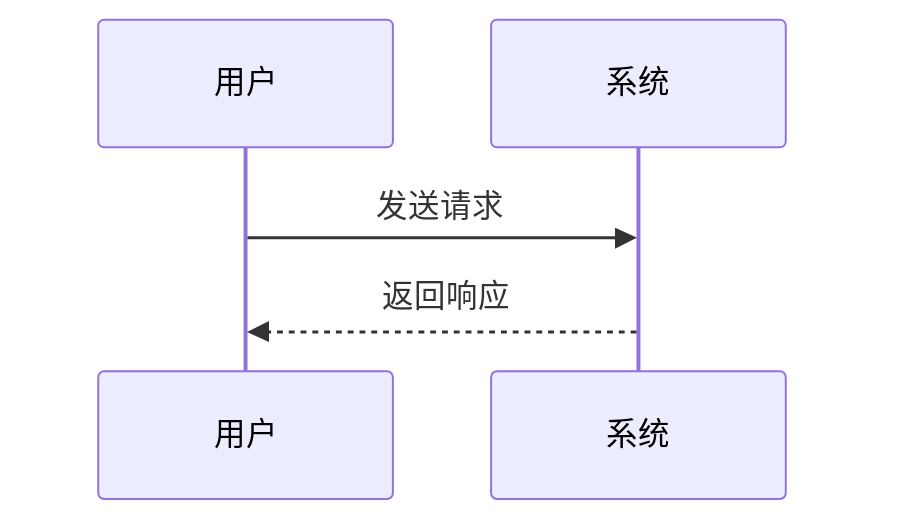
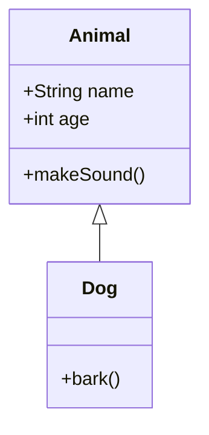
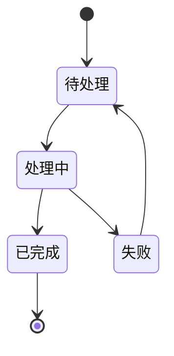
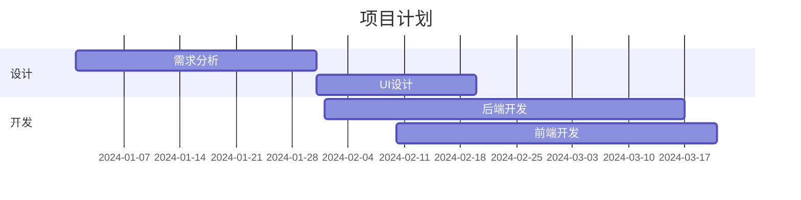
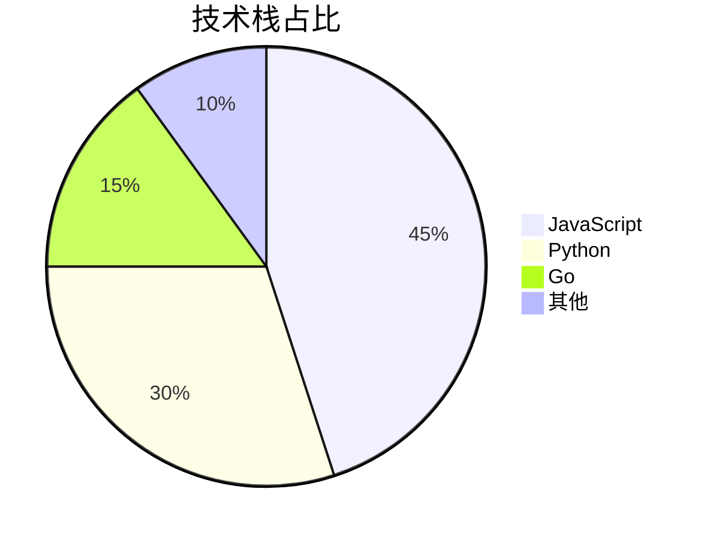

# 设置 Mermaid in Astro

## 1）安装 Mermaid

在项目根目录执行：

```
npm i mermaid
```

如果你用 pnpm：

```
pnpm add mermaid
```

如果你用 yarn：

```
yarn add mermaid
```


## 2）添加`src/components/Mermaid.astro`

```js

```


## 3）修改`src/layouts/Layout.astro`

```css
---
.....
+ import Mermaid from "../components/Mermaid.astro";
---
```

```css
	<body class=" min-h-screen transition " class:list={[{"lg:is-home": isHomePage, "enable-banner": enableBanner}]}
		  data-overlayscrollbars-initialize
	>
		<ConfigCarrier></ConfigCarrier>
        + <Mermaid client:load />
		+ <slot />

		<!-- increase the page height during page transition to prevent the scrolling animation from jumping -->
		<div id="page-height-extend" class="hidden h-[300vh]"></div>
	</body>
```


## 4） 修改样式`src/styles/global.css`

```css

.mermaid-interactive-wrapper {
  width: 100%;
  overflow-x: scroll !important; /* ✅ 强制显示横向滚动条 */
  overflow-y: hidden !important;
  background: transparent;       /* ✅ 不超出时看不到灰底 */
}


/* ✅ 滚动条高度 30px（轨道高度） */
.mermaid-interactive-wrapper::-webkit-scrollbar {
  height: 30px;
}

/* ✅ 轨道 */
.mermaid-interactive-wrapper::-webkit-scrollbar-track {
  background: #f1f5f9;
  border-radius: 999px;
}

/* ✅ thumb：视觉更细（不要再用 8px 那么大的 border） */
.mermaid-interactive-wrapper::-webkit-scrollbar-thumb {
  background: #94a3b8;
  border-radius: 999px;

  /* ✅ 让 thumb 变细，居中在 30px 轨道里 */
  border: 10px solid #f1f5f9;  /* 越大 thumb 越细，这里用 10 */
  background-clip: padding-box;
}

/* hover */
.mermaid-interactive-wrapper::-webkit-scrollbar-thumb:hover {
  background: #64748b;
}

:global(.dark) .mermaid-interactive-wrapper::-webkit-scrollbar-track {
  background: #1f2937;
}

:global(.dark) .mermaid-interactive-wrapper::-webkit-scrollbar-thumb {
  background: #475569;
  border: 10px solid #1f2937;
  background-clip: padding-box;
}

:global(.dark) .mermaid-interactive-wrapper::-webkit-scrollbar-thumb:hover {
  background: #64748b;
}
```


# Mermaid 测试

在你的 Markdown 文件中添加以下测试代码：

## 测试案例

### 流程图



### 时序图



### 类图



### 时序图


### 类图


### 状态图



### 甘特图


### 饼图



如果显示正常现在你应该能在页面上看到渲染好的图表了！🎉

## 控制台检测

请检查：

1.  **浏览器控制台**是否显示 `[Mermaid] Rendered ✅`
2.  **控制台**中 "Cleaned text" 的内容是否正确（没有行号）
3.  页面上是否有 `<div class="mermaid">` 元素

如果需要，可以截图或复制控制台的输出，我可以继续帮你调试。

## 额外优化建议

如果一切正常，你还可以添加暗色主题支持：

```astro
<script>
  import mermaid from "mermaid";
  
  // 检测主题
  const isDark = document.documentElement.classList.contains('dark');
  
  mermaid.initialize({ 
    startOnLoad: false,
    theme: isDark ? 'dark' : 'default',  // 👈 根据主题切换
    securityLevel: 'loose',
  });
  
  // ... 其余代码
</script>
```

这样 Mermaid 图表会自动适配你网站的深色/浅色主题！
