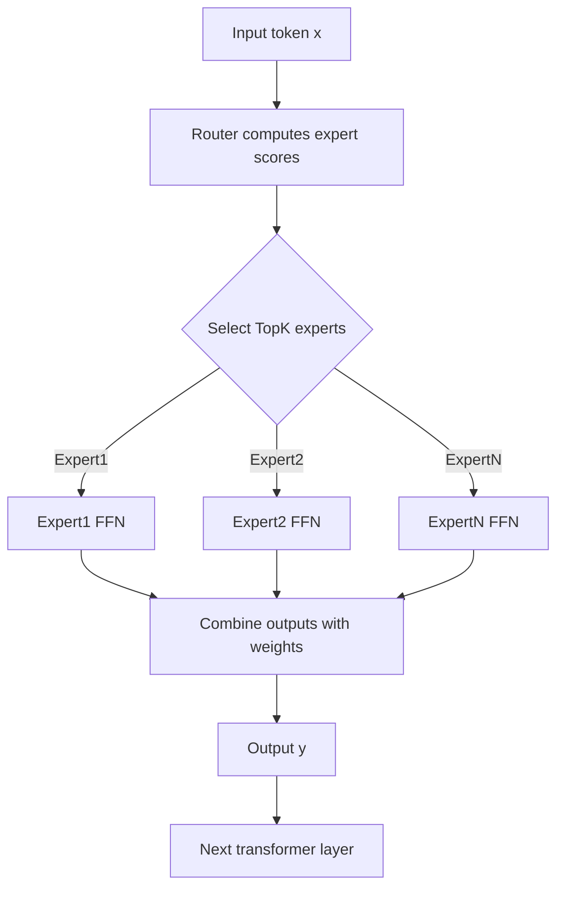
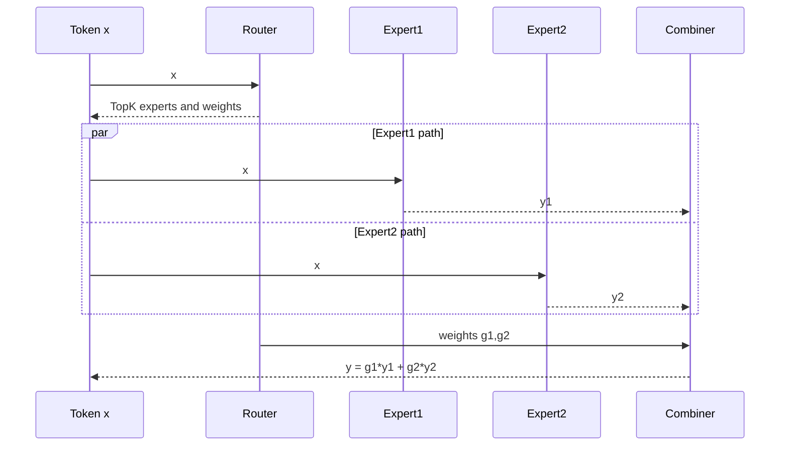

```mermaid
flowchart TD
    A[Input token x] --> B[Router computes expert scores]
    B --> C{Select TopK experts}
    C -->|Expert1| E1[Expert1 FFN]
    C -->|Expert2| E2[Expert2 FFN]
    C -->|ExpertN| EN[ExpertN FFN]

    E1 --> F[Combine outputs with weights]
    E2 --> F
    EN --> F

    F --> G[Output y]
    G --> H[Next transformer layer]
```

```mermaid
sequenceDiagram
    participant T as Token x
    participant R as Router
    participant E1 as Expert1
    participant E2 as Expert2
    participant C as Combiner

    T->>R: x
    R-->>T: TopK experts and weights

    par Expert1 path
        T->>E1: x
        E1-->>C: y1
    and Expert2 path
        T->>E2: x
        E2-->>C: y2
    end

    R->>C: weights g1,g2
    C-->>T: y = g1*y1 + g2*y2

```

