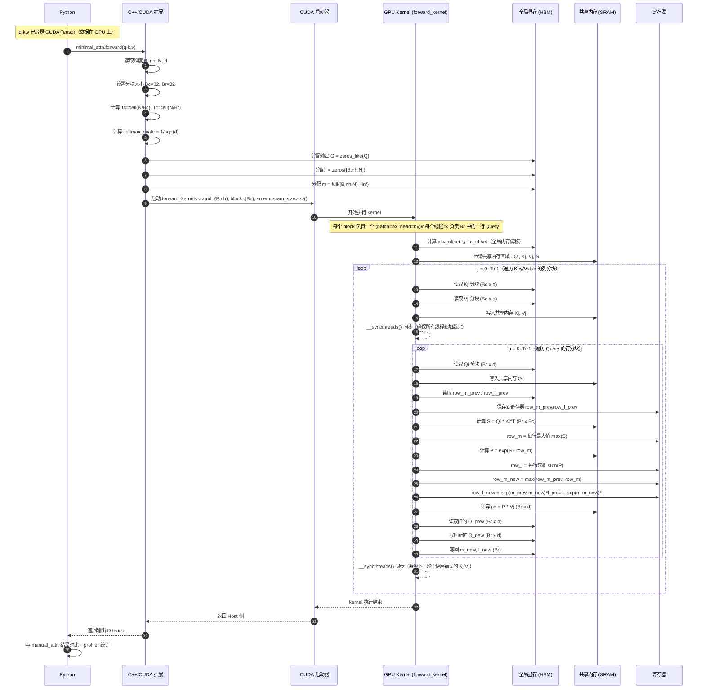
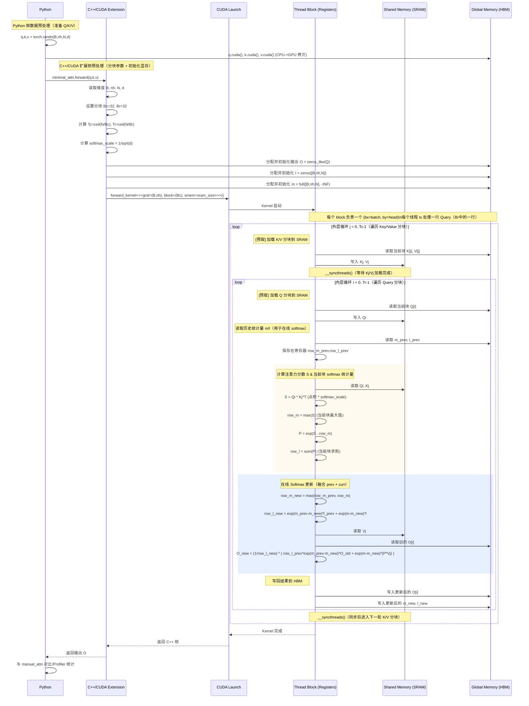

这段代码实现了一个简化版的 Flash Attention 算法。为了清晰地展示其工作流程，我为你准备了两个层次的时序图：

1.  **系统级交互流程**：展示 Python 端、C++ Host 端与 GPU Device 端的数据流向与调用关系。
2.  **Kernel 内部算法流程（核心）**：展示 GPU 线程（Thread Block）如何利用 SRAM（共享内存）和 HBM（显存）进行分块计算（Tiling）。

### 1. 系统级交互流程 (System Level)

这个图展示了从 Python 代码发起请求到 GPU 执行并返回结果的全过程。

Code snippet

```
sequenceDiagram
    participant Py as Python Script (Main)
    participant Cpp as C++ Extension (Host)
    participant HBM as GPU HBM (Global Mem)
    participant GPU as GPU Cores (Kernel)

    Note over Py: 准备数据 Q, K, V
    Py->>HBM: 将 Tensor Q, K, V 移动到 CUDA
    Py->>Cpp: 调用 minimal_attn.forward(Q, K, V)
    
    rect rgb(240, 248, 255)
        Note over Cpp: C++ Host端逻辑
        Cpp->>Cpp: 计算分块大小 (Tc, Tr)<br/>设置 Grid/Block 维度
        Cpp->>HBM: 分配结果张量 O, l, m
        Cpp->>Cpp: 计算所需的 Shared Memory (SRAM) 大小
        Cpp->>GPU: 启动 CUDA Kernel (forward_kernel)
    end

    activate GPU
    Note over GPU: 执行 Flash Attention 计算<br/>(详见下方 Kernel 流程图)
    GPU-->>HBM: 写入最终结果 O
    deactivate GPU

    Cpp-->>Py: 返回 Tensor O
    
    Note over Py: PyTorch Profiler 记录时间
    Py->>Py: 与手动 Attention 结果比对
```

------

### 2. Kernel 内部算法与内存交互流程 (Kernel Logic)

这是 Flash Attention 的核心。代码通过**双重循环**（外层循环 K/V 块，内层循环 Q 块）来减少内存访问。

**注意代码中的特殊逻辑**：

在此实现中，外层循环遍历 `Tc` (Key/Value 分块)，内层循环遍历 `Tr` (Query 分块)。这与标准的 FlashAttention (v2) 稍有不同（通常外层是 row/Query，内层是 col/Key），这意味着该代码在内层循环中需要不断从 HBM 读取并更新 `O`、`l`、`m`。

Code snippet



### 关键步骤解析

1.  **SRAM 缓存 (Tiling)**:
    -   代码显式分配了 `extern __shared__ float sram[]`。
    -   **外层循环 ($j$)** 负责将 $K$ 和 $V$ 的切片（Tile）加载到高速的 SRAM 中。这是 Flash Attention 能够加速的关键，因为它复用了加载到 SRAM 中的 $K/V$ 数据来计算多个 $Q$。
2.  **HBM 读写瓶颈**:
    -   你可以从第二个图中看到，在内层循环 ($i$) 中，线程块频繁地从 HBM 读取 $O_{old}, l, m$ 并写回 $O_{new}, l, m$。
    -   **优化提示**: 更加优化的 Flash Attention 实现（如 v2）通常会交换循环顺序（外层 $Q$，内层 $K/V$），这样 $O, l, m$ 可以一直保存在寄存器或 SRAM 中，直到计算完所有的 $K/V$ 后再一次性写入 HBM，从而进一步减少 HBM 的带宽压力。
3.  **计算逻辑**:
    -   $S = QK^T$ 以及 Softmax 的指数计算是在寄存器层面完成的，非常快。主要的延迟通常来自于图中标注 `HBM` 的读写操作。


