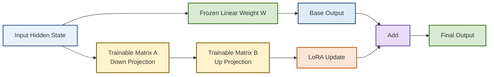
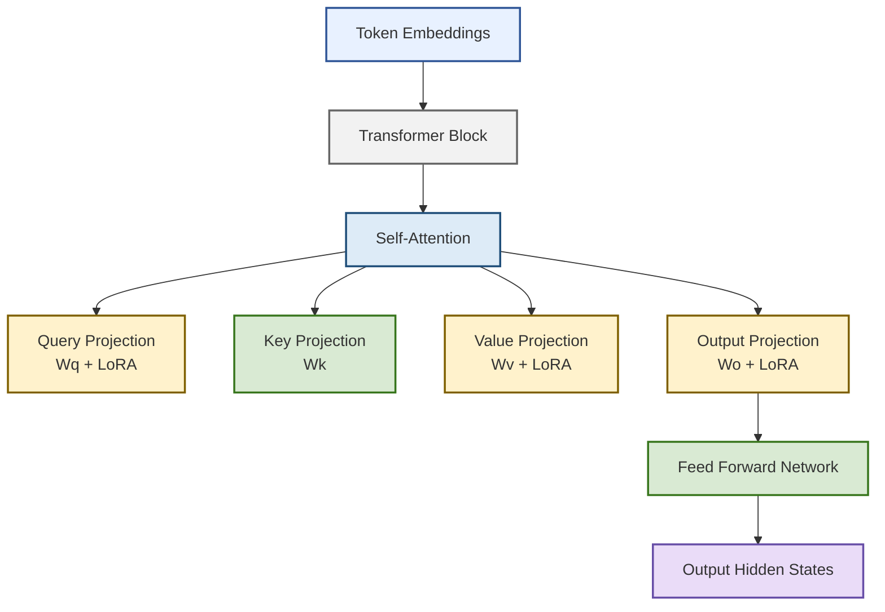
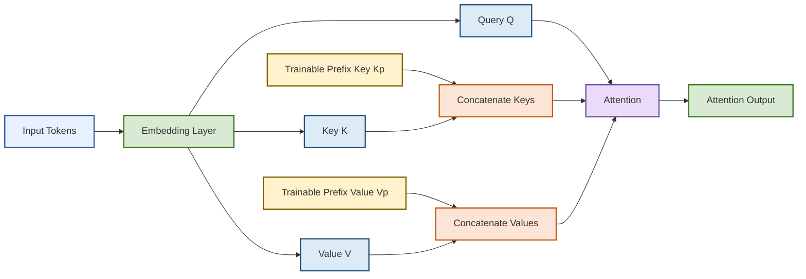
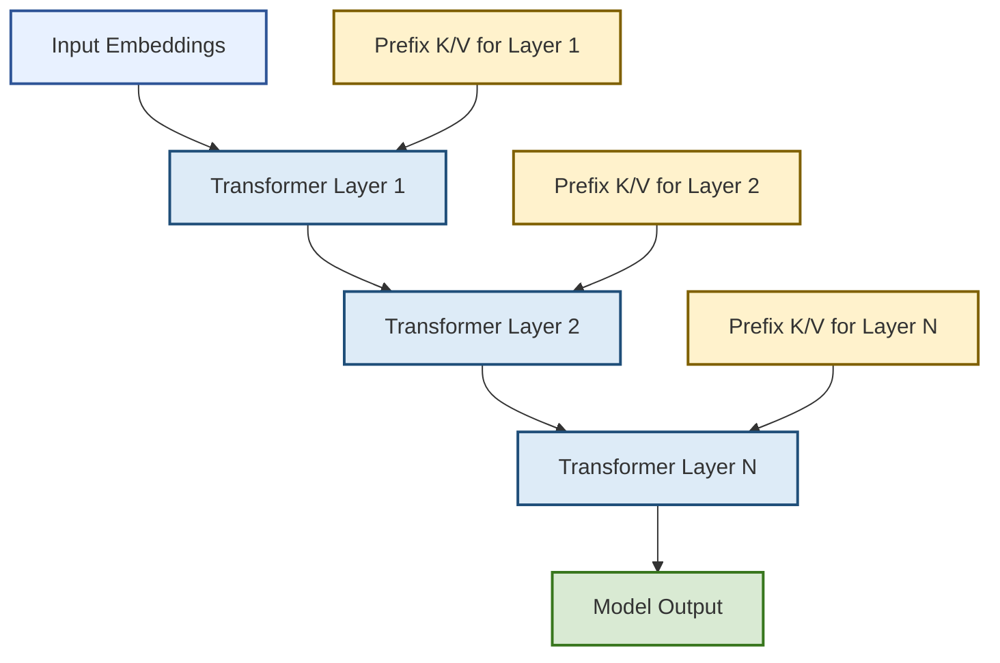
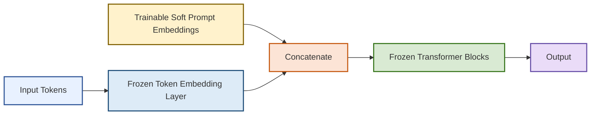
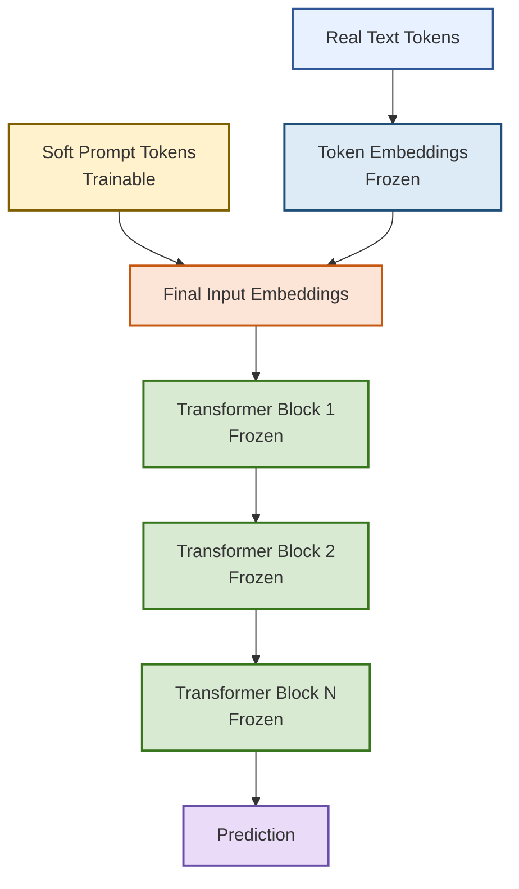
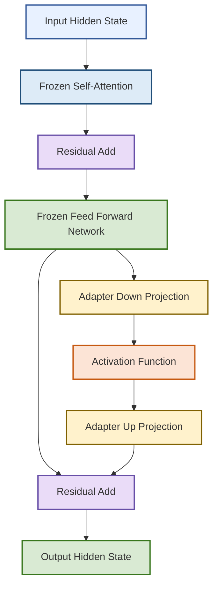
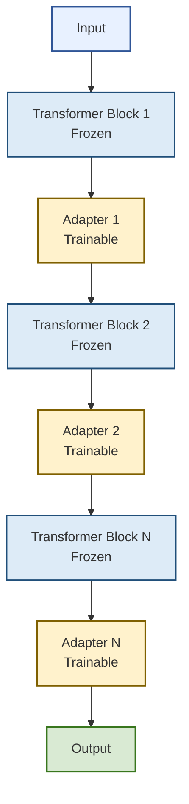
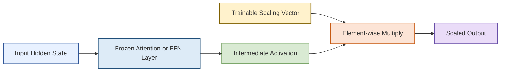
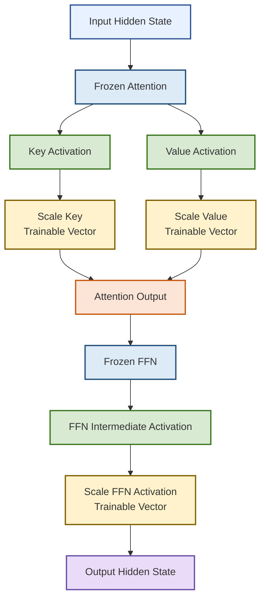

# PEFT Methods Study Notes

PEFT (Parameter-Efficient Fine-Tuning, 参数高效微调) adapts a large language model by freezing most pretrained weights and training only a small number of task-specific parameters.

## 1. Overview

PEFT is useful because it reduces GPU memory usage, training cost, and model storage while keeping the original large language model mostly unchanged.

| Method         | Main Idea                   | Acts On                       | Trainable Parameters | Interview Memory Point                                  |
| -------------- | --------------------------- | ----------------------------- | -------------------- | ------------------------------------------------------- |
| LoRA           | Add low-rank updates        | Linear layers                 | Low-rank matrices    | Train a small update instead of the full weight matrix. |
| Prefix Tuning  | Add prefix Key/Value states | Attention layers              | Prefix vectors       | Add learnable memory inside Attention.                  |
| Prompt Tuning  | Add soft prompts            | Input embeddings              | Prompt embeddings    | Learn input prompts instead of model weights.           |
| Adapter Tuning | Insert small modules        | Transformer blocks            | Adapter networks     | Add small trainable blocks into a frozen model.         |
| IA3            | Scale activations           | Attention and FFN activations | Scaling vectors      | Learn which hidden dimensions to amplify or suppress.   |

<br>

## 2. Advantages and Disadvantages

This table summarizes the strengths and weaknesses of each PEFT method in an interview-friendly way.

| Method         | Advantages                                                   | Disadvantages                                                | Best Scenario                                             |
| -------------- | ------------------------------------------------------------ | ------------------------------------------------------------ | --------------------------------------------------------- |
| LoRA           | It has strong performance, low memory cost, and no extra inference latency after merging. | The rank value must be chosen carefully, and target layers affect performance. | General LLM fine-tuning and instruction tuning.           |
| Prefix Tuning  | It keeps all model weights frozen and supports easy task switching. | It increases Attention length and may slow inference.        | Text generation and multi-task serving.                   |
| Prompt Tuning  | It uses extremely few trainable parameters and is simple to store. | It works better on very large models and is sensitive to prompt initialization. | Very large frozen models and lightweight task adaptation. |
| Adapter Tuning | It is modular (模块化) and gives strong task-specific adaptation. | It adds extra layers and increases inference latency.        | Multi-task systems and reusable task modules.             |
| IA3            | It is extremely lightweight and fast to train.               | It has lower expressive power (表达能力) than LoRA or Adapter Tuning. | Low-resource fine-tuning and fast deployment.             |

<br>

## 3. LoRA

LoRA (Low-Rank Adaptation, 低秩适配) is ==a lightweight fine-tuning (微调) method== that freezes the original model weights and only trains a small number of additional parameters(small trainable low-rank ==matrices==). It usually applied to q_proj and v_proj. training becomes cheaper and faster.

### 1) Core Formula

LoRA keeps the original weight matrix frozen and learns a low-rank update.

$$
W' = W + \Delta W
$$

$$
\Delta W = BA
$$

The key idea is that $A$ and $B$ are trainable small matrices, while $W$ is frozen.

### 2) Architecture Diagram



### 3) How It Works on LLMs

LoRA usually acts on Attention projection layers such as Query, Value, and Output projection layers.




<br>


## 4. Prefix Tuning

Prefix Tuning adds trainable prefix vectors to the Key and Value states inside the Attention mechanism.

### 1) Core Formula

Prefix Tuning modifies Attention by concatenating trainable prefix states with real token states.

$$
Attention(Q, [K_p;K], [V_p;V])
$$

The key idea is that the model attends to both real tokens and learnable prefix memory.

### 2) Architecture Diagram



### 3) How It Works on LLMs

Prefix Tuning inserts task-specific Key and Value vectors into each Transformer Attention layer.



### 4) Example Code

```cpp
#include <iostream>
#include <vector>
using namespace std;

int main() {
    vector<float> prefix_keys = {0.5, 0.6};
    vector<float> real_keys = {1.0, 2.0, 3.0};
    vector<float> all_keys;

    for (float v : prefix_keys) {
        all_keys.push_back(v);
    }

    for (float v : real_keys) {
        all_keys.push_back(v);
    }

    cout << "Keys used by Attention: ";

    for (float v : all_keys) {
        cout << v << " ";
    }

    cout << endl;

    return 0;
}

// Output:
// Keys used by Attention: 0.5 0.6 1 2 3
```

<br>

## 5. Prompt Tuning

Prompt Tuning learns soft prompt embeddings and prepends them to the input embedding sequence.

### 1) Core Formula

Prompt Tuning adds trainable prompt embeddings before the original input embeddings.

$$
X' = [P;X]
$$

The key idea is that only the soft prompt is trained, while the full model remains frozen.

### 2) Architecture Diagram



### 3) How It Works on LLMs

Prompt Tuning only changes the input representation and does not modify any Transformer layer.



### 4) Example Code

```cpp
#include <iostream>
#include <vector>
using namespace std;

int main() {
    vector<float> soft_prompt = {0.1, 0.2};
    vector<float> token_embeddings = {1.0, 2.0, 3.0};
    vector<float> final_input;

    for (float v : soft_prompt) {
        final_input.push_back(v);
    }

    for (float v : token_embeddings) {
        final_input.push_back(v);
    }

    cout << "Final input embeddings: ";

    for (float v : final_input) {
        cout << v << " ";
    }

    cout << endl;

    return 0;
}

// Output:
// Final input embeddings: 0.1 0.2 1 2 3
```

<br>

## 6. Adapter Tuning

Adapter Tuning inserts small trainable bottleneck networks inside Transformer blocks.

### 1) Core Formula

Adapter Tuning learns a small residual transformation (残差变换) using down-projection and up-projection.

$$
h' = h + W_{up}(ReLU(W_{down}h))
$$

The key idea is that the adapter changes hidden states without updating the original Transformer weights.

### 2) Architecture Diagram



### 3) How It Works on LLMs

Adapter Tuning usually adds trainable modules after Attention, after FFN, or both inside each Transformer block.



### 4) Example Code

```cpp
#include <iostream>
using namespace std;

float relu(float x) {
    return x > 0 ? x : 0;
}

int main() {
    float h = 2.0;

    float W_down = 0.5;
    float W_up = 0.8;

    float down = W_down * h;
    float activated = relu(down);
    float adapter_update = W_up * activated;

    float output = h + adapter_update;

    cout << "Adapter output: " << output << endl;

    return 0;
}

// Output:
// Adapter output: 2.8
```

<br>

## 7. IA3

IA3 (Infused Adapter by Inhibiting and Amplifying Inner Activations, 通过抑制和放大内部激活进行适配) learns scaling vectors to control internal activations.

### 1) Core Formula

IA3 multiplies hidden activations by trainable scaling vectors.

$$
h' = l \odot h
$$

The key idea is that IA3 changes model behavior by scaling important activation dimensions.

### 2) Architecture Diagram



### 3) How It Works on LLMs

IA3 usually scales Key, Value, and FFN intermediate activations inside frozen Transformer layers.



### 4) Example Code

```cpp
#include <iostream>
#include <vector>
using namespace std;

int main() {
    vector<float> hidden = {1.0, 2.0, 3.0};
    vector<float> scale = {0.5, 1.0, 2.0};
    vector<float> output;

    for (int i = 0; i < hidden.size(); i++) {
        output.push_back(hidden[i] * scale[i]);
    }

    cout << "IA3 output: ";

    for (float v : output) {
        cout << v << " ";
    }

    cout << endl;

    return 0;
}

// Output:
// IA3 output: 0.5 2 6
```

<br>

## 8. Method Selection Guide

The best PEFT method depends on the balance between model quality, memory budget, and inference latency.

| Scenario                                    | Recommended Method | Reason                                               |
| ------------------------------------------- | ------------------ | ---------------------------------------------------- |
| Need strong general fine-tuning performance | LoRA               | It balances efficiency and expressive power well.    |
| Need almost no extra inference latency      | LoRA or IA3        | LoRA can be merged, and IA3 only scales activations. |
| Need task switching with frozen weights     | Prefix Tuning      | Each task can use a different prefix.                |
| Need the simplest trainable input method    | Prompt Tuning      | It only trains soft prompt embeddings.               |
| Need modular task-specific components       | Adapter Tuning     | Each task can have an independent adapter.           |
| Need the fewest trainable parameters        | IA3                | It only trains scaling vectors.                      |

<br>

## 9. Final Interview Summary

LoRA trains low-rank updates, Prefix Tuning trains Attention prefixes, Prompt Tuning trains soft prompts, Adapter Tuning trains bottleneck modules, and IA3 trains activation scaling vectors.

| Method         | One-Sentence Summary                                         |
| -------------- | ------------------------------------------------------------ |
| LoRA           | LoRA adapts frozen weights by adding trainable low-rank updates. |
| Prefix Tuning  | Prefix Tuning guides Attention by adding trainable Key/Value prefixes. |
| Prompt Tuning  | Prompt Tuning guides the model by adding trainable input embeddings. |
| Adapter Tuning | Adapter Tuning adapts the model by inserting small trainable neural modules. |
| IA3            | IA3 adapts the model by scaling internal activations with learned vectors. |

<br>

<br>
