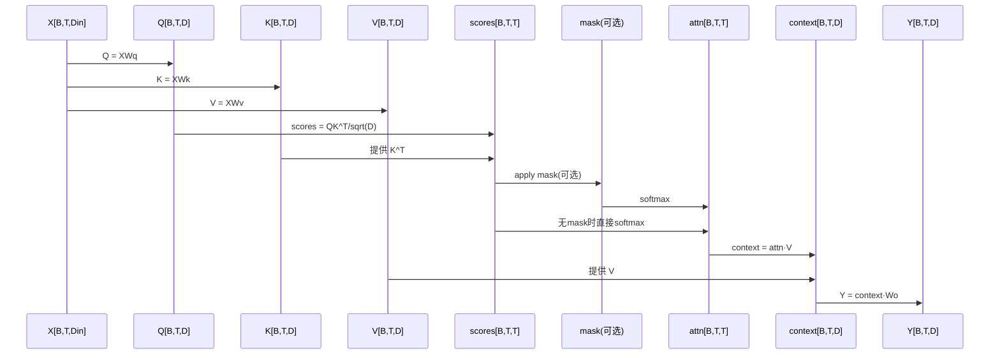
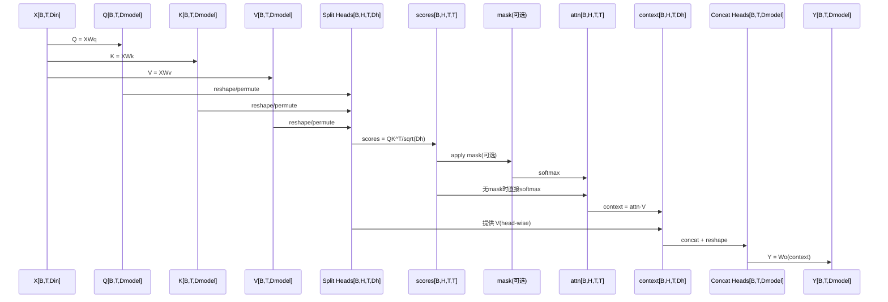

## Self-Attention

```mermaid
sequenceDiagram
    participant X as X[B,T,Din]
    participant Q as Q[B,T,D]
    participant K as K[B,T,D]
    participant V as V[B,T,D]
    participant S as scores[B,T,T]
    participant M as mask(可选)
    participant A as attn[B,T,T]
    participant C as context[B,T,D]
    participant Y as Y[B,T,D]

    X->>Q: Q = XWq
    X->>K: K = XWk
    X->>V: V = XWv

    Q->>S: scores = QK^T/sqrt(D)
    K->>S: 提供 K^T

    S->>M: apply mask(可选)
    M->>A: softmax
    S->>A: 无mask时直接softmax

    A->>C: context = attn·V
    V->>C: 提供 V

    C->>Y: Y = context·Wo
```

------

##  Multi-Head Attention

```mermaid
sequenceDiagram
    participant X as X[B,T,Din]
    participant Q as Q[B,T,Dmodel]
    participant K as K[B,T,Dmodel]
    participant V as V[B,T,Dmodel]
    participant Split as Split Heads[B,H,T,Dh]
    participant S as scores[B,H,T,T]
    participant M as mask(可选)
    participant A as attn[B,H,T,T]
    participant C as context[B,H,T,Dh]
    participant Merge as Concat Heads[B,T,Dmodel]
    participant Y as Y[B,T,Dmodel]

    X->>Q: Q = XWq
    X->>K: K = XWk
    X->>V: V = XWv

    Q->>Split: reshape/permute
    K->>Split: reshape/permute
    V->>Split: reshape/permute

    Split->>S: scores = QK^T/sqrt(Dh)
    S->>M: apply mask(可选)
    M->>A: softmax
    S->>A: 无mask时直接softmax

    A->>C: context = attn·V
    Split->>C: 提供 V(head-wise)

    C->>Merge: concat + reshape
    Merge->>Y: Y = Wo(context)
```

------

如果你想要我再给你一个 **严格按 token 展开版本**（比如 T=4，把每个 token 的注意力计算写出来），我也可以直接补一份 Mermaid。
