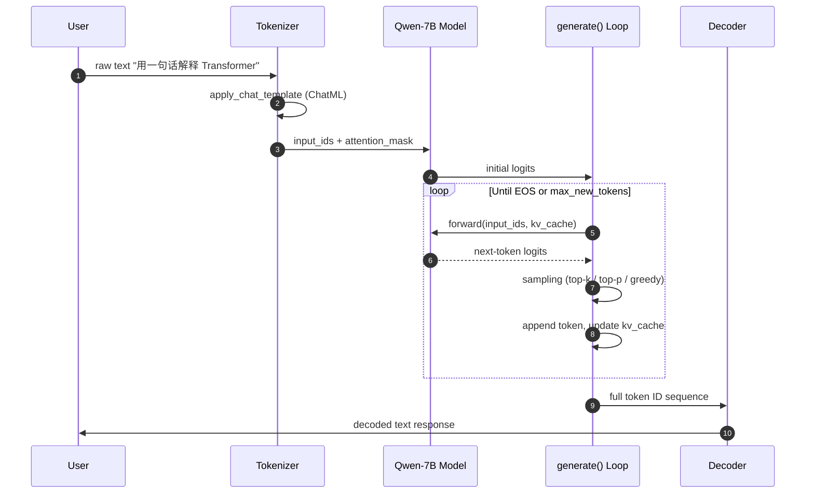
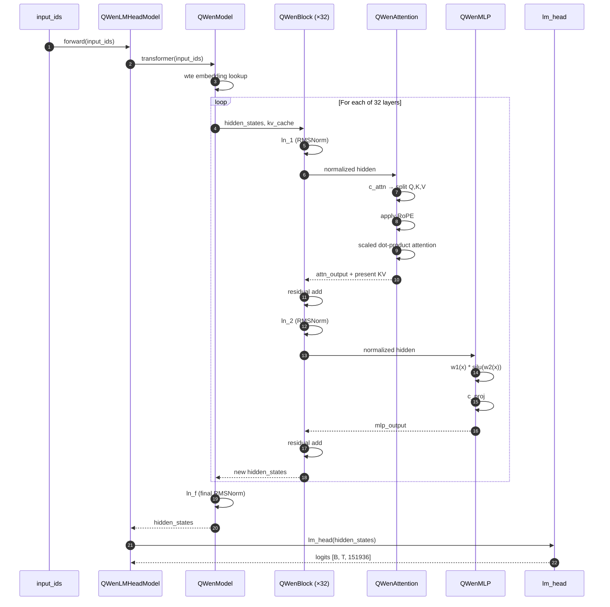
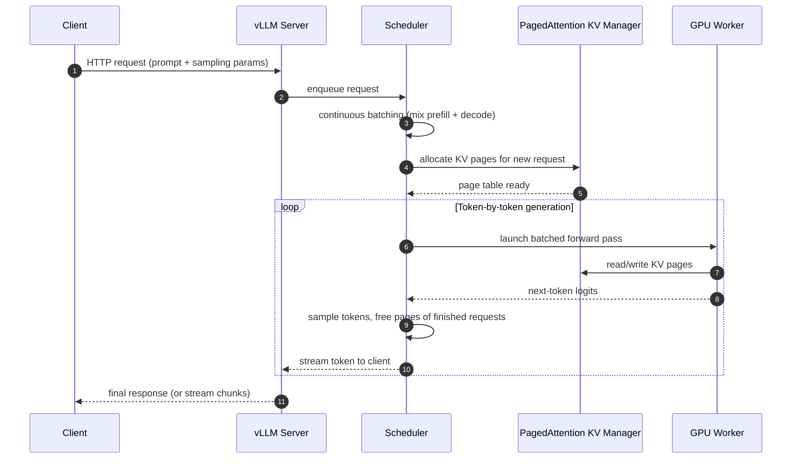

# Qwen(First Generation) Learning Notes

This note walks through the **6-step learning path** for the first-generation Qwen-7B, from understanding its model card to inference optimization and deployment.

<br>

## 1. Model Card (模型卡)

The model card is the **identity document (身份证)** of a model, telling you what it is, what it does, and how to use it before touching any code.

### 1) Key fields to check

| Field           | Qwen-7B Value                         | Meaning                                      |
| --------------- | ------------------------------------- | -------------------------------------------- |
| Model Type      | Causal LM (因果语言模型)              | Decoder-only, autoregressive generation      |
| Parameters      | 7B (~7.72 billion)                    | Total trainable parameters                   |
| Base / Instruct | Both released                         | `Qwen-7B` is base, `Qwen-7B-Chat` is aligned |
| Context Length  | 2048 → 8192 (extended)                | Maximum input sequence length                |
| Languages       | Chinese + English + multilingual      | Training data coverage                       |
| License         | Tongyi Qianwen License (通义千问许可) | Free for research, commercial needs approval |
| Architecture    | Transformer decoder + RoPE + RMSNorm  | Similar to LLaMA family                      |

### 2) High-level model positioning diagram

<svg xmlns="http://www.w3.org/2000/svg" viewBox="0 0 720 240" width="100%">   <rect x="10" y="10" width="700" height="220" rx="8" fill="#f8fafc" stroke="#cbd5e1"/>   <text x="360" y="35" text-anchor="middle" font-family="Arial" font-size="16" font-weight="bold" fill="#0f172a">Qwen-7B Identity Card</text>   <rect x="30"  y="55" width="150" height="70" rx="6" fill="#dbeafe" stroke="#3b82f6"/>   <text x="105" y="80" text-anchor="middle" font-family="Arial" font-size="12" font-weight="bold" fill="#1e3a8a">Architecture</text>   <text x="105" y="100" text-anchor="middle" font-family="Arial" font-size="11" fill="#1e3a8a">Decoder-only</text>   <text x="105" y="115" text-anchor="middle" font-family="Arial" font-size="11" fill="#1e3a8a">Causal LM</text>   <rect x="200" y="55" width="150" height="70" rx="6" fill="#dcfce7" stroke="#16a34a"/>   <text x="275" y="80" text-anchor="middle" font-family="Arial" font-size="12" font-weight="bold" fill="#14532d">Scale</text>   <text x="275" y="100" text-anchor="middle" font-family="Arial" font-size="11" fill="#14532d">7B params</text>   <text x="275" y="115" text-anchor="middle" font-family="Arial" font-size="11" fill="#14532d">2.2T–3T tokens</text>   <rect x="370" y="55" width="150" height="70" rx="6" fill="#fef3c7" stroke="#d97706"/>   <text x="445" y="80" text-anchor="middle" font-family="Arial" font-size="12" font-weight="bold" fill="#78350f">Context</text>   <text x="445" y="100" text-anchor="middle" font-family="Arial" font-size="11" fill="#78350f">2048 → 8192</text>   <text x="445" y="115" text-anchor="middle" font-family="Arial" font-size="11" fill="#78350f">RoPE-based</text>   <rect x="540" y="55" width="150" height="70" rx="6" fill="#fce7f3" stroke="#db2777"/>   <text x="615" y="80" text-anchor="middle" font-family="Arial" font-size="12" font-weight="bold" fill="#831843">Language</text>   <text x="615" y="100" text-anchor="middle" font-family="Arial" font-size="11" fill="#831843">CN + EN</text>   <text x="615" y="115" text-anchor="middle" font-family="Arial" font-size="11" fill="#831843">Multilingual</text>   <rect x="30"  y="145" width="320" height="70" rx="6" fill="#e0e7ff" stroke="#6366f1"/>   <text x="190" y="170" text-anchor="middle" font-family="Arial" font-size="12" font-weight="bold" fill="#312e81">Variants</text>   <text x="190" y="190" text-anchor="middle" font-family="Arial" font-size="11" fill="#312e81">Qwen-7B (base) · Qwen-7B-Chat (SFT + RLHF)</text>   <text x="190" y="205" text-anchor="middle" font-family="Arial" font-size="11" fill="#312e81">Released by Alibaba Cloud · Aug 2023</text>   <rect x="370" y="145" width="320" height="70" rx="6" fill="#cffafe" stroke="#0891b2"/>   <text x="530" y="170" text-anchor="middle" font-family="Arial" font-size="12" font-weight="bold" fill="#164e63">Key Techniques</text>   <text x="530" y="190" text-anchor="middle" font-family="Arial" font-size="11" fill="#164e63">RMSNorm · SwiGLU · RoPE · Flash-Attn</text>   <text x="530" y="205" text-anchor="middle" font-family="Arial" font-size="11" fill="#164e63">Dynamic NTK · LogN Attention Scaling</text> </svg>

```python
# Example: inspect model card metadata programmatically
from huggingface_hub import model_info

info = model_info("Qwen/Qwen-7B")
print("Model ID:", info.modelId)
print("Library:", info.library_name)
print("Tags:", info.tags[:6])
# Output:
# Model ID: Qwen/Qwen-7B
# Library: transformers
# Tags: ['pytorch', 'safetensors', 'qwen', 'text-generation', 'custom_code', 'zh']
```

The interview-ready summary: **Qwen-7B is a 7-billion-parameter decoder-only causal LM (解码器架构), pretrained on 2.2T–3T tokens of Chinese and English text by Alibaba Cloud in August 2023.**

<br>

## 2. Minimal Inference Code (最小推理代码)

The goal of this step is to **make the model actually output text** — connect tokenizer, model, and `generate` together, without caring about internals yet.

### 1) End-to-end inference sequence diagram



### 2) Running the chat model end-to-end

Because Qwen-7B used **custom modeling code (自定义模型代码)** before official Transformers integration, you must pass `trust_remote_code=True`.

```python
from transformers import AutoTokenizer, AutoModelForCausalLM
import torch

model_name = "Qwen/Qwen-7B-Chat"

# Load tokenizer and model with trust_remote_code for 1st-gen Qwen
tokenizer = AutoTokenizer.from_pretrained(model_name, trust_remote_code=True)
model = AutoModelForCausalLM.from_pretrained(
    model_name,
    device_map="auto",
    torch_dtype=torch.bfloat16,
    trust_remote_code=True,
).eval()

# 1st-gen Qwen exposes a high-level chat() helper
response, history = model.chat(
    tokenizer,
    "用一句话解释什么是 Transformer",
    history=None,
)
print(response)
# Output (example):
# Transformer 是一种基于自注意力机制的神经网络架构，
# 能够并行处理序列数据并捕捉长距离依赖关系。
```

The takeaway: **tokenizer encodes text → model runs forward → generate decodes back to text**, that is the entire inference loop.

<br>

## 3. Tokenizer and Chat Template (分词器与对话模板)

The tokenizer is the **bridge (桥梁)** between human text and model input IDs — Qwen uses a custom **tiktoken-based BPE tokenizer (字节对编码)** with a 151,936-token vocabulary.

### 1) Tokenization pipeline diagram

<svg xmlns="http://www.w3.org/2000/svg" viewBox="0 0 760 200" width="100%">   <rect x="5" y="5" width="750" height="190" rx="8" fill="#f8fafc" stroke="#cbd5e1"/>   <text x="380" y="30" text-anchor="middle" font-family="Arial" font-size="15" font-weight="bold" fill="#0f172a">Text → Token IDs → Model → Text</text>   <rect x="20"  y="55" width="100" height="60" rx="6" fill="#fee2e2" stroke="#dc2626"/>   <text x="70" y="80"  text-anchor="middle" font-family="Arial" font-size="12" font-weight="bold" fill="#7f1d1d">Raw Text</text>   <text x="70" y="100" text-anchor="middle" font-family="Arial" font-size="11" fill="#7f1d1d">"你好"</text>   <rect x="140" y="55" width="100" height="60" rx="6" fill="#fed7aa" stroke="#ea580c"/>   <text x="190" y="80"  text-anchor="middle" font-family="Arial" font-size="12" font-weight="bold" fill="#7c2d12">Chat Template</text>   <text x="190" y="100" text-anchor="middle" font-family="Arial" font-size="11" fill="#7c2d12">ChatML format</text>   <rect x="260" y="55" width="100" height="60" rx="6" fill="#fef3c7" stroke="#d97706"/>   <text x="310" y="80"  text-anchor="middle" font-family="Arial" font-size="12" font-weight="bold" fill="#78350f">Tokens</text>   <text x="310" y="100" text-anchor="middle" font-family="Arial" font-size="11" fill="#78350f">BPE subwords</text>   <rect x="380" y="55" width="100" height="60" rx="6" fill="#dcfce7" stroke="#16a34a"/>   <text x="430" y="80"  text-anchor="middle" font-family="Arial" font-size="12" font-weight="bold" fill="#14532d">Token IDs</text>   <text x="430" y="100" text-anchor="middle" font-family="Arial" font-size="11" fill="#14532d">[108386, ...]</text>   <rect x="500" y="55" width="100" height="60" rx="6" fill="#dbeafe" stroke="#3b82f6"/>   <text x="550" y="80"  text-anchor="middle" font-family="Arial" font-size="12" font-weight="bold" fill="#1e3a8a">Model</text>   <text x="550" y="100" text-anchor="middle" font-family="Arial" font-size="11" fill="#1e3a8a">forward()</text>   <rect x="620" y="55" width="120" height="60" rx="6" fill="#e0e7ff" stroke="#6366f1"/>   <text x="680" y="80"  text-anchor="middle" font-family="Arial" font-size="12" font-weight="bold" fill="#312e81">Logits</text>   <text x="680" y="100" text-anchor="middle" font-family="Arial" font-size="11" fill="#312e81">[B, T, vocab]</text>   <path d="M120 85 L140 85" stroke="#64748b" stroke-width="2" marker-end="url(#arrow1)"/>   <path d="M240 85 L260 85" stroke="#64748b" stroke-width="2" marker-end="url(#arrow1)"/>   <path d="M360 85 L380 85" stroke="#64748b" stroke-width="2" marker-end="url(#arrow1)"/>   <path d="M480 85 L500 85" stroke="#64748b" stroke-width="2" marker-end="url(#arrow1)"/>   <path d="M600 85 L620 85" stroke="#64748b" stroke-width="2" marker-end="url(#arrow1)"/>   <defs>     <marker id="arrow1" markerWidth="10" markerHeight="10" refX="8" refY="3" orient="auto">       <path d="M0,0 L0,6 L8,3 z" fill="#64748b"/>     </marker>   </defs>   <rect x="20"  y="140" width="720" height="45" rx="6" fill="#f1f5f9" stroke="#94a3b8"/>   <text x="380" y="160" text-anchor="middle" font-family="Arial" font-size="11" font-weight="bold" fill="#334155">Decode path (reverse): Logits → argmax/sample → Token IDs → Tokens → Text</text>   <text x="380" y="178" text-anchor="middle" font-family="Arial" font-size="10" fill="#64748b">Qwen tokenizer: tiktoken-based BPE, vocab size = 151,936, special tokens for ChatML roles</text> </svg>

### 2) Inspecting the tokenization pipeline

```python
from transformers import AutoTokenizer

tokenizer = AutoTokenizer.from_pretrained("Qwen/Qwen-7B-Chat", trust_remote_code=True)

text = "你好，Transformer 是什么？"
tokens = tokenizer.tokenize(text)
ids = tokenizer.encode(text)

print("Tokens:", tokens)
print("IDs:", ids)
print("Decoded:", tokenizer.decode(ids))
# Output:
# Tokens: ['你好', '，', 'Transformer', ' 是什么', '？']
# IDs: [108386, 3837, 8963, 110472, 11319]
# Decoded: 你好，Transformer 是什么？
```

### 3) ChatML template (对话模板)

First-gen Qwen-Chat uses the **ChatML format (聊天标记语言)** — wrapping each message with `<|im_start|>role` and `<|im_end|>` special tokens, so the model recognizes role boundaries.

```python
# Manually construct the ChatML prompt that Qwen-Chat expects
prompt = (
    "<|im_start|>system\nYou are a helpful assistant.<|im_end|>\n"
    "<|im_start|>user\n用一句话解释 Transformer<|im_end|>\n"
    "<|im_start|>assistant\n"
)

ids = tokenizer.encode(prompt)
print("Length:", len(ids))
print("First 10 IDs:", ids[:10])
# Output:
# Length: 30
# First 10 IDs: [151644, 8948, 198, 2610, 525, 264, 10950, 17847, 13, 151645]
```

The flow to memorize: **raw text → chat template → tokens → token IDs → input_ids + attention_mask → forward → logits → decode → text**.

<br>

## 4. config.json (模型配置文件)

`config.json` is the **architectural blueprint (架构蓝图)** — it tells you exactly how big the model is and where its parameters live, without reading any source code.

### 1) Parameter distribution diagram

<svg xmlns="http://www.w3.org/2000/svg" viewBox="0 0 720 260" width="100%">   <rect x="10" y="10" width="700" height="240" rx="8" fill="#f8fafc" stroke="#cbd5e1"/>   <text x="360" y="35" text-anchor="middle" font-family="Arial" font-size="15" font-weight="bold" fill="#0f172a">Qwen-7B Parameter Distribution (~7.72B total)</text>   <rect x="40"  y="60" width="80"  height="160" rx="4" fill="#dbeafe" stroke="#3b82f6"/>   <text x="80" y="240" text-anchor="middle" font-family="Arial" font-size="11" font-weight="bold" fill="#1e3a8a">Embedding</text>   <text x="80" y="50"  text-anchor="middle" font-family="Arial" font-size="10" fill="#1e3a8a">~0.62B (8%)</text>   <text x="80" y="145" text-anchor="middle" font-family="Arial" font-size="11" fill="#1e3a8a">wte</text>   <text x="80" y="160" text-anchor="middle" font-family="Arial" font-size="10" fill="#1e3a8a">151936×4096</text>   <rect x="150" y="65" width="160" height="155" rx="4" fill="#dcfce7" stroke="#16a34a"/>   <text x="230" y="240" text-anchor="middle" font-family="Arial" font-size="11" font-weight="bold" fill="#14532d">Attention (×32)</text>   <text x="230" y="55"  text-anchor="middle" font-family="Arial" font-size="10" fill="#14532d">~2.15B (28%)</text>   <text x="230" y="120" text-anchor="middle" font-family="Arial" font-size="11" fill="#14532d">c_attn (QKV)</text>   <text x="230" y="140" text-anchor="middle" font-family="Arial" font-size="11" fill="#14532d">c_proj (Out)</text>   <text x="230" y="170" text-anchor="middle" font-family="Arial" font-size="10" fill="#14532d">4 × hidden²</text>   <rect x="340" y="65" width="220" height="155" rx="4" fill="#fef3c7" stroke="#d97706"/>   <text x="450" y="240" text-anchor="middle" font-family="Arial" font-size="11" font-weight="bold" fill="#78350f">MLP / SwiGLU (×32)</text>   <text x="450" y="55"  text-anchor="middle" font-family="Arial" font-size="10" fill="#78350f">~4.33B (56%)</text>   <text x="450" y="120" text-anchor="middle" font-family="Arial" font-size="11" fill="#78350f">w1, w2, c_proj</text>   <text x="450" y="140" text-anchor="middle" font-family="Arial" font-size="11" fill="#78350f">hidden ↔ 11008</text>   <text x="450" y="170" text-anchor="middle" font-family="Arial" font-size="10" fill="#78350f">Largest contributor</text>   <rect x="590" y="60" width="80"  height="160" rx="4" fill="#fce7f3" stroke="#db2777"/>   <text x="630" y="240" text-anchor="middle" font-family="Arial" font-size="11" font-weight="bold" fill="#831843">LM Head</text>   <text x="630" y="50"  text-anchor="middle" font-family="Arial" font-size="10" fill="#831843">~0.62B (8%)</text>   <text x="630" y="145" text-anchor="middle" font-family="Arial" font-size="11" fill="#831843">lm_head</text>   <text x="630" y="160" text-anchor="middle" font-family="Arial" font-size="10" fill="#831843">4096×151936</text> </svg>

### 2) Key fields in Qwen-7B's config

```json
{
  "architectures": ["QWenLMHeadModel"],
  "model_type": "qwen",
  "hidden_size": 4096,
  "intermediate_size": 22016,
  "num_hidden_layers": 32,
  "num_attention_heads": 32,
  "kv_channels": 128,
  "vocab_size": 151936,
  "max_position_embeddings": 8192,
  "rotary_pct": 1.0,
  "rotary_emb_base": 10000,
  "layer_norm_epsilon": 1e-06,
  "use_flash_attn": "auto",
  "bf16": true
}
```

| Field                     | Meaning                                                      |
| ------------------------- | ------------------------------------------------------------ |
| `hidden_size`             | Per-token embedding dimension (隐藏层维度) — 4096            |
| `num_hidden_layers`       | Number of Transformer blocks (层数) — 32                     |
| `num_attention_heads`     | Multi-head attention heads (注意力头数) — 32, head_dim = 128 |
| `intermediate_size`       | MLP middle layer width (前馈层宽度) — 22016, split into w1 + w2 |
| `vocab_size`              | Tokenizer vocabulary size (词表大小) — 151,936               |
| `max_position_embeddings` | Maximum context length (上下文长度) — 8192                   |
| `rotary_emb_base`         | RoPE base frequency (旋转编码基数) — 10000                   |

### 3) Verifying the 7B parameter count

```python
# Rough parameter accounting for Qwen-7B
hidden = 4096
layers = 32
inter  = 22016 // 2   # Qwen MLP splits intermediate_size into w1 + w2
vocab  = 151936

embed  = vocab * hidden                              # ~622M
attn   = layers * (3 * hidden * hidden + hidden * hidden)   # ~2.15B
mlp    = layers * (2 * hidden * inter + inter * hidden)     # ~4.33B
head   = vocab * hidden                              # ~622M

total = embed + attn + mlp + head
print(f"Total params ≈ {total / 1e9:.2f}B")
# Output:
# Total params ≈ 7.72B
```

The interview answer: **Qwen-7B's 7B parameters come mostly from 32 Transformer blocks (~6.5B) plus embedding and LM head (~1.2B combined)**.

<br>

## 5. Modeling Source Code: forward Main Path (前向传播主线)

Don't read the whole `modeling_qwen.py` — only follow the **forward main path (前向主线)** through six key classes.

-   The PE of Qwen is not added to the input embedding, but is injected into the Q and K of attention through RoPE (rotation position encoding). Traditional absolute position encoding: after token embedding, x = token_embedding + position_embedding
-   

### 1) Full architecture diagram (color-block view)

<svg xmlns="http://www.w3.org/2000/svg" viewBox="0 0 760 670" width="100%">
  <rect x="5" y="5" width="750" height="660" rx="8" fill="#f8fafc" stroke="#cbd5e1"/>
  <text x="380" y="30" text-anchor="middle" font-family="Arial" font-size="16" font-weight="bold" fill="#0f172a">Qwen-7B Architecture (32 Decoder Layers)</text>
  <rect x="280" y="50" width="200" height="40" rx="6" fill="#fee2e2" stroke="#dc2626"/>
  <text x="380" y="75" text-anchor="middle" font-family="Arial" font-size="12" font-weight="bold" fill="#7f1d1d">input_ids  [B, T]</text>
  <path d="M380 90 L380 105" stroke="#64748b" stroke-width="2" marker-end="url(#a)"/>
  <rect x="280" y="105" width="200" height="40" rx="6" fill="#fed7aa" stroke="#ea580c"/>
  <text x="380" y="130" text-anchor="middle" font-family="Arial" font-size="12" font-weight="bold" fill="#7c2d12">wte (Embedding 151936×4096)</text>
  <path d="M380 145 L380 175" stroke="#64748b" stroke-width="2" marker-end="url(#a)"/>
  <rect x="40" y="180" width="680" height="400" rx="8" fill="#fffbeb" stroke="#f59e0b" stroke-dasharray="5,3"/>
  <text x="380" y="200" text-anchor="middle" font-family="Arial" font-size="13" font-weight="bold" fill="#78350f">QWenBlock × 32 layers</text>
  <circle cx="380" cy="215" r="4" fill="#64748b"/>
  <text x="395" y="219" font-family="Arial" font-size="10" fill="#475569">x</text>
  <path d="M380 215 L640 215 L640 365 L392 365" stroke="#dc2626" stroke-width="2" fill="none" stroke-dasharray="6,3" marker-end="url(#redArrow)"/>
  <text x="650" y="290" font-family="Arial" font-size="11" font-weight="bold" fill="#dc2626">residual 1</text>
  <text x="650" y="305" font-family="Arial" font-size="9" fill="#dc2626">(skip ln_1 + attn)</text>
  <path d="M380 219 L380 235" stroke="#64748b" stroke-width="2" marker-end="url(#a)"/>
  <rect x="280" y="235" width="200" height="35" rx="5" fill="#dbeafe" stroke="#3b82f6"/>
  <text x="380" y="258" text-anchor="middle" font-family="Arial" font-size="11" font-weight="bold" fill="#1e3a8a">ln_1: RMSNorm</text>
  <path d="M380 270 L380 285" stroke="#64748b" stroke-width="2" marker-end="url(#a)"/>
  <rect x="180" y="285" width="400" height="80" rx="6" fill="#dcfce7" stroke="#16a34a"/>
  <text x="380" y="305" text-anchor="middle" font-family="Arial" font-size="12" font-weight="bold" fill="#14532d">QWenAttention (Self-Attention)</text>
  <rect x="200" y="315" width="110" height="40" rx="4" fill="#bbf7d0" stroke="#15803d"/>
  <text x="255" y="338" text-anchor="middle" font-family="Arial" font-size="10" font-weight="bold" fill="#14532d">c_attn (QKV)</text>
  <rect x="325" y="315" width="110" height="40" rx="4" fill="#bbf7d0" stroke="#15803d"/>
  <text x="380" y="333" text-anchor="middle" font-family="Arial" font-size="10" font-weight="bold" fill="#14532d">RoPE + Attn</text>
  <text x="380" y="347" text-anchor="middle" font-family="Arial" font-size="9" fill="#14532d">+ KV cache</text>
  <rect x="450" y="315" width="110" height="40" rx="4" fill="#bbf7d0" stroke="#15803d"/>
  <text x="505" y="338" text-anchor="middle" font-family="Arial" font-size="10" font-weight="bold" fill="#14532d">c_proj (Out)</text>
  <path d="M380 365 L380 358" stroke="#64748b" stroke-width="2"/>
  <circle cx="380" cy="375" r="12" fill="#fde68a" stroke="#d97706" stroke-width="2"/>
  <text x="380" y="380" text-anchor="middle" font-family="Arial" font-size="14" font-weight="bold" fill="#78350f">+</text>
  <path d="M380 387 L380 405" stroke="#64748b" stroke-width="2" marker-end="url(#a)"/>
  <circle cx="380" cy="412" r="4" fill="#64748b"/>
  <path d="M380 412 L120 412 L120 555 L368 555" stroke="#2563eb" stroke-width="2" fill="none" stroke-dasharray="6,3" marker-end="url(#blueArrow)"/>
  <text x="60" y="478" font-family="Arial" font-size="11" font-weight="bold" fill="#2563eb">residual 2</text>
  <text x="60" y="493" font-family="Arial" font-size="9" fill="#2563eb">(skip ln_2 + mlp)</text>
  <path d="M380 416 L380 432" stroke="#64748b" stroke-width="2" marker-end="url(#a)"/>
  <rect x="280" y="432" width="200" height="35" rx="5" fill="#dbeafe" stroke="#3b82f6"/>
  <text x="380" y="455" text-anchor="middle" font-family="Arial" font-size="11" font-weight="bold" fill="#1e3a8a">ln_2: RMSNorm</text>
  <path d="M380 467 L380 482" stroke="#64748b" stroke-width="2" marker-end="url(#a)"/>
  <rect x="200" y="482" width="360" height="70" rx="6" fill="#fef3c7" stroke="#d97706"/>
  <text x="380" y="502" text-anchor="middle" font-family="Arial" font-size="12" font-weight="bold" fill="#78350f">QWenMLP (SwiGLU)</text>
  <rect x="215" y="510" width="100" height="35" rx="4" fill="#fde68a" stroke="#b45309"/>
  <text x="265" y="532" text-anchor="middle" font-family="Arial" font-size="10" font-weight="bold" fill="#78350f">w1 (gate)</text>
  <rect x="325" y="510" width="110" height="35" rx="4" fill="#fde68a" stroke="#b45309"/>
  <text x="380" y="526" text-anchor="middle" font-family="Arial" font-size="10" font-weight="bold" fill="#78350f">w1 * silu(w2)</text>
  <text x="380" y="539" text-anchor="middle" font-family="Arial" font-size="9" fill="#78350f">SwiGLU</text>
  <rect x="445" y="510" width="100" height="35" rx="4" fill="#fde68a" stroke="#b45309"/>
  <text x="495" y="532" text-anchor="middle" font-family="Arial" font-size="10" font-weight="bold" fill="#78350f">c_proj (down)</text>
  <path d="M380 552 L380 548" stroke="#64748b" stroke-width="2"/>
  <circle cx="380" cy="565" r="12" fill="#fde68a" stroke="#d97706" stroke-width="2"/>
  <text x="380" y="570" text-anchor="middle" font-family="Arial" font-size="14" font-weight="bold" fill="#78350f">+</text>
  <path d="M380 577 L380 595" stroke="#64748b" stroke-width="2" marker-end="url(#a)"/>
  <rect x="280" y="595" width="200" height="28" rx="5" fill="#dbeafe" stroke="#3b82f6"/>
  <text x="380" y="614" text-anchor="middle" font-family="Arial" font-size="11" font-weight="bold" fill="#1e3a8a">ln_f: final RMSNorm</text>
  <path d="M380 623 L380 633" stroke="#64748b" stroke-width="2" marker-end="url(#a)"/>
  <rect x="280" y="633" width="200" height="22" rx="5" fill="#fce7f3" stroke="#db2777"/>
  <text x="380" y="649" text-anchor="middle" font-family="Arial" font-size="11" font-weight="bold" fill="#831843">lm_head → logits [B, T, 151936]</text>
  <defs>
    <marker id="a" markerWidth="10" markerHeight="10" refX="8" refY="3" orient="auto">
      <path d="M0,0 L0,6 L8,3 z" fill="#64748b"/>
    </marker>
    <marker id="redArrow" markerWidth="10" markerHeight="10" refX="8" refY="3" orient="auto">
      <path d="M0,0 L0,6 L8,3 z" fill="#dc2626"/>
    </marker>
    <marker id="blueArrow" markerWidth="10" markerHeight="10" refX="8" refY="3" orient="auto">
      <path d="M0,0 L0,6 L8,3 z" fill="#2563eb"/>
    </marker>
  </defs>
</svg>
-   Input: `input_ids [B, T]`. Example: `B=2`, `T=5`, so the input shape is `[2, 5]`.
-   Embedding: `wte (151936 × 4096)` maps each token ID to a 4096-dimensional vector: `[2, 5] → [2, 5, 4096]`.
-   Enter QWenBlock 1: input `x` has shape `[2, 5, 4096]`.
-   `ln_1: RMSNorm`: normalizes values, shape unchanged: `[2, 5, 4096] → [2, 5, 4096]`.
-   `c_attn: QKV`: creates Query, Key, Value. Each can be viewed as `[2, 5, 4096]`.
-   `RoPE + Attention`: RoPE adds position information to Q and K. Attention lets each token look at previous tokens. Output shape stays `[2, 5, 4096]`.
-   `KV cache`: during generation, old K and V are saved. For example, after 5 tokens, when generating token 6, the model only computes the new token’s QKV and reuses the first 5 tokens’ K and V.
-   `c_proj`: projects attention output back to hidden size: `[2, 5, 4096] → [2, 5, 4096]`.
-   Residual 1: add the original `x` back: `[2, 5, 4096] + [2, 5, 4096] = [2, 5, 4096]`.
-   `ln_2: RMSNorm`: normalizes again, shape unchanged: `[2, 5, 4096] → [2, 5, 4096]`.
-   `MLP: SwiGLU`: expands hidden size, for example from `4096` to about `11008`. Two branches are created: `w1(x) [2, 5, 11008]` and `w2(x) [2, 5, 11008]`.
-   Gate: compute `silu(w1(x)) * w2(x)`. Shape stays `[2, 5, 11008]`.
-   `c_proj down`: projects back to 4096: `[2, 5, 11008] → [2, 5, 4096]`.
-   Residual 2: add the MLP input back: `[2, 5, 4096] + [2, 5, 4096] = [2, 5, 4096]`.
-   One QWenBlock ends: output shape is still `[2, 5, 4096]`.
-   Repeat 32 layers: shape stays `[2, 5, 4096]`, but the token vectors become richer after each layer.
-   `ln_f: final RMSNorm`: final normalization after all 32 layers: `[2, 5, 4096] → [2, 5, 4096]`.
-   `lm_head`: maps hidden vectors to vocabulary scores: `[2, 5, 4096] → [2, 5, 151936]`.
-   Next-token prediction: use the last position `logits[:, -1, :]`, shape `[2, 151936]`. Each row gives scores for all 151936 possible next tokens.


### 2) Class hierarchy and reading order

```text
QWenLMHeadModel.forward          # top-level wrapper, computes logits + loss
   └─ QWenModel.forward          # embedding + stacked blocks + final norm
        └─ QWenBlock.forward     # one Transformer layer
             ├─ QWenAttention    # self-attention with RoPE + KV cache
             └─ QWenMLP          # SwiGLU feed-forward
        └─ RMSNorm               # final layer normalization
```

### 3) Forward call sequence (mermaid)



### 4) Minimal forward demonstration

```python
import torch
from transformers import AutoTokenizer, AutoModelForCausalLM

tokenizer = AutoTokenizer.from_pretrained("Qwen/Qwen-7B-Chat", trust_remote_code=True)
model = AutoModelForCausalLM.from_pretrained(
    "Qwen/Qwen-7B-Chat",
    device_map="auto",
    torch_dtype=torch.bfloat16,
    trust_remote_code=True,
).eval()

inputs = tokenizer("Hello world", return_tensors="pt").to(model.device)

with torch.no_grad():
    out = model(**inputs, output_hidden_states=True)

print("Logits shape:", out.logits.shape)
print("Number of hidden states:", len(out.hidden_states))
print("Per-layer hidden shape:", out.hidden_states[0].shape)
# Output:
# Logits shape: torch.Size([1, 2, 151936])
# Number of hidden states: 33   (embedding + 32 layers)
# Per-layer hidden shape: torch.Size([1, 2, 4096])
```

The mental model: **every Transformer is just "Norm → Attention → residual → Norm → MLP → residual" repeated N times**, everything else is bookkeeping.

<br>

## 6. Inference Optimization and Deployment (推理优化与部署)

Once you understand how the model runs, the final step is making it run **fast and at scale** — this is where engineering, not modeling, matters.

### 1) Deployment landscape diagram

<svg xmlns="http://www.w3.org/2000/svg" viewBox="0 0 720 300" width="100%">   <rect x="10" y="10" width="700" height="280" rx="8" fill="#f8fafc" stroke="#cbd5e1"/>   <text x="360" y="35" text-anchor="middle" font-family="Arial" font-size="15" font-weight="bold" fill="#0f172a">Qwen-7B Deployment Routes</text>   <rect x="30"  y="55" width="200" height="100" rx="6" fill="#dbeafe" stroke="#3b82f6"/>   <text x="130" y="78" text-anchor="middle" font-family="Arial" font-size="12" font-weight="bold" fill="#1e3a8a">Research / Experiment</text>   <text x="130" y="100" text-anchor="middle" font-family="Arial" font-size="11" fill="#1e3a8a">Transformers</text>   <text x="130" y="118" text-anchor="middle" font-family="Arial" font-size="10" fill="#1e3a8a">Reference implementation</text>   <text x="130" y="135" text-anchor="middle" font-family="Arial" font-size="10" fill="#1e3a8a">Flexible, slow throughput</text>   <rect x="260" y="55" width="200" height="100" rx="6" fill="#dcfce7" stroke="#16a34a"/>   <text x="360" y="78" text-anchor="middle" font-family="Arial" font-size="12" font-weight="bold" fill="#14532d">High-Throughput Serving</text>   <text x="360" y="100" text-anchor="middle" font-family="Arial" font-size="11" fill="#14532d">vLLM / TensorRT-LLM</text>   <text x="360" y="118" text-anchor="middle" font-family="Arial" font-size="10" fill="#14532d">PagedAttention</text>   <text x="360" y="135" text-anchor="middle" font-family="Arial" font-size="10" fill="#14532d">Continuous batching</text>   <rect x="490" y="55" width="200" height="100" rx="6" fill="#fef3c7" stroke="#d97706"/>   <text x="590" y="78" text-anchor="middle" font-family="Arial" font-size="12" font-weight="bold" fill="#78350f">Local / Edge</text>   <text x="590" y="100" text-anchor="middle" font-family="Arial" font-size="11" fill="#78350f">llama.cpp / Ollama</text>   <text x="590" y="118" text-anchor="middle" font-family="Arial" font-size="10" fill="#78350f">GGUF quantization</text>   <text x="590" y="135" text-anchor="middle" font-family="Arial" font-size="10" fill="#78350f">CPU/GPU friendly</text>   <rect x="30" y="175" width="660" height="100" rx="6" fill="#fce7f3" stroke="#db2777"/>   <text x="360" y="197" text-anchor="middle" font-family="Arial" font-size="12" font-weight="bold" fill="#831843">Core Optimization Techniques</text>   <rect x="50"  y="210" width="120" height="50" rx="4" fill="#fbcfe8" stroke="#be185d"/>   <text x="110" y="230" text-anchor="middle" font-family="Arial" font-size="10" font-weight="bold" fill="#831843">KV Cache</text>   <text x="110" y="248" text-anchor="middle" font-family="Arial" font-size="9" fill="#831843">Skip recompute</text>   <rect x="180" y="210" width="120" height="50" rx="4" fill="#fbcfe8" stroke="#be185d"/>   <text x="240" y="230" text-anchor="middle" font-family="Arial" font-size="10" font-weight="bold" fill="#831843">FlashAttention</text>   <text x="240" y="248" text-anchor="middle" font-family="Arial" font-size="9" fill="#831843">Tile in SRAM</text>   <rect x="310" y="210" width="120" height="50" rx="4" fill="#fbcfe8" stroke="#be185d"/>   <text x="370" y="230" text-anchor="middle" font-family="Arial" font-size="10" font-weight="bold" fill="#831843">Quantization</text>   <text x="370" y="248" text-anchor="middle" font-family="Arial" font-size="9" fill="#831843">INT4/8 GPTQ AWQ</text>   <rect x="440" y="210" width="120" height="50" rx="4" fill="#fbcfe8" stroke="#be185d"/>   <text x="500" y="230" text-anchor="middle" font-family="Arial" font-size="10" font-weight="bold" fill="#831843">Tensor Parallel</text>   <text x="500" y="248" text-anchor="middle" font-family="Arial" font-size="9" fill="#831843">Shard hidden dim</text>   <rect x="570" y="210" width="100" height="50" rx="4" fill="#fbcfe8" stroke="#be185d"/>   <text x="620" y="230" text-anchor="middle" font-family="Arial" font-size="10" font-weight="bold" fill="#831843">Pipeline Par.</text>   <text x="620" y="248" text-anchor="middle" font-family="Arial" font-size="9" fill="#831843">Shard layers</text> </svg>

### 2) Common deployment routes

| Tool             | Best For                | Key Feature                                       |
| ---------------- | ----------------------- | ------------------------------------------------- |
| **Transformers** | Research, experiments   | Reference implementation (参考实现)               |
| **vLLM**         | High-throughput serving | PagedAttention (分页注意力) + continuous batching |
| **TensorRT-LLM** | NVIDIA GPU production   | Kernel fusion (算子融合) + FP8                    |
| **llama.cpp**    | Local CPU/GPU inference | GGUF quantization (量化格式)                      |
| **Ollama**       | Local API wrapper       | Model management + REST API                       |
| **ONNX Runtime** | Cross-platform          | Hardware-agnostic backend                         |

### 3) Inference request lifecycle (mermaid)



### 4) Core optimization concepts

| Concept             | Chinese    | Purpose                                                 |
| ------------------- | ---------- | ------------------------------------------------------- |
| KV Cache            | 键值缓存   | Reuse past attention keys/values, avoid recomputation   |
| Continuous Batching | 连续批处理 | Pack requests of different lengths dynamically          |
| PagedAttention      | 分页注意力 | Manage KV cache like OS virtual memory pages            |
| FlashAttention      | 闪存注意力 | Tile attention to fit in SRAM, fewer HBM reads          |
| Tensor Parallel     | 张量并行   | Split weights across GPUs along hidden dim              |
| Pipeline Parallel   | 流水线并行 | Split layers across GPUs, pass activations sequentially |
| Quantization        | 量化       | INT8 / INT4 / GPTQ / AWQ / GGUF — shrink weights        |

### 5) Running Qwen-7B with vLLM

```python
# vLLM example: high-throughput serving of Qwen-7B-Chat
from vllm import LLM, SamplingParams

llm = LLM(
    model="Qwen/Qwen-7B-Chat",
    trust_remote_code=True,
    dtype="bfloat16",
    tensor_parallel_size=1,   # use 2/4/8 for multi-GPU TP
)

sampling = SamplingParams(temperature=0.7, max_tokens=64)
prompts = ["用一句话解释 Transformer", "What is RoPE?"]

outputs = llm.generate(prompts, sampling)
for o in outputs:
    print(o.outputs[0].text)
# Output (example):
# Transformer 是一种依靠自注意力机制并行处理序列的神经网络架构...
# RoPE (Rotary Position Embedding) injects position info by rotating Q/K vectors...
```

The takeaway: **Transformers is for understanding, vLLM is for serving** — same weights, very different runtime behavior.

<br>

# Summary: The 6-Step Learning Path

One-sentence recap of the full path for any HuggingFace model, using Qwen-7B as the running example:

>   **Read the model card → run minimal inference → inspect tokenizer & chat template → study `config.json` → follow the `forward` main path → finally learn optimization and deployment.**

<br>
