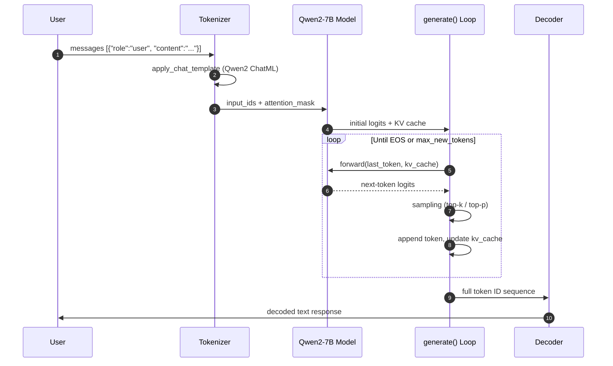
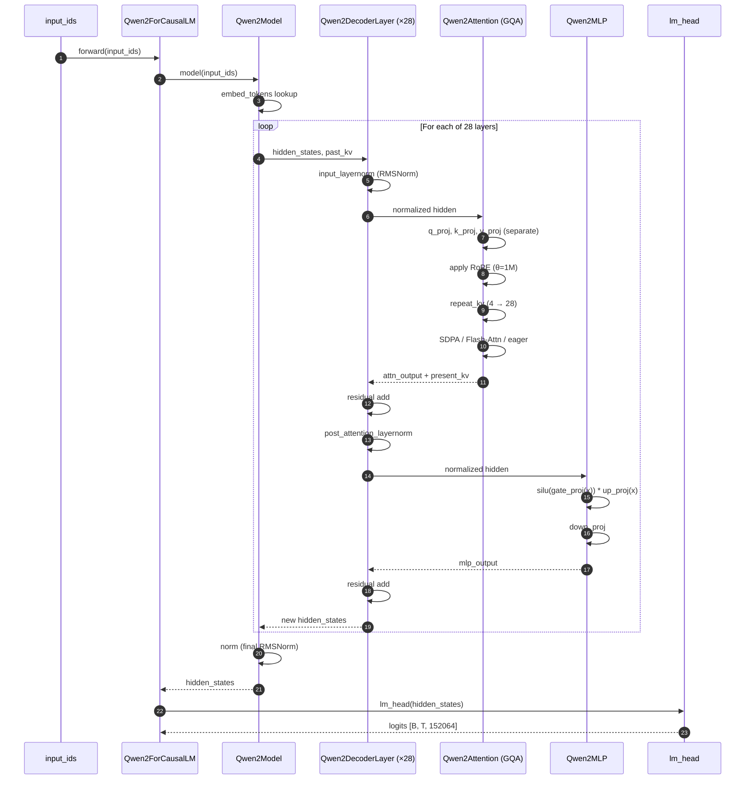
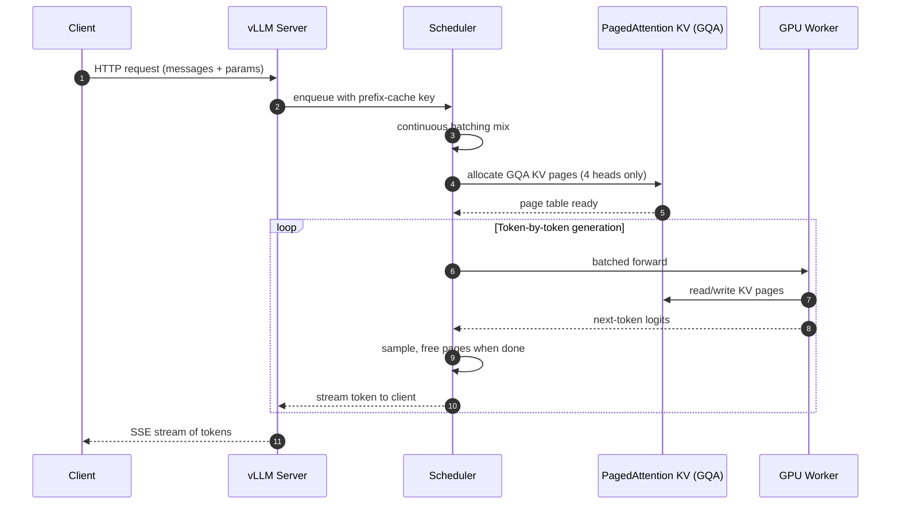

# Qwen2-7B Learning Notes

This note walks through the **6-step learning path** for **Qwen2-7B**, the representative model of the second-generation Qwen series, released in June 2024. https://huggingface.co/Qwen/Qwen2-7B

https://github.com/huggingface/transformers/blob/main/src/transformers/models/qwen2/modeling_qwen2.py?utm_source=chatgpt.com

<br>

## 1. Model Card (模型卡)

Qwen2-7B is the **mainstream 7B dense model (稠密模型)** of the Qwen2 family, introducing GQA, longer context, and YARN-based extension over the first generation.

### 1) Key fields to check

| Field           | Qwen2-7B Value                         | Meaning                                            |
| --------------- | -------------------------------------- | -------------------------------------------------- |
| Model Type      | Causal LM (因果语言模型)               | Decoder-only autoregressive generation             |
| Parameters      | 7.07B total / 5.98B non-embedding      | Total trainable parameters                         |
| Base / Instruct | Both released                          | `Qwen2-7B` is base, `Qwen2-7B-Instruct` is aligned |
| Context Length  | 32K natively, 131K with YARN           | Long-context support (长上下文)                    |
| Languages       | 27+ languages including CN, EN, JA, KO | Expanded multilingual coverage                     |
| License         | Apache 2.0 (mostly)                    | Permissive open-source license                     |
| Architecture    | RoPE + SwiGLU + RMSNorm + GQA          | Modern dense Transformer                           |

### 2) Qwen2 family positioning

<svg xmlns="http://www.w3.org/2000/svg" viewBox="0 0 720 240" width="100%">   <rect x="10" y="10" width="700" height="220" rx="8" fill="#f8fafc" stroke="#cbd5e1"/>   <text x="360" y="35" text-anchor="middle" font-family="Arial" font-size="16" font-weight="bold" fill="#0f172a">Qwen2-7B Identity Card</text>   <rect x="30"  y="55" width="150" height="70" rx="6" fill="#dbeafe" stroke="#3b82f6"/>   <text x="105" y="80" text-anchor="middle" font-family="Arial" font-size="12" font-weight="bold" fill="#1e3a8a">Architecture</text>   <text x="105" y="100" text-anchor="middle" font-family="Arial" font-size="11" fill="#1e3a8a">Decoder-only</text>   <text x="105" y="115" text-anchor="middle" font-family="Arial" font-size="11" fill="#1e3a8a">GQA + RoPE</text>   <rect x="200" y="55" width="150" height="70" rx="6" fill="#dcfce7" stroke="#16a34a"/>   <text x="275" y="80" text-anchor="middle" font-family="Arial" font-size="12" font-weight="bold" fill="#14532d">Scale</text>   <text x="275" y="100" text-anchor="middle" font-family="Arial" font-size="11" fill="#14532d">7.07B params</text>   <text x="275" y="115" text-anchor="middle" font-family="Arial" font-size="11" fill="#14532d">7T tokens</text>   <rect x="370" y="55" width="150" height="70" rx="6" fill="#fef3c7" stroke="#d97706"/>   <text x="445" y="80" text-anchor="middle" font-family="Arial" font-size="12" font-weight="bold" fill="#78350f">Context</text>   <text x="445" y="100" text-anchor="middle" font-family="Arial" font-size="11" fill="#78350f">32K → 131K</text>   <text x="445" y="115" text-anchor="middle" font-family="Arial" font-size="11" fill="#78350f">YARN extension</text>   <rect x="540" y="55" width="150" height="70" rx="6" fill="#fce7f3" stroke="#db2777"/>   <text x="615" y="80" text-anchor="middle" font-family="Arial" font-size="12" font-weight="bold" fill="#831843">Languages</text>   <text x="615" y="100" text-anchor="middle" font-family="Arial" font-size="11" fill="#831843">27+ languages</text>   <text x="615" y="115" text-anchor="middle" font-family="Arial" font-size="11" fill="#831843">CN/EN focused</text>   <rect x="30"  y="145" width="320" height="70" rx="6" fill="#e0e7ff" stroke="#6366f1"/>   <text x="190" y="170" text-anchor="middle" font-family="Arial" font-size="12" font-weight="bold" fill="#312e81">Family Sizes</text>   <text x="190" y="190" text-anchor="middle" font-family="Arial" font-size="11" fill="#312e81">0.5B · 1.5B · 7B · 57B-A14B (MoE) · 72B</text>   <text x="190" y="205" text-anchor="middle" font-family="Arial" font-size="11" fill="#312e81">Released by Alibaba Cloud · Jun 2024</text>   <rect x="370" y="145" width="320" height="70" rx="6" fill="#cffafe" stroke="#0891b2"/>   <text x="530" y="170" text-anchor="middle" font-family="Arial" font-size="12" font-weight="bold" fill="#164e63">New vs Qwen1</text>   <text x="530" y="190" text-anchor="middle" font-family="Arial" font-size="11" fill="#164e63">GQA · Separate Q/K/V · 32K context</text>   <text x="530" y="205" text-anchor="middle" font-family="Arial" font-size="11" fill="#164e63">Native Transformers integration</text> </svg>

```python
# Example: inspect model card metadata programmatically
from huggingface_hub import model_info

info = model_info("Qwen/Qwen2-7B-Instruct")
print("Model ID:", info.modelId)
print("Library:", info.library_name)
print("Tags:", info.tags[:6])
# Output:
# Model ID: Qwen/Qwen2-7B-Instruct
# Library: transformers
# Tags: ['pytorch', 'safetensors', 'qwen2', 'text-generation', 'conversational', 'en']
```

The interview-ready summary: **Qwen2-7B is a 7B decoder-only causal LM with Grouped-Query Attention (分组查询注意力), 32K native context, and native Transformers support — released June 2024.**

<br>

## 2. Minimal Inference Code (最小推理代码)

The goal: connect tokenizer, model, and `generate` together — Qwen2 is **natively integrated (原生集成)** in Transformers, ==no `trust_remote_code` needed.==

### 1) End-to-end inference sequence diagram



### 2) Standard Transformers usage

```python
from transformers import AutoTokenizer, AutoModelForCausalLM
import torch

model_name = "Qwen/Qwen2-7B-Instruct"

# No trust_remote_code needed for Qwen2 (native integration)

tokenizer = AutoTokenizer.from_pretrained(model_name)
model = AutoModelForCausalLM.from_pretrained(
    model_name,
    device_map="auto",
    torch_dtype=torch.bfloat16,
).eval()

messages = [
    {"role": "system", "content": "You are a helpful assistant."},
    {"role": "user", "content": "用一句话解释什么是 GQA"},
]

text = tokenizer.apply_chat_template(
    messages, tokenize=False, add_generation_prompt=True
)
inputs = tokenizer(text, return_tensors="pt").to(model.device)

outputs = model.generate(**inputs, max_new_tokens=128)
response = tokenizer.decode(
    outputs[0][inputs["input_ids"].shape[1]:],
    skip_special_tokens=True,
)
print(response)
# Output (example):
# GQA (Grouped-Query Attention) 是一种注意力机制，
# 让多个 Query 头共享同一组 Key/Value 头，
# 在保持效果的同时显著减少 KV 缓存的显存占用。
```

#### .eval()

1）**Disables Dropout**
 Dropout is used during training for randomness. In inference, it should be turned off.

2）**Uses inference behavior for certain layers**
 For example, BatchNorm would use stored statistics instead of batch statistics. Qwen2 mainly uses RMSNorm, so this is less relevant here.

3）**Makes output more stable**
 The model behaves as an inference model instead of a training model.


The takeaway: **Qwen2 dropped the custom `model.chat()` API** — everything goes through standard `apply_chat_template` + `generate`.

<br>

## 3. Tokenizer and Chat Template (分词器与对话模板)

Qwen2 uses a **BBPE tokenizer (字节级BPE)** with a 151,936-token vocab, fully compatible with the HuggingFace `tokenizers` library — no custom tiktoken wrapper.

### 1) Tokenization pipeline diagram

<svg xmlns="http://www.w3.org/2000/svg" viewBox="0 0 760 200" width="100%">   <rect x="5" y="5" width="750" height="190" rx="8" fill="#f8fafc" stroke="#cbd5e1"/>   <text x="380" y="30" text-anchor="middle" font-family="Arial" font-size="15" font-weight="bold" fill="#0f172a">Text → Token IDs → Model → Text</text>   <rect x="20"  y="55" width="100" height="60" rx="6" fill="#fee2e2" stroke="#dc2626"/>   <text x="70" y="80"  text-anchor="middle" font-family="Arial" font-size="12" font-weight="bold" fill="#7f1d1d">Raw Text</text>   <text x="70" y="100" text-anchor="middle" font-family="Arial" font-size="11" fill="#7f1d1d">"你好"</text>   <rect x="140" y="55" width="100" height="60" rx="6" fill="#fed7aa" stroke="#ea580c"/>   <text x="190" y="80"  text-anchor="middle" font-family="Arial" font-size="12" font-weight="bold" fill="#7c2d12">Chat Template</text>   <text x="190" y="100" text-anchor="middle" font-family="Arial" font-size="11" fill="#7c2d12">Jinja2 ChatML</text>   <rect x="260" y="55" width="100" height="60" rx="6" fill="#fef3c7" stroke="#d97706"/>   <text x="310" y="80"  text-anchor="middle" font-family="Arial" font-size="12" font-weight="bold" fill="#78350f">BBPE Tokens</text>   <text x="310" y="100" text-anchor="middle" font-family="Arial" font-size="11" fill="#78350f">Byte-level BPE</text>   <rect x="380" y="55" width="100" height="60" rx="6" fill="#dcfce7" stroke="#16a34a"/>   <text x="430" y="80"  text-anchor="middle" font-family="Arial" font-size="12" font-weight="bold" fill="#14532d">Token IDs</text>   <text x="430" y="100" text-anchor="middle" font-family="Arial" font-size="11" fill="#14532d">vocab=151936</text>   <rect x="500" y="55" width="100" height="60" rx="6" fill="#dbeafe" stroke="#3b82f6"/>   <text x="550" y="80"  text-anchor="middle" font-family="Arial" font-size="12" font-weight="bold" fill="#1e3a8a">Model</text>   <text x="550" y="100" text-anchor="middle" font-family="Arial" font-size="11" fill="#1e3a8a">forward()</text>   <rect x="620" y="55" width="120" height="60" rx="6" fill="#e0e7ff" stroke="#6366f1"/>   <text x="680" y="80"  text-anchor="middle" font-family="Arial" font-size="12" font-weight="bold" fill="#312e81">Logits</text>   <text x="680" y="100" text-anchor="middle" font-family="Arial" font-size="11" fill="#312e81">[B, T, 151936]</text>   <path d="M120 85 L140 85" stroke="#64748b" stroke-width="2" marker-end="url(#a2)"/>   <path d="M240 85 L260 85" stroke="#64748b" stroke-width="2" marker-end="url(#a2)"/>   <path d="M360 85 L380 85" stroke="#64748b" stroke-width="2" marker-end="url(#a2)"/>   <path d="M480 85 L500 85" stroke="#64748b" stroke-width="2" marker-end="url(#a2)"/>   <path d="M600 85 L620 85" stroke="#64748b" stroke-width="2" marker-end="url(#a2)"/>   <defs>     <marker id="a2" markerWidth="10" markerHeight="10" refX="8" refY="3" orient="auto">       <path d="M0,0 L0,6 L8,3 z" fill="#64748b"/>     </marker>   </defs>   <rect x="20"  y="140" width="720" height="45" rx="6" fill="#f1f5f9" stroke="#94a3b8"/>   <text x="380" y="160" text-anchor="middle" font-family="Arial" font-size="11" font-weight="bold" fill="#334155">Qwen2 chat template: shipped as Jinja2 string in tokenizer_config.json</text>   <text x="380" y="178" text-anchor="middle" font-family="Arial" font-size="10" fill="#64748b">Special tokens: &lt;|im_start|&gt; (151644), &lt;|im_end|&gt; (151645), &lt;|endoftext|&gt; (151643)</text> </svg>

### 2) Inspecting the tokenization pipeline

```python
from transformers import AutoTokenizer

tokenizer = AutoTokenizer.from_pretrained("Qwen/Qwen2-7B-Instruct")

text = "你好，GQA 是什么？"
tokens = tokenizer.tokenize(text)
ids = tokenizer.encode(text)

print("Tokens:", tokens)
print("IDs:", ids)
print("Decoded:", tokenizer.decode(ids))
# Output:
# Tokens: ['你好', '，', 'G', 'QA', ' 是什么', '？']
# IDs: [108386, 3837, 38, 31318, 110472, 11319]
# Decoded: 你好，GQA 是什么？
```

### 3) ChatML template (对话模板)

Qwen2 ships the **chat template as a Jinja2 string (Jinja2 模板)** directly inside `tokenizer_config.json` — no Python code involved.

```python
# Apply the built-in chat template
messages = [
    {"role": "system", "content": "You are Qwen."},
    {"role": "user", "content": "Hi"},
]

prompt = tokenizer.apply_chat_template(
    messages, tokenize=False, add_generation_prompt=True
)
print(prompt)
# Output:
# <|im_start|>system
# You are Qwen.<|im_end|>
# <|im_start|>user
# Hi<|im_end|>
# <|im_start|>assistant
```

The flow to memorize: **messages → Jinja2 template → ChatML string → BBPE tokens → input_ids → forward → logits → decode → text**.

<br>

## 4. config.json (模型配置文件)

`config.json` is the **architectural blueprint (架构蓝图)** — Qwen2's config introduces `num_key_value_heads` (GQA) and a much larger `rope_theta`.

### 1) Parameter distribution diagram

<svg xmlns="http://www.w3.org/2000/svg" viewBox="0 0 720 260" width="100%">   <rect x="10" y="10" width="700" height="240" rx="8" fill="#f8fafc" stroke="#cbd5e1"/>   <text x="360" y="35" text-anchor="middle" font-family="Arial" font-size="15" font-weight="bold" fill="#0f172a">Qwen2-7B Parameter Distribution (~7.07B total)</text>   <rect x="40"  y="60" width="80"  height="160" rx="4" fill="#dbeafe" stroke="#3b82f6"/>   <text x="80" y="240" text-anchor="middle" font-family="Arial" font-size="11" font-weight="bold" fill="#1e3a8a">Embedding</text>   <text x="80" y="50"  text-anchor="middle" font-family="Arial" font-size="10" fill="#1e3a8a">~0.55B (8%)</text>   <text x="80" y="145" text-anchor="middle" font-family="Arial" font-size="11" fill="#1e3a8a">embed_tokens</text>   <text x="80" y="160" text-anchor="middle" font-family="Arial" font-size="10" fill="#1e3a8a">151936×3584</text>   <rect x="150" y="65" width="160" height="155" rx="4" fill="#dcfce7" stroke="#16a34a"/>   <text x="230" y="240" text-anchor="middle" font-family="Arial" font-size="11" font-weight="bold" fill="#14532d">Attention (×28)</text>   <text x="230" y="55"  text-anchor="middle" font-family="Arial" font-size="10" fill="#14532d">~1.34B (19%)</text>   <text x="230" y="115" text-anchor="middle" font-family="Arial" font-size="11" fill="#14532d">q_proj 28 heads</text>   <text x="230" y="135" text-anchor="middle" font-family="Arial" font-size="11" fill="#14532d">k_proj/v_proj 4 KV</text>   <text x="230" y="155" text-anchor="middle" font-family="Arial" font-size="11" fill="#14532d">o_proj</text>   <text x="230" y="180" text-anchor="middle" font-family="Arial" font-size="10" fill="#14532d">GQA: 7:1 ratio</text>   <rect x="340" y="65" width="220" height="155" rx="4" fill="#fef3c7" stroke="#d97706"/>   <text x="450" y="240" text-anchor="middle" font-family="Arial" font-size="11" font-weight="bold" fill="#78350f">MLP / SwiGLU (×28)</text>   <text x="450" y="55"  text-anchor="middle" font-family="Arial" font-size="10" fill="#78350f">~4.63B (65%)</text>   <text x="450" y="120" text-anchor="middle" font-family="Arial" font-size="11" fill="#78350f">gate_proj, up_proj</text>   <text x="450" y="140" text-anchor="middle" font-family="Arial" font-size="11" fill="#78350f">down_proj</text>   <text x="450" y="160" text-anchor="middle" font-family="Arial" font-size="11" fill="#78350f">3584 ↔ 18944</text>   <text x="450" y="180" text-anchor="middle" font-family="Arial" font-size="10" fill="#78350f">Largest contributor</text>   <rect x="590" y="60" width="80"  height="160" rx="4" fill="#fce7f3" stroke="#db2777"/>   <text x="630" y="240" text-anchor="middle" font-family="Arial" font-size="11" font-weight="bold" fill="#831843">LM Head</text>   <text x="630" y="50"  text-anchor="middle" font-family="Arial" font-size="10" fill="#831843">~0.55B (8%)</text>   <text x="630" y="145" text-anchor="middle" font-family="Arial" font-size="11" fill="#831843">lm_head</text>   <text x="630" y="160" text-anchor="middle" font-family="Arial" font-size="10" fill="#831843">3584×151936</text> </svg>

### 2) Key fields in Qwen2-7B's config

```json
{
  "architectures": ["Qwen2ForCausalLM"],
  "model_type": "qwen2",
  "hidden_size": 3584,
  "intermediate_size": 18944,
  "num_hidden_layers": 28,
  "num_attention_heads": 28,
  "num_key_value_heads": 4,
  "vocab_size": 152064,
  "max_position_embeddings": 32768,
  "rope_theta": 1000000.0,
  "rms_norm_eps": 1e-06,
  "tie_word_embeddings": false,
  "torch_dtype": "bfloat16"
}
```

| Field                     | Meaning                                                |
| ------------------------- | ------------------------------------------------------ |
| `hidden_size`             | Embedding dimension (隐藏层维度) — 3584                |
| `num_hidden_layers`       | Number of decoder blocks (层数) — 28                   |
| `num_attention_heads`     | Query heads (查询头数) — 28, head_dim = 128            |
| `num_key_value_heads`     | KV heads for GQA (键值头数) — 4 (7 queries per KV)     |
| `intermediate_size`       | SwiGLU middle width (前馈层宽度) — 18944               |
| `vocab_size`              | Tokenizer vocab (词表大小) — 152064                    |
| `max_position_embeddings` | Native context (上下文长度) — 32768                    |
| `rope_theta`              | RoPE base frequency (旋转编码基数) — 1,000,000 (huge!) |

### 3) Verifying the 7B parameter count

```python
# Rough parameter accounting for Qwen2-7B
hidden = 3584
layers = 28
inter  = 18944
vocab  = 152064
n_q    = 28
n_kv   = 4
head_d = hidden // n_q   # 128

embed  = vocab * hidden                                          # ~545M
q      = layers * (hidden * n_q * head_d)                        # Q projections
kv     = layers * (2 * hidden * n_kv * head_d)                   # K + V (small thanks to GQA)
o      = layers * (n_q * head_d * hidden)                        # output proj
attn   = q + kv + o
mlp    = layers * (3 * hidden * inter)                           # gate + up + down
head   = vocab * hidden                                          # ~545M

total = embed + attn + mlp + head
print(f"Total params ≈ {total / 1e9:.2f}B")
# Output:
# Total params ≈ 7.07B
```

The interview answer: **Qwen2-7B saves significant memory by using GQA with a 7:1 Q-to-KV head ratio (查询键值比例), shrinking the KV cache by ~7x compared to MHA.**

<br>

## 5. Modeling Source Code: forward Main Path (前向传播主线)

The Qwen2 implementation lives in `transformers/models/qwen2/modeling_qwen2.py` — read only the **forward main path (前向主线)**.

### 1) Full architecture diagram (color-block view)

<svg xmlns="http://www.w3.org/2000/svg" viewBox="0 0 760 670" width="100%">   <rect x="5" y="5" width="750" height="660" rx="8" fill="#f8fafc" stroke="#cbd5e1"/>   <text x="380" y="30" text-anchor="middle" font-family="Arial" font-size="16" font-weight="bold" fill="#0f172a">Qwen2-7B Architecture (28 Decoder Layers)</text>   <rect x="280" y="50" width="200" height="40" rx="6" fill="#fee2e2" stroke="#dc2626"/>   <text x="380" y="75" text-anchor="middle" font-family="Arial" font-size="12" font-weight="bold" fill="#7f1d1d">input_ids  [B, T]</text>   <path d="M380 90 L380 105" stroke="#64748b" stroke-width="2" marker-end="url(#b)"/>   <rect x="280" y="105" width="200" height="40" rx="6" fill="#fed7aa" stroke="#ea580c"/>   <text x="380" y="130" text-anchor="middle" font-family="Arial" font-size="12" font-weight="bold" fill="#7c2d12">embed_tokens (152064×3584)</text>   <path d="M380 145 L380 175" stroke="#64748b" stroke-width="2" marker-end="url(#b)"/>   <rect x="40" y="180" width="680" height="400" rx="8" fill="#fffbeb" stroke="#f59e0b" stroke-dasharray="5,3"/>   <text x="380" y="200" text-anchor="middle" font-family="Arial" font-size="13" font-weight="bold" fill="#78350f">Qwen2DecoderLayer × 28 layers</text>   <circle cx="380" cy="215" r="4" fill="#64748b"/>   <text x="395" y="219" font-family="Arial" font-size="10" fill="#475569">x</text>   <path d="M380 215 L640 215 L640 365 L392 365" stroke="#dc2626" stroke-width="2" fill="none" stroke-dasharray="6,3" marker-end="url(#redArrow2)"/>   <text x="650" y="290" font-family="Arial" font-size="11" font-weight="bold" fill="#dc2626">residual 1</text>   <text x="650" y="305" font-family="Arial" font-size="9" fill="#dc2626">(skip norm + attn)</text>   <path d="M380 219 L380 235" stroke="#64748b" stroke-width="2" marker-end="url(#b)"/>   <rect x="280" y="235" width="200" height="35" rx="5" fill="#dbeafe" stroke="#3b82f6"/>   <text x="380" y="258" text-anchor="middle" font-family="Arial" font-size="11" font-weight="bold" fill="#1e3a8a">input_layernorm: RMSNorm</text>   <path d="M380 270 L380 285" stroke="#64748b" stroke-width="2" marker-end="url(#b)"/>   <rect x="180" y="285" width="400" height="80" rx="6" fill="#dcfce7" stroke="#16a34a"/>   <text x="380" y="305" text-anchor="middle" font-family="Arial" font-size="12" font-weight="bold" fill="#14532d">Qwen2Attention (GQA)</text>   <rect x="200" y="315" width="110" height="40" rx="4" fill="#bbf7d0" stroke="#15803d"/>   <text x="255" y="333" text-anchor="middle" font-family="Arial" font-size="10" font-weight="bold" fill="#14532d">q_proj (28h)</text>   <text x="255" y="347" text-anchor="middle" font-family="Arial" font-size="9" fill="#14532d">k/v_proj (4h)</text>   <rect x="325" y="315" width="110" height="40" rx="4" fill="#bbf7d0" stroke="#15803d"/>   <text x="380" y="333" text-anchor="middle" font-family="Arial" font-size="10" font-weight="bold" fill="#14532d">RoPE θ=1M</text>   <text x="380" y="347" text-anchor="middle" font-family="Arial" font-size="9" fill="#14532d">+ KV cache</text>   <rect x="450" y="315" width="110" height="40" rx="4" fill="#bbf7d0" stroke="#15803d"/>   <text x="505" y="333" text-anchor="middle" font-family="Arial" font-size="10" font-weight="bold" fill="#14532d">repeat_kv</text>   <text x="505" y="347" text-anchor="middle" font-family="Arial" font-size="9" fill="#14532d">o_proj</text>   <path d="M380 365 L380 358" stroke="#64748b" stroke-width="2"/>   <circle cx="380" cy="375" r="12" fill="#fde68a" stroke="#d97706" stroke-width="2"/>   <text x="380" y="380" text-anchor="middle" font-family="Arial" font-size="14" font-weight="bold" fill="#78350f">+</text>   <path d="M380 387 L380 405" stroke="#64748b" stroke-width="2" marker-end="url(#b)"/>   <circle cx="380" cy="412" r="4" fill="#64748b"/>   <path d="M380 412 L120 412 L120 555 L368 555" stroke="#2563eb" stroke-width="2" fill="none" stroke-dasharray="6,3" marker-end="url(#blueArrow2)"/>   <text x="60" y="478" font-family="Arial" font-size="11" font-weight="bold" fill="#2563eb">residual 2</text>   <text x="60" y="493" font-family="Arial" font-size="9" fill="#2563eb">(skip norm + mlp)</text>   <path d="M380 416 L380 432" stroke="#64748b" stroke-width="2" marker-end="url(#b)"/>   <rect x="280" y="432" width="200" height="35" rx="5" fill="#dbeafe" stroke="#3b82f6"/>   <text x="380" y="455" text-anchor="middle" font-family="Arial" font-size="11" font-weight="bold" fill="#1e3a8a">post_attention_layernorm</text>   <path d="M380 467 L380 482" stroke="#64748b" stroke-width="2" marker-end="url(#b)"/>   <rect x="200" y="482" width="360" height="70" rx="6" fill="#fef3c7" stroke="#d97706"/>   <text x="380" y="502" text-anchor="middle" font-family="Arial" font-size="12" font-weight="bold" fill="#78350f">Qwen2MLP (SwiGLU)</text>   <rect x="215" y="510" width="100" height="35" rx="4" fill="#fde68a" stroke="#b45309"/>   <text x="265" y="532" text-anchor="middle" font-family="Arial" font-size="10" font-weight="bold" fill="#78350f">gate_proj</text>   <rect x="325" y="510" width="110" height="35" rx="4" fill="#fde68a" stroke="#b45309"/>   <text x="380" y="526" text-anchor="middle" font-family="Arial" font-size="10" font-weight="bold" fill="#78350f">silu(gate)*up</text>   <text x="380" y="539" text-anchor="middle" font-family="Arial" font-size="9" fill="#78350f">up_proj</text>   <rect x="445" y="510" width="100" height="35" rx="4" fill="#fde68a" stroke="#b45309"/>   <text x="495" y="532" text-anchor="middle" font-family="Arial" font-size="10" font-weight="bold" fill="#78350f">down_proj</text>   <path d="M380 552 L380 548" stroke="#64748b" stroke-width="2"/>   <circle cx="380" cy="565" r="12" fill="#fde68a" stroke="#d97706" stroke-width="2"/>   <text x="380" y="570" text-anchor="middle" font-family="Arial" font-size="14" font-weight="bold" fill="#78350f">+</text>   <path d="M380 577 L380 595" stroke="#64748b" stroke-width="2" marker-end="url(#b)"/>   <rect x="280" y="595" width="200" height="28" rx="5" fill="#dbeafe" stroke="#3b82f6"/>   <text x="380" y="614" text-anchor="middle" font-family="Arial" font-size="11" font-weight="bold" fill="#1e3a8a">norm: final RMSNorm</text>   <path d="M380 623 L380 633" stroke="#64748b" stroke-width="2" marker-end="url(#b)"/>   <rect x="280" y="633" width="200" height="22" rx="5" fill="#fce7f3" stroke="#db2777"/>   <text x="380" y="649" text-anchor="middle" font-family="Arial" font-size="11" font-weight="bold" fill="#831843">lm_head → logits [B, T, 152064]</text>   <defs>     <marker id="b" markerWidth="10" markerHeight="10" refX="8" refY="3" orient="auto">       <path d="M0,0 L0,6 L8,3 z" fill="#64748b"/>     </marker>     <marker id="redArrow2" markerWidth="10" markerHeight="10" refX="8" refY="3" orient="auto">       <path d="M0,0 L0,6 L8,3 z" fill="#dc2626"/>     </marker>     <marker id="blueArrow2" markerWidth="10" markerHeight="10" refX="8" refY="3" orient="auto">       <path d="M0,0 L0,6 L8,3 z" fill="#2563eb"/>     </marker>   </defs> </svg>

### 2) Class hierarchy and reading order

```text
Qwen2ForCausalLM.forward         # top-level wrapper, computes logits + loss
   └─ Qwen2Model.forward         # embedding + stacked layers + final norm
        └─ Qwen2DecoderLayer     # one Transformer layer
             ├─ Qwen2Attention   # GQA with separate q/k/v projections + QKV bias
             └─ Qwen2MLP         # SwiGLU: gate_proj / up_proj / down_proj
        └─ Qwen2RMSNorm          # final layer normalization
```

### 3) Forward call sequence (mermaid)



### 4) Minimal forward demonstration

```python
import torch
from transformers import AutoTokenizer, AutoModelForCausalLM

tokenizer = AutoTokenizer.from_pretrained("Qwen/Qwen2-7B-Instruct")
model = AutoModelForCausalLM.from_pretrained(
    "Qwen/Qwen2-7B-Instruct",
    device_map="auto",
    torch_dtype=torch.bfloat16,
).eval()

inputs = tokenizer("Hello world", return_tensors="pt").to(model.device)

with torch.no_grad():
    out = model(**inputs, output_hidden_states=True)

print("Logits shape:", out.logits.shape)
print("Number of hidden states:", len(out.hidden_states))
print("Per-layer hidden shape:", out.hidden_states[0].shape)
# Output:
# Logits shape: torch.Size([1, 2, 152064])
# Number of hidden states: 29   (embedding + 28 layers)
# Per-layer hidden shape: torch.Size([1, 2, 3584])
```

The mental model: **Qwen2 layer = RMSNorm → GQA → residual → RMSNorm → SwiGLU → residual**, with `repeat_kv` (键值复制) bridging the 4 KV heads up to 28 Q heads.

<br>

## 6. Inference Optimization and Deployment (推理优化与部署)

Qwen2 is the **first Qwen generation where production deployment becomes the default focus** — every major engine has first-class support.

### 1) Deployment landscape

| Tool             | Best For                | Key Feature                                |
| ---------------- | ----------------------- | ------------------------------------------ |
| **Transformers** | Research, fine-tuning   | Native integration, no `trust_remote_code` |
| **vLLM**         | High-throughput serving | PagedAttention + GQA-aware kernels         |
| **SGLang**       | Structured generation   | RadixAttention prefix caching              |
| **TensorRT-LLM** | NVIDIA production       | FP8 + kernel fusion                        |
| **llama.cpp**    | Local CPU/GPU           | GGUF Q4_K_M / Q5_K_M widely available      |
| **Ollama**       | One-line local          | `ollama run qwen2:7b`                      |

### 2) Inference request lifecycle (mermaid)



### 3) Core optimization concepts

| Concept             | Chinese        | Why it matters for Qwen2                   |
| ------------------- | -------------- | ------------------------------------------ |
| GQA                 | 分组查询注意力 | 7x smaller KV cache vs MHA at same quality |
| YARN                | 上下文扩展     | Extend 32K → 131K with rope scaling        |
| KV Cache            | 键值缓存       | Reuse past K/V, avoid recomputation        |
| FlashAttention 2    | 闪存注意力     | Tile attention into SRAM, fewer HBM reads  |
| Quantization        | 量化           | GPTQ/AWQ INT4 brings 7B to ~5GB VRAM       |
| Continuous Batching | 连续批处理     | Pack variable-length requests dynamically  |

### 4) Running Qwen2-7B with vLLM

```python
# vLLM example: high-throughput serving of Qwen2-7B-Instruct
from vllm import LLM, SamplingParams

llm = LLM(
    model="Qwen/Qwen2-7B-Instruct",
    dtype="bfloat16",
    tensor_parallel_size=1,
    max_model_len=32768,
)

sampling = SamplingParams(temperature=0.7, top_p=0.8, max_tokens=64)
prompts = ["用一句话解释 GQA", "What is YARN scaling?"]

outputs = llm.generate(prompts, sampling)
for o in outputs:
    print(o.outputs[0].text)
# Output (example):
# GQA 让多个查询头共享同一组键/值头，在不牺牲质量的前提下大幅减少 KV 显存占用。
# YARN scales RoPE frequencies so a model trained on 32K can attend up to 128K+ tokens.
```

The takeaway: **Qwen2 is the first Qwen built for production from day one** — GQA + native HF integration + every major engine supporting it out of the box.

<br>

# Summary

One-sentence recap of Qwen2-7B:

>   **Qwen2-7B is a 28-layer, 3584-dim dense Transformer with GQA (28 Q heads / 4 KV heads), 32K native context (extendable to 131K via YARN), natively integrated into HuggingFace Transformers and every major inference engine.**

<br>
