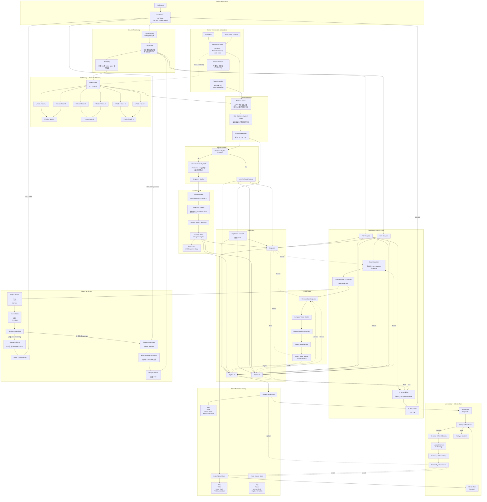

flowchart TB




```python
Dynamo
├── lib
│   ├── bindings
│   │   └── python
│   │       ├── Rust → Python Binding          # Dynamo 的 Rust 与 Python 桥接层
│   │       ├── maturin                        # 用于编译 Rust Python 扩展
│   │       └── maturin develop --uv           # 编译并安装到当前 .venv
│   │
│   ├── gpu_memory_service
│   │   ├── GPU Memory Service                 # GPU 显存管理相关组件
│   │   └── uv pip install -e ...              # 以 editable 模式安装到 .venv
│   │
│   └── Runtime
│       ├── Rust                               # Dynamo 底层 Runtime 主要实现语言
│       ├── Worker 管理                         # 管理推理 Worker 生命周期
│       ├── 通信                                # Worker / Frontend 之间通信
│       └── 内存管理                             # GPU / KV Cache 等资源管理能力
│
├── Python 主包
│   ├── Frontend                               # 对外 HTTP / OpenAI API 入口
│   │   └── python3 -m dynamo.frontend         # 启动 Frontend
│   │
│   ├── Router                                 # 请求路由
│   ├── Discovery                              # Worker 服务发现
│   └── API                                    # API 相关实现
│
├── Backend
│   ├── vLLM                                   # 外部推理引擎，不是 Dynamo 自己实现
│   │   ├── Python + C++ + CUDA                # vLLM 自己内部的技术栈
│   │   └── python3 -m dynamo.vllm             # Dynamo 启动 vLLM Worker
│   │
│   ├── SGLang                                 # 可选外部推理引擎
│   └── TensorRT-LLM                           # 可选 NVIDIA 推理引擎
│
├── 外部 Native 组件
│   ├── NIXL                                   # 高性能数据 / GPU 内存传输组件
│   │   └── C++                                # NIXL 主要使用 C++
│   ├── PyTorch                                # 深度学习运行时
│   │   └── C++ / CUDA                         # PyTorch 底层大量使用 C++ / CUDA
│   ├── NCCL                                   # NVIDIA GPU 集合通信库
│   └── CUDA                                   # GPU 编程与运行时
│
└── GPU
    └── RTX A4000                              # 最终执行模型推理的硬件
```

