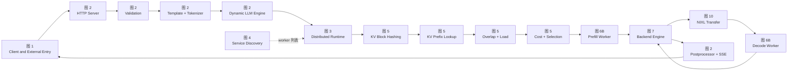

```mermaid
flowchart TB

    %% ============================================================
    %% 1. Clients and external entry
    %% ============================================================
    subgraph CLIENT["1. Client and External Entry"]
        APP["Client Application<br/>OpenAI SDK / curl / Service"]
        OAI["OpenAI-compatible API<br/>POST /v1/chat/completions<br/>POST /v1/completions<br/>POST /v1/embeddings"]
        KSERVE["KServe gRPC API"]
        GATEWAY["Optional Kubernetes Gateway API<br/>Auth / Rate Limit / Traffic Policy"]
        EPP["Optional Endpoint Picker Plugin<br/>Select Frontend sidecar or worker"]

        APP --> OAI
        APP --> KSERVE
        APP --> GATEWAY
        GATEWAY --> EPP
    end

    %% ============================================================
    %% 2. Frontend
    %% ============================================================
    subgraph FRONTEND["2. Dynamo Frontend"]
        HTTP["HTTP / SSE Server<br/>OpenAI-compatible endpoints<br/><br/>components/src/dynamo/frontend/main.py"]
        GRPC["KServe gRPC Server<br/><br/>lib/llm runtime entrypoint"]
        VALIDATE["Request Validation<br/>model / sampling / limits / tools"]
        TEMPLATE["Chat Template<br/>messages to prompt"]
        TOKENIZER["Tokenizer<br/>prompt to token_ids"]
        PREPROCESS["Preprocessor<br/>PreprocessedRequest<br/><br/>model<br/>token_ids<br/>sampling_options<br/>stop_conditions<br/>routing metadata"]
        ENGINE["Dynamic LLM Engine<br/>make_engine<br/><br/>lib/llm<br/>lib/bindings/python"]
        POSTPROCESS["Postprocessor<br/>detokenization<br/>tool calls<br/>reasoning fields<br/>usage aggregation"]
        STREAM["HTTP SSE / JSON Response"]

        OAI --> HTTP
        KSERVE --> GRPC
        EPP -->|"direct mode"| HTTP

        HTTP --> VALIDATE
        GRPC --> VALIDATE
        VALIDATE --> TEMPLATE
        TEMPLATE --> TOKENIZER
        TOKENIZER --> PREPROCESS
        PREPROCESS --> ENGINE

        ENGINE --> POSTPROCESS
        POSTPROCESS --> STREAM
        STREAM --> APP
    end

    %% ============================================================
    %% 3. Distributed runtime
    %% ============================================================
    subgraph RUNTIME["3. Dynamo Distributed Runtime"]
        DR["DistributedRuntime<br/><br/>lib/runtime<br/>components communicate through endpoints"]
        NS["Namespace<br/>isolates one model deployment"]
        COMP["Component<br/>frontend / router / prefill / decode / backend"]
        ENDPOINT["Endpoint<br/>namespace.component.endpoint<br/><br/>examples:<br/>model.prefill.generate<br/>model.decode.generate"]
        CLIENTWATCH["Runtime Client<br/>watches endpoint membership"]
        REQUESTPLANE["Request Plane<br/>TCP default / HTTP / NATS legacy"]
        INHIBIT["Local Worker Inhibition<br/>temporarily avoids failed worker"]

        DR --> NS
        NS --> COMP
        COMP --> ENDPOINT
        CLIENTWATCH --> ENDPOINT
        ENDPOINT --> REQUESTPLANE
        REQUESTPLANE --> INHIBIT
    end

    ENGINE --> DR

    %% ============================================================
    %% 4. Service discovery
    %% ============================================================
    subgraph DISCOVERY["4. Service Discovery and Membership"]
        DISCOVERYMODE{"Discovery backend"}
        K8SDISC["Kubernetes-native Discovery<br/>DynamoWorkerMetadata CRD<br/>EndpointSlice / API watch"]
        ETCD["etcd Discovery<br/>lease and keepalive<br/>/services/namespace/component/endpoint"]
        REGISTRY["Live Endpoint Registry<br/>instance ID<br/>address<br/>worker role<br/>runtime configuration"]
        HEALTH["Health and Membership Update<br/>register / drain / deregister / lease expiry"]
        WORKERCONFIG["Worker RuntimeConfig<br/>worker ID<br/>DP rank / TP size<br/>KV capacity<br/>backend metadata<br/>taints"]

        DISCOVERYMODE --> K8SDISC
        DISCOVERYMODE --> ETCD
        K8SDISC --> REGISTRY
        ETCD --> REGISTRY
        HEALTH --> REGISTRY
        WORKERCONFIG --> REGISTRY
    end

    REGISTRY -. "watch updates" .-> CLIENTWATCH
    INHIBIT -. "request failure" .-> REGISTRY

    %% ============================================================
    %% 5. Routing layer
    %% ============================================================
    subgraph ROUTING["5. Request Routing Layer"]
        ROUTERMODE{"Router mode"}
        RR["Round Robin"]
        RANDOM["Random"]
        LEAST["Least Loaded"]
        DIRECT["Direct<br/>upstream-selected worker"]
        DEVICE["Device-aware Weighted"]
        KVROUTER["KV-aware Router<br/><br/>lib/kv-router"]
        ROUTERREQ["SchedulingRequest<br/>request_id<br/>token sequence<br/>routing constraints<br/>config override"]
        ELIGIBLE["Eligibility Filter<br/>healthy worker<br/>model / LoRA match<br/>role match<br/>taints<br/>optional pinned worker"]
        HASH["KV Block Hashing<br/>split token_ids by block size<br/>compute chained block hashes<br/><br/>lib/kv-router/src/protocols.rs"]
        MATCH["KV Prefix Lookup<br/>Radix Tree / Cuckoo Index<br/>find matching blocks per worker"]
        OVERLAP["Overlap Analysis<br/>GPU blocks<br/>host-pinned blocks<br/>disk blocks<br/>shared-cache hits"]
        LOAD["Worker Load State<br/>active prefill tokens<br/>decode blocks<br/>active requests<br/>KV utilization"]
        SCORE["Worker Cost Function<br/><br/>adjusted prefill<br/>= raw prefill - cache credit<br/><br/>cost<br/>= prefill cost + decode cost<br/>+ active request cost"]
        QUEUE["Scheduling Queue<br/>FCFS / WSPT policy<br/>admission control<br/>optional overlap refresh"]
        PICK["Worker Selection<br/>minimum cost when temperature=0<br/>softmax selection otherwise"]
        RESULT["WorkerSelectionResult<br/>worker_id<br/>dp_rank<br/>overlap_blocks"]

        ROUTERMODE --> RR
        ROUTERMODE --> RANDOM
        ROUTERMODE --> LEAST
        ROUTERMODE --> DIRECT
        ROUTERMODE --> DEVICE
        ROUTERMODE --> KVROUTER

        KVROUTER --> ROUTERREQ
        ROUTERREQ --> ELIGIBLE
        ROUTERREQ --> HASH
        HASH --> MATCH
        MATCH --> OVERLAP
        OVERLAP --> SCORE
        LOAD --> SCORE
        ELIGIBLE --> SCORE
        SCORE --> QUEUE
        QUEUE --> PICK
        PICK --> RESULT

        RR --> RESULT
        RANDOM --> RESULT
        LEAST --> RESULT
        DIRECT --> RESULT
        DEVICE --> RESULT
    end

    ENGINE --> ROUTERMODE
    REGISTRY -. "available workers" .-> ELIGIBLE
    WORKERCONFIG -. "capacity and topology" .-> ELIGIBLE

    %% ============================================================
    %% 6. Aggregated execution
    %% ============================================================
    subgraph AGG["6A. Aggregated Serving - Optional Path"]
        AGGWORKER["Aggregated Worker<br/>same engine performs prefill and decode"]
        AGGPREFILL["Prefill Phase<br/>process prompt tokens<br/>build or reuse KV cache"]
        AGGDECODE["Decode Phase<br/>generate one or more tokens per step"]
        AGGOUTPUT["Streaming Engine Output<br/>token_ids / text<br/>finish_reason / usage"]

        AGGWORKER --> AGGPREFILL
        AGGPREFILL --> AGGDECODE
        AGGDECODE --> AGGOUTPUT
    end

    RESULT -->|"aggregated topology"| AGGWORKER
    AGGOUTPUT --> ENGINE

    %% ============================================================
    %% 7. Disaggregated execution
    %% ============================================================
    subgraph DISAGG["6B. Disaggregated Prefill and Decode - Optional Path"]
        ORCHESTRATOR["Prefill Router / Disaggregated Orchestrator"]
        PREFSELECT["Select Prefill Worker<br/>KV overlap plus prefill load"]
        PREFPOOL["Prefill Worker Pool<br/>independently scalable"]
        PREF1["Prefill Worker P1"]
        PREF2["Prefill Worker P2"]
        PREFEXEC["Compute Missing Prompt KV<br/>reuse cached prefix when available"]
        META["Return Transfer Metadata<br/><br/>vLLM: kv_transfer_params<br/>SGLang: bootstrap_info<br/>TensorRT-LLM: opaque_state"]
        DECSELECT["Select Decode Worker<br/>decode load / capacity<br/>conditional cache locality"]
        DECPOOL["Decode Worker Pool<br/>independently scalable"]
        DEC1["Decode Worker D1"]
        DEC2["Decode Worker D2"]
        KVTRANSFER["Asynchronous KV Transfer<br/>Prefill GPU to Decode GPU"]
        DECEXEC["Autoregressive Decode<br/>continuous batching<br/>token generation"]
        DECOUTPUT["Streaming Engine Output"]

        ORCHESTRATOR --> PREFSELECT
        PREFSELECT --> PREFPOOL
        PREFPOOL --> PREF1
        PREFPOOL --> PREF2
        PREF1 --> PREFEXEC
        PREF2 --> PREFEXEC
        PREFEXEC --> META

        META --> DECSELECT
        DECSELECT --> DECPOOL
        DECPOOL --> DEC1
        DECPOOL --> DEC2

        META --> KVTRANSFER
        PREFEXEC --> KVTRANSFER
        KVTRANSFER --> DECEXEC
        DEC1 --> DECEXEC
        DEC2 --> DECEXEC
        DECEXEC --> DECOUTPUT
    end

    RESULT -->|"disaggregated topology"| ORCHESTRATOR
    DECOUTPUT --> ENGINE

    %% ============================================================
    %% 8. Backend engines
    %% ============================================================
    subgraph BACKENDS["7. Inference Backend Integration"]
        BACKENDAPI["Dynamo Backend Adapter<br/>common generate and streaming contract"]
        VLLM["vLLM Engine<br/>scheduler / paged attention<br/>KV event publisher"]
        SGLANG["SGLang Engine<br/>radix cache / HiCache<br/>KV event publisher"]
        TRTLLM["TensorRT-LLM Engine<br/>optimized kernels<br/>KV event publisher"]
        MOCKER["Mocker Engine<br/>simulation and testing"]
        GPU["GPU Execution<br/>CUDA kernels<br/>attention / GEMM / collectives"]
        PARALLEL["Parallelism<br/>TP / PP / DP / EP"]
        NCCL["NCCL Collectives<br/>multi-GPU execution"]

        BACKENDAPI --> VLLM
        BACKENDAPI --> SGLANG
        BACKENDAPI --> TRTLLM
        BACKENDAPI --> MOCKER

        VLLM --> GPU
        SGLANG --> GPU
        TRTLLM --> GPU

        GPU --> PARALLEL
        PARALLEL --> NCCL
    end

    AGGWORKER --> BACKENDAPI
    PREF1 --> BACKENDAPI
    PREF2 --> BACKENDAPI
    DEC1 --> BACKENDAPI
    DEC2 --> BACKENDAPI

    %% ============================================================
    %% 9. KV event plane and router index
    %% ============================================================
    subgraph KVEVENTS["8. KV Cache Event and Index Plane"]
        KVEVENT["RouterEvent<br/>Stored / Removed / Cleared<br/>worker_id / event_id / block hashes"]
        EVENTTRANSPORT{"KV Event Transport"}
        NATS["NATS / JetStream<br/>event pub-sub"]
        ZMQ["ZMQ Event Channel"]
        PREDICT["Prediction-based Tracking<br/>when KV events are disabled"]
        LISTENER["KV Event Listener"]
        INDEXER["Global KV Location Index<br/>block prefix to workers"]
        RADIX["Concurrent Radix Tree<br/>prefix overlap lookup"]
        CUCKOO["Optional Cuckoo Index<br/>high-throughput lookup"]
        REPLICASYNC["Router Replica Synchronization<br/>synchronize routing view<br/>not model-data replication"]
        RECOVERY["Indexer Recovery<br/>rebuild routing state after restart"]

        KVEVENT --> EVENTTRANSPORT
        EVENTTRANSPORT --> NATS
        EVENTTRANSPORT --> ZMQ
        NATS --> LISTENER
        ZMQ --> LISTENER
        PREDICT --> INDEXER
        LISTENER --> INDEXER
        INDEXER --> RADIX
        INDEXER --> CUCKOO
        INDEXER <--> REPLICASYNC
        RECOVERY --> INDEXER
    end

    VLLM -. "KV lifecycle events" .-> KVEVENT
    SGLANG -. "KV lifecycle events" .-> KVEVENT
    TRTLLM -. "KV lifecycle events" .-> KVEVENT

    RADIX -. "overlap scores" .-> MATCH
    CUCKOO -. "overlap scores" .-> MATCH

    %% ============================================================
    %% 10. KV Block Manager and storage tiers
    %% ============================================================
    subgraph KVBM["9. KV Block Manager and Cache Hierarchy"]
        CONNECTOR["Backend KV Connector<br/>vLLM / TensorRT-LLM integration"]
        LOGICAL["Logical Block Manager<br/>block identity<br/>ownership and lifecycle"]
        PHYSICAL["Physical Block Manager<br/>allocation / handles / layout"]
        DEVICECACHE["G1 Device Pool<br/>GPU HBM<br/>fastest tier"]
        HOSTCACHE["G2 Host Pool<br/>CPU pinned memory"]
        DISKCACHE["G3 Disk Pool<br/>local NVMe / filesystem"]
        REMOTECACHE["G4 Remote Storage<br/>remote memory / filesystem<br/>object or cloud storage"]
        OFFLOAD["Offload and Onboard Scheduler<br/>Device to Host to Disk<br/>Disk or Host to Device"]
        EVICT["Eviction and Capacity Management"]
        KVCONSOLIDATE["KV Consolidator<br/>track and publish block state"]

        CONNECTOR --> LOGICAL
        LOGICAL --> PHYSICAL
        PHYSICAL --> DEVICECACHE
        PHYSICAL --> HOSTCACHE
        PHYSICAL --> DISKCACHE
        PHYSICAL --> REMOTECACHE

        DEVICECACHE <--> OFFLOAD
        HOSTCACHE <--> OFFLOAD
        DISKCACHE <--> OFFLOAD
        REMOTECACHE <--> OFFLOAD

        EVICT --> LOGICAL
        LOGICAL --> KVCONSOLIDATE
    end

    VLLM --> CONNECTOR
    TRTLLM --> CONNECTOR
    SGLANG -. "HiCache or backend-native integration" .-> HOSTCACHE
    KVCONSOLIDATE -. "store / remove events" .-> KVEVENT
    OVERLAP -. "tier-aware cache hits" .-> KVBM

    %% ============================================================
    %% 11. NIXL data movement
    %% ============================================================
    subgraph NIXL["10. NIXL Data Movement Layer"]
        NIXLAPI["NIXL Agent and Transfer API<br/>memory registration<br/>descriptor exchange<br/>async get / put"]
        NVLINK["NVLink / GPU P2P"]
        UCX["UCX / InfiniBand / RoCE"]
        MEMCPY["CUDA or Host memcpy"]
        GDS["GPUDirect Storage"]
        FILEIO["POSIX / Remote Filesystem I/O"]

        NIXLAPI --> NVLINK
        NIXLAPI --> UCX
        NIXLAPI --> MEMCPY
        NIXLAPI --> GDS
        NIXLAPI --> FILEIO
    end

    KVTRANSFER --> NIXLAPI
    OFFLOAD --> NIXLAPI
    NIXLAPI --> DEVICECACHE
    NIXLAPI --> HOSTCACHE
    NIXLAPI --> DISKCACHE
    NIXLAPI --> REMOTECACHE

    %% ============================================================
    %% 12. Fault handling
    %% ============================================================
    subgraph FAULT["11. Request Fault Handling"]
        CANCEL["Request Cancellation<br/>client disconnect propagation"]
        REJECT["Admission and Request Rejection<br/>load and capacity thresholds"]
        MIGRATE["Optional In-flight Migration<br/>move eligible request after failure"]
        RETRY["Reroute New Request<br/>avoid failed or inhibited worker"]
        RECOMPUTE["KV Cache Miss or Loss<br/>recompute prompt KV"]

        CANCEL --> AGGWORKER
        CANCEL --> PREFPOOL
        CANCEL --> DECPOOL
        REJECT --> ROUTERMODE
        MIGRATE --> DECPOOL
        RETRY --> ROUTERMODE
        RECOMPUTE --> PREFEXEC
    end

    HEALTH -. "worker failure" .-> RETRY
    INHIBIT -. "temporary suppression" .-> RETRY
    DECEXEC -. "eligible interrupted request" .-> MIGRATE

    %% ============================================================
    %% 13. Observability and autoscaling
    %% ============================================================
    subgraph OPS["12. Observability, Planning and Autoscaling"]
        METRICS["Metrics<br/>request rate<br/>TTFT / ITL / latency<br/>tokens per second<br/>KV usage<br/>queue depth"]
        TRACES["Distributed Tracing<br/>request_id / trace_id"]
        LOGS["Structured Logs"]
        PROM["Prometheus"]
        GRAFANA["Grafana"]
        PLANNER["Dynamo Planner<br/>SLA-driven scaling decisions"]
        PROFILER["Profiler and AIConfigurator<br/>offline deployment configuration"]
        SCALE["Scale Prefill and Decode Pools<br/>replica counts / GPU allocation"]

        METRICS --> PROM
        PROM --> GRAFANA
        METRICS --> PLANNER
        PROFILER --> PLANNER
        PLANNER --> SCALE
    end

    HTTP -. "HTTP metrics" .-> METRICS
    KVROUTER -. "routing metrics" .-> METRICS
    PREFPOOL -. "load metrics" .-> METRICS
    DECPOOL -. "load metrics" .-> METRICS
    NIXLAPI -. "transfer metrics" .-> METRICS
    ENGINE -. "request spans" .-> TRACES
    BACKENDAPI -. "engine logs" .-> LOGS

    SCALE -. "desired replicas" .-> PREFPOOL
    SCALE -. "desired replicas" .-> DECPOOL

    %% ============================================================
    %% 14. Kubernetes control plane
    %% ============================================================
    subgraph K8S["13. Kubernetes Deployment Control Plane"]
        USER["Operator / GitOps / kubectl"]
        DGDR["DynamoGraphDeploymentRequest<br/>model / hardware / SLA intent"]
        PROFILERCTRL["Profiler Controller<br/>generate candidate deployment"]
        DGD["DynamoGraphDeployment<br/>explicit component graph"]
        OPERATOR["Dynamo Kubernetes Operator<br/>reconcile desired state"]
        PODS["Pods and Services<br/>Frontend / Prefill / Decode / Backend"]
        AUTOSCALER["Scaling Adapter / Autoscaler"]
        GROVE["Optional Grove<br/>gang and topology-aware scheduling"]
        MODELSTORE["Model Storage / PVC / Object Store"]
        MODELEXPRESS["Optional ModelExpress<br/>fast GPU-to-GPU weight loading"]

        USER --> DGDR
        USER --> DGD
        DGDR --> PROFILERCTRL
        PROFILERCTRL --> DGD
        DGD --> OPERATOR
        OPERATOR --> PODS
        AUTOSCALER --> OPERATOR
        OPERATOR --> GROVE
        MODELSTORE --> PODS
        MODELEXPRESS --> PODS
    end

    PODS -. "runs components" .-> FRONTEND
    PODS -. "runs components" .-> PREFPOOL
    PODS -. "runs components" .-> DECPOOL
    SCALE -. "scaling recommendation" .-> AUTOSCALER
    PODS -. "worker registration" .-> HEALTH

    %% ============================================================
    %% Styling
    %% ============================================================
    classDef external fill:#eef4ff,stroke:#3167b1,color:#111;
    classDef frontend fill:#e8f7ff,stroke:#0783b5,color:#111;
    classDef runtime fill:#f0ebff,stroke:#6f42c1,color:#111;
    classDef routing fill:#fff3cd,stroke:#b8860b,color:#111;
    classDef compute fill:#e9f8e9,stroke:#2e8b57,color:#111;
    classDef cache fill:#fff0f5,stroke:#c94f7c,color:#111;
    classDef infra fill:#f2f2f2,stroke:#666,color:#111;
    classDef control fill:#ffe8df,stroke:#c65d2e,color:#111;

    class APP,OAI,KSERVE,GATEWAY,EPP external;
    class HTTP,GRPC,VALIDATE,TEMPLATE,TOKENIZER,PREPROCESS,ENGINE,POSTPROCESS,STREAM frontend;
    class DR,NS,COMP,ENDPOINT,CLIENTWATCH,REQUESTPLANE,INHIBIT runtime;
    class ROUTERMODE,RR,RANDOM,LEAST,DIRECT,DEVICE,KVROUTER,ROUTERREQ,ELIGIBLE,HASH,MATCH,OVERLAP,LOAD,SCORE,QUEUE,PICK,RESULT routing;
    class AGGWORKER,AGGPREFILL,AGGDECODE,AGGOUTPUT,ORCHESTRATOR,PREFSELECT,PREFPOOL,PREF1,PREF2,PREFEXEC,META,DECSELECT,DECPOOL,DEC1,DEC2,KVTRANSFER,DECEXEC,DECOUTPUT,BACKENDAPI,VLLM,SGLANG,TRTLLM,MOCKER,GPU,PARALLEL,NCCL compute;
    class KVEVENT,EVENTTRANSPORT,NATS,ZMQ,PREDICT,LISTENER,INDEXER,RADIX,CUCKOO,REPLICASYNC,RECOVERY,CONNECTOR,LOGICAL,PHYSICAL,DEVICECACHE,HOSTCACHE,DISKCACHE,REMOTECACHE,OFFLOAD,EVICT,KVCONSOLIDATE cache;
    class DISCOVERYMODE,K8SDISC,ETCD,REGISTRY,HEALTH,WORKERCONFIG,NIXLAPI,NVLINK,UCX,MEMCPY,GDS,FILEIO,METRICS,TRACES,LOGS,PROM,GRAFANA infra;
    class USER,DGDR,PROFILERCTRL,DGD,OPERATOR,PODS,AUTOSCALER,GROVE,MODELSTORE,MODELEXPRESS,PLANNER,PROFILER,SCALE,CANCEL,REJECT,MIGRATE,RETRY,RECOMPUTE control;
```

下面沿 NVIDIA Dynamo 的分离式推理路径讲解：

```
Client
 → Frontend HTTP
 → 参数校验
 → Chat Template
 → Tokenizer
 → KV Router
 → Prefill Worker
 → NIXL KV Transfer
 → Decode Worker
 → Frontend
 → SSE Response
```

## 0. 固定请求和运行环境

客户端请求：

```
curl http://dynamo-frontend:8000/v1/chat/completions \
  -H 'Content-Type: application/json' \
  -H 'x-request-id: req-1001' \
  -d '{
    "model": "deepseek-ai/DeepSeek-R1-Distill-Llama-8B",
    "messages": [
      {
        "role": "system",
        "content": "你是一名技术文档助手"
      },
      {
        "role": "user",
        "content": "请总结下面这份技术文档……"
      }
    ],
    "temperature": 0.7,
    "max_completion_tokens": 256,
    "stream": true
  }'
```

假设部署参数为：

```
拓扑                   = 2 个 Prefill Worker + 2 个 Decode Worker
router_mode            = kv
KV block size          = 64 tokens
router_temperature     = 0
prefill_load_scale     = 1.0
overlap_score_credit   = 1.0
decode request weight  = 1.0
```

经过 Chat Template 和 tokenizer 后，假设得到：

```
request_id       = req-1001
input tokens     = 1,800
max output tokens= 256
KV block size    = 64
```

这里需要区分两个数值：

```
可参与 KV hash 的完整 block：
floor(1800 / 64) = 28 blocks

调度容量需要的 block：
ceil(1800 / 64) = 29 blocks
```

最后 8 个 token 不构成完整的可复用 KV block，但仍然占用执行和容量，因此调度侧按 29 blocks 计算。

------

## 1. Frontend 启动 HTTP 服务

Python 启动入口在：

[components/src/dynamo/frontend/main.py (line 388)](/home/ubuntu/dynamo/components/src/dynamo/frontend/main.py:388)

Frontend 首先创建 `DistributedRuntime`：

```
runtime = DistributedRuntime(
    loop,
    config.discovery_backend,
    config.request_plane,
    event_plane=config.event_plane,
)
```

然后构造 Router 和 HTTP 参数：

[components/src/dynamo/frontend/main.py (line 407)](/home/ubuntu/dynamo/components/src/dynamo/frontend/main.py:407)

关键字段包括：

```
router_config = build_router_config(config)

kwargs = {
    "http_host": config.http_host,
    "http_port": config.http_port,
    "kv_cache_block_size": config.kv_cache_block_size,
    "router_config": router_config,
    ...
}
```

在本例中可理解为：

```
http_host          = 0.0.0.0
http_port          = 8000
kv_cache_block_size= 64
router_mode        = kv
```

之后创建动态引擎：

[components/src/dynamo/frontend/main.py (line 468)](/home/ubuntu/dynamo/components/src/dynamo/frontend/main.py:468)

```
e = EntrypointArgs(EngineType.Dynamic, **kwargs)
engine = await make_engine(runtime, e)
```

Python 的 `make_engine()` 最终进入 Rust/PyO3 绑定：

[lib/bindings/python/rust/llm/entrypoint.rs (line 722)](/home/ubuntu/dynamo/lib/bindings/python/rust/llm/entrypoint.rs:722)

这里把模型名、KV block size、Router 配置、HTTP 端口等写入 `LocalModelBuilder`：

```
builder
    .model_name(...)
    .kv_cache_block_size(args.kv_cache_block_size)
    .router_config(...)
    .http_host(...)
    .http_port(...);
```

最后 Frontend 选择 HTTP 输入模式：

[components/src/dynamo/frontend/main.py (line 482)](/home/ubuntu/dynamo/components/src/dynamo/frontend/main.py:482)

```
await run_input(runtime, "http", engine, frontend_route_extensions)
```

Rust 根据 `"http"` 启动 HTTP 服务：

[lib/llm/src/entrypoint/input.rs (line 99)](/home/ubuntu/dynamo/lib/llm/src/entrypoint/input.rs:99)

```
match in_opt {
    Input::Http => {
        http::run_with_frontend_route_extensions(...).await?;
    }
    ...
}
```

------

## 2. 接收 `/v1/chat/completions`

请求进入 Rust HTTP Handler：

[lib/llm/src/http/service/openai.rs (line 2748)](/home/ubuntu/dynamo/lib/llm/src/http/service/openai.rs:2748)

核心函数是：

```
async fn chat_completions(
    state: Arc<service_v2::State>,
    template: Option<RequestTemplate>,
    mut request: Context<NvCreateChatCompletionRequest>,
    stream_handle: ConnectionHandle,
) -> Result<Response, ErrorResponse>
```

此时请求仍然是 OpenAI 协议对象：

```
model                 = DeepSeek-R1-Distill-Llama-8B
messages              = 2 条
temperature           = 0.7
max_completion_tokens = 256
stream                 = true
```

### 2.1 服务就绪检查

[openai.rs (line 2762)](/home/ubuntu/dynamo/lib/llm/src/http/service/openai.rs:2762)

```
check_ready(&state)?;
```

如果模型或 worker 尚未就绪，接口返回 `503`，不会继续路由。

### 2.2 提取请求 ID

[openai.rs (line 2765)](/home/ubuntu/dynamo/lib/llm/src/http/service/openai.rs:2765)

```
let request_id = request.id().to_string();
```

本例：

```
request_id = req-1001
```

这个 ID 后续会进入 Router debug 日志、指标和链路跟踪。

### 2.3 判断流式模式

[openai.rs (line 2767)](/home/ubuntu/dynamo/lib/llm/src/http/service/openai.rs:2767)

```
let streaming = request.inner.stream.unwrap_or(false);
```

本例：

```
streaming = true
```

### 2.4 解析模型名

[openai.rs (line 2771)](/home/ubuntu/dynamo/lib/llm/src/http/service/openai.rs:2771)

Frontend 会应用请求模板、解析模型别名，并得到实际服务模型：

```
apply_chat_completions_request_template(...);

let canonical = state
    .manager()
    .resolve_canonical_name(&request.inner.model);
```

假设请求使用别名：

```
请求模型名 = deepseek-8b
实际模型名 = deepseek-ai/DeepSeek-R1-Distill-Llama-8B
```

Frontend 会把后续路由和指标统一到实际模型名。

------

## 3. 请求参数校验

校验代码从：

[lib/llm/src/http/service/openai.rs (line 2798)](/home/ubuntu/dynamo/lib/llm/src/http/service/openai.rs:2798)

开始依次检查：

```
reasoning/template 参数
不支持的字段
messages 是否为空
stream_options 是否和 stream 匹配
temperature、top_p、max tokens 等字段
```

例如，如果请求是：

```
{
  "messages": [],
  "temperature": 3.5
}
```

会在 Router 之前直接失败，因为：

```
messages 不能为空
temperature 超出允许范围
```

本例参数合法，因此进入模型引擎选择：

[lib/llm/src/http/service/openai.rs (line 2840)](/home/ubuntu/dynamo/lib/llm/src/http/service/openai.rs:2840)

```
let (engine, parsing_options) = state
    .manager()
    .get_chat_completions_engine_with_parsing(&model)?;
```

------

## 4. Chat Template 与 Tokenizer

`messages` 不能直接送入推理引擎，需要先转换为模型 prompt。

输入：

```
[
  {
    "role": "system",
    "content": "你是一名技术文档助手"
  },
  {
    "role": "user",
    "content": "请总结下面这份技术文档……"
  }
]
```

应用 DeepSeek 模型对应的模板后，概念上可能成为：

```
<｜begin▁of▁sentence｜>
<｜System｜>
你是一名技术文档助手
<｜User｜>
请总结下面这份技术文档……
<｜Assistant｜>
```

然后 tokenizer 生成：

```
token_ids = [
  128000,
  128006,
  882,
  128007,
  ...
]
```

假设最终长度：

```
token_ids.len() = 1,800
```

Frontend 的通用前后处理位于：

[components/src/dynamo/frontend/prepost.py](/home/ubuntu/dynamo/components/src/dynamo/frontend/prepost.py)

后端特定处理位于：

-   [components/src/dynamo/frontend/vllm_processor.py](/home/ubuntu/dynamo/components/src/dynamo/frontend/vllm_processor.py)
-   [components/src/dynamo/frontend/sglang_processor.py](/home/ubuntu/dynamo/components/src/dynamo/frontend/sglang_processor.py)

处理完成后的内部请求大致是：

```
{
    "model": "deepseek-ai/DeepSeek-R1-Distill-Llama-8B",
    "token_ids": [...],                 # 1800 个
    "sampling_options": {
        "temperature": 0.7,
        "max_tokens": 256
    },
    "stop_conditions": {...},
    "output_options": {...},
    "routing": None
}
```

独立 Router 对这些字段的封装可直接参考：

[components/src/dynamo/router/\\_\\_main\\_\\_.py (line 103)](/home/ubuntu/dynamo/components/src/dynamo/router/__main__.py:103)

```
preprocessed_request = {
    "model": request.get("model", "unknown"),
    "token_ids": request["token_ids"],
    "stop_conditions": ...,
    "sampling_options": ...,
    "output_options": ...,
    "routing": routing,
    "router_config_override": ...,
}
```

------

## 5. 进入 KV Router

HTTP Handler 调用动态引擎：

[lib/llm/src/http/service/openai.rs (line 2882)](/home/ubuntu/dynamo/lib/llm/src/http/service/openai.rs:2882)

```
let stream = engine.generate(request).await?;
```

在 KV Router 路径中，预处理后的请求最终进入：

[lib/bindings/python/rust/llm/kv.rs (line 2189)](/home/ubuntu/dynamo/lib/bindings/python/rust/llm/kv.rs:2189)

独立 Router 的对应调用更直观：

[components/src/dynamo/router/\\_\\_main\\_\\_.py (line 119)](/home/ubuntu/dynamo/components/src/dynamo/router/__main__.py:119)

```
async for worker_output in await self.kv_router.generate_from_request(
    preprocessed_request
):
    ...
```

Router 内部形成 `SchedulingRequest`：

[lib/kv-router/src/scheduling/types.rs (line 357)](/home/ubuntu/dynamo/lib/kv-router/src/scheduling/types.rs:357)

重要字段对应本例：

```
mode                   = Prefill
isl_tokens             = 1800
expected_output_tokens = 256
token_seq              = 28 个完整 block hash
request_id             = req-1001
track_prefill_tokens   = true
```

其中：

-   `isl_tokens` 是输入序列长度，即 input sequence length；
-   `token_seq` 不是原始 token，而是用于索引的 block hash 序列；
-   `worker_loads` 保存每个候选 worker 的负载投影；
-   `overlap` 保存各 worker 的缓存命中情况。

------

## 6. 把 1800 tokens 切成 KV blocks

KV block size 是 64：

```
Block 0  = token[0:64]
Block 1  = token[64:128]
Block 2  = token[128:192]
...
Block 27 = token[1728:1792]
Tail     = token[1792:1800]，只有 8 tokens
```

完整 block 数量由以下代码计算：

[lib/kv-router/src/protocols.rs (line 100)](/home/ubuntu/dynamo/lib/kv-router/src/protocols.rs:100)

```
token_count / kv_block_size
```

代入：

```
1800 / 64 = 28
```

所以只有 28 个完整 block 参与 hash 和跨请求缓存匹配。

但调度容量使用向上取整：

[lib/kv-router/src/scheduling/types.rs (line 473)](/home/ubuntu/dynamo/lib/kv-router/src/scheduling/types.rs:473)

```
self.isl_tokens.div_ceil(block_size as usize)
```

代入：

```
ceil(1800 / 64) = 29 blocks
```

因此：

```
KV 索引查询长度 = 28
调度所需容量     = 29
```

这是容易混淆但非常重要的区别。

------

## 7. 计算链式 KV block hash

入口在：

[lib/kv-router/src/protocols.rs (line 92)](/home/ubuntu/dynamo/lib/kv-router/src/protocols.rs:92)

```
pub fn compute_block_hash_for_seq(
    tokens: &[u32],
    kv_block_size: u32,
    options: BlockHashOptions<'_>,
) -> Vec<LocalBlockHash>
```

本例输入：

```
tokens.len()   = 1800
kv_block_size  = 64
```

输出：

```
hashes.len() = 28
```

概念上：

```
H0 = XXH3(seed, token[0:64])
H1 = XXH3(seed, H0, token[64:128])
H2 = XXH3(seed, H1, token[128:192])
...
H27 = XXH3(seed, H26, token[1728:1792])
```

代码还会把这些身份信息混入 hash seed：

```
LoRA adapter 名称
cache namespace
多模态对象 hash
Eagle 模式信息
```

对应说明在：

[lib/kv-router/src/protocols.rs (line 82)](/home/ubuntu/dynamo/lib/kv-router/src/protocols.rs:82)

因此，即使 token 完全相同，下面两个请求也不会错误地共享缓存：

```
Request A: token 相同，LoRA = adapter-a
Request B: token 相同，LoRA = adapter-b
```

------

## 8. 从 KV 索引查询 worker 命中

Worker 在缓存 block 被存储、删除或清空时发布 `RouterEvent`：

[lib/kv-router/src/protocols.rs (line 1355)](/home/ubuntu/dynamo/lib/kv-router/src/protocols.rs:1355)

主要事件可以理解为：

```
Stored  → 某 worker 新增了这些 KV blocks
Removed → 某 worker 淘汰了这些 KV blocks
Cleared → 某 worker 的缓存被清空
```

Router 把事件应用到全局 KV 位置索引，然后执行 `find_matches()`：

[lib/kv-router/src/indexer/traits.rs (line 77)](/home/ubuntu/dynamo/lib/kv-router/src/indexer/traits.rs:77)

默认并发 Radix Tree 的查询实现位于：

[lib/kv-router/src/indexer/concurrent_radix_tree.rs (line 658)](/home/ubuntu/dynamo/lib/kv-router/src/indexer/concurrent_radix_tree.rs:658)

### 示例假设：缓存状态

两个 Prefill worker：

| Worker | GPU 命中  | Host 命中 | Disk 命中 |
| ------ | --------- | --------- | --------- |
| P1     | 20 blocks | 0         | 0         |
| P2     | 8 blocks  | 0         | 0         |

换算为 token：

```
P1:
20 × 64 = 1280 cached tokens
剩余实际输入 = 1800 - 1280 = 520 tokens

P2:
8 × 64 = 512 cached tokens
剩余实际输入 = 1800 - 512 = 1288 tokens
```

注意最后一个不完整 block 无法作为完整前缀 block 命中，因此 P1 即使命中 20 blocks，仍需处理：

```
8 个完整 block + 8 个尾部 token
= 8 × 64 + 8
= 520 tokens
```

分层缓存命中转换在：

[lib/kv-router/src/scheduling/overlap.rs (line 142)](/home/ubuntu/dynamo/lib/kv-router/src/scheduling/overlap.rs:142)

其中近似执行：

```
cached_tokens = overlap_blocks * block_size
```

------

## 9. 获取实时 worker 负载

### 示例假设：负载状态

| Worker | active prefill tokens | decode cost blocks | active requests |
| ------ | --------------------- | ------------------ | --------------- |
| P1     | 640                   | 0                  | 0               |
| P2     | 128                   | 0                  | 0               |

解释：

```
P1 当前还有相当于 640 tokens 的 prefill 工作
P2 当前还有相当于 128 tokens 的 prefill 工作
```

Router 为每个 worker 构造 `WorkerCandidate`：

[lib/kv-router/src/scheduling/selector/mod.rs (line 175)](/home/ubuntu/dynamo/lib/kv-router/src/scheduling/selector/mod.rs:175)

关键计算为：

```
uncached_tokens = effective_prefill_tokens(
    request.isl_tokens,
    cached_tokens,
);

projected_tokens =
    load.active_prefill_tokens + uncached_tokens;

raw_prefill_tokens =
    projected_tokens + cached_tokens;
```

由于：

```
uncached_tokens + cached_tokens = isl_tokens
```

所以无衰减情况下可简化为：

```
raw_prefill_tokens = active_prefill_tokens + 1800
```

### P1

```
cached_tokens       = 1280
uncached_tokens     = 1800 - 1280 = 520
active_prefill      = 640

projected_tokens    = 640 + 520 = 1160
raw_prefill_tokens  = 1160 + 1280 = 2440
raw_prefill_blocks  = 2440 / 64 = 38.125
```

### P2

```
cached_tokens       = 512
uncached_tokens     = 1800 - 512 = 1288
active_prefill      = 128

projected_tokens    = 128 + 1288 = 1416
raw_prefill_tokens  = 1416 + 512 = 1928
raw_prefill_blocks  = 1928 / 64 = 30.125
```

看上去 P1 的 `raw_prefill_blocks` 更高，但下一步还要减去 KV cache credit。

------

## 10. 带入 KV Router 评分公式

实际评分实现在：

[lib/kv-router/src/scheduling/selector/default.rs (line 228)](/home/ubuntu/dynamo/lib/kv-router/src/scheduling/selector/default.rs:228)

假设：

```
overlap_score_credit         = 1.0
overlap_score_credit_decay   = 0
prefill_load_scale           = 1.0
host_cache_hit_weight        = 0
disk_cache_hit_weight        = 0
shared cache                 = 0
decode_active_request_weight = 1.0
```

缓存收益：

```
overlap_credit_blocks
  = overlap_score_credit × GPU overlap blocks
```

### P1 评分

```
overlap_credit_blocks
  = 1.0 × 20
  = 20

adjusted_prefill_blocks
  = max(0, raw_prefill_blocks - overlap_credit_blocks)
  = max(0, 38.125 - 20)
  = 18.125

cost
  = prefill_load_scale × adjusted_prefill_blocks
    + decode_cost_blocks
    + active_request_cost_blocks

  = 1.0 × 18.125 + 0 + 0
  = 18.125
```

### P2 评分

```
overlap_credit_blocks
  = 1.0 × 8
  = 8

adjusted_prefill_blocks
  = max(0, 30.125 - 8)
  = 22.125

cost
  = 1.0 × 22.125 + 0 + 0
  = 22.125
```

结果：

```
P1 cost = 18.125
P2 cost = 22.125

P1 胜出
```

虽然 P1 当前负载更高：

```
P1 active prefill = 640 tokens
P2 active prefill = 128 tokens
```

但 P1 多命中了：

```
1280 - 512 = 768 tokens
```

其缓存优势超过了额外的：

```
640 - 128 = 512 tokens
```

负载，因此仍选择 P1。

最终 cost 公式对应：

[lib/kv-router/src/scheduling/selector/default.rs (line 286)](/home/ubuntu/dynamo/lib/kv-router/src/scheduling/selector/default.rs:286)

```
let adjusted_prefill_blocks =
    (load.raw_prefill_blocks - overlap_credit_blocks).max(0.0);

let prefill_cost_blocks =
    weights.prefill_load_scale * adjusted_prefill_blocks;

let logit =
    prefill_cost_blocks
    + decode_cost_blocks
    + active_request_cost_blocks;
```

------

## 11. 为什么 `router_temperature=0`

Worker 选择实现位于：

[lib/kv-router/src/scheduling/selector/default.rs (line 528)](/home/ubuntu/dynamo/lib/kv-router/src/scheduling/selector/default.rs:528)

当：

```
router_temperature = 0
```

代码直接选择最低 cost：

```
if temperature == 0.0 {
    return Ok(minimum_cost_index(...));
}
```

最低 cost 的遍历代码在：

[lib/kv-router/src/scheduling/selector/default.rs (line 373)](/home/ubuntu/dynamo/lib/kv-router/src/scheduling/selector/default.rs:373)

因此本例确定选择：

```
Prefill Worker P1
```

如果温度大于 0，则对 cost 做 softmax 抽样。低成本 worker 概率更高，但不保证每次都是它。

------

## 12. P1 执行 Prefill

Router 把请求发送到 P1：

```
model             = DeepSeek-8B
input tokens      = 1800
cache hit         = 1280 tokens
missing prefill   = 520 tokens
max output        = 256
request_id        = req-1001
```

P1 不需要重新计算前 1280 tokens，只处理：

```
token[1280:1800]
共 520 tokens
```

然后生成剩余 prompt 的 K/V 张量。

假设模型：

```
layers            = 32
KV heads          = 8
head dimension    = 128
dtype             = BF16，2 bytes
new tokens        = 520
```

新增 KV 的简化体积约为：

```
K 和 V 两份
= 520 × 32 × 8 × 128 × 2 bytes × 2
= 68,157,440 bytes
≈ 65 MiB
```

实际内存大小还会受模型架构、TP 分片、page/block 布局、对齐方式影响；这里仅用于说明数量级。

------

## 13. 返回 KV transfer metadata

Prefill 完成后，不直接生成完整回复，而是返回传输元数据。

不同后端格式不同：

```
vLLM:
kv_transfer_params
  - remote block IDs
  - remote worker information
  - transfer identifiers

SGLang:
bootstrap_info
  - host
  - port
  - room_id

TensorRT-LLM:
opaque_state
  - backend-specific serialized metadata
```

独立 Router 对这些字段的透传可见：

[components/src/dynamo/router/\\_\\_main\\_\\_.py (line 133)](/home/ubuntu/dynamo/components/src/dynamo/router/__main__.py:133)

```
"disaggregated_params":
    worker_output.get("disaggregated_params"),

"extra_args":
    worker_output.get("extra_args"),
```

------

## 14. 选择 Decode Worker

假设两个 Decode worker 当前状态：

| Worker | potential decode blocks | active requests |
| ------ | ----------------------- | --------------- |
| D1     | 90                      | 4               |
| D2     | 70                      | 10              |

分离式 Decode 路由通常把 KV overlap credit 设为 0，主要根据 decode 负载选择。源码对此有明确说明：

[lib/kv-router/src/scheduling/selector/default.rs (line 257)](/home/ubuntu/dynamo/lib/kv-router/src/scheduling/selector/default.rs:257)

假设：

```
decode_active_request_weight = 1
```

则：

```
D1 cost
  = decode blocks + active request weight × active requests
  = 90 + 1 × 4
  = 94

D2 cost
  = 70 + 1 × 10
  = 80
```

因此选择：

```
Decode Worker D2
```

这里展示了为什么不能只看 active request 数：

```
D2 虽有 10 个 active requests，
但 decode block 总成本更低，
最终总 cost 仍小于 D1。
```

------

## 15. NIXL 传输 KV cache

D2 收到：

```
原始生成请求
+ P1 返回的 transfer metadata
```

随后通过 NIXL 从 P1 获取 KV 数据：

```
P1 GPU HBM
   │
   │ NVLink / GPU P2P
   │ 或 UCX / InfiniBand / RoCE
   ▼
D2 GPU HBM
```

分布式 KV block transfer 实现在：

[lib/llm/src/block_manager/distributed/transfer.rs](/home/ubuntu/dynamo/lib/llm/src/block_manager/distributed/transfer.rs)

NIXL executor 位于：

[lib/llm/src/block_manager/v2/physical/transfer/executor/nixl.rs](/home/ubuntu/dynamo/lib/llm/src/block_manager/v2/physical/transfer/executor/nixl.rs)

本例需要让 D2 获得约 1800-token prompt 对应的完整 KV 状态。前面估算 P1 新计算部分约 65 MiB，但完整 KV 传输量取决于后端协议是否只传新增范围、D2 已有的 block、TP 分片和实际布局，不能简单固定为 65 MiB。

------

## 16. D2 执行 Decode

D2 拿到 KV 后开始自回归生成：

```
初始上下文 = 1800 tokens
最大生成   = 256 tokens
temperature= 0.7
```

生成过程：

```
step 1:
输入 KV 长度 1800
生成 token 1801，例如“这”

step 2:
输入 KV 长度 1801
生成 token 1802，例如“份”

...

最多执行 256 个 decode step
```

假设模型在第 173 个输出 token 生成 EOS：

```
实际 completion tokens = 173
finish_reason           = stop
总 token                = 1800 + 173 = 1973
```

Worker 输出被包装为：

```
{
    "token_ids": [...],
    "text": "...",
    "finish_reason": "stop",
    "completion_usage": {
        "prompt_tokens": 1800,
        "completion_tokens": 173,
        "total_tokens": 1973
    },
    "routing_data": {
        "worker_id": "D2",
        ...
    }
}
```

相关统一字段可见：

[components/src/dynamo/router/\\_\\_main\\_\\_.py (line 124)](/home/ubuntu/dynamo/components/src/dynamo/router/__main__.py:124)

------

## 17. Frontend 转换并流式返回

HTTP Handler 内部始终把引擎视为流：

[lib/llm/src/http/service/openai.rs (line 2754)](/home/ubuntu/dynamo/lib/llm/src/http/service/openai.rs:2754)

即使客户端要求非流式响应，内部仍先生成 stream，再聚合成一个 JSON 响应。

本例：

```
stream = true
```

所以进入 SSE 分支：

[lib/llm/src/http/service/openai.rs (line 2917)](/home/ubuntu/dynamo/lib/llm/src/http/service/openai.rs:2917)

客户端逐步收到：

```
data: {
  "id": "req-1001",
  "choices": [{
    "index": 0,
    "delta": {"content": "这"},
    "finish_reason": null
  }]
}
```

接着：

```
data: {
  "id": "req-1001",
  "choices": [{
    "index": 0,
    "delta": {"content": "份"},
    "finish_reason": null
  }]
}
```

最终：

```
data: {
  "id": "req-1001",
  "choices": [{
    "index": 0,
    "delta": {},
    "finish_reason": "stop"
  }],
  "usage": {
    "prompt_tokens": 1800,
    "completion_tokens": 173,
    "total_tokens": 1973
  }
}

data: [DONE]
```

如果客户端中途断开，Handler 保存的 stream context 会用于向下游传播取消：

[lib/llm/src/http/service/openai.rs (line 2894)](/home/ubuntu/dynamo/lib/llm/src/http/service/openai.rs:2894)

这样 P1、D2 或排队中的任务可以停止不再需要的工作。

------

## 完整数值链路汇总

```
1. HTTP 请求
   model     = DeepSeek-8B
   max output= 256
   stream    = true

2. Tokenizer
   input tokens = 1800

3. Block 划分
   block size              = 64
   完整可哈希 blocks        = floor(1800 / 64) = 28
   调度容量 blocks          = ceil(1800 / 64)  = 29
   尾部                    = 8 tokens

4. KV 查询
   P1 命中 20 blocks = 1280 tokens
   P2 命中  8 blocks = 512 tokens

5. Prefill 负载
   P1 active prefill = 640 tokens
   P2 active prefill = 128 tokens

6. Prefill Router cost
   P1 = (1800 + 640) / 64 - 20 = 18.125
   P2 = (1800 + 128) / 64 -  8 = 22.125
   选择 P1

7. P1 实际新增计算
   1800 - 1280 = 520 tokens

8. Decode Router cost
   D1 = 90 decode blocks + 4 requests  = 94
   D2 = 70 decode blocks + 10 requests = 80
   选择 D2

9. KV transfer
   P1 GPU → NIXL → D2 GPU

10. Decode
    最大 256 tokens
    示例实际生成 173 tokens

11. 响应统计
    prompt_tokens     = 1800
    completion_tokens = 173
    total_tokens      = 1973
    finish_reason     = stop
```

最终主链路就是：

```
Client
  → Rust HTTP Handler
  → 校验与模型解析
  → Chat Template
  → Tokenizer：1800 tokens
  → 28 个完整 KV block hashes
  → 查询 P1/P2 缓存
  → 评分选择 P1
  → P1 增量 prefill 520 tokens
  → NIXL 转移 KV
  → 评分选择 D2
  → D2 生成 173 tokens
  → Frontend 后处理
  → SSE 返回，总计 1973 tokens
```

```python
Dynamo
├── lib
│   ├── bindings
│   │   └── python
│   │       ├── Rust → Python Binding          # Dynamo 的 Rust 与 Python 桥接层
│   │       ├── maturin                        # 用于编译 Rust Python 扩展
│   │       └── maturin develop --uv           # 编译并安装到当前 .venv
│   │
│   ├── gpu_memory_service
│   │   ├── GPU Memory Service                 # GPU 显存管理相关组件
│   │   └── uv pip install -e ...              # 以 editable 模式安装到 .venv
│   │
│   └── Runtime
│       ├── Rust                               # Dynamo 底层 Runtime 主要实现语言
│       ├── Worker 管理                         # 管理推理 Worker 生命周期
│       ├── 通信                                # Worker / Frontend 之间通信
│       └── 内存管理                             # GPU / KV Cache 等资源管理能力
│
├── Python 主包
│   ├── Frontend                               # 对外 HTTP / OpenAI API 入口
│   │   └── python3 -m dynamo.frontend         # 启动 Frontend
│   │
│   ├── Router                                 # 请求路由
│   ├── Discovery                              # Worker 服务发现
│   └── API                                    # API 相关实现
│
├── Backend
│   ├── vLLM                                   # 外部推理引擎，不是 Dynamo 自己实现
│   │   ├── Python + C++ + CUDA                # vLLM 自己内部的技术栈
│   │   └── python3 -m dynamo.vllm             # Dynamo 启动 vLLM Worker
│   │
│   ├── SGLang                                 # 可选外部推理引擎
│   └── TensorRT-LLM                           # 可选 NVIDIA 推理引擎
│
├── 外部 Native 组件
│   ├── NIXL                                   # 高性能数据 / GPU 内存传输组件
│   │   └── C++                                # NIXL 主要使用 C++
│   ├── PyTorch                                # 深度学习运行时
│   │   └── C++ / CUDA                         # PyTorch 底层大量使用 C++ / CUDA
│   ├── NCCL                                   # NVIDIA GPU 集合通信库
│   └── CUDA                                   # GPU 编程与运行时
│
└── GPU
    └── RTX A4000                              # 最终执行模型推理的硬件
```

你说得对。上一版按代码执行顺序展开了，但没有逐个引用架构图里的节点编号和名称，导致读者无法在“图”和“讲解”之间来回定位。

正确方式应该严格沿图中的箭头讲：

```
1 Client and External Entry
→ 2 Dynamo Frontend
→ 3 Distributed Runtime
→ 4 Service Discovery
→ 5 Request Routing Layer
→ 6B Disaggregated Prefill and Decode
→ 7 Inference Backend Integration
→ 9 KV Block Manager
→ 10 NIXL Data Movement
→ 2 Frontend Postprocessor
→ Client
```

下面重新对应。

------

## 总体对应关系

````

````

固定示例：

```
request_id        = req-1001
prompt tokens     = 1,800
max output tokens = 256
KV block size     = 64
router mode       = kv
topology          = 2P2D
```

------

# 图 1：Client and External Entry

对应原图节点：

```
Client Application
    ↓
OpenAI-compatible API
POST /v1/chat/completions
```

请求：

```
POST /v1/chat/completions
Content-Type: application/json
x-request-id: req-1001
{
  "model": "deepseek-8b",
  "messages": [
    {
      "role": "user",
      "content": "请总结下面的技术文档……"
    }
  ],
  "temperature": 0.7,
  "max_completion_tokens": 256,
  "stream": true
}
```

这一段对应图中的：

```
APP → OAI → HTTP
```

如果使用 Gateway API，则对应图中另一条入口：

```
APP → GATEWAY → EPP → HTTP
```

此时 EPP 已经选择 Frontend sidecar，Frontend 通常运行在 `direct` 路由模式。

------

# 图 2：Dynamo Frontend

## 图 2.1：HTTP / SSE Server

对应图中：

```
HTTP
HTTP / SSE Server
OpenAI-compatible endpoints
```

Frontend 启动 HTTP 服务的 Python 入口：

[components/src/dynamo/frontend/main.py (line 482)](/home/ubuntu/dynamo/components/src/dynamo/frontend/main.py:482)

```
await run_input(
    runtime,
    "http",
    engine,
    frontend_route_extensions
)
```

然后进入 Rust HTTP 输入：

[lib/llm/src/entrypoint/input.rs (line 124)](/home/ubuntu/dynamo/lib/llm/src/entrypoint/input.rs:124)

```
Input::Http => {
    http::run_with_frontend_route_extensions(
        drt,
        engine_config,
        frontend_route_extensions,
    ).await?;
}
```

`/v1/chat/completions` 的实际 Handler：

[lib/llm/src/http/service/openai.rs (line 2748)](/home/ubuntu/dynamo/lib/llm/src/http/service/openai.rs:2748)

```
async fn chat_completions(...) -> Result<Response, ErrorResponse>
```

数值进入系统：

```
request_id             = req-1001
model                   = deepseek-8b
temperature             = 0.7
max_completion_tokens   = 256
stream                   = true
```

------

## 图 2.2：Request Validation

对应图中：

```
VALIDATE
Request Validation
model / sampling / limits / tools
```

首先检查服务是否就绪：

[lib/llm/src/http/service/openai.rs (line 2762)](/home/ubuntu/dynamo/lib/llm/src/http/service/openai.rs:2762)

```
check_ready(&state)?;
```

然后取得请求 ID：

```
let request_id = request.id().to_string();
```

本例：

```
request_id = req-1001
```

接着判断流式模式：

```
let streaming = request.inner.stream.unwrap_or(false);
```

本例：

```
streaming = true
```

字段校验位于：

[lib/llm/src/http/service/openai.rs (line 2798)](/home/ubuntu/dynamo/lib/llm/src/http/service/openai.rs:2798)

检查内容包括：

```
messages 是否为空
model 是否存在
temperature 是否有效
stream_options 是否与 stream 匹配
tool 和 reasoning 参数是否兼容
```

校验通过后的箭头是：

```
VALIDATE → TEMPLATE
```

------

## 图 2.3：Chat Template 和 Tokenizer

对应图中：

```
TEMPLATE
Chat Template
messages to prompt
    ↓
TOKENIZER
prompt to token_ids
```

OpenAI messages：

```
[
  {
    "role": "user",
    "content": "请总结下面的技术文档……"
  }
]
```

经过模板后，概念上得到：

```
<begin>
<User>
请总结下面的技术文档……
<Assistant>
```

再经过 tokenizer：

```
token_ids = [128000, 128006, 882, ...]
token_ids.len() = 1800
```

相关前后处理代码：

-   通用处理：[components/src/dynamo/frontend/prepost.py](/home/ubuntu/dynamo/components/src/dynamo/frontend/prepost.py)
-   vLLM 处理：[components/src/dynamo/frontend/vllm_processor.py](/home/ubuntu/dynamo/components/src/dynamo/frontend/vllm_processor.py)
-   SGLang 处理：[components/src/dynamo/frontend/sglang_processor.py](/home/ubuntu/dynamo/components/src/dynamo/frontend/sglang_processor.py)

此时完成图中的：

```
TEMPLATE → TOKENIZER → PREPROCESS
```

------

## 图 2.4：PreprocessedRequest

对应图中：

```
PREPROCESS
model
token_ids
sampling_options
stop_conditions
routing metadata
```

内部请求可表示为：

```
{
    "model": "deepseek-8b",
    "token_ids": [...],          # 1800 个
    "sampling_options": {
        "temperature": 0.7,
        "max_tokens": 256
    },
    "routing": None,
    "router_config_override": None
}
```

对应代码：

[components/src/dynamo/router/\\_\\_main\\_\\_.py (line 103)](/home/ubuntu/dynamo/components/src/dynamo/router/__main__.py:103)

```
preprocessed_request = {
    "model": request.get("model", "unknown"),
    "token_ids": request["token_ids"],
    "sampling_options": ...,
    "routing": routing,
    "router_config_override": ...,
}
```

随后：

```
PREPROCESS → ENGINE
```

------

## 图 2.5：Dynamic LLM Engine

对应图中：

```
ENGINE
Dynamic LLM Engine
make_engine
```

创建位置：

[components/src/dynamo/frontend/main.py (line 468)](/home/ubuntu/dynamo/components/src/dynamo/frontend/main.py:468)

```
e = EntrypointArgs(EngineType.Dynamic, **kwargs)
engine = await make_engine(runtime, e)
```

其中包含：

```
kv_cache_block_size = 64
router_mode         = kv
model_name          = deepseek-8b
```

Rust builder 对应：

[lib/bindings/python/rust/llm/entrypoint.rs (line 722)](/home/ubuntu/dynamo/lib/bindings/python/rust/llm/entrypoint.rs:722)

```
builder
    .model_name(...)
    .kv_cache_block_size(args.kv_cache_block_size)
    .router_config(...)
```

HTTP Handler 调用引擎：

[lib/llm/src/http/service/openai.rs (line 2882)](/home/ubuntu/dynamo/lib/llm/src/http/service/openai.rs:2882)

```
let stream = engine.generate(request).await?;
```

下面从图 2 进入图 3：

```
ENGINE → DistributedRuntime
```

------

# 图 3：Dynamo Distributed Runtime

对应图中：

```
DistributedRuntime
 → Namespace
 → Component
 → Endpoint
 → Request Plane
```

假设命名空间是：

```
namespace = deepseek-disagg
```

组件和 endpoint 可能表示为：

```
deepseek-disagg.prefill.generate
deepseek-disagg.decode.generate
```

Runtime 的层级是：

```
Namespace: deepseek-disagg
├── Component: prefill
│   └── Endpoint: generate
└── Component: decode
    └── Endpoint: generate
```

核心代码目录：

[lib/runtime](/home/ubuntu/dynamo/lib/runtime)

Frontend 通过 Runtime client 向 endpoint 发送请求，而不是直接写死某个 Pod IP。

图中的箭头：

```
ENGINE → DR → NS → COMP → ENDPOINT
```

但是 Runtime 在选择 endpoint 前，需要图 4 提供在线 worker 列表。

------

# 图 4：Service Discovery and Membership

对应图中：

```
Discovery backend
├── Kubernetes-native Discovery
└── etcd Discovery
        ↓
Live Endpoint Registry
```

假设当前注册状态：

```
Prefill workers:
P1: worker_id=101, endpoint=10.0.1.11:9000, healthy
P2: worker_id=102, endpoint=10.0.1.12:9000, healthy

Decode workers:
D1: worker_id=201, endpoint=10.0.2.11:9000, healthy
D2: worker_id=202, endpoint=10.0.2.12:9000, healthy
```

图中的控制流是：

```
P1/P2/D1/D2
   -. register / keepalive .->
Live Endpoint Registry
   -. watch updates .->
Runtime Client
```

如果 P2 的 lease 到期：

```
原候选 = {P1, P2}
更新后 = {P1}
```

新请求不会再选择 P2。

这里不是 Amazon Dynamo 的 Gossip，而是 Kubernetes watch 或 etcd lease/watch。

代码入口仍在：

[lib/runtime](/home/ubuntu/dynamo/lib/runtime)

现在 Runtime 已经知道在线 worker，进入图 5。

------

# 图 5：Request Routing Layer

## 图 5.1：Router Mode

对应图中：

```
ROUTERMODE
    ↓
KVROUTER
```

本例配置：

```
router_mode = kv
```

因此不会走：

```
round-robin
random
least-loaded
direct
```

而是进入：

```
KV-aware Router
```

独立 KV Router 的请求调用：

[components/src/dynamo/router/\\_\\_main\\_\\_.py (line 119)](/home/ubuntu/dynamo/components/src/dynamo/router/__main__.py:119)

```
self.kv_router.generate_from_request(preprocessed_request)
```

------

## 图 5.2：SchedulingRequest

对应图中：

```
ROUTERREQ
SchedulingRequest
request_id
token sequence
routing constraints
config override
```

结构定义：

[lib/kv-router/src/scheduling/types.rs (line 357)](/home/ubuntu/dynamo/lib/kv-router/src/scheduling/types.rs:357)

本例：

```
mode                   = prefill
request_id             = req-1001
isl_tokens             = 1800
expected_output_tokens = 256
track_prefill_tokens   = true
allowed workers        = {P1, P2}
```

接下来同时进入图中的：

```
ROUTERREQ → ELIGIBLE
ROUTERREQ → HASH
```

------

## 图 5.3：Eligibility Filter

对应图中：

```
ELIGIBLE
Eligibility Filter
healthy worker
model / LoRA match
role match
taints
optional pinned worker
```

本例检查：

| 条件             | P1   | P2   |
| ---------------- | ---- | ---- |
| 在线且健康       | 是   | 是   |
| 角色为 prefill   | 是   | 是   |
| 加载 deepseek-8b | 是   | 是   |
| LoRA 匹配        | 是   | 是   |
| 没有禁止性 taint | 是   | 是   |

最终：

```
eligible workers = {P1, P2}
```

如果 P2 加载的是另一个模型，则在这里被过滤，而不是进入评分阶段。

相关 eligibility 数据进入选择器的位置：

[lib/kv-router/src/scheduling/selector/mod.rs (line 59)](/home/ubuntu/dynamo/lib/kv-router/src/scheduling/selector/mod.rs:59)

------

## 图 5.4：KV Block Hashing

对应图中：

```
HASH
KV Block Hashing
split token_ids by block size
compute chained block hashes
```

输入：

```
token count = 1800
block size  = 64
```

完整 KV blocks：

```
floor(1800 / 64) = 28
```

尾部：

```
1800 - 28 × 64 = 8 tokens
```

调度容量则向上取整：

```
ceil(1800 / 64) = 29 blocks
```

调度容量实现：

[lib/kv-router/src/scheduling/types.rs (line 473)](/home/ubuntu/dynamo/lib/kv-router/src/scheduling/types.rs:473)

```
self.isl_tokens.div_ceil(block_size as usize)
```

Hash 入口：

[lib/kv-router/src/protocols.rs (line 92)](/home/ubuntu/dynamo/lib/kv-router/src/protocols.rs:92)

输出：

```
token_seq = [H0, H1, H2, ..., H27]
```

对应图中：

```
HASH → MATCH
```

------

## 图 5.5：KV Prefix Lookup

对应图中：

```
MATCH
KV Prefix Lookup
Radix Tree / Cuckoo Index
```

Router 查询：

```
P1 从 H0 开始连续命中到 H19
P2 从 H0 开始连续命中到 H7
```

结果：

```
P1 overlap = 20 blocks = 1280 tokens
P2 overlap =  8 blocks =  512 tokens
```

查询接口：

[lib/kv-router/src/indexer/traits.rs (line 77)](/home/ubuntu/dynamo/lib/kv-router/src/indexer/traits.rs:77)

Radix Tree 实现：

[lib/kv-router/src/indexer/concurrent_radix_tree.rs (line 658)](/home/ubuntu/dynamo/lib/kv-router/src/indexer/concurrent_radix_tree.rs:658)

这些数据来自图 8：

```
图 8 RouterEvent
 → Event Transport
 → Listener
 → Indexer
 → Radix Tree
 → 图 5 MATCH
```

即：

```
VLLM/SGLang Worker 发布 KV block 生命周期
Router 根据事件维护 block → worker 映射
```

------

## 图 5.6：Overlap Analysis

对应图中：

```
OVERLAP
GPU blocks
host-pinned blocks
disk blocks
shared-cache hits
```

本例假设只启用 GPU cache：

| Worker | GPU  | Host | Disk | Shared |
| ------ | ---- | ---- | ---- | ------ |
| P1     | 20   | 0    | 0    | 0      |
| P2     | 8    | 0    | 0    | 0      |

转换后的有效缓存 token：

```
P1 = 20 × 64 = 1280
P2 =  8 × 64 = 512
```

实现位置：

[lib/kv-router/src/scheduling/overlap.rs (line 142)](/home/ubuntu/dynamo/lib/kv-router/src/scheduling/overlap.rs:142)

对应图中：

```
MATCH → OVERLAP → SCORE
```

------

## 图 5.7：Worker Load State

对应图中：

```
LOAD
active prefill tokens
decode blocks
active requests
KV utilization
```

示例运行时负载：

| Worker | active prefill tokens | decode blocks | active requests |
| ------ | --------------------- | ------------- | --------------- |
| P1     | 640                   | 0             | 0               |
| P2     | 128                   | 0             | 0               |

P1 缓存更多，但也更忙；P2 缓存较少，但比较空闲。

负载和缓存共同进入：

```
OVERLAP ─┐
         ├→ SCORE
LOAD ────┘
```

候选 worker 负载构造：

[lib/kv-router/src/scheduling/selector/mod.rs (line 175)](/home/ubuntu/dynamo/lib/kv-router/src/scheduling/selector/mod.rs:175)

------

## 图 5.8：Worker Cost Function

对应图中：

```
SCORE
adjusted prefill = raw prefill - cache credit

cost
= prefill cost
+ decode cost
+ active request cost
```

配置：

```
overlap_score_credit = 1
prefill_load_scale   = 1
其他权重             = 0
```

P1：

```
raw prefill
= (input tokens + active prefill tokens) / block size
= (1800 + 640) / 64
= 38.125 blocks

cache credit
= 20 × 1
= 20 blocks

adjusted prefill
= 38.125 - 20
= 18.125

P1 cost = 18.125
```

P2：

```
raw prefill
= (1800 + 128) / 64
= 30.125 blocks

cache credit
= 8 × 1
= 8 blocks

adjusted prefill
= 30.125 - 8
= 22.125

P2 cost = 22.125
```

评分公式代码：

[lib/kv-router/src/scheduling/selector/default.rs (line 228)](/home/ubuntu/dynamo/lib/kv-router/src/scheduling/selector/default.rs:228)

最终部分：

[lib/kv-router/src/scheduling/selector/default.rs (line 286)](/home/ubuntu/dynamo/lib/kv-router/src/scheduling/selector/default.rs:286)

```
let adjusted_prefill_blocks =
    (load.raw_prefill_blocks - overlap_credit_blocks).max(0.0);

let logit =
    prefill_cost_blocks
    + decode_cost_blocks
    + active_request_cost_blocks;
```

------

## 图 5.9：Queue 和 Worker Selection

对应图中：

```
SCORE → QUEUE → PICK → RESULT
```

假设：

```
router_temperature = 0
```

则直接选择最低 cost：

```
P1 cost = 18.125
P2 cost = 22.125

selected = P1
```

最低成本选择代码：

[lib/kv-router/src/scheduling/selector/default.rs (line 373)](/home/ubuntu/dynamo/lib/kv-router/src/scheduling/selector/default.rs:373)

温度为零时调用它：

[lib/kv-router/src/scheduling/selector/default.rs (line 528)](/home/ubuntu/dynamo/lib/kv-router/src/scheduling/selector/default.rs:528)

图中输出：

```
WorkerSelectionResult
worker_id      = 101
dp_rank        = 0
overlap_blocks = 20
```

然后沿图中的：

```
RESULT
  -- disaggregated topology -->
ORCHESTRATOR
```

进入图 6B。

------

# 图 6B：Disaggregated Prefill and Decode

## 图 6B.1：Prefill Worker Pool

对应图中：

```
ORCHESTRATOR
 → PREFSELECT
 → PREFPOOL
 → P1
 → PREFEXEC
```

P1 已经拥有：

```
1280 cached tokens
```

所以实际需要新增计算：

```
1800 - 1280 = 520 tokens
```

即：

```
8 个完整 block + 8 个尾部 token
```

P1 完成 prompt 的 prefill，生成完整 KV 状态。

这里会调用图 7 的后端：

```
P1 → BACKENDAPI → vLLM/SGLang/TensorRT-LLM → GPU
```

------

# 图 7：Inference Backend Integration

假设本例后端是 vLLM：

```
BACKENDAPI
 → VLLM
 → GPU
 → TP/DP
 → NCCL
```

如果模型使用：

```
tensor parallel size = 2
```

则 P1 逻辑 worker 后面可能对应两张 GPU：

```
P1 rank 0 → GPU 0
P1 rank 1 → GPU 1
```

模型权重和 KV heads 分布在两张 GPU 上，NCCL 负责跨卡 collective。

vLLM 后端代码入口：

[components/src/dynamo/vllm](/home/ubuntu/dynamo/components/src/dynamo/vllm)

------

# 图 9：KV Block Manager

P1 生成的 KV 首先位于：

```
图 9 DEVICECACHE
G1 Device Pool
GPU HBM
```

对应路径：

```
CONNECTOR
 → LOGICAL
 → PHYSICAL
 → DEVICECACHE
```

代码目录：

[lib/llm/src/block_manager](/home/ubuntu/dynamo/lib/llm/src/block_manager)

如果 GPU KV 空间紧张，可能沿图中的层级移动：

```
G1 GPU HBM
 → G2 Host pinned memory
 → G3 Local NVMe
 → G4 Remote storage
```

但本例假设 KV 仍在 P1 GPU 上。

KV block 存储后，图 9 还会向图 8发送事件：

```
KVCONSOLIDATE
 -. Stored event .->
KVEVENT
```

这个事件用于更新 Router 的缓存位置索引，不是把实际 KV 数据发给 Router。

------

# 图 6B：返回 Transfer Metadata

对应图中：

```
PREFEXEC → META
```

假设使用 vLLM，P1 返回：

```
kv_transfer_params = {
    source_worker: "P1",
    request_id: "req-1001",
    source_blocks: [...],
    transfer_id: "transfer-501"
}
```

这些只是描述 KV 在哪里、如何取得的元数据，不是几十 MiB 的 KV 张量本身。

然后：

```
META → DECSELECT
```

------

# 图 6B：选择 Decode Worker

示例负载：

| Worker | decode cost blocks | active requests |
| ------ | ------------------ | --------------- |
| D1     | 90                 | 4               |
| D2     | 70                 | 10              |

假设：

```
decode_active_request_weight = 1
```

则：

```
D1 cost = 90 + 1 × 4  = 94
D2 cost = 70 + 1 × 10 = 80
```

因此：

```
selected decode worker = D2
```

对应图中：

```
DECSELECT
 → DECPOOL
 → D2
```

Decode 路由通常以负载为主；相关分支：

[lib/kv-router/src/scheduling/selector/default.rs (line 257)](/home/ubuntu/dynamo/lib/kv-router/src/scheduling/selector/default.rs:257)

------

# 图 10：NIXL Data Movement Layer

对应图中两条汇入路径：

```
META ────────→ KVTRANSFER
PREFEXEC ────→ KVTRANSFER
                  ↓
               NIXLAPI
```

实际数据路径：

```
P1 GPU HBM
   ↓
NIXL Agent
   ↓
NVLink / GPU P2P
或者 UCX / InfiniBand / RoCE
   ↓
D2 GPU HBM
```

代码路径：

-   分布式传输：[lib/llm/src/block_manager/distributed/transfer.rs](/home/ubuntu/dynamo/lib/llm/src/block_manager/distributed/transfer.rs)
-   NIXL executor：[lib/llm/src/block_manager/v2/physical/transfer/executor/nixl.rs](/home/ubuntu/dynamo/lib/llm/src/block_manager/v2/physical/transfer/executor/nixl.rs)

完成后对应图中：

```
NIXLAPI → DEVICECACHE
KVTRANSFER → DECEXEC
```

------

# 图 6B：Decode Execution

D2 收到完整的 1800-token KV 上下文后开始生成：

```
step 1:
context length = 1800
生成第 1 个 token

step 2:
context length = 1801
生成第 2 个 token

...

最大生成 = 256 tokens
```

假设第 173 个 token 后生成 EOS：

```
prompt tokens     = 1800
completion tokens = 173
total tokens      = 1973
finish_reason     = stop
```

对应图中：

```
D2
 → DECEXEC
 → DECOUTPUT
 → ENGINE
```

------

# 回到图 2：Postprocessor 和 SSE

对应图中：

```
ENGINE
 → POSTPROCESS
 → STREAM
 → APP
```

Router 透传的 worker 输出字段：

[components/src/dynamo/router/\\_\\_main\\_\\_.py (line 124)](/home/ubuntu/dynamo/components/src/dynamo/router/__main__.py:124)

包括：

```
token_ids
text
log_probs
finish_reason
completion_usage
routing_data
```

HTTP Handler 检测到：

```
stream = true
```

进入 SSE 分支：

[lib/llm/src/http/service/openai.rs (line 2917)](/home/ubuntu/dynamo/lib/llm/src/http/service/openai.rs:2917)

客户端依次收到：

```
data: {"choices":[{"delta":{"content":"这"}}]}
data: {"choices":[{"delta":{"content":"份"}}]}
data: {"choices":[{"delta":{"content":"文档"}}]}
...
```

最终：

```
data: {
  "choices": [{
    "delta": {},
    "finish_reason": "stop"
  }],
  "usage": {
    "prompt_tokens": 1800,
    "completion_tokens": 173,
    "total_tokens": 1973
  }
}

data: [DONE]
```

------

## 按原架构图节点压缩后的完整路径

```
图 1 APP
  → 图 1 OAI
  → 图 2 HTTP
  → 图 2 VALIDATE
  → 图 2 TEMPLATE
  → 图 2 TOKENIZER
  → 图 2 PREPROCESS
  → 图 2 ENGINE
  → 图 3 DR / Namespace / Endpoint
  ← 图 4 Registry 提供在线 worker
  → 图 5 ROUTERMODE
  → 图 5 KVROUTER
  → 图 5 ROUTERREQ
  → 图 5 ELIGIBLE
  → 图 5 HASH：1800 tokens → 28 hashes
  → 图 5 MATCH：P1=20，P2=8
  → 图 5 OVERLAP
  → 图 5 LOAD
  → 图 5 SCORE：P1=18.125，P2=22.125
  → 图 5 PICK
  → 图 5 RESULT：选择 P1
  → 图 6B PREFEXEC：增量计算 520 tokens
  → 图 7 vLLM/SGLang/TRT-LLM
  → 图 9 GPU KV cache
  → 图 6B META
  → 图 6B DECSELECT：D1=94，D2=80
  → 图 6B D2
  → 图 10 NIXL：P1 GPU → D2 GPU
  → 图 6B DECEXEC：生成 173 tokens
  → 图 6B DECOUTPUT
  → 图 2 POSTPROCESS
  → 图 2 STREAM
  → 图 1 APP
```

这次每个阶段都严格使用了上一张架构图中的编号和节点名，并区分了三类信息：

```
实线请求流：Client → Frontend → Router → Worker → Client
虚线控制流：Discovery / KV Event / Metrics
大块数据流：Prefill GPU → NIXL → Decode GPU
```
