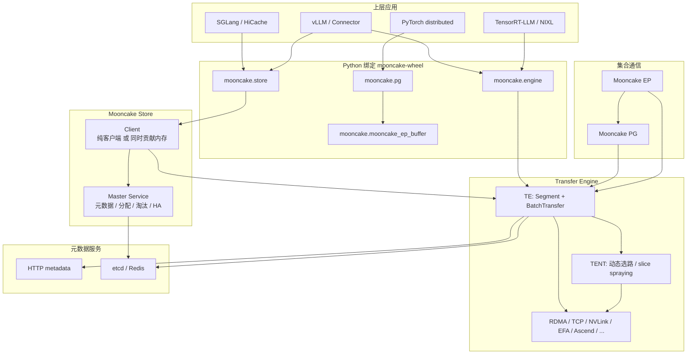

# LLM 推理/训练基础设施

Mooncake 是一套 **以 KVCache 为中心的 LLM 推理/训练基础设施**。核心思路是把 Prefill 和 Decode 拆开，再用集群里闲置的 CPU / DRAM / SSD 做成解耦的 KVCache 池。数据面走零拷贝、多网卡聚合；控制面只管元数据和调度。

---

## 一、仓库怎么拆

仓库按组件分目录，CMake 在根 `CMakeLists.txt` 里按开关组装：

| 目录                                                 | 职责                                                    |
| ---------------------------------------------------- | ------------------------------------------------------- |
| `mooncake-transfer-engine/`                          | 数据面：零拷贝传输（TE + 下一代 TENT）                  |
| `mooncake-store/`                                    | 分布式 KVCache：Master + Client                         |
| `mooncake-pg/`                                       | PyTorch ProcessGroup，容错集合通信                      |
| `mooncake-ep/`                                       | MoE Expert Parallel 的 dispatch/combine                 |
| `mooncake-common/`                                   | 公共 cmake、etcd / k8s-lease、公共头文件                |
| `mooncake-wheel/`                                    | Python 包入口（`mooncake.store` / `engine` / `pg`）     |
| `mooncake-integration/`                              | 对接上层框架的胶水层                                    |
| `mooncake-p2p-store/`                                | 早期 P2P Store 示例（生产版已独立成 checkpoint-engine） |
| `mooncake-reshard/`                                  | 权重/分片重排                                           |
| `mooncake-rl/`                                       | RL 相关示例                                             |
| `docs/` / `scripts/` / `benchmarks/` / `monitoring/` | 文档、CI、压测、可观测性                                |

编译开关大致是：`WITH_TE`、`WITH_STORE`、`WITH_EP`、`WITH_P2P_STORE`。

---

## 二、分层架构



三层可以分开记：

1. **应用层**：SGLang / vLLM / TensorRT-LLM 等，Mooncake 当 KV 传输或远端缓存后端。
2. **对象存储层（Store）**：对象级 `Put/Get/Remove`，Master 只管元数据，数据不经过 Master。
3. **传输层（TE / TENT）**：真正搬数据，支持 DRAM / VRAM / NVMe，拓扑感知、多网卡、故障切换。

---

## 三、Transfer Engine：数据面底座

入口：`mooncake-transfer-engine/include/transfer_engine.h`  
实现：`mooncake-transfer-engine/src/`  
传输后端：`src/transport/{rdma,tcp,efa,nvlink,nvmeof,ascend,...}_transport`

两个核心抽象：

- **Segment**：一段可被远端读写的地址空间。每个进程一个 RAM Segment（DRAM/VRAM），也可挂 NVMe-oF Segment。实际注册的是其中若干 **Buffer**。
- **BatchTransfer**：一批非连续区间的异步 Read/Write，类似更灵活的 AllScatter/AllGather。

关键能力：

- 拓扑感知选路（NUMA / PCIe / GPUDirect）
- 大块切 slice，多 NIC 并行
- Endpoint 池化、失败换路
- 元数据走 HTTP / etcd / Redis（和 Store Master 不是一回事）

`tent/` 是下一代运行时：**应用只描述搬什么，不选怎么搬**。运行时动态选 transport、按 telemetry 做 slice spraying，还能走 host memory 中转。

Python 侧：`from mooncake.engine import TransferEngine`。

---

## 四、Mooncake Store：分布式 KVCache

入口：`mooncake-store/include/real_client.h`、`master_service.h`  
进程：`master.cpp` → `mooncake_master`  
Python：`from mooncake.store import MooncakeDistributedStore`

两个角色：

| 组件       | 干什么                                                       | 不干什么                      |
| ---------- | ------------------------------------------------------------ | ----------------------------- |
| **Master** | 对象→segment 映射、空间分配、副本、淘汰、租约、租户配额、快照/HA | 不经手数据                    |
| **Client** | 发 Put/Get，同时可贡献一段 `global_segment` 给集群           | 数据是 Client ↔ Client，走 TE |

Client 可以只当客户端（`global_segment_size=0`），也可以只当存储节点（`local_buffer_size=0`）。部署上常见三种：

1. **嵌入推理进程**：vLLM/SGLang 直接链进来，既发请求也贡献内存。
2. **dummy + real**：每个 rank 一个 dummy，每个实例一个 real，共享内存/零拷贝转发。
3. **独立 store 服务**：`python -m mooncake.mooncake_store_service` 管内存/SSD，推理进程只出网卡。

Master 有单节点模式，也有 etcd/K8s lease 选主的 HA。数据路径上还有 SSD offload、3FS、SPDK、条带化、副本、soft/hard pin。

一次 Put 的大致流程：

```
App → Client.Put
  → RPC Master.PutStart（分配 replica / slice / segment）
  → TE BatchTransfer 把数据写到目标 Client 的 segment
  → RPC Master.PutEnd（提交元数据）
```

Get 反过来：问 Master 拿 replica 位置，再 TE 读过来。

---

## 五、EP / PG：从“搬数据”到“容错通信”

- **PG**（`mooncake-pg/`）：`torch.distributed` backend。座位（rank slot）固定，谁在座（`active_ranks`）可变；支持故障上报和 rank 恢复，不必整组重启。
- **EP**（`mooncake-ep/`）：DeepEP 风格的 MoE dispatch/combine，带 `active_ranks` 和超时感知。依赖 Mooncake PG 交换 RDMA/QP/IPC 元数据。

Python：`from mooncake import pg`，`from mooncake.mooncake_ep_buffer import Buffer`。

---

## 六、Python 包怎么接进来

`mooncake-wheel/mooncake/` 是对外 API 和工具：

- `store` / `async_store` / `mooncake_store_service`：Store
- `engine`（C++ pybind）：TE
- `pg.py` / `mooncake_ep_buffer.py`：PG / EP
- `http_metadata_server.py`、`cli.py`、connector 代理等

C++ 核心通过 pybind11 打进 wheel；上层框架（SGLang HiCache、vLLM Connector）主要调这些 Python API。

---

## 七、读代码的推荐顺序

1. `mooncake-transfer-engine/include/transfer_engine.h` — Segment / BatchTransfer
2. `mooncake-transfer-engine/src/transport/rdma_transport/` — 生产路径
3. `mooncake-store/include/master_service.h` + `real_client.h` — 控制面 / 数据面分工
4. `mooncake-store/src/transfer_task.cpp` — Store 如何调用 TE
5. `mooncake-wheel/mooncake/` — 对外 API 形状
6. 需要看 MoE 时再进 `mooncake-pg/`、`mooncake-ep/`

整体可以记成一句话：**TE 负责搬，Store 负责存，PG/EP 负责集合通信和容错，上层推理框架只消费这三层。**

如果你接下来想往下钻，比较自然的两条线是：Store 的 Put/Get 调用链，或者 TE 的 RDMA 选路和 slice 调度。


# Mooncake解决的问题

**Mooncake 要解决的是：LLM 推理里，KVCache 又大又贵，却被困在单卡、单实例里，算力因此被浪费，延迟还保不住。**

它的办法不是换一个更快的模型，而是把 **KVCache 当成一等公民**：拆开 Prefill/Decode，再用高速网络把 KV 在 GPU / DRAM / SSD 之间共享和搬走。

---

## 解决什么问题

一次对话的推理分成两段：

| 阶段        | 在干什么                                | 瓶颈                  |
| ----------- | --------------------------------------- | --------------------- |
| **Prefill** | 把整段 prompt 算一遍，写出 KVCache      | 算力（GPU compute）   |
| **Decode**  | 一个 token 一个 token 往后续，反复读 KV | 显存带宽、KV 是否还在 |

传统做法是：**同一张 GPU、同一个实例，既做 Prefill 又做 Decode，KV 只存在这张卡的显存里。** 这会撞上三件事：

**1. 两种活抢同一块资源**  
Prefill 来一个长请求，Decode 正在流式吐字的用户就被卡住。反过来，Decode 占满显存，新的 Prefill 进不来。两种负载的最优机器配比本来就不一样，绑在一起两边都别扭。

**2. KV 算一次很贵，却很难复用**  
长上下文的 KV 体积巨大（论文里 LLaMA3-70B、128k tokens 大约 40GB 量级）。同一前缀、多轮对话、Agent 反复请求，本可以复用，但：

- 实例 A 算过的 KV，实例 B 看不见  
- 显存装不下就丢掉，下次再算一遍  
- 集群里 CPU / DRAM / SSD 经常闲着，却没被用来存 KV

结果是：**用最贵的 GPU 在重复做已经做过的事。**

**3. 拆开 Prefill/Decode 之后，KV 怎么过去**  
拆集群是对的，但 Prefill 机器算完的几十 GB KV，要在时限内送到 Decode 机器。走 TCP、走 CPU 拷贝，延迟和带宽都撑不住 SLO。过载时还在硬算，算完也超时，等于白算。

Kimi 线上的痛点可以收成一句话：**不是模型不够快，是 KV 放错地方、搬得太慢、调度还在盲算。**

---

## 怎么解决的

对症下药，分三层。

### 1. 把活拆开：Prefill 集群 + Decode 集群

- Prefill 机器专管「算 KV」  
- Decode 机器专管「读 KV、吐 token」  
- 两边按各自瓶颈独立扩容

这就是图上 **PD 分离**。拆开之后，核心变成一件事：KV 必须在时限内从 A 到 B。

### 2. 把 KV 变成可共享的对象，而不只是某张卡上的临时缓冲

**Mooncake Store** 把 KV（以及后来的权重、embedding）当成分布式对象：

- `Put(key, KV)` / `Get(key)`  
- **Master** 只记「这个 key 在哪、几份副本、该不该淘汰」  
- **数据不经过 Master**，从存 KV 的那台机器内存，直达要 KV 的那台  
- 显存装不下，就落到集群里闲着的 DRAM / SSD，做成多层缓存池

这样：

- 实例之间可以复用同一段前缀的 KV（HiCache / StoreConnector）  
- 引擎重启、升级，缓存还可以还在  
- 「用存储换计算」：多占一点便宜内存，少做一次昂贵 Prefill

Client 既可以只当调用方，也可以自己贡献一块内存给别人存——所以闲置 DRAM 被收进池子。

### 3. 用 Transfer Engine 当搬运工，而不是走普通 RPC

KV 体积大、时延紧，所以不能 `memcpy + TCP`。

**Transfer Engine** 做的是：

- 把可被远程读写的内存登记成 **Segment / Buffer**  
- 一次 **BatchTransfer** 批量 READ/WRITE  
- 生产环境走 **RDMA / GPUDirect**，尽量零拷贝：从对端 DRAM/VRAM 直接进本端  
- 多网卡、按 NUMA/拓扑选路，大块切开并行传

两条上层路径都落在它身上，只是语义不同：

| 场景           | 怎么用 TE                                                    |
| -------------- | ------------------------------------------------------------ |
| **PD 直传**    | Prefill 算完立刻 `BatchTransfer` 给 Decode，不入库（`mooncake.engine`） |
| **跨实例复用** | 先 `Put` 进 Store，别人 `Get`；Store 内部再调 TE 去搬（`mooncake.store`） |

Master 是目录，TE 是搬运。数据面不经过目录。

调度上还有一层（论文重点，代码里更多在服务系统侧）：过载时 **预测这个请求保不住 SLO 就提前拒**，避免把 GPU 浪费在注定超时的 Prefill 上。

---

## 前后对比

```
以前：
  每个实例自己的显存 KV
  Prefill/Decode 绑在一起
  换实例 / 显存满 → 重算
  拆开了也搬不快

现在：
  Prefill 算完 → TE 搬走 或 Store 存下
  Decode / 其它实例 → 直接拿 KV
  闲置 DRAM/SSD → 当 KV 池
  能复用就不重算，能拆开就各自扩
```

官方自己的结果表述是：真实负载下 Kimi 能在满足 SLO 的前提下多扛约 **75%** 请求；模拟长上下文场景吞吐可以高很多。数字不必死记，逻辑是：**少重算 Prefill + 拆资源 + 把 KV 搬走/共享。**

---

## 一句话收束

- **问题**：KVCache 是推理的真正中心，却被当成单卡私货，又难复用、又难跨机、还和 Decode 抢 GPU。  
- **解法**：PD 分离负责「谁算谁读」；Store 负责「KV 放哪、谁能复用」；TE 负责「怎么在时限内搬到」。

EP/PG 是后加的另一类问题（MoE 专家通信、进程容错），不是 Mooncake 最初那篇 FAST 论文要解决的事。今天可以先当旁支。
