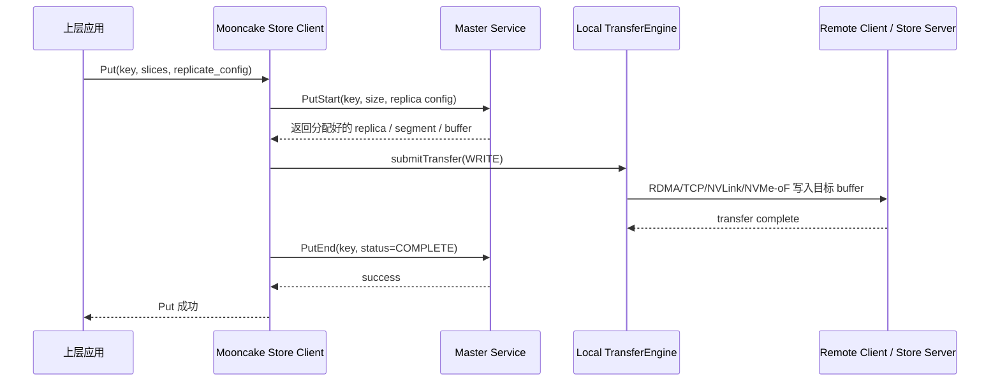
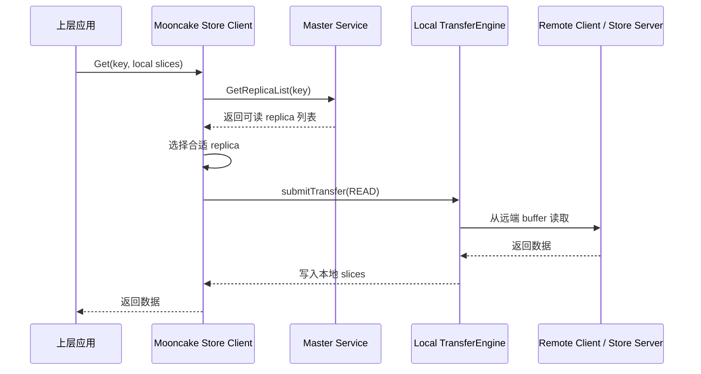

下面是一版适合放到 Markdown 文档里的 Mooncake 架构 Mermaid 图，重点展示 **控制面、数据面、Store、Transfer Engine、EP/PG、上层框架** 之间的关系。

```mermaid
flowchart TB
    %% Upper layer
    subgraph APP["上层 LLM 系统 / 应用层"]
        VLLM["vLLM"]
        SGLANG["SGLang"]
        LMCACHE["LMCache / TensorRT-LLM / 自研推理系统"]
        TRAIN["RL / Training / Checkpoint / Weight Sync"]
    end

    %% Python/C++ bindings
    subgraph API["Mooncake API / Binding 层"]
        PY_STORE["Python Store API<br/>MooncakeDistributedStore"]
        CPP_STORE["C++ Store Client API<br/>Put / Get / Upsert / Remove"]
        PY_TE["Python / C API"]
        CPP_TE["C++ TransferEngine API"]
        PG_API["Mooncake PG<br/>torch.distributed backend"]
        EP_API["Mooncake EP<br/>MoE dispatch / combine"]
    end

    %% Store
    subgraph STORE["Mooncake Store：分布式 KV/Object Cache"]
        MASTER["Master Service<br/>元数据 / 空间分配 / replica / eviction / quota"]
        CLIENT_A["Client A<br/>请求发起者 + 可贡献本地内存"]
        CLIENT_B["Client B<br/>Store Server 角色<br/>贡献 DRAM / VRAM / SSD"]
        CLIENT_C["Client C<br/>Store Server 角色<br/>贡献 DRAM / VRAM / SSD"]
        TASK["Async Task Manager<br/>Copy / Move / Replica 管理"]
    end

    %% Transfer engine
    subgraph TE["Transfer Engine：高性能数据传输层"]
        TE_A["TransferEngine A"]
        TE_B["TransferEngine B"]
        TE_C["TransferEngine C"]

        SEG["Segment<br/>RAM / VRAM / NVMe-oF 地址空间"]
        BUF["Buffer Registration<br/>注册 DRAM / VRAM / SSD buffer"]
        BATCH["BatchTransfer<br/>异步批量 Read / Write"]

        TCP["TCP Transport"]
        RDMA["RDMA / GPUDirect RDMA"]
        EFA["AWS EFA"]
        NVLINK["NVLink / Intra-node"]
        NVME["NVMe-oF / GDS"]
        HETERO["HIP / Ascend / MUSA / MACA 等"]
    end

    %% Metadata/control services
    subgraph META["Metadata / HA / Control Plane"]
        TE_META["Transfer Engine Metadata<br/>etcd / Redis / HTTP / P2P Handshake"]
        HA["HA Coordinator<br/>Leader Election / Oplog / Snapshot"]
        ADMIN["Admin / Metrics / Observability"]
    end

    %% Storage resources
    subgraph RESOURCE["底层资源池"]
        DRAM["CPU DRAM"]
        VRAM["GPU VRAM"]
        SSD["Local SSD / NVMe"]
        DFS["Shared DFS / Object Storage"]
        NIC["Multi-NIC / RDMA HCA"]
    end

    %% EP/PG
    subgraph DIST["分布式执行 / MoE 通信"]
        PG["ProcessGroup<br/>Collectives / P2P / Rank Recovery"]
        EP["Expert Parallel Runtime<br/>active_ranks-aware dispatch/combine"]
    end

    %% App to API
    VLLM --> PY_STORE
    SGLANG --> PY_STORE
    LMCACHE --> CPP_STORE
    TRAIN --> CPP_TE
    SGLANG --> PG_API
    SGLANG --> EP_API

    PY_STORE --> CPP_STORE
    PY_TE --> CPP_TE
    CPP_STORE --> CLIENT_A

    %% Store control path
    CLIENT_A -. "PutStart / GetReplicaList / Remove 等 RPC" .-> MASTER
    CLIENT_B -. "MountSegment / Heartbeat" .-> MASTER
    CLIENT_C -. "MountSegment / Heartbeat" .-> MASTER
    MASTER --> TASK
    MASTER -. "HA 状态同步" .-> HA

    %% Store data path
    CLIENT_A --> TE_A
    CLIENT_B --> TE_B
    CLIENT_C --> TE_C

    TE_A -- "Client-to-Client 数据直传<br/>Master 不经过数据流" --> TE_B
    TE_A -- "Client-to-Client 数据直传" --> TE_C

    %% TE internals
    TE_A --> SEG
    TE_A --> BUF
    TE_A --> BATCH
    TE_B --> SEG
    TE_C --> SEG

    BATCH --> TCP
    BATCH --> RDMA
    BATCH --> EFA
    BATCH --> NVLINK
    BATCH --> NVME
    BATCH --> HETERO

    %% Metadata
    TE_A -. "publish / lookup segment metadata" .-> TE_META
    TE_B -. "publish / lookup segment metadata" .-> TE_META
    TE_C -. "publish / lookup segment metadata" .-> TE_META

    %% Resource mapping
    BUF --> DRAM
    BUF --> VRAM
    BUF --> SSD
    NVME --> DFS
    RDMA --> NIC
    EFA --> NIC

    %% PG/EP
    PG_API --> PG
    EP_API --> EP
    PG --> CPP_TE
    EP --> PG
    EP --> CPP_TE

    %% Admin
    MASTER -.-> ADMIN
    CLIENT_A -.-> ADMIN
    CLIENT_B -.-> ADMIN
```



**整体架构解释**

Mooncake 可以分成三条主线：**KVCache 存储主线、数据传输主线、分布式执行主线**。

第一条是 **Mooncake Store**。它是分布式 KV/Object Cache，面向 LLM 场景存储 KV cache、hidden states、模型权重等大对象。上层系统通常调用 `Put`、`Get`、`Upsert`、`Remove` 这类对象接口。Store 内部有一个 **Master Service**，负责对象元数据、空间分配、replica 管理、驱逐、租户 quota、snapshot 和高可用协调。注意，Master 只在控制面，不承载真实数据流。

第二条是 **Transfer Engine**。这是 Mooncake 的底层高速数据传输引擎。它把本机和远端的 DRAM、VRAM、NVMe-oF 抽象成 `Segment`，把用户注册的内存区域抽象成 `Buffer`，然后通过 `BatchTransfer` 提交异步批量 `READ/WRITE` 请求。具体传输可以走 TCP、RDMA、GPUDirect RDMA、EFA、NVLink、NVMe-oF、HIP、Ascend 等后端。Mooncake Store 的数据真正是通过 Client 到 Client 的 Transfer Engine 直传完成的。

第三条是 **EP / PG**。Mooncake PG 是 PyTorch `torch.distributed` 后端，提供 `all_reduce`、`broadcast`、`all_gather`、`reduce_scatter`、`all_to_all`、P2P 等通信接口，并支持 rank 失效感知和恢复。Mooncake EP 则服务于 MoE 推理，提供 expert-parallel 的 dispatch/combine runtime，并引入 `active_ranks` 概念，让系统可以绕过失败 rank 继续服务。

**关键组件职责**

`Master Service`：

它是 Store 的控制中心。主要负责：

```
对象 key -> replica 列表
replica -> slice / segment / buffer 位置
client 节点注册与心跳
内存/SSD 空间分配
对象删除、驱逐、pin 策略
异步 copy/move task 分发
HA 模式下的 leader、oplog、snapshot
```

但它不搬数据。比如一次 `Get`，Master 只告诉 Client：这个 key 的副本在哪些 segment 上。真正的数据读取由请求方 Client 通过 Transfer Engine 从目标 Client 拉取。

`Client`：

Mooncake Store 里的 Client 有双重身份：

```
1. 应用客户端：接收上层 Put/Get 请求
2. 存储节点：贡献本地 DRAM / VRAM / SSD 作为分布式缓存资源
```

所以一个 Client 可以是纯请求方，也可以是纯 Store Server，也可以两者都是。比如 vLLM 进程内嵌一个 Store Client，它既可以读写 KV cache，也可以把本机内存加入全局缓存池。

`TransferEngine`：

它负责真正的数据通路：

```
registerLocalMemory()  注册本地 buffer
openSegment()          打开远端 segment
submitTransfer()       提交批量传输
getTransferStatus()    查询异步传输状态
```

Transfer Engine 会根据内存位置、设备拓扑、NIC 亲和性选择合适路径。例如 GPU VRAM 到远端 DRAM 可以走 GPUDirect RDMA；同机 GPU 间可以走 NVLink；网络不支持 RDMA 时可以退到 TCP。

`Metadata Service`：

Transfer Engine 自己也需要元数据服务，用来发现远端节点、segment、buffer、RPC 地址、RDMA 设备信息等。这个 metadata service 可以是：

```
etcd
Redis
HTTP metadata server
P2PHANDSHAKE
```

这和 Store Master 不是同一个概念。简单理解：

```
Store Master 管对象位置
TE Metadata 管传输端点和 segment 信息
```

**Put 数据路径**

一次 `Put(key, data)` 大致流程是：



重点是：Master 参与开始和结束确认，但数据不经过 Master。

**Get 数据路径**

一次 `Get(key)` 大致流程是：



这里的核心优化点是 replica 选择、并行 slice 传输、多 NIC 聚合和零拷贝。

**Mooncake 的接口分层**

面向应用的主要接口：

```
Python:
MooncakeDistributedStore.setup()
MooncakeDistributedStore.put()
MooncakeDistributedStore.get()
MooncakeDistributedStore.close()

C++ Store:
Client::Init()
Client::Put()
Client::Get()
Client::Upsert()
Client::Remove()
Client::CreateCopyTask()
Client::CreateMoveTask()
Client::QueryTask()
```

面向底层传输的接口：

```
TransferEngine::init()
TransferEngine::registerLocalMemory()
TransferEngine::openSegment()
TransferEngine::allocateBatchID()
TransferEngine::submitTransfer()
TransferEngine::getTransferStatus()
TransferEngine::freeBatchID()
```

面向 PyTorch 分布式的接口：

```
dist.init_process_group(backend="mooncake")
dist.all_reduce()
dist.broadcast()
dist.all_gather()
dist.reduce_scatter_tensor()
dist.all_to_all()
dist.isend()
dist.irecv()
```

面向弹性恢复的接口：

```
pg.get_active_ranks()
pg.get_peer_state()
pg.activate_ranks()
pg.deactivate_ranks()
pg.recover_ranks()
pg.join_group()
pg.sync_after_failure()
```

**一句话总结**

Mooncake 的架构核心是：**Master 管元数据，Client 提供和访问缓存资源，Transfer Engine 负责高速零拷贝数据直传，EP/PG 负责 MoE 和 PyTorch 分布式通信，上层 vLLM/SGLang 通过 Python/C++ 接口接入。**
