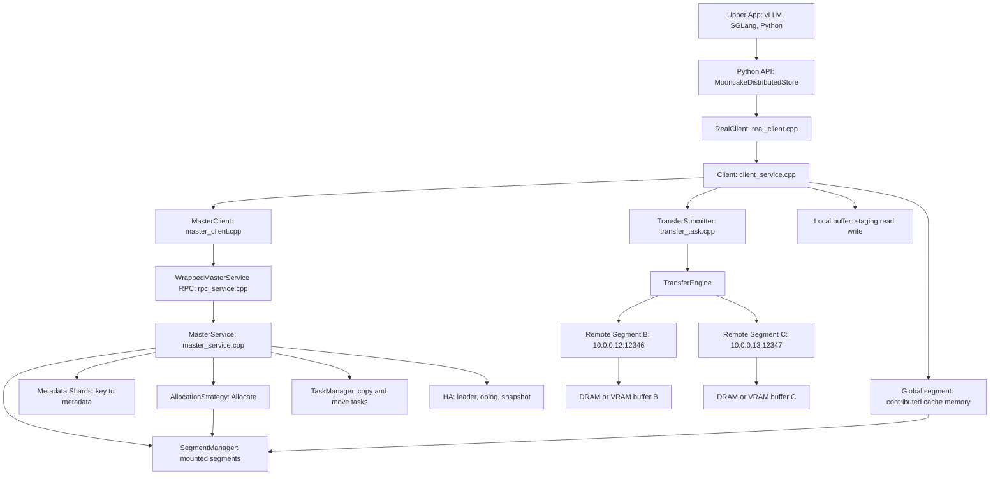
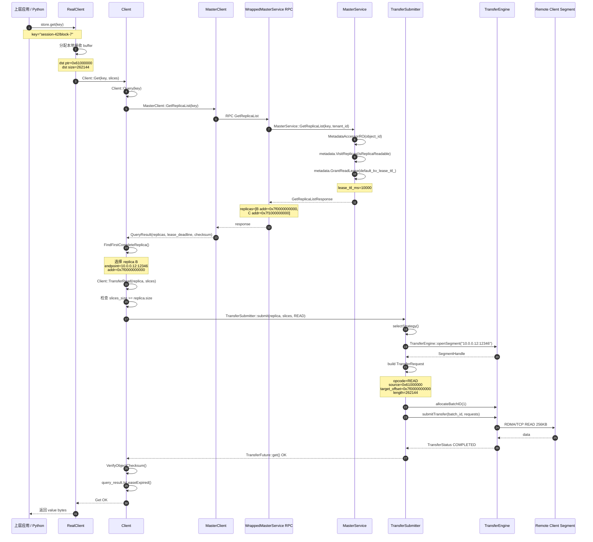
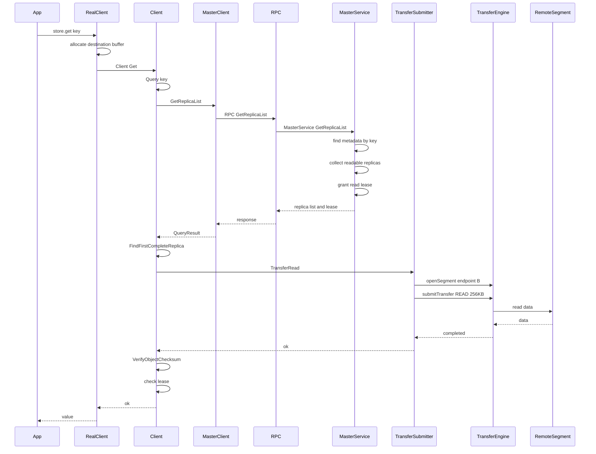

**对应代码入口表**

| 阶段                      | 方法                                       | 文件                                                         |
| ------------------------- | ------------------------------------------ | ------------------------------------------------------------ |
| Python put 入口           | `RealClient::put_internal`                 | [real_client.cpp (line 1897)](/data/home/xli49/lxy/Mooncake/mooncake-store/src/real_client.cpp:1897) |
| Store put 主逻辑          | `Client::Put`                              | [client_service.cpp (line 1843)](/data/home/xli49/lxy/Mooncake/mooncake-store/src/client_service.cpp:1843) |
| Master put start RPC      | `MasterClient::PutStart`                   | [master_client.cpp (line 560)](/data/home/xli49/lxy/Mooncake/mooncake-store/src/master_client.cpp:560) |
| Master 分配入口           | `MasterService::PutStart`                  | [master_service.cpp (line 4000)](/data/home/xli49/lxy/Mooncake/mooncake-store/src/master_service.cpp:4000) |
| 真正分配 metadata/replica | `MasterService::AllocateAndInsertMetadata` | [master_service.cpp (line 3717)](/data/home/xli49/lxy/Mooncake/mooncake-store/src/master_service.cpp:3717) |
| 写数据                    | `Client::TransferWrite`                    | [client_service.cpp (line 4424)](/data/home/xli49/lxy/Mooncake/mooncake-store/src/client_service.cpp:4424) |
| 提交传输                  | `TransferSubmitter::submit`                | [transfer_task.cpp (line 991)](/data/home/xli49/lxy/Mooncake/mooncake-store/src/transfer_task.cpp:991) |
| 构造 TransferRequest      | `submitTransferEngineOperation`            | [transfer_task.cpp (line 1274)](/data/home/xli49/lxy/Mooncake/mooncake-store/src/transfer_task.cpp:1274) |
| Transfer Engine 提交      | `TransferEngine::submitTransfer`           | [transfer_task.cpp (line 1250)](/data/home/xli49/lxy/Mooncake/mooncake-store/src/transfer_task.cpp:1250) |
| Put 完成确认              | `MasterService::PutEnd`                    | [master_service.cpp (line 4207)](/data/home/xli49/lxy/Mooncake/mooncake-store/src/master_service.cpp:4207) |
| Get 查询入口              | `Client::Query`                            | [client_service.cpp (line 1201)](/data/home/xli49/lxy/Mooncake/mooncake-store/src/client_service.cpp:1201) |
| Master 查询 replica       | `MasterService::GetReplicaList`            | [master_service.cpp (line 3367)](/data/home/xli49/lxy/Mooncake/mooncake-store/src/master_service.cpp:3367) |
| 读数据                    | `Client::TransferRead`                     | [client_service.cpp (line 4442)](/data/home/xli49/lxy/Mooncake/mooncake-store/src/client_service.cpp:4442) |
| 启动挂载 segment          | `Client::MountSegmentAndGetId`             | [client_service.cpp (line 3483)](/data/home/xli49/lxy/Mooncake/mooncake-store/src/client_service.cpp:3483) |
| Master 接收 segment       | `MasterService::MountSegment`              | [master_service.cpp (line 831)](/data/home/xli49/lxy/Mooncake/mooncake-store/src/master_service.cpp:831) |

核心还是这条线：

```
Put:
Client::Put
  -> MasterService::PutStart
  -> AllocateAndInsertMetadata
  -> Client::TransferWrite
  -> TransferEngine::submitTransfer
  -> MasterService::PutEnd

Get:
Client::Get
  -> MasterService::GetReplicaList
  -> Client::TransferRead
  -> TransferEngine::submitTransfer
```

Master 线上标的方法基本就是：`MountSegment`、`PutStart`、`AllocateAndInsertMetadata`、`GetReplicaList`、`PutEnd`、`Remove`、`CreateCopyTask/QueryTask`。数据面标的方法是：`TransferWrite/TransferRead`、`TransferSubmitter::submit`、`openSegment`、`submitTransfer`。


可以。我们按 **“一个 Client 启动、Put 一个对象、Get 这个对象”** 从入口讲。下面用具体数值带进去：

```
local_hostname = "10.0.0.11"
metadata_server = "http://10.0.0.1:8080/metadata"
master_server_addr = "10.0.0.1:50051"
protocol = "rdma"

Client A: 10.0.0.11:12345，请求方
Client B: 10.0.0.12:12346，贡献 1GB DRAM segment
Client C: 10.0.0.13:12347，贡献 1GB DRAM segment

key = "session-42/block-7"
value size = 256KB
replica_num = 2
local_buffer_size = 64MB
global_segment_size = 1GB
```

**1. 启动入口：Client 先注册自己的资源**

Python 用户可能这样调：

```
store.setup(
    "10.0.0.12",
    "http://10.0.0.1:8080/metadata",
    1024 * 1024 * 1024,  # global_segment_size = 1GB
    64 * 1024 * 1024,    # local_buffer_size = 64MB
    "rdma",
    "",
    "10.0.0.1:50051",
)
```

进入 C++ 后，`RealClient::setup_real` 会创建底层 `Client`。关键代码在 [real_client.cpp (line 809)](/data/home/xli49/lxy/Mooncake/mooncake-store/src/real_client.cpp:809)：

```
auto client_opt = mooncake::Client::Create(
    this->local_hostname,
    metadata_server,
    protocol,
    device_name,
    master_server_addr,
    transfer_engine,
    {{"client_mode", "real"}},
    tenant_id);
```

然后它分两块内存：

```
local_buffer_size：本地临时读写 buffer，给 get/put staging 用
global_segment_size：贡献给 Mooncake Store 的全局缓存池
```

`local_buffer_size=64MB` 会注册到 Transfer Engine，但 `remote_accessible=false`，表示它主要给本地发起传输用。代码在 [real_client.cpp (line 848)](/data/home/xli49/lxy/Mooncake/mooncake-store/src/real_client.cpp:848)：

```
client_->RegisterLocalMemory(
    client_buffer_allocator_->getBase(),
    local_buffer_size,
    kWildcardLocation,
    false,
    true);
```

`global_segment_size=1GB` 则会真正挂到 Store 里，成为 Master 可分配的资源。代码在 [real_client.cpp (line 923)](/data/home/xli49/lxy/Mooncake/mooncake-store/src/real_client.cpp:923)：

```
while (global_segment_size > 0) {
    size_t segment_size = std::min(global_segment_size, max_mr_size);
    ...
    ptr = allocate_buffer_allocator_memory(segment_size, this->protocol);
    ...
    client_->MountSegment(ptr, mapped_size, protocol, seg_location);
}
```

假设 Client B 分配出来：

```
ptr = 0x7f0000000000
mapped_size = 1GB
protocol = rdma
local_hostname = "10.0.0.12:12346"
```

接着进入 `Client::MountSegmentAndGetId`，代码在 [client_service.cpp (line 3483)](/data/home/xli49/lxy/Mooncake/mooncake-store/src/client_service.cpp:3483)：

```
transfer_engine_->registerLocalMemory((void*)buffer, size,
                                       location, true, true);

Segment segment;
segment.id = generate_uuid();
segment.name = local_hostname_;
segment.base = reinterpret_cast<uintptr_t>(buffer);
segment.size = size;
segment.protocol = protocol;
segment.host_id = host_id_;
segment.te_endpoint = local_hostname_;

master_client_.MountSegment(segment);
```

这个 `Segment` 大概是：

```
id = uuid-b
name = "10.0.0.12:12346"
base = 0x7f0000000000
size = 1073741824
protocol = "rdma"
te_endpoint = "10.0.0.12:12346"
```

Master 收到 `MountSegment` 后，把这个 segment 放进自己的 segment manager/allocator。入口在 [master_service.cpp (line 831)](/data/home/xli49/lxy/Mooncake/mooncake-store/src/master_service.cpp:831)：

```
auto err = segment_access.MountSegment(segment, client_id);
UpdateClientHostId(client_id, segment.host_id);
RecomputeTenantEffectiveQuotas();
```

到这里，Master 已经知道：

```
Client B 有 1GB 可分配内存
Client C 有 1GB 可分配内存
这些内存的 remote endpoint 是谁
每个 segment 当前剩余多少空间
```

**2. Put 入口：Python 到 C++**

用户调用：

```
store.put("session-42/block-7", value_256kb)
```

先进入 `RealClient::put_internal`，代码在 [real_client.cpp (line 1897)](/data/home/xli49/lxy/Mooncake/mooncake-store/src/real_client.cpp:1897)。

它会先从本地 `client_buffer_allocator` 申请一块 staging buffer：

```
auto alloc_result = client_buffer_allocator->allocate(value.size_bytes());
```

假设申请到：

```
local staging ptr = 0x60000000
size = 262144 bytes
```

然后把 Python bytes 拷进去：

```
gather_maybe_device_to_host(
    buffer_handle.ptr(),
    value.data(),
    value.size_bytes(),
    "put:" + key);
```

再把这块 buffer 切成 `Slice`：

```
std::vector<Slice> slices = split_into_slices(buffer_handle);
```

`Slice` 结构很简单，在 [types.h (line 429)](/data/home/xli49/lxy/Mooncake/mooncake-store/include/types.h:429)：

```
struct Slice {
    void* ptr;
    size_t size;
};
```

假设最后得到：

```
slices[0] = { ptr = 0x60000000, size = 262144 }
```

然后进入真正的 Store C++ API：

```
client_->Put(key, slices, config);
```

**3. Client::Put：先找 Master 申请位置**

`Client::Put` 在 [client_service.cpp (line 1843)](/data/home/xli49/lxy/Mooncake/mooncake-store/src/client_service.cpp:1843)。

它先把 slices 的 size 提取出来：

```
std::vector<size_t> slice_lengths;
for (size_t i = 0; i < slices.size(); ++i) {
    slice_lengths.emplace_back(slices[i].size);
}
```

这里得到：

```
slice_lengths = [262144]
```

然后调用 Master：

```
auto start_result = master_client_.PutStart(key, slice_lengths, client_cfg);
```

注意：这里 Client 还没有搬数据。它只是在问 Master：

```
我要写 key=session-42/block-7
总大小 256KB
要 2 个 memory replicas
请给我分配远端 buffer
```

**4. Master::PutStart：检查 key、配额、分配 replica**

Master 入口在 [master_service.cpp (line 4000)](/data/home/xli49/lxy/Mooncake/mooncake-store/src/master_service.cpp:4000)。

先做参数校验：

```
if ((config.replica_num == 0 && ...) || key.empty() || slice_length == 0) {
    return INVALID_PARAMS;
}
```

我们的参数是：

```
replica_num = 2
key 非空
slice_length = 262144
```

通过。

然后检查对象是否已存在：

```
auto it = tenant_state.metadata.find(key);
if (it != tenant_state.metadata.end()) {
    return OBJECT_ALREADY_EXISTS;
}
```

如果 `"session-42/block-7"` 不存在，就进入：

```
AllocateAndInsertMetadata(...)
```

真正分配在 [master_service.cpp (line 3717)](/data/home/xli49/lxy/Mooncake/mooncake-store/src/master_service.cpp:3717)。

关键逻辑：

```
auto allocation_result = allocation_strategy_->Allocate(
    allocator_manager,
    value_length,
    config.replica_num,
    preferred_segments,
    std::set<std::string>(),
    ReplicaType::MEMORY,
    ssd_provider);
```

代入数值：

```
value_length = 262144
replica_num = 2
ReplicaType = MEMORY
可选 segment:
  B: 10.0.0.12:12346, free ~= 1GB
  C: 10.0.0.13:12347, free ~= 1GB
```

假设 allocator 分到：

```
replica 1:
  endpoint = "10.0.0.12:12346"
  buffer_address = 0x7f0000000000
  size = 262144

replica 2:
  endpoint = "10.0.0.13:12347"
  buffer_address = 0x7f1000000000
  size = 262144
```

这些信息会被封装成 `Replica::Descriptor`。相关 descriptor 字段在 [allocator.h (line 82)](/data/home/xli49/lxy/Mooncake/mooncake-store/include/allocator.h:82)：

```
struct Descriptor {
    uint64_t size_;
    uintptr_t buffer_address_;
    std::string protocol_;
    std::string transport_endpoint_;
};
```

Master 随后把对象元数据写入自己的内存表：

```
tenant_state.metadata.emplace(
    key,
    Metadata(client_id, now, value_length, replicas, ...));
tenant_state.processing_keys.insert(key);
```

此时 Master 内部状态大概是：

```
metadata["session-42/block-7"] = {
  size = 262144
  status = PROCESSING
  client_id = Client A
  replicas = [
    {
      type = MEMORY
      status = PROCESSING
      endpoint = "10.0.0.12:12346"
      address = 0x7f0000000000
      size = 262144
    },
    {
      type = MEMORY
      status = PROCESSING
      endpoint = "10.0.0.13:12347"
      address = 0x7f1000000000
      size = 262144
    }
  ]
}
```

然后 `PutStart` 返回 replica descriptors 给 Client A。

**5. Client::Put：拿到位置后开始真正写数据**

回到 [client_service.cpp (line 1912)](/data/home/xli49/lxy/Mooncake/mooncake-store/src/client_service.cpp:1912)：

```
for (const auto& replica : start_result.value()) {
    if (replica.is_memory_replica() || replica.is_nof_replica()) {
        ErrorCode transfer_err = TransferWrite(replica, slices);
        ...
    }
}
```

对第一个 replica，调用：

```
TransferWrite(replica_B, slices)
```

它只是包装：

```
return TransferData(replica_descriptor, slices, TransferRequest::WRITE);
```

在 [client_service.cpp (line 4195)](/data/home/xli49/lxy/Mooncake/mooncake-store/src/client_service.cpp:4195)，`TransferData` 调：

```
future = transfer_submitter_->submit(replica_descriptor, slices, op_code);
return future->get();
```

然后进入 `TransferSubmitter::submit`，在 [transfer_task.cpp (line 991)](/data/home/xli49/lxy/Mooncake/mooncake-store/src/transfer_task.cpp:991)。

对 memory replica：

```
auto& handle = mem_desc.buffer_descriptor;

TransferStrategy strategy = selectStrategy(handle, slices);

case TRANSFER_ENGINE:
    future = submitTransferEngineOperation(handle, slices, op_code);
```

这里 handle 是：

```
handle.size_ = 262144
handle.buffer_address_ = 0x7f0000000000
handle.protocol_ = "rdma"
handle.transport_endpoint_ = "10.0.0.12:12346"
```

**6. Transfer Engine：打开远端 segment，提交 WRITE**

核心在 [transfer_task.cpp (line 1274)](/data/home/xli49/lxy/Mooncake/mooncake-store/src/transfer_task.cpp:1274)：

```
SegmentHandle seg = engine_.openSegment(handle.transport_endpoint_);
```

代入：

```
openSegment("10.0.0.12:12346")
```

Transfer Engine 会通过 metadata server 查到对端的 segment/RDMA 信息。

然后构造 `TransferRequest`：

```
request.opcode = WRITE;
request.source = static_cast<char*>(slice.ptr);
request.target_id = seg;
request.target_offset = base_address + offset;
request.length = slice.size;
```

代入第一个 replica：

```
opcode = WRITE
source = 0x60000000
target_id = segment handle for "10.0.0.12:12346"
target_offset = 0x7f0000000000 + 0
length = 262144
```

然后：

```
BatchID batch_id = engine_.allocateBatchID(batch_size);
engine_.submitTransfer(batch_id, requests);
```

这里：

```
batch_size = 1
requests = [
  WRITE 256KB from local 0x60000000 to B:0x7f0000000000
]
```

第二个 replica 同理：

```
WRITE 256KB from local 0x60000000 to C:0x7f1000000000
```

如果是 RDMA，它会走 RDMA/GPUDirect RDMA；如果同进程或 TCP-only 配置允许，也可能走 local memcpy。选择逻辑在 [transfer_task.cpp (line 1480)](/data/home/xli49/lxy/Mooncake/mooncake-store/src/transfer_task.cpp:1480)。

**7. PutEnd：写完后 Master 把 replica 标为 COMPLETE**

两个 replica 写成功后，`Client::Put` 会调用：

```
master_client_.PutEnd(ObjectMeta{key, object_checksum}, end_type);
```

代码在 [client_service.cpp (line 1960)](/data/home/xli49/lxy/Mooncake/mooncake-store/src/client_service.cpp:1960)。

Master 入口在 [master_service.cpp (line 4207)](/data/home/xli49/lxy/Mooncake/mooncake-store/src/master_service.cpp:4207)。

关键逻辑：

```
metadata.VisitReplicas(
    processing && target_type,
    [](Replica& replica) {
        replica.mark_complete();
    });
```

然后：

```
if (metadata.AllReplicas(&Replica::fn_is_completed) &&
    accessor.InProcessing()) {
    accessor.EraseFromProcessing();
}
```

此时 Master 内部状态变成：

```
metadata["session-42/block-7"] = {
  size = 262144
  status = COMPLETE
  replicas = [
    {
      endpoint = "10.0.0.12:12346"
      address = 0x7f0000000000
      size = 262144
      status = COMPLETE
    },
    {
      endpoint = "10.0.0.13:12347"
      address = 0x7f1000000000
      size = 262144
      status = COMPLETE
    }
  ]
}
```

到这里，`Put` 成功返回。

**8. Get 入口：先问 Master 这个 key 在哪里**

用户调用：

```
data = store.get("session-42/block-7")
```

底层最终进入 `Client::Get`，在 [client_service.cpp (line 1129)](/data/home/xli49/lxy/Mooncake/mooncake-store/src/client_service.cpp:1129)：

```
auto query_result = Query(object_key);
return Get(object_key, query_result.value(), slices);
```

`Query` 做的事很直接：

```
auto result = master_client_.GetReplicaList(object_key);
```

代码在 [client_service.cpp (line 1201)](/data/home/xli49/lxy/Mooncake/mooncake-store/src/client_service.cpp:1201)。

Master 的 `GetReplicaList` 在 [master_service.cpp (line 3367)](/data/home/xli49/lxy/Mooncake/mooncake-store/src/master_service.cpp:3367)。

它会：

```
if (!accessor.Exists()) {
    return OBJECT_NOT_FOUND;
}

metadata.VisitReplicas(
    IsReplicaReadable,
    append replica.get_descriptor());
```

对我们的 key，返回：

```
replicas = [
  B: 0x7f0000000000, 256KB, COMPLETE
  C: 0x7f1000000000, 256KB, COMPLETE
]
lease_ttl_ms = 10000
```

这里还会给对象加读 lease：

```
metadata.GrantReadLease(default_kv_lease_ttl_);
```

意思是：Client 正在读的时候，Master 尽量别把这个对象驱逐/删掉。

**9. Client::Get：选择一个完整 replica，然后 READ**

回到 [client_service.cpp (line 1342)](/data/home/xli49/lxy/Mooncake/mooncake-store/src/client_service.cpp:1342)：

```
Replica::Descriptor replica;
ErrorCode err = FindFirstCompleteReplica(query_result.replicas, replica);
```

假设选中了 B：

```
endpoint = "10.0.0.12:12346"
address = 0x7f0000000000
size = 262144
```

然后：

```
err = TransferRead(replica, slices);
```

`TransferRead` 会先检查用户给的本地 slices 容量够不够，在 [client_service.cpp (line 4442)](/data/home/xli49/lxy/Mooncake/mooncake-store/src/client_service.cpp:4442)：

```
total_size = mem_desc.buffer_descriptor.size_;  // 262144
slices_size = CalculateSliceSize(slices);

if (slices_size < total_size) {
    return INVALID_PARAMS;
}
```

假设本地接收 buffer 是：

```
dst ptr = 0x61000000
dst size = 262144
```

最终还是走 `TransferData(..., READ)`，构造 Transfer Engine 请求：

```
opcode = READ
source = 0x61000000
target_id = segment handle for "10.0.0.12:12346"
target_offset = 0x7f0000000000
length = 262144
```

注意这里 `source` 字段虽然叫 source，但对 READ 来说它是本地目标地址；Transfer Engine 的语义是：

```
READ:
  remote <target_id, target_offset> -> local source

WRITE:
  local source -> remote <target_id, target_offset>
```

读完后，`Client::Get` 还会校验 checksum，如果开启了：

```
VerifyObjectChecksum(...)
```

最后检查 lease 是否过期：

```
if (query_result.IsLeaseExpired()) {
    return LEASE_EXPIRED;
}
```

成功后返回给 Python。

**最核心的调用链总结**

`Put`：

```
Python store.put()
  -> RealClient::put_internal()
  -> Client::Put()
  -> MasterClient::PutStart()
  -> MasterService::PutStart()
  -> MasterService::AllocateAndInsertMetadata()
  -> allocation_strategy_->Allocate()
  -> 返回 Replica::Descriptor 列表
  -> Client::TransferWrite()
  -> TransferSubmitter::submit()
  -> TransferEngine::openSegment()
  -> TransferEngine::allocateBatchID()
  -> TransferEngine::submitTransfer()
  -> MasterClient::PutEnd()
  -> MasterService::PutEnd()
  -> replica PROCESSING -> COMPLETE
```

`Get`：

```
Python store.get()
  -> Client::Get()
  -> Client::Query()
  -> MasterClient::GetReplicaList()
  -> MasterService::GetReplicaList()
  -> 返回 readable replica descriptors + lease
  -> Client::FindFirstCompleteReplica()
  -> Client::TransferRead()
  -> TransferSubmitter::submit()
  -> TransferEngine::openSegment()
  -> TransferEngine::submitTransfer(READ)
  -> data 写入本地 slices
```

**一句话抓重点**

Master Service 在这条链路里只做三件核心事：**注册资源、分配地址、维护状态**。它给 Client 返回的是类似：

```
key = session-42/block-7
replica 1 = endpoint 10.0.0.12:12346, addr 0x7f0000000000, size 256KB
replica 2 = endpoint 10.0.0.13:12347, addr 0x7f1000000000, size 256KB
```

真正的 256KB 数据，从头到尾都不经过 Master，而是 Client 通过 Transfer Engine 直接对这些 endpoint/address 做 RDMA/TCP/NVLink 读写。
