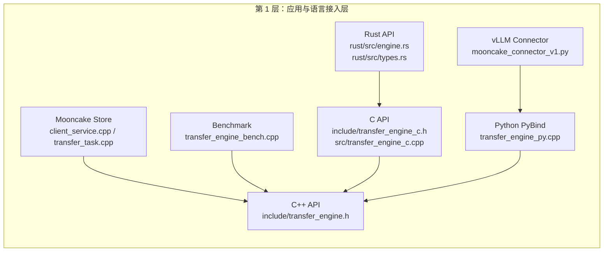
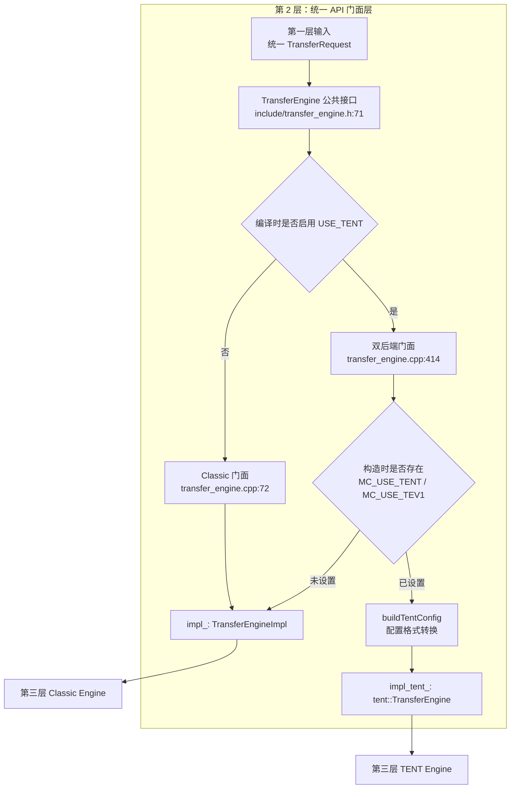
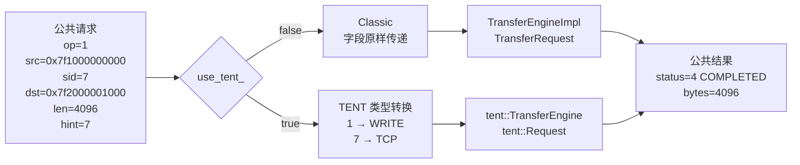

```mermaid
flowchart TB
    subgraph ROOT["Mooncake Transfer Engine 总体架构"]
        direction TB

        subgraph L1["第 1 层：应用与语言接入层"]
            direction LR
            APP["Mooncake Store / vLLM / SGLang / Benchmark"]
            CPP["C++ API"]
            CAPI["C API"]
            PY["Python PyBind"]
            RUST["Rust FFI"]

            APP --> CPP
            APP --> CAPI
            APP --> PY
            APP --> RUST
        end

        subgraph L2["第 2 层：统一 API 门面层"]
            direction LR
            API["TransferEngine<br/>init / openSegment / registerMemory<br/>allocateBatch / submitTransfer / getStatus"]
            SWITCH["运行时选择器<br/>Classic TE 或 TENT"]

            CPP --> API
            CAPI --> API
            PY --> API
            RUST --> API
            API --> SWITCH
        end

        subgraph L3["第 3 层：Engine 生命周期与控制面层"]
            direction LR

            subgraph CLASSIC_CTRL["Classic Transfer Engine"]
                direction TB
                CLASSIC["TransferEngineImpl"]
                CMETA["TransferMetadata<br/>Segment 元数据缓存<br/>Handshake / Notify / Probe"]
                CTOPO["Topology<br/>CPU / NUMA / GPU / NIC 发现"]

                CLASSIC --> CMETA
                CLASSIC --> CTOPO
            end

            subgraph TENT_CTRL["TENT Transfer Engine"]
                direction TB
                TENT["TENT TransferEngineImpl"]
                TCTRL["ControlService<br/>RPC / Bootstrap / Notification"]
                TMGR["SegmentManager<br/>SegmentRegistry / SegmentTracker"]
                TPLAT["Platform + Topology<br/>CPU / CUDA / ROCm / Ascend"]

                TENT --> TCTRL
                TENT --> TMGR
                TENT --> TPLAT
            end

            META["Metadata Service<br/>etcd / Redis / HTTP / P2P"]

            SWITCH -->|"默认"| CLASSIC
            SWITCH -->|"MC_USE_TENT 或 MC_USE_TEV1"| TENT
            CMETA <--> META
            TCTRL <--> META
        end

        subgraph L4["第 4 层：Segment 与内存管理层"]
            direction LR

            subgraph SEGMENT_BOX["Segment 逻辑模型"]
                direction TB
                SEG["Segment<br/>远程可访问的逻辑地址空间"]
                BUF["Buffer<br/>已注册的连续内存区域"]
                DESC["SegmentDesc / BufferDesc<br/>地址 / 长度 / 协议 / 权限 / 设备"]
                SEG --> BUF --> DESC
            end

            subgraph MEMORY_BOX["本地内存管理"]
                direction TB
                ALLOC["内存分配<br/>DRAM / VRAM / SHM"]
                REG["内存注册<br/>registerLocalMemory"]
                KEY["协议资源生成<br/>MR Key / IPC Handle / SHM Name"]
                ALLOC --> REG --> KEY
            end

            subgraph REMOTE_BOX["远端内存视图"]
                direction TB
                OPEN["openSegment"]
                CACHE["远端 Segment 缓存"]
                ROUTE_META["目标协议 / 地址范围<br/>rkey / 设备 / 拓扑"]
                OPEN --> CACHE --> ROUTE_META
            end

            CMETA --> SEG
            TMGR --> SEG
            DESC --> REG
            KEY --> CMETA
            KEY --> TCTRL
            CMETA --> OPEN
            TCTRL --> OPEN
        end

        subgraph L5["第 5 层：请求编排与调度层"]
            direction LR

            subgraph CLASSIC_SCHED["Classic 调度路径"]
                direction TB
                CBATCH["BatchDesc"]
                CTASK["TransferTask"]
                CSLICE["Slice"]
                MULTI["MultiTransport<br/>协议选择 / 分组提交"]
                CBATCH --> CTASK --> CSLICE --> MULTI
            end

            subgraph TENT_SCHED["TENT 调度路径"]
                direction TB
                TBATCH["Batch"]
                TTASK["TaskInfo / SubBatch"]
                SELECT["TransportSelector<br/>策略 / Hint / 本地性 / 设备掩码"]
                QUEUE["Admission Queue<br/>合并 / QoS / Dispatch Window"]
                PROXY["ProxyManager<br/>Staging / Delegate / Failover"]
                PROGRESS["ProgressWorker<br/>重试 / 取消 / 完成推进"]

                TBATCH --> TTASK --> SELECT
                SELECT --> QUEUE --> PROXY --> PROGRESS
            end

            CLASSIC --> CBATCH
            TENT --> TBATCH
            ROUTE_META -.-> MULTI
            ROUTE_META -.-> SELECT
        end

        subgraph L6["第 6 层：Transport 数据面层"]
            direction TB

            CONTRACT["Transport 统一抽象<br/>install / registerMemory / openChannel<br/>submitTransfer / getTransferStatus"]

            subgraph LOCAL_BOX["节点内传输"]
                direction LR
                MEMCPY["Local Copy"]
                SHM["SHM"]
                NVLINK["NVLink / HIP"]
                LOCAL_ACCEL["MUSA / MACA / FlagCX"]
            end

            subgraph NETWORK_BOX["节点间网络传输"]
                direction LR
                RDMA["RDMA / RDMA Two-sided"]
                EFA["EFA / CXI"]
                TCP["TCP / HP-TCP"]
                UB["UB / MPComm"]
            end

            subgraph STORAGE_BOX["存储与共享设备"]
                direction LR
                NVMEOF["NVMe-oF / GDS"]
                IOURING["io_uring"]
                CXL["CXL / UBShmem"]
            end

            subgraph DEVICE_BOX["加速器专用传输"]
                direction LR
                ASCEND["Ascend Direct / HCCL"]
                NCCL["NCCL"]
                SUNRISE["Sunrise Link"]
            end

            MULTI --> CONTRACT
            PROGRESS --> CONTRACT
            CONTRACT --> LOCAL_BOX
            CONTRACT --> NETWORK_BOX
            CONTRACT --> STORAGE_BOX
            CONTRACT --> DEVICE_BOX
        end

        subgraph L7["第 7 层：执行资源与硬件层"]
            direction TB

            RESOURCE["Transport 执行资源<br/>Worker / Progress Thread / Endpoint / Session<br/>QP / CQ / Stream / Event / Credit / Retry"]

            subgraph HARDWARE_BOX["底层硬件资源"]
                direction LR
                DRAM["DRAM / NUMA Memory"]
                GPU["GPU / NPU Memory"]
                NIC["RDMA NIC / EFA / Ethernet / UB"]
                DISK["NVMe / NVMe-oF / CXL"]
            end

            LOCAL_BOX --> RESOURCE
            NETWORK_BOX --> RESOURCE
            STORAGE_BOX --> RESOURCE
            DEVICE_BOX --> RESOURCE

            RESOURCE --> DRAM
            RESOURCE --> GPU
            RESOURCE --> NIC
            RESOURCE --> DISK
        end
    end

    classDef component fill:#ffffff,stroke:#334155,stroke-width:1.5px,color:#111827;
    classDef service fill:#ecfeff,stroke:#0e7490,stroke-width:1.5px,color:#164e63;

    class APP,CPP,CAPI,PY,RUST,API,SWITCH,CLASSIC,CMETA,CTOPO,TENT,TCTRL,TMGR,TPLAT component;
    class SEG,BUF,DESC,ALLOC,REG,KEY,OPEN,CACHE,ROUTE_META component;
    class CBATCH,CTASK,CSLICE,MULTI,TBATCH,TTASK,SELECT,QUEUE,PROXY,PROGRESS component;
    class CONTRACT,MEMCPY,SHM,NVLINK,LOCAL_ACCEL,RDMA,EFA,TCP,UB,NVMEOF,IOURING,CXL,ASCEND,NCCL,SUNRISE component;
    class RESOURCE,DRAM,GPU,NIC,DISK component;
    class META service;

    style ROOT fill:#ffffff,stroke:#111827,stroke-width:3px
    style L1 fill:#f8fafc,stroke:#475569,stroke-width:2px
    style L2 fill:#f8fafc,stroke:#475569,stroke-width:2px
    style L3 fill:#f8fafc,stroke:#475569,stroke-width:2px
    style L4 fill:#f8fafc,stroke:#475569,stroke-width:2px
    style L5 fill:#f8fafc,stroke:#475569,stroke-width:2px
    style L6 fill:#f8fafc,stroke:#475569,stroke-width:2px
    style L7 fill:#f8fafc,stroke:#475569,stroke-width:2px
```

# 应用与语言接入层

所有地址都是示意值，真实运行时必须来自实际分配并注册的内存，不能直接硬编码后解引用。

**第一层代码分布**



**贯穿示例值**

| 技术概念   | 示例值                           | 快递类比           | 实际含义                                  |
| ---------- | -------------------------------- | ------------------ | ----------------------------------------- |
| Metadata   | `http://10.0.0.10:8080/metadata` | 物流调度中心       | 查询节点、Segment 等元数据信息            |
| 本地节点   | `10.0.0.21:12345`                | 发货仓库           | Initiator，主动发起数据传输               |
| 目标节点   | `10.0.0.22:12345`                | 收货仓库           | Target，数据最终写入的节点                |
| 本地地址   | `0x7f1000000000`                 | 发货仓库的货架位置 | 本地待发送 Buffer 的内存地址              |
| 远端地址   | `0x7f2000001000`                 | 收货仓库的货架位置 | Target 对外发布的 Buffer 地址             |
| 长度       | `4096`                           | 货物大小           | 本次传输 4096 Bytes，即 4 KiB             |
| 操作类型   | `WRITE = 1`                      | 发货/搬货          | 把本地 Buffer 中的数据写入远端 Buffer     |
| Segment ID | `7`                              | 收货仓库编号       | `openSegment()` 后获得的目标 Segment 标识 |
| Task ID    | `0`                              | 快递单号           | 标识 Batch 中的第一个传输任务             |

**已经有远端地址为什么segment id？**

远端地址只表示“具体写到哪块内存”，Segment ID 表示“这块内存属于哪个目标 Segment”。

```python
Segment 7
    └── 远端地址 0x7f2000001000
          └── 写入 4096 字节
        
struct TransferRequest {
    OpCode opcode;
    void *source;
    SegmentID target_id;
    size_t target_offset;
    size_t length;
};

TransferRequest req {
    .opcode        = OpCode::WRITE, // 执行写操作
    .source        = local_buffer,  // 本地待写入数据
    .target_id     = 7,             // 写入 Segment 7
    .target_offset = ...,           // 定位到远端地址 0x1000
    .length        = 4096           // 写入 4096 字节
};

final_remote_addr = segment_base_addr + target_offset;
```

提交后轮询，再释放 Batch”的模式：[efa_first_submit_probe.cpp (line 152)](/data/home/xli49/lxy/Mooncake/mooncake-transfer-engine/example/efa_first_submit_probe.cpp:152)。

```python
SegmentHandle segment =
    engine.openSegment("10.0.0.22:12345");

if (segment == static_cast<SegmentHandle>(-1)) {
    // openSegment 失败
    return;
}

BatchID batch_id = engine.allocateBatchID(1);
if (batch_id == INVALID_BATCH_ID) {
    return;
}

TransferRequest req{};
req.opcode = TransferRequest::WRITE;
req.source = local_buffer;          // 已分配、已注册的本地地址
req.target_id = segment;
req.target_offset = remote_address; // 远端已注册内存的真实虚拟地址
req.length = 4096;

Status result = engine.submitTransfer(batch_id, {req});
if (!result.ok()) {
    // 提交失败
    return;
}

TransferStatus transfer_status{};
for (;;) {
    result = engine.getTransferStatus(batch_id, 0, transfer_status);
    if (!result.ok()) {
        // 查询失败
        break;
    }

    if (transfer_status.s == TransferStatusEnum::COMPLETED) {
        // 写入完成
        break;
    }

    if (transfer_status.s == TransferStatusEnum::FAILED) {
        // 传输失败
        break;
    }

    std::this_thread::yield(); # Temporarily give other ready threads a chance to run.
}

result = engine.freeBatchID(batch_id);
```


## 1. 应用调用方

Mooncake Store 创建并初始化 Engine 的位置在 [client_service.cpp (line 750)](/data/home/xli49/lxy/Mooncake/mooncake-store/src/client_service.cpp:750)，真正提交请求在 [transfer_task.cpp (line 1226)](/data/home/xli49/lxy/Mooncake/mooncake-store/src/transfer_task.cpp:1226)。

```python
1）准备全局配置
        ↓
2）确定 TENT / 自动发现模式
        ↓
3）读取协议环境变量
        ↓
4）初始化 TransferEngine
        ↓
5）安装具体 Transport
```


vLLM Connector 初始化 Python Engine 的位置在 [mooncake_connector_v1.py (line 397)](/data/home/xli49/lxy/Mooncake/mooncake-wheel/mooncake/mooncake_connector_v1.py:397)：

```
self.engine = TransferEngine()
self.hostname = get_ip()
ret_value = self.engine.initialize(
    self.hostname, "P2PHANDSHAKE", VLLM_MOONCAKE_PROTOCOL, ""
)
self.rpc_port = self.engine.get_rpc_port()
```

vLLM 从 PyTorch Tensor 提取真实地址和长度：

```
base_addr = cache.data_ptr()
curr_tensor_size_bytes = cache.nbytes
kv_data_ptrs.append(base_addr)
kv_data_lens.append(curr_tensor_size_bytes)

self.engine.batch_register_memory(kv_data_ptrs, kv_data_lens)
```

代码位置：[mooncake_connector_v1.py (line 693)](/data/home/xli49/lxy/Mooncake/mooncake-wheel/mooncake/mooncake_connector_v1.py:693)。

发送 KV Cache 时：

```
ret_value = self.engine.batch_transfer_sync_write(
    remote_session, src_ptrs, dst_ptrs, lengths
)
```

代码位置：[mooncake_connector_v1.py (line 674)](/data/home/xli49/lxy/Mooncake/mooncake-wheel/mooncake/mooncake_connector_v1.py:674)。

代入示例后，相当于：

```
self.engine.batch_transfer_sync_write(
    "10.0.0.22:12345",
    [0x7f1000000000],
    [0x7f2000001000],
    [4096],
)
```

## 2. C++ 直接入口

API 声明位于 [transfer_engine.h (line 71)](/data/home/xli49/lxy/Mooncake/mooncake-transfer-engine/include/transfer_engine.h:71)。Benchmark 的完整使用方式可参考 [transfer_engine_bench.cpp (line 528)](/data/home/xli49/lxy/Mooncake/mooncake-transfer-engine/example/transfer_engine_bench.cpp:528)。

==target_offset = 远端已注册 buffer 的虚拟地址 + buffer 内字节偏移==

remote_base不是发起端自己猜出来的，而是远端分配并注册内存后发布出来的。

```python
malloc / numa_alloc / cudaMalloc
# 远端进程分配一块 CPU 内存或 GPU 显存，返回远端虚拟地址 addr。
        │
        ▼
registerLocalMemory(addr, size)
# 向 Mooncake 注册地址范围 [addr, addr + size)，使其能够被传输引擎访问。
# 对 RDMA 来说，这一步还会把内存注册为 Memory Region（MR）。MR = 把普通内存变成“RDMA 网卡被允许直接访问的内存区域” lkey = 本地网卡访问本地 MR   rkey = 远端机器访问这个 MR
        │
        ▼
发布 BufferDesc
{ addr, length, rkey }
# 将已注册内存的信息发布到元数据服务：
# addr  ：远端内存的虚拟基址。
# length：这块注册内存的长度。
# rkey  ：允许远端 RNIC 访问该 Memory Region 的密钥。
        │
        ▼
发起端 openSegment()
# 发起端根据远端 Segment 名称获取其元数据，并得到本地使用的 target_id。
# target_id 用于标识目标 Segment，本身不是远端内存地址。
        │
        ▼
读取 segment_desc->buffers[i].addr
# 从远端 Segment 元数据中选择目标 Buffer，并读取它的远端虚拟基址。
# 发起端不需要猜测或硬编码这个地址。
        │
        ▼
target_offset = addr + offset
# 计算本次操作的实际远端目标地址：
# addr   是远端 Buffer 基址。
# offset 是数据在该 Buffer 内的字节偏移。
# 必须保证 offset + length <= BufferDesc.length。
        │
        ▼
RDMA 使用 target_offset + rkey 访问远端内存
# Mooncake 将 target_offset 作为 RDMA Work Request 的 remote_addr，
# 同时设置远端发布的 rkey。
# 远端 RNIC 校验地址范围和 rkey 后，直接读写对应的远端内存。
# target_offset 属于远端进程，本地 CPU 不能直接解引用。
```

```
TransferEngine engine(false);

engine.init("http://10.0.0.10:8080/metadata",
            "10.0.0.21:12345",
            "10.0.0.21", 12345);

engine.installTransport("tcp", nullptr);

// 假设 local_buffer 的运行时值为 0x7f1000000000
engine.registerLocalMemory(local_buffer, 4096, "cpu:0");

SegmentID target = engine.openSegment("10.0.0.22:12345");
// 假设返回 target == 7

BatchID batch = engine.allocateBatchID(1);

TransferRequest request{
    .opcode = TransferRequest::WRITE,          // 数值 1
    .source = local_buffer,                    // 0x7f1000000000
    .target_id = target,                       // 7
    .target_offset = 0x7f2000001000,           // 远端地址
    .length = 4096,
};

Status accepted = engine.submitTransfer(batch, {request});
```

此时 Engine 接收到的五元组是：

```
opcode=1
source=0x7f1000000000
target_id=7
target_offset=0x7f2000001000
length=4096
```

然后轮询：

```
TransferStatus status;
do {
    engine.getTransferStatus(batch, 0, status);
} while (status.s == TransferStatusEnum::WAITING);

assert(status.s == TransferStatusEnum::COMPLETED);
assert(status.transferred_bytes == 4096);

engine.freeBatchID(batch);
engine.unregisterLocalMemory(local_buffer);
```

仓库中的同类真实代码见 [efa_first_submit_probe.cpp (line 125)](/data/home/xli49/lxy/Mooncake/mooncake-transfer-engine/example/efa_first_submit_probe.cpp:125)。

## 3. C API 接入

C 结构定义在 [transfer_engine_c.h (line 25)](/data/home/xli49/lxy/Mooncake/mooncake-transfer-engine/include/transfer_engine_c.h:25)：

```
#define OPCODE_READ  0
#define OPCODE_WRITE 1

struct transfer_request {
    int opcode;
    void *source;
    segment_id_t target_id;
    uint64_t target_offset;
    uint64_t length;
};
```

代入数值：

```
transfer_request_t request = {
    .opcode = OPCODE_WRITE,                 // 1
    .source = (void *)0x7f1000000000,
    .target_id = 7,
    .target_offset = 0x7f2000001000,
    .length = 4096,
};

int rc = submitTransfer(engine, batch_id, &request, 1);
```

C 到 C++ 的转换代码位于 [transfer_engine_c.cpp (line 149)](/data/home/xli49/lxy/Mooncake/mooncake-transfer-engine/src/transfer_engine_c.cpp:149)：

```
native_entries[index].opcode =
    (Transport::TransferRequest::OpCode)entries[index].opcode;
native_entries[index].source = entries[index].source;
native_entries[index].target_id = entries[index].target_id;
native_entries[index].target_offset = entries[index].target_offset;
native_entries[index].length = entries[index].length;

Status s = native->submitTransfer(batch_id, native_entries);
```

这里五个字段的数值保持不变，只是从 C struct 转为 C++ `TransferRequest`。

## 4. Python PyBind 接入

Python 方法绑定位置在 [transfer_engine_py.cpp (line 1300)](/data/home/xli49/lxy/Mooncake/mooncake-integration/transfer_engine/transfer_engine_py.cpp:1300)：

```
.def("transfer_sync_write", &TransferEnginePy::transferSyncWrite,
     py::arg("target_hostname"),
     py::arg("buffer"),
     py::arg("peer_buffer_address"),
     py::arg("length"),
     py::arg("transport_hint") = "")
```

Python 调用：

```
engine.transfer_sync_write(
    "10.0.0.22:12345",
    0x7f1000000000,
    0x7f2000001000,
    4096,
    "tcp",
)
```

`transferSyncWrite()` 在 [transfer_engine_py.cpp (line 446)](/data/home/xli49/lxy/Mooncake/mooncake-integration/transfer_engine/transfer_engine_py.cpp:446) 将操作码补为 `WRITE`，随后 [transferSync() (line 498)](/data/home/xli49/lxy/Mooncake/mooncake-integration/transfer_engine/transfer_engine_py.cpp:498) 构造请求：

```
entry.opcode = TransferRequest::WRITE;
entry.length = 4096;
entry.source = (void*)0x7f1000000000;
entry.target_id = handle;                 // 假设 openSegment 返回 7
entry.target_offset = 0x7f2000001000;
entry.transport_hint = parseTransportHint("tcp");
```

Python 同步接口还自动执行：

```
openSegment → allocateBatchID(1) → submitTransfer
→ getTransferStatus(batch, 0) → freeBatchID
```

## 5. Rust FFI 接入

Rust 请求结构位于 [types.rs (line 103)](/data/home/xli49/lxy/Mooncake/mooncake-transfer-engine/rust/src/types.rs:103)，使用 `#[repr(C)]` 保证与 C 内存布局一致：

```
let request = TransferRequest::write(
    0x7f1000000000usize as *mut c_void,
    7,
    0x7f2000001000,
    4096,
);
```

同步便利接口位于 [engine.rs (line 586)](/data/home/xli49/lxy/Mooncake/mooncake-transfer-engine/rust/src/engine.rs:586)：

```
engine.transfer_sync_write(
    "10.0.0.22:12345",
    0x7f1000000000usize as *mut c_void,
    0x7f2000001000,
    4096,
)?;
```

内部在 [engine.rs (line 615)](/data/home/xli49/lxy/Mooncake/mooncake-transfer-engine/rust/src/engine.rs:615) 执行：

```
let target_id = self.open_segment_cached(target_hostname)?; // 假设为 7
let req = TransferRequest {
    opcode: Opcode::Write,     // 1
    source: local,
    target_id,                 // 7
    target_offset: remote_offset,
    length,
};
self.submit_and_wait(&[req], None)
```

因此四条语言路径最终都产生相同的请求：

```
WRITE(1), local=0x7f1000000000, segment=7,
remote=0x7f2000001000, length=4096
```

区别只在第一层的参数封装、类型转换和同步便利逻辑，真正的数据传输从下一层统一 `TransferEngine` 门面开始。


下面只分析第二层：**统一 API 门面层**。这一层不执行网络传输，主要负责：

1.  向四种语言入口提供统一的 `TransferEngine`。
2.  选择 Classic TE 或 TENT。
3.  在公共类型与 TENT 类型之间转换参数、状态和错误。

**第二层架构与代码位置**

````

````

公共声明位于 [transfer_engine.h (line 71)](/data/home/xli49/lxy/Mooncake/mooncake-transfer-engine/include/transfer_engine.h:71)，两个后端成员位于 [transfer_engine.h (line 302)](/data/home/xli49/lxy/Mooncake/mooncake-transfer-engine/include/transfer_engine.h:302)：

```
std::shared_ptr<TransferEngineImpl> impl_;
std::shared_ptr<mooncake::tent::TransferEngine> impl_tent_;
std::vector<std::string> tent_device_filter_;
bool use_tent_{false};
```

继续使用上一层示例：

```
metadata      = http://10.0.0.10:8080/metadata
local segment = 10.0.0.21:12345
remote segment= 10.0.0.22:12345
source        = 0x7f1000000000
target_offset = 0x7f2000001000
length        = 4096
opcode        = WRITE = 1
transport_hint= TCP = 7
```

## 1. 构造时选择后端

代码位置：[transfer_engine.cpp (line 414)](/data/home/xli49/lxy/Mooncake/mooncake-transfer-engine/src/transfer_engine.cpp:414)

```
TransferEngine::TransferEngine(bool auto_discover) {
    if (getenv("MC_USE_TENT") || getenv("MC_USE_TEV1")) {
        use_tent_ = true;
    }
    if (!use_tent_) {
        impl_ = std::make_shared<TransferEngineImpl>(auto_discover);
    }
}
```

假设程序启动前没有设置环境变量：

```
unset MC_USE_TENT
```

构造结果为：

```
use_tent_ = false
impl_ = 有效的 Classic TransferEngineImpl
impl_tent_ = nullptr
```

如果启动前设置：

```
export MC_USE_TENT=1
```

构造结果为：

```
use_tent_ = true
impl_ = nullptr
impl_tent_ = nullptr
```

此时 TENT 对象要等到 `init()` 才创建。因此环境变量必须在构造 `TransferEngine` 之前设置。

如果编译时根本没有启用 `USE_TENT`，使用的是 [transfer_engine.cpp (line 72)](/data/home/xli49/lxy/Mooncake/mooncake-transfer-engine/src/transfer_engine.cpp:72)，不会检查环境变量：

```
TransferEngine::TransferEngine(bool auto_discover)
    : impl_(std::make_shared<TransferEngineImpl>(auto_discover)) {}
```

## 2. `init()` 如何分流

入口位置：[transfer_engine.cpp (line 517)](/data/home/xli49/lxy/Mooncake/mooncake-transfer-engine/src/transfer_engine.cpp:517)

```
if (!use_tent_) {
    return impl_->init(metadata_conn_string, local_server_name,
                       ip_or_host_name, rpc_port);
}

auto config = buildTentConfig(metadata_conn_string, local_server_name);

if (protocol == "tcp") {
    mooncake::tent::ConfigHelper::forceTcp(*config);
}

impl_tent_ =
    std::make_shared<mooncake::tent::TransferEngine>(config);

return impl_tent_->available() ? 0 : 1;
```

代入示例调用：

```
engine.init(
    "http://10.0.0.10:8080/metadata",
    "10.0.0.21:12345",
    "10.0.0.21",
    12345,
    "tcp"
);
```

Classic 路径得到：

```
metadata_conn_string = "http://10.0.0.10:8080/metadata"
local_server_name     = "10.0.0.21:12345"
ip_or_host_name       = "10.0.0.21"
rpc_port              = 12345
```

TENT 路径先执行 [buildTentConfig() (line 489)](/data/home/xli49/lxy/Mooncake/mooncake-transfer-engine/src/transfer_engine.cpp:489)：

```
config->set("local_segment_name", local_server_name);

auto [type, servers] =
    parseConnectionStringInternal(metadata_conn_string);

config->set("metadata_type", type);
config->set("metadata_servers", servers);
```

生成的 TENT 配置相当于：

```
local_segment_name = "10.0.0.21:12345"
metadata_type      = "http"
metadata_servers   = "10.0.0.10:8080/metadata"
transports/tcp     = 强制启用
```

TENT 门面没有直接使用传入的 `ip_or_host_name="10.0.0.21"` 和 `rpc_port=12345`，而是由 TENT 配置和控制服务决定监听参数。

## 3. `registerLocalMemory()` 分流

代码位置：[transfer_engine.cpp (line 649)](/data/home/xli49/lxy/Mooncake/mooncake-transfer-engine/src/transfer_engine.cpp:649)

调用参数：

```
engine.registerLocalMemory(
    reinterpret_cast<void*>(0x7f1000000000),
    4096,
    "cpu:0",
    true,
    true
);
```

门面实现：

```
if (use_tent_) {
    mooncake::tent::MemoryOptions option;

    if (!location.empty() && location != kWildcardLocation)
        option.location = location;

    auto status =
        impl_tent_->registerLocalMemory(addr, length, option);

    return static_cast<int>(status.code());
}

return impl_->registerLocalMemory(
    addr, length, location, remote_accessible, update_metadata);
```

Classic 下五个参数原样传递：

```
addr              = 0x7f1000000000
length            = 4096
location          = "cpu:0"
remote_accessible = true
update_metadata   = true
```

TENT 下转换为：

```
addr                    = 0x7f1000000000
length                  = 4096
MemoryOptions.location  = "cpu:0"
```

这里公共门面的 `remote_accessible` 和 `update_metadata` 没有继续传给 TENT。

## 4. `openSegment()` 分流

代码位置：[transfer_engine.cpp (line 605)](/data/home/xli49/lxy/Mooncake/mooncake-transfer-engine/src/transfer_engine.cpp:605)

```
SegmentHandle TransferEngine::openSegment(
    const std::string& segment_name) {
    if (use_tent_) {
        SegmentHandle handle;
        auto status =
            impl_tent_->openSegment(handle, segment_name);

        if (!status.ok())
            return static_cast<SegmentHandle>(ERR_INVALID_ARGUMENT);

        return handle;
    }

    return impl_->openSegment(segment_name);
}
```

代入：

```
auto segment_id =
    engine.openSegment("10.0.0.22:12345");
```

假设成功返回：

```
segment_name = "10.0.0.22:12345"
segment_id   = 7
```

两种后端对外都返回 `7`。区别是失败时，TENT 的详细 `Status` 会被门面压缩成 `ERR_INVALID_ARGUMENT`。

## 5. `allocateBatchID()` 分流

代码位置：[transfer_engine.cpp (line 716)](/data/home/xli49/lxy/Mooncake/mooncake-transfer-engine/src/transfer_engine.cpp:716)

```
if (use_tent_) {
    const auto batch_id = impl_tent_->allocateBatch(batch_size);
    return batch_id == 0 ? INVALID_BATCH_ID : batch_id;
}

return impl_->allocateBatchID(batch_size);
```

调用：

```
BatchID batch_id = engine.allocateBatchID(1);
```

假设内部返回：

```
Classic BatchID = 0x55aa00001000
TENT BatchID    = 0x55bb00002000
```

调用方不能解释这些数值。它们只是 opaque handle，只能传回同一个 Engine。

TENT 内部失败值是 `0`，门面会转换为公共失败值：

```
INVALID_BATCH_ID = UINT64_MAX
                 = 18446744073709551615
```

## 6. `submitTransfer()` 参数转换

代码位置：[transfer_engine.cpp (line 737)](/data/home/xli49/lxy/Mooncake/mooncake-transfer-engine/src/transfer_engine.cpp:737)

公共请求为：

```
TransferRequest request{
    .opcode = TransferRequest::WRITE,
    .source = reinterpret_cast<void*>(0x7f1000000000),
    .target_id = 7,
    .target_offset = 0x7f2000001000,
    .length = 4096,
    .transport_hint = 7,
};
```

Classic 路径没有转换：

```
return impl_->submitTransfer(batch_id, entries);
```

因此第三层收到的还是：

```
opcode=1, source=0x7f1000000000, target_id=7,
target_offset=0x7f2000001000, length=4096, hint=7
```

TENT 路径逐字段构造 `tent::Request`：

```
mooncake::tent::Request req;
req.opcode =
    (mooncake::tent::Request::OpCode)(int)item.opcode;
req.length = item.length;
req.source = item.source;
req.target_id = item.target_id;
req.target_offset = item.target_offset;
req.transport_hint =
    mooncake::tent::c_to_transport_hint(item.transport_hint);
```

转换结果：

```
公共 WRITE 数值 1       → tent::Request::WRITE
0x7f1000000000          → source 不变
7                       → target_id 不变
0x7f2000001000          → target_offset 不变
4096                    → length 不变
transport_hint 7        → tent::TCP
```

TENT Transport 枚举定义在 [types.h (line 46)](/data/home/xli49/lxy/Mooncake/mooncake-transfer-engine/tent/include/tent/common/types.h:46)，其中：

```
UNSPEC = 0,
RDMA   = 1,
MNNVL  = 2,
SHM    = 3,
NVLINK = 4,
GDS    = 5,
IOURING= 6,
TCP    = 7,
```

公共请求中的 `advise_retry_cnt` 和 `task_group_id` 没有在这个 TENT 兼容转换中复制。

## 7. 状态返回转换

代码位置：[transfer_engine.cpp (line 845)](/data/home/xli49/lxy/Mooncake/mooncake-transfer-engine/src/transfer_engine.cpp:845)

```
if (use_tent_) {
    mooncake::tent::TransferStatus tent_status;

    auto result =
        impl_tent_->getTransferStatus(
            batch_id, task_id, tent_status);

    status.s =
        (TransferStatusEnum)(int)tent_status.s;
    status.transferred_bytes =
        tent_status.transferred_bytes;

    return result.ok()
               ? Status::OK()
               : Status::Context(result.ToString());
}

return impl_->getTransferStatus(batch_id, task_id, status);
```

假设传输完成，TENT 返回：

```
tent_status.s                 = 4
tent_status.transferred_bytes = 4096
```

门面对外转换为：

```
TransferStatusEnum::COMPLETED = 4
status.transferred_bytes      = 4096
函数 Status                   = OK
```

这里有两层状态：

```
函数返回 Status::OK
    表示“状态查询调用本身成功”

status.s == COMPLETED
    表示“4 KiB 数据传输成功完成”
```

## 8. 第二层完整数值流

````

````

第二层的核心结论是：**对外 API 和主要数值保持统一，但门面会处理后端选择、类型转换、错误压缩以及部分兼容差异。**真正创建 Segment、注册 MR、选择 Transport 和提交硬件任务，从第三层开始。

