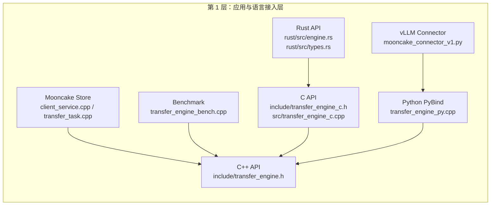

```mermaid
flowchart TB
    subgraph ROOT["Mooncake Transfer Engine 总体架构"]
        direction TB

        subgraph L1["第 1 层：应用与语言接入层"]
            direction LR
            APP["Mooncake Store / vLLM / SGLang / Benchmark"]
            CPP["C++ API"]
            CAPI["C API"]
            PY["Python PyBind"]
            RUST["Rust FFI"]

            APP --> CPP
            APP --> CAPI
            APP --> PY
            APP --> RUST
        end

        subgraph L2["第 2 层：统一 API 门面层"]
            direction LR
            API["TransferEngine<br/>init / openSegment / registerMemory<br/>allocateBatch / submitTransfer / getStatus"]
            SWITCH["运行时选择器<br/>Classic TE 或 TENT"]

            CPP --> API
            CAPI --> API
            PY --> API
            RUST --> API
            API --> SWITCH
        end

        subgraph L3["第 3 层：Engine 生命周期与控制面层"]
            direction LR

            subgraph CLASSIC_CTRL["Classic Transfer Engine"]
                direction TB
                CLASSIC["TransferEngineImpl"]
                CMETA["TransferMetadata<br/>Segment 元数据缓存<br/>Handshake / Notify / Probe"]
                CTOPO["Topology<br/>CPU / NUMA / GPU / NIC 发现"]

                CLASSIC --> CMETA
                CLASSIC --> CTOPO
            end

            subgraph TENT_CTRL["TENT Transfer Engine"]
                direction TB
                TENT["TENT TransferEngineImpl"]
                TCTRL["ControlService<br/>RPC / Bootstrap / Notification"]
                TMGR["SegmentManager<br/>SegmentRegistry / SegmentTracker"]
                TPLAT["Platform + Topology<br/>CPU / CUDA / ROCm / Ascend"]

                TENT --> TCTRL
                TENT --> TMGR
                TENT --> TPLAT
            end

            META["Metadata Service<br/>etcd / Redis / HTTP / P2P"]

            SWITCH -->|"默认"| CLASSIC
            SWITCH -->|"MC_USE_TENT 或 MC_USE_TEV1"| TENT
            CMETA <--> META
            TCTRL <--> META
        end

        subgraph L4["第 4 层：Segment 与内存管理层"]
            direction LR

            subgraph SEGMENT_BOX["Segment 逻辑模型"]
                direction TB
                SEG["Segment<br/>远程可访问的逻辑地址空间"]
                BUF["Buffer<br/>已注册的连续内存区域"]
                DESC["SegmentDesc / BufferDesc<br/>地址 / 长度 / 协议 / 权限 / 设备"]
                SEG --> BUF --> DESC
            end

            subgraph MEMORY_BOX["本地内存管理"]
                direction TB
                ALLOC["内存分配<br/>DRAM / VRAM / SHM"]
                REG["内存注册<br/>registerLocalMemory"]
                KEY["协议资源生成<br/>MR Key / IPC Handle / SHM Name"]
                ALLOC --> REG --> KEY
            end

            subgraph REMOTE_BOX["远端内存视图"]
                direction TB
                OPEN["openSegment"]
                CACHE["远端 Segment 缓存"]
                ROUTE_META["目标协议 / 地址范围<br/>rkey / 设备 / 拓扑"]
                OPEN --> CACHE --> ROUTE_META
            end

            CMETA --> SEG
            TMGR --> SEG
            DESC --> REG
            KEY --> CMETA
            KEY --> TCTRL
            CMETA --> OPEN
            TCTRL --> OPEN
        end

        subgraph L5["第 5 层：请求编排与调度层"]
            direction LR

            subgraph CLASSIC_SCHED["Classic 调度路径"]
                direction TB
                CBATCH["BatchDesc"]
                CTASK["TransferTask"]
                CSLICE["Slice"]
                MULTI["MultiTransport<br/>协议选择 / 分组提交"]
                CBATCH --> CTASK --> CSLICE --> MULTI
            end

            subgraph TENT_SCHED["TENT 调度路径"]
                direction TB
                TBATCH["Batch"]
                TTASK["TaskInfo / SubBatch"]
                SELECT["TransportSelector<br/>策略 / Hint / 本地性 / 设备掩码"]
                QUEUE["Admission Queue<br/>合并 / QoS / Dispatch Window"]
                PROXY["ProxyManager<br/>Staging / Delegate / Failover"]
                PROGRESS["ProgressWorker<br/>重试 / 取消 / 完成推进"]

                TBATCH --> TTASK --> SELECT
                SELECT --> QUEUE --> PROXY --> PROGRESS
            end

            CLASSIC --> CBATCH
            TENT --> TBATCH
            ROUTE_META -.-> MULTI
            ROUTE_META -.-> SELECT
        end

        subgraph L6["第 6 层：Transport 数据面层"]
            direction TB

            CONTRACT["Transport 统一抽象<br/>install / registerMemory / openChannel<br/>submitTransfer / getTransferStatus"]

            subgraph LOCAL_BOX["节点内传输"]
                direction LR
                MEMCPY["Local Copy"]
                SHM["SHM"]
                NVLINK["NVLink / HIP"]
                LOCAL_ACCEL["MUSA / MACA / FlagCX"]
            end

            subgraph NETWORK_BOX["节点间网络传输"]
                direction LR
                RDMA["RDMA / RDMA Two-sided"]
                EFA["EFA / CXI"]
                TCP["TCP / HP-TCP"]
                UB["UB / MPComm"]
            end

            subgraph STORAGE_BOX["存储与共享设备"]
                direction LR
                NVMEOF["NVMe-oF / GDS"]
                IOURING["io_uring"]
                CXL["CXL / UBShmem"]
            end

            subgraph DEVICE_BOX["加速器专用传输"]
                direction LR
                ASCEND["Ascend Direct / HCCL"]
                NCCL["NCCL"]
                SUNRISE["Sunrise Link"]
            end

            MULTI --> CONTRACT
            PROGRESS --> CONTRACT
            CONTRACT --> LOCAL_BOX
            CONTRACT --> NETWORK_BOX
            CONTRACT --> STORAGE_BOX
            CONTRACT --> DEVICE_BOX
        end

        subgraph L7["第 7 层：执行资源与硬件层"]
            direction TB

            RESOURCE["Transport 执行资源<br/>Worker / Progress Thread / Endpoint / Session<br/>QP / CQ / Stream / Event / Credit / Retry"]

            subgraph HARDWARE_BOX["底层硬件资源"]
                direction LR
                DRAM["DRAM / NUMA Memory"]
                GPU["GPU / NPU Memory"]
                NIC["RDMA NIC / EFA / Ethernet / UB"]
                DISK["NVMe / NVMe-oF / CXL"]
            end

            LOCAL_BOX --> RESOURCE
            NETWORK_BOX --> RESOURCE
            STORAGE_BOX --> RESOURCE
            DEVICE_BOX --> RESOURCE

            RESOURCE --> DRAM
            RESOURCE --> GPU
            RESOURCE --> NIC
            RESOURCE --> DISK
        end
    end

    classDef component fill:#ffffff,stroke:#334155,stroke-width:1.5px,color:#111827;
    classDef service fill:#ecfeff,stroke:#0e7490,stroke-width:1.5px,color:#164e63;

    class APP,CPP,CAPI,PY,RUST,API,SWITCH,CLASSIC,CMETA,CTOPO,TENT,TCTRL,TMGR,TPLAT component;
    class SEG,BUF,DESC,ALLOC,REG,KEY,OPEN,CACHE,ROUTE_META component;
    class CBATCH,CTASK,CSLICE,MULTI,TBATCH,TTASK,SELECT,QUEUE,PROXY,PROGRESS component;
    class CONTRACT,MEMCPY,SHM,NVLINK,LOCAL_ACCEL,RDMA,EFA,TCP,UB,NVMEOF,IOURING,CXL,ASCEND,NCCL,SUNRISE component;
    class RESOURCE,DRAM,GPU,NIC,DISK component;
    class META service;

    style ROOT fill:#ffffff,stroke:#111827,stroke-width:3px
    style L1 fill:#f8fafc,stroke:#475569,stroke-width:2px
    style L2 fill:#f8fafc,stroke:#475569,stroke-width:2px
    style L3 fill:#f8fafc,stroke:#475569,stroke-width:2px
    style L4 fill:#f8fafc,stroke:#475569,stroke-width:2px
    style L5 fill:#f8fafc,stroke:#475569,stroke-width:2px
    style L6 fill:#f8fafc,stroke:#475569,stroke-width:2px
    style L7 fill:#f8fafc,stroke:#475569,stroke-width:2px
```

# 应用与语言接入层

所有地址都是示意值，真实运行时必须来自实际分配并注册的内存，不能直接硬编码后解引用。

**第一层代码分布**



**贯穿示例值**

| 技术概念   | 示例值                           | 快递类比           | 实际含义                                  |
| ---------- | -------------------------------- | ------------------ | ----------------------------------------- |
| Metadata   | `http://10.0.0.10:8080/metadata` | 物流调度中心       | 查询节点、Segment 等元数据信息            |
| 本地节点   | `10.0.0.21:12345`                | 发货仓库           | Initiator，主动发起数据传输               |
| 目标节点   | `10.0.0.22:12345`                | 收货仓库           | Target，数据最终写入的节点                |
| 本地地址   | `0x7f1000000000`                 | 发货仓库的货架位置 | 本地待发送 Buffer 的内存地址              |
| 远端地址   | `0x7f2000001000`                 | 收货仓库的货架位置 | Target 对外发布的 Buffer 地址             |
| 长度       | `4096`                           | 货物大小           | 本次传输 4096 Bytes，即 4 KiB             |
| 操作类型   | `WRITE = 1`                      | 发货/搬货          | 把本地 Buffer 中的数据写入远端 Buffer     |
| Segment ID | `7`                              | 收货仓库编号       | `openSegment()` 后获得的目标 Segment 标识 |
| Task ID    | `0`                              | 快递单号           | 标识 Batch 中的第一个传输任务             |

**已经有远端地址为什么segment id？**

远端地址只表示“具体写到哪块内存”，Segment ID 表示“这块内存属于哪个目标 Segment”。

```python
Segment 7
    └── 远端地址 0x7f2000001000
          └── 写入 4096 字节
        
struct TransferRequest {
    OpCode opcode;
    void *source;
    SegmentID target_id;
    size_t target_offset;
    size_t length;
};
```

```python
// 1）打开远端 Segment
SegmentID segment_id = engine.openSegment("10.0.0.22:12345");

// 2）创建一个 Batch
BatchID batch_id = engine.allocateBatchID(1);

// 3）构造一次 WRITE 请求
TransferRequest req;
req.opcode = TransferRequest::WRITE;
req.source = reinterpret_cast<void *>(0x7f1000000000);  // 本地地址
req.target_id = segment_id;                             // 例如 7
req.target_offset = 0x7f2000001000;                    // 远端地址
req.length = 4096;

// 4）提交
engine.submitTransfer(batch_id, {req});

// 5）查询 task 0 的状态
TransferStatus status;
engine.getTransferStatus(batch_id, 0, status);
```


## 1. 应用调用方

Mooncake Store 创建并初始化 Engine 的位置在 [client_service.cpp (line 750)](/data/home/xli49/lxy/Mooncake/mooncake-store/src/client_service.cpp:750)，真正提交请求在 [transfer_task.cpp (line 1226)](/data/home/xli49/lxy/Mooncake/mooncake-store/src/transfer_task.cpp:1226)。

vLLM Connector 初始化 Python Engine 的位置在 [mooncake_connector_v1.py (line 397)](/data/home/xli49/lxy/Mooncake/mooncake-wheel/mooncake/mooncake_connector_v1.py:397)：

```
self.engine = TransferEngine()
self.hostname = get_ip()
ret_value = self.engine.initialize(
    self.hostname, "P2PHANDSHAKE", VLLM_MOONCAKE_PROTOCOL, ""
)
self.rpc_port = self.engine.get_rpc_port()
```

vLLM 从 PyTorch Tensor 提取真实地址和长度：

```
base_addr = cache.data_ptr()
curr_tensor_size_bytes = cache.nbytes
kv_data_ptrs.append(base_addr)
kv_data_lens.append(curr_tensor_size_bytes)

self.engine.batch_register_memory(kv_data_ptrs, kv_data_lens)
```

代码位置：[mooncake_connector_v1.py (line 693)](/data/home/xli49/lxy/Mooncake/mooncake-wheel/mooncake/mooncake_connector_v1.py:693)。

发送 KV Cache 时：

```
ret_value = self.engine.batch_transfer_sync_write(
    remote_session, src_ptrs, dst_ptrs, lengths
)
```

代码位置：[mooncake_connector_v1.py (line 674)](/data/home/xli49/lxy/Mooncake/mooncake-wheel/mooncake/mooncake_connector_v1.py:674)。

代入示例后，相当于：

```
self.engine.batch_transfer_sync_write(
    "10.0.0.22:12345",
    [0x7f1000000000],
    [0x7f2000001000],
    [4096],
)
```

## 2. C++ 直接入口

API 声明位于 [transfer_engine.h (line 71)](/data/home/xli49/lxy/Mooncake/mooncake-transfer-engine/include/transfer_engine.h:71)。Benchmark 的完整使用方式可参考 [transfer_engine_bench.cpp (line 528)](/data/home/xli49/lxy/Mooncake/mooncake-transfer-engine/example/transfer_engine_bench.cpp:528)。

```
TransferEngine engine(false);

engine.init("http://10.0.0.10:8080/metadata",
            "10.0.0.21:12345",
            "10.0.0.21", 12345);

engine.installTransport("tcp", nullptr);

// 假设 local_buffer 的运行时值为 0x7f1000000000
engine.registerLocalMemory(local_buffer, 4096, "cpu:0");

SegmentID target = engine.openSegment("10.0.0.22:12345");
// 假设返回 target == 7

BatchID batch = engine.allocateBatchID(1);

TransferRequest request{
    .opcode = TransferRequest::WRITE,          // 数值 1
    .source = local_buffer,                    // 0x7f1000000000
    .target_id = target,                       // 7
    .target_offset = 0x7f2000001000,           // 远端地址
    .length = 4096,
};

Status accepted = engine.submitTransfer(batch, {request});
```

此时 Engine 接收到的五元组是：

```
opcode=1
source=0x7f1000000000
target_id=7
target_offset=0x7f2000001000
length=4096
```

然后轮询：

```
TransferStatus status;
do {
    engine.getTransferStatus(batch, 0, status);
} while (status.s == TransferStatusEnum::WAITING);

assert(status.s == TransferStatusEnum::COMPLETED);
assert(status.transferred_bytes == 4096);

engine.freeBatchID(batch);
engine.unregisterLocalMemory(local_buffer);
```

仓库中的同类真实代码见 [efa_first_submit_probe.cpp (line 125)](/data/home/xli49/lxy/Mooncake/mooncake-transfer-engine/example/efa_first_submit_probe.cpp:125)。

## 3. C API 接入

C 结构定义在 [transfer_engine_c.h (line 25)](/data/home/xli49/lxy/Mooncake/mooncake-transfer-engine/include/transfer_engine_c.h:25)：

```
#define OPCODE_READ  0
#define OPCODE_WRITE 1

struct transfer_request {
    int opcode;
    void *source;
    segment_id_t target_id;
    uint64_t target_offset;
    uint64_t length;
};
```

代入数值：

```
transfer_request_t request = {
    .opcode = OPCODE_WRITE,                 // 1
    .source = (void *)0x7f1000000000,
    .target_id = 7,
    .target_offset = 0x7f2000001000,
    .length = 4096,
};

int rc = submitTransfer(engine, batch_id, &request, 1);
```

C 到 C++ 的转换代码位于 [transfer_engine_c.cpp (line 149)](/data/home/xli49/lxy/Mooncake/mooncake-transfer-engine/src/transfer_engine_c.cpp:149)：

```
native_entries[index].opcode =
    (Transport::TransferRequest::OpCode)entries[index].opcode;
native_entries[index].source = entries[index].source;
native_entries[index].target_id = entries[index].target_id;
native_entries[index].target_offset = entries[index].target_offset;
native_entries[index].length = entries[index].length;

Status s = native->submitTransfer(batch_id, native_entries);
```

这里五个字段的数值保持不变，只是从 C struct 转为 C++ `TransferRequest`。

## 4. Python PyBind 接入

Python 方法绑定位置在 [transfer_engine_py.cpp (line 1300)](/data/home/xli49/lxy/Mooncake/mooncake-integration/transfer_engine/transfer_engine_py.cpp:1300)：

```
.def("transfer_sync_write", &TransferEnginePy::transferSyncWrite,
     py::arg("target_hostname"),
     py::arg("buffer"),
     py::arg("peer_buffer_address"),
     py::arg("length"),
     py::arg("transport_hint") = "")
```

Python 调用：

```
engine.transfer_sync_write(
    "10.0.0.22:12345",
    0x7f1000000000,
    0x7f2000001000,
    4096,
    "tcp",
)
```

`transferSyncWrite()` 在 [transfer_engine_py.cpp (line 446)](/data/home/xli49/lxy/Mooncake/mooncake-integration/transfer_engine/transfer_engine_py.cpp:446) 将操作码补为 `WRITE`，随后 [transferSync() (line 498)](/data/home/xli49/lxy/Mooncake/mooncake-integration/transfer_engine/transfer_engine_py.cpp:498) 构造请求：

```
entry.opcode = TransferRequest::WRITE;
entry.length = 4096;
entry.source = (void*)0x7f1000000000;
entry.target_id = handle;                 // 假设 openSegment 返回 7
entry.target_offset = 0x7f2000001000;
entry.transport_hint = parseTransportHint("tcp");
```

Python 同步接口还自动执行：

```
openSegment → allocateBatchID(1) → submitTransfer
→ getTransferStatus(batch, 0) → freeBatchID
```

## 5. Rust FFI 接入

Rust 请求结构位于 [types.rs (line 103)](/data/home/xli49/lxy/Mooncake/mooncake-transfer-engine/rust/src/types.rs:103)，使用 `#[repr(C)]` 保证与 C 内存布局一致：

```
let request = TransferRequest::write(
    0x7f1000000000usize as *mut c_void,
    7,
    0x7f2000001000,
    4096,
);
```

同步便利接口位于 [engine.rs (line 586)](/data/home/xli49/lxy/Mooncake/mooncake-transfer-engine/rust/src/engine.rs:586)：

```
engine.transfer_sync_write(
    "10.0.0.22:12345",
    0x7f1000000000usize as *mut c_void,
    0x7f2000001000,
    4096,
)?;
```

内部在 [engine.rs (line 615)](/data/home/xli49/lxy/Mooncake/mooncake-transfer-engine/rust/src/engine.rs:615) 执行：

```
let target_id = self.open_segment_cached(target_hostname)?; // 假设为 7
let req = TransferRequest {
    opcode: Opcode::Write,     // 1
    source: local,
    target_id,                 // 7
    target_offset: remote_offset,
    length,
};
self.submit_and_wait(&[req], None)
```

因此四条语言路径最终都产生相同的请求：

```
WRITE(1), local=0x7f1000000000, segment=7,
remote=0x7f2000001000, length=4096
```

区别只在第一层的参数封装、类型转换和同步便利逻辑，真正的数据传输从下一层统一 `TransferEngine` 门面开始。
