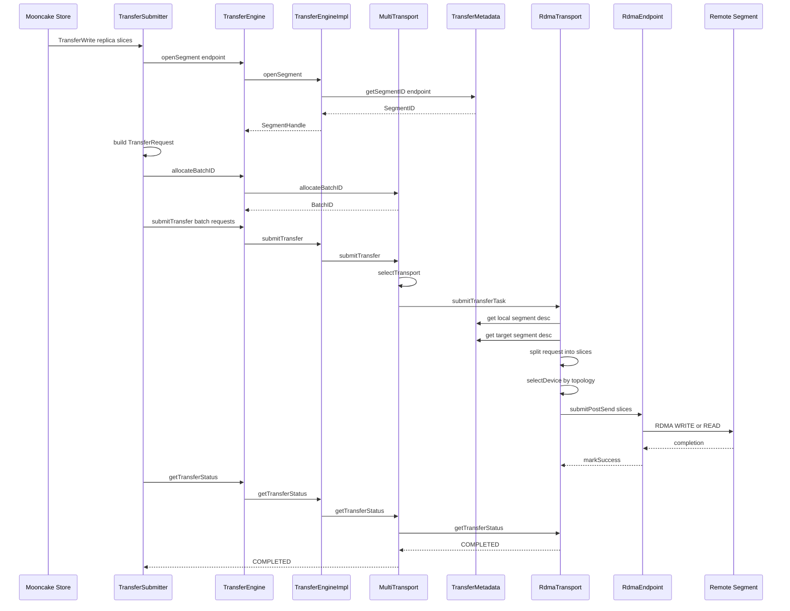

下面专门讲 **Transfer Engine 从入口到真正传输**。我用一个具体例子贯穿：

```
Client A: 10.0.0.11:12345
Client B: 10.0.0.12:12346

协议: rdma
对象大小: 256KB
本地源地址: 0x60000000
远端目标地址: 0x7f0000000000
远端 endpoint: 10.0.0.12:12346
```

**1. Store 调 Transfer Engine 的入口**

Mooncake Store 写数据时，最后会走到：

```
TransferSubmitter::submitTransferEngineOperation(...)
```

代码在 [transfer_task.cpp (line 1274)](/data/home/xli49/lxy/Mooncake/mooncake-store/src/transfer_task.cpp:1274)。

核心逻辑是：

```
SegmentHandle seg = engine_.openSegment(handle.transport_endpoint_);

TransferRequest request;
request.opcode = op_code;
request.source = static_cast<char*>(slice.ptr);
request.target_id = seg;
request.target_offset = base_address + offset;
request.length = slice.size;

return submitTransfer(requests);
```

带入数值就是：

```
openSegment("10.0.0.12:12346")

TransferRequest {
  opcode = WRITE
  source = 0x60000000
  target_id = seg
  target_offset = 0x7f0000000000
  length = 262144
}
```

如果是 `Get`，则 opcode 是 `READ`：

```
READ:
  remote target_id + target_offset -> local source

WRITE:
  local source -> remote target_id + target_offset
```

注意字段名 `source` 有点绕：对 `READ` 来说，它其实是本地接收地址。

**2. TransferRequest 长什么样**

定义在 [transport.h (line 60)](/data/home/xli49/lxy/Mooncake/mooncake-transfer-engine/include/transport/transport.h:60)：

```
struct TransferRequest {
    enum OpCode { READ, WRITE };

    OpCode opcode;
    void *source;
    SegmentID target_id;
    uint64_t target_offset;
    size_t length;
    int advise_retry_cnt = 0;
    int transport_hint = 0;
    uint64_t task_group_id = kNoTaskGroup;
};
```

这就是 Transfer Engine 的核心传输单元。

一个请求可以表达：

```
从本地 0x60000000 写 256KB 到远端 segment 的 0x7f0000000000
```

或者：

```
从远端 segment 的 0x7f0000000000 读 256KB 到本地 0x61000000
```

**3. openSegment 做了什么**

`TransferEngine::openSegment` 是外层 API，定义在 [transfer_engine.h (line 119)](/data/home/xli49/lxy/Mooncake/mooncake-transfer-engine/include/transfer_engine.h:119)。

它的实现只是转发：

```
return impl_->openSegment(segment_name);
```

见 [transfer_engine.cpp (line 140)](/data/home/xli49/lxy/Mooncake/mooncake-transfer-engine/src/transfer_engine.cpp:140)。

真正逻辑在 [transfer_engine_impl.cpp (line 543)](/data/home/xli49/lxy/Mooncake/mooncake-transfer-engine/src/transfer_engine_impl.cpp:543)：

```
SegmentID sid = metadata_->getSegmentID(trimmed_segment_name);
return sid;
```

带入：

```
segment_name = "10.0.0.12:12346"
metadata_->getSegmentID("10.0.0.12:12346") -> 2
```

所以 `openSegment` 本质上是：

```
远端 endpoint 名字 -> Transfer Engine 内部 SegmentID
```

Segment 的详细信息来自 metadata server，里面有：

```
segment name
protocol
RDMA device list
topology
registered buffers
buffer addr
buffer length
rkey/lkey
```

**4. 远端 Buffer 是什么时候注册进去的**

Client B 启动时，会注册它贡献给 Store 的 `global_segment`。

Store 侧调用：

```
transfer_engine_->registerLocalMemory(buffer, size, location, true, true);
```

在 [client_service.cpp (line 3510)](/data/home/xli49/lxy/Mooncake/mooncake-store/src/client_service.cpp:3510)。

进入 Transfer Engine：

```
TransferEngine::registerLocalMemory(...)
```

外层转发在 [transfer_engine.cpp (line 156)](/data/home/xli49/lxy/Mooncake/mooncake-transfer-engine/src/transfer_engine.cpp:156)。

真正逻辑在 [transfer_engine_impl.cpp (line 601)](/data/home/xli49/lxy/Mooncake/mooncake-transfer-engine/src/transfer_engine_impl.cpp:601)：

```
std::vector<MemoryRegion> regions = {
    {addr, length, location, remote_accessible}
};

tryReserveMemoryRegions(regions);

for (auto transport : multi_transports_->listTransports()) {
    transport->registerLocalMemory(
        addr, length, location, remote_accessible, update_metadata);
}

commitMemoryRegions(regions);
```

带入 Client B：

```
addr = 0x7f0000000000
length = 1GB
location = "*"
remote_accessible = true
update_metadata = true
```

如果安装了 RDMA transport，就进入 RDMA 注册逻辑。

**5. RDMA 注册 Buffer 做了什么**

RDMA 注册代码在 [rdma_transport.cpp (line 320)](/data/home/xli49/lxy/Mooncake/mooncake-transfer-engine/src/transport/rdma_transport/rdma_transport.cpp:320)。

它会做几件事：

1.  识别内存位置：

```
getMemoryLocation(addr, length, only_first_page);
```

比如：

```
0x7f0000000000 -> cpu:0
或者 GPU 指针 -> cuda:0
```

1.  如果是 GPU 内存，尝试 `dma_buf` 导出，支持 GPUDirect RDMA：

```
RdmaContext::exportDmabuf(addr, dmabuf_exp);
```

1.  对每个 RDMA context/NIC 注册 MR：

```
context_list_[i]->registerMemoryRegion(
    chunk_addr, chunk_len, access_rights, chunk_dmabuf_exp);
```

1.  收集每个 NIC 对应的 `lkey/rkey`：

```
buffer_desc.lkey.push_back(context->lkey(chunk_addr));
buffer_desc.rkey.push_back(context->rkey(chunk_addr));
buffer_desc.addr = (uint64_t)chunk_addr;
buffer_desc.length = chunk_len;
```

1.  写入本地 metadata，并发布：

```
metadata_->addLocalMemoryBuffer(buffer_desc, false);
metadata_->updateLocalSegmentDesc();
```

所以 Client B 注册后，metadata 里会出现类似：

```
segment = 10.0.0.12:12346
protocol = rdma
buffers = [
  {
    addr = 0x7f0000000000
    length = 1073741824
    location = cpu:0
    lkey = [111, 112, 113, 114]
    rkey = [211, 212, 213, 214]
  }
]
devices = [
  mlx5_0,
  mlx5_1,
  mlx5_2,
  mlx5_3
]
topology = ...
```

这就是为什么 A 后面可以对 B 的这段地址做 RDMA read/write。

**6. init 时装载 transport**

`TransferEngine::init` 在 [transfer_engine_impl.cpp (line 77)](/data/home/xli49/lxy/Mooncake/mooncake-transfer-engine/src/transfer_engine_impl.cpp:77)。

它会创建：

```
metadata_ = std::make_shared<TransferMetadata>(metadata_conn_string);
multi_transports_ = std::make_shared<MultiTransport>(metadata_, local_server_name_);
metadata_->addRpcMetaEntry(local_server_name_, desc);
```

带入：

```
metadata_conn_string = "http://10.0.0.1:8080/metadata"
local_server_name = "10.0.0.11:12345"
```

然后根据配置安装 transport。比如 Store 初始化时会调用：

```
transfer_engine_->installTransport("rdma", nullptr);
```

MultiTransport 里根据 proto 创建具体实现，代码在 [multi_transport.cpp (line 403)](/data/home/xli49/lxy/Mooncake/mooncake-transfer-engine/src/multi_transport.cpp:403)：

```
if (proto == "rdma") {
    transport = new RdmaTransport();
} else if (proto == "tcp") {
    transport = new TcpTransport();
} else if (proto == "nvmeof") {
    transport = new NVMeoFTransport();
} ...
```

所以 Transfer Engine 本身是统一入口，真正干活的是具体 transport。

**7. allocateBatchID 做了什么**

Store 构造好 `TransferRequest` 后，会调用：

```
BatchID batch_id = engine_.allocateBatchID(batch_size);
```

代码在 [transfer_task.cpp (line 1239)](/data/home/xli49/lxy/Mooncake/mooncake-store/src/transfer_task.cpp:1239)。

Transfer Engine 外层 API 在 [transfer_engine.cpp (line 217)](/data/home/xli49/lxy/Mooncake/mooncake-transfer-engine/src/transfer_engine.cpp:217)。

最终到 `MultiTransport::allocateBatchID`，在 [multi_transport.cpp (line 86)](/data/home/xli49/lxy/Mooncake/mooncake-transfer-engine/src/multi_transport.cpp:86)：

```
auto batch_desc = new BatchDesc();
batch_desc->id = BatchID(batch_desc);
batch_desc->batch_size = batch_size;
batch_desc->task_list.reserve(batch_size);
return batch_desc->id;
```

这里有个很重要的实现细节：

```
BatchID 实际上就是 BatchDesc 指针转成 uint64_t
```

对应注释在 [transport.h (line 101)](/data/home/xli49/lxy/Mooncake/mooncake-transfer-engine/include/transport/transport.h:101)：

```
static inline BatchDesc &toBatchDesc(BatchID id) {
    return *reinterpret_cast<BatchDesc *>(id);
}
```

带入：

```
batch_size = 1
BatchDesc* = 0x555500001000
BatchID = 0x555500001000
```

**8. submitTransfer 怎么分发到 RDMA/TCP**

Store 侧调用：

```
engine_.submitTransfer(batch_id, requests);
```

见 [transfer_task.cpp (line 1250)](/data/home/xli49/lxy/Mooncake/mooncake-store/src/transfer_task.cpp:1250)。

TransferEngine 外层继续转发：

```
return impl_->submitTransfer(batch_id, entries);
```

见 [transfer_engine.cpp (line 168)](/data/home/xli49/lxy/Mooncake/mooncake-transfer-engine/src/transfer_engine.cpp:168)。

`TransferEngineImpl` 又转给 `MultiTransport`，见 [transfer_engine_impl.h (line 127)](/data/home/xli49/lxy/Mooncake/mooncake-transfer-engine/include/transfer_engine_impl.h:127)：

```
Status s = multi_transports_->submitTransfer(batch_id, entries);
```

核心在 [multi_transport.cpp (line 118)](/data/home/xli49/lxy/Mooncake/mooncake-transfer-engine/src/multi_transport.cpp:118)。

流程是：

```
for (const auto& request : entries) {
    Transport* transport = nullptr;
    auto status = selectTransport(request, transport);
    transports.push_back(transport);
}

auto& task = task_list.emplace_back();
task.batch_id = batch_id;
task.transport_ = transports[i];
task.request = &entries[i];

submit_tasks[transports[i]].push_back(&task);

for (auto& entry : submit_tasks) {
    entry.first->submitTransferTask(entry.second);
}
```

也就是说：

```
TransferRequest
  -> selectTransport
  -> RdmaTransport 或 TcpTransport 或其他 Transport
  -> TransferTask
  -> transport->submitTransferTask()
```

如果这个 request 的 target segment 是 RDMA segment，就会选 `RdmaTransport`。

**9. RDMA submitTransferTask 做了什么**

RDMA 的入口在 [rdma_transport.cpp (line 822)](/data/home/xli49/lxy/Mooncake/mooncake-transfer-engine/src/transport/rdma_transport/rdma_transport.cpp:822)。

它会先拿本地和远端的 segment metadata：

```
auto local_segment_desc = metadata_->getSegmentDescByID(LOCAL_SEGMENT_ID);
target_segment_desc = metadata_->getSegmentDescByID(request.target_id);
```

代入：

```
local_segment_desc = Client A 的注册内存
target_segment_desc = Client B 的注册内存
```

然后会按配置把 request 切成 slice：

```
const size_t kBlockSize = globalConfig().slice_size;
const size_t kFragmentSize = globalConfig().fragment_limit;

for (uint64_t offset = 0; offset < request.length;) {
    size_t slice_length = slice_calc.calculate(offset);
    ...
    offset += slice->length;
}
```

假设：

```
request.length = 256KB
slice_size = 64KB
```

可能切成：

```
slice 0: 0KB - 64KB
slice 1: 64KB - 128KB
slice 2: 128KB - 192KB
slice 3: 192KB - 256KB
```

每个 slice 记录：

```
slice->source_addr = (char*)request.source + offset;
slice->length = slice_length;
slice->opcode = request.opcode;
slice->rdma.dest_addr = request.target_offset + offset;
slice->target_id = request.target_id;
slice->task = &task;
```

带入第一个 slice：

```
source_addr = 0x60000000
length = 65536
opcode = WRITE
dest_addr = 0x7f0000000000
target_id = 2
```

第二个 slice：

```
source_addr = 0x60010000
length = 65536
dest_addr = 0x7f0000010000
```

**10. RDMA 怎么选 NIC**

RDMA 会根据本地源地址和远端目标地址选择设备。

本地侧：

```
selectDevice(local_segment_desc.get(),
             (uint64_t)slice->source_addr,
             slice->length,
             buffer_id,
             device_id,
             retry_cnt)
```

见 [rdma_transport.cpp (line 934)](/data/home/xli49/lxy/Mooncake/mooncake-transfer-engine/src/transport/rdma_transport/rdma_transport.cpp:934)。

远端侧的选择也依赖 `target_segment_desc`，里面有远端 buffer、rkey、topology 等。选择函数会看地址落在哪个 buffer 里，然后根据 `location` 和拓扑矩阵挑 NIC。相关逻辑在 [rdma_transport.cpp (line 1180)](/data/home/xli49/lxy/Mooncake/mooncake-transfer-engine/src/transport/rdma_transport/rdma_transport.cpp:1180)。

简化成数值：

```
source_addr 0x60000000 属于 Client A 的 cpu:0 buffer
target_addr 0x7f0000000000 属于 Client B 的 cpu:0 buffer

拓扑选择:
A cpu:0 preferred NIC -> mlx5_0
B cpu:0 preferred NIC -> mlx5_1
```

然后给 slice 填 RDMA key：

```
slice->rdma.source_lkey =
    local_segment_desc->buffers[buffer_id].lkey[device_id];
```

后续 endpoint 会使用远端 rkey 和 dest_addr 发 RDMA 操作。

**11. RDMA 真正提交**

构造完 slices 后，按 RDMA context 聚合：

```
slices_to_post[context].push_back(slice);
```

最后提交：

```
for (auto &entry : slices_to_post)
    entry.first->submitPostSend(entry.second);
```

见 [rdma_transport.cpp (line 993)](/data/home/xli49/lxy/Mooncake/mooncake-transfer-engine/src/transport/rdma_transport/rdma_transport.cpp:993)。

到这里才是真正进入 RDMA verbs/endpoint 的发送队列。

所以 256KB 请求最终变成：

```
BatchID = 0x555500001000
Task 0:
  request = WRITE 256KB
  slices = 4

slice 0 -> mlx5_0 QP -> remote addr 0x7f0000000000
slice 1 -> mlx5_0 QP -> remote addr 0x7f0000010000
slice 2 -> mlx5_0 QP -> remote addr 0x7f0000020000
slice 3 -> mlx5_0 QP -> remote addr 0x7f0000030000
```

如果多 NIC/拓扑允许，slice 可能被分散到不同 NIC 上，以聚合带宽。

**12. TCP 后端对比**

TCP 的实现更直观，在 [tcp_transport.cpp (line 443)](/data/home/xli49/lxy/Mooncake/mooncake-transfer-engine/src/transport/tcp_transport/tcp_transport.cpp:443)。

它也接收同一个 `TransferRequest`，然后构造 slice：

```
slice->source_addr = static_cast<char*>(request.source);
slice->length = request.length;
slice->opcode = request.opcode;
slice->tcp.dest_addr = request.target_offset;
slice->target_id = request.target_id;
```

然后：

```
startTransfer(prepareTransfer(&task, request));
```

所以统一抽象是一样的：

```
TransferRequest -> Slice -> Transport-specific execution
```

只是 RDMA slice 需要 lkey/rkey/QP/endpoint，TCP slice 需要远端地址和 TCP session。

**13. 状态查询怎么工作**

Store 侧提交后拿到 `TransferFuture`，最后会等完成。底层会调用：

```
getTransferStatus(batch_id, task_id, status)
```

`MultiTransport` 里会转给对应 transport，见 [multi_transport.cpp (line 249)](/data/home/xli49/lxy/Mooncake/mooncake-transfer-engine/src/multi_transport.cpp:249)：

```
auto& task = batch_desc.task_list[task_id];

if (task.transport_) {
    auto ret = task.transport_->getTransferStatus(batch_id, task_id, status);
    return Status::OK();
}
```

RDMA 状态查询在 [rdma_transport.cpp (line 1023)](/data/home/xli49/lxy/Mooncake/mooncake-transfer-engine/src/transport/rdma_transport/rdma_transport.cpp:1023)：

```
status.transferred_bytes = task.transferred_bytes;

if (success_slice_count + failed_slice_count == task.slice_count) {
    if (failed_slice_count)
        status.s = FAILED;
    else
        status.s = COMPLETED;
    task.is_finished = true;
} else {
    status.s = WAITING;
}
```

每个 slice 完成时会调用：

```
slice->markSuccess()
```

定义在 [transport.h (line 202)](/data/home/xli49/lxy/Mooncake/mooncake-transfer-engine/include/transport/transport.h:202)：

```
status = Slice::SUCCESS;
task->transferred_bytes += length;
task->success_slice_count += 1;
```

带入 4 个 slice：

```
slice0 success -> transferred_bytes = 64KB
slice1 success -> transferred_bytes = 128KB
slice2 success -> transferred_bytes = 192KB
slice3 success -> transferred_bytes = 256KB

success_slice_count = 4
slice_count = 4
status = COMPLETED
```

**14. 整体调用链**

以 Store 写入为例：

```
Client::TransferWrite
  -> TransferSubmitter::submit
  -> TransferSubmitter::submitTransferEngineOperation
  -> TransferEngine::openSegment
  -> TransferEngine::allocateBatchID
  -> TransferEngine::submitTransfer
  -> TransferEngineImpl::submitTransfer
  -> MultiTransport::submitTransfer
  -> MultiTransport::selectTransport
  -> RdmaTransport::submitTransferTask
  -> slice 拆分
  -> selectDevice
  -> RdmaContext::submitPostSend
  -> slice markSuccess
  -> getTransferStatus COMPLETED
```

一句话总结：**Transfer Engine 的入口是 `TransferRequest`，地址发现靠 metadata，传输分发靠 `MultiTransport`，真正执行靠 `RdmaTransport/TcpTransport/...`，完成状态靠 slice 计数汇总成 task/batch 状态。**


