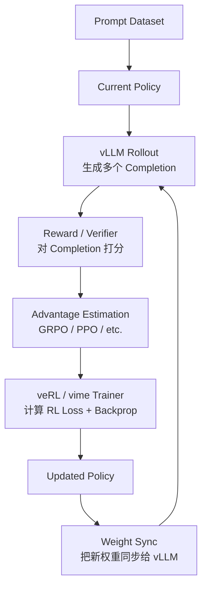
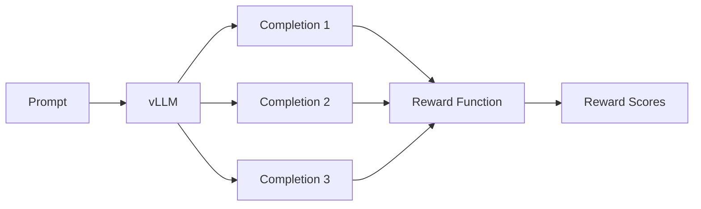
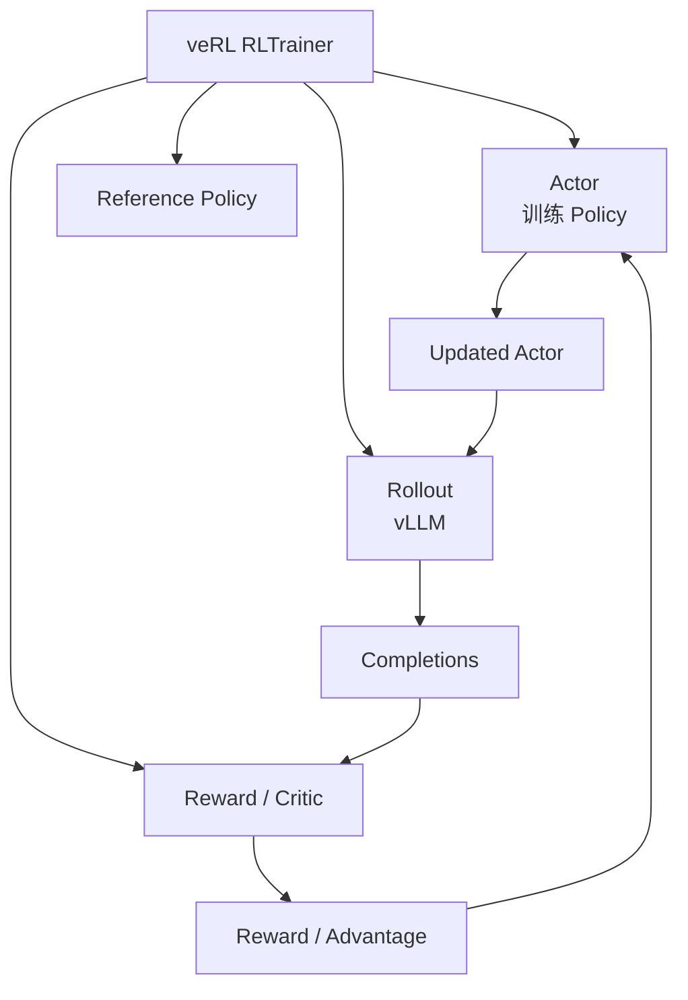
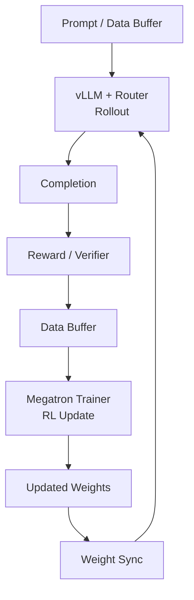

先生成，再评价，再根据评价修改模型。

**vLLM 是 RL 的 rollout/generation engine，veRL 或 vime 是外层 RL training framework。**



1）vLLM：负责 Rollout
vLLM: Runs fast inference to generate training completions from the current policy.

例如一个 Prompt：

```text
Solve: 23 × 17
```

vLLM 可能一次生成：

```text
Completion 1 → 391
Completion 2 → 381
Completion 3 → 391
Completion 4 → 401
```

RL 阶段最耗时的一个部分就是大量生成，所以使用 vLLM 来提高 rollout 吞吐量。

------

2）Reward / Verifier：负责评价



例如数学：

```text
391 → reward = 1
381 → reward = 0
401 → reward = 0
```

也可以使用 Reward Model、代码测试、规则、LLM Judge 等作为 reward。veRL 当前支持 rule-based、reward model 等多种 reward 形式。([GitHub](https://github.com/verl-project/verl/blob/main/docs/blog/v0.7.md?utm_source=chatgpt.com))

------

3）Advantage：决定“哪些回答应该强化”

Reward 本身还不一定直接用于训练，通常会进一步计算：

```text
Reward
   ↓
Advantage
   ↓
Policy Gradient
```

例如 GRPO：

```text
Prompt
├── Response A → reward 1
├── Response B → reward 0
├── Response C → reward 1
└── Response D → reward 0
        ↓
group-relative advantage
```

GRPO 会对同一个 Prompt 的多个回答进行组内相对比较，因此可以不使用独立 Critic。vime 当前直接支持 GRPO、GSPO、CISPO、REINFORCE++、PPO 等 advantage estimator。([vLLM](https://docs.vllm.ai/projects/vime/en/latest/get_started/usage.html?utm_source=chatgpt.com))

------

4）veRL：更像 RL 的“总调度器”

典型关系是：



veRL 使用 HybridFlow / Hybrid-Controller 架构：上层 `RLTrainer` 负责整个 RL dataflow，下层使用 FSDP、Megatron 等训练后端以及 vLLM 等 rollout engine 做分布式计算。([GitHub](https://github.com/verl-project/verl/blob/main/docs/blog/v0.7.md?utm_source=chatgpt.com))

所以可以记成：

```text
veRL
├── orchestration
├── Actor training
├── Reward
├── Advantage
├── PPO / GRPO
└── vLLM
    └── Rollout
```

------

5）vime：结构更直接地围绕“Training + vLLM”

vime 本身就是 vLLM 生态里的 RL post-training framework，它基于 slime，把 **Megatron training 和 vLLM rollout** 直接连接起来。([vLLM](https://docs.vllm.ai/projects/vime/en/latest/index.html?utm_source=chatgpt.com))

它的核心结构可以画成：



官方把它概括为三个部分：

```text
vime
├── Training
│   └── Megatron
│
├── Rollout
│   └── vLLM + Router
│
└── Data Buffer
    └── 连接 generation 与 training
```

这正是 vime 的三阶段 train-inference 架构。([vLLM Blog](https://vllm-project.github.io/2026/06/09/announcing-vime.html?utm_source=chatgpt.com))

------

6）所以 veRL + vLLM 和 vime + vLLM 的区别

最简单记：

```text
veRL + vLLM

veRL
├── RL orchestration
├── Actor / Critic / Ref
├── PPO / GRPO / ...
└── vLLM
    └── rollout
```

而：

```text
vime

vime
├── Megatron training
├── Data Buffer
└── vLLM + Router
    └── rollout
```

**vime 已经把 vLLM 当作默认 rollout backend，因此通常不用理解成“vime 外面再加一个 vLLM”；vLLM 本身就是 vime 架构中的核心部分。** ([vLLM](https://docs.vllm.ai/projects/vime/en/latest/index.html?utm_source=chatgpt.com))

最终还是你之前那条主线：

```text
Prompt
  ↓
Current Policy
  ↓
vLLM Rollout
  ↓
Completion
  ↓
Reward
  ↓
Advantage
  ↓
veRL / vime Optimization
  ↓
Updated Policy
  ↓
Sync to vLLM
  ↓
next rollout...
```

也就是说，**RL LLM training 本质上就是不断循环：生成 → 打分 → 更新 → 用新模型重新生成。**


# 相关概念

1）自回归语言模型：按照序列顺序生成 token，每个 token 的预测都依赖此前已经出现的 token。
Autoregressive Language Model: A language model that predicts each token based on the tokens that precede it.
Example: Given “The weather today is”, the model predicts the next token such as “sunny”.

2）负对数似然损失（NLL）：衡量模型赋予真实 token 的概率，真实 token 概率越低，损失越大。
Negative Log-Likelihood (NLL): A loss that penalizes the model when it assigns low probability to the correct token.
Example: If the correct token has probability 0.01, the loss is larger than if its probability is 0.9.

3）交叉熵损失：衡量模型预测的概率分布与真实目标分布之间的差异，是语言模型常用的训练损失。
Cross-Entropy Loss: A loss function that measures the difference between the predicted probability distribution and the target distribution.
Example: The model predicts probabilities over all vocabulary tokens and is penalized when the correct token receives low probability.

4）仅解码器 Transformer：一种主要用于自回归生成的 Transformer 架构，只使用解码器模块根据已有上下文预测后续 token。
Decoder-Only Transformer: A Transformer architecture that uses decoder blocks to autoregressively predict future tokens from previous context.
Example: GPT-style models generate text one token at a time using a decoder-only architecture.

5）自注意力机制：让每个 token 根据上下文中其他 token 的相关性分配不同注意力权重。
Self-Attention: A mechanism that allows each token to assign different attention weights to other tokens in the context.
Example: In “The animal didn’t cross the street because it was tired,” attention can help relate “it” to “animal”.

6）LM Head：将模型内部隐藏表示映射到词表空间，从而得到每个候选 token 的分数或概率。
Language Modeling Head: The final projection layer that maps hidden representations to scores over the vocabulary.
Example: A hidden vector is converted into logits for tokens such as “apple”, “banana”, and “car”.

7）KL 散度：衡量两个概率分布之间差异的指标，分布越不同，KL 散度通常越大。
Kullback-Leibler Divergence: A measure of how one probability distribution differs from another probability distribution.
Example: A model changing from {A: 0.6, B: 0.4} to {A: 0.1, B: 0.9} produces a relatively large KL divergence.

8）Prompt（提示）：输入给语言模型、用于引导其生成回答或补全的文本。
Prompt: The input text given to a language model to guide its response or completion.
Example: “Explain reinforcement learning in simple terms.”

9）Completion（补全）：语言模型针对给定 Prompt 生成的输出文本。
Completion: The text generated by a language model in response to a prompt.
Example: Prompt: “The capital of France is” → Completion: “Paris.”

10）Chosen Completion（选中补全）：多个候选回答中被人类或偏好系统认为更好的回答。
Chosen Completion: The response selected as preferable among multiple candidate completions.
Example: Between two answers, the clearer and more accurate response is marked as chosen.

11）Rejected Completion（被拒补全）：在偏好比较中被认为相对较差的候选回答。
Rejected Completion: The response considered less preferable in a pairwise preference comparison.
Example: A vague or incorrect answer may be labeled as rejected.

12）偏好关系：用于表示一个回答相对于另一个回答更受偏好，通常写作 $y_{chosen}\succ y_{rejected}$。
Preference Relation: A relation indicating that one completion is preferred over another, often written as $y_{chosen}\succ y_{rejected}$.
Example: Response A ≻ Response B means Response A is preferred to Response B.

13）Policy（语言模型语境）：给定 Prompt 后，模型对所有可能 Completion 的概率分布。
Policy in Language Modeling: The probability distribution over possible completions given a prompt.
Example: For the same prompt, the policy may assign different probabilities to several possible answers.

14）Reward（奖励）：表示某个动作、状态或结果好坏程度的标量信号。
Reward: A scalar signal representing how desirable an action, state, or outcome is.
Example: A correct answer may receive reward +1, while an incorrect answer receives reward 0.

15）Action（动作）：智能体在某个状态下选择执行的行为。
Action: A decision or behavior selected by an agent in a given state.
Example: In language generation, selecting the next token can be treated as an action.

16）State（状态）：描述智能体当前所处环境或情境的信息。
State: The current configuration or information describing the agent’s situation in an environment.
Example: In text generation, the tokens generated so far can be treated as the current state.

17）Trajectory（轨迹）：智能体与环境交互过程中形成的一系列状态、动作和奖励。
Trajectory: A sequence of states, actions, and rewards generated during an agent’s interaction with an environment.
Example: A complete episode from the initial state to the final state forms one trajectory.

18）Trajectory Distribution（轨迹分布）：在特定策略和环境转移规则下，不同轨迹出现的概率分布。
Trajectory Distribution: The probability distribution over trajectories induced by a policy and the environment dynamics.
Example: Different action choices can lead to different trajectories with different probabilities.

19）Policy（强化学习语境）：定义智能体在给定状态下选择各个动作概率的规则。
Policy in Reinforcement Learning: A rule or probability distribution that determines which actions an agent selects in each state.
Example: In state S, a policy may choose action A with probability 0.7 and action B with probability 0.3.

20）Discount Factor（折扣因子）：控制未来奖励相对于当前奖励重要程度的参数，通常记为 $\gamma$。
Discount Factor: A parameter, usually denoted by $\gamma$, that controls how much future rewards are valued relative to immediate rewards.
Example: With γ = 0.9, rewards farther in the future contribute progressively less to the total return.

21）Value Function（价值函数）：估计从某个状态开始，按照某策略未来能够获得的期望累计奖励。
Value Function: The expected cumulative future reward starting from a given state under a particular policy.
Example: If entering state S is expected to yield a total future reward of 8, then V(S) = 8.

22）Q-Function（Q 函数）：估计在某状态采取特定动作后，未来能够获得的期望累计奖励。
Q-Function: The expected cumulative future reward obtained by taking a particular action in a given state and then following a policy.
Example: If taking action A in state S is expected to yield a return of 10, then Q(S,A) = 10.

23）Advantage Function（优势函数）：衡量某个动作相对于该状态下平均策略行为好多少，通常定义为 $A(s,a)=Q(s,a)-V(s)$。
Advantage Function: A function measuring how much better an action is than the policy’s average behavior in a given state.
Example: If Q(S,A) = 10 and V(S) = 7, then A(S,A) = 3.

24）策略条件下的取值：表示 Value、Q、Advantage 等量是在某个特定策略下计算或估计的。
Policy-Conditioned Values: Values such as V, Q, and A that are defined or estimated with respect to a particular policy.
Example: $V^{\pi_1}(s)$ and $V^{\pi_2}(s)$ may differ because the two policies behave differently.

25）奖励优化期望：强化学习通过调整策略参数，使策略产生的轨迹获得尽可能高的期望累计奖励。
Expectation of Reward Optimization: The reinforcement learning objective of adjusting policy parameters to maximize expected cumulative reward.
Example: A policy is updated so that actions leading to higher long-term rewards become more likely.

26）有限视野奖励：只考虑有限数量步骤内获得的累计奖励，而不是无限未来的奖励。
Finite Horizon Reward: The cumulative reward evaluated over a fixed and finite number of time steps.
Example: An agent may optimize the total reward obtained during the next 20 steps.

27）On-Policy：训练数据由当前策略或当前模型版本自身生成。
On-Policy: Training data is generated by the current policy or current version of the model being optimized.
Example: The current model generates responses, receives rewards, and learns directly from those responses.

28）Off-Policy：训练数据来自其他策略、其他模型或旧版本模型，而不是当前策略本身。
Off-Policy: Training data is generated by a different policy, another model, or an older version of the current model.
Example: A model is trained using responses previously generated by another model.

29）Reference Model（参考模型）：RLHF 中保持固定的模型，用于限制正在优化的策略模型不要偏离原始行为过远。
Reference Model: A fixed model used in RLHF to regularize the optimized policy and prevent it from drifting too far from its original behavior.
Example: The policy is penalized when its output distribution becomes too different from the reference model.

30）Synthetic Data（合成数据）：由人工智能系统生成，而不是由人工直接创建或真实世界直接收集的训练数据。
Synthetic Data: Training data generated by an AI system rather than directly created by humans or collected from real-world observations.
Example: A large model generates one million question-answer pairs for training another model.

31）Distillation（蒸馏）：利用较强模型生成的输出训练另一个模型，使后者学习前者的能力或行为。
Distillation: A training approach in which outputs from a stronger model are used to train another model to imitate its capabilities or behavior.
Example: A large model generates high-quality answers that are used to fine-tune a smaller model.

32）Knowledge Distillation（知识蒸馏）：让学生模型学习教师模型的输出概率分布，而不仅仅学习最终选出的正确答案。
Knowledge Distillation: A teacher-student training method in which the student learns the teacher’s probability distribution over outputs rather than only the final target.
Example: Instead of learning only “cat”, the student learns that the teacher assigns 0.8 to “cat”, 0.15 to “dog”, and 0.05 to other tokens.

33）Teacher Model（教师模型）：知识蒸馏中提供目标概率分布或行为示范的较强模型。
Teacher Model: The stronger model that provides target distributions or behavioral supervision during knowledge distillation.
Example: A 70B model can act as the teacher for a smaller 7B model.

34）Student Model（学生模型）：知识蒸馏中通过学习教师模型输出而被训练的模型。
Student Model: The model trained to imitate the outputs or probability distributions of a teacher model.
Example: A 7B model learns from probability distributions produced by a larger teacher model.

35）In-Context Learning（上下文学习，ICL）：通过在 Prompt 中加入说明或示例，让模型在不更新参数的情况下临时适应任务。
In-Context Learning (ICL): The ability of a model to adapt to a task using instructions or examples in its context without updating its parameters.
Example: “cat → animal, apple → fruit, dog →” allows the model to infer the expected answer “animal”.

36）Chain of Thought（思维链，CoT）：通过生成或利用中间推理步骤来完成复杂问题求解的方法。
Chain of Thought (CoT): An approach in which intermediate reasoning steps are used to solve a complex problem.
Example: “23 × 17 = 23 × 10 + 23 × 7 = 230 + 161 = 391.”
