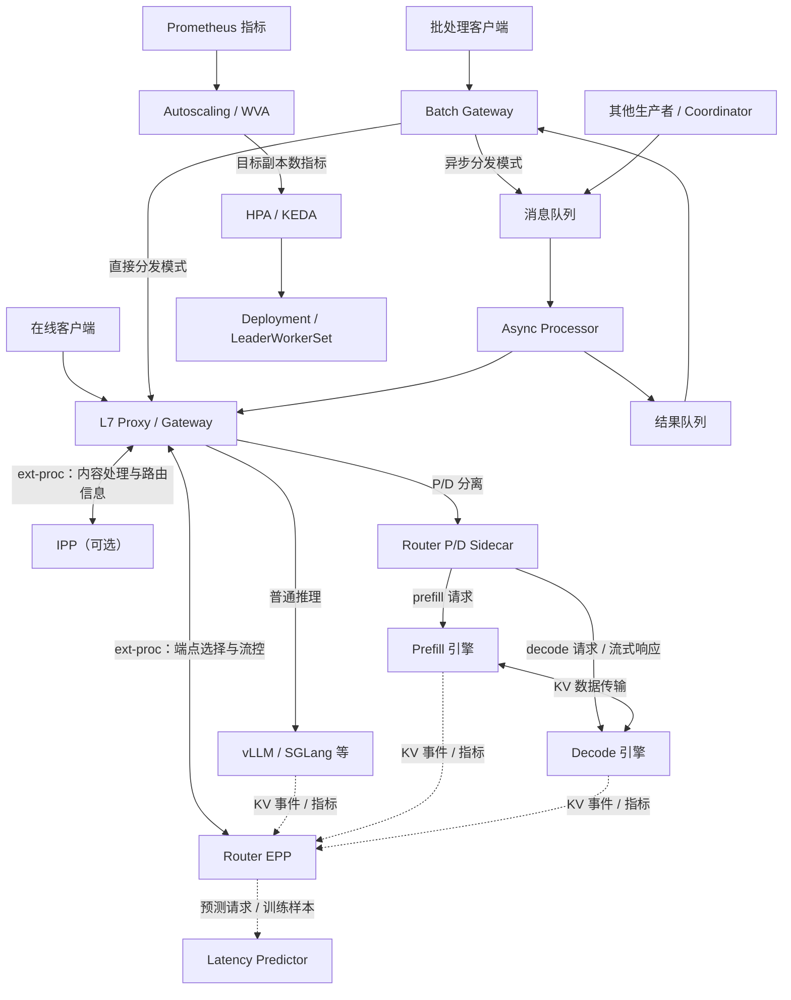

```mermaid
flowchart TB
    Client["在线客户端"] --> Proxy["L7 Proxy / Gateway"]
    Proxy <-->|"ext-proc：内容处理与路由信息"| IPP["IPP（可选）"]
    Proxy <-->|"ext-proc：端点选择与流控"| EPP["Router EPP"]

    Proxy -->|"普通推理"| Engine["vLLM / SGLang 等"]
    Proxy -->|"P/D 分离"| Sidecar["Router P/D Sidecar"]
    Sidecar -->|"prefill 请求"| Prefill["Prefill 引擎"]
    Sidecar -->|"decode 请求 / 流式响应"| Decode["Decode 引擎"]
    Prefill <-->|"KV 数据传输"| Decode

    BatchClient["批处理客户端"] --> Batch["Batch Gateway"]
    Batch -->|"直接分发模式"| Proxy
    Batch -->|"异步分发模式"| Queue["消息队列"]
    Producer["其他生产者 / Coordinator"] --> Queue
    Queue --> Async["Async Processor"]
    Async --> Proxy
    Async --> Results["结果队列"]
    Results --> Batch

    Engine -.->|"KV 事件 / 指标"| EPP
    Prefill -.->|"KV 事件 / 指标"| EPP
    Decode -.->|"KV 事件 / 指标"| EPP
    EPP -.->|"预测请求 / 训练样本"| Predictor["Latency Predictor"]

    Metrics["Prometheus 指标"] --> WVA["Autoscaling / WVA"]
    WVA -->|"目标副本数指标"| HPA["HPA / KEDA"]
    HPA --> Workloads["Deployment / LeaderWorkerSet"]
```
