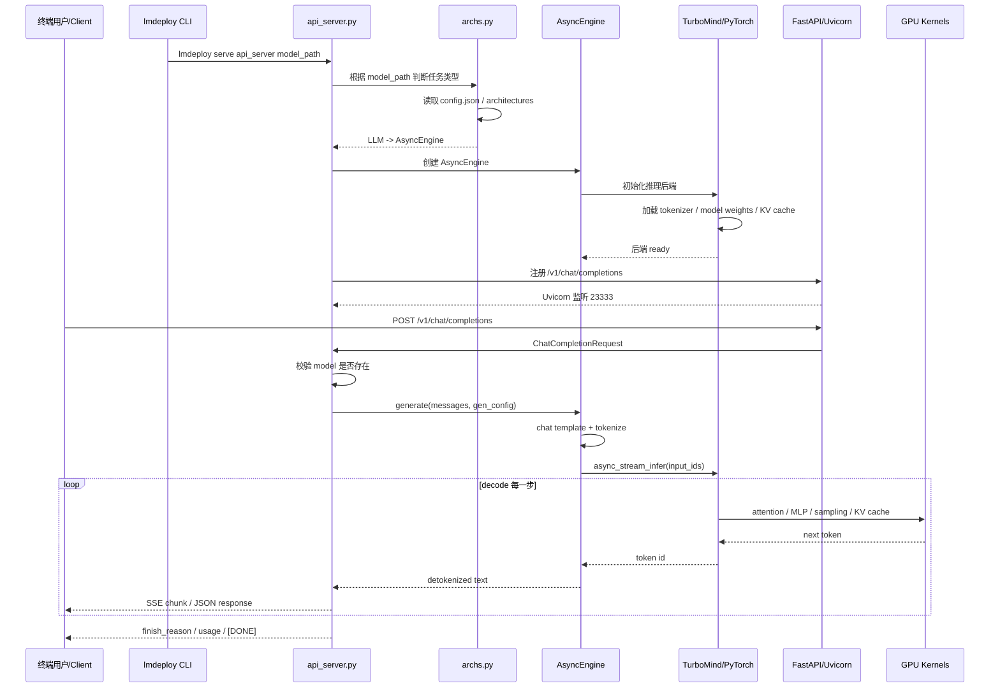

**从 `lmdeploy serve api_server ...` 开始** 的完整数据流讲

```
终端输入:
lmdeploy serve api_server internlm/internlm2_5-7b-chat --server-port 23333

  -> console_scripts: lmdeploy = lmdeploy.cli:run
  -> lmdeploy/cli/__init__.py 里的 run
  -> lmdeploy/cli/entrypoint.py:10 run()
  -> argparse 解析 serve / api_server
  -> lmdeploy/cli/serve.py:224 SubCliServe.api_server(args)
  -> lmdeploy/serve/openai/api_server.py:1498 serve(...)
```

`lmdeploy serve api_server ...` 能执行，是因为安装包时注册了 **console script**。

入口声明在：

[setup.py (line 192)](/data/home/xli49/lmdeploy/setup.py:192)

```python
# 标准库导入
import os
import re
import subprocess
import sys
from pathlib import Path

# setuptools 导入
from setuptools import find_packages, setup

# 获取当前脚本所在目录的路径
pwd = os.path.dirname(__file__)
# 版本信息文件路径
version_file = 'lmdeploy/version.py'


def get_target_device():
    """
    获取目标设备类型
    
    通过环境变量 LMDEPLOY_TARGET_DEVICE 指定，默认为 'cuda'
    
    Returns:
        str: 'cuda' 或其他设备类型
    """
    return os.getenv('LMDEPLOY_TARGET_DEVICE', 'cuda')


def readme():
    """
    读取 README.md 文件内容
    
    Returns:
        str: README.md 的文件内容，用于 PyPI 的 long_description
    """
    with open(os.path.join(pwd, 'README.md'), encoding='utf-8') as f:
        content = f.read()
    return content


def get_version():
    """
    从 version.py 文件中提取版本号
    
    使用正则表达式匹配 __version__ = 'x.x.x' 格式
    
    Returns:
        str: 版本号字符串
        
    Raises:
        AssertionError: 如果找不到版本号
    """
    file_path = os.path.join(pwd, version_file)
    # 匹配模式：__version__ = '版本号'
    pattern = re.compile(r"\s*__version__\s*=\s*'([0-9A-Za-z.-]+)'")
    with open(file_path) as f:
        for line in f:
            m = pattern.match(line)
            if m:
                return m.group(1)
        else:
            # 如果循环结束都没找到，抛出异常
            assert False, f'No version found {file_path}'


def get_turbomind_deps():
    """
    获取 turbomind 所需的 NVIDIA 依赖包
    
    自动检测 CUDA 版本，返回对应的 NVIDIA 包列表
    
    Returns:
        list: NVIDIA 包名列表
        
    Note:
        - CUDA 13+ 使用新的包命名规则
        - Windows 平台返回空列表（不适用）
    """
    # Windows 平台不需要这些依赖
    if os.name == 'nt':
        return []

    # 获取 CUDA 编译器路径
    CUDA_COMPILER = os.getenv('CUDACXX', os.getenv('CMAKE_CUDA_COMPILER', 'nvcc'))
    
    # 运行 nvcc --version 获取 CUDA 版本
    nvcc_output = subprocess.check_output([CUDA_COMPILER, '--version'], stderr=subprocess.DEVNULL).decode()
    # 从输出中提取 CUDA 版本号，如 'release 12.1' -> '12'
    CUDAVER, = re.search(r'release\s+(\d+).', nvcc_output).groups()
    
    # CUDA 13+ 使用新的包命名规范
    if int(CUDAVER) >= 13:
        return [
            f'nvidia-nccl-cu{CUDAVER}',      # NCCL 通信库
            'nvidia-cuda-runtime',           # CUDA 运行时（新命名）
            'nvidia-cublas',                 # CUDA 线性代数库（新命名）
            'nvidia-curand',                 # CUDA 随机数生成库（新命名）
        ]
    else:
        # CUDA 12 及以下使用带 cu 后缀的命名
        return [
            f'nvidia-nccl-cu{CUDAVER}',      # NCCL 通信库
            f'nvidia-cuda-runtime-cu{CUDAVER}',  # CUDA 运行时
            f'nvidia-cublas-cu{CUDAVER}',    # CUDA 线性代数库
            f'nvidia-curand-cu{CUDAVER}',    # CUDA 随机数生成库
        ]


def parse_requirements(fname='requirements.txt', with_version=True):
    """
    解析 requirements 文件，提取依赖包列表
    
    支持的功能：
    1. 递归解析 -r 引用的其他文件
    2. 处理 git 仓库依赖（@git+）
    3. 处理可编辑安装（-e）
    4. 处理平台特定依赖（;platform_system=="Windows"）
    5. 可选择性保留或移除版本信息
    
    Args:
        fname (str): requirements 文件路径，默认 'requirements.txt'
        with_version (bool): 是否保留版本信息，默认 True
        
    Returns:
        list[str]: 依赖包列表
        
    Example:
        >>> parse_requirements('requirements.txt')
        ['torch>=2.0.0', 'transformers', 'numpy;platform_system=="Windows"']
    """
    require_fpath = fname

    def parse_line(line, current_fpath):
        """
        解析单行依赖信息（内部生成器函数）
        
        Args:
            line (str): 依赖行文本
            current_fpath (str): 当前文件路径（用于处理相对路径）
            
        Yields:
            dict: 包含 'package'、'version'、'platform_deps' 等信息的字典
        """
        # 处理 -r 引用的其他文件
        if line.startswith('-r '):
            target = line.split(' ')[1]
            if not os.path.isabs(target):
                target = os.path.join(os.path.dirname(current_fpath), target)
            for info in parse_require_file(target):
                yield info
        else:
            info = {'line': line}
            # 处理可编辑安装：-e git+...
            if line.startswith('-e '):
                info['package'] = line.split('#egg=')[1]
            # 处理 git 仓库：git+https://...
            elif '@git+' in line:
                info['package'] = line
            else:
                # 移除版本信息，提取包名
                pat = '(' + '|'.join(['>=', '==', '>']) + ')'
                parts = re.split(pat, line, maxsplit=1)
                parts = [p.strip() for p in parts]

                info['package'] = parts[0]
                # 如果有版本信息，提取操作符和版本号
                if len(parts) > 1:
                    op, rest = parts[1:]
                    # 处理平台特定依赖
                    if ';' in rest:
                        version, platform_deps = map(str.strip, rest.split(';'))
                        info['platform_deps'] = platform_deps
                    else:
                        version = rest
                    info['version'] = (op, version)
            yield info

    def parse_require_file(fpath):
        """
        解析整个 requirements 文件（内部生成器函数）
        
        Args:
            fpath (str): 文件路径
            
        Yields:
            dict: 每行的解析结果
        """
        with open(fpath) as f:
            for line in f.readlines():
                line = line.strip()
                # 跳过空行和注释行
                if line and not line.startswith('#'):
                    yield from parse_line(line, fpath)

    def gen_packages_items():
        """
        生成最终的依赖包列表（内部生成器函数）
        
        Yields:
            str: 格式化的依赖字符串
        """
        if os.path.exists(require_fpath):
            for info in parse_require_file(require_fpath):
                parts = [info['package']]
                # 如果需要版本信息，添加版本约束
                if with_version and 'version' in info:
                    parts.extend(info['version'])
                # 添加平台特定依赖（Python 3.4 以下不支持）
                if not sys.version.startswith('3.4'):
                    platform_deps = info.get('platform_deps')
                    if platform_deps is not None:
                        parts.append(';' + platform_deps)
                item = ''.join(parts)
                yield item

    packages = list(gen_packages_items())
    return packages


# ==================== 主要构建逻辑 ====================

# 判断是否需要构建 turbomind 扩展
# 条件：CUDA 设备 且 未禁用 turbomind
if get_target_device() == 'cuda' and os.getenv('DISABLE_TURBOMIND', '').lower() not in ('yes', 'true', 'on', 't', '1'):
    import cmake_build_extension  # CMake 构建扩展工具

    # 定义 CMake 扩展模块
    ext_modules = [
        cmake_build_extension.CMakeExtension(
            name='_turbomind',  # 扩展模块名称（Python 导入时使用）
            install_prefix='lmdeploy/lib',  # 安装目标路径
            cmake_depends_on=['pybind11'],  # CMake 依赖项
            source_dir=str(Path(__file__).parent.absolute()),  # 源代码根目录
            cmake_generator=None if os.name == 'nt' else 'Ninja',  # Windows 用默认，其他用 Ninja
            cmake_build_type=os.getenv('CMAKE_BUILD_TYPE', 'Release'),  # 构建类型
            cmake_configure_options=[
                # Python 环境配置
                f'-DPython3_ROOT_DIR={Path(sys.prefix)}',
                f'-DPYTHON_EXECUTABLE={Path(sys.executable)}',
                # 构建选项
                '-DCALL_FROM_SETUP_PY:BOOL=ON',  # 标记从 setup.py 调用
                '-DBUILD_SHARED_LIBS:BOOL=OFF',  # 构建静态库
                # Python FFI（外部函数接口）
                '-DBUILD_PY_FFI=ON',
                # 多 GPU 支持（Windows 不支持）
                '-DBUILD_MULTI_GPU=' + ('OFF' if os.name == 'nt' else 'ON'),
                # NVTX 性能分析（Windows 不支持）
                '-DUSE_NVTX=' + ('OFF' if os.name == 'nt' else 'ON'),
            ],
        ),
    ]
    # 获取 turbomind 的 CUDA 依赖
    extra_deps = get_turbomind_deps()
    # 注册自定义构建命令
    cmdclass = dict(build_ext=cmake_build_extension.BuildExtension, )
else:
    # 不构建 turbomind 扩展
    ext_modules = []
    cmdclass = {}
    extra_deps = []


# ==================== setup() 主函数 ====================

if __name__ == '__main__':
    setup(
        # ---------- 基本信息 ----------
        name='lmdeploy',  # 包名称
        version=get_version(),  # 版本号
        description='A toolset for compressing, deploying and serving LLM',  # 简短描述
        long_description=readme(),  # 详细描述（从 README.md 读取）
        long_description_content_type='text/markdown',  # 描述格式
        author='OpenMMLab',  # 作者
        author_email='openmmlab@gmail.com',  # 作者邮箱

        # ---------- 包发现 ----------
        # 自动发现所有 Python 包（包含 __init__.py 的目录）
        packages=find_packages(exclude=()),
        # 包含 MANIFEST.in 中指定的非 Python 文件
        include_package_data=True, 

        # ---------- 依赖管理 ----------
        # 构建时依赖（如 setuptools, cmake, pybind11）
        setup_requires=parse_requirements('requirements/build.txt'),
        # 测试时依赖（如 pytest, pytest-cov）
        tests_require=parse_requirements('requirements/test.txt'),
        # 运行时依赖（根据目标设备动态选择）
        # runtime_cuda.txt 或 runtime_other.txt
        install_requires=parse_requirements(f'requirements/runtime_{get_target_device()}.txt') + extra_deps,
        # 可选依赖组（可通过 pip install lmdeploy[group] 安装）
        extras_require={
            'all': parse_requirements(f'requirements_{get_target_device()}.txt'),  # 全部依赖
            'lite': parse_requirements('requirements/lite.txt'),  # 轻量版
            'serve': parse_requirements('requirements/serve.txt'),  # 服务版
        },

        # ---------- 分类标签 ----------
        classifiers=[
            'Programming Language :: Python :: 3.10',
            'Programming Language :: Python :: 3.11',
            'Programming Language :: Python :: 3.12',
            'Programming Language :: Python :: 3.13',
            'Intended Audience :: Developers',      # 目标用户：开发者
            'Intended Audience :: Education',       # 目标用户：教育
            'Intended Audience :: Science/Research',  # 目标用户：科研
        ],

        # ---------- 命令行入口 ----------
        # 安装后提供 'lmdeploy' 命令，指向 cli.py 的 run 函数
        entry_points={
            'console_scripts': ['lmdeploy = lmdeploy.cli:run']
        },

        # ---------- C++/CUDA 扩展 ----------
        ext_modules=ext_modules,  # CMake 扩展模块
        cmdclass=cmdclass,  # 自定义构建命令
    )
```

```python
find_packages(exclude=()) # 不排除任何目录
# 项目结构
my_project/
├── src/
│   ├── __init__.py
│   └── core.py
├── tests/
│   ├── __init__.py
│   └── test_core.py
├── examples/
│   ├── __init__.py
│   └── demo.py
└── setup.py

# setup.py
packages = find_packages(exclude=())
# 结果：['src', 'tests', 'examples'] 全部被安装


# 排除 tests, examples, docs
packages = find_packages(
    exclude=[
        'tests',
        'tests.*',
        'examples',
        'examples.*',
        'docs',
        'docs.*',
    ]
)
# 结果：['src']
```


意思是：安装后，系统里会生成一个可执行命令：

```
lmdeploy
```

它等价于调用 Python 函数：

```
lmdeploy.cli.run()
```

完整执行链路是：

```
终端输入:
lmdeploy serve api_server internlm/internlm2_5-7b-chat --server-port 23333

  -> console_scripts: lmdeploy = lmdeploy.cli:run
  -> lmdeploy/cli/__init__.py 里的 run
  -> lmdeploy/cli/entrypoint.py:10 run()
  -> argparse 解析 serve / api_server
  -> lmdeploy/cli/serve.py:224 SubCliServe.api_server(args)
  -> lmdeploy/serve/openai/api_server.py:1498 serve(...)
```

关键代码位置：

[lmdeploy/cli/entrypoint.py (line 10)](/data/home/xli49/lmdeploy/lmdeploy/cli/entrypoint.py:10)

```
def run():
    args = sys.argv[1:]
    CLI.add_parsers()
    SubCliServe.add_parsers()
    SubCliLite.add_parsers()
    parser = CLI.parser
    args = parser.parse_args()
```

这里 `sys.argv[1:]` 就是：

```
serve api_server internlm/internlm2_5-7b-chat --server-port 23333
```

然后注册顶层命令 `serve`：

[lmdeploy/cli/serve.py (line 20)](/data/home/xli49/lmdeploy/lmdeploy/cli/serve.py:20)

```
parser = CLI.subparsers.add_parser('serve', ...)
```

再注册 `serve` 下面的子命令 `api_server`：

[lmdeploy/cli/serve.py (line 28)](/data/home/xli49/lmdeploy/lmdeploy/cli/serve.py:28)

```
def add_parser_api_server():
    parser = SubCliServe.subparsers.add_parser('api_server', ...)
    parser.set_defaults(run=SubCliServe.api_server)
```

这句最关键：

```
parser.set_defaults(run=SubCliServe.api_server)
```

它表示：只要命令解析到 `serve api_server`，最终就执行：

[lmdeploy/cli/serve.py (line 224)](/data/home/xli49/lmdeploy/lmdeploy/cli/serve.py:224)

```
def api_server(args):
```

最后在 `entrypoint.py` 里真正调用：

[lmdeploy/cli/entrypoint.py (line 39)](/data/home/xli49/lmdeploy/lmdeploy/cli/entrypoint.py:39)

```
args.run(args)
```

所以这一行实际等价于：

```
SubCliServe.api_server(args)
```

然后 `api_server(args)` 里继续调用 server：

[lmdeploy/cli/serve.py (line 305)](/data/home/xli49/lmdeploy/lmdeploy/cli/serve.py:305)

```
from lmdeploy.serve.openai.api_server import serve as run_api_server
```

[lmdeploy/cli/serve.py (line 307)](/data/home/xli49/lmdeploy/lmdeploy/cli/serve.py:307)

```
run_api_server(
    args.model_path,
    model_name=args.model_name,
    backend=backend,
    backend_config=backend_config,
    server_port=args.server_port if args.server_port is not None else 23333,
    ...
)
```


