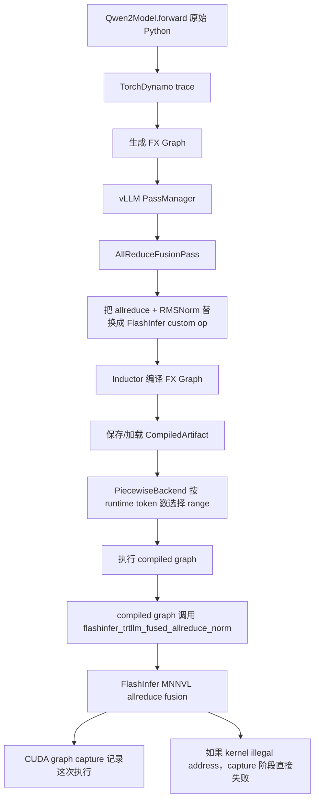
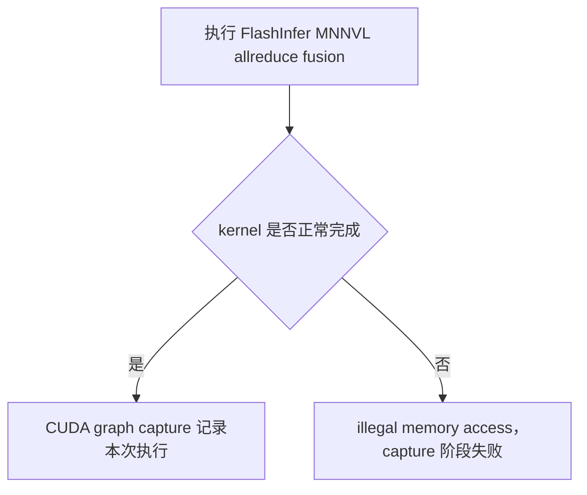

这张图描述的是：**Qwen2 的原始 Python `forward`，如何经过 Dynamo、vLLM 和 Inductor，最终变成可执行的 GPU 编译图；以及为什么错误会在 CUDA Graph capture 阶段暴露。**

## 1）`Qwen2Model.forward 原始 Python`

最开始是普通的 PyTorch 模型代码，例如：

```python
hidden_states = self.model(...)
```

模型内部执行 attention、MLP、RMSNorm、tensor parallel all-reduce 等操作。

但在 vLLM 中，`Qwen2Model` 被编译装饰器处理过，因此调用模型时不会始终直接解释执行原始 Python，而可能进入编译路径。


### _support_torch_compile

```
def _support_torch_compile(
    cls: type[_T],
    dynamic_arg_dims: dict[str, int | list[int] | dict[int, str]],
    mark_unbacked_dims: dict[str, int | list[int]] | None = None,
    enable_if: Callable[[VllmConfig], bool] | None = None,
    is_encoder: bool = False,
) -> type[_T]:
```

这段代码是 vLLM 中 `support_torch_compile` 装饰器的内部实现。它的核心作用是：

>   给模型类增加 `torch.compile` 支持，并在第一次运行时根据 `dynamic_arg_dims` 标记动态维度，然后完成编译、缓存和后续复用。

#### 一、代码整体总结

整个 `_support_torch_compile` 大致做了六件事。

##### 1）修改模型类的继承关系

把：

```python
TorchCompileWithNoGuardsWrapper
```

动态加入模型类的基类，让模型获得编译调用能力。

##### 2）包装模型的 `__init__`

保存：

```python
self.vllm_config
self.compilation_config
self._dynamic_arg_dims
```

并根据配置判断当前模型是否需要编译。

##### 3）定义 `_mark_dynamic_inputs`

读取：

```python
dynamic_arg_dims
```

找到 `forward` 的实际参数，并调用 PyTorch 的：

```python
torch._dynamo.mark_dynamic(...)
```

或者：

```python
torch._dynamo.decorators.mark_unbacked(...)
```

来标记动态维度。

4）重写模型的 `__call__`

模型被调用时，不再直接进入原始 `nn.Module.__call__`，而是先判断：

-   是否禁止编译
-   是否已经在编译环境中
-   是否跳过编译
-   是否存在 AOT 编译缓存
-   是否已经完成编译
-   是否是第一次编译

5）第一次调用时编译模型

第一次运行会先标记动态输入，然后调用 `torch.compile` 相关逻辑生成优化后的计算图。

6）保存和复用编译结果

如果启用 AOT compile，会尝试从磁盘加载编译产物，或者编译完成后把结果保存到缓存目录。

整体流程可以概括为：

```text
装饰模型类
    ↓
包装 __init__
    ↓
模型第一次调用
    ↓
标记动态维度
    ↓
执行 torch.compile
    ↓
保存编译结果
    ↓
后续调用直接执行编译后的模型
```

------

#### 二、`dynamic_arg_dims` 在哪里真正被使用

把 forward 传进来的真实参数，按照 dynamic_arg_dims 配置，标记成 Dynamo 可识别的动态 shape 输入。

```python
dynamic_arg_dims={
    "input_ids": {0: "b"},
    "positions": {-1: "b"},
    "intermediate_tensors": {0: "b"},
    "inputs_embeds": {0: "b"},
}
```

这个参数传入 `_support_torch_compile` 后，真正处理它的是内部函数：

```python
def _mark_dynamic_inputs(
    mod,
    ds_type,
    *args,
    **kwargs,
):
```

重点逻辑是：

```python
for k, v in dynamic_arg_dims.items():
```

它会逐个处理：

```text
input_ids
positions
intermediate_tensors
inputs_embeds
```


### vLLM 里的两种 `torch.compile` 编译模式：

1）`CompilationMode.STOCK_TORCH_COMPILE`

表示使用原生、标准的 PyTorch `torch.compile` 流程。

它会保留 TorchDynamo 的 guard 机制。输入形状、Python 状态或其他受监控条件发生变化时，Dynamo 可能重新追踪、重新编译。

特点：

-   行为最接近直接调用 `torch.compile(model)`
-   动态输入兼容性相对更好
-   不使用 vLLM 自己的定制编译优化
-   可能因为 guard 失效产生多次重编译
-   常用于排查问题：判断故障来自 PyTorch 本身，还是 vLLM 的编译改造

vLLM 官方将其描述为“标准 `torch.compile` 编译流水线”。([vLLM](https://docs.vllm.ai/en/stable/api/vllm/config/compilation/?utm_source=chatgpt.com))

2）`CompilationMode.DYNAMO_TRACE_ONCE`

表示只让 TorchDynamo 对模型追踪一次，然后移除或忽略 guards，后续不再重新追踪。

大致过程是：

```text
第一次运行
→ Dynamo 捕获计算图
→ 后端处理或编译计算图
→ 删除 guards

后续运行
→ 直接复用第一次得到的图
→ 不再因为输入条件变化而重新 trace
```

优点是：

-   避免反复 Dynamo tracing
-   避免频繁 recompilation
-   编译行为更稳定
-   对输入模式固定的推理场景比较合适

限制是模型不能依赖动态形状来改变 Python 控制流。例如：

```python
def forward(x):
    if x.shape[0] > 10:
        return path_a(x)
    else:
        return path_b(x)
```

第一次 trace 时假如走了 `path_a`，后面输入变小需要走 `path_b`，但由于不再重新追踪，结果可能错误或直接报错。因此官方明确要求：不能存在依赖动态形状的控制流。([vLLM](https://docs.vllm.ai/en/stable/api/vllm/config/compilation/?utm_source=chatgpt.com))

核心区别可以理解为：

| 模式                  | Dynamo 追踪 | Guards | 输入变化时               |
| --------------------- | ----------- | ------ | ------------------------ |
| `STOCK_TORCH_COMPILE` | 可多次      | 保留   | guard 失效后可能重新编译 |
| `DYNAMO_TRACE_ONCE`   | 仅一次      | 移除   | 强制复用第一次捕获的图   |

简单选择建议：

1）模型输入形状或执行路径可能变化，优先用 `STOCK_TORCH_COMPILE`。

2）确定模型执行图稳定，只是 batch size、token 数等张量维度变化，并且这些变化不会影响 Python 分支，可以使用 `DYNAMO_TRACE_ONCE` 减少重编译。

3）普通 vLLM 推理通常不需要手动选这两个。当前 V1 默认一般使用 `VLLM_COMPILE`，即 vLLM 自定义的编译后端；前两个模式更多用于调试、兼容性验证或特殊后端集成。([vLLM](https://docs.vllm.ai/en/stable/api/vllm/config/compilation/?utm_source=chatgpt.com))


## 2）`TorchDynamo trace`

TorchDynamo 会观察一次 `forward` 的 Python 执行过程，把其中的 PyTorch tensor 运算捕获下来。

它关注的是类似这些操作：

```text
linear
matmul
all_reduce
add
rms_norm
```

普通 Python 控制逻辑会被分析，而张量计算会被转换成图节点。

这里的 `trace` 可以理解为：

```text
执行一次 Python forward
        ↓
记录其中发生了哪些 tensor 运算
```

**Dynamo**（完整名称 **TorchDynamo**）是 PyTorch 2.0+ 编译核心（`torch.compile`）中的**前端捕获工具（Graph Capture Engine）**。

简单来说，它的核心任务是：**无侵入地分析 Python 代码，拦截 PyTorch 算子的执行，并将其转化为中间图表示（FX Graph），然后交给后端（如 Inductor）进行优化和编译。**

------

### 1. 为什么需要 TorchDynamo？（痛点与背景）

在 PyTorch 2.0 之前，PyTorch 主要使用 **TorchScript**（`torch.jit.trace` 和 `torch.jit.script`）来做图编译，但存在严重的体验痛点：

-   **Trace（追踪）**：无法处理 Python 的控制流（如 `if/else`、`for` 循环），遇到条件分支会直接丢弃未执行的分支。
-   **Script（脚本）**：需要将 Python 代码强行解析为 TorchScript 语法，一旦写了稍微复杂的 Python 原生操作（如调用第三方库、复杂的字典操作），就会频繁报错。

**TorchDynamo 的出现就是为了解决“既要 Python 的极度灵活，又要图编译的高性能”这一矛盾。**

------

### 2. 核心工作原理

TorchDynamo 利用了 **Python 3.7+ 的 CPython Frame Evaluation API**（帧评估 API），直接在 **CPython 字节码（Bytecode）** 级别拦截和分析 Python 代码的执行：

```
Python 源代码 ──> CPython 字节码 ──> TorchDynamo 拦截与分析
                                         │
                        ┌────────────────┴────────────────┐
                        ▼                                 ▼
             PyTorch 算子 (Tensor Ops)              原生 Python 代码
                        │                                 │
                        ▼                                 ▼
                 提取为 FX Graph                    保留在 Python 解释器中
                        │                           (挂起/后退为 Eager 模式)
                        ▼
                后端 (如 Inductor)
             编译为高效 CUDA/C++ Kernel
```

#### 关键特性与机制：

1.  **JIT 字节码拦截（Bytecode JIT Parsing）**

    Dynamo 不解析 Python 语法树（AST），也不靠运行一遍记录 Trace，而是直接在 CPython 执行 Frame（帧）时介入，安全地提取 Tensor 计算图。

2.  **Graph Break（图截断 / 降级）**

    如果遇到 Dynamo 无法分析或转换的纯 Python 操作（比如打印调试信息 `print()`、访问不受支持的第三方库、或无法静态推导的复杂控制流），Dynamo **不会直接报错崩溃**，而是触发 **Graph Break**：

    -   将前面已经提取好的部分编译成一个 Subgraph（子图）。
    -   将无法编译的原生 Python 代码交回给普通的 Python 解释器运行（Eager 模式）。
    -   对后面的 PyTorch 代码再提取一个新的 Subgraph。

3.  **Guards 机制（保护条件）**

    Dynamo 提取图时，会附带一系列 **Guard（保护规则）**（例如：检查张量的维度是否一致、数据类型是否为 `float32`、某些 Python 变量是否没变）。

    -   下一次调用该函数时，Dynamo 会先检查 Guard：
        -   **Guard 成功**：直接复用之前编译好的高效 CUDA 计算图。
        -   **Guard 失败**（比如输入张量 Shape 或 Control Flow 变化了）：触发重新捕获与编译（Re-compilation）。

------

#### 3. 在 `torch.compile` 架构中的位置

完整的 PyTorch 2.0 编译流水线由三层组成：

| **阶段/组件**            | **对应工具**      | **职责**                                                     |
| ------------------------ | ----------------- | ------------------------------------------------------------ |
| **前端（Front-end）**    | **TorchDynamo**   | 安全截获 Python 代码，生成 **FX Graph**。                    |
| **中间层（Middle-end）** | **AOTAutograd**   | 跟踪反向传播逻辑，生成前向+反向的高阶计算图（Joint Forward/Backward Graph）。 |
| **后端（Back-end）**     | **TorchInductor** | 针对硬件（NVIDIA GPU / AMD / CPU）进行算子融合（Kernel Fusion），自动生成高效的 C++/Triton 代码。 |

------

#### 4. 总结直观对比

| **特性**          | **TorchScript (torch.jit)**            | **TorchDynamo (torch.compile)**                         |
| ----------------- | -------------------------------------- | ------------------------------------------------------- |
| **工作原理**      | AST 静态分析 / Trace 追踪              | CPython 字节码 JIT 拦截                                 |
| **Python 兼容性** | 差（遇到不支持的语法直接报错）         | **极佳**（遇到不支持的语法自动 Graph Break 降级运行）   |
| **控制流支持**    | 需要手动改写为 `torch.jit.script` 语法 | **原生支持**（通过 Guards 机制或细分子图）              |
| **用户侵入性**    | 高（需要修改大量模型代码）             | **无侵入**（只需加一行 `model = torch.compile(model)`） |


## 3）`生成 FX Graph`

TorchDynamo 捕获完成后，会生成一个 FX Graph。

它不再是逐行 Python 代码，而是类似这样的计算图：

```text
input
  ↓
attention
  ↓
all_reduce
  ↓
add
  ↓
rms_norm
  ↓
output
```

图中的每一个节点代表一个算子、模块调用或自定义操作。

FX Graph 是后续 vLLM graph pass 和 Inductor 编译的输入。

## 4）`vLLM PassManager`

vLLM 不会立即把原始 FX Graph 交给 Inductor，而是先运行自己的图优化系统。

`PassManager` 会根据配置依次执行若干 graph pass，例如：

```text
NoOpEliminationPass
SequenceParallelismPass
AsyncTPPass
AllReduceFusionPass
```

具体启用哪些 pass，取决于 `compilation_config.pass_config`。

````
NoOpEliminationPass
删除图里没有实际作用的 op。

例如：

reshape -> reshape 回原形
view -> no-op
无意义的 dtype/shape 转换
作用是让后面的 pattern matching 更容易，也减少无意义节点。

SequenceParallelismPass
启用 sequence parallelism。

普通 tensor parallel 里，每个 rank 通常都持有完整 token 维度上的 hidden states：

rank0: [num_tokens, hidden]
rank1: [num_tokens, hidden]
sequence parallel 会把 token 维度也拆开，让不同 rank 处理不同 token slice：

rank0: [num_tokens/TP, hidden]
rank1: [num_tokens/TP, hidden]
它可以减少某些场景的显存/通信开销，但需要额外 scatter/gather 通信，所以只有在满足条件时才启用。

AsyncTPPass
把 tensor parallel 里的通信和计算做异步重叠。

普通流程：

GEMM 完成
  -> all-reduce
  -> 下一步计算
异步 TP 目标是：

GEMM 产生一部分结果
  -> 尽早启动通信
  -> 同时继续做后续计算
也就是 overlap communication and computation。它依赖 enable_sp 和 fuse_gemm_comms。

AllReduceFusionPass
你现在最关心的是这个。

它寻找这种模式：

tensor_model_parallel_all_reduce(input)
  -> RMSNorm
或者：

tensor_model_parallel_all_reduce(input)
  -> residual add
  -> RMSNorm
然后替换成一个 fused kernel：

FlashInfer fused allreduce + residual + RMSNorm
也就是：

flashinfer_trtllm_fused_allreduce_norm
目的：


少一次 kernel launch
减少中间 tensor 读写
把通信和 norm 融合
````

这个阶段的核心作用是：

```text
检查 FX Graph
寻找特定计算模式
重写或融合图中的节点
```

## 5）`AllReduceFusionPass`

当配置中启用了：

```python
fuse_allreduce_rms = True
```

vLLM 会运行 `AllReduceFusionPass`。

它会在 FX Graph 中寻找类似的连续模式：

```text
tensor_model_parallel_all_reduce
                 ↓
          fused_add_rms_norm
```

也就是 tensor parallel 通信完成后，紧接着执行残差相加和 RMSNorm。


### 代码

它是用 **PyTorch Inductor 的 pattern matcher** 替换的，不是手写遍历每个 FX node 删除/插入。核心写法是：

```python
pm.register_replacement(
    pattern,
    replacement,
    example_inputs,
    trace_fn,
    pm_pass,
    extra_check=...
)
```

也就是告诉 pattern matcher：

```text
如果 FX graph 里出现 pattern 这段子图
就用 replacement 这段子图替换它
```

#### 1. 先启用 `AllReduceFusionPass `（`pass` 在编译器里是一个术语，意思是 对中间表示做“一遍处理”）
配置里 `fuse_allreduce_rms=True` 时，PassManager 会加入这个 pass：

```python
if self.pass_config.fuse_allreduce_rms:
    if rocm_aiter_ops.is_enabled():
        self.passes += [RocmAiterAllReduceFusionPass(config)]
    else:
        self.passes += [AllReduceFusionPass(config)]
```

然后 `AllReduceFusionPass.__init__()` 里会初始化 pattern matcher：

```python
# vllm/compilation/passes/pass_manager.py
class AllReduceFusionPass(VllmPatternMatcherPass):
    def __init__(self, config: VllmConfig) -> None:
        super().__init__(config)
        self.disabled = True
        self.tp_size = get_tensor_model_parallel_world_size()
        if self.tp_size <= 1:
            logger.warning_once("AllReduce fusion pass is disabled for tp_size <= 1.")
            return
        self.patterns: PatternMatcherPass = PatternMatcherPass(
            pass_name="all_reduce_fusion_pass"
        )
```

## 2. 然后注册 pattern/replacement
`AllReduceFusionPass` 会调用 `register_patterns()`：

```python
self.allreduce_params = FlashInferFusedAllReduceParams(
    world_size=self.tp_size,
    max_token_num=self.max_token_num,
)

self.register_patterns()
self.dump_patterns(config, self.patterns)

@enable_fake_mode
def register_patterns(self) -> None:
    for epsilon in [1e-5, 1e-6]:
        if self.supports_quant_fusion:
            AllReduceFusedRMSNormStaticQuantFP8Pattern(
                epsilon,
                self.model_dtype,
                self.device,
                self.allreduce_params,
            ).register(self.patterns)
            AllReduceFusedAddRMSNormStaticQuantFP8Pattern(
                epsilon,
                self.model_dtype,
                self.device,
                self.allreduce_params,
            ).register(self.patterns)
            if current_platform.has_device_capability(100):
                AllReduceFusedRMSNormStaticQuantNVFP4Pattern(
                    epsilon,
                    self.model_dtype,
                    self.device,
                    self.allreduce_params,
                ).register(self.patterns)
                AllReduceFusedAddRMSNormStaticQuantNVFP4Pattern(
                    epsilon,
                    self.model_dtype,
                    self.device,
                    self.allreduce_params,
                ).register(self.patterns)
        AllReduceRMSNormPattern(
            epsilon,
            self.model_dtype,
            self.device,
            self.allreduce_params,
        ).register(self.patterns)
        AllReduceFusedAddRMSNormPattern(
            epsilon,
            self.model_dtype,
            self.device,
            self.allreduce_params,
        ).register(self.patterns)
        AllReduceGemmaRMSNormPattern(
            epsilon,
            self.model_dtype,
            self.device,
            self.allreduce_params,
        ).register(self.patterns)
        AllReduceFusedAddGemmaRMSNormPattern(
            epsilon,
            self.model_dtype,
            self.device,
            self.allreduce_params,
        ).register(self.patterns)

        # WARNING: This is a hack to clear the pattern matcher cache
        # and allow multiple values of epsilon.
        torch._inductor.pattern_matcher._seen_patterns.clear()

    self.disabled = False
```

这里会注册两个主要模式：

```text
AllReduceRMSNormPattern
AllReduceFusedAddRMSNormPattern
```

你的 Qwen2 更常见的是第二个：

```text
all_reduce -> fused_add_rms_norm
```

## 3. `pattern` 描述“要找的旧子图”
看 `AllReduceFusedAddRMSNormPattern.register()`：

```440:448:vllm/compilation/passes/fusion/allreduce_rms_fusion.py
    def register(self, pm_pass: PatternMatcherPass) -> None:
        def pattern(
            residual: torch.Tensor, input: torch.Tensor, weight: torch.Tensor
        ) -> tuple[torch.Tensor, torch.Tensor]:
            allreduce_output = tensor_model_parallel_all_reduce(input)
            rms, residual = vllm.ir.ops.fused_add_rms_norm(
                allreduce_output, residual, weight, self.epsilon
            )
            return rms, residual
```

这个 `pattern()` 不是运行时真正执行的模型代码，而是 **用来生成一个小的 FX 子图模板**。

模板就是：

```text
input
  ↓
tensor_model_parallel_all_reduce
  ↓
fused_add_rms_norm(allreduce_output, residual, weight)
  ↓
return rms, residual
```

## 4. `replacement` 描述“替换后的新子图”
紧接着：

```450:467:vllm/compilation/passes/fusion/allreduce_rms_fusion.py
        def replacement(
            residual: torch.Tensor, input: torch.Tensor, weight: torch.Tensor
        ) -> tuple[torch.Tensor, torch.Tensor]:
            assert flashinfer_comm is not None, "FlashInfer must be enabled"
            allreduce = auto_functionalized(
                flashinfer_trtllm_fused_allreduce_norm,
                allreduce_in=input,
                residual=residual,
                norm_out=None,
                quant_out=None,
                scale_out=None,
                rms_gamma=weight,
                rms_eps=self.epsilon,
                pattern_code=flashinfer_comm.AllReduceFusionPattern.kARResidualRMSNorm,
                **self.allreduce_params.get_trtllm_fused_allreduce_kwargs(),
            )
            # allreduce_in, residual
            return allreduce[1], allreduce[2]
```

这个新子图就是：

```text
input, residual, weight
  ↓
flashinfer_trtllm_fused_allreduce_norm(...)
  ↓
return fused_output
```

所以替换前：

```text
tensor_model_parallel_all_reduce
fused_add_rms_norm
```

替换后：

```text
flashinfer_trtllm_fused_allreduce_norm
```

## 5. 真正注册替换规则
关键在这里：

```469:477:vllm/compilation/passes/fusion/allreduce_rms_fusion.py
        # extra_check routes a Gemma fp32 gamma to AllReduceFusedAddGemmaRMSNormPattern.
        pm.register_replacement(
            pattern,
            replacement,
            self.get_inputs(),
            pm.fwd_only,
            pm_pass,
            extra_check=_norm_input_weight_dtype_match,
        )
```

这里的含义是：

```text
pattern: 要匹配的旧图
replacement: 匹配后生成的新图
self.get_inputs(): fake/example tensors，用来 trace pattern/replacement
pm.fwd_only: 只 trace forward
pm_pass: 当前 PatternMatcherPass
extra_check: 额外检查 dtype/形状条件
```

`get_inputs()` 提供假输入，让 PyTorch 把 `pattern()` 和 `replacement()` 都 trace 成 FX graph：

```432:438:vllm/compilation/passes/fusion/allreduce_rms_fusion.py
    def get_inputs(self) -> list[torch.Tensor]:
        input = self.empty(5, 16)
        residual = self.empty(5, 16)
        weight = self.empty(16)

        # input goes through allreduce first, always 16-bit
        return [residual, input.to(self.dtype), weight]
```

所以 pattern matcher 手里有两张小图：

```text
旧图模板 pattern_graph
新图模板 replacement_graph
```

## 6. pass 执行时扫描并替换 FX graph
真正执行替换是在：

```1104:1111:vllm/compilation/passes/fusion/allreduce_rms_fusion.py
    @VllmInductorPass.time_and_log
    def __call__(self, graph: fx.Graph) -> None:
        if self.disabled:
            logger.debug("AllReduceFusionPass disabled")
            return

        self.matched_count = self.patterns.apply(graph)
        logger.debug("Replaced %s patterns", self.matched_count)
```

`self.patterns.apply(graph)` 会扫描整个 FX graph：

```text
for 每个可能的子图:
    如果子图结构 == pattern graph
    并且 extra_check 通过
    就删掉旧节点
    插入 replacement graph 的节点
    重新连接输入输出
```

你可以理解成：

```text
FX Graph 原来：

node_a = tensor_model_parallel_all_reduce(input)
node_b = fused_add_rms_norm(node_a, residual, weight)
return node_b

apply() 后：

node_c = flashinfer_trtllm_fused_allreduce_norm(
    allreduce_in=input,
    residual=residual,
    rms_gamma=weight,
    ...
)
return node_c 的对应输出
```

## 7. 为什么 `return allreduce[1], allreduce[2]`
`auto_functionalized(...)` 包的是一个多输出 custom op。它返回的 tuple 里包含输入/输出别名管理后的多个值。

这里注释写了：

```python
# allreduce_in, residual
return allreduce[1], allreduce[2]
```

意思是 replacement 要保持和原 pattern 一样的输出接口：

```text
pattern 返回: rms, residual
replacement 也必须返回: rms, residual
```

这样后续 graph 的使用者不用改，只是上游产生这两个值的节点变了。

## 一句话
替换过程是：

```text
1. 写一个 pattern() 函数描述旧子图
2. 写一个 replacement() 函数描述新子图
3. 用 fake input 把两者 trace 成 FX graph
4. register_replacement 注册规则
5. AllReduceFusionPass 执行时 patterns.apply(graph)
6. pattern matcher 在模型 FX graph 中找到旧子图
7. 删除旧节点，插入 FlashInfer custom op 节点
```

所以它是 **图级别的子图重写**，不是运行时 `if` 判断，也不是字符串替换。


## 6）`替换成 FlashInfer custom op`

找到上述模式后，vLLM 会把多个节点替换成一个融合算子，例如：

```text
原来：

all_reduce
    ↓
residual add
    ↓
RMSNorm
```

替换为：

```text
flashinfer_trtllm_fused_allreduce_norm
```

这样做的目标是减少：

```text
kernel launch 次数
中间 tensor 的读写
通信和计算之间的同步开销
显存带宽消耗
```

需要注意，这个决定是在**编译期修改 FX Graph**，不是每次请求执行时再临时决定是否融合。

## 7）`Inductor 编译 FX Graph`

经过 vLLM graph passes 改写后，FX Graph 被交给 TorchInductor。

Inductor 会进一步：

```text
分析算子依赖
进行算子融合
规划中间 buffer
生成 CUDA/Triton/C++ 代码
生成 Python 调度包装代码
```

其中普通算子可能由 Inductor 生成 kernel，而 FlashInfer custom op 通常会保留为外部自定义算子调用。

因此，编译结果可能近似于：

```python
def compiled_graph(...):
    ...
    flashinfer_trtllm_fused_allreduce_norm(...)
    ...
    return outputs
```

## 8）`保存/加载 CompiledArtifact`

Inductor 编译可能比较耗时，所以 vLLM 会保存编译产物。

保存的内容可以包括：

```text
Inductor 生成的代码
编译后的共享库或 kernel
图输入输出信息
shape range 信息
compiled callable
```

下次启动时，如果缓存仍然有效，就可以直接加载：

```text
Directly load AOT compilation from path ...
Directly load the compiled graph(s) ...
```

这意味着当前启动过程不一定重新执行 Dynamo trace 和 Inductor 编译。

逻辑上这些步骤仍然存在，但实际运行时可能是：

```text
发现有效缓存
    ↓
跳过重新编译
    ↓
直接加载 CompiledArtifact
```

## 9）`PiecewiseBackend 按 token 数选择 range`

vLLM 不一定只生成一个覆盖全部输入规模的编译图，而是根据 token 数划分区间。

例如：

```text
range 1：1～4096 tokens
range 2：4097～8192 tokens
```

运行时，`PiecewiseBackend` 会检查当前输入的动态 shape，通常是本次执行涉及的 token 数，然后选择对应的 compiled graph：

```python
runtime_shape = ...
range_entry = self._find_range_for_shape(runtime_shape)
return range_entry.runnable(*args)
```

例如：

```text
当前有 2048 tokens
    ↓
选择 1～4096 对应的 compiled graph
当前有 6000 tokens
    ↓
选择 4097～8192 对应的 compiled graph
```

不同 range 可能有不同的优化策略和融合结果。

## 10）`执行 compiled graph`

选定 range 后，vLLM 调用对应的 compiled callable。

此时执行的已经不是普通 Python `Qwen2Model.forward`，而是 Inductor 生成或从缓存加载的执行函数。

逻辑近似于：

```python
range_entry.runnable(*args)
```

然后进入：

```text
Inductor output code
CUDA/Triton kernel
外部 custom op
```

这也是堆栈中可能出现以下路径的原因：

```text
torch/_inductor/output_code.py
torch/_inductor/standalone_compile.py
.cache/vllm/torch_compile_cache/...
```

## 11）`调用 flashinfer_trtllm_fused_allreduce_norm`

因为 FX Graph 在编译前已被 `AllReduceFusionPass` 修改，所以 compiled graph 中包含：

```text
flashinfer_trtllm_fused_allreduce_norm
```

当执行走到该节点时，会进入 FlashInfer/TRT-LLM 提供的 fused kernel。

该算子通常同时完成：

```text
跨 tensor-parallel GPU 的 all-reduce
残差相关处理
RMSNorm
```

所以报错虽然发生在 compiled graph 中，但真正出错的位置可能是 FlashInfer 内部的 CUDA kernel，而不是 Inductor 自己生成的普通 kernel。

## 12）`FlashInfer MNNVL allreduce fusion`

MNNVL 是这条 fused all-reduce 路径使用的底层通信与访存机制之一。

执行路径可以简化为：

```text
Inductor compiled graph
        ↓
FlashInfer custom op
        ↓
TRT-LLM fused allreduce + norm
        ↓
MNNVL CUDA kernel
```

这条 kernel 会操作多 GPU 通信相关的 buffer、同步状态、输入输出指针和中间数据。

如果存在以下问题，就可能触发非法访问：

```text
输入 shape 不符合 kernel 假设
buffer 大小或地址不正确
多 GPU 映射状态异常
通信 workspace 初始化异常
缓存产物与当前环境不兼容
特定 token range 触发边界问题
kernel 自身存在 bug
```

仅凭这张流程图不能确定具体是哪一种原因，但能确定错误发生在 fused custom op 的运行阶段。

## 13）`CUDA graph capture 记录这次执行`

CUDA Graph 不能只“读取” compiled graph 的结构，它必须用一组 dummy input 真正执行一次 GPU 工作负载。

过程近似为：

```text
开始 capture
    ↓
执行一次 compiled graph
    ↓
记录其中提交的 CUDA kernels
    ↓
结束 capture
    ↓
后续请求直接 replay
```

所以 capture 阶段会实际运行：

```text
attention kernel
Inductor kernel
FlashInfer fused allreduce kernel
RMSNorm 相关 kernel
```

不是仅仅做静态分析。

## 14）`kernel illegal address 导致 capture 失败`

图中从 `FlashInfer MNNVL allreduce fusion` 分出两条路径：

```text
正常执行
    ↓
CUDA graph capture 记录成功
```

以及：

```text
kernel 访问非法地址
    ↓
CUDA 报 illegal memory access
    ↓
当前 capture 失败
    ↓
模型启动或 warm-up 失败
```

这里需要注意，**CUDA Graph capture 并不一定是错误根因**。

更准确地说是：

```text
capture 阶段触发了 compiled graph 的真实执行
compiled graph 调用了 FlashInfer MNNVL kernel
kernel 在执行时发生非法地址访问
因此错误表现为 capture 失败
```

也就是说：

```text
CUDA Graph capture = 错误暴露的场景
FlashInfer MNNVL kernel = 更接近错误发生的位置
```

整条链路可以压缩为：

```text
原始 Qwen2 Python forward
        ↓
Dynamo 转成 FX Graph
        ↓
vLLM 用 AllReduceFusionPass 改图
        ↓
插入 FlashInfer fused allreduce + RMSNorm
        ↓
Inductor 编译并缓存
        ↓
运行时按 token 数选择 compiled graph
        ↓
CUDA Graph capture 真正执行 compiled graph
        ↓
执行到 FlashInfer MNNVL kernel
        ↓
非法显存访问导致 capture 和启动失败
```

另外，图中的箭头：

```text
L --> M
L --> N
```

容易让人误解为两个动作同时发生。更严谨的表示应当是：



这样能更清楚地区分正常路径和异常路径。
