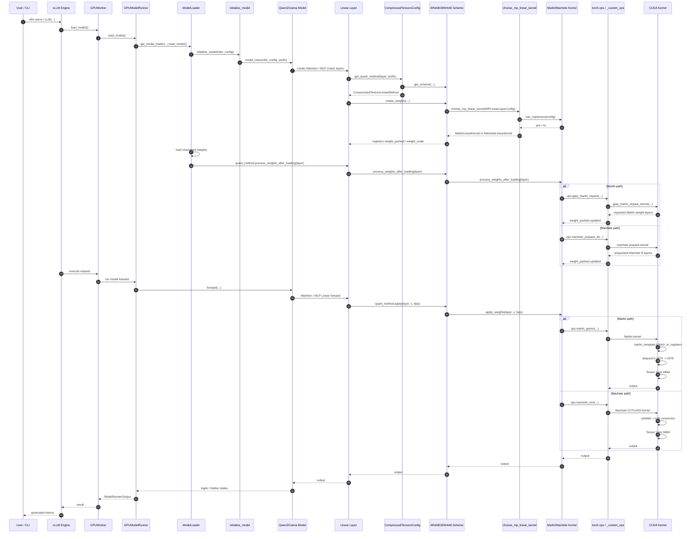

`ldmatrix.s8.s4` 要插入的位置在 Marlin forward 的 CUDA 段：

```
当前：
marlin_template.h fetch_to_registers
  -> 普通 shared memory load packed INT4
  -> dequant.h INT4 -> INT8
  -> Tensor Core MMA

目标：
marlin_template.h fetch_to_registers
  -> ldmatrix.s8.s4 shared memory load + INT4 -> INT8 硬件扩展
  -> Tensor Core MMA
```

同时加载阶段的 repack 也要配套变化：

```
当前：
ops.gptq_marlin_repack
  -> 旧 Marlin dequant-interleave layout

目标：
ops.gptq_marlin_repack
  -> ldmatrix.s8.s4 所需的新 packed s4 layout
```


下面按你这条链 **从头开始**，每一步给对应代码位置和关键代码。

**1. GPUWorker.load_model**
[gpu_worker.py (line 436)](/data/home/xli49/vllm/vllm/v1/worker/gpu_worker.py:436)

```
def load_model(self, *, load_dummy_weights: bool = False) -> None:
    self.model_runner.load_model(load_dummy_weights=load_dummy_weights)
```

这里 `GPUWorker` 只是转发，真正加载在 `GPUModelRunner`。

**2. GPUModelRunner.load_model**
V1 runner：
[gpu_model_runner.py (line 5382)](/data/home/xli49/vllm/vllm/v1/worker/gpu_model_runner.py:5382)

```
def load_model(self, load_dummy_weights: bool = False) -> None:
    if load_dummy_weights:
        ...
    else:
        model_loader = get_model_loader(self.load_config)
        self.model = model_loader.load_model(
            vllm_config=self.vllm_config,
            model_config=self.model_config,
        )
```

V2 runner：
[model_runner.py (line 326)](/data/home/xli49/vllm/vllm/v1/worker/gpu/model_runner.py:326)

```
def load_model(self, load_dummy_weights: bool = False, *args, **kwargs) -> None:
    model_loader = get_model_loader(self.vllm_config.load_config)
    self.model = model_loader.load_model(
        vllm_config=self.vllm_config,
        model_config=self.model_config,
    )
```

**3. get_model_loader**
[model_loader/__init__.py (line 119)](/data/home/xli49/vllm/vllm/model_executor/model_loader/__init__.py:119)

```
def get_model_loader(load_config: LoadConfig) -> BaseModelLoader:
    load_format = load_config.load_format
    return _LOAD_FORMAT_TO_MODEL_LOADER[load_format](load_config)
```

通常返回 `DefaultModelLoader`。

**4. model_loader.load_model**
[base_loader.py (line 43)](/data/home/xli49/vllm/vllm/model_executor/model_loader/base_loader.py:43)

```
class BaseModelLoader(ABC):
    def load_model(self, vllm_config: VllmConfig, model_config: ModelConfig):
        with set_default_torch_dtype(model_config.dtype):
            model = initialize_model(vllm_config=vllm_config)
            self.load_weights(model, model_config)
            process_weights_after_loading(model, model_config, target_device)
        return model
```

这里做三件事：

```
initialize_model()
load_weights()
process_weights_after_loading()
```

**5. initialize_model**
[model_loader/utils.py (line 40)](/data/home/xli49/vllm/vllm/model_executor/model_loader/utils.py:40)

```
def initialize_model(
    vllm_config: VllmConfig,
    *,
    prefix: str = "",
    model_class: type[nn.Module] | None = None,
    model_config: ModelConfig | None = None,
) -> nn.Module:
    if model_config is None:
        model_config = vllm_config.model_config
    if model_class is None:
        model_class, _ = get_model_architecture(model_config)

    if vllm_config.quant_config is not None:
        configure_quant_config(vllm_config.quant_config, model_class)

    with set_current_vllm_config(vllm_config, check_compile=True, prefix=prefix):
        model = model_class(vllm_config=vllm_config, prefix=prefix)
        record_metadata_for_reloading(model)
        return model
```

这里会构造具体模型，比如 `Qwen2ForCausalLM`、`LlamaForCausalLM`。

**6. Qwen2/Llama 模型构造**
以 Qwen2 为例：
[qwen2.py (line 156)](/data/home/xli49/vllm/vllm/model_executor/models/qwen2.py:156)

```
self.qkv_proj = QKVParallelLinear(
    hidden_size,
    self.total_num_heads * self.head_dim,
    self.total_num_kv_heads * self.head_dim,
    bias=True,
    quant_config=quant_config,
    prefix=f"{prefix}.qkv_proj",
)

self.o_proj = RowParallelLinear(
    self.total_num_heads * self.head_dim,
    hidden_size,
    bias=False,
    quant_config=quant_config,
    prefix=f"{prefix}.o_proj",
)
```

MLP：
[qwen2.py (line 90)](/data/home/xli49/vllm/vllm/model_executor/models/qwen2.py:90)

```
self.gate_up_proj = MergedColumnParallelLinear(
    hidden_size,
    [intermediate_size] * 2,
    bias=False,
    quant_config=quant_config,
    prefix=f"{prefix}.gate_up_proj",
)

self.down_proj = RowParallelLinear(
    intermediate_size,
    hidden_size,
    bias=False,
    quant_config=quant_config,
    prefix=f"{prefix}.down_proj",
)
```

**7. Attention/MLP 创建 Linear**
Linear 初始化时，会用 `quant_config` 创建 `quant_method`，然后创建量化权重。

[linear.py (line 486)](/data/home/xli49/vllm/vllm/model_executor/layers/linear.py:486)

```
self.quant_method.create_weights(
    layer=self,
    input_size_per_partition=self.input_size_per_partition,
    output_partition_sizes=self.output_partition_sizes,
    input_size=self.input_size,
    output_size=self.output_size,
    params_dtype=self.params_dtype,
    weight_loader=self.weight_loader,
)
```

forward 时：

[linear.py (line 576)](/data/home/xli49/vllm/vllm/model_executor/layers/linear.py:576)

```
output_parallel = self.quant_method.apply(self, input_, bias)
```

**8. CompressedTensorsConfig 给 Linear 选 quant_method**
[compressed_tensors.py (line 153)](/data/home/xli49/vllm/vllm/model_executor/layers/quantization/compressed_tensors/compressed_tensors.py:153)

```
def get_quant_method(self, layer: torch.nn.Module, prefix: str):
    if isinstance(layer, LinearBase):
        quant_scheme = self.get_scheme(layer=layer, layer_name=prefix)

        quant_method: LinearMethodBase = UnquantizedLinearMethod()
        if quant_scheme is not None:
            layer.scheme = quant_scheme
            quant_method = CompressedTensorsLinearMethod(self)

        return quant_method
```

**9. WNA8O8/W4A8 scheme**
[compressed_tensors.py (line 762)](/data/home/xli49/vllm/vllm/model_executor/layers/quantization/compressed_tensors/compressed_tensors.py:762)

```
if self._is_wNa8o8_int(weight_quant, input_quant, output_quant, format):
    return CompressedTensorsWNA8O8Int(
        num_bits=weight_quant.num_bits,
        strategy=weight_quant.strategy,
        group_size=weight_quant.group_size,
        has_input_act=input_quant is not None,
        has_output_act=output_quant is not None,
        layer_name=layer_name,
        quant_format=format,
    )
```

这个就是 W4A8-INT8 linear 路径的 scheme。

**10. scheme 选择 MP kernel**
[compressed_tensors_wNa8o8.py (line 107)](/data/home/xli49/vllm/vllm/model_executor/layers/quantization/compressed_tensors/schemes/compressed_tensors_wNa8o8.py:107)

```
mp_config = MPLinearLayerConfig(
    full_weight_shape=(input_size, output_size),
    partition_weight_shape=(
        input_size_per_partition,
        output_size_per_partition,
    ),
    weight_type=self.quant_type,
    act_type=params_dtype,
    group_size=self.group_size,
    zero_points=False,
    has_g_idx=False,
)

self.kernel = choose_mp_linear_kernel(mp_config)(
    mp_config,
    w_q_param_name="weight_packed",
    w_s_param_name="weight_scale",
)
```

**11. choose_mp_linear_kernel**
[linear/__init__.py (line 448)](/data/home/xli49/vllm/vllm/model_executor/kernels/linear/__init__.py:448)

```
_POSSIBLE_KERNELS = {
    PlatformEnum.CUDA: [
        CutlassW4A8LinearKernel,
        MacheteLinearKernel,
        AllSparkLinearKernel,
        MarlinLinearKernel,
        ConchLinearKernel,
        ExllamaLinearKernel,
        TritonW4A16LinearKernel,
        HummingLinearKernel,
    ],
}
```

[linear/__init__.py (line 745)](/data/home/xli49/vllm/vllm/model_executor/kernels/linear/__init__.py:745)

```
def choose_mp_linear_kernel(config, compute_capability=None):
    platform_kernels = _POSSIBLE_KERNELS.get(current_platform._enum, [])

    for kernel in platform_kernels:
        if kernel.get_min_capability() > compute_capability:
            continue

        can_implement, failure_reason = kernel.can_implement(config)
        if can_implement:
            return kernel
```

**12. Marlin/Machete**
Marlin 是否可用：
[marlin.py (line 41)](/data/home/xli49/vllm/vllm/model_executor/kernels/linear/mixed_precision/marlin.py:41)

```
class MarlinLinearKernel(MPLinearKernel):
    @classmethod
    def can_implement(cls, c: MPLinearLayerConfig):
        if not current_platform.is_cuda():
            return False, "Marlin only supported on CUDA"

        quant_types = query_marlin_supported_quant_types(c.zero_points)
        if c.weight_type not in quant_types:
            return False, ...

        return True, None
```

Machete 是否可用：
[machete.py (line 30)](/data/home/xli49/vllm/vllm/model_executor/kernels/linear/mixed_precision/machete.py:30)

```
class MacheteLinearKernel(MPLinearKernel):
    @classmethod
    def can_implement(cls, c: MPLinearLayerConfig):
        if not current_platform.is_cuda():
            return False, "Machete only supported on CUDA"

        if not current_platform.is_device_capability(90):
            return False, "Machete requires compute capability of 90"

        return check_machete_supports_shape(...)
```

**13. gptq_marlin_repack**
加载后处理入口：
[model_loader/utils.py (line 99)](/data/home/xli49/vllm/vllm/model_executor/model_loader/utils.py:99)

```
for _, module in model.named_modules():
    quant_method = getattr(module, "quant_method", None)
    if isinstance(quant_method, QuantizeMethodBase):
        quant_method.process_weights_after_loading(module)
```

CompressedTensors 转发：
[compressed_tensors.py (line 975)](/data/home/xli49/vllm/vllm/model_executor/layers/quantization/compressed_tensors/compressed_tensors.py:975)

```
def process_weights_after_loading(self, layer):
    layer.scheme.process_weights_after_loading(layer)
```

WNA8O8 转发到 kernel：
[compressed_tensors_wNa8o8.py (line 200)](/data/home/xli49/vllm/vllm/model_executor/layers/quantization/compressed_tensors/schemes/compressed_tensors_wNa8o8.py:200)

```
def process_weights_after_loading(self, layer):
    self.kernel.process_weights_after_loading(layer)
```

Marlin repack：
[marlin.py (line 127)](/data/home/xli49/vllm/vllm/model_executor/kernels/linear/mixed_precision/marlin.py:127)

```
x.data = ops.gptq_marlin_repack(
    marlin_pad_qweight(
        x.data.contiguous(), size_n, size_k, padded_n, padded_k
    ),
    perm=layer.g_idx_sort_indices,
    size_k=padded_k,
    size_n=padded_n,
    num_bits=c.weight_type.size_bits,
    is_a_8bit=is_a_8bit,
)
```

CUDA repack 实现：
[gptq_marlin_repack.cu (line 15)](/data/home/xli49/vllm/csrc/libtorch_stable/quantization/marlin/gptq_marlin_repack.cu:15)

```
__global__ void gptq_marlin_repack_kernel(...) {
    ...
}
```

**14. marlin_gemm**
forward 入口：
[compressed_tensors_wNa8o8.py (line 252)](/data/home/xli49/vllm/vllm/model_executor/layers/quantization/compressed_tensors/schemes/compressed_tensors_wNa8o8.py:252)

```
def apply_weights(self, layer, x, bias):
    if self.has_input_act:
        x = fake_quant_static_int8(x, self._input_scale)

    out = self.kernel.apply_weights(layer, x, bias)

    if self.has_output_act:
        out = fake_quant_static_int8(out, self._output_scale)
    return out
```

Marlin apply：
[marlin.py (line 235)](/data/home/xli49/vllm/vllm/model_executor/kernels/linear/mixed_precision/marlin.py:235)

```
return apply_gptq_marlin_linear(
    input=x,
    weight=w_q,
    weight_scale=w_s,
    weight_zp=w_zp,
    g_idx=w_gidx,
    g_idx_sort_indices=layer.g_idx_sort_indices,
    workspace=self.workspace,
    wtype=c.weight_type,
    input_size_per_partition=c.partition_weight_shape[0],
    output_size_per_partition=c.partition_weight_shape[1],
    is_k_full=self.is_k_full,
    input_global_scale=getattr(layer, "input_global_scale", None),
    bias=bias,
    input_dtype=c.act_type,
)
```

最终会进：

```
ops.marlin_gemm(...)
```

**15. CUDA kernel：marlin_template.h / dequant.h**
B 权重从 shared memory 进 register：
[marlin_template.h (line 933)](/data/home/xli49/vllm/csrc/libtorch_stable/quantization/marlin/marlin_template.h:933)

```
auto fetch_to_registers = [&](int k, int pipe) {
  int4* sh_b_stage = sh_b + b_sh_stage * pipe;

#pragma unroll
  for (int i = 0; i < b_thread_vecs; i++) {
    frag_b_quant[k % 2][i] = *reinterpret_cast<I4*>(
        &sh_b_stage[b_sh_stride * (k % b_sh_wr_iters) + b_sh_rd + i]);
  }
};
```

dequant 调用：
[marlin_template.h (line 1164)](/data/home/xli49/vllm/csrc/libtorch_stable/quantization/marlin/marlin_template.h:1164)

```
auto dequant_data = [&](int q, scalar_32bit_t* frag_b_ptr, int zp = 0) {
  if constexpr (a_type.size_bits() != b_type.size_bits()) {
    if constexpr (is_a_8bit && has_zp) {
      sub_zp_and_dequant<scalar_32bit_t, b_type_id, dequant_skip_flop>(
          q, frag_b_ptr, zp);
    } else {
      dequant<scalar_32bit_t, b_type_id, dequant_skip_flop>(q, frag_b_ptr);
    }
  }
};
```

当前 W4A8-INT8 的 INT4 -> INT8 解包：
[dequant.h (line 494)](/data/home/xli49/vllm/csrc/libtorch_stable/quantization/marlin/dequant.h:494)

```
template <>
__device__ inline void dequant<int32_t, vllm::kU4B8.id(), true>(
    int q, int32_t* frag_b) {
  constexpr int repeated_zp = 0x08080808;
  constexpr int MASK = 0x80808080;

  frag_b[0] = ((q & 0x0F0F0F0F | MASK) - repeated_zp) ^ MASK;
  q >>= 4;
  frag_b[1] = ((q & 0x0F0F0F0F | MASK) - repeated_zp) ^ MASK;
}
```

这就是要被 `ldmatrix.s8.s4` 替换/绕过的核心位置。
