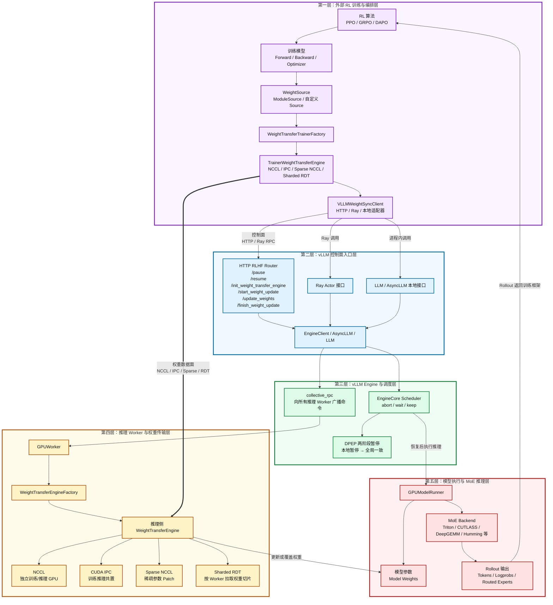

```mermaid
flowchart TB

    subgraph L1["第一层：外部 RL 训练与编排层"]
        direction LR

        RL["RL 算法<br/>PPO / GRPO / DAPO"]
        TRAIN["训练模型<br/>Forward / Backward / Optimizer"]
        SOURCE["WeightSource<br/>ModuleSource / 自定义 Source"]
        TFACTORY["WeightTransferTrainerFactory"]
        TENGINE["TrainerWeightTransferEngine<br/>NCCL / IPC / Sparse NCCL / Sharded RDT"]
        CLIENT["VLLMWeightSyncClient<br/>HTTP / Ray / 本地适配器"]

        RL --> TRAIN
        TRAIN --> SOURCE
        SOURCE --> TFACTORY
        TFACTORY --> TENGINE
        TENGINE --> CLIENT
    end

    subgraph L2["第二层：vLLM 控制面入口层"]
        direction LR

        HTTP["HTTP RLHF Router<br/>/pause<br/>/resume<br/>/init_weight_transfer_engine<br/>/start_weight_update<br/>/update_weights<br/>/finish_weight_update"]

        RAY["Ray Actor 接口"]
        LOCAL["LLM / AsyncLLM 本地接口"]
        ENGINE_API["EngineClient / AsyncLLM / LLM"]

        HTTP --> ENGINE_API
        RAY --> ENGINE_API
        LOCAL --> ENGINE_API
    end

    subgraph L3["第三层：vLLM Engine 与调度层"]
        direction LR

        SCHEDULER["EngineCore Scheduler<br/>abort / wait / keep"]
        DP_PAUSE["DPEP 两阶段暂停<br/>本地暂停 → 全局一致"]
        RPC["collective_rpc<br/>向所有推理 Worker 广播命令"]

        SCHEDULER --> DP_PAUSE
        ENGINE_API --> SCHEDULER
        ENGINE_API --> RPC
    end

    subgraph L4["第四层：推理 Worker 与权重传输层"]
        direction LR

        WORKER["GPUWorker"]
        WFACTORY["WeightTransferEngineFactory"]
        WENGINE["推理侧 WeightTransferEngine"]

        NCCL["NCCL<br/>独立训练/推理 GPU"]
        IPC["CUDA IPC<br/>训练推理共置"]
        SPARSE["Sparse NCCL<br/>稀疏参数 Patch"]
        RDT["Sharded RDT<br/>按 Worker 拉取权重切片"]

        RPC --> WORKER
        WORKER --> WFACTORY
        WFACTORY --> WENGINE

        WENGINE --> NCCL
        WENGINE --> IPC
        WENGINE --> SPARSE
        WENGINE --> RDT
    end

    subgraph L5["第五层：模型执行与 MoE 推理层"]
        direction LR

        PARAM["模型参数<br/>Model Weights"]
        RUNNER["GPUModelRunner"]
        MOE["MoE Backend<br/>Triton / CUTLASS / DeepGEMM / Humming 等"]
        OUTPUT["Rollout 输出<br/>Tokens / Logprobs / Routed Experts"]

        RUNNER --> PARAM
        RUNNER --> MOE
        MOE --> OUTPUT
    end

    CLIENT -->|"控制面<br/>HTTP / Ray RPC"| HTTP
    CLIENT -->|"Ray 调用"| RAY
    CLIENT -->|"进程内调用"| LOCAL

    TENGINE ==>|"权重数据面<br/>NCCL / IPC / Sparse / RDT"| WENGINE
    SCHEDULER -->|"恢复后执行推理"| RUNNER
    WENGINE -->|"更新或覆盖权重"| PARAM
    OUTPUT -->|"Rollout 返回训练框架"| RL

    classDef external fill:#f3e8ff,stroke:#7e22ce,stroke-width:2px,color:#111;
    classDef control fill:#e0f2fe,stroke:#0369a1,stroke-width:2px,color:#111;
    classDef engine fill:#dcfce7,stroke:#15803d,stroke-width:2px,color:#111;
    classDef transfer fill:#fef3c7,stroke:#b45309,stroke-width:2px,color:#111;
    classDef inference fill:#fee2e2,stroke:#b91c1c,stroke-width:2px,color:#111;

    class RL,TRAIN,SOURCE,TFACTORY,TENGINE,CLIENT external;
    class HTTP,RAY,LOCAL,ENGINE_API control;
    class SCHEDULER,DP_PAUSE,RPC engine;
    class WORKER,WFACTORY,WENGINE,NCCL,IPC,SPARSE,RDT transfer;
    class PARAM,RUNNER,MOE,OUTPUT inference;

    style L1 fill:#faf5ff,stroke:#7e22ce,stroke-width:3px
    style L2 fill:#f0f9ff,stroke:#0369a1,stroke-width:3px
    style L3 fill:#f0fdf4,stroke:#15803d,stroke-width:3px
    style L4 fill:#fffbeb,stroke:#b45309,stroke-width:3px
    style L5 fill:#fff1f2,stroke:#b91c1c,stroke-width:3px
```
