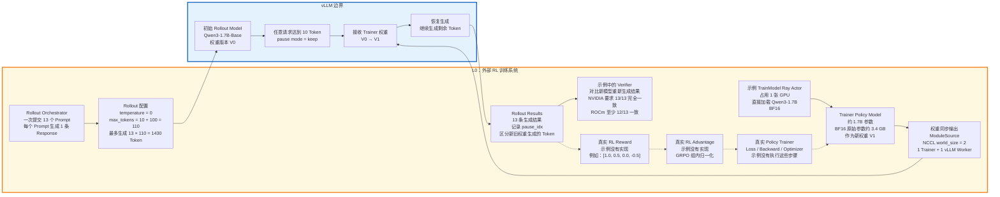

```mermaid
flowchart TB

    %% ==================== L0 ====================
    subgraph L0["L0：外部 RL 训练系统"]
        direction LR
        ORCH["Rollout Orchestrator<br/>verl / Prime-RL / NeMo-RL / 自研框架"]
        REWARD["Reward / Verifier"]
        ADV["Advantage 计算<br/>GAE / GRPO"]
        TRAINER["Policy Trainer<br/>Loss / Backward / Optimizer"]
        TRAINMODEL["Trainer Policy Model<br/>新版本模型参数"]

        ORCH --> REWARD
        REWARD --> ADV
        ADV --> TRAINER
        TRAINER --> TRAINMODEL
    end

    %% ==================== L1 ====================
    subgraph L1["L1：vLLM 对外入口层"]
        direction LR
        CHATAPI["Rollout API<br/>/v1/chat/completions"]
        COMPLETIONAPI["Rollout API<br/>/v1/completions"]
        RESPAPI["Rollout API<br/>/v1/responses"]
        PYAPI["Python API<br/>LLM.generate<br/>AsyncLLM.generate"]
        RLAPI["RL 控制 API<br/>/pause /resume<br/>/start_weight_update<br/>/update_weights<br/>/finish_weight_update"]
        SLEEPAPI["显存控制 API<br/>/sleep /wake_up"]
        RAYAPI["Ray Actor API<br/>RayVLLMWeightSyncClient"]
    end

    %% ==================== L2 ====================
    subgraph L2["L2：Frontend 与 Engine Client 层"]
        direction LR
        OPENAISERVE["OpenAI Serving<br/>协议解析 / Streaming"]
        RENDERER["Renderer / Tokenizer<br/>Chat Template"]
        INPUTPROC["InputProcessor<br/>输入校验 / Tokenize<br/>构造 EngineCoreRequest"]
        ASYNCLLM["AsyncLLM / LLMEngine<br/>EngineClient 实现"]
        OUTPUTPROC["OutputProcessor<br/>Detokenize / Logprobs"]
        COLLECTOR["RequestOutputCollector<br/>每请求输出队列"]
    end

    %% ==================== L3 ====================
    subgraph L3["L3：EngineCore 控制与调度层"]
        direction LR
        CORECLIENT["EngineCoreClient<br/>进程内或 ZeroMQ IPC"]
        ENGINECORE["EngineCore<br/>请求生命周期<br/>Utility RPC"]
        SCHEDULER["Scheduler<br/>Continuous Batching<br/>Token Budget / PauseState"]
        KVMANAGER["KV Cache Manager<br/>Block 分配 / Prefix Cache"]
        VERSION["Weight Version Manager<br/>当前提交版本"]
    end

    %% ==================== L4 ====================
    subgraph L4["L4：分布式 Executor 层"]
        direction LR
        EXECUTOR["Executor 抽象"]
        UNIPROC["UniProcExecutor"]
        MULTIPROC["MultiprocExecutor"]
        RAYEXEC["RayDistributedExecutor"]
        CRPC["collective_rpc<br/>向全部 Worker 广播"]
        WORKERGROUP["GPUWorker Group<br/>TP × PP × DP"]

        EXECUTOR --> UNIPROC
        EXECUTOR --> MULTIPROC
        EXECUTOR --> RAYEXEC
        CRPC --> WORKERGROUP
        UNIPROC --> WORKERGROUP
        MULTIPROC --> WORKERGROUP
        RAYEXEC --> WORKERGROUP
    end

    %% ==================== L5 ====================
    subgraph L5["L5：GPU Worker 与 ModelRunner 层"]
        direction LR
        GPUWORKER["GPUWorker<br/>每个分布式 Rank 一个"]
        MODELRUNNER["GPUModelRunner<br/>Batch 准备 / CUDA Graph"]
        FORWARD["Policy Model Forward"]
        ATTENTION["Attention Backend"]
        MOE["MoE / Expert Routing"]
        SAMPLER["Sampler<br/>Token / Logprobs"]
        RUNNEROUT["ModelRunnerOutput<br/>Token / Logprobs<br/>Routed Experts"]

        GPUWORKER --> MODELRUNNER
        MODELRUNNER --> FORWARD
        FORWARD --> ATTENTION
        FORWARD --> MOE
        ATTENTION --> SAMPLER
        MOE --> SAMPLER
        SAMPLER --> RUNNEROUT
    end

    %% ==================== L6 ====================
    subgraph L6["L6：GPU 状态与模型存储层"]
        direction LR
        POLICYMODEL["Inference Policy Model<br/>当前 Rollout 参数"]
        KVCACHE["GPU KV Cache"]
        PREFIXCACHE["Prefix Cache"]
        BLOCKTABLE["Block Tables"]
        ROUTECAPTURE["Routed Experts Capturer"]
        SLEEPBACKEND["SleepModeBackend<br/>默认 CuMemBackend"]
        MEMORY["GPU Memory Pool"]

        POLICYMODEL <--> KVCACHE
        KVCACHE <--> BLOCKTABLE
        KVCACHE <--> PREFIXCACHE
        POLICYMODEL --> ROUTECAPTURE
        SLEEPBACKEND <--> MEMORY
    end

    %% ==================== L7 ====================
    subgraph L7["L7：Trainer 侧权重传输层"]
        direction LR
        WEIGHTSOURCE["WeightSource<br/>ModuleSource / Sparse Patch<br/>Sharded Weight Groups"]
        TRAINFACTORY["WeightTransferTrainerFactory"]
        TRAINENGINE["TrainerWeightTransferEngine"]
        SYNCCLIENT["VLLMWeightSyncClient<br/>HTTP / Ray"]
        DATAPLANE["模型张量数据面<br/>NCCL / CUDA IPC / NIXL RDT"]

        WEIGHTSOURCE --> TRAINFACTORY
        TRAINFACTORY --> TRAINENGINE
        TRAINENGINE --> SYNCCLIENT
        TRAINENGINE --> DATAPLANE
    end

    %% ==================== L8 ====================
    subgraph L8["L8：vLLM Worker 权重接收层"]
        direction LR
        WTCONFIG["WeightTransferConfig<br/>选择 Backend"]
        WORKFACTORY["WeightTransferEngineFactory"]
        WTSESSION["Weight Update Session<br/>Inactive / Active"]
        NCCLENGINE["NCCLWeightTransferEngine"]
        IPCENGINE["IPCWeightTransferEngine"]
        SPARSEENGINE["SparseNCCLWeightTransferEngine"]
        RDTENGINE["ShardedRDTWeightTransferEngine"]
        LAYERRELOAD["Layerwise Reload<br/>接收 / 转换 / 恢复 Storage"]
        COMMIT["finish_weight_update<br/>提交 Weight Version"]

        WTCONFIG --> WORKFACTORY
        WORKFACTORY --> NCCLENGINE
        WORKFACTORY --> IPCENGINE
        WORKFACTORY --> SPARSEENGINE
        WORKFACTORY --> RDTENGINE
        WTSESSION --> WORKFACTORY
        NCCLENGINE --> LAYERRELOAD
        IPCENGINE --> LAYERRELOAD
        SPARSEENGINE --> LAYERRELOAD
        RDTENGINE --> LAYERRELOAD
        LAYERRELOAD --> COMMIT
    end

    %% ==================== Rollout 主路径 ====================
    ORCH -->|"Prompt + SamplingParams"| CHATAPI
    ORCH --> COMPLETIONAPI
    ORCH --> RESPAPI
    ORCH --> PYAPI

    CHATAPI --> OPENAISERVE
    COMPLETIONAPI --> OPENAISERVE
    RESPAPI --> OPENAISERVE
    PYAPI --> ASYNCLLM

    OPENAISERVE --> RENDERER
    RENDERER --> INPUTPROC
    INPUTPROC --> ASYNCLLM
    ASYNCLLM --> CORECLIENT

    CORECLIENT --> ENGINECORE
    ENGINECORE --> SCHEDULER
    SCHEDULER <--> KVMANAGER
    SCHEDULER --> EXECUTOR

    WORKERGROUP --> GPUWORKER
    MODELRUNNER --> POLICYMODEL
    ATTENTION <--> KVCACHE
    MOE --> ROUTECAPTURE

    RUNNEROUT --> SCHEDULER
    SCHEDULER --> ENGINECORE
    ENGINECORE --> CORECLIENT
    CORECLIENT --> OUTPUTPROC
    OUTPUTPROC --> COLLECTOR
    COLLECTOR --> OPENAISERVE
    OPENAISERVE -->|"Rollout Result"| ORCH

    %% ==================== 控制路径 ====================
    ORCH -->|"Pause / Resume"| RLAPI
    ORCH -->|"Sleep / Wake"| SLEEPAPI
    RLAPI --> ASYNCLLM
    SLEEPAPI --> ASYNCLLM
    ASYNCLLM --> CRPC
    GPUWORKER --> SLEEPBACKEND

    %% ==================== 权重更新路径 ====================
    TRAINMODEL --> WEIGHTSOURCE
    SYNCCLIENT --> RLAPI
    SYNCCLIENT --> RAYAPI
    RAYAPI --> ASYNCLLM

    DATAPLANE --> NCCLENGINE
    DATAPLANE --> IPCENGINE
    DATAPLANE --> SPARSEENGINE
    DATAPLANE --> RDTENGINE

    CRPC --> WTSESSION
    COMMIT --> VERSION
    COMMIT --> POLICYMODEL

    %% ==================== 每层外框样式 ====================
    style L0 fill:#FFF8E1,stroke:#F57F17,stroke-width:3px
    style L1 fill:#E3F2FD,stroke:#1565C0,stroke-width:3px
    style L2 fill:#E8EAF6,stroke:#3949AB,stroke-width:3px
    style L3 fill:#E0F2F1,stroke:#00796B,stroke-width:3px
    style L4 fill:#F3E5F5,stroke:#7B1FA2,stroke-width:3px
    style L5 fill:#FCE4EC,stroke:#C2185B,stroke-width:3px
    style L6 fill:#FFEBEE,stroke:#C62828,stroke-width:3px
    style L7 fill:#F1F8E9,stroke:#558B2F,stroke-width:3px
    style L8 fill:#FFF3E0,stroke:#EF6C00,stroke-width:3px
```

图中有三条主要路径：

-   Rollout 路径：`L0 → L1 → L2 → L3 → L4 → L5 → L6 → 原路返回`
-   控制路径：`RL API → AsyncLLM → EngineCore/collective_rpc → GPUWorker`
-   权重同步路径：`L0 Trainer → L7 → L1/L2 控制面 + 数据面 → L8 → L6 Policy Model`


这里的“第一层”指总图中的 `L0：外部 RL 训练系统`。它逻辑上不属于 vLLM 核心，但负责调用 vLLM、消费 rollout、训练模型，再把新参数同步回 vLLM。

当前仓库示例并没有真正执行 PPO/GRPO，而是用一个已经训练好的模型模拟“Optimizer 更新后的新权重”。

## 1. 第一层带数值展开

实线是仓库示例真实执行的路径，虚线是真实 GRPO/PPO 系统需要补充的路径。

-   weight swap: vLLM performs a hot update from V0 to V1.
-   weight update: `/start_weight_update`、`/update_weights`、`/finish_weight_update`
-   weight synchronization / weight sync: 强调 Trainer 把新权重同步到 inference engine。这个示例官方描述也是 “native weight syncing APIs”。




## 2. Rollout Orchestrator：13 个并发请求

示例定义了 13 个 Prompt：

```
PROMPTS = [
    "The president of the United States is",
    "The capital of France is",
    ...
    "DNA stands for deoxyribonucleic acid and it",
]
```

对应代码：[rlhf_async_new_apis.py (line 217)](/data/home/xli49/lxy/vllm/examples/rl/rlhf_async_new_apis.py:217)

然后为每个 Prompt 创建一个异步 Ray 调用：

```
gen_futures = [
    llm.do_generate.remote(ptids, sampling_params)
    for ptids in batch_prompt_token_ids
]
```

对应代码：[rlhf_async_new_apis.py (line 258)](/data/home/xli49/lxy/vllm/examples/rl/rlhf_async_new_apis.py:258)

所以这里的数值是：

-   Prompt 数量：13
-   每个 Prompt 生成数量：默认 `n=1`
-   总 rollout 数量：`13 × 1 = 13`
-   13 条请求并发提交，不是一条执行完再执行下一条

实际工业 GRPO 通常会对每个 Prompt 生成多条结果。例如：

```
Prompt batch size = 128
每个 Prompt 生成 G = 8 条 Response
每轮 Rollout 数 = 128 × 8 = 1024
```

当前示例只是最小化演示，`G=1`，因此不能直接计算 GRPO 的组内相对 advantage。

## 3. Rollout 参数：每条最多生成 110 Token

代码中：

```
PAUSE_TOKEN_THRESHOLD = 10
N_NEW_TOKENS = 100

sampling_params = SamplingParams(
    temperature=0,
    max_tokens=PAUSE_TOKEN_THRESHOLD + N_NEW_TOKENS,
)
```

对应位置：

-   [rlhf_async_new_apis.py (line 63)](/data/home/xli49/lxy/vllm/examples/rl/rlhf_async_new_apis.py:63)
-   [rlhf_async_new_apis.py (line 245)](/data/home/xli49/lxy/vllm/examples/rl/rlhf_async_new_apis.py:245)
-   [rlhf_async_new_apis.py (line 254)](/data/home/xli49/lxy/vllm/examples/rl/rlhf_async_new_apis.py:254)

代入数值：

```
max_tokens = 10 + 100 = 110
```

因此理论最大生成量：

```
13 个 Prompt × 110 Token = 1430 个生成 Token
```

`temperature=0` 表示贪心生成，主要用于保证更新前后结果能够确定性比较。真实 RL rollout 通常不会设成零，例如可能使用：

```
SamplingParams(
    temperature=1.0,
    top_p=0.95,
    max_tokens=1024,
    logprobs=1,
)
```

因为 RL 需要从当前策略分布中采样，而不是永远选择概率最大的 token。

## 4. 为什么在 10 Token 时暂停

每个请求在流式生成期间统计已经生成的 token：

```
cur_token_count = len(output.outputs[0].token_ids)

if cur_token_count >= PAUSE_TOKEN_THRESHOLD:
    self._request_pause_flag = True
```

对应代码：[rlhf_async_new_apis.py (line 99)](/data/home/xli49/lxy/vllm/examples/rl/rlhf_async_new_apis.py:99)

任意一条请求达到 10 个 token 后：

```
await super().pause_generation(mode="keep")
```

对应代码：[rlhf_async_new_apis.py (line 111)](/data/home/xli49/lxy/vllm/examples/rl/rlhf_async_new_apis.py:111)

假设某条请求最后记录到：

```
pause_idx = 10
总输出长度 = 110
```

那么它的输出被划分为：

```
Token 0～9：旧权重 V0 生成，共 10 个
Token 10～109：新权重 V1 生成，共 100 个
```

但实际 `pause_idx` 不一定严格等于 10。因为请求是并发和分批执行的，pause 命令生效前可能又完成了一次 decode。例如：

```
请求 A：pause_idx = 10
请求 B：pause_idx = 12
请求 C：pause_idx = 9
```

代码因此为每个请求单独记录 `pause_idx`，而不是假设所有请求都是 10。

## 5. Reward / Verifier：示例只有验证，没有奖励

当前示例没有 Reward Model，也没有类似下面的逻辑：

```
reward = reward_model(prompt, response)
```

它使用“新鲜启动的 V2 模型是否能生成相同后缀”作为正确性验证：

```
expected = output.outputs[0].token_ids[pause_idx:]
actual = val_output.outputs[0].token_ids
match = actual == expected
```

对应代码：[rlhf_async_new_apis.py (line 316)](/data/home/xli49/lxy/vllm/examples/rl/rlhf_async_new_apis.py:316)

验证门槛为：

```
MIN_PASS_RATE = 1.0 if not current_platform.is_rocm() else 0.9
```

代入 13 个 Prompt：

-   NVIDIA：必须 `13/13 = 100%`
-   ROCm：至少需要 `12/13 ≈ 92.31%`
-   `11/13 ≈ 84.62%`，达不到 90%，会失败

这个 verifier 只是测试权重热更新是否正确，不是 RL reward。

## 6. Advantage：真实 GRPO 如何代入数值

假设真实 GRPO 对同一个 Prompt 生成 4 条结果，Reward 分别为：

```
r = [1.0, 0.5, 0.0, -0.5]
```

组内平均值：

```
mean = (1.0 + 0.5 + 0.0 - 0.5) / 4
     = 0.25
```

组内标准差：

```
std ≈ 0.559
```

GRPO 风格的归一化 advantage：

```
A_i = (r_i - mean) / std
```

代入后：

| Response | Reward | Advantage |
| -------- | ------ | --------- |
| 1        | 1.0    | 1.342     |
| 2        | 0.5    | 0.447     |
| 3        | 0.0    | -0.447    |
| 4        | -0.5   | -1.342    |

含义是：

-   `A > 0`：增加这些 token 的生成概率
-   `A < 0`：降低这些 token 的生成概率
-   这一步发生在外部 Trainer，不在 vLLM 内

## 7. Trainer：当前示例没有真正训练

示例中的 Trainer 是：

```
@ray.remote(num_gpus=1)
class TrainModel:
    ...
```

它占用 1 张 GPU，并直接加载：

```
self.model = AutoModelForCausalLM.from_pretrained(
    "Qwen/Qwen3-1.7B",
    dtype=torch.bfloat16,
).to("cuda:0")
```

对应代码：[rlhf_async_new_apis.py (line 120)](/data/home/xli49/lxy/vllm/examples/rl/rlhf_async_new_apis.py:120)

因此示例的真实情况是：

```
vLLM 初始模型 V0：Qwen/Qwen3-1.7B-Base
Trainer 模型 V1：Qwen/Qwen3-1.7B
```

它没有执行：

```
loss.backward()
optimizer.step()
optimizer.zero_grad()
```

而是直接把 `Qwen3-1.7B` 当成“已经完成训练的新版本参数”。

对于约 17 亿参数、BF16 每参数 2 字节，单纯参数大小粗略为：

```
1.7 × 10⁹ × 2 bytes
= 3.4 × 10⁹ bytes
≈ 3.4 GB
≈ 3.17 GiB
```

实际显存还会包含：

-   临时通信 Buffer
-   CUDA/NCCL 状态
-   模型 Buffer
-   推理侧 KV Cache
-   真实训练时的梯度和 Optimizer State

所以真实训练显存会远大于 3.17 GiB。

## 8. 第一层最后输出什么

Trainer 模型通过：

```
source=ModuleSource(self.model)
```

变成可枚举的模型权重源，然后：

```
self.engine.send_weights()
```

触发权重同步。

示例数值：

```
Trainer Rank = 0
Trainer GPU = 1 张
vLLM Worker = 1 个
NCCL world_size = 2
packed = True
backend = nccl
```

代码位置：[rlhf_async_new_apis.py (line 138)](/data/home/xli49/lxy/vllm/examples/rl/rlhf_async_new_apis.py:138)

完整第一层的数据关系可以概括为：

```
13 个 Prompt
    ↓
最多 13 条 × 110 Token 的 Rollout
    ↓
示例：只验证结果，不计算 Reward
真实 RL：Reward → Advantage → Loss
    ↓
Optimizer 更新 Trainer Policy
    ↓
得到新模型参数 V1
    ↓
ModuleSource + NCCL
    ↓
同步给 vLLM
```

所以第一层真正更新的是“Trainer 里的模型参数”，不是 vLLM 内部的数据集。vLLM 生成 rollout 数据并接收训练完成后的新权重。


第二层是 `L1：vLLM 对外入口层`。它的作用是把第一层的请求翻译成 vLLM 内部调用，本身不运行模型。

这一层可以分成两个平面：

-   Rollout 数据面：提交 Prompt、接收 Token/Logprobs。
-   RL 控制面：暂停、恢复、Sleep、权重更新。

## 1. 第二层展开图

```mermaid
flowchart TB

    subgraph L0["上一层 L0：外部 RL 系统"]
        direction LR
        ORCH["Rollout Orchestrator<br/>示例：13 个 Prompt"]
        TRAINER["Trainer<br/>示例：1 个 Ray Actor"]
        WEIGHTCLIENT["Weight Sync Client<br/>HTTP 或 Ray"]
    end

    subgraph L1["L1：vLLM 对外入口层"]
        direction TB

        subgraph L1A["L1-A：Rollout HTTP 数据入口"]
            direction LR
            CHAT["POST /v1/chat/completions<br/>ChatCompletionRequest"]
            COMPLETION["POST /v1/completions<br/>CompletionRequest"]
            RESPONSES["POST /v1/responses<br/>ResponsesRequest"]
            STREAM["HTTP Response<br/>JSON 或 SSE Streaming"]

            CHAT --> STREAM
            COMPLETION --> STREAM
            RESPONSES --> STREAM
        end

        subgraph L1B["L1-B：Python / Ray Rollout 入口"]
            direction LR
            LLMAPI["LLM.generate<br/>同步批量生成"]
            ASYNCAPI["AsyncLLM.generate<br/>单请求异步流"]
            RAYGEN["Ray Actor Method<br/>do_generate.remote"]

            RAYGEN --> ASYNCAPI
        end

        subgraph L1C["L1-C：RL 生命周期控制入口"]
            direction LR
            PAUSE["POST /pause<br/>mode=abort / wait / keep"]
            RESUME["POST /resume"]
            ABORT["POST /abort_requests"]
            STATUS["GET /is_paused"]
            WORLD["GET /get_world_size"]
            INFO["GET /weight_info"]
        end

        subgraph L1D["L1-D：权重同步控制入口"]
            direction LR
            INIT["POST /init_weight_transfer_engine<br/>每次启动调用 1 次"]
            START["POST /start_weight_update<br/>每轮调用 1 次"]
            UPDATE["POST /update_weights<br/>每轮调用 1～N 次"]
            FINISH["POST /finish_weight_update<br/>每轮调用 1 次"]
            VERSION["POST /update_weight_version"]
        end

        subgraph L1E["L1-E：显存生命周期入口"]
            direction LR
            SLEEP["POST /sleep<br/>level=0 / 1 / 2"]
            RELEASE["POST /release_kv_cache_memory"]
            WAKE["POST /wake_up<br/>可指定 tags"]
            SLEEPSTATUS["GET /is_sleeping"]
        end
    end

    subgraph L2["下一层 L2：Frontend 与 Engine Client"]
        direction LR
        OPENAISERVE["OpenAI Serving<br/>协议解析 / Tokenizer / Streaming"]
        ASYNCLLM["AsyncLLM<br/>生成请求"]
        ENGINECLIENT["EngineClient<br/>控制请求"]
    end

    ORCH -->|"HTTP Rollout"| CHAT
    ORCH --> COMPLETION
    ORCH --> RESPONSES
    ORCH -->|"进程内调用"| LLMAPI
    ORCH --> RAYGEN

    TRAINER --> WEIGHTCLIENT
    WEIGHTCLIENT --> INIT
    WEIGHTCLIENT --> START
    WEIGHTCLIENT --> UPDATE
    WEIGHTCLIENT --> FINISH

    ORCH --> PAUSE
    ORCH --> RESUME
    ORCH --> SLEEP
    ORCH --> WAKE

    CHAT --> OPENAISERVE
    COMPLETION --> OPENAISERVE
    RESPONSES --> OPENAISERVE
    LLMAPI --> ASYNCLLM
    ASYNCAPI --> ASYNCLLM

    PAUSE --> ENGINECLIENT
    RESUME --> ENGINECLIENT
    ABORT --> ENGINECLIENT
    STATUS --> ENGINECLIENT
    WORLD --> ENGINECLIENT
    INFO --> ENGINECLIENT
    INIT --> ENGINECLIENT
    START --> ENGINECLIENT
    UPDATE --> ENGINECLIENT
    FINISH --> ENGINECLIENT
    VERSION --> ENGINECLIENT
    SLEEP --> ENGINECLIENT
    RELEASE --> ENGINECLIENT
    WAKE --> ENGINECLIENT
    SLEEPSTATUS --> ENGINECLIENT

    style L0 fill:#FFF8E1,stroke:#F57F17,stroke-width:3px
    style L1 fill:#E3F2FD,stroke:#1565C0,stroke-width:4px
    style L1A fill:#E8F5E9,stroke:#2E7D32,stroke-width:2px
    style L1B fill:#EDE7F6,stroke:#5E35B1,stroke-width:2px
    style L1C fill:#FFF3E0,stroke:#EF6C00,stroke-width:2px
    style L1D fill:#FCE4EC,stroke:#C2185B,stroke-width:2px
    style L1E fill:#EFEBE9,stroke:#5D4037,stroke-width:2px
    style L2 fill:#E0F2F1,stroke:#00796B,stroke-width:3px
```



## 2. Rollout HTTP 入口

### `/v1/completions`

路由定义：

```
@router.post("/v1/completions")
async def create_completion(
    request: CompletionRequest,
    raw_request: Request,
):
    generator = await handler.create_completion(request, raw_request)
```

对应代码：[completion/api_router.py (line 35)](/data/home/xli49/lxy/vllm/vllm/entrypoints/openai/completion/api_router.py:35)

如果把第一层的数值通过 HTTP 传入，一条请求大致是：

```
{
  "model": "Qwen/Qwen3-1.7B-Base",
  "prompt": "The capital of France is",
  "temperature": 0,
  "max_tokens": 110,
  "logprobs": 1
}
```

字段转换关系：

```
temperature = 0
    ↓
SamplingParams.temperature = 0

max_tokens = 110
    ↓
SamplingParams.max_tokens = 110

logprobs = 1
    ↓
每个生成 Token 返回所请求数量的候选 Logprob
```

如果 13 个 Prompt 分别发送一次：

```
HTTP 请求数 = 13
每个请求最多生成 110 Token
最大生成量 = 13 × 110 = 1430 Token
```

也可以使用 Completion API 的批量 prompt，但最终仍会拆成多个内部生成请求。

### `/v1/chat/completions`

Chat 路由：

```
@router.post("/v1/chat/completions")
async def create_chat_completion(
    request: ChatCompletionRequest,
    raw_request: Request,
):
    generator = await handler.create_chat_completion(request, raw_request)
```

对应代码：[chat_completion/api_router.py (line 41)](/data/home/xli49/lxy/vllm/vllm/entrypoints/openai/chat_completion/api_router.py:41)

请求可以是：

```
{
  "model": "Qwen/Qwen3-1.7B-Base",
  "messages": [
    {
      "role": "user",
      "content": "The capital of France is"
    }
  ],
  "temperature": 0,
  "max_tokens": 110,
  "logprobs": true,
  "top_logprobs": 1
}
```

Chat API 会多一个 Chat Template 渲染过程：

```
messages
  → Chat Template
  → 格式化 Prompt
  → Token IDs
  → AsyncLLM.generate
```

## 3. HTTP 返回方式

同一个 endpoint 支持两种返回方式。

### 非流式

当 `stream=false` 时，入口等待请求完成，返回一个完整 JSON：

```
{
  "choices": [
    {
      "text": " Paris.",
      "finish_reason": "stop"
    }
  ]
}
```

13 个请求会得到 13 个最终响应。

### 流式

当 `stream=true` 时，入口返回：

```
StreamingResponse(
    content=...,
    media_type="text/event-stream",
)
```

也就是 SSE 流。

假设每次 decode 返回 1 个 token，一条 110-token rollout 理论上可能产生约 110 个增量事件；13 条请求可能产生约：

```
13 × 110 = 1430 个 Token 增量
```

但一次 EngineCore 输出可能包含多个 token，所以 SSE 事件数量不保证严格等于 token 数量。

## 4. Python/Ray 入口：当前 13 Prompt 示例真正使用的路径

第一层解释的 `rlhf_async_new_apis.py` 没有走 HTTP，而是走 Ray：

```
gen_futures = [
    llm.do_generate.remote(ptids, sampling_params)
    for ptids in batch_prompt_token_ids
]
```

13 个 Prompt 对应：

```
13 次 do_generate.remote()
→ 13 次 AsyncLLM.generate()
→ 13 个 request_id
→ 13 个 RequestOutputCollector
```

`do_generate()` 内部调用：

```
async for request_output in self.generate(
    {"prompt_token_ids": prompt_token_ids},
    sampling_params,
    request_id=str(uuid.uuid4()),
):
    ...
```

对应代码：[rlhf_async_new_apis.py (line 83)](/data/home/xli49/lxy/vllm/examples/rl/rlhf_async_new_apis.py:83)

`AsyncLLM.generate()` 的接口为：

```
async def generate(
    self,
    prompt,
    sampling_params,
    request_id,
    ...
) -> AsyncGenerator[RequestOutput, None]:
```

对应代码：[async_llm.py (line 655)](/data/home/xli49/lxy/vllm/vllm/v1/engine/async_llm.py:655)

这一入口绕过了：

```
HTTP
FastAPI
JSON 序列化
OpenAI 协议对象
```

直接进入 `AsyncLLM`，适合同一 Python/Ray 集群里的 RL 系统。

## 5. 一个真实 HTTP 示例的数值

仓库的 `rlhf_http_nccl.py` 使用：

```
SERVER_PORT = 8000
INFERENCE_TP_SIZE = 2
SERVER_DEVICE_IDS = "0,1"
TRAINER_DEVICE = "cuda:2"
```

对应代码：[rlhf_http_nccl.py (line 45)](/data/home/xli49/lxy/vllm/examples/rl/rlhf_http_nccl.py:45)

硬件布局：

```
GPU 0：vLLM TP rank 0
GPU 1：vLLM TP rank 1
GPU 2：Trainer rank 0
```

总共使用 3 张 GPU。

它使用 4 个 Prompt：

```
Prompt 数量 = 4
max_tokens = 32
temperature = 0
```

代码每个 Prompt 单独调用一次：

```
client.completions.create(
    model=model,
    prompt=prompt,
    max_tokens=32,
    temperature=0,
)
```

因此单个生成阶段：

```
HTTP POST /v1/completions 次数 = 4
最大生成 Token = 4 × 32 = 128
```

示例在权重同步前后各运行一次：

```
同步前：4 次请求，最多 128 Token
同步后：4 次请求，最多 128 Token
合计：8 次请求，最多 256 Token
```

## 6. RL 控制入口

### `/pause`

代码默认值：

```
mode = "abort"
clear_cache = True
```

对应代码：[rlhf/api_router.py (line 30)](/data/home/xli49/lxy/vllm/vllm/entrypoints/serve/dev/rlhf/api_router.py:30)

三种模式：

| 请求                | 对当前 13 条 Rollout 的作用    |
| ------------------- | ------------------------------ |
| `/pause?mode=abort` | 终止全部正在运行的请求         |
| `/pause?mode=wait`  | 等待 13 条请求完成后暂停       |
| `/pause?mode=keep`  | 冻结未完成请求，更新权重后继续 |

第一层 Ray 示例调用的是：

```
await pause_generation(mode="keep")
```

假设 13 个请求都尚未结束，则 13 个请求的状态会保留下来，权重更新后继续生成。

HTTP NCCL 示例调用：

```
requests.post("http://localhost:8000/pause")
```

没有传 `mode`，因此使用默认值：

```
mode = abort
```

### `/get_world_size`

HTTP NCCL 示例中 vLLM 使用：

```
TP = 2
PP = 1
DP = 1
```

所以接口默认返回：

```
vLLM world size = TP × PP × DP
                = 2 × 1 × 1
                = 2
```

Trainer 再加上自己：

```
world_size = get_world_size(BASE_URL) + 1
```

得到 NCCL 权重传输通信组：

```
Transfer world size = 2 个 vLLM Worker + 1 个 Trainer
                    = 3
```

对应代码：[rlhf_http_nccl.py (line 167)](/data/home/xli49/lxy/vllm/examples/rl/rlhf_http_nccl.py:167)

## 7. 权重同步控制入口

HTTP Client 将一次权重更新转换为下面的调用：

```
POST /init_weight_transfer_engine   启动时 1 次

每轮：
POST /start_weight_update           1 次
POST /update_weights                1～N 次
POST /finish_weight_update          1 次
```

实现代码：[clients.py (line 58)](/data/home/xli49/lxy/vllm/vllm/distributed/weight_transfer/clients.py:58)

默认 HTTP 超时：

```
timeout = 300 秒
```

需要注意：`/update_weights` 主要传输名称、shape、dtype、IPC handle 等控制信息。NCCL 后端的模型张量不经过 HTTP，而是通过 NCCL 数据面传输。

Ray Client 则不经过 HTTP：

```
ray.get([
    handle.update_weights.remote(request)
    for handle in self.handles
])
```

如果配置了 4 个独立 vLLM Ray Actor：

```
一次 update_weights
→ fan-out 为 4 个 remote 调用
→ ray.get 等待 4 个全部完成
```

对应代码：[clients.py (line 96)](/data/home/xli49/lxy/vllm/vllm/distributed/weight_transfer/clients.py:96)

## 8. Sleep 入口

Sleep 路由默认：

```
level = 1
mode = abort
```

所以：

```
POST /sleep
```

等价于：

```
POST /sleep?level=1&mode=abort
```

相关入口：[sleep/api_router.py (line 20)](/data/home/xli49/lxy/vllm/vllm/entrypoints/serve/dev/sleep/api_router.py:20)

也可以分阶段恢复：

```
POST /wake_up?tags=weights
```

只恢复模型权重；或者：

```
POST /wake_up?tags=kv_cache&tags=scheduling
```

恢复 KV cache 并允许调度。

## 9. 这些接口什么时候注册

普通 Rollout 接口在模型支持 `generate` 任务时注册：

```
if "generate" in supported_tasks:
    register_generate_api_routers(app)
```

但 RL 控制和 Sleep 接口只有设置下面的环境变量才注册：

```
VLLM_SERVER_DEV_MODE=1
```

对应代码：[routers.py (line 34)](/data/home/xli49/lxy/vllm/vllm/entrypoints/launchers/api_server/routers.py:34)

一个具体启动命令：

```
VLLM_SERVER_DEV_MODE=1 \
vllm serve facebook/opt-125m \
  --tensor-parallel-size 2 \
  --device-ids 0,1 \
  --weight-transfer-config '{"backend":"nccl"}' \
  --enable-sleep-mode \
  --port 8000
```

第二层最终完成的转换是：

```
外部 HTTP / Python / Ray 调用
             ↓
类型化的 CompletionRequest / ChatCompletionRequest
或者 WeightTransferRequest / 生命周期控制命令
             ↓
OpenAI Serving 或 EngineClient
             ↓
进入第三层 EngineCore
```

这一层的核心价值不是计算，而是统一协议、校验请求、选择流式/非流式返回，并将数据面请求和控制面请求送入正确的内部对象。


