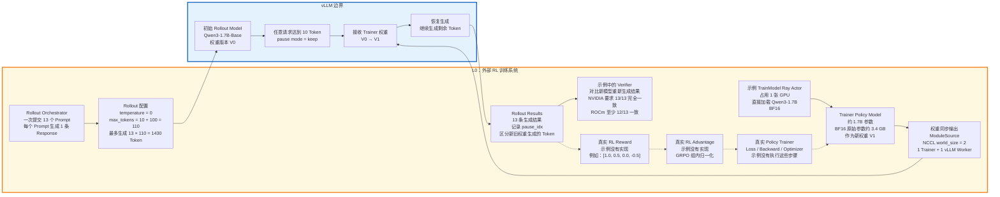
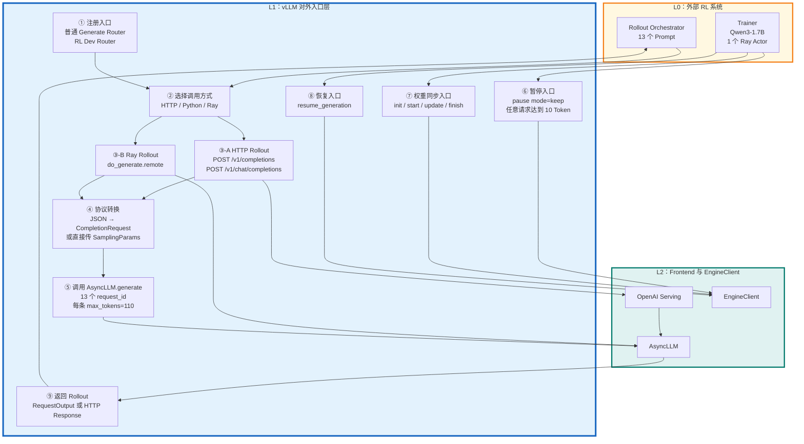

```mermaid
flowchart TB

    %% ==================== L0 ====================
    subgraph L0["L0：外部 RL 训练系统"]
        direction LR
        ORCH["Rollout Orchestrator<br/>verl / Prime-RL / NeMo-RL / 自研框架"]
        REWARD["Reward / Verifier"]
        ADV["Advantage 计算<br/>GAE / GRPO"]
        TRAINER["Policy Trainer<br/>Loss / Backward / Optimizer"]
        TRAINMODEL["Trainer Policy Model<br/>新版本模型参数"]

        ORCH --> REWARD
        REWARD --> ADV
        ADV --> TRAINER
        TRAINER --> TRAINMODEL
    end

    %% ==================== L1 ====================
    subgraph L1["L1：vLLM 对外入口层"]
        direction LR
        CHATAPI["Rollout API<br/>/v1/chat/completions"]
        COMPLETIONAPI["Rollout API<br/>/v1/completions"]
        RESPAPI["Rollout API<br/>/v1/responses"]
        PYAPI["Python API<br/>LLM.generate<br/>AsyncLLM.generate"]
        RLAPI["RL 控制 API<br/>/pause /resume<br/>/start_weight_update<br/>/update_weights<br/>/finish_weight_update"]
        SLEEPAPI["显存控制 API<br/>/sleep /wake_up"]
        RAYAPI["Ray Actor API<br/>RayVLLMWeightSyncClient"]
    end

    %% ==================== L2 ====================
    subgraph L2["L2：Frontend 与 Engine Client 层"]
        direction LR
        OPENAISERVE["OpenAI Serving<br/>协议解析 / Streaming"]
        RENDERER["Renderer / Tokenizer<br/>Chat Template"]
        INPUTPROC["InputProcessor<br/>输入校验 / Tokenize<br/>构造 EngineCoreRequest"]
        ASYNCLLM["AsyncLLM / LLMEngine<br/>EngineClient 实现"]
        OUTPUTPROC["OutputProcessor<br/>Detokenize / Logprobs"]
        COLLECTOR["RequestOutputCollector<br/>每请求输出队列"]
    end

    %% ==================== L3 ====================
    subgraph L3["L3：EngineCore 控制与调度层"]
        direction LR
        CORECLIENT["EngineCoreClient<br/>进程内或 ZeroMQ IPC"]
        ENGINECORE["EngineCore<br/>请求生命周期<br/>Utility RPC"]
        SCHEDULER["Scheduler<br/>Continuous Batching<br/>Token Budget / PauseState"]
        KVMANAGER["KV Cache Manager<br/>Block 分配 / Prefix Cache"]
        VERSION["Weight Version Manager<br/>当前提交版本"]
    end

    %% ==================== L4 ====================
    subgraph L4["L4：分布式 Executor 层"]
        direction LR
        EXECUTOR["Executor 抽象"]
        UNIPROC["UniProcExecutor"]
        MULTIPROC["MultiprocExecutor"]
        RAYEXEC["RayDistributedExecutor"]
        CRPC["collective_rpc<br/>向全部 Worker 广播"]
        WORKERGROUP["GPUWorker Group<br/>TP × PP × DP"]

        EXECUTOR --> UNIPROC
        EXECUTOR --> MULTIPROC
        EXECUTOR --> RAYEXEC
        CRPC --> WORKERGROUP
        UNIPROC --> WORKERGROUP
        MULTIPROC --> WORKERGROUP
        RAYEXEC --> WORKERGROUP
    end

    %% ==================== L5 ====================
    subgraph L5["L5：GPU Worker 与 ModelRunner 层"]
        direction LR
        GPUWORKER["GPUWorker<br/>每个分布式 Rank 一个"]
        MODELRUNNER["GPUModelRunner<br/>Batch 准备 / CUDA Graph"]
        FORWARD["Policy Model Forward"]
        ATTENTION["Attention Backend"]
        MOE["MoE / Expert Routing"]
        SAMPLER["Sampler<br/>Token / Logprobs"]
        RUNNEROUT["ModelRunnerOutput<br/>Token / Logprobs<br/>Routed Experts"]

        GPUWORKER --> MODELRUNNER
        MODELRUNNER --> FORWARD
        FORWARD --> ATTENTION
        FORWARD --> MOE
        ATTENTION --> SAMPLER
        MOE --> SAMPLER
        SAMPLER --> RUNNEROUT
    end

    %% ==================== L6 ====================
    subgraph L6["L6：GPU 状态与模型存储层"]
        direction LR
        POLICYMODEL["Inference Policy Model<br/>当前 Rollout 参数"]
        KVCACHE["GPU KV Cache"]
        PREFIXCACHE["Prefix Cache"]
        BLOCKTABLE["Block Tables"]
        ROUTECAPTURE["Routed Experts Capturer"]
        SLEEPBACKEND["SleepModeBackend<br/>默认 CuMemBackend"]
        MEMORY["GPU Memory Pool"]

        POLICYMODEL <--> KVCACHE
        KVCACHE <--> BLOCKTABLE
        KVCACHE <--> PREFIXCACHE
        POLICYMODEL --> ROUTECAPTURE
        SLEEPBACKEND <--> MEMORY
    end

    %% ==================== L7 ====================
    subgraph L7["L7：Trainer 侧权重传输层"]
        direction LR
        WEIGHTSOURCE["WeightSource<br/>ModuleSource / Sparse Patch<br/>Sharded Weight Groups"]
        TRAINFACTORY["WeightTransferTrainerFactory"]
        TRAINENGINE["TrainerWeightTransferEngine"]
        SYNCCLIENT["VLLMWeightSyncClient<br/>HTTP / Ray"]
        DATAPLANE["模型张量数据面<br/>NCCL / CUDA IPC / NIXL RDT"]

        WEIGHTSOURCE --> TRAINFACTORY
        TRAINFACTORY --> TRAINENGINE
        TRAINENGINE --> SYNCCLIENT
        TRAINENGINE --> DATAPLANE
    end

    %% ==================== L8 ====================
    subgraph L8["L8：vLLM Worker 权重接收层"]
        direction LR
        WTCONFIG["WeightTransferConfig<br/>选择 Backend"]
        WORKFACTORY["WeightTransferEngineFactory"]
        WTSESSION["Weight Update Session<br/>Inactive / Active"]
        NCCLENGINE["NCCLWeightTransferEngine"]
        IPCENGINE["IPCWeightTransferEngine"]
        SPARSEENGINE["SparseNCCLWeightTransferEngine"]
        RDTENGINE["ShardedRDTWeightTransferEngine"]
        LAYERRELOAD["Layerwise Reload<br/>接收 / 转换 / 恢复 Storage"]
        COMMIT["finish_weight_update<br/>提交 Weight Version"]

        WTCONFIG --> WORKFACTORY
        WORKFACTORY --> NCCLENGINE
        WORKFACTORY --> IPCENGINE
        WORKFACTORY --> SPARSEENGINE
        WORKFACTORY --> RDTENGINE
        WTSESSION --> WORKFACTORY
        NCCLENGINE --> LAYERRELOAD
        IPCENGINE --> LAYERRELOAD
        SPARSEENGINE --> LAYERRELOAD
        RDTENGINE --> LAYERRELOAD
        LAYERRELOAD --> COMMIT
    end

    %% ==================== Rollout 主路径 ====================
    ORCH -->|"Prompt + SamplingParams"| CHATAPI
    ORCH --> COMPLETIONAPI
    ORCH --> RESPAPI
    ORCH --> PYAPI

    CHATAPI --> OPENAISERVE
    COMPLETIONAPI --> OPENAISERVE
    RESPAPI --> OPENAISERVE
    PYAPI --> ASYNCLLM

    OPENAISERVE --> RENDERER
    RENDERER --> INPUTPROC
    INPUTPROC --> ASYNCLLM
    ASYNCLLM --> CORECLIENT

    CORECLIENT --> ENGINECORE
    ENGINECORE --> SCHEDULER
    SCHEDULER <--> KVMANAGER
    SCHEDULER --> EXECUTOR

    WORKERGROUP --> GPUWORKER
    MODELRUNNER --> POLICYMODEL
    ATTENTION <--> KVCACHE
    MOE --> ROUTECAPTURE

    RUNNEROUT --> SCHEDULER
    SCHEDULER --> ENGINECORE
    ENGINECORE --> CORECLIENT
    CORECLIENT --> OUTPUTPROC
    OUTPUTPROC --> COLLECTOR
    COLLECTOR --> OPENAISERVE
    OPENAISERVE -->|"Rollout Result"| ORCH

    %% ==================== 控制路径 ====================
    ORCH -->|"Pause / Resume"| RLAPI
    ORCH -->|"Sleep / Wake"| SLEEPAPI
    RLAPI --> ASYNCLLM
    SLEEPAPI --> ASYNCLLM
    ASYNCLLM --> CRPC
    GPUWORKER --> SLEEPBACKEND

    %% ==================== 权重更新路径 ====================
    TRAINMODEL --> WEIGHTSOURCE
    SYNCCLIENT --> RLAPI
    SYNCCLIENT --> RAYAPI
    RAYAPI --> ASYNCLLM

    DATAPLANE --> NCCLENGINE
    DATAPLANE --> IPCENGINE
    DATAPLANE --> SPARSEENGINE
    DATAPLANE --> RDTENGINE

    CRPC --> WTSESSION
    COMMIT --> VERSION
    COMMIT --> POLICYMODEL

    %% ==================== 每层外框样式 ====================
    style L0 fill:#FFF8E1,stroke:#F57F17,stroke-width:3px
    style L1 fill:#E3F2FD,stroke:#1565C0,stroke-width:3px
    style L2 fill:#E8EAF6,stroke:#3949AB,stroke-width:3px
    style L3 fill:#E0F2F1,stroke:#00796B,stroke-width:3px
    style L4 fill:#F3E5F5,stroke:#7B1FA2,stroke-width:3px
    style L5 fill:#FCE4EC,stroke:#C2185B,stroke-width:3px
    style L6 fill:#FFEBEE,stroke:#C62828,stroke-width:3px
    style L7 fill:#F1F8E9,stroke:#558B2F,stroke-width:3px
    style L8 fill:#FFF3E0,stroke:#EF6C00,stroke-width:3px
```

图中有三条主要路径：

-   Rollout 路径：`L0 → L1 → L2 → L3 → L4 → L5 → L6 → 原路返回`
-   控制路径：`RL API → AsyncLLM → EngineCore/collective_rpc → GPUWorker`
-   权重同步路径：`L0 Trainer → L7 → L1/L2 控制面 + 数据面 → L8 → L6 Policy Model`


```python
NCCLTrainerWeightTransferEngine.send_weights()
│
├── 1. HTTPVLLMWeightSyncClient.start_weight_update()
│   └── 通知所有 Worker：开始权重更新会话
│
├── 2. 并发执行权重更新
│   │
│   ├── 控制流：ThreadPoolExecutor线程
│   │   └── HTTPVLLMWeightSyncClient.update_weights(update_info)
│   │       │
│   │       ├── POST /update_weights
│   │       │
│   │       └── api_router.update_weights()
│   │           │
│   │           └── AsyncLLM.update_weights()
│   │               │
│   │               └── AsyncLLM.collective_rpc("update_weights")
│   │                   │
│   │                   └── AsyncMPClient.collective_rpc_async()
│   │                       │
│   │                       ├── 编码为UTILITY消息
│   │                       ├── ZMQ发送
│   │                       ▼
│   │                   真正的 EngineCore
│   │                       │
│   │                       └── EngineCore.collective_rpc()
│   │                           │
│   │                           └── model_executor.collective_rpc()
│   │                               │
│   │                               ├── Multiproc：消息队列
│   │                               ├── Ray：Ray RPC
│   │                               └── UniProc：直接调用
│   │                                   │
│   │                                   ▼
│   │                             所有 GPU Worker
│   │                                   │
│   │                                   └── Worker.update_weights()
│   │                                       │
│   │                                       └── weight_transfer_engine
│   │                                           .update_weights()
│   │                                           │
│   │                                           ├── 解析 update_info
│   │                                           └── receive_weights()
│   │                                               │
│   │                                               ├── packed模式
│   │                                               │   └── packed NCCL接收
│   │                                               │       └── model.load_weights()
│   │                                               │
│   │                                               └── 非packed模式
│   │                                                   ├── torch.empty()
│   │                                                   ├── NCCL broadcast接收
│   │                                                   └── model.load_weights()
│   │
│   └── 数据流：Trainer主线程
│       └── self._broadcast(source, meta)
│           │
│           ├── 从训练模型读取权重
│           └── NCCL broadcast发送真实张量
│                       │
│                       └──────────────→ GPU Worker.receive_weights()
│
├── 3. future.result()
│   └── 等待所有 Worker 接收并加载完成
│
└── 4. HTTPVLLMWeightSyncClient.finish_weight_update()
    └── 通知所有 Worker：结束权重更新会话
```

```
NCCLTrainerWeightTransferEngine.send_weights()
│
├── RPC控制流：发送元数据
│   │
│   ├── 构造 update_info
│   │   ├── names
│   │   │   ├── "linear.weight"
│   │   │   └── "linear.bias"
│   │   ├── dtype_names
│   │   │   └── "float16"
│   │   └── shapes
│   │       ├── [2, 2]
│   │       └── [2]
│   │
│   └── client.update_weights(update_info)
│       └── HTTP /update_weights
│           └── AsyncLLM
│               └── ZMQ
│                   └── EngineCore
│                       └── Executor.collective_rpc()
│                           └── GPUWorker.update_weights()
│                               └── receive_weights(update_info)
│
└── NCCL数据流：传输真实权重
    │
    ├── packed模式
    │   │
    │   ├── Trainer
    │   │   ├── 读取多个权重Tensor
    │   │   ├── 打包进大Buffer
    │   │   └── NCCL broadcast(Buffer)
    │   │
    │   └── Worker
    │       ├── NCCL接收Buffer
    │       ├── 根据name/dtype/shape拆包
    │       └── model.load_weights()
    │
    └── 非packed模式
        │
        ├── Trainer
        │   └── 逐个Tensor执行NCCL broadcast
        │
        └── Worker
            ├── 根据shape/dtype执行torch.empty()
            ├── NCCL接收一个Tensor
            ├── model.load_weights()
            └── 继续接收下一个Tensor
RPC传输
└── name + dtype + shape

NCCL传输
└── 真实权重数值
```


# 第一层

这里的“第一层”指总图中的 `L0：外部 RL 训练系统`。它逻辑上不属于 vLLM 核心，但负责调用 vLLM、消费 rollout、训练模型，再把新参数同步回 vLLM。

当前仓库示例并没有真正执行 PPO/GRPO，而是用一个已经训练好的模型模拟“Optimizer 更新后的新权重”。

## 1. 第一层带数值展开

实线是仓库示例真实执行的路径，虚线是真实 GRPO/PPO 系统需要补充的路径。

-   weight swap: vLLM performs a hot update from V0 to V1.
-   weight update: `/start_weight_update`、`/update_weights`、`/finish_weight_update`
-   weight synchronization / weight sync: 强调 Trainer 把新权重同步到 inference engine。这个示例官方描述也是 “native weight syncing APIs”。




## 2. Rollout Orchestrator：13 个并发请求

示例定义了 13 个 Prompt：

```
PROMPTS = [
    "The president of the United States is",
    "The capital of France is",
    ...
    "DNA stands for deoxyribonucleic acid and it",
]
```

对应代码：[rlhf_async_new_apis.py (line 217)](/data/home/xli49/lxy/vllm/examples/rl/rlhf_async_new_apis.py:217)

然后为每个 Prompt 创建一个异步 Ray 调用：

```
gen_futures = [
    llm.do_generate.remote(ptids, sampling_params)
    for ptids in batch_prompt_token_ids
]
```

对应代码：[rlhf_async_new_apis.py (line 258)](/data/home/xli49/lxy/vllm/examples/rl/rlhf_async_new_apis.py:258)

所以这里的数值是：

-   Prompt 数量：13
-   每个 Prompt 生成数量：默认 `n=1`
-   总 rollout 数量：`13 × 1 = 13`
-   13 条请求并发提交，不是一条执行完再执行下一条

实际工业 GRPO 通常会对每个 Prompt 生成多条结果。例如：

```
Prompt batch size = 128
每个 Prompt 生成 G = 8 条 Response
每轮 Rollout 数 = 128 × 8 = 1024
```

当前示例只是最小化演示，`G=1`，因此不能直接计算 GRPO 的组内相对 advantage。

## 3. Rollout 参数：每条最多生成 110 Token

代码中：

```
PAUSE_TOKEN_THRESHOLD = 10
N_NEW_TOKENS = 100

sampling_params = SamplingParams(
    temperature=0,
    max_tokens=PAUSE_TOKEN_THRESHOLD + N_NEW_TOKENS,
)
```

对应位置：

-   [rlhf_async_new_apis.py (line 63)](/data/home/xli49/lxy/vllm/examples/rl/rlhf_async_new_apis.py:63)
-   [rlhf_async_new_apis.py (line 245)](/data/home/xli49/lxy/vllm/examples/rl/rlhf_async_new_apis.py:245)
-   [rlhf_async_new_apis.py (line 254)](/data/home/xli49/lxy/vllm/examples/rl/rlhf_async_new_apis.py:254)

代入数值：

```
max_tokens = 10 + 100 = 110
```

因此理论最大生成量：

```
13 个 Prompt × 110 Token = 1430 个生成 Token
```

`temperature=0` 表示贪心生成，主要用于保证更新前后结果能够确定性比较。真实 RL rollout 通常不会设成零，例如可能使用：

```
SamplingParams(
    temperature=1.0,
    top_p=0.95,
    max_tokens=1024,
    logprobs=1,
)
```

因为 RL 需要从当前策略分布中采样，而不是永远选择概率最大的 token。

## 4. 为什么在 10 Token 时暂停

每个请求在流式生成期间统计已经生成的 token：

```
cur_token_count = len(output.outputs[0].token_ids)

if cur_token_count >= PAUSE_TOKEN_THRESHOLD:
    self._request_pause_flag = True
```

对应代码：[rlhf_async_new_apis.py (line 99)](/data/home/xli49/lxy/vllm/examples/rl/rlhf_async_new_apis.py:99)

任意一条请求达到 10 个 token 后：

```
await super().pause_generation(mode="keep")
```

对应代码：[rlhf_async_new_apis.py (line 111)](/data/home/xli49/lxy/vllm/examples/rl/rlhf_async_new_apis.py:111)

假设某条请求最后记录到：

```
pause_idx = 10
总输出长度 = 110
```

那么它的输出被划分为：

```
Token 0～9：旧权重 V0 生成，共 10 个
Token 10～109：新权重 V1 生成，共 100 个
```

但实际 `pause_idx` 不一定严格等于 10。因为请求是并发和分批执行的，pause 命令生效前可能又完成了一次 decode。例如：

```
请求 A：pause_idx = 10
请求 B：pause_idx = 12
请求 C：pause_idx = 9
```

代码因此为每个请求单独记录 `pause_idx`，而不是假设所有请求都是 10。

## 5. Reward / Verifier：示例只有验证，没有奖励

当前示例没有 Reward Model，也没有类似下面的逻辑：

```
reward = reward_model(prompt, response)
```

它使用“新鲜启动的 V2 模型是否能生成相同后缀”作为正确性验证：

```
expected = output.outputs[0].token_ids[pause_idx:]
actual = val_output.outputs[0].token_ids
match = actual == expected
```

对应代码：[rlhf_async_new_apis.py (line 316)](/data/home/xli49/lxy/vllm/examples/rl/rlhf_async_new_apis.py:316)

验证门槛为：

```
MIN_PASS_RATE = 1.0 if not current_platform.is_rocm() else 0.9
```

代入 13 个 Prompt：

-   NVIDIA：必须 `13/13 = 100%`
-   ROCm：至少需要 `12/13 ≈ 92.31%`
-   `11/13 ≈ 84.62%`，达不到 90%，会失败

这个 verifier 只是测试权重热更新是否正确，不是 RL reward。

## 6. Advantage：真实 GRPO 如何代入数值

假设真实 GRPO 对同一个 Prompt 生成 4 条结果，Reward 分别为：

```
r = [1.0, 0.5, 0.0, -0.5]
```

组内平均值：

```
mean = (1.0 + 0.5 + 0.0 - 0.5) / 4
     = 0.25
```

组内标准差：

```
std ≈ 0.559
```

GRPO 风格的归一化 advantage：

```
A_i = (r_i - mean) / std
```

代入后：

| Response | Reward | Advantage |
| -------- | ------ | --------- |
| 1        | 1.0    | 1.342     |
| 2        | 0.5    | 0.447     |
| 3        | 0.0    | -0.447    |
| 4        | -0.5   | -1.342    |

Reward:

>   How much score this response receives on its own. 这条回答本身得了多少分。

 Advantage:

>   How much better or worse this response is compared with other responses in the same group.

含义是：

-   `A > 0`：增加这些 token 的生成概率
-   `A < 0`：降低这些 token 的生成概率
-   这一步发生在外部 Trainer，不在 vLLM 内

## 7. Trainer：当前示例没有真正训练

示例中的 Trainer 是：

```
@ray.remote(num_gpus=1)
class TrainModel:
    ...
```

它占用 1 张 GPU，并直接加载：

```
self.model = AutoModelForCausalLM.from_pretrained(
    "Qwen/Qwen3-1.7B",
    dtype=torch.bfloat16,
).to("cuda:0")
```

对应代码：[rlhf_async_new_apis.py (line 120)](/data/home/xli49/lxy/vllm/examples/rl/rlhf_async_new_apis.py:120)

因此示例的真实情况是：

```
vLLM 初始模型 V0：Qwen/Qwen3-1.7B-Base
Trainer 模型 V1：Qwen/Qwen3-1.7B
```

它没有执行：

```
loss.backward()
optimizer.step()
optimizer.zero_grad()
```

而是直接把 `Qwen3-1.7B` 当成“已经完成训练的新版本参数”。

对于约 17 亿参数、BF16 每参数 2 字节，单纯参数大小粗略为：

```
1.7 × 10⁹ × 2 bytes
= 3.4 × 10⁹ bytes
≈ 3.4 GB
≈ 3.17 GiB
```

实际显存还会包含：

-   临时通信 Buffer
-   CUDA/NCCL 状态
-   模型 Buffer
-   推理侧 KV Cache
-   真实训练时的梯度和 Optimizer State

所以真实训练显存会远大于 3.17 GiB。

## 8. 第一层最后输出什么

Trainer 模型通过：

```
source=ModuleSource(self.model)
```

变成可枚举的模型权重源，然后：

```
self.engine.send_weights()
```

触发权重同步。

示例数值：

```
Trainer Rank = 0
Trainer GPU = 1 张
vLLM Worker = 1 个
NCCL world_size = 2
packed = True
backend = nccl
```

代码位置：[rlhf_async_new_apis.py (line 138)](/data/home/xli49/lxy/vllm/examples/rl/rlhf_async_new_apis.py:138)

完整第一层的数据关系可以概括为：

```
13 个 Prompt
    ↓
最多 13 条 × 110 Token 的 Rollout
    ↓
示例：只验证结果，不计算 Reward
真实 RL：Reward → Advantage → Loss
    ↓
Optimizer 更新 Trainer Policy
    ↓
得到新模型参数 V1
    ↓
ModuleSource + NCCL
    ↓
同步给 vLLM
```

所以第一层真正更新的是“Trainer 里的模型参数”，不是 vLLM 内部的数据集。vLLM 生成 rollout 数据并接收训练完成后的新权重。


# 第二层

## 总结

第二层 `L1：vLLM 对外入口层` 负责把外部 RL 系统的操作转换成 vLLM 内部方法调用。

它有两条主链：

```python
外部系统
├── HTTP 入口 ─────→ OpenAI Serving ─→ AsyncLLM
├── Python 入口 ───→ AsyncLLM/LLMEngine
└── Ray 入口 ──────→ Ray Actor ──────→ AsyncLLM

| 场景 | 推荐入口 |
|---|---|
| 本机测试、单进程验证 | Python |
| Trainer 和 vLLM 在同一个 Ray 集群 | Ray |
| Trainer 和 vLLM 独立部署 | HTTP |
| 对外提供标准推理服务 | HTTP / Ray Serve |
| 内部大规模在线 RL | Ray，或者 HTTP 服务加内部控制面 |


控制方式也不同
Python
await engine.pause_generation(mode="keep")
await engine.start_weight_update()
await engine.update_weights(request)
await engine.finish_weight_update()
await engine.resume_generation()
Ray
ray.get(engine.pause_generation.remote(mode="keep"))
ray.get(engine.start_weight_update.remote())
ray.get(engine.update_weights.remote(request))
ray.get(engine.finish_weight_update.remote())
ray.get(engine.resume_generation.remote())
HTTP
POST /pause?mode=keep
POST /start_weight_update
POST /update_weights
POST /finish_weight_update
POST /resume
三者调用的是同一组底层方法，只是传输方式不同。
```

```
Rollout 链： Rollout 链处理“单个推理请求”，目标是生成 Token。
Prompt
→ HTTP / Python / Ray 入口
→ OpenAI Serving 或 AsyncLLM.generate
→ 第三层请求处理

控制链：控制链操作“整个推理引擎”，目标是安全地切换模型状态。
Trainer
→ pause / 权重同步 / resume
→ EngineClient
→ 第三层 EngineCore 和所有 GPUWorker
```

当前异步示例的完整过程是：

```
13 个 Prompt
→ 13 次 Ray do_generate.remote()
→ 每条最多生成 110 Token
→ 任意请求达到 10 Token
→ pause(mode="keep")
→ NCCL 同步 Trainer 新权重
→ resume
→ 继续生成剩余 Token
```

第二层只负责“接请求、转换协议、调用引擎”，不执行模型 Forward，也不计算 Reward。

## 第二层完整串联图



## 第一步：启动时注册入口

API Server 启动后注册普通服务路由：

```
register_vllm_serve_api_routers(app)

if "generate" in supported_tasks:
    register_generate_api_routers(app)
```

如果启用了开发模式，再注册 RL 控制接口：

```
if envs.VLLM_SERVER_DEV_MODE:
    register_vllm_dev_api_routers(app)
```

代码：[routers.py (line 17)](/data/home/xli49/lxy/vllm/vllm/entrypoints/launchers/api_server/routers.py:17)

启动示例：

```
VLLM_SERVER_DEV_MODE=1 \
vllm serve facebook/opt-125m \
  --tensor-parallel-size 2 \
  --device-ids 0,1 \
  --weight-transfer-config '{"backend":"nccl"}' \
  --enable-sleep-mode \
  --port 8000
```

启动后得到两类入口：

```
普通 Rollout：
POST /v1/completions
POST /v1/chat/completions

RL 控制：
POST /pause
POST /resume
POST /init_weight_transfer_engine
POST /start_weight_update
POST /update_weights
POST /finish_weight_update
POST /sleep
POST /wake_up
```

## 第二步：外部系统提交 Prompt

异步 RL 示例有 13 个 Prompt：

```
PROMPTS = [
    "The president of the United States is",
    "The capital of France is",
    ...
]  # 13 个
```

代码：[rlhf_async_new_apis.py (line 217)](/data/home/xli49/lxy/vllm/examples/rl/rlhf_async_new_apis.py:217)

生成参数：

```
PAUSE_TOKEN_THRESHOLD = 10
N_NEW_TOKENS = 100

sampling_params = SamplingParams(
    temperature=0,
    max_tokens=PAUSE_TOKEN_THRESHOLD + N_NEW_TOKENS,
)
```

数值：

```
每条最大输出 = 10 + 100 = 110 Token
请求数 = 13
理论最大输出 = 13 × 110 = 1430 Token
```

## 第三步：选择 HTTP 或 Ray 入口

### 路径 A：Ray 入口

当前异步示例实际使用：

```
gen_futures = [
    llm.do_generate.remote(ptids, sampling_params)
    for ptids in batch_prompt_token_ids
]
```

代码：[rlhf_async_new_apis.py (line 258)](/data/home/xli49/lxy/vllm/examples/rl/rlhf_async_new_apis.py:258)

因此产生：

```
13 个 Prompt
→ 13 次 do_generate.remote()
→ 13 个异步 Future
```

每个 Ray 调用内部执行：

```
async for request_output in self.generate(
    {"prompt_token_ids": prompt_token_ids},
    sampling_params,
    request_id=str(uuid.uuid4()),
):
    ...
```

代码：[rlhf_async_new_apis.py (line 83)](/data/home/xli49/lxy/vllm/examples/rl/rlhf_async_new_apis.py:83)

这一条不经过 HTTP：

```
Ray Actor
→ MyLLM.do_generate
→ AsyncLLM.generate
```

### 路径 B：HTTP 入口

Completion 路由：

```
@router.post("/v1/completions")
async def create_completion(
    request: CompletionRequest,
    raw_request: Request,
):
    generator = await handler.create_completion(request, raw_request)
```

代码：[completion/api_router.py (line 35)](/data/home/xli49/lxy/vllm/vllm/entrypoints/openai/completion/api_router.py:35)

请求示例：

```
{
  "model": "Qwen/Qwen3-1.7B-Base",
  "prompt": "The capital of France is",
  "temperature": 0,
  "max_tokens": 110,
  "logprobs": 1
}
```

调用链：

```
HTTP JSON
→ CompletionRequest
→ OpenAIServingCompletion
→ SamplingParams
→ AsyncLLM.generate
```

## 第四步：进入统一的 `AsyncLLM.generate`

无论来自 HTTP 还是 Ray，最终都会进入：

```
async def generate(
    self,
    prompt,
    sampling_params,
    request_id,
    ...
) -> AsyncGenerator[RequestOutput, None]:
```

代码：[async_llm.py (line 655)](/data/home/xli49/lxy/vllm/vllm/v1/engine/async_llm.py:655)

对于当前示例：

```
generate 调用次数 = 13
request_id 数量 = 13
每个 request_id 都是 UUID
每个请求 max_tokens = 110
temperature = 0
```

`generate()` 接下来会做三件事：

```
① add_request()
② 等待后台 output_handler 写入结果
③ 不断 yield RequestOutput
```

代码中的核心调用：

```
q = await self.add_request(
    request_id,
    prompt,
    sampling_params,
    ...
)
```

这就是第二层进入下一层的边界：

```
L1 入口层
→ AsyncLLM.add_request()
→ L2 InputProcessor
```

## 第五步：生成 10 Token 后发起 Pause

每个请求检查当前生成长度：

```
cur_token_count = len(output.outputs[0].token_ids)

if cur_token_count >= PAUSE_TOKEN_THRESHOLD:
    self._request_pause_flag = True
```

代码：[rlhf_async_new_apis.py (line 99)](/data/home/xli49/lxy/vllm/examples/rl/rlhf_async_new_apis.py:99)

阈值：

```
PAUSE_TOKEN_THRESHOLD = 10
```

任意一个请求达到 10 Token 后：

```
await super().pause_generation(mode="keep")
```

调用链：

```
MyLLM.pause_after_n_tokens
→ AsyncLLM.pause_generation(mode="keep")
→ EngineCoreClient.pause_scheduler_async
→ 第三层 EngineCore
```

`keep` 表示不删除请求：

```
13 个请求中未完成的请求
→ 保留 Request State
→ 暂停调度
→ 更新权重后继续
```

## 第六步：同步权重

Trainer 使用：

```
client=RayVLLMWeightSyncClient(llm_handle)
```

代码：[rlhf_async_new_apis.py (line 138)](/data/home/xli49/lxy/vllm/examples/rl/rlhf_async_new_apis.py:138)

调用：

```
self.engine.send_weights()
```

会串联：

```
start_weight_update
→ update_weights
→ finish_weight_update
```

Ray Client 内部：

```
ray.get([
    h.start_weight_update.remote()
    for h in self.handles
])
```

代码：[clients.py (line 96)](/data/home/xli49/lxy/vllm/vllm/distributed/weight_transfer/clients.py:96)

当前只有一个 vLLM Actor：

```
handle 数量 = 1
每个控制阶段 = 1 次 Ray remote
```

因此控制调用大致为：

```
初始化：
init_weight_transfer_engine    1 次

本轮同步：
start_weight_update            1 次
update_weights                 1～N 次
finish_weight_update           1 次
```

真正模型 Tensor 通过 NCCL 传输，不经过 Ray 序列化。

## 第七步：恢复生成

权重同步完成后：

```
ray.get(llm.resume_generation.remote())
```

代码：[rlhf_async_new_apis.py (line 264)](/data/home/xli49/lxy/vllm/examples/rl/rlhf_async_new_apis.py:264)

调用链：

```
Ray remote
→ AsyncLLM.resume_generation
→ EngineCoreClient.resume_scheduler_async
→ Scheduler 恢复调度
```

假设某个请求准确在 10 Token 时暂停：

```
前 10 Token：旧权重 Qwen3-1.7B-Base
后 100 Token：新权重 Qwen3-1.7B
总计：110 Token
```

由于异步调度，实际可能是：

```
请求 A：旧权重 10 Token，新权重 100 Token
请求 B：旧权重 12 Token，新权重 98 Token
请求 C：旧权重 9 Token，新权重 101 Token
```

所以代码为每个请求单独记录 `pause_idx`。

## 第八步：结果返回第一层

`AsyncLLM.generate()` 不断返回：

```
yield request_output
```

每条 `RequestOutput` 包含：

```
request_id
prompt_token_ids
outputs[].token_ids
outputs[].text
outputs[].logprobs
finish_reason
finished
```

13 个 Future 最后统一等待：

```
results = ray.get(gen_futures)
```

因此第二层完整串联为：

```
13 个 Prompt
→ 13 次 Ray remote
→ 13 次 AsyncLLM.generate
→ 任意请求达到 10 Token
→ pause keep
→ start/update/finish 权重同步
→ resume
→ 收集 13 个 RequestOutput
→ 返回第一层计算 Reward
```


## Trainer

这四种 Engine 解决的都是“Trainer 如何把新权重交给 vLLM”，区别主要在数据传输方式。

| Engine      | 传输方式            | 传什么                     | 适用场景                       |
| ----------- | ------------------- | -------------------------- | ------------------------------ |
| NCCL        | NCCL Broadcast      | 完整模型权重               | Trainer 和 vLLM 使用不同 GPU   |
| IPC         | CUDA IPC 共享显存   | 显存句柄                   | Trainer 和 vLLM 共用同一张 GPU |
| Sparse NCCL | NCCL Broadcast      | 变化位置和新值             | 只有少量参数发生变化           |
| Sharded RDT | NIXL/Ray 点对点拉取 | 每个 Worker 所需的参数分片 | 超大模型、MoE、多机 EP         |

### 1. NCCL Engine

```
backend="nccl"
```

实现：

[nccl_engine.py (line 237)](/data/home/xli49/lxy/vllm/vllm/distributed/weight_transfer/nccl_engine.py:237)

传输结构：

```
Trainer GPU
   │ NCCL broadcast
   ├── vLLM GPU 0
   ├── vLLM GPU 1
   └── vLLM GPU N
```

特点：

-   发送完整 checkpoint 权重。
-   支持跨 GPU、跨机器。
-   支持 TP/DP 推理。
-   每个 Worker 收到权重后，通过 `model.load_weights()` 提取自己的 TP 分片。
-   `packed=True` 会把小参数打包到大 buffer，提高传输效率。

你运行的 `rlhf_http_nccl.py` 就是这种。

适合：

```
GPU 0、1：vLLM
GPU 2：Trainer
```

这是目前最通用、最容易理解的方案。

### 2. IPC Engine

```
backend="ipc"
```

实现：

[ipc_engine.py (line 252)](/data/home/xli49/lxy/vllm/vllm/distributed/weight_transfer/ipc_engine.py:252)

传输结构：

```
同一张 GPU
├── Trainer 进程持有权重
└── vLLM 进程通过 CUDA IPC 访问权重
```

Trainer 不通过网络复制完整张量，而是把 CUDA IPC 显存句柄交给 vLLM：

```
Trainer → IPC handle → vLLM
```

特点：

-   传输层基本不复制权重数据。
-   延迟和带宽开销很低。
-   只能用于同一机器、同一组共置 GPU。
-   Trainer 和 vLLM 会争抢显存，通常配合 sleep/wake。
-   HTTP 模式需要不安全的 pickle 序列化，因此必须处于可信环境。

适合：

```
GPU 0 同时运行 Trainer 和 vLLM
```

### 3. Sparse NCCL Engine

```
backend="sparse_nccl"
```

实现：

[sparse_nccl_engine.py (line 193)](/data/home/xli49/lxy/vllm/vllm/distributed/weight_transfer/sparse_nccl_engine.py:193)

它不发送完整权重，只发送变化的位置：

```
SparseWeightPatch(
    name="model.layers.0.mlp.weight",
    indices=changed_indices,
    values=new_values,
    full_shape=parameter_shape,
)
```

传输内容：

```
参数名称
变化元素的下标
变化后的值
完整参数形状
```

如果一个 1 亿参数的模型只有 1% 参数变化：

```
NCCL：发送约 1 亿个参数
Sparse NCCL：发送约 100 万个参数及下标
```

特点：

-   通信量是 `O(nnz)`，即变化元素数量。
-   直接在已有参数上原地修改。
-   不需要 `ModuleSource`。
-   调用方式是：

```
engine.send_weights(patches)
```

-   普通 RL 的 optimizer 通常会改变绝大多数参数，因此不一定适合。
-   更适合稀疏专家更新、局部参数更新和实验性增量更新。

### 4. Sharded RDT Engine

```
backend="sharded_rdt"
```

实现：

[sharded_rdt_trainer.py (line 800)](/data/home/xli49/lxy/vllm/vllm/distributed/weight_transfer/sharded_rdt_trainer.py:800)

与 NCCL 广播不同，它是 Worker 主动拉取：

```
vLLM Worker 0 → 只拉取自己需要的分片
vLLM Worker 1 → 只拉取自己需要的分片
vLLM Worker 2 → 只拉取自己负责的专家
```

例如 MoE 有 8 个 Worker：

```
NCCL：
每个 Worker 都接收完整 checkpoint，再挑出自己的部分

Sharded RDT：
每个 Worker 只传输自己负责的专家和参数分片
```

特点：

-   使用 NIXL 和 Ray Direct Transport。
-   面向多机、大模型、MoE、Expert Parallel。
-   支持 Trainer 本身也是 FSDP/PP/EP 分片状态。
-   按层 gather、传输和释放，控制峰值显存。
-   要求 Ray Executor、Ray 2.56+ 和 NIXL。
-   权重 Loader 必须属于受支持的操作集合。
-   配置和部署复杂度最高。

### 怎么选择

你现在的场景：

```
Trainer 在 GPU 2
vLLM 在 GPU 0、1
模型是 OPT-125M
```

直接选择：

```
backend="nccl"
```

一般选择规则：

```
不同 GPU，普通 Dense 模型     → NCCL
同一 GPU 共置                 → IPC
只更新少量参数                → Sparse NCCL
超大 MoE、多机、EP 分片       → Sharded RDT
```

HTTP 或 Ray 与这四种 Engine 是两个维度：

```
HTTP / Ray：控制面，发送开始、结束、参数元数据
NCCL / IPC / Sparse / RDT：数据面，真正移动权重张量
```


