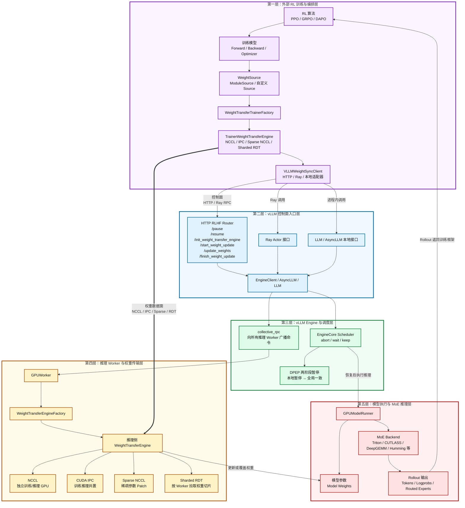

```mermaid
flowchart TB

    %% ==================== L0 ====================
    subgraph L0["L0：外部 RL 训练系统"]
        direction LR
        ORCH["Rollout Orchestrator<br/>verl / Prime-RL / NeMo-RL / 自研框架"]
        REWARD["Reward / Verifier"]
        ADV["Advantage 计算<br/>GAE / GRPO"]
        TRAINER["Policy Trainer<br/>Loss / Backward / Optimizer"]
        TRAINMODEL["Trainer Policy Model<br/>新版本模型参数"]

        ORCH --> REWARD
        REWARD --> ADV
        ADV --> TRAINER
        TRAINER --> TRAINMODEL
    end

    %% ==================== L1 ====================
    subgraph L1["L1：vLLM 对外入口层"]
        direction LR
        CHATAPI["Rollout API<br/>/v1/chat/completions"]
        COMPLETIONAPI["Rollout API<br/>/v1/completions"]
        RESPAPI["Rollout API<br/>/v1/responses"]
        PYAPI["Python API<br/>LLM.generate<br/>AsyncLLM.generate"]
        RLAPI["RL 控制 API<br/>/pause /resume<br/>/start_weight_update<br/>/update_weights<br/>/finish_weight_update"]
        SLEEPAPI["显存控制 API<br/>/sleep /wake_up"]
        RAYAPI["Ray Actor API<br/>RayVLLMWeightSyncClient"]
    end

    %% ==================== L2 ====================
    subgraph L2["L2：Frontend 与 Engine Client 层"]
        direction LR
        OPENAISERVE["OpenAI Serving<br/>协议解析 / Streaming"]
        RENDERER["Renderer / Tokenizer<br/>Chat Template"]
        INPUTPROC["InputProcessor<br/>输入校验 / Tokenize<br/>构造 EngineCoreRequest"]
        ASYNCLLM["AsyncLLM / LLMEngine<br/>EngineClient 实现"]
        OUTPUTPROC["OutputProcessor<br/>Detokenize / Logprobs"]
        COLLECTOR["RequestOutputCollector<br/>每请求输出队列"]
    end

    %% ==================== L3 ====================
    subgraph L3["L3：EngineCore 控制与调度层"]
        direction LR
        CORECLIENT["EngineCoreClient<br/>进程内或 ZeroMQ IPC"]
        ENGINECORE["EngineCore<br/>请求生命周期<br/>Utility RPC"]
        SCHEDULER["Scheduler<br/>Continuous Batching<br/>Token Budget / PauseState"]
        KVMANAGER["KV Cache Manager<br/>Block 分配 / Prefix Cache"]
        VERSION["Weight Version Manager<br/>当前提交版本"]
    end

    %% ==================== L4 ====================
    subgraph L4["L4：分布式 Executor 层"]
        direction LR
        EXECUTOR["Executor 抽象"]
        UNIPROC["UniProcExecutor"]
        MULTIPROC["MultiprocExecutor"]
        RAYEXEC["RayDistributedExecutor"]
        CRPC["collective_rpc<br/>向全部 Worker 广播"]
        WORKERGROUP["GPUWorker Group<br/>TP × PP × DP"]

        EXECUTOR --> UNIPROC
        EXECUTOR --> MULTIPROC
        EXECUTOR --> RAYEXEC
        CRPC --> WORKERGROUP
        UNIPROC --> WORKERGROUP
        MULTIPROC --> WORKERGROUP
        RAYEXEC --> WORKERGROUP
    end

    %% ==================== L5 ====================
    subgraph L5["L5：GPU Worker 与 ModelRunner 层"]
        direction LR
        GPUWORKER["GPUWorker<br/>每个分布式 Rank 一个"]
        MODELRUNNER["GPUModelRunner<br/>Batch 准备 / CUDA Graph"]
        FORWARD["Policy Model Forward"]
        ATTENTION["Attention Backend"]
        MOE["MoE / Expert Routing"]
        SAMPLER["Sampler<br/>Token / Logprobs"]
        RUNNEROUT["ModelRunnerOutput<br/>Token / Logprobs<br/>Routed Experts"]

        GPUWORKER --> MODELRUNNER
        MODELRUNNER --> FORWARD
        FORWARD --> ATTENTION
        FORWARD --> MOE
        ATTENTION --> SAMPLER
        MOE --> SAMPLER
        SAMPLER --> RUNNEROUT
    end

    %% ==================== L6 ====================
    subgraph L6["L6：GPU 状态与模型存储层"]
        direction LR
        POLICYMODEL["Inference Policy Model<br/>当前 Rollout 参数"]
        KVCACHE["GPU KV Cache"]
        PREFIXCACHE["Prefix Cache"]
        BLOCKTABLE["Block Tables"]
        ROUTECAPTURE["Routed Experts Capturer"]
        SLEEPBACKEND["SleepModeBackend<br/>默认 CuMemBackend"]
        MEMORY["GPU Memory Pool"]

        POLICYMODEL <--> KVCACHE
        KVCACHE <--> BLOCKTABLE
        KVCACHE <--> PREFIXCACHE
        POLICYMODEL --> ROUTECAPTURE
        SLEEPBACKEND <--> MEMORY
    end

    %% ==================== L7 ====================
    subgraph L7["L7：Trainer 侧权重传输层"]
        direction LR
        WEIGHTSOURCE["WeightSource<br/>ModuleSource / Sparse Patch<br/>Sharded Weight Groups"]
        TRAINFACTORY["WeightTransferTrainerFactory"]
        TRAINENGINE["TrainerWeightTransferEngine"]
        SYNCCLIENT["VLLMWeightSyncClient<br/>HTTP / Ray"]
        DATAPLANE["模型张量数据面<br/>NCCL / CUDA IPC / NIXL RDT"]

        WEIGHTSOURCE --> TRAINFACTORY
        TRAINFACTORY --> TRAINENGINE
        TRAINENGINE --> SYNCCLIENT
        TRAINENGINE --> DATAPLANE
    end

    %% ==================== L8 ====================
    subgraph L8["L8：vLLM Worker 权重接收层"]
        direction LR
        WTCONFIG["WeightTransferConfig<br/>选择 Backend"]
        WORKFACTORY["WeightTransferEngineFactory"]
        WTSESSION["Weight Update Session<br/>Inactive / Active"]
        NCCLENGINE["NCCLWeightTransferEngine"]
        IPCENGINE["IPCWeightTransferEngine"]
        SPARSEENGINE["SparseNCCLWeightTransferEngine"]
        RDTENGINE["ShardedRDTWeightTransferEngine"]
        LAYERRELOAD["Layerwise Reload<br/>接收 / 转换 / 恢复 Storage"]
        COMMIT["finish_weight_update<br/>提交 Weight Version"]

        WTCONFIG --> WORKFACTORY
        WORKFACTORY --> NCCLENGINE
        WORKFACTORY --> IPCENGINE
        WORKFACTORY --> SPARSEENGINE
        WORKFACTORY --> RDTENGINE
        WTSESSION --> WORKFACTORY
        NCCLENGINE --> LAYERRELOAD
        IPCENGINE --> LAYERRELOAD
        SPARSEENGINE --> LAYERRELOAD
        RDTENGINE --> LAYERRELOAD
        LAYERRELOAD --> COMMIT
    end

    %% ==================== Rollout 主路径 ====================
    ORCH -->|"Prompt + SamplingParams"| CHATAPI
    ORCH --> COMPLETIONAPI
    ORCH --> RESPAPI
    ORCH --> PYAPI

    CHATAPI --> OPENAISERVE
    COMPLETIONAPI --> OPENAISERVE
    RESPAPI --> OPENAISERVE
    PYAPI --> ASYNCLLM

    OPENAISERVE --> RENDERER
    RENDERER --> INPUTPROC
    INPUTPROC --> ASYNCLLM
    ASYNCLLM --> CORECLIENT

    CORECLIENT --> ENGINECORE
    ENGINECORE --> SCHEDULER
    SCHEDULER <--> KVMANAGER
    SCHEDULER --> EXECUTOR

    WORKERGROUP --> GPUWORKER
    MODELRUNNER --> POLICYMODEL
    ATTENTION <--> KVCACHE
    MOE --> ROUTECAPTURE

    RUNNEROUT --> SCHEDULER
    SCHEDULER --> ENGINECORE
    ENGINECORE --> CORECLIENT
    CORECLIENT --> OUTPUTPROC
    OUTPUTPROC --> COLLECTOR
    COLLECTOR --> OPENAISERVE
    OPENAISERVE -->|"Rollout Result"| ORCH

    %% ==================== 控制路径 ====================
    ORCH -->|"Pause / Resume"| RLAPI
    ORCH -->|"Sleep / Wake"| SLEEPAPI
    RLAPI --> ASYNCLLM
    SLEEPAPI --> ASYNCLLM
    ASYNCLLM --> CRPC
    GPUWORKER --> SLEEPBACKEND

    %% ==================== 权重更新路径 ====================
    TRAINMODEL --> WEIGHTSOURCE
    SYNCCLIENT --> RLAPI
    SYNCCLIENT --> RAYAPI
    RAYAPI --> ASYNCLLM

    DATAPLANE --> NCCLENGINE
    DATAPLANE --> IPCENGINE
    DATAPLANE --> SPARSEENGINE
    DATAPLANE --> RDTENGINE

    CRPC --> WTSESSION
    COMMIT --> VERSION
    COMMIT --> POLICYMODEL

    %% ==================== 每层外框样式 ====================
    style L0 fill:#FFF8E1,stroke:#F57F17,stroke-width:3px
    style L1 fill:#E3F2FD,stroke:#1565C0,stroke-width:3px
    style L2 fill:#E8EAF6,stroke:#3949AB,stroke-width:3px
    style L3 fill:#E0F2F1,stroke:#00796B,stroke-width:3px
    style L4 fill:#F3E5F5,stroke:#7B1FA2,stroke-width:3px
    style L5 fill:#FCE4EC,stroke:#C2185B,stroke-width:3px
    style L6 fill:#FFEBEE,stroke:#C62828,stroke-width:3px
    style L7 fill:#F1F8E9,stroke:#558B2F,stroke-width:3px
    style L8 fill:#FFF3E0,stroke:#EF6C00,stroke-width:3px
```

图中有三条主要路径：

-   Rollout 路径：`L0 → L1 → L2 → L3 → L4 → L5 → L6 → 原路返回`
-   控制路径：`RL API → AsyncLLM → EngineCore/collective_rpc → GPUWorker`
-   权重同步路径：`L0 Trainer → L7 → L1/L2 控制面 + 数据面 → L8 → L6 Policy Model`

