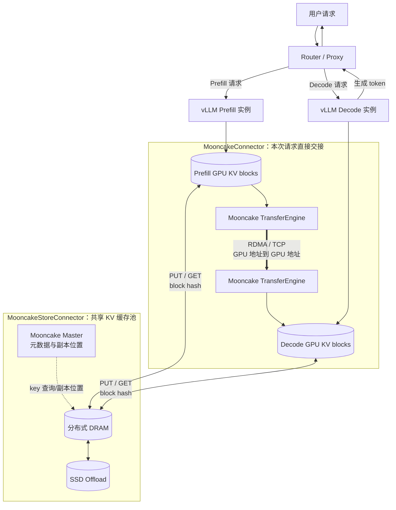

```mermaid
flowchart TB
    U[用户请求] --> R[Router / Proxy]

    R -->|Prefill 请求| P[vLLM Prefill 实例]
    R -->|Decode 请求| D[vLLM Decode 实例]

    subgraph Direct["MooncakeConnector：本次请求直接交接"]
        P_GPU[(Prefill GPU KV blocks)]
        P_TE[Mooncake TransferEngine]
        D_TE[Mooncake TransferEngine]
        D_GPU[(Decode GPU KV blocks)]

        P_GPU --> P_TE
        P_TE == "RDMA / TCP<br/>GPU 地址到 GPU 地址" ==> D_TE
        D_TE --> D_GPU
    end

    P --> P_GPU
    D --> D_GPU

    subgraph Shared["MooncakeStoreConnector：共享 KV 缓存池"]
        MASTER[Mooncake Master<br/>元数据与副本位置]
        MEM[(分布式 DRAM)]
        SSD[(SSD Offload)]
        MASTER -. "key 查询/副本位置" .-> MEM
        MEM <--> SSD
    end

    P_GPU <-->|PUT / GET<br/>block hash| MEM
    D_GPU <-->|PUT / GET<br/>block hash| MEM

    D -->|生成 token| R
    R --> U
```

```python
MooncakeConnector:
Prefill GPU ───────────────→ Decode GPU
               直接传输

MooncakeStoreConnector:
vLLM GPU ←→ Mooncake DRAM/SSD ←→ 其他 vLLM GPU
                  共享存储
```


