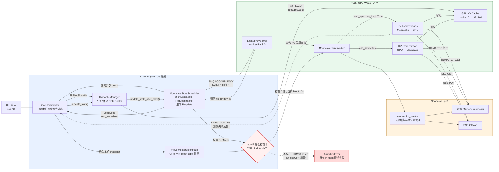
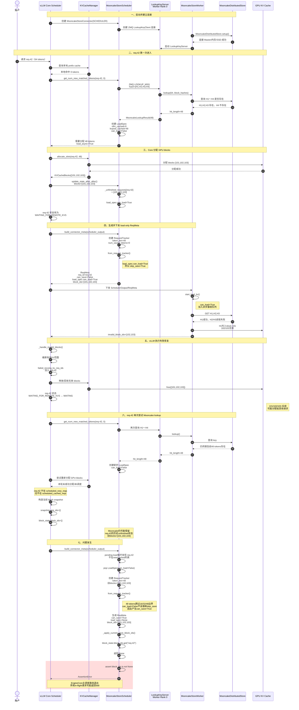

整个架构可以分为三层：EngineCore 调度层、GPU Worker 执行层、Mooncake 存储层。

## 1. EngineCore 调度层

主要组件：

```
Core Scheduler
KVCacheManager
MooncakeStoreScheduler
```

### Core Scheduler

负责决定：

-   本轮调度哪些请求；
-   每个请求计算多少 token；
-   请求处于 `WAITING`、`RUNNING` 还是 `WAITING_FOR_REMOTE_KVS`；
-   KV 加载失败后，是请求失败还是重新计算；
-   生成 `SchedulerOutput` 下发给 worker。

它是整个流程的总调度者。

### KVCacheManager

负责 GPU block 的生命周期：

-   为请求分配 GPU blocks；
-   查询请求当前的完整 block table；
-   加载失败时释放无效 blocks；
-   prefix cache 的缓存和复用；
-   防止仍被异步任务使用的 block 提前释放。

例如：

```
req-42 → GPU blocks [101,102,103]
```

这个映射的最终权威来源是 `KVCacheManager`。

### MooncakeStoreScheduler

这是 vLLM 内部的 Mooncake 调度适配器，负责：

-   查询 Mooncake 中是否存在请求前缀；
-   保存每个请求的 `LoadSpec`；
-   使用 `RequestTracker` 跨轮记录请求状态；
-   为当前调度轮生成 `ReqMeta`；
-   决定本轮执行 load 还是 store；
-   在异步 store 期间 pin GPU blocks。

它不直接搬运 KV 数据，主要生成操作计划。

## 2. GPU Worker 执行层

主要组件：

```
MooncakeStoreWorker
LookupKeyServer
Load Threads
Store Thread
GPU KV Cache
```

### MooncakeStoreWorker

每个 GPU rank 都有一个 worker-side connector。

它负责：

-   创建 `MooncakeDistributedStore`；
-   连接 Mooncake Master；
-   注册 RDMA/TCP 传输资源；
-   接收 Scheduler 下发的 `ReqMeta`；
-   执行真正的 KV load/store；
-   把加载失败的 block ID 返回给 EngineCore；
-   报告 store job 完成。

### LookupKeyServer

只有 worker rank 0 启动 LookupKeyServer。

它负责接收 Scheduler 的查询：

```
这些 block hashes 在 Mooncake 中存在吗？
```

通信方式是 vLLM 内部的 ZMQ。

查询链路：

```
MooncakeStoreScheduler
→ LookupKeyClient
→ ZMQ
→ Worker Rank 0 的 LookupKeyServer
→ MooncakeStoreWorker.lookup()
→ MooncakeDistributedStore
```

查询只传递：

-   token 数；
-   block hashes；
-   查询结果。

它不传输真正的 KV Tensor。

### Load Threads

执行数据加载：

```
Mooncake → GPU
```

例如：

```
Mooncake H1 → GPU block 101
Mooncake H2 → GPU block 102
Mooncake H3 → GPU block 103
```

可能有多个接收线程并发加载。

### Store Thread

执行数据保存：

```
GPU → Mooncake
```

例如：

```
GPU block 101 → Mooncake H1
GPU block 102 → Mooncake H2
GPU block 103 → Mooncake H3
```

store 是异步的，所以 Scheduler 必须 pin 相关 GPU blocks，防止 worker 读取之前被其他请求复用。

## 3. Mooncake 存储层

主要组件：

```
mooncake_master
MooncakeDistributedStore
CPU Memory Segments
SSD Offload
```

### Mooncake Master

负责管理：

-   存储节点；
-   segment 位置；
-   key 的分布；
-   多个 vLLM 实例之间的共享；
-   CPU/SSD 存储层协调。

Master 主要管理元数据和拓扑，不直接参与每一字节的 GPU KV 搬运。

### MooncakeDistributedStore

这是 vLLM worker 使用的 Mooncake 客户端对象：

```
self.store = MooncakeDistributedStore()
```

它通过：

```
self.store.setup(...)
```

连接 Mooncake Master，并建立 RDMA/TCP 数据传输能力。

### CPU/SSD 存储

Mooncake 的 KV 数据可以位于：

```
CPU Memory
SSD
其他存储节点
```

从 vLLM 角度看，这些都属于 GPU KV Cache 之外的外部共享存储。

## 4. 两条通信通道

架构中最重要的是区分控制面和数据面。

### 控制面

负责决定“做什么”：

```
Core Scheduler
→ MooncakeStoreScheduler
→ LookupKeyClient
→ LookupKeyServer
→ Mooncake 查询
```

传递的数据很小，例如：

```
req_id
block hashes
hit_length
LoadSpec
ReqMeta
失败 block IDs
```

### 数据面

负责真正搬运 KV：

```
GPU KV Cache
↔ MooncakeStoreWorker
↔ MooncakeDistributedStore
↔ CPU/SSD
```

数据量很大，通常通过 RDMA/TCP。

## 5. `ReqMeta` 在架构中的位置

`ReqMeta` 是 Scheduler 和 Worker 之间的工作单：

```
ReqMeta(
    req_id="req-42",
    block_ids=([101,102,103],),
    can_save=False,
    load_spec=LoadSpec(can_load=True),
)
```

表示加载：

```
Mooncake → GPU blocks [101,102,103]
```

另一种：

```
ReqMeta(
    req_id="req-42",
    block_ids=([101,102,103],),
    can_save=True,
    load_spec=None,
)
```

表示保存：

```
GPU blocks [101,102,103] → Mooncake
```

## 6. #54870 发生在哪一层

问题发生在 EngineCore 调度层：

```
Core Scheduler
与
MooncakeStoreScheduler
```

两边对 `req-42` 的当前状态理解不一致：

```
Core Scheduler：
req-42 本轮没有调度
因此当前 snapshot 中没有 req-42

MooncakeStoreScheduler：
根据历史 tracker/load 状态
生成了 ReqMeta(can_save=True)
```

随后 MooncakeStoreScheduler 查询：

```
block_state.block_ids.get("req-42")
```

结果是：

```
None
```

并触发：

```
assert block_ids is not None
```

所以这个问题：

-   不是 Mooncake Master 崩溃；
-   不是 GPU kernel 崩溃；
-   不是 worker 后台 store 直接崩溃；
-   是 EngineCore 在构造 connector metadata 时发生 Python 断言。

一句话描述整个架构：

>   EngineCore Scheduler 制定 KV load/store 计划，GPU Worker 根据 `ReqMeta` 真正通过 MooncakeDistributedStore 搬运数据，Mooncake Master 管理外部存储拓扑；#54870 是 Scheduler 与 MooncakeStoreScheduler 的请求状态不同步，导致在任务下发前触发致命断言。

# 正常 pending-load 生命周期

```python
Mooncake lookup 命中48 tokens
    ↓
load_specs["req-42"] = LoadSpec(can_load=False)
    ↓
Core 分配GPU blocks [101,102,103]
    ↓
update_state_after_alloc()
    ↓
LoadSpec.can_load=True
    ↓
pending-load循环发现req-42
    ↓
生成ReqMeta(can_save=False, load_spec=...)
    ↓
worker执行 Mooncake → GPU
    ↓
load_spec从self.load_specs中移除
```

