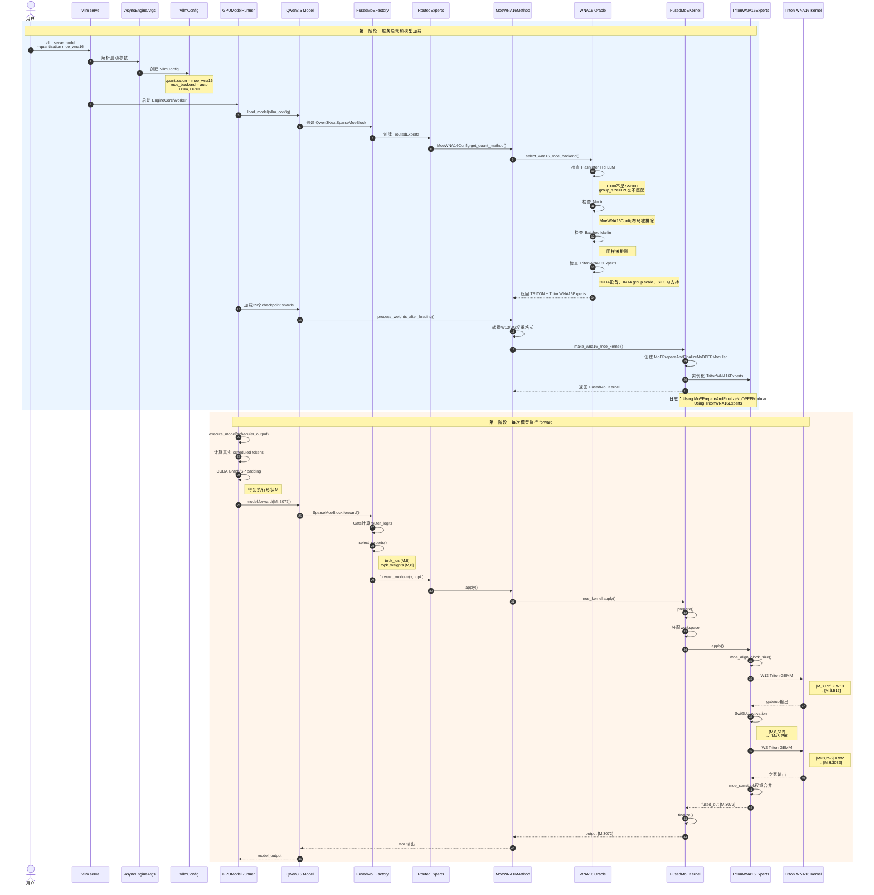

先给结论：你当前代码中只有“模型构造时 Oracle 选择 Experts 后端”，没有“每次 forward 再选择 CUDA/Triton”的第二级 dispatcher。

当前真实路径是：

```
vllm serve
└── 参数进入 VllmConfig
    └── 加载 Qwen3.5 模型
        └── 创建 Qwen3NextSparseMoeBlock
            └── FusedMoEFactory
                └── RoutedExperts
                    └── MoeWNA16Method
                        └── Oracle 选择 TritonWNA16Experts
                            └── 组装 Modular MoE kernel

每次请求 forward
└── GPUModelRunner
    └── Qwen3.5 MoE layer
        └── Router 计算 topk_ids/topk_weights
            └── MoeWNA16Method.apply()
                └── TritonWNA16Experts.apply()
                    ├── W13 → Triton
                    ├── activation
                    └── W2  → Triton
```

下面从入口展开。

------

## 1. CLI 入口

启动命令：

```
vllm serve Qwen/Qwen3.5-122B-A10B-GPTQ-Int4 \
  --quantization moe_wna16 \
  --tensor-parallel-size 4 \
  ...
```

CLI 主入口解析 `serve` 子命令，然后调用：

```
ServeSubcommand.cmd(args)
```

代码在 [serve.py (line 45)](/data/home/xli49/lxy/vllm/vllm/entrypoints/cli/serve.py:45)。

两个关键参数：

```
--quantization moe_wna16
--moe-backend ...
```

分别注册在：

-   [arg_utils.py (line 850)](/data/home/xli49/lxy/vllm/vllm/engine/arg_utils.py:850)：`--quantization`
-   [arg_utils.py (line 1628)](/data/home/xli49/lxy/vllm/vllm/engine/arg_utils.py:1628)：`--moe-backend`

你的启动命令没有写 `--moe-backend`，所以使用默认值：

```
moe_backend = "auto"
```

定义在 [kernel.py (line 235)](/data/home/xli49/lxy/vllm/vllm/config/kernel.py:235)。

注意，这里的 `auto` 是“模型加载时由 Oracle 选择 Experts 后端”，不是 WNA16 forward 内部的 CUDA/Triton policy。

最终生成：

```
VllmConfig
├── model_config.quantization = "moe_wna16"
├── kernel_config.moe_backend = "auto"
├── parallel_config.tensor_parallel_size = 4
├── parallel_config.data_parallel_size = 1
└── scheduler_config.max_num_batched_tokens = 16384
```

------

## 2. 选择量化配置 `MoeWNA16Config`

`"moe_wna16"` 映射到：

```
MoeWNA16Config
```

映射代码在 [quantization/__init__.py (line 156)](/data/home/xli49/lxy/vllm/vllm/model_executor/layers/quantization/__init__.py:156)。

它读取模型的 `quantize_config.json`：

```
quant_method = gptq
bits         = 4
group_size   = 128
desc_act     = false
sym          = true
```

核心解析位于 [moe_wna16.py (line 111)](/data/home/xli49/lxy/vllm/vllm/model_executor/layers/quantization/moe_wna16.py:111)。

兼容性要求：

```
gptq_compatible = (
    quant_method == "gptq"
    and not desc_act
    and num_bits in [4, 8]
)
```

因此你的量化描述是：

```
权重：INT4
激活：BF16
group_size：128
zero point：无（对称 GPTQ）
```

这就是 W4A16：

```
W4 = 4-bit weight
A16 = BF16/FP16 activation
```

------

## 3. GPUModelRunner 加载模型

ModelRunner 的加载入口：

```
GPUModelRunner.load_model()
```

位于 [gpu_model_runner.py (line 5408)](/data/home/xli49/lxy/vllm/vllm/v1/worker/gpu_model_runner.py:5408)。

核心调用：

```
model_loader = get_model_loader(self.load_config)

self.model = model_loader.load_model(
    vllm_config=self.vllm_config,
    model_config=self.model_config,
)
```

模型架构解析到：

```
Qwen3_5MoeForCausalLM
```

Qwen3.5 MoE 的 decoder layer 创建：

```
Qwen3NextSparseMoeBlock
```

位于 [qwen3_5.py (line 164)](/data/home/xli49/lxy/vllm/vllm/model_executor/models/qwen3_5.py:164)。

------

## 4. 创建 Qwen3.5 MoE 层

`Qwen3NextSparseMoeBlock` 创建 `FusedMoEFactory`：

```
self.experts = FusedMoEFactory(
    num_experts=self.n_routed_experts,
    top_k=config.num_experts_per_tok,
    hidden_size=config.hidden_size,
    intermediate_size=config.moe_intermediate_size,
    quant_config=quant_config,
    ...
)
```

位于 [qwen3_next.py (line 165)](/data/home/xli49/lxy/vllm/vllm/model_executor/models/qwen3_next.py:165)。

代入你的模型和 TP=4：

```
global experts E      = 256
topk                  = 8
hidden_size K         = 3072
每卡 intermediate     = 256
W13 输出宽度 N        = 2 × 256 = 512
```

`FusedMoEFactory` 创建三部分：

```
MoERunner
├── Router
├── RoutedExperts
└── FusedMoEConfig
```

关键配置传递：

```
moe_config = FusedMoEConfig(
    num_experts=global_num_experts,
    experts_per_token=top_k,
    hidden_dim=hidden_size,
    intermediate_size=intermediate_size,
    moe_backend=vllm_config.kernel_config.moe_backend,
    max_num_tokens=max_num_batched_tokens,
    ...
)
```

代码在 [layer.py (line 331)](/data/home/xli49/lxy/vllm/vllm/model_executor/layers/fused_moe/layer.py:331)。

此时：

```
moe_config.moe_backend = "auto"
```

------

## 5. RoutedExperts 选择 `MoeWNA16Method`

`RoutedExperts` 调用：

```
quant_config.get_quant_method(self, prefix)
```

位于 [routed_experts.py (line 190)](/data/home/xli49/lxy/vllm/vllm/model_executor/layers/fused_moe/routed_experts.py:190)。

`MoeWNA16Config` 根据 layer 类型判断：

```
elif isinstance(layer, RoutedExperts):
    return MoeWNA16Method(self, layer.moe_config)
```

代码在 [moe_wna16.py (line 171)](/data/home/xli49/lxy/vllm/vllm/model_executor/layers/quantization/moe_wna16.py:171)。

因此不是所有模型都会执行 `MoeWNA16Method`，必须同时满足：

```
量化配置是 moe_wna16
+
当前层是 RoutedExperts MoE 层
```

普通 dense MLP、FP8 MoE、非量化 MoE 都不会进入它。

------

## 6. Oracle 选择 Experts 后端

`MoeWNA16Method.__init__()` 构造量化 key：

```
weight_key = QuantKey(
    INT4_DTYPE,
    kInt4StaticGroupScale,
)
```

然后调用：

```
self.wna16_backend, self.experts_cls = select_wna16_moe_backend(
    config=self.moe,
    weight_key=weight_key,
    quant_config=self.quant_config,
    may_have_zp=self.quant_config.has_zp,
    may_have_bias=False,
)
```

位于 [moe_wna16.py (line 234)](/data/home/xli49/lxy/vllm/vllm/model_executor/layers/quantization/moe_wna16.py:234)。

### Oracle 的优先级

CUDA 平台上的顺序是：

```
return [
    WNA16MoEBackend.FLASHINFER_TRTLLM,
    WNA16MoEBackend.MARLIN,
    WNA16MoEBackend.BATCHED_MARLIN,
    WNA16MoEBackend.TRITON,
    WNA16MoEBackend.HUMMING,
    WNA16MoEBackend.EMULATION,
]
```

位于 [int_wna16.py (line 108)](/data/home/xli49/lxy/vllm/vllm/model_executor/layers/fused_moe/oracle/int_wna16.py:108)。

核心选择代码：

```
for backend in AVAILABLE_BACKENDS:
    reason = _backend_incompatibility_reason(...)

    if reason is not None:
        continue

    for k_cls in backend_to_kernel_cls(backend):
        supported, reason = k_cls.is_supported_config(...)

        if supported:
            return backend, k_cls
```

位于 [int_wna16.py (line 279)](/data/home/xli49/lxy/vllm/vllm/model_executor/layers/fused_moe/oracle/int_wna16.py:279)。

### 代入你的模型

#### FlashInfer TRTLLM

它要求：

```
current_platform.is_device_capability_family(100)
```

位于 [trtllm_mxint4_moe.py (line 46)](/data/home/xli49/lxy/vllm/vllm/model_executor/layers/fused_moe/experts/trtllm_mxint4_moe.py:46)。

H100 是 SM90，不是 SM100，所以跳过。

此外它只支持：

```
kInt4Static32
```

而你的 `group_size=128` 对应 `kInt4StaticGroupScale`，也不匹配。

#### Marlin / Batched Marlin

Oracle 中有：

```
allow_marlin = not isinstance(
    quant_config,
    MoeWNA16Config,
)
```

位于 [int_wna16.py (line 155)](/data/home/xli49/lxy/vllm/vllm/model_executor/layers/fused_moe/oracle/int_wna16.py:155)。

你的 quant config 正是 `MoeWNA16Config`，所以：

```
Marlin         → 跳过
BatchedMarlin  → 跳过
```

#### Triton

`TritonWNA16Experts` 支持：

```
CUDA-like device
INT4 static group scale
SILU
当前 parallel config
```

检查位于 [triton_moe.py (line 569)](/data/home/xli49/lxy/vllm/vllm/model_executor/layers/fused_moe/experts/triton_moe.py:569)。

因此 Oracle 返回：

```
(
    WNA16MoEBackend.TRITON,
    TritonWNA16Experts,
)
```

Humming 和 Emulation 不再检查，因为 Triton 已经是第一个支持的实现。

完整结果：

```
FlashInfer TRTLLM → H100/量化格式不支持
Marlin            → MoeWNA16 checkpoint layout 被排除
Batched Marlin    → MoeWNA16 checkpoint layout 被排除
Triton            → 支持，选中
Humming           → 不再检查
Emulation         → 不再检查
```

------

## 7. 权重加载后组装 Modular kernel

权重加载完成后：

```
MoeWNA16Method.process_weights_after_loading()
```

会转换权重布局，然后调用：

```
self._setup_kernel(layer)
```

位于 [moe_wna16.py (line 389)](/data/home/xli49/lxy/vllm/vllm/model_executor/layers/quantization/moe_wna16.py:389)。

核心代码：

```
self.moe_kernel = make_wna16_moe_kernel(
    moe_quant_config=self.moe_quant_config,
    moe_config=self.moe,
    experts_cls=self.experts_cls,
    backend=self.wna16_backend,
)
```

`make_wna16_moe_kernel()` 创建：

```
Prepare/Finalize
+
Experts
```

你的配置：

```
TP=4
DP=1
未启用 Expert Parallel all-to-all
```

所以：

```
Prepare/Finalize
= MoEPrepareAndFinalizeNoDPEPModular

Experts
= TritonWNA16Experts
```

代码位于：

-   [all2all_utils.py (line 165)](/data/home/xli49/lxy/vllm/vllm/model_executor/layers/fused_moe/all2all_utils.py:165)
-   [int_wna16.py (line 356)](/data/home/xli49/lxy/vllm/vllm/model_executor/layers/fused_moe/oracle/int_wna16.py:356)

这正对应启动日志：

```
Using MoEPrepareAndFinalizeNoDPEPModular
Using TritonWNA16Experts
```

最后组装成：

```
FusedMoEKernel
└── FusedMoEKernelModularImpl
    ├── prepare_finalize
    └── fused_experts
```

------

## 8. 请求进入 GPUModelRunner

每次 Engine 调度执行：

```
GPUModelRunner.execute_model(scheduler_output)
```

位于 [gpu_model_runner.py (line 4283)](/data/home/xli49/lxy/vllm/vllm/v1/worker/gpu_model_runner.py:4283)。

真实调度 token 数：

```
num_tokens_unpadded = scheduler_output.total_num_scheduled_tokens
```

位于 [gpu_model_runner.py (line 4362)](/data/home/xli49/lxy/vllm/vllm/v1/worker/gpu_model_runner.py:4362)。

随后 CUDA Graph/Sequence Parallel 可能进行 padding：

```
num_tokens_padded = batch_desc.num_tokens
```

位于 [gpu_model_runner.py (line 4405)](/data/home/xli49/lxy/vllm/vllm/v1/worker/gpu_model_runner.py:4405)。

模型实际看到的是：

```
M = num_tokens_padded
```

所以 `M` 是当前执行 step 的 token 行数，不一定严格等于真实 token 数。

例如：

```
单请求 decode
真实 token = 1
CUDA Graph shape 可能仍为 M=1、2、4、8 中的某个 capture size

8 个并发 decode
M 通常接近 8

单请求 PP2048
M 通常接近 2048

多个 prefill 合批
M = 本 step 各请求 chunk token 数之和，再加可能的 padding
```

然后：

```
self.model(...)
```

位于 [gpu_model_runner.py (line 3951)](/data/home/xli49/lxy/vllm/vllm/v1/worker/gpu_model_runner.py:3951)。

------

## 9. Qwen3.5 MoE forward

Sparse MoE block：

```
num_tokens, hidden_dim = hidden_states.shape

final_hidden_states = self.experts(
    hidden_states=hidden_states,
    router_logits=hidden_states,
)
```

位于 [qwen3_next.py (line 185)](/data/home/xli49/lxy/vllm/vllm/model_executor/models/qwen3_next.py:185)。

此时：

```
hidden_states.shape = [M, 3072]
```

进入 `MoERunner._forward_impl()`：

```
router_logits, _ = self.gate(hidden_states)
```

然后 Modular 路径先路由：

```
topk_weights, topk_ids = self.router.select_experts(
    hidden_states=hidden_states,
    router_logits=router_logits,
)
```

位于 [moe_runner.py (line 603)](/data/home/xli49/lxy/vllm/vllm/model_executor/layers/fused_moe/runner/moe_runner.py:603)。

得到：

```
topk_ids.shape     = [M, 8]
topk_weights.shape = [M, 8]
```

然后：

```
self.routed_experts.forward_modular(...)
```

最终进入：

```
MoeWNA16Method.apply()
```

调用链：

```
MoERunner._apply_quant_method()
└── RoutedExperts.forward_modular()
    └── MoeWNA16Method.apply()
        └── FusedMoEKernel.apply()
            └── FusedMoEKernelModularImpl.apply()
```

------

## 10. Modular MoE 的三阶段

`FusedMoEKernelModularImpl.apply()` 执行：

```
_prepare()
_fused_experts()
_finalize()
```

代码位于 [modular_kernel.py (line 1437)](/data/home/xli49/lxy/vllm/vllm/model_executor/layers/fused_moe/modular_kernel.py:1437)。

你的 `NoDPEP` 路径中：

```
_prepare
├── 不做跨 EP rank all-to-all
├── 保留/处理 topk_ids
└── 准备激活和量化信息

_fused_experts
└── 调 TritonWNA16Experts.apply()

_finalize
├── 按 topk weight 合并专家输出
└── 处理 TP reduction
```

------

## 11. `TritonWNA16Experts.apply()` 的核心

进入 [triton_moe.py (line 615)](/data/home/xli49/lxy/vllm/vllm/model_executor/layers/fused_moe/experts/triton_moe.py:615)。

先得到问题尺寸：

```
E, num_tokens, N, K, top_k_num = self.moe_problem_size(
    hidden_states,
    w1,
    w2,
    topk_ids,
)
```

代入：

```
E          = 256
num_tokens = M
N          = 512
K          = 3072
top_k_num  = 8
```

然后 route alignment：

```
sorted_token_ids, expert_ids, num_tokens_post_padded = (
    moe_align_block_size(...)
)
```

这里的 padding 是将 routed token 按 expert 和 `BLOCK_SIZE_M` 对齐，不是 sequence padding。

### 第一次 GEMM：W13

```
A = hidden_states        [M, 3072]
B = w13                  [256, 512, packed 3072]
C = intermediate_cache1  [M, 8, 512]
```

当前代码直接调用：

```
invoke_fused_moe_wna16_triton_kernel(...)
```

位于 [triton_moe.py (line 699)](/data/home/xli49/lxy/vllm/vllm/model_executor/layers/fused_moe/experts/triton_moe.py:699)。

### Activation

```
gate/up 输出：[M, 8, 512]
SwiGLU 后：   [M × 8, 256]
```

执行：

```
self.activation(
    activation,
    intermediate_cache2,
    intermediate_cache1.view(-1, N),
)
```

### 第二次 GEMM：W2

```
A = activation output    [M × 8, 256]
B = w2                   [256, 3072, packed 256]
C = intermediate_cache3  [M, 8, 3072]
```

当前代码再次直接调用 Triton：

```
invoke_fused_moe_wna16_triton_kernel(...)
```

位于 [triton_moe.py (line 732)](/data/home/xli49/lxy/vllm/vllm/model_executor/layers/fused_moe/experts/triton_moe.py:732)。

最后：

```
self.moe_sum(intermediate_cache3, output)
```

得到：

```
output.shape = [M, 3072]
```

------

## 12. 当前为什么不执行 CUDA W4A16

关键点是：

```
TritonWNA16Experts.apply()
没有调用 dispatch_fused_moe_kernel()
```

它直接调用了两次：

```
invoke_fused_moe_wna16_triton_kernel()
```

因此当前 Modular 路径根本不会执行：

```
should_moe_wna16_use_cuda(...)
```

旧路径的动态判断位于 [fused_moe.py (line 928)](/data/home/xli49/lxy/vllm/vllm/model_executor/layers/fused_moe/fused_moe.py:928)：

```
use_cuda = should_moe_wna16_use_cuda(
    num_valid_tokens=num_tokens,
    group_size=block_shape[1],
    num_experts=B.size(0),
    bit=4,
)

if use_cuda:
    invoke_fused_moe_wna16_cuda_kernel(...)
else:
    invoke_fused_moe_wna16_triton_kernel(...)
```

判断函数位于 [fused_moe.py (line 1288)](/data/home/xli49/lxy/vllm/vllm/model_executor/layers/fused_moe/fused_moe.py:1288)：

```
def should_moe_wna16_use_cuda(
    num_valid_tokens,
    group_size,
    num_experts,
    bit,
):
    return (
        current_platform.is_cuda()
        and bit == 4
        and group_size in [32, 64, 128]
        and num_valid_tokens / num_experts <= 6
    )
```

代入你的模型：

```
num_valid_tokens = M × topk = M × 8
num_experts      = 256

M × 8 / 256 <= 6
M <= 192
```

所以旧路径是：

```
M <= 192 → CUDA W4A16
M >= 193 → Triton W4A16
```

W13 和 W2 的 routed rows 相同：

```
W13：A.size(0)=M，topk=8
     num_valid_tokens=M×8

W2： A.size(0)=M×8，topk=1
     num_valid_tokens=M×8
```

因此当前条件下两次通常选择同一个后端。

------

## 13. Workspace 在哪里进入

Modular kernel 向 Experts 查询 workspace：

```
workspace13_shape, workspace2_shape, _ = (
    self.fused_experts.workspace_shapes(...)
)
```

当前 Triton 基类返回：

```
workspace1 = (
    M,
    topk,
    max(activation_out_dim, K),
)
```

位于 [triton_moe.py (line 204)](/data/home/xli49/lxy/vllm/vllm/model_executor/layers/fused_moe/experts/triton_moe.py:204)。

但是 workspace manager 后面已经做了：

```
max_shape_size = max(
    prod(workspace13_shape),
    prod(fused_out_shape),
)
```

位于 [modular_kernel.py (line 1170)](/data/home/xli49/lxy/vllm/vllm/model_executor/layers/fused_moe/modular_kernel.py:1170)。

所以 WNA16 的 activation workspace 实际只需要报告：

```
(M, topk, activation_out_dim)
```

最终 `[M,K]` 输出空间仍会被外层 `max()` 保证。

------

## 完整的当前实际路径

```
vllm serve
├── --quantization moe_wna16
│   └── MoeWNA16Config
│
├── --moe-backend 未指定
│   └── KernelConfig.moe_backend = auto
│
└── GPUModelRunner.load_model()
    └── Qwen3_5MoeForCausalLM
        └── Qwen3NextSparseMoeBlock
            └── FusedMoEFactory
                └── RoutedExperts
                    └── MoeWNA16Method
                        └── select_wna16_moe_backend()
                            ├── FlashInfer → SM100要求，不支持H100
                            ├── Marlin → MoeWNA16布局不支持
                            ├── BatchedMarlin → 同上
                            └── Triton → 选中
                                └── TritonWNA16Experts

每次 execute_model()
└── M = 当前 padded 执行 token 数
    └── Qwen3NextSparseMoeBlock.forward()
        └── MoERunner
            ├── gate/router
            ├── topk_ids [M,8]
            ├── topk_weights [M,8]
            └── MoeWNA16Method.apply()
                └── FusedMoEKernelModularImpl
                    ├── prepare
                    ├── TritonWNA16Experts.apply()
                    │   ├── W13 → Triton
                    │   ├── activation
                    │   └── W2 → Triton
                    └── finalize
```

最关键的修复点就在最后：

```
当前：
TritonWNA16Experts.apply()
└── 直接 Triton

需要恢复：
WNA16Experts.apply()
└── 共享 WNA16 dispatcher
    ├── CUDA 支持且 M<=192 → CUDA
    └── 否则               → Triton
```

并且这个 dispatcher 应当与旧 `dispatch_fused_moe_kernel()` 共享同一个选择实现，避免 Modular 和旧路径再次出现行为不一致。
