# 架构

```mermaid
sequenceDiagram
    autonumber

    participant E as EngineCore
    participant S as Scheduler
    participant R as RUNNING Queue
    participant W as WAITING Queue
    participant P as Prefix Cache / Connector
    participant K as KVCacheManager
    participant O as SchedulerOutput

    E->>S: schedule()

    Note over S: current_step += 1
    S->>S: 初始化本轮预算
    Note over S: token_budget = max_num_scheduled_tokens<br/>input_budget = max_num_batched_tokens<br/>encoder_budget<br/>draft_slots

    S->>K: new_step_starts()

    rect rgb(225, 240, 255)
        Note over S,R: 第一阶段：优先调度 RUNNING 请求

        loop RUNNING 队列中每个请求，且 token_budget > 0
            S->>R: 取下一个请求 request

            S->>S: 检查是否 eligible
            Note over S: max_tokens / PP cadence<br/>DP prefill throttling<br/>input budget

            alt 本轮不可执行
                S->>R: 跳过该请求
            else 可以尝试执行
                S->>S: 计算 pending tokens
                Note over S: num_new_tokens =<br/>num_tokens_with_spec<br/>+ output_placeholders<br/>- num_computed_tokens

                S->>S: 限制 num_new_tokens
                Note over S: long-prefill threshold<br/>token/input budget<br/>max_model_len<br/>Mamba alignment<br/>encoder budget<br/>prefill lookahead

                alt num_new_tokens == 0
                    S->>R: 本轮跳过
                else num_new_tokens > 0
                    S->>K: allocate_slots(request, num_new_tokens)

                    alt KV 空间不足
                        S->>R: 选择低优先级 victim
                        S->>K: 释放 victim 的 KV blocks
                        S->>S: 标记 victim 为 preempted
                        S->>K: 重试 allocate_slots()
                    else KV 空间充足
                        K-->>S: new_blocks
                    end

                    alt 最终分配成功
                        S->>S: num_scheduled_tokens[req_id] = num_new_tokens
                        S->>S: token_budget -= num_new_tokens
                        S->>S: input_budget -= num_new_tokens + draft_slots
                        S->>S: 记录 spec tokens / encoder inputs / blocks
                    else 最终仍失败
                        S->>S: 停止或跳过调度
                    end
                end
            end
        end
    end

    rect rgb(235, 255, 235)
        Note over S,W: 第二阶段：使用剩余预算接纳 WAITING 请求

        alt 本轮没有发生 preemption 且 scheduler 未暂停
            loop WAITING 非空，且 token_budget > 0
                S->>W: 按 FCFS/Priority 取队首请求

                S->>S: 检查准入条件
                Note over S: max_num_seqs<br/>LoRA adapter 数量<br/>streaming/KV transfer 状态

                alt 无法准入
                    S->>W: 放入 skipped_waiting 或停止
                else 可以尝试准入
                    S->>P: 查询 local prefix cache
                    P-->>S: local cached tokens

                    opt 配置 KV Connector
                        S->>P: 查询/加载远端 KV
                        P-->>S: external cached tokens
                    end

                    S->>S: 确定 num_computed_tokens
                    Note over S: 包括 prefix cache 命中的 token

                    S->>S: 计算 pending
                    Note over S: num_new_tokens =<br/>request.num_tokens<br/>- num_computed_tokens

                    S->>S: 应用预算和 chunk 限制
                    Note over S: request_token_budget<br/>long-prefill threshold<br/>chunked prefill<br/>max_model_len<br/>encoder/Mamba/lookahead

                    alt chunked prefill 关闭且完整 prompt 放不下
                        S->>W: 停止接纳
                    else 可以安排一个 chunk
                        S->>K: allocate_slots(request, num_new_tokens)

                        alt KV 分配失败
                            K-->>S: None
                            S->>W: 保留请求，停止接纳
                        else KV 分配成功
                            K-->>S: blocks
                            S->>W: pop request
                            S->>R: 加入 RUNNING
                            S->>S: 标记 new 或 resumed
                            S->>S: num_scheduled_tokens[req_id] = num_new_tokens
                            S->>S: 扣减 token/input budget
                        end
                    end
                end
            end
        else 发生过 preemption 或 scheduler 暂停
            Note over S,W: 本轮不再接纳 WAITING 请求
        end
    end

    rect rgb(255, 245, 225)
        Note over S: 第三阶段：检查并构造输出

        S->>S: total_num_scheduled_tokens = sum(...)
        S->>S: assert budgets >= 0
        S->>S: 计算 common prefix blocks

        alt MRV2
            S->>S: resumed 请求并入 new 请求
            Note over S: resume 重新分配 persistent slot<br/>NewRequestData 携带 all_token_ids
        else MRV1
            S->>S: 分别构造 new / resumed / cached 数据
        end

        S->>O: 构造 SchedulerOutput
        Note over O: scheduled_new_reqs<br/>scheduled_cached_reqs<br/>num_scheduled_tokens<br/>scheduled_spec_decode_tokens<br/>block IDs / encoder inputs<br/>finished/preempted IDs

        opt 配置 KV/Encoder Connector
            S->>P: build_connector_meta(output)
            P-->>O: connector metadata
        end

        S->>S: _update_after_schedule(output)
        Note over S: num_computed_tokens += scheduled<br/>num_in_flight_tokens += scheduled<br/>更新 is_prefill_chunk

        S-->>E: return SchedulerOutput
    end
```




下面用一个固定场景，把 `Scheduler.schedule()` 从第 1 步走到第 50 步。

## 初始条件

关闭特殊功能：

```text
无 speculative decoding
无 encoder/multimodal
无 Mamba 对齐
无 PP/DP
无 LoRA
KV cache 充足
启用 chunked prefill
调度策略 FCFS
```

配置：

```text
max_num_scheduled_tokens = 8
max_num_batched_tokens   = 8
max_num_seqs             = 4
long_prefill_threshold   = 4
max_model_len            = 32
KV block_size            = 4
```

当前请求：

| 请求 | 队列 | prompt 长度 | 当前 token 数 | 已计算 | 欠计算 |
|---|---|---:|---:|---:|---:|
| A | RUNNING | 5 | 6 | 5 | 1 |
| B | RUNNING | 20 | 20 | 6 | 14 |
| C | WAITING | 10 | 10 | 0 | 10 |

具体 token：

```text
A:
prompt = [10,11,12,13,14]
已采样但尚未计算 = [51]
num_tokens_with_spec = 6
num_computed = 5
KV blocks = [10,11]

B:
prompt = [100,101,...,119]
num_tokens_with_spec = 20
num_computed = 6
KV blocks = [20,21]

C:
prompt = [200,201,...,209]
num_tokens = 10
num_computed = 0
KV blocks = []
```

队列：

```text
RUNNING = [A, B]
WAITING = [C]
```

---

## 1—7：初始化本轮调度

1. EngineCore 调用：

```python
scheduler_output = scheduler.schedule()
```

入口是 [scheduler.py](/data/home/xli49/lxy/vllm/vllm/v1/core/sched/scheduler.py:500)。

2. scheduler 推进 step：

```python
self.current_step += 1
```

假设：

```text
current_step: 20 -> 21
```

3. 初始化本轮请求集合：

```python
# 本步首次被调度的请求（从 WAITING 队列进入 running）
scheduled_new_reqs = []

# 本步被重新调度的请求（此前被抢占，状态为 PREEMPTED，现恢复执行）
scheduled_resumed_reqs = []

# 本步继续调度的已在运行请求（来自 running 队列，非首次、非恢复）
scheduled_running_reqs = []

# 本步被抢占的请求（因 KV cache 等资源不足，从 running 中踢出）
preempted_reqs = []
```

4. 初始化 KV block 结果：

```python
# 请求 ID -> 本步新分配的 KV cache 块
req_to_new_blocks = {}
```

5. 初始化最重要的结果：

```python
# 请求 ID -> 本步为该请求调度的 token 数量
num_scheduled_tokens = {}
```

它最终会保存：

```text
请求 ID -> 本轮运行多少 token
```

6. 初始化 token budget：

```python
token_budget = self.max_num_scheduled_tokens
```

代入：

```text
token_budget = 8
```

7. 初始化 input budget：

```python
input_budget = self.scheduler_config.max_num_batched_tokens
```

因为没有 spec decoding：

```text
draft_slots = 0
input_budget = 8
```

当前状态：

```text
token_budget = 8
input_budget = 8
num_scheduled_tokens = {}
```

---

## 8—20：调度 RUNNING 请求 A

8. scheduler 先处理 RUNNING 队列：

```python
request = self.running[0]
```

得到：

```text
request = A
```

9. 检查预算：

```python
token_budget > 0
input_budget > draft_slots
```

代入：

```text
8 > 0
8 > 0
```

可以继续。

10. 检查 A 是否已经达到 `max_tokens` 或 `max_model_len`。

A 没有结束，所以继续。

11. 检查 PP cadence。

当前没有 PP，所以 A 可运行。

12. 检查 DP prefill throttling。

当前没有 DP throttling，所以 A 不会被跳过。

13. 计算 A 还有多少 token 尚未计算：

```python
num_new_tokens = (
    request.num_tokens_with_spec
    + request.num_output_placeholders
    - request.num_computed_tokens
)
```

代入：

```text
num_tokens_with_spec = 6
output_placeholders = 0
num_computed_tokens = 5

num_new_tokens = 6 + 0 - 5 = 1
```

这个 token 是刚采样出的 `51`。

14. 应用 long prefill threshold：

```python
if 0 < 4 < num_new_tokens:
    num_new_tokens = 4
```

但：

```text
4 < 1 为 False
```

所以仍然是：

```text
num_new_tokens = 1
```

15. 应用全局预算：

```python
num_new_tokens = min(
    num_new_tokens,
    token_budget,
    input_budget - draft_slots,
)
```

代入：

```text
min(1, 8, 8 - 0) = 1
```

16. 应用模型长度限制：

```python
max_allowed = (
    max_model_len
    - num_computed_tokens
    - num_sampled_tokens_per_step
)
```

代入：

```text
max_allowed = 32 - 5 - 1 = 26
num_new_tokens = min(1, 26) = 1
```

17. 因为没有 Mamba、encoder 和 prefill lookahead，token 数不再变化：

```text
num_new_tokens = 1
```

18. scheduler 请求 KV cache slot：

```python
new_blocks = kv_cache_manager.allocate_slots(
    A,
    num_new_tokens=1,
)
```

A 当前已有：

```text
KV blocks = [10,11]
```

block size 为 4，所以能覆盖 positions：

```text
block 10 -> positions 0～3
block 11 -> positions 4～7
```

A 本轮计算 position 5，已有 block 11 可以容纳，不需要新增物理 block。

分配成功。

19. 记录 A：

```python
scheduled_running_reqs.append(A)
num_scheduled_tokens["A"] = 1
```

现在：

```python
num_scheduled_tokens = {
    "A": 1,
}
```

20. 扣减预算：

```python
token_budget -= 1
input_budget -= 1
```

得到：

```text
token_budget = 7
input_budget = 7
```

---

## 21—31：调度 RUNNING 请求 B

21. 继续 RUNNING 队列：

```python
request = self.running[1]
```

得到：

```text
request = B
```

22. 检查预算：

```text
token_budget = 7 > 0
input_budget = 7 > 0
```

B 可以尝试调度。

23. B 没达到长度上限，也没有 PP/DP 等限制。

24. 计算 B 尚未计算的 token：

```text
num_tokens_with_spec = 20
num_computed_tokens = 6

num_new_tokens = 20 - 6 = 14
```

也就是 prompt 中：

```text
[106,107,...,119]
```

一共还欠 14 个。

25. 应用 long prefill threshold：

```python
if 0 < 4 < 14:
    num_new_tokens = 4
```

所以：

```text
num_new_tokens: 14 -> 4
```

这避免 B 一次占满整个 batch。

26. 应用剩余预算：

```python
num_new_tokens = min(
    4,
    token_budget=7,
    input_budget=7,
)
```

得到：

```text
num_new_tokens = 4
```

27. 应用模型长度限制：

```text
max_allowed = 32 - 6 - 1 = 25
min(4, 25) = 4
```

仍然是：

```text
num_new_tokens = 4
```

28. B 本轮要计算：

```text
positions = [6,7,8,9]
tokens = [106,107,108,109]
```

29. scheduler 请求 KV slots：

```python
new_blocks = kv_cache_manager.allocate_slots(
    B,
    num_new_tokens=4,
)
```

B 原来有：

```text
block 20 -> positions 0～3
block 21 -> positions 4～7
```

本轮：

```text
positions 6、7 -> block 21
positions 8、9 -> 需要新 block
```

假设 KVCacheManager 分配：

```text
new block = 22
```

分配后：

```text
B KV blocks = [20,21,22]
```

30. 记录 B：

```python
scheduled_running_reqs.append(B)
num_scheduled_tokens["B"] = 4
req_to_new_blocks["B"] = [22]
```

现在：

```python
num_scheduled_tokens = {
    "A": 1,
    "B": 4,
}
```

31. 扣减预算：

```text
token_budget = 7 - 4 = 3
input_budget = 7 - 4 = 3
```

---

## 32—45：调度 WAITING 请求 C

32. RUNNING 队列处理结束。

当前：

```text
scheduled_running_reqs = [A, B]
preempted_reqs = []
token_budget = 3
input_budget = 3
```

33. scheduler 判断是否允许接纳 WAITING 请求：

```python
if not preempted_reqs and scheduler_not_paused:
```

本轮没有 preemption，也没有暂停，因此进入 WAITING 阶段。

34. 检查最大并发请求数：

```text
当前 RUNNING 数 = 2
max_num_seqs = 4

2 < 4
```

还可以加入请求。

35. 按 FCFS 取出最早到达的 WAITING 请求：

```python
request = waiting.peek_request()
```

得到：

```text
request = C
```

36. 检查 C 的 blocking、streaming、LoRA 等状态。

假设全部通过。

37. 因为 C 是新请求：

```text
num_computed_tokens = 0
```

scheduler 查询 prefix cache：

```python
_get_local_prefix_cache_hit(C)
```

假设没有命中：

```text
prefix cache hit = 0
num_computed_tokens = 0
```

38. 当前没有外部 KV Connector，因此不查询远程 KV cache。

39. 计算 C 当前最多能使用多少预算：

```python
request_token_budget = min(
    token_budget,
    input_budget - draft_slots,
)
```

代入：

```text
request_token_budget = min(3, 3 - 0) = 3
```

40. 计算 C 尚未计算的 token：

```python
num_new_tokens = (
    request.num_tokens
    - num_computed_tokens
)
```

代入：

```text
num_new_tokens = 10 - 0 = 10
```

41. 应用 long prefill threshold：

```text
threshold = 4
10 > 4

num_new_tokens: 10 -> 4
```

42. 因为启用了 chunked prefill，可以继续用剩余 budget 截断：

```python
num_new_tokens = min(
    num_new_tokens,
    request_token_budget,
)
```

代入：

```text
num_new_tokens = min(4, 3) = 3
```

如果没有启用 chunked prefill，这里因为完整 chunk 放不下，C 可能本轮不会被调度。

43. C 本轮将计算：

```text
tokens = [200,201,202]
positions = [0,1,2]
```

44. scheduler 请求 KV cache：

```python
new_blocks = kv_cache_manager.allocate_slots(
    C,
    num_new_tokens=3,
)
```

block size 为 4，一个 block 足够容纳 positions 0～2。

假设分配：

```text
C new block = 30
C KV blocks = [30]
```

45. C 分配成功，从 WAITING 移到 RUNNING：

```python
waiting.pop_request()
running.append(C)
scheduled_new_reqs.append(C)

num_scheduled_tokens["C"] = 3
req_to_new_blocks["C"] = [30]
```

扣减预算：

```text
token_budget = 3 - 3 = 0
input_budget = 3 - 3 = 0
```

最终：

```python
num_scheduled_tokens = {
    "A": 1,
    "B": 4,
    "C": 3,
}
```

---

## 46—50：构造并返回 SchedulerOutput

46. scheduler 计算总 token 数：

```python
total_num_scheduled_tokens = sum(
    num_scheduled_tokens.values()
)
```

代入：

```text
total = 1 + 4 + 3 = 8
```

检查：

```text
8 <= max_num_scheduled_tokens 8
token_budget = 0
input_budget = 0
RUNNING 数 = 3 <= max_num_seqs 4
```

全部合法。

47. 计算 common prefix blocks。

A、B、C 使用不同 prefix，假设：

```python
num_common_prefix_blocks = [0]
```

48. 构造 MRV2 请求数据：

```text
scheduled_new_reqs:
    C，携带完整 token IDs 和 block IDs [30]

scheduled_cached_reqs:
    A、B

scheduled_resumed_reqs:
    空
```

由于当前是 MRV2，resume 请求也会合并到 `scheduled_new_reqs`，但这个例子没有 resume。

49. 构造最终 `SchedulerOutput`：

```python
SchedulerOutput(
    scheduled_new_reqs=[C],
    scheduled_cached_reqs=[A, B],
    num_scheduled_tokens={
        "A": 1,
        "B": 4,
        "C": 3,
    },
    total_num_scheduled_tokens=8,
    scheduled_spec_decode_tokens={},
    scheduled_encoder_inputs={},
    num_common_prefix_blocks=[0],
    preempted_req_ids=set(),
    finished_req_ids=set(),
)
```

然后执行 `_update_after_schedule()`，scheduler 先乐观推进计数：

```text
A:
num_computed 5 + scheduled 1 = 6
is_prefill_chunk = 6 < 6 = False

B:
num_computed 6 + scheduled 4 = 10
is_prefill_chunk = 10 < 20 = True

C:
num_computed 0 + scheduled 3 = 3
is_prefill_chunk = 3 < 10 = True
```

scheduler 内部状态变成：

| 请求 | 调度前 computed | scheduled | 调度后 computed | 状态 |
|---|---:|---:|---:|---|
| A | 5 | 1 | 6 | decode 已执行，等待输出 |
| B | 6 | 4 | 10 | 仍在 chunked prefill |
| C | 0 | 3 | 3 | 仍在 chunked prefill |

50. `schedule()` 返回：

```python
return scheduler_output
```

之后才进入 ModelRunner：

```text
num_scheduled_tokens = {A:1, B:4, C:3}
```

MRV2 runner 会重新排列执行顺序。没有 draft token，且：

```text
A query_len = 1
C query_len = 3
B query_len = 4
```

所以可能得到：

```python
req_ids = ["A", "C", "B"]
```

假设 persistent slots 是：

```text
A -> slot 3
B -> slot 2
C -> slot 1
```

则：

```python
idx_mapping = [3, 1, 2]
```

累计 token 位置：

```python
query_start_loc = [0, 1, 4, 8]
```

模型输入布局：

```text
batch row 0 / A:
token 51
model position [5]
flattened input [0:1]

batch row 1 / C:
tokens [200,201,202]
model positions [0,1,2]
flattened input [1:4]

batch row 2 / B:
tokens [106,107,108,109]
model positions [6,7,8,9]
flattened input [4:8]
```

完整结果：

```text
Scheduler 决定：
A 算 1 个
B 算 4 个
C 算 3 个

MRV2 Runner 决定执行布局：
[A, C, B]

最终 flattened model input：
[51, 200,201,202, 106,107,108,109]
```

最核心的数据变化是：

```text
初始 budget = 8

A 取 1 -> 剩 7
B 取 4 -> 剩 3
C 取 3 -> 剩 0

SchedulerOutput:
{A: 1, B: 4, C: 3}
```


因为 vLLM 的 `schedule()` 不只是决定“谁先运行”，还要决定：

>   哪些请求本轮真的能运行，以及每个请求运行多少 token，确保生成的 batch 满足模型执行和资源约束。

可以把 scheduler 看成 batch 的资源规划器：

```
请求优先级
    +
token 预算
    +
KV cache 空间
    +
模型/并行特性约束
    ↓
本轮可执行的 SchedulerOutput
```

我列出这些条件，是为了暂时关闭特殊分支，让数值例子只剩最基本的 token 分配逻辑。

------

## 1. Speculative decoding 为什么影响 schedule

Speculative decoding 会让一个请求每轮不只计算一个 token。

普通 decode：

```
A 本轮 scheduled = 1
```

Spec decode：

```
正式 query token = 1
draft tokens = 3

A 本轮 scheduled = 4
```

scheduler 需要：

-   为 draft token 预留 input slots；
-   为对应位置分配 KV cache；
-   检查 `max_model_len`；
-   把 draft token 写进 `scheduled_spec_decode_tokens`；
-   某些情况下把新 decode 请求 padding 到统一 speculative 长度。

对应代码：

```
spec = self.vllm_config.speculative_config
draft_slots = (
    spec.max_num_new_slots_for_drafting
    if spec is not None
    else 0
)
```

然后 input budget 会扣掉 draft slots：

```
num_new_tokens = min(
    num_new_tokens,
    token_budget,
    input_budget - draft_slots,
)
```

因此 speculative decoding 会直接改变：

```
num_scheduled_tokens
input_budget
KV slot 数量
batch shape
```

它必须在 schedule 阶段处理。

------

## 2. Encoder/multimodal 为什么影响 schedule

多模态请求可能包含：

-   图片 embedding
-   视频 embedding
-   音频 embedding
-   encoder-decoder 模型的 encoder tokens

这些 encoder 输入也消耗：

-   encoder compute budget；
-   encoder cache；
-   cross-attention KV cache；
-   GPU 内存和计算资源。

因此 scheduler 有独立预算：

```
encoder_compute_budget =
    self.max_num_encoder_input_tokens
```

并调用：

```
_try_schedule_encoder_inputs(...)
```

这个函数可能减少：

```
num_new_tokens
```

例如：

```
原计划处理 100 个文本 token
但图片 embedding 所需 encoder budget 不够
```

scheduler 可能只能安排：

```
本轮文本 token = 20
```

甚至：

```
num_new_tokens = 0
```

如果不在 schedule 阶段检查，runner 收到 batch 后才发现 encoder cache 或预算不足，就已经无法构造合法 batch。

------

## 3. Mamba 对齐为什么影响 schedule

Transformer attention 的 KV cache 通常允许按 token/block 增长。

但 Mamba/混合模型还可能维护：

-   recurrent state
-   convolution state
-   block boundary state

某些 cache 模式要求 prefill chunk 在特定 block boundary 结束。

例如 block size 为 8：

```
scheduler 原本想分配 6 tokens
```

但当前请求距离合法边界需要 8 tokens：

```
6 不能形成合法 chunk
```

scheduler 可能需要调整成：

```
8 tokens
```

或者预算不足时：

```
0 tokens，本轮不调度
```

对应：

```
if self.need_mamba_block_aligned_split:
    num_new_tokens = self._mamba_block_aligned_split(
        request,
        num_new_tokens,
    )
```

因为这会直接改变本轮 token 数，所以必须在生成 `num_scheduled_tokens` 前处理。

------

## 4. PP 为什么影响 schedule

PP 是 Pipeline Parallelism。

同一个请求的数据需要依次经过多个 pipeline stage。在异步调度下，一个请求不能每一步都随意再次进入 pipeline，否则可能出现：

-   上一次还没走完；
-   下一次又开始；
-   sampled token 尚未从最后一级传回第一级；
-   stage 上的请求状态发生错位。

代码中有：

```
if self.current_step < request.next_decode_eligible_step:
    continue
```

含义是：

```
请求必须等到允许的 pipeline step 才能再次 decode
```

例如 PP size 为 4：

```
step 10：A 进入 pipeline
step 11：A 仍在 pipeline 中
step 12：A 仍不能再次调度
step 13：结果尚在传递
step 14：A 才可能再次 eligible
```

所以 PP 会影响：

```
这个请求本轮是否能进入 batch
```

自然属于 scheduler 的职责。

------

## 5. DP 为什么影响 schedule

DP 是 Data Parallelism。

不同 DP rank 可能面对不同工作量：

```
rank 0：大量 prefill
rank 1：主要是 decode
```

prefill 比 decode 重很多，可能造成：

```
rank 0 很慢
rank 1 等待
```

因此 scheduler 有 prefill balancing/throttling 逻辑，某些 step 暂缓 prefill，只调度 decode：

```
defer_prefills = (
    throttle_prefills
    and not self.prefill_capacity_bound
) and ...
```

然后：

```
if defer_prefills and request.is_prefill_chunk:
    continue
```

所以 DP 可能改变：

```
本轮是否安排 prefill
```

不过 CUDA Graph shape 的跨-DP-rank 同步主要发生在 runner 的 `dispatch_cg_and_sync_dp()`；scheduler 这里处理的是工作量平衡。

------

## 6. LoRA 限制为什么影响 schedule

不同请求可能使用不同 LoRA adapter：

```
A -> LoRA 1
B -> LoRA 2
C -> LoRA 3
```

假设配置：

```
max_loras = 2
```

当前 batch 已有：

```
LoRA 1、LoRA 2
```

那么 C 不能再进入本轮 batch，否则要同时激活三个 adapter。

scheduler 会检查：

```
len(scheduled_loras) == max_loras
```

如果新请求使用的 LoRA 不在当前集合中，就暂时跳过：

```
continue
```

所以 LoRA 限制影响的是：

```
请求能否加入当前 batch
```

如果等 runner 才发现超限，就只能丢弃或重建整个 batch。

------

## 7. KV cache 空间为什么影响 schedule

这是最直接的资源约束。

scheduler 决定 A 本轮运行 4 token 后，需要确保这些 token 有物理 KV cache 位置：

```
new_blocks = self.kv_cache_manager.allocate_slots(
    request,
    num_new_tokens,
    ...
)
```

如果成功：

```
A 可以运行
```

如果失败：

```
KV cache 不足
```

scheduler 可能：

1.  preempt 低优先级请求；
2.  释放其 KV blocks；
3.  再尝试给当前请求分配；
4.  仍失败则不调度当前请求。

因此：

```
token budget 足够
```

不等于：

```
请求一定能运行
```

还必须满足：

```
KV cache 有足够物理空间
```

这也解释了 scheduler 为什么同时管理 token 数和 KV block。

------

## 8. Chunked prefill 为什么影响 schedule

假设新请求 prompt 长度为 100：

```
pending = 100
当前剩余 token budget = 20
```

启用 chunked prefill：

```
本轮 scheduled = 20
剩余 80 个以后再处理
```

未启用 chunked prefill：

```
100 > 当前 budget 20
本轮不接纳该请求
```

对应代码逻辑：

```
if (
    not enable_chunked_prefill
    and num_new_tokens > request_token_budget
):
    break
```

启用后则允许：

```
num_new_tokens = min(
    num_new_tokens,
    request_token_budget,
)
```

所以 chunked prefill 决定 scheduler 能否把一个 prompt 拆成多个 step。

------

## 9. FCFS 为什么影响 schedule

当资源不足以运行所有请求时，scheduler 必须决定先给谁分配。

FCFS：

```
先到的请求先分 token/KV cache
```

例如：

```
token budget = 8

A pending = 6，先到
B pending = 6，后到
```

FCFS 贪心分配可能得到：

```
A scheduled = 6
B scheduled = 2
```

如果优先级策略下 B 的 priority 更高，可能变成：

```
B scheduled = 6
A scheduled = 2
```

策略还影响 KV cache 不足时 preempt 谁。

因此 policy 决定：

```
遍历请求的顺序
    ↓
谁先消耗 token budget
    ↓
最终 num_scheduled_tokens
```

------

## 为什么数值例子要排除这些分支

如果全部打开，一个简单的：

```
pending = 10
```

可能依次变成：

```
pending tokens                    10
long prefill threshold             8
剩余 batch budget                  6
spec draft slot 预留后              4
Mamba 对齐后                        0 或 4
encoder budget 调整后               2
KV cache 不足后                     0
LoRA 超限后                         不调度
PP cadence 不满足                   不调度
DP throttling                       延后 prefill
```

很难看出最基本的调度逻辑。

所以先假设：

```
无 spec/encoder/Mamba/PP/DP/LoRA
KV cache 足够
允许 chunked prefill
FCFS
```

就可以把核心简化为：

```
pending = available_tokens - computed_tokens

num_scheduled = min(
    pending,
    long_prefill_threshold,
    remaining_token_budget,
    remaining_input_budget,
    max_model_len_limit,
)
```

然后按 FCFS 顺序逐个请求扣减预算。

总结来说：

>   这些功能出现在 `schedule()` 中，是因为它们都会影响“请求本轮能不能执行”和“本轮能执行多少 token”；scheduler 必须在调用 model runner 前生成一个资源上可行、形状合法的 batch。
