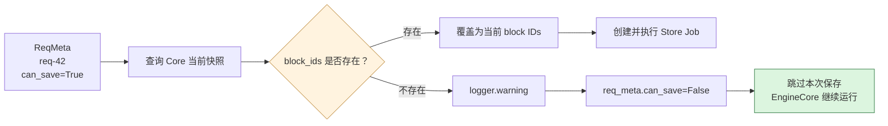

下面用一个具体请求，把代码、数值和“仓库发货”类比放在一起走一遍。

假设：

```
block_size = 16 tokens
请求 ID = req-42
当前已处理 = 48 tokens
Mooncake tracker 里记录的旧 GPU 块 = [101, 102, 103]
```

每个 block 保存 16 个 token：

| Token 范围 | GPU block |
| ---------- | --------- |
| 0～15      | 101       |
| 16～31     | 102       |
| 32～47     | 103       |

类比就是：

| 程序概念                   | 仓库概念                    |
| -------------------------- | --------------------------- |
| 请求 `req-42`              | 一张客户订单                |
| 16-token block             | 一个货箱                    |
| block ID 101               | 101 号货架                  |
| `ReqMeta`                  | 发货单                      |
| `can_save=True`            | 本轮允许发货                |
| `kv_connector_block_state` | Core 提供的当前货架快照     |
| `RequestTracker`           | Mooncake 自己的发货进度账本 |

## 1. 正常流程

Mooncake 的 tracker 可能是：

```
RequestTracker(
    req_id="req-42",
    token_len=48,
    allocated_block_ids=([101, 102, 103],),
    num_saved_tokens=0,
)
```

含义是：

```
订单已经生产了 48 件货物
货物暂时记录在 101、102、103 号货架
Mooncake 认为还没有保存任何 token
```

进入 [ReqMeta.from_request_tracker() (line 767)](/data/home/xli49/lxy/vllm/vllm/distributed/kv_transfer/kv_connector/v1/mooncake/store/data.py:767)。

### 计算保存范围

```
input_token_len = tracker.token_len
```

得到：

```
input_token_len = 48
```

然后：

```
token_ids_start = tracker.num_saved_tokens
```

得到：

```
token_ids_start = 0
```

表示从 token 0 开始保存。

下一个合法 block 边界：

```
chunk_boundary = cdiv(token_ids_start + 1, block_size) * block_size
```

代入：

```
cdiv(0 + 1, 16) × 16
= 1 × 16
= 16
```

当前完整 block 覆盖的 token 数：

```
num_tokens_to_save = input_token_len // block_size * block_size
```

代入：

```
48 // 16 × 16
= 3 × 16
= 48
```

判断：

```
skip_save = num_tokens_to_save < chunk_boundary
```

即：

```
48 < 16 → False
```

所以本轮可以保存：

```
tracker.num_saved_tokens = 48
```

最终产生：

```
ReqMeta(
    req_id="req-42",
    token_len_chunk=48,
    block_ids=([101, 102, 103],),
    can_save=True,
)
```

类比：

>   Mooncake 开出一张发货单：“把 101、102、103 号货架的三个货箱发出去”，并在自己的账本上提前写了“48 件已经安排发货”。

### Core 提供当前快照

如果本轮 `req-42` 正常参与调度，Core 可能生成：

```
KVConnectorBlockState(
    block_ids={
        "req-42": ([201, 202, 203],),
    },
)
```

为什么不是旧的 `[101, 102, 103]`？

因为经过释放、重分配、CoW 或 Mamba block-table 变化，Core 当前真实的块可能已经换成：

```
[201, 202, 203]
```

所以 `_apply_current_save_block_ids()` 会执行：

```
block_ids = block_state.block_ids.get("req-42")
req_meta.block_ids = block_ids
```

最终保存：

```
[201, 202, 203]
```

而不是 Mooncake tracker 中可能过期的：

```
[101, 102, 103]
```

类比：

>   发货员本来拿着旧记录，要去 101～103 号货架取货。出库前，仓库主管告诉他：“货已经搬到 201～203 号货架了。”于是发货员根据最新快照取货。

这就是 #51358 增加当前 block table 校验的目的。

## 2. KV 加载失败以后发生了什么

现在假设 `req-42` 原本准备从 Mooncake 加载 48 个 token：

```
LoadSpec(
    vllm_cached_tokens=0,
    kvpool_cached_tokens=48,
    can_load=True,
)
```

含义：

```
本地命中 0 tokens
Mooncake 远端命中 48 tokens
已经分配目标 GPU block，可以加载
```

但 SSD 或传输失败了：

```
BUFFER_OVERFLOW
transfer error -200/-800
```

Core 的恢复路径会把失败 block 标记为无效，并根据情况：

-   缓存仍然有效的前缀；
-   释放无法使用的 block；
-   将请求重新放回 `WAITING`；
-   等以后重新计算或重新加载。

假设旧 block：

```
101、102、103
```

已经被释放。

此时可能有另一个请求拿到了这些 block：

```
req-99 → [101, 102, 103]
```

类比：

>   `req-42` 的订单加载失败，仓库把 101～103 号货架腾空。随后这几个货架已经放上了 `req-99` 的货物。

## 3. 为什么 Core 的 snapshot 是空的

恢复步骤中，`req-42` 可能只是回到了 `WAITING`，但本轮并没有真正获得计算额度，也没有分配新 block。

Core 构造 snapshot 的代码位于 [scheduler.py (line 1293)](/data/home/xli49/lxy/vllm/vllm/v1/core/sched/scheduler.py:1293)，大致逻辑是：

```
snapshot_req_ids = {
    本轮新请求
}

snapshot_req_ids.update(
    本轮获得新 block 的 cached 请求
)

snapshot_req_ids.update(
    本轮有 boundary-state offload 的请求
)
```

本轮假设：

```
scheduled_new_reqs = []
cached_reqs_with_new_blocks = []
boundary_state_offloads = {}
```

那么：

```
snapshot_req_ids = set()
```

最终：

```
KVConnectorBlockState(
    block_ids={},
)
```

类比：

>   仓库主管本轮只给“真正参与出库”的订单生成货架快照。`req-42` 只是排队等待，没有参与本轮出库，所以当前货架表中没有它。

这本身是合理的。

## 4. Mooncake 为什么又产生了保存请求

Mooncake 还维护着：

```
self._unfinished_requests["req-42"]
self.load_specs["req-42"]
```

于是进入 [pending-load 分支 (line 367)](/data/home/xli49/lxy/vllm/vllm/distributed/kv_transfer/kv_connector/v1/mooncake/store/scheduler.py:367)。

假设恢复过程中的状态变成：

```
LoadSpec(
    vllm_cached_tokens=0,
    kvpool_cached_tokens=48,
    can_load=False,
)
```

这里的 `can_load=False` 表示：

```
远端可能查到了 48 tokens
但当前没有可用于接收这些 KV 的有效 GPU block
```

代码仍然创建 tracker：

```
request_tracker = RequestTracker(
    req_id="req-42",
    token_len=48,
    allocated_block_ids=([101, 102, 103],),
    num_saved_tokens=0,
)
```

然后调用：

```
ReqMeta.from_request_tracker(
    request_tracker,
    block_size=16,
    load_spec=load_spec,
    skip_save=None,
)
```

再代入刚才的计算：

```
token_ids_start = 0
chunk_boundary = 16
num_tokens_to_save = 48
48 < 16 → False
```

只有 `load_spec.can_load=True` 时，代码才强制：

```
skip_save = True
```

见 [data.py (line 784)](/data/home/xli49/lxy/vllm/vllm/distributed/kv_transfer/kv_connector/v1/mooncake/store/data.py:784)。

但现在：

```
load_spec.can_load = False
```

所以没有跳过保存。

接下来代码还会把这个无法执行的 `load_spec` 清掉：

```
if load_spec is not None and load_spec.can_load:
    ...
else:
    load_spec = None
```

最终产生了非常奇怪的结果：

```
ReqMeta(
    req_id="req-42",
    token_len_chunk=48,
    block_ids=([101, 102, 103],),
    can_save=True,
    load_spec=None,
)
```

也就是：

```
原本：等待加载，但当前无法加载
变成：不加载了，改为保存
```

类比：

>   `req-42` 原本是一张“从外仓调货”的入库单。因为当前没有可用货架，入库单无法执行。但系统没有等待或取消它，而是错误地把它转换成了一张出库发货单。

这就是最可疑的状态转换。

## 5. 断言为什么触发

Mooncake 产生了：

```
req_meta.can_save = True
```

因此进入：

```
save_metas = [
    req_meta
    for req_meta in meta.requests
    if req_meta.can_save
]
```

然后查 Core 当前快照：

```
block_ids = block_state.block_ids.get("req-42")
```

但 Core 的快照是：

```
block_state.block_ids = {}
```

所以：

```
block_ids = None
```

最终触发：

```
assert block_ids is not None, (
    "Missing current block table for store request req-42"
)
```

类比就是：

>   Mooncake 发货员拿着 `req-42` 的发货单去找仓库主管。主管说：“这张订单本轮根本没有参与出库，我没有它的货架信息。”发货员没有取消这一张错误发货单，而是按下了整个仓库的紧急停机按钮。

因为这个断言发生在 EngineCore 调度线程，所以结果不是：

```
req-42 保存失败
```

而是：

```
EngineCore 整体退出
所有正在处理的请求返回 500
```

## 6. 为什么不能直接使用旧 block IDs

一种错误“修复”是：

```
if block_ids is None:
    # 继续使用 req_meta.block_ids
    continue
```

此时 `req_meta.block_ids` 是：

```
[101, 102, 103]
```

但它们可能已经分配给：

```
req-99
```

于是 Mooncake 会：

```
以 req-42 的 block hash 为 key
读取 req-99 的 GPU 数据
写入远端存储
```

类比：

>   发货员找不到 `req-42` 的最新货架，就按照旧单去 101～103 号货架取货。但那里现在是 `req-99` 的货物。最后却贴上 `req-42` 的标签发出去。

这种结果比少保存一次更严重：

-   远端 KV key 看起来合法；
-   内容却属于另一个请求；
-   后续 prefix hit 会加载错误 KV；
-   可能表现为乱码、错误输出或失控生成；
-   错误缓存还可能被去重机制长期保留。

所以必须 fail closed：

```
没有当前 block table
→ 不允许保存
```

## 7. 为什么单纯 `can_save=False` 还不够

issue 建议：

```
if block_ids is None:
    req_meta.can_save = False
    continue
```

这可以避免崩溃和错误保存，但还有保存进度问题。

因为在产生 `ReqMeta` 时，代码已经执行：

```
tracker.num_saved_tokens = num_tokens_to_save
```

也就是：

```
tracker.num_saved_tokens = 48
```

类比：

>   发货单虽然被取消了，但 Mooncake 的账本已经写着“48 件货已安排发出”。

下一轮假设请求仍然只有 48 tokens：

```
token_len = 48
num_saved_tokens = 48
```

重新计算：

```
token_ids_start = 48
chunk_boundary = cdiv(49, 16) × 16 = 64
num_tokens_to_save = 48
```

判断：

```
48 < 64 → True
```

因此直接跳过：

```
return None
```

即使下一轮已经拿到了合法的新 block：

```
[301, 302, 303]
```

Mooncake 也不会重新发起保存，因为账本认为前 48 tokens 已经处理过了。

类比：

>   第二天货物重新上架了，但系统看到“已发货 48 件”，便认为不需要再开单。实际上昨天的发货单根本没有执行。

如果请求后来增长到 64 tokens：

```
token_len = 64
num_saved_tokens = 48
```

它可能再次产生保存任务。但如果请求在 48 tokens 处结束，或者 decode KV saving 没开启，这次保存可能永远不会补上。

## 8. 更完整的修复

### 第一层：pending-load 不能变成 store

对于未进入本轮调度的 pending-load 请求：

```
load_spec = self.load_specs.get(request_id)
if load_spec is None:
    continue

if not load_spec.can_load:
    logger.debug(
        "Deferring Mooncake load for %s: no current allocated blocks",
        request_id,
    )
    continue
```

关键点是：

-   `can_load=False` 时不要创建 `can_save=True` 的 metadata；
-   不要轻易 `pop()`，除非确认这个 load spec 已经永久失效；
-   pending-load 分支只负责 load，不负责 store。

类比：

>   无法执行的入库单应该继续等待或明确取消，不能自动转换成出库单。

### 第二层：扩大本轮 snapshot

对于本轮确实参与计算的请求，可以考虑让 Core 为所有 scheduled request 提供快照：

```
snapshot_req_ids.update(num_scheduled_tokens.keys())
```

而不只是“本轮获得了新 block”的请求。

因为：

```
本轮跨过保存边界
```

不一定严格等价于：

```
本轮刚好分配了新 block
```

类比：

>   只要订单本轮要出库，主管就提供当前货架表；不要求它必须在本轮刚搬过货架。

### 第三层：缺表时防御性跳过

即使前两层都修复，最终保存处仍应防御：

```
block_ids = block_state.block_ids.get(req_meta.req_id)
if block_ids is None:
    logger.warning(
        "Skipping Mooncake store for %s: no current block table",
        req_meta.req_id,
    )
    req_meta.can_save = False
    continue
```

这样单请求状态异常不会杀死 EngineCore。

类比：

>   发货员拿不到主管签发的当前货架表，就取消本单，绝不凭旧地址取货。

### 第四层：恢复保存进度

跳过时需要恢复 tracker：

```
tracker = self._request_trackers.get(req_meta.req_id)
if tracker is not None:
    tracker.num_saved_tokens = min(
        tracker.num_saved_tokens,
        req_meta.token_ids_start,
    )

req_meta.can_save = False
```

在这个例子中：

```
原值：num_saved_tokens = 48
恢复：num_saved_tokens = token_ids_start = 0
```

下一轮如果新块是：

```
[301, 302, 303]
```

就可以重新得到：

```
token_ids_start = 0
num_tokens_to_save = 48
can_save = True
```

并使用 Core 的当前快照安全保存。

更好的结构是推迟：

```
tracker.num_saved_tokens = num_tokens_to_save
```

等到满足以下条件后再提交：

```
ReqMeta 已产生
→ 当前 block table 已找到
→ store job 已成功创建并 pin blocks
→ 再推进 num_saved_tokens
```

类比：

>   不要在“打印发货单”时记账为已发货；至少应等仓库确认货架、正式接单后再更新进度。

## 完整修复后的数值流程

第一次失败：

```
req-42
token_len = 48
旧 blocks = [101, 102, 103]
Core snapshot = {}
```

处理：

```
找不到当前 block table
→ can_save=False
→ 不读取 [101,102,103]
→ num_saved_tokens 从 48 恢复为 0
→ EngineCore 继续运行
```

下一次恢复调度：

```
req-42
token_len = 48
新 blocks = [301, 302, 303]
Core snapshot = {
    "req-42": [301, 302, 303]
}
```

重新生成：

```
token_ids_start = 0
num_tokens_to_save = 48
can_save = True
```

最终：

```
保存 [301,302,303]
num_saved_tokens = 48
```

一句话总结：

>   `req-42` 的入库失败后，旧货架 `[101,102,103]` 已经失效，但 Mooncake 错误地开出了一张出库单；Core 因为本轮没有调度它，所以不给货架快照，最终触发致命断言。正确做法是阻止 pending-load 变成 store、缺少当前快照时取消保存并回滚进度，等请求拿到新货架 `[301,302,303]` 后再安全保存。
