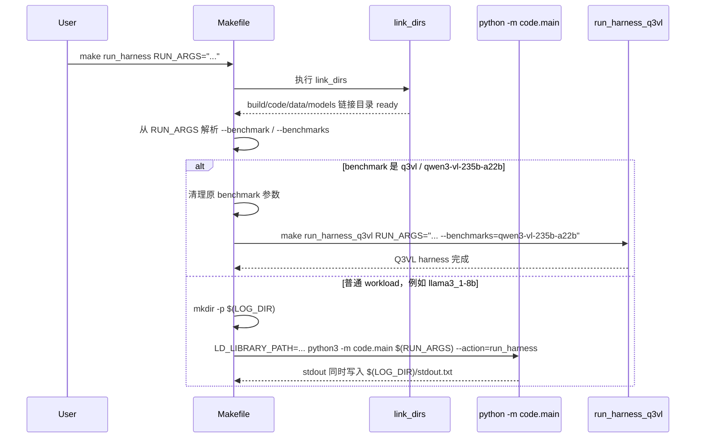
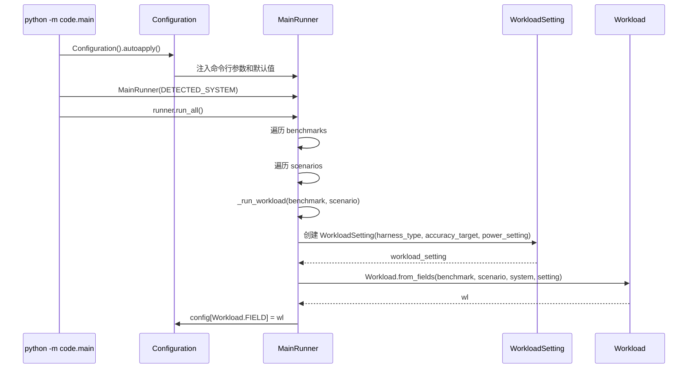
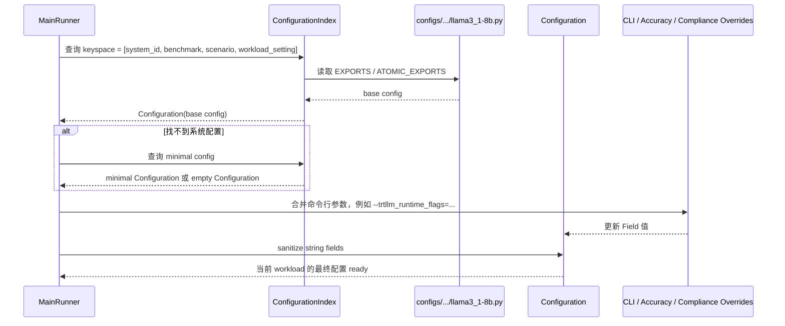
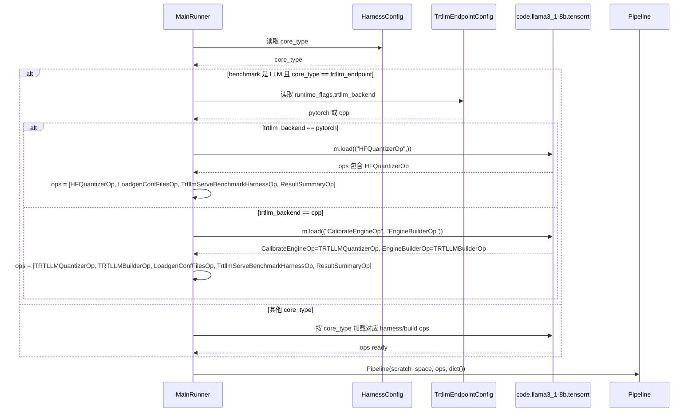
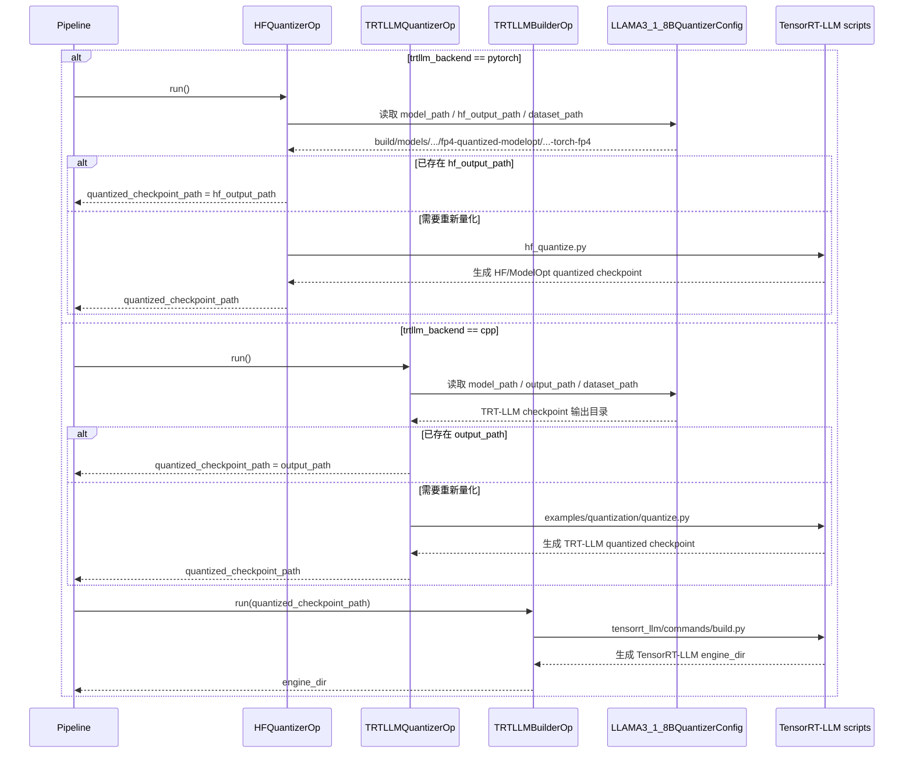
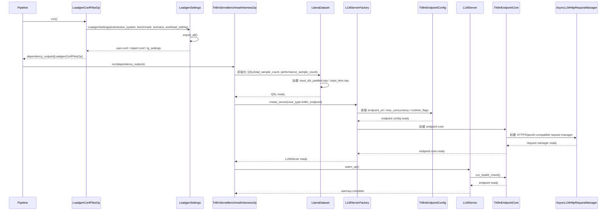
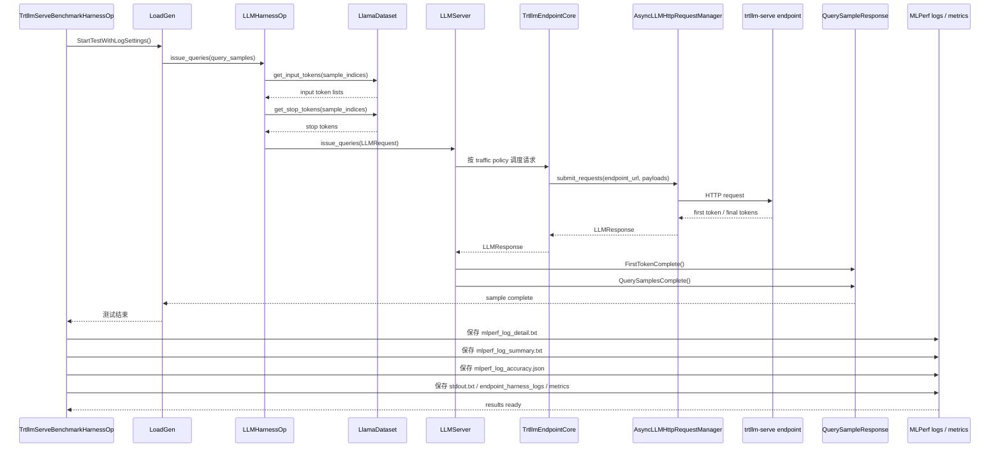

**1. Makefile 启动入口**

```mermaid
sequenceDiagram
    participant User
    participant Makefile
    participant LinkDirs as link_dirs
    participant CodeMain as python -m code.main
    participant Q3VL as run_harness_q3vl

    User->>Makefile: make run_harness RUN_ARGS="..."
    Makefile->>LinkDirs: 执行 link_dirs
    LinkDirs-->>Makefile: build/code/data/models 链接目录 ready

    Makefile->>Makefile: 从 RUN_ARGS 解析 --benchmark / --benchmarks

    alt benchmark 是 q3vl / qwen3-vl-235b-a22b
        Makefile->>Makefile: 清理原 benchmark 参数
        Makefile->>Q3VL: make run_harness_q3vl RUN_ARGS="... --benchmarks=qwen3-vl-235b-a22b"
        Q3VL-->>Makefile: Q3VL harness 完成
    else 普通 workload，例如 llama3_1-8b
        Makefile->>Makefile: mkdir -p $(LOG_DIR)
        Makefile->>CodeMain: LD_LIBRARY_PATH=... python3 -m code.main $(RUN_ARGS) --action=run_harness
        CodeMain-->>Makefile: stdout 同时写入 $(LOG_DIR)/stdout.txt
    end
```

**2. MainRunner 解析 Workload**

```mermaid
sequenceDiagram
    participant CodeMain as python -m code.main
    participant Config as Configuration
    participant MainRunner
    participant WorkloadSetting
    participant Workload

    CodeMain->>Config: Configuration().autoapply()
    Config->>MainRunner: 注入命令行参数和默认值
    CodeMain->>MainRunner: MainRunner(DETECTED_SYSTEM)
    CodeMain->>MainRunner: runner.run_all()

    MainRunner->>MainRunner: 遍历 benchmarks
    MainRunner->>MainRunner: 遍历 scenarios
    MainRunner->>MainRunner: _run_workload(benchmark, scenario)

    MainRunner->>WorkloadSetting: 创建 WorkloadSetting(harness_type, accuracy_target, power_setting)
    WorkloadSetting-->>MainRunner: workload_setting

    MainRunner->>Workload: Workload.from_fields(benchmark, scenario, system, setting)
    Workload-->>MainRunner: wl
    MainRunner->>Config: config[Workload.FIELD] = wl
```

**3. 加载系统配置**

```mermaid
sequenceDiagram
    participant MainRunner
    participant ConfigIndex as ConfigurationIndex
    participant ConfigFile as configs/.../llama3_1-8b.py
    participant Configuration
    participant Overrides as CLI / Accuracy / Compliance Overrides

    MainRunner->>ConfigIndex: 查询 keyspace = [system_id, benchmark, scenario, workload_setting]
    ConfigIndex->>ConfigFile: 读取 EXPORTS / ATOMIC_EXPORTS
    ConfigFile-->>ConfigIndex: base config
    ConfigIndex-->>MainRunner: Configuration(base config)

    alt 找不到系统配置
        MainRunner->>ConfigIndex: 查询 minimal config
        ConfigIndex-->>MainRunner: minimal Configuration 或 empty Configuration
    end

    MainRunner->>Overrides: 合并命令行参数，例如 --trtllm_runtime_flags=...
    Overrides-->>Configuration: 更新 Field 值

    MainRunner->>Configuration: sanitize string fields
    Configuration-->>MainRunner: 当前 workload 的最终配置 ready
```

**4. 选择执行 Pipeline**

```mermaid
sequenceDiagram
    participant MainRunner
    participant HarnessConfig
    participant TrtllmEndpointConfig
    participant BenchmarkModule as code.llama3_1-8b.tensorrt
    participant Pipeline

    MainRunner->>HarnessConfig: 读取 core_type
    HarnessConfig-->>MainRunner: core_type

    alt benchmark 是 LLM 且 core_type == trtllm_endpoint
        MainRunner->>TrtllmEndpointConfig: 读取 runtime_flags.trtllm_backend
        TrtllmEndpointConfig-->>MainRunner: pytorch 或 cpp

        alt trtllm_backend == pytorch
            MainRunner->>BenchmarkModule: m.load(("HFQuantizerOp",))
            BenchmarkModule-->>MainRunner: ops 包含 HFQuantizerOp
            MainRunner->>MainRunner: ops = [HFQuantizerOp, LoadgenConfFilesOp, TrtllmServeBenchmarkHarnessOp, ResultSummaryOp]
        else trtllm_backend == cpp
            MainRunner->>BenchmarkModule: m.load(("CalibrateEngineOp", "EngineBuilderOp"))
            BenchmarkModule-->>MainRunner: CalibrateEngineOp=TRTLLMQuantizerOp, EngineBuilderOp=TRTLLMBuilderOp
            MainRunner->>MainRunner: ops = [TRTLLMQuantizerOp, TRTLLMBuilderOp, LoadgenConfFilesOp, TrtllmServeBenchmarkHarnessOp, ResultSummaryOp]
        end
    else 其他 core_type
        MainRunner->>BenchmarkModule: 按 core_type 加载对应 harness/build ops
        BenchmarkModule-->>MainRunner: ops ready
    end

    MainRunner->>Pipeline: Pipeline(scratch_space, ops, dict())
```

**5. 准备模型产物**

```mermaid
sequenceDiagram
    participant Pipeline
    participant HFQuantizerOp
    participant TRTLLMQuantizerOp
    participant TRTLLMBuilderOp
    participant QuantizerConfig as LLAMA3_1_8BQuantizerConfig
    participant TRTLLM as TensorRT-LLM scripts

    alt trtllm_backend == pytorch
        Pipeline->>HFQuantizerOp: run()
        HFQuantizerOp->>QuantizerConfig: 读取 model_path / hf_output_path / dataset_path
        QuantizerConfig-->>HFQuantizerOp: build/models/.../fp4-quantized-modelopt/...-torch-fp4

        alt 已存在 hf_output_path
            HFQuantizerOp-->>Pipeline: quantized_checkpoint_path = hf_output_path
        else 需要重新量化
            HFQuantizerOp->>TRTLLM: hf_quantize.py
            TRTLLM-->>HFQuantizerOp: 生成 HF/ModelOpt quantized checkpoint
            HFQuantizerOp-->>Pipeline: quantized_checkpoint_path
        end

    else trtllm_backend == cpp
        Pipeline->>TRTLLMQuantizerOp: run()
        TRTLLMQuantizerOp->>QuantizerConfig: 读取 model_path / output_path / dataset_path
        QuantizerConfig-->>TRTLLMQuantizerOp: TRT-LLM checkpoint 输出目录

        alt 已存在 output_path
            TRTLLMQuantizerOp-->>Pipeline: quantized_checkpoint_path = output_path
        else 需要重新量化
            TRTLLMQuantizerOp->>TRTLLM: examples/quantization/quantize.py
            TRTLLM-->>TRTLLMQuantizerOp: 生成 TRT-LLM quantized checkpoint
            TRTLLMQuantizerOp-->>Pipeline: quantized_checkpoint_path
        end

        Pipeline->>TRTLLMBuilderOp: run(quantized_checkpoint_path)
        TRTLLMBuilderOp->>TRTLLM: tensorrt_llm/commands/build.py
        TRTLLM-->>TRTLLMBuilderOp: 生成 TensorRT-LLM engine_dir
        TRTLLMBuilderOp-->>Pipeline: engine_dir
    end
```

**6. 准备 LoadGen 与 Harness**

```mermaid
sequenceDiagram
    participant Pipeline
    participant LoadgenConfFilesOp
    participant LoadgenSettings
    participant HarnessOp as TrtllmServeBenchmarkHarnessOp
    participant LlamaDataset
    participant LLMServerFactory
    participant TrtllmEndpointConfig
    participant LLMServer
    participant EndpointCore as TrtllmEndpointCore
    participant HTTPManager as AsyncLLMHttpRequestManager

    Pipeline->>LoadgenConfFilesOp: run()
    LoadgenConfFilesOp->>LoadgenSettings: LoadgenSettings(submission_system, benchmark, scenario, workload_setting)
    LoadgenSettings->>LoadgenSettings: export_all()
    LoadgenSettings-->>LoadgenConfFilesOp: user.conf / mlperf.conf / lg_settings
    LoadgenConfFilesOp-->>Pipeline: dependency_outputs[LoadgenConfFilesOp]

    Pipeline->>HarnessOp: run(dependency_outputs)
    HarnessOp->>LlamaDataset: 初始化 QSL(total_sample_count, performance_sample_count)
    LlamaDataset->>LlamaDataset: 加载 input_ids_padded.npy / input_lens.npy
    LlamaDataset-->>HarnessOp: QSL ready

    HarnessOp->>LLMServerFactory: create_server(core_type=trtllm_endpoint)
    LLMServerFactory->>TrtllmEndpointConfig: 读取 endpoint_url / max_concurrency / runtime_flags
    TrtllmEndpointConfig-->>LLMServerFactory: endpoint config ready

    LLMServerFactory->>EndpointCore: 创建 endpoint core
    EndpointCore->>HTTPManager: 创建 HTTP/OpenAI-compatible request manager
    HTTPManager-->>EndpointCore: request manager ready
    EndpointCore-->>LLMServerFactory: endpoint core ready
    LLMServerFactory-->>HarnessOp: LLMServer ready

    HarnessOp->>LLMServer: warm_up()
    LLMServer->>EndpointCore: run_health_check()
    EndpointCore-->>LLMServer: endpoint ready
    LLMServer-->>HarnessOp: warmup complete
```

**7. 正式跑测试并收集结果**

```mermaid
sequenceDiagram
    participant HarnessOp as TrtllmServeBenchmarkHarnessOp
    participant LoadGen
    participant LLMHarnessOp
    participant LlamaDataset
    participant LLMServer
    participant EndpointCore as TrtllmEndpointCore
    participant HTTPManager as AsyncLLMHttpRequestManager
    participant Endpoint as trtllm-serve endpoint
    participant QSR as QuerySampleResponse
    participant Logs as MLPerf logs / metrics

    HarnessOp->>LoadGen: StartTestWithLogSettings()
    LoadGen->>LLMHarnessOp: issue_queries(query_samples)

    LLMHarnessOp->>LlamaDataset: get_input_tokens(sample_indices)
    LlamaDataset-->>LLMHarnessOp: input token lists

    LLMHarnessOp->>LlamaDataset: get_stop_tokens(sample_indices)
    LlamaDataset-->>LLMHarnessOp: stop tokens

    LLMHarnessOp->>LLMServer: issue_queries(LLMRequest)
    LLMServer->>EndpointCore: 按 traffic policy 调度请求
    EndpointCore->>HTTPManager: submit_requests(endpoint_url, payloads)
    HTTPManager->>Endpoint: HTTP request
    Endpoint-->>HTTPManager: first token / final tokens
    HTTPManager-->>EndpointCore: LLMResponse
    EndpointCore-->>LLMServer: LLMResponse

    LLMServer->>QSR: FirstTokenComplete()
    LLMServer->>QSR: QuerySamplesComplete()
    QSR-->>LoadGen: sample complete

    LoadGen-->>HarnessOp: 测试结束
    HarnessOp->>Logs: 保存 mlperf_log_detail.txt
    HarnessOp->>Logs: 保存 mlperf_log_summary.txt
    HarnessOp->>Logs: 保存 mlperf_log_accuracy.json
    HarnessOp->>Logs: 保存 stdout.txt / endpoint_harness_logs / metrics
    Logs-->>HarnessOp: results ready
```
