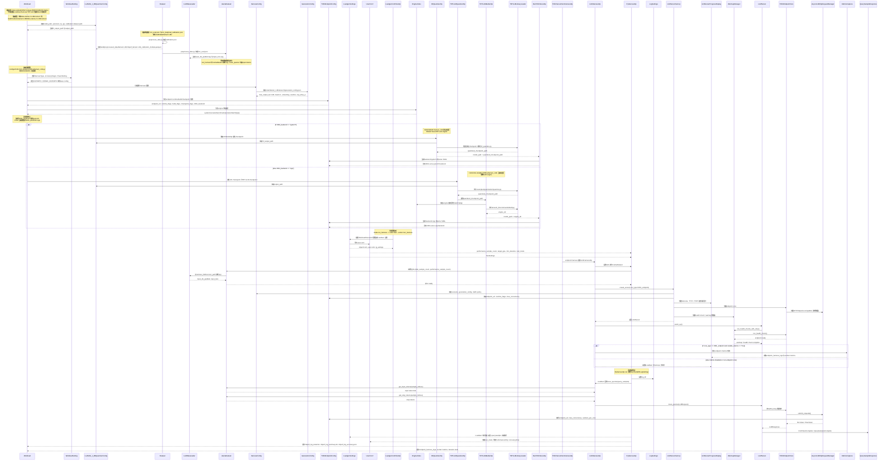

```mermaid
sequenceDiagram
    participant Workload
    participant WorkloadSetting
    participant LLAMA3_1_8BQuantizerConfig
    participant Dataset
    participant LLMDataLoader
    participant LlamaDataset
    participant HarnessConfig
    participant GenerationConfig
    participant TrtllmEndpointConfig
    participant LoadgenSettings
    participant UserConf
    participant LoadgenConfFilesOp
    participant EngineIndex
    participant HFQuantizerOp
    participant TRTLLMQuantizerOp
    participant TRTLLMBuilderOp
    participant TRTLLMLibraryLoader
    participant RunTrtllmServeOp
    participant TrtllmServeClientHarnessOp
    participant LLMHarnessOp
    participant PyHarnessOp
    participant LogSettings
    participant LLMServerFactory
    participant LLMServerProgressDisplay
    participant WarmupManager
    participant LLMServer
    participant TrtllmEndpointCore
    participant AsyncLLMHttpRequestManager
    participant MetricsCapture
    participant QuerySampleResponse

    Note over Workload: 准备环境: make prebuild ENV=release BENCHMARKS=llama<br/>作用是准备 LoadGen/harness/TRTLLM 依赖和 build 链接目录

    Note over Workload: 准备模型: 下载 Meta-Llama-3.1-8B-Instruct 到<br/>build/models/Llama3.1-8B/Meta-Llama-3.1-8B-Instruct
    Workload->>LLAMA3_1_8BQuantizerConfig: 读取 model_path、precision、tp、pp、calibration dataset path
    LLAMA3_1_8BQuantizerConfig-->>Workload: 生成 hf_output_path 与 output_path

    Note over Dataset: 准备原始数据: cnn_eval.json 与 cnn_dailymail_calibration.json<br/>放到 build/data/llama3.1-8b/
    Dataset->>Dataset: preprocess_data.py 处理 calibration json
    Dataset-->>LLAMA3_1_8BQuantizerConfig: 生成 build/preprocessed_data/llama3.1-8b/mlperf_llama3.1-8b_calibration_1k/data.parquet
    Dataset->>LlamaDataset: preprocess_data.py 处理 cnn_eval.json
    LlamaDataset-->>LLMDataLoader: 生成 input_ids_padded.npy 与 input_lens.npy
    Note over LlamaDataset: 预处理数据最终生效点:<br/>run_harness 时 LlamaDataset 加载 npy，issue_queries 时取 input tokens

    Note over Workload: 读取机器配置:<br/>configs/H100-NVL-94GBx1/Offline/llama3_1-8b.py<br/>或 B200/GB200 对应配置
    Workload->>WorkloadSetting: 选择 HarnessType、AccuracyTarget、PowerSetting
    WorkloadSetting-->>Workload: 定位 EXPORTS / ATOMIC_EXPORTS 中的 base config

    Workload->>HarnessConfig: 分发通用 harness 配置
    HarnessConfig->>GenerationConfig: 读取 code/llama3_1-8b/tensorrt/generation_config.json
    GenerationConfig-->>HarnessConfig: max_output_len=128、beam=1、streaming、eos/bos、top_k/top_p
    Workload->>TrtllmEndpointConfig: 分发 endpoint runtime/build/checkpoint 配置
    TrtllmEndpointConfig-->>Workload: endpoint_url、runtime_flags、build_flags、checkpoint_flags、trtllm_backend
    Workload->>EngineIndex: 分发 engine 命名维度
    EngineIndex-->>Workload: system/scenario/benchmark/precision/batch/tp/pp

    Note over Workload: 后端选择核心:<br/>没有写 trtllm_backend 时默认 pytorch<br/>H100 当前配置显式 trtllm_backend=cpp

    alt if trtllm_backend == "pytorch"
        Note over HFQuantizerOp: B200/GB200 llama3_1-8b 默认走这里<br/>不 build TensorRT-LLM engine
        Workload->>HFQuantizerOp: 准备 HF/ModelOpt 量化 checkpoint
        HFQuantizerOp->>LLAMA3_1_8BQuantizerConfig: 获取 hf_output_path
        HFQuantizerOp->>TRTLLMLibraryLoader: 检查已存在 checkpoint 或执行 hf_quantize.py
        TRTLLMLibraryLoader-->>HFQuantizerOp: quantized_checkpoint_path
        HFQuantizerOp-->>RunTrtllmServeOp: model_path = quantized_checkpoint_path
        RunTrtllmServeOp->>TrtllmEndpointConfig: 生成 backend=pytorch 的 extra YAML
        RunTrtllmServeOp-->>TrtllmEndpointConfig: 启动 trtllm-serve pytorch backend
    else else trtllm_backend == "cpp"
        Note over TRTLLMBuilderOp: H100-NVL-94GBx1/Offline/llama3_1-8b 当前走这里<br/>需要 build engine
        Workload->>TRTLLMQuantizerOp: 量化 HF checkpoint 为 TRT-LLM checkpoint
        TRTLLMQuantizerOp->>LLAMA3_1_8BQuantizerConfig: 获取 output_path
        TRTLLMQuantizerOp->>TRTLLMLibraryLoader: 执行 examples/quantization/quantize.py
        TRTLLMLibraryLoader-->>TRTLLMQuantizerOp: quantized_checkpoint_path
        TRTLLMQuantizerOp->>TRTLLMBuilderOp: 提供 quantized_checkpoint_path
        TRTLLMBuilderOp->>EngineIndex: 获取 engine 输出目录与 batch/tp/pp
        TRTLLMBuilderOp->>TRTLLMLibraryLoader: 执行 tensorrt_llm/commands/build.py
        TRTLLMLibraryLoader-->>TRTLLMBuilderOp: engine_dir
        TRTLLMBuilderOp-->>RunTrtllmServeOp: model_path = engine_dir
        RunTrtllmServeOp->>TrtllmEndpointConfig: 生成 backend=cpp 的 extra YAML
        RunTrtllmServeOp-->>TrtllmEndpointConfig: 启动 trtllm-serve cpp backend
    end

    Note over LoadgenConfFilesOp: 测试配置生成:<br/>make run_harness -> code.main --action=run_harness
    LoadgenConfFilesOp->>LoadgenSettings: 根据 Workload/Scenario/配置生成 LoadGen 设置
    LoadgenSettings->>UserConf: 导出 user.conf
    LoadgenSettings-->>LoadgenConfFilesOp: mlperf.conf、user.conf、lg_settings
    UserConf-->>PyHarnessOp: performance_sample_count、target_qps、min_duration、test_mode
    LoadgenSettings-->>PyHarnessOp: TestSettings

    TrtllmServeClientHarnessOp->>LLMHarnessOp: endpoint harness 继承 LLMHarnessOp
    LLMHarnessOp->>PyHarnessOp: 设置 QSL 类为 LlamaDataset
    PyHarnessOp->>LlamaDataset: 实例化 QSL(total_sample_count, performance_sample_count)
    LlamaDataset->>LLMDataLoader: 从 harness_fields.tensor_path 加载 npy
    LLMDataLoader-->>LlamaDataset: input_ids_padded、input_lens
    LlamaDataset-->>PyHarnessOp: QSL ready

    LLMHarnessOp->>LLMServerFactory: create_server(core_type=trtllm_endpoint)
    LLMServerFactory->>HarnessConfig: 读取 scenario、generation_config、traffic policy
    LLMServerFactory->>TrtllmEndpointConfig: 读取 endpoint_url、runtime_flags、max_concurrency
    LLMServerFactory->>LLMServerProgressDisplay: 创建 tokens/s、TTFT、TPOT 进度/指标显示
    LLMServerFactory->>TrtllmEndpointCore: 创建 endpoint core
    TrtllmEndpointCore->>AsyncLLMHttpRequestManager: 创建 HTTP/OpenAI-compatible 请求管理器
    LLMServerFactory->>WarmupManager: 创建 health check / warmup 管理器
    LLMServerFactory-->>LLMHarnessOp: 返回 LLMServer

    LLMHarnessOp->>LLMServer: warm_up()
    LLMServer->>WarmupManager: run_health_checks_with_retry()
    WarmupManager->>TrtllmEndpointCore: run_health_check()
    TrtllmEndpointCore-->>WarmupManager: endpoint ready
    WarmupManager-->>LLMServer: warmup / health check complete

    alt if core_type == trtllm_endpoint and enable_metrics == True
        LLMHarnessOp->>MetricsCapture: 启动 endpoint /metrics 轮询
        MetricsCapture-->>LLMServerProgressDisplay: 采集 endpoint_harness_logs 与 worker metrics
    else else metrics disabled or non-endpoint core
        LLMHarnessOp-->>LLMServerProgressDisplay: 只保留 LoadGen 与 harness 侧日志
    end

    Note over PyHarnessOp: 真正触发测试:<br/>PyHarnessOp.run 调用 StartTestWithLogSettings
    PyHarnessOp->>LogSettings: 设置 log_dir
    PyHarnessOp->>LLMHarnessOp: LoadGen 回调 issue_queries(query_samples)

    LLMHarnessOp->>LlamaDataset: get_input_tokens(sample_indices)
    LlamaDataset-->>LLMHarnessOp: input token lists
    LLMHarnessOp->>LlamaDataset: get_stop_tokens(sample_indices)
    LlamaDataset-->>LLMHarnessOp: stop tokens
    LLMHarnessOp->>LLMServer: issue_queries(LLMRequest)

    LLMServer->>TrtllmEndpointCore: 按 traffic policy 调度请求
    TrtllmEndpointCore->>AsyncLLMHttpRequestManager: submit_requests()
    AsyncLLMHttpRequestManager->>TrtllmEndpointConfig: 使用 endpoint_url、max_concurrency、workers_per_core
    AsyncLLMHttpRequestManager-->>TrtllmEndpointCore: first token / final token
    TrtllmEndpointCore-->>LLMServer: LLMResponse
    LLMServer->>QuerySampleResponse: FirstTokenComplete / QuerySamplesComplete

    PyHarnessOp-->>LoadgenSettings: LoadGen 统计性能、延迟、query/sample 完成情况
    PyHarnessOp-->>UserConf: 依据 test_mode 判断 PerformanceOnly / AccuracyOnly
    PyHarnessOp-->>Workload: 保存 mlperf_log_detail.txt、mlperf_log_summary.txt、mlperf_log_accuracy.json
    MetricsCapture-->>Workload: 保存 endpoint_harness_logs、worker metrics、iteration stats
```
