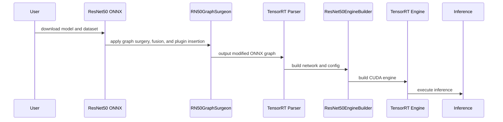
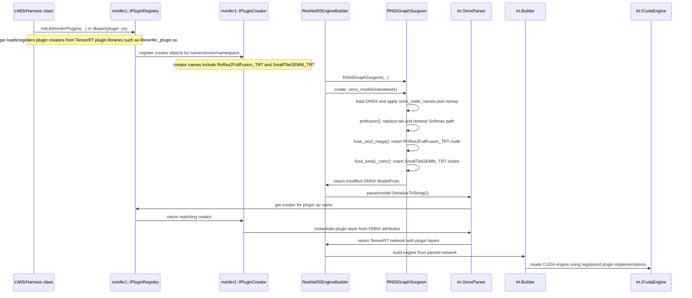
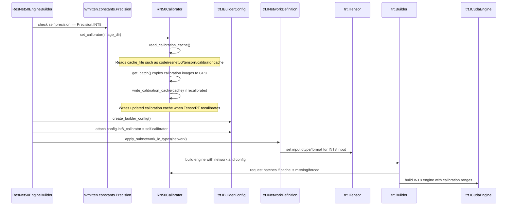
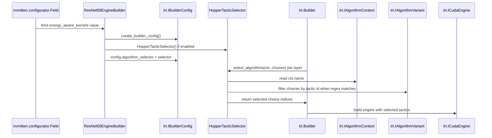

# MLCommons NVIDIA-ResNet50 Workflow

The diagrams show the full pipeline timing and where each optimization step fits into the overall flow.


<br>

## 1. Overview

The implementation uses NVIDIA TensorRT to optimize ResNet50 with graph surgery, layer fusion, INT8 calibration, and optional tactic selection for improved performance.
<br>

## 2. Full Pipeline Flow

The full flow covers model download, ONNX parsing, graph modification, builder configuration, engine build, calibration, and benchmark execution.

- Step 1: Download the ResNet50 ONNX model and ImageNet dataset.
- Step 2: Use `RN50GraphSurgeon` to modify the ONNX graph before parsing.
- Step 3: Create the TensorRT network with `ResNet50EngineBuilder`.
- Step 4: Configure INT8 calibration and optional tactic selector.
- Step 5: Build the TensorRT engine and run inference in the target scenario.
<br>
## 3. Optimization Mechanisms

### 1) Graph surgery and fusion




The code uses `RN50GraphSurgeon` to rewrite the ResNet50 ONNX graph before TensorRT parses it. It remaps node names, rewrites the classification tail, removes the original Softmax/ArgMax output path, and replaces selected ResNet blocks with TensorRT plugin nodes. The explanation below follows the same order as the sequence diagram.

Graph surgery class: `RN50GraphSurgeon`

Graph surgery location: `closed/NVIDIA/src/resnet50/tensorrt/rn50_graphsurgeon.py`

Engine builder class: `ResNet50EngineBuilder`

Engine build location: `closed/NVIDIA/src/resnet50/tensorrt/builder.py`

1> ==`LWIS/Harness class` triggers TensorRT plugin creator registration.==

 `RN50GraphSurgeon` does not directly call `ctypes.CDLL("libnvinfer_plugin.so")` or `trt.init_libnvinfer_plugins(...)`. The trigger is an ==initialization or dynamic-load call==, such as `initLibNvInferPlugins(...)` or `dlopen(...)`. Those calls cause TensorRT plugin libraries such as `libnvinfer_plugin.so` to register their plugin creators with TensorRT.

The same repository shows the TensorRT built-in plugin initialization mechanism explicitly in the runtime harness:

```cpp
// closed/NVIDIA/src/harness/lwis/src/lwis.cpp

// Initialize TensorRT's built-in plugin creators.
// This is the C++ equivalent of trt.init_libnvinfer_plugins(...).
initLibNvInferPlugins(&gLogger.getTRTLogger(), "");
```

For extra user-supplied plugin libraries, the harness can also trigger registration by loading `.so` files from the `--plugins` flag:

```cpp
// closed/NVIDIA/src/harness/harness_default/main_default.cc

std::vector<std::string> plugin_files = splitString(FLAGS_plugins, ",");
for (auto& s : plugin_files)
{
    // dlopen() loads the shared object. A TensorRT plugin .so usually
    // registers its plugin creator when the library is loaded.
    void* dlh = dlopen(s.c_str(), RTLD_LAZY);
}
```

Common TensorRT plugin library locations:

```text
/usr/lib/x86_64-linux-gnu/libnvinfer_plugin.so
/usr/local/tensorrt/lib/libnvinfer_plugin.so
```

2> `nvinfer1::IPluginRegistry` stores registered `nvinfer1::IPluginCreator` objects.

A plugin creator is the registered factory object for one plugin type. The plugin library provides the implementation and registration code; later, TensorRT uses the creator to instantiate a plugin layer from a plugin name, version, namespace, and the ONNX node attributes.

For ResNet50 specifically, `RnRes2FullFusion_TRT` and `SmallTileGEMM_TRT` are described as TensorRT-provided plugins. The key requirement is that TensorRT's plugin registry contains those creators before ONNX parsing/building needs them.

3> `ResNet50EngineBuilder` creates `RN50GraphSurgeon`.

```python
# closed/NVIDIA/src/resnet50/tensorrt/builder.py

# TensorRT parser is created before graph surgery output is parsed.
parser = trt.OnnxParser(network, self.logger)

# RN50GraphSurgeon owns the ONNX rewrite. It receives the original model path,
# precision, calibration cache, GPU SM, and device type.
rn50_gs = RN50GraphSurgeon(
    self.model_path,
    self.precision,
    self.cache_file,
    compute_sm,
    self.device_type,
    self.need_calibration,
    disable_beta1_smallk=self.disable_beta1_smallk,
)
```

4> `RN50GraphSurgeon` ==loads the original ResNet50 ONNX and remaps node names.==

The remap file is loaded in `RN50GraphSurgeon.__init__()` before the parent `ONNXNetwork` object imports and normalizes the graph.

```python
# closed/NVIDIA/src/resnet50/tensorrt/rn50_graphsurgeon.py

with (Path(__file__).parent.resolve() / "onnx_node_names.json").open("r") as f:
    op_name_remap = json.load(f)

super().__init__(
    onnx_path,
    precision,
    calib_cache_path=cache_file,
    compute_sm=compute_sm,
    op_name_remap=op_name_remap,
    no_fusions=no_fuse,
)
```

5> `RN50GraphSurgeon.prefusion()` rewrites the classification tail before plugin fusion happens.

This step replaces the original tail with `AveragePool + FC/Conv + TopK + Cast` and removes the original Softmax/ArgMax output path. This is normal ONNX graph rewriting; it is not a `.so` plugin load.

```python
# closed/NVIDIA/src/resnet50/tensorrt/rn50_graphsurgeon.py

def prefusion(self):
    # INT8 uses a 1x1 Conv replacement for the final FC path.
    fc_impl = self.add_fc
    if self.precision == Precision.INT8:
        fc_impl = self.add_conv

    # These helpers build the new tail and then remove the old
    # Softmax/ArgMax/Identity output path.
    policy = [
        self.add_squeeze,
        fc_impl,
        self.add_topk,
        self.add_cast,
        self.remove_obsolete,
    ]

    for _f in policy:
        _f()
```

6> `RN50GraphSurgeon.fuse_res2_mega()` replaces the full `res2` stage with one ONNX plugin node.

The plugin node op type is `RnRes2FullFusion_TRT`. The node/layer name is `RES2_FULL_FUSION`.

```python
# closed/NVIDIA/src/resnet50/tensorrt/rn50_graphsurgeon.py

def fuse_res2_mega(self):
    # This is the ONNX node name used for the fused res2 stage.
    # It is useful for reading the rewritten graph and TensorRT layer names.
    plugin_name = "RES2_FULL_FUSION"

    # The input is the tensor entering the original res2 stage.
    plugin_inp = [op_list[0].inputs[0]]

    # The output reuses the tensor produced by the original res2c_relu node.
    # Reusing this output keeps the downstream graph connected.
    plugin_out = [op_list[-1].outputs[0]]

    # The weights, biases, scales, rescale tensors, and dynamic ranges become
    # ONNX node attributes. TensorRT passes these fields to the plugin creator.
    attrs = {
        "plugin_version": "1",
        "plugin_namespace": "",
    }
    attrs.update(plugin_field_dict)

    # This inserts the plugin node into ONNX.
    # Important: RnRes2FullFusion_TRT is the TensorRT plugin op type.
    # RES2_FULL_FUSION is the node/layer name.
    self.graph.RES2PLUGIN(
        "RnRes2FullFusion_TRT",
        plugin_name,
        plugin_inp,
        plugin_out,
        attrs,
    )
```

7> `RN50GraphSurgeon.fuse_beta1_conv()` replaces selected `res3/res4/res5 branch2c conv + residual add + ReLU` patterns with `SmallTileGEMM_TRT` plugin nodes.

 `SmallTileGEMM_TRT` is both the plugin op type TensorRT must resolve and the prefix used in generated plugin layer names.

```python
# closed/NVIDIA/src/resnet50/tensorrt/rn50_graphsurgeon.py

def fuse_beta1_conv(self):
    # This is the plugin op type that TensorRT must find in the registry.
    plugin_op_name = "SmallTileGEMM_TRT"

    for op_names_tuple in op_names_list:
        # Each plugin node replaces one branch2c conv + residual add + ReLU
        # pattern in res3/res4/res5.
        plugin_layer_name = (
            f"{plugin_op_name}_{op_names_tuple.conv_in}_conv_residual_relu"
        )

        # Inputs are the conv input and the residual tensor.
        plugin_inp = [
            op_dict[op_names_tuple.conv_in].inputs[0],
            op_dict[op_names_tuple.residual].inputs[1],
        ]

        # Output reuses the original ReLU output tensor so later layers remain
        # connected to the same tensor name.
        plugin_out = [op_dict[op_names_tuple.relu_out].outputs[0]]

        attrs = {
            "plugin_version": "1",
            "plugin_namespace": "",
        }
        attrs.update(plugin_field_dict)

        # This inserts a SmallTileGEMM_TRT plugin node into the ONNX graph.
        self.graph.BETA1SmallKPlugin(
            plugin_op_name,
            plugin_layer_name,
            plugin_inp,
            plugin_out,
            attrs,
        )
```

8> `RN50GraphSurgeon` returns the modified ==ONNX `ModelProto` to `ResNet50EngineBuilder`==.

```python
# closed/NVIDIA/src/resnet50/tensorrt/builder.py

# create_onnx_model() runs prefusion() and, when enabled, fuse_ops().
# The returned object is an in-memory ONNX ModelProto, not a TensorRT engine.
model = rn50_gs.create_onnx_model(subnetwork=subnet)
```

9> `ResNet50EngineBuilder` passes the modified ONNX model into `trt.OnnxParser`.

```python
# closed/NVIDIA/src/resnet50/tensorrt/builder.py

# This is the point where TensorRT sees the rewritten ONNX graph.
success = parser.parse(model.SerializeToString())
```

10> `trt.OnnxParser` looks up plugin op names in `nvinfer1::IPluginRegistry` and gets matching `nvinfer1::IPluginCreator` objects.

When the ONNX parser sees plugin op types such as `RnRes2FullFusion_TRT` and `SmallTileGEMM_TRT`, it looks them up in the TensorRT plugin registry. If matching creators are registered, TensorRT can create plugin layers using the attributes embedded in the ONNX nodes. If a creator is missing, parsing/building the engine will fail around the plugin node.

11> `ResNet50EngineBuilder` asks `trt.Builder` to build the TensorRT engine using those plugin implementations.

After parsing succeeds, the resulting TensorRT network contains plugin layers. The engine build step compiles/selects executable implementations for those layers, backed by the TensorRT plugin library.

12> Verification code can query ==`nvinfer1::IPluginRegistry` to confirm both plugin creators are registered.==

Run this inside the TensorRT or MLPerf container:

```python
import tensorrt as trt

logger = trt.Logger(trt.Logger.WARNING)

# Register plugins from TensorRT's plugin library, normally backed by
# libnvinfer_plugin.so loaded by the TensorRT Python package/runtime.
trt.init_libnvinfer_plugins(logger, "")

targets = {"RnRes2FullFusion_TRT", "SmallTileGEMM_TRT"}
found = set()

for creator in trt.get_plugin_registry().plugin_creator_list:
    if creator.name in targets:
        found.add(creator.name)
        print(
            f"FOUND: {creator.name}, "
            f"version={creator.plugin_version}, "
            f"namespace={creator.plugin_namespace}"
        )

for name in sorted(targets - found):
    print(f"MISSING: {name}")
```


### 2) Precision and calibration



The builder supports INT8 precision through two connected mechanisms: it creates an `RN50Calibrator` when `self.precision == Precision.INT8`, then attaches that calibrator to TensorRT's builder config. TensorRT either reads the existing calibration cache or asks the calibrator for batches and writes a new cache.

Location: `closed/NVIDIA/src/resnet50/tensorrt/builder.py`

Calibrator location: `closed/NVIDIA/src/resnet50/tensorrt/calibrator.py`

1> `ResNet50EngineBuilder.set_calibrator()` only creates `RN50Calibrator` for INT8 builds.

```python
# closed/NVIDIA/src/resnet50/tensorrt/builder.py

def set_calibrator(self, image_dir):
    # FP32/FP16 builds do not use INT8 calibration.
    if self.precision != Precision.INT8:
        return

    # RN50Calibrator owns calibration images, GPU input memory,
    # and the calibration cache file path.
    self.calibrator = RN50Calibrator(
        calib_batch_size=self.calib_batch_size,
        calib_max_batches=self.calib_max_batches,
        force_calibration=self.force_calibration,
        cache_file=self.cache_file,
        calib_data_map=self.calib_data_map,
        image_dir=image_dir,
    )
```

2> `RN50Calibrator` reads calibration image names, loads `.npy` tensors, allocates GPU memory, and reuses the cache when possible.

```python
# closed/NVIDIA/src/resnet50/tensorrt/calibrator.py

class RN50Calibrator(trt.IInt8EntropyCalibrator2):
    def __init__(self, calib_batch_size=1, calib_max_batches=500,
                 force_calibration=False,
                 cache_file="code/resnet50/tensorrt/calibrator.cache",
                 image_dir="build/preprocessed_data/imagenet/ResNet50/fp32",
                 calib_data_map="data_maps/imagenet/cal_map.txt"):
        trt.IInt8EntropyCalibrator2.__init__(self)

        self.calib_batch_size = calib_batch_size
        self.calib_max_batches = calib_max_batches
        self.force_calibration = force_calibration
        self.cache_file = cache_file

        # calib_data_map lists which ImageNet samples are used for calibration.
        image_list = []
        with open(calib_data_map) as f:
            for line in f:
                image_list.append(line.split()[0])

        # Calibration samples are preprocessed .npy tensors.
        self.batches = np.stack([
            np.load(os.path.join(image_dir, file_name + ".npy"))
            for file_name in image_list
        ])

        # TensorRT expects device pointers from get_batch().
        self.device_input = cudart.cudaMalloc(
            self.calib_batch_size * IMAGE_C * IMAGE_H * IMAGE_W * 4
        )

        # If cache exists and force_calibration is false, TensorRT can reuse it.
        if not self.force_calibration and os.path.exists(self.cache_file):
            with open(self.cache_file, "rb") as f:
                self.cache = f.read()
        else:
            self.cache = None
```

3> During calibration, TensorRT calls `get_batch()` until it returns `None`.

```python
# closed/NVIDIA/src/resnet50/tensorrt/calibrator.py

def get_batch(self, names):
    if self.current_idx < self.calib_max_batches:
        batch = np.ascontiguousarray(
            self.batches[self.current_idx: self.current_idx + self.calib_batch_size]
        )

        # Copy one calibration batch to GPU memory.
        cudart.cudaMemcpy(
            self.device_input,
            batch,
            batch.size * batch.itemsize,
            cudart.cudaMemcpyKind.cudaMemcpyHostToDevice,
        )
        self.current_idx += 1

        # TensorRT consumes this device pointer as calibration input.
        return [int(self.device_input)]

    # Returning None tells TensorRT there are no more calibration batches.
    return None
```

4> The calibration cache is how the measured INT8 ranges survive across runs.

```python
# closed/NVIDIA/src/resnet50/tensorrt/calibrator.py

def read_calibration_cache(self):
    # If this returns bytes, TensorRT can skip recalibration.
    return self.cache

def write_calibration_cache(self, cache):
    # TensorRT writes calibration results here after collecting ranges.
    with open(self.cache_file, "wb") as f:
        f.write(cache)
```

5> `ResNet50EngineBuilder.create_builder_config()` attaches the calibrator to TensorRT's builder config.

```python
# closed/NVIDIA/src/resnet50/tensorrt/builder.py

def create_builder_config(self, *args, **kwargs):
    builder_config = super().create_builder_config(*args, **kwargs)

    # This is the handoff point: TensorRT sees the RN50Calibrator here.
    builder_config.int8_calibrator = self.calibrator

    if self.energy_aware_kernels:
        builder_config.algorithm_selector = HopperTacticSelector()
    return builder_config
```

6> `ResNet50EngineBuilder.apply_subnetwork_io_types()` adjusts the parsed network I/O after ONNX parsing.

For the normal full-network path, the graph surgery tail produces TopK value and TopK index. The builder unmarks the TopK value output and keeps only the class index output. Then it sets the input tensor dtype/format to match the configured input data.

```python
# closed/NVIDIA/src/resnet50/tensorrt/builder.py

def apply_subnetwork_io_types(self, network: trt.INetworkDefinition):
    tensor_in = network.get_input(0)

    # Keep topk_layer_output_index and discard topk_layer_output_value.
    self._discard_topk_output_value(network)

    # For INT8 input, _set_tensor_format() sets tensor.dtype = trt.int8
    # and chooses LINEAR / CHW4 / DLA_HWC4 based on input_format and DLA use.
    self._set_tensor_format(tensor_in, use_dla=self.dla_enabled)
```

7> When `trt.Builder` builds the engine, TensorRT uses `builder_config.int8_calibrator` if calibration ranges are needed.

If a valid cache exists, TensorRT can use it directly. If no cache exists, or `force_calibration` is enabled, TensorRT calls `RN50Calibrator.get_batch()`, computes activation ranges, and then calls `write_calibration_cache()`.

### 3) Tactic selection



Tactic selection is optional. It is enabled by the `energy_aware_kernels` config field and implemented by `HopperTacticSelector(trt.IAlgorithmSelector)`. When attached to `builder_config.algorithm_selector`, TensorRT calls `select_algorithms()` during engine build for each layer context.

Location: `closed/NVIDIA/src/resnet50/tensorrt/builder.py`

Config field location: `closed/NVIDIA/src/fields/models.py`

1> The config field `energy_aware_kernels` controls whether tactic selection is enabled.

```python
# closed/NVIDIA/src/fields/models.py

energy_aware_kernels = Field(
    "energy_aware_kernels",
    description="Override layers with energy aware kernel selection",
    from_string=bool,
)
```

2> `ResNet50EngineBuilder.__init__()` stores the flag on the builder.

```python
# closed/NVIDIA/src/resnet50/tensorrt/builder.py

def __init__(..., energy_aware_kernels: bool = False, **kwargs):
    ...
    self.energy_aware_kernels = energy_aware_kernels
```

3> `create_builder_config()` attaches `HopperTacticSelector` only when the flag is enabled.

```python
# closed/NVIDIA/src/resnet50/tensorrt/builder.py

def create_builder_config(self, *args, **kwargs):
    builder_config = super().create_builder_config(*args, **kwargs)
    builder_config.int8_calibrator = self.calibrator

    # This is the hook that makes TensorRT call select_algorithms()
    # during engine build.
    if self.energy_aware_kernels:
        builder_config.algorithm_selector = HopperTacticSelector()

    return builder_config
```

4> `HopperTacticSelector.select_algorithms()` receives the current layer context and the candidate tactics.

```python
# closed/NVIDIA/src/resnet50/tensorrt/builder.py

class HopperTacticSelector(trt.IAlgorithmSelector):
    def select_algorithms(self, ctx, choices):
        print("\nselect algorithms: " + ctx.name)

        # Match TensorRT layer names against the ResNet50 regex table.
        resnet50_layer_pattern = re.compile('|'.join(resnet50_tactic_dict))

        if re.search(resnet50_layer_pattern, ctx.name):
            print("Matched")
            for layer_regex, tactic_id in resnet50_tactic_dict.items():
                if re.match(layer_regex, ctx.name):
                    # Keep only choices whose tactic id matches the table.
                    filtered_idxs = [
                        idx
                        for idx, choice in enumerate(choices)
                        if choice.algorithm_variant.tactic == int(tactic_id, 16)
                    ]
                    to_ret = filtered_idxs
                    print("Filtered id: ", tactic_id)
        else:
            # For layers not in the table, allow TensorRT to choose normally.
            to_ret = [idx for idx, _ in enumerate(choices)]

        return to_ret
```

5> `resnet50_tactic_dict` is the policy table that maps layer-name regexes to tactic IDs.

```python
# closed/NVIDIA/src/resnet50/tensorrt/builder.py

resnet50_tactic_dict = {
    "res3a_branch2a \\+ res3a_branch2a_relu.*": "0x266a23a6dae5e9dd",
    "res3a_branch1.*": "0xdf9672025c2e4e0b",
    "res3a_branch2b \\+ res3a_branch2b_relu.*": "0x11e97a6f7b62ebde",
    # ... more ResNet50 layer regex -> tactic id entries ...
    "fc_replaced.*": "0x4ce968916c7f46ae",
}
```

6> During `trt.Builder` engine build, TensorRT calls the selector for layer contexts.

If `ctx.name` matches a regex in `resnet50_tactic_dict`, the selector filters candidate algorithms to the fixed tactic ID. If it does not match, the selector returns every candidate index and TensorRT keeps its normal tactic choice behavior.

### 4) Dynamic shape handling

The ResNet50 implementation defines subnetworks using `gs.Tensor.DYNAMIC` for tensor shape flexibility, but there is no explicit TensorRT `OptimizationProfile` creation in the code.

- Location: `closed/NVIDIA/src/resnet50/tensorrt/rn50_graphsurgeon.py`
- Key concept: `subnetwork_map` with dynamic tensor descriptors
<br>
## 4. Configuration and execution order

The execution order is: model selection -> graph surgeon rewrite -> parser -> network type configuration -> builder config -> engine build -> inference.

1. `ResNet50EngineBuilder.__init__()` sets `precision`, `cache_file`, and `energy_aware_kernels`.
2. `ResNet50EngineBuilder.create_network()` calls `RN50GraphSurgeon.create_onnx_model()` and parses the output.
3. `create_builder_config()` attaches `int8_calibrator` and optional `algorithm_selector`.
4. `builder.build_cuda_engine()` builds the final engine.
5. Runtime inference uses the built engine and data preprocessor.
<br>
## 5. Example code snippets

### 1) Tactic selector example

```python
import re
import tensorrt as trt

resnet50_tactic_dict = {
    "res3a_branch2a \+ res3a_branch2a_relu.*": "0x266a23a6dae5e9dd",
    "res3a_branch1.*": "0xdf9672025c2e4e0b",
}

class HopperTacticSelector(trt.IAlgorithmSelector):
    def select_algorithms(self, ctx, choices):
        print("select algorithms: " + ctx.name)
        resnet50_layer_pattern = re.compile('|'.join(resnet50_tactic_dict))
        if re.search(resnet50_layer_pattern, ctx.name):
            print("Matched")
            for layer_regex, tactic_id in resnet50_tactic_dict.items():
                if re.match(layer_regex, ctx.name):
                    filtered_idxs = [
                        idx for idx, choice in enumerate(choices)
                        if choice.algorithm_variant.tactic == int(tactic_id, 16)
                    ]
                    print("Filtered id:", tactic_id)
                    return filtered_idxs
        return [idx for idx, _ in enumerate(choices)]

    def report_algorithms(self, ctx, choices):
        pass

# Output comments:
# This selector prints the layer context and chooses a fixed tactic when the layer name matches.
```

### 2) Calibration setup example

```python
from nvmitten.constants import Precision

class ExampleBuilder:
    def __init__(self, precision):
        self.precision = precision
        self.calib_batch_size = 64
        self.calib_max_batches = 100
        self.force_calibration = False
        self.cache_file = "calibrator.cache"
        self.calib_data_map = "data_maps/imagenet/cal_map.txt"

    def set_calibrator(self, image_dir):
        if self.precision != Precision.INT8:
            return
        self.calibrator = RN50Calibrator(
            calib_batch_size=self.calib_batch_size,
            calib_max_batches=self.calib_max_batches,
            force_calibration=self.force_calibration,
            cache_file=self.cache_file,
            calib_data_map=self.calib_data_map,
            image_dir=image_dir,
        )

# Output comments:
# Calibration only runs when INT8 precision is selected, otherwise it is skipped.
```

### 3) Graph fusion example

```python
# Pseudocode for Res2 fusion plugin insertion

op_names_list = [
    "res2a_branch1",
    "res2a_branch2a", "res2a_branch2a_relu",
    "res2a_branch2b", "res2a_branch2b_relu",
    "res2a_branch2c", "res2a", "res2a_relu",
    # ... continue for res2b and res2c ...
]

# create plugin input/output and dynamic ranges
# insert RES2_FULL_FUSION plugin into the graph

# Output comments:
# The graph surgeon replaces a long chain of Res2 operators with one fused plugin node.
```

### 4) Order of build and run

```python
# 1. Create builder object
builder = ResNet50EngineBuilder(precision=Precision.INT8, energy_aware_kernels=True)
# 2. Set calibrator for INT8
builder.set_calibrator("imagenet/ResNet50/fp32")
# 3. Build TensorRT engine
engine = builder.build_engine()
# 4. Run inference with input data
results = engine.infer(batch_input)
print(results)
# Output comments:
# The build order ensures graph surgery and calibration are applied before final engine creation.
```

<br>
<br>
