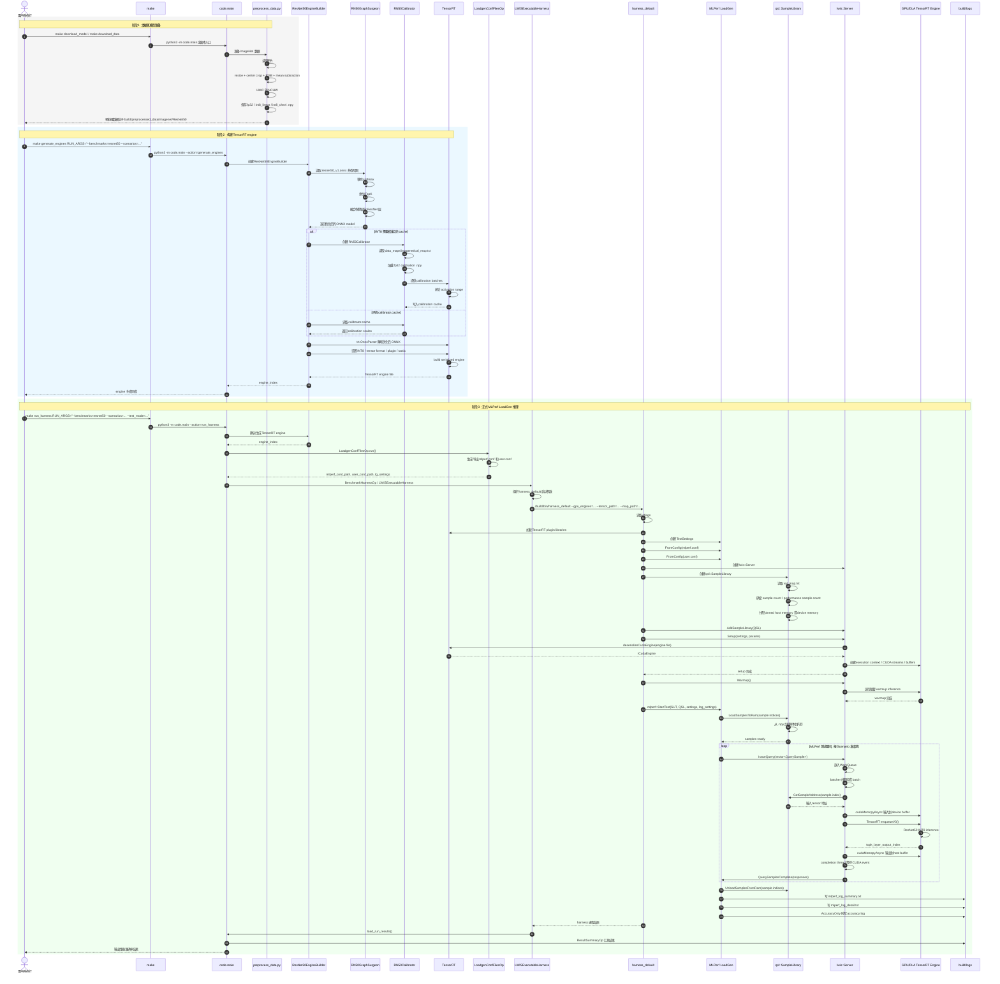

# MLPerf Inference v6.0 — ResNet50 on H100-NVL-94GBx1

End-to-end guide for running the **ResNet50 Offline** benchmark from
`inference_results_v6.0` (NVIDIA closed division) on a single
**H100-NVL-94GB** GPU, using an Apptainer container.

---

## 1. Prerequisites

- A Linux host with a working NVIDIA driver and an H100-NVL-94GB visible to `nvidia-smi`.
- `apptainer` (with `--fakeroot` support).
- A writable host directory (`HOST_HOME`) with enough free space for:
  - ImageNet validation set (~6.3 GB tar, ~6.7 GB extracted)
  - MLPerf container sandbox (~30 GB+)
  - Preprocessed data, models, and build artifacts

<br>

## 2. Environment Setup & Download Source Code

### 2.1 Set environment variables

```bash
export HOST_HOME=/data/home/xli49
export MLPERF_SCRATCH_PATH=$HOST_HOME/mlperf_scratch
```

### 2.2 Create the required directories

```bash
mkdir -p $MLPERF_SCRATCH_PATH/data/imagenet
mkdir -p $MLPERF_SCRATCH_PATH/models
mkdir -p $MLPERF_SCRATCH_PATH/preprocessed_data
mkdir -p $MLPERF_SCRATCH_PATH/containers
```

### 2.3 Clone the MLPerf v6.0 repository 

```bash
cd $HOST_HOME
git clone https://github.com/mlcommons/inference_results_v6.0.git

export NVIDIA_HOME="$HOST_HOME/inference_results_v6.0/closed/NVIDIA"
cd $NVIDIA_HOME
mkdir -p 3rdparty
git clone --depth 1 https://github.com/NVIDIA/TensorRT-LLM.git 3rdparty/trtllm
git clone --depth 1 https://github.com/mlcommons/inference.git 3rdparty/mlc-inference
```

### 2.4 Expected directory layout

```text
YOUR_HOST_HOME
├── mlperf_scratch/
│   ├── containers/
│   ├── data/
│   │   └── imagenet/
│   ├── models/
│   └── preprocessed_data/
└── inference_results_v6.0/
    └── closed/
        └── NVIDIA/
           └── 3rdparty/
               ├── mlc-inference/
               └── trtllm/
```

---

<br>

## 3. Dataset Preparation

### 3.1 Download the ImageNet validation set

```bash
cd "$HOST_HOME"
wget -O "$HOST_HOME/ILSVRC2012_img_val.tar" \
  "https://image-net.org/data/ILSVRC/2012/ILSVRC2012_img_val.tar"
```

### 3.2 Extract the dataset

```bash
tar -xvf "$HOST_HOME/ILSVRC2012_img_val.tar" \
  -C $MLPERF_SCRATCH_PATH/data/imagenet | \
awk 'NR % 1000 == 0 {print "extracted", NR, "files:", $0}'
```

### 3.3 Verify the image count

```bash
find $MLPERF_SCRATCH_PATH/data/imagenet -name "*.JPEG" | wc -l
```

Expected output:

```text
50000
```

---

<br>

## 4. Container Setup

### 4.1 Pull the MLPerf inference container

Pull the NVIDIA MLPerf Inference container
([NGC catalog](https://catalog.ngc.nvidia.com/orgs/nvidia/teams/mlperf/containers/mlperf-inference/tags?version=tensorrt_llm_release-feat-1.2-mlpinf-b5ddff4_mlperf-main-f538816_jan28_aarch64)):

```bash
apptainer pull --force \
  "$MLPERF_SCRATCH_PATH/containers/mlperf-inference-v6.sif" \
  docker://nvcr.io/nvidia/mlperf/mlperf-inference:tensorrt_llm_release-feat-1.2-mlpinf-b5ddff4_mlperf-main-f538816_jan28_x86
```

### 4.2 Convert the SIF image to a writable sandbox

```bash
cd "$MLPERF_SCRATCH_PATH/containers"

apptainer build --sandbox mlperf-inference-v6-sandbox mlperf-inference-v6.sif
```

Create mount points inside the sandbox:

```bash
export SANDBOX="$MLPERF_SCRATCH_PATH/containers/mlperf-inference-v6-sandbox"

mkdir -p "$SANDBOX$MLPERF_SCRATCH_PATH"
mkdir -p "$SANDBOX/work"
```

### 4.3 Enter the container

Select the target GPU index via `CUDA_VISIBLE_DEVICES` / `NVIDIA_VISIBLE_DEVICES`
(check `nvidia-smi` first to confirm the index):

```bash
cd $NVIDIA_HOME

APPTAINERENV_HOME="$HOST_HOME" \
APPTAINERENV_CUDA_VISIBLE_DEVICES=0 \
APPTAINERENV_NVIDIA_VISIBLE_DEVICES=0 \
apptainer shell --nv --writable --fakeroot \
  --bind "$(pwd)":/work \
  --bind "$MLPERF_SCRATCH_PATH:$MLPERF_SCRATCH_PATH" \
  --env MLPERF_SCRATCH_PATH="$MLPERF_SCRATCH_PATH" \
  --pwd /work \
  "$SANDBOX"
```


---

## 5. Preprocessing 
### 5.1 Download data & model

```
make link_dirs 
make download_data BENCHMARKS="resnet50"
make download_model BENCHMARKS="resnet50"
```


### 5.2 Preprocess the dataset

Run the ResNet50 data preprocessing step:

```bash
cd /work
BENCHMARKS=resnet50 make preprocess_data
```

If the preprocessing step fails with the following OpenCV error:

`ImportError: libX11.so.6: cannot open shared object file`

the most likely cause is that both `opencv-python` and `opencv-python-headless` are installed in the same Python environment. Both packages provide the same Python module:`import cv2` and both write files under the same directory: `/usr/local/lib/python3.12/dist-packages/cv2/` . This can leave the environment in a mixed state: the package metadata for both packages remains, while the actual `cv2` files may have been partially overwritten. As a result, `import cv2` may load the OpenCV build with GUI dependencies, which then looks for `libX11.so.6`.

==To fix this, remove both OpenCV packages and reinstall only the headless version:==

```bash
pip uninstall -y opencv-python opencv-python-headless
pip install "opencv-python-headless==4.11.0.86"
```

Verify that OpenCV imports correctly:` python3 -c "import cv2; print('cv2', cv2.__version__, cv2.__file__)"` and its expected output: `cv2 4.11.0 /usr/local/lib/python3.12/dist-packages/cv2/__init__.py`

After `cv2` imports successfully, rerun the preprocessing step:

```bash
cd /work
BENCHMARKS=resnet50 make preprocess_data
```


Verify the preprocessed `.npy` files were generated:

```bash
find fp32         -type f -name "*.npy" | wc -l
find int8_chw4    -type f -name "*.npy" | wc -l
find int8_linear  -type f -name "*.npy" | wc -l
```


## 6. H100-NVL Configuration

### 6.1 Create the H100-NVL-94GBx1 Offline config

Create the config directory and file:

```bash
mkdir -p $NVIDIA_HOME/configs/H100-NVL-94GBx1/Offline
vim $NVIDIA_HOME/configs/H100-NVL-94GBx1/Offline/resnet50.py
```

Paste the following content into
**`closed/NVIDIA/configs/H100-NVL-94GBx1/Offline/resnet50.py`**:

```python
import code.common.constants as C
import code.fields.harness as harness_fields
import code.fields.loadgen as loadgen_fields
import code.fields.models as model_fields
from nvmitten.constants import Precision

EXPORTS = {
    C.WorkloadSetting(C.HarnessType.Custom, C.AccuracyTarget(0.99), C.PowerSetting.MaxP): {
        model_fields.gpu_batch_size: {
            "resnet50": 256,
        },
        model_fields.precision: Precision.INT8,
        model_fields.input_dtype: Precision.INT8,
        model_fields.input_format: "linear",
        harness_fields.tensor_path: "build/preprocessed_data/imagenet/ResNet50/int8_linear",
        harness_fields.map_path: "data_maps/imagenet/val_map.txt",
        harness_fields.gpu_copy_streams: 4,
        harness_fields.gpu_inference_streams: 4,
        harness_fields.use_graphs: True,
        harness_fields.warmup_duration: 5.0,
        loadgen_fields.performance_sample_count: 1024,
        loadgen_fields.offline_expected_qps: 12500,
    },
}
```

### 6.2 Patch the accuracy checker

Edit **`closed/NVIDIA/code/common/mlcommons/accuracy_checker.py`** to register
a ResNet50 accuracy checker. Add the new class:

```diff
        env = dict()
        return _AccuracyScriptCommand(str(self.venv_path / "bin" / "python3"), argv, env)

+ @autoconfigure
+ class ResNet50AccuracyChecker(AccuracyChecker):
+     """Accuracy checker implementation for ResNet50 benchmark."""
+ 
+     def __init__(self, wl: Workload):
+         super().__init__(wl, "vision/classification_and_detection/tools/accuracy-imagenet.py")
+         self.val_map_path = paths.WORKING_DIR / "data_maps" / "imagenet" / "val_map.txt"
+ 
+     def get_cmd(self) -> _AccuracyScriptCommand:
+         argv = [paths.MLCOMMONS_INF_REPO / self.mlcommons_module_path,
+                 f"--mlperf-accuracy-file {self.log_file}",
+                 f"--imagenet-val-file {self.val_map_path}",
+                 "--dtype int32"]
+         return _AccuracyScriptCommand("python3", argv, dict())


G_ACCURACY_CHECKER_MAP = {C.Benchmark.BERT: BERTAccuracyChecker,
                          C.Benchmark.DLRMv2: DLRMv2AccuracyChecker,
@@ -939,7 +955,9 @@ def get_cmd(self) -> _AccuracyScriptCommand:
                          C.Benchmark.RGAT: RGATAccuracyChecker,
                          C.Benchmark.SDXL: SDXLAccuracyChecker,
                          C.Benchmark.WHISPER: WhisperAccuracyChecker,
-                           C.Benchmark.WAN22_A14B: Wan22AccuracyChecker}
+                           C.Benchmark.WAN22_A14B: Wan22AccuracyChecker,
+                           C.Benchmark.ResNet50: ResNet50AccuracyChecker
+                           }
"""Dict[Benchmark, AccuracyChecker]: Maps a Benchmark to its AccuracyChecker"""

```


### 6.3 Patch the plugin map

Edit **`closed/NVIDIA/code/plugin/__init__.py`** to add a ResNet50 entry to
`base_plugin_map` (ResNet50 does not require an external TensorRT plugin, so an
empty list is correct):

```diff
  base_plugin_map = {
+     Benchmark.ResNet50: [],
      Benchmark.DLRMv2: [LoadablePlugins.DLRMv2EmbeddingLookupPlugin],
      Benchmark.Retinanet: [LoadablePlugins.NMSOptPlugin, LoadablePlugins.RetinaNetConcatOutputPlugin],
  }
```

### 6.4 Disable the fusion

Edit **`closed/NVIDIA/code/resnet50/tensorrt/rn50_graphsurgeon.py`** 

```diff
import numpy as np
import onnx
import onnx_graphsurgeon as gs
+ import os

from nvmitten.constants import Precision
from nvmitten.nvidia.builder import ONNXNetwork


        self.disable_beta1_smallk = disable_beta1_smallk

    def fuse_ops(self):
+        if os.environ.get("RN50_DISABLE_FUSIONS", "0") == "1":
+            logging.info("RN50_DISABLE_FUSIONS=1, skipping ResNet50 plugin fusions")
+            return
+ 
        Res2Mega = self.fuse_res2_mega
        Beta1Smallk = self.fuse_beta1_conv

```

---

<br>

## 7. Build Dependencies

> **Note.** The third-party submodules (`3rdparty/trtllm`,`3rdparty/mlc-inference`) were already cloned in §2.3

### 7.1 Build LoadGen

Rebuild and install the MLPerf LoadGen Python wheel:

```bash
cd /work/3rdparty/mlc-inference/loadgen
python3 setup.py bdist_wheel
pip install dist/*.whl
```

Then build the LoadGen C++ library (`-fPIC` is required so the harness can link it): 

```bash
cd /work/3rdparty/mlc-inference/loadgen
rm -rf build
mkdir build
cd build

cmake .. \
  -DCMAKE_POSITION_INDEPENDENT_CODE=ON \
  -DCMAKE_CXX_FLAGS="-fPIC" \
  -DCMAKE_C_FLAGS="-fPIC"

make -j
```

### 7.2 Build the harness

```bash
cd /work
rm -rf build/harness

PYTHONPATH=/work:$PYTHONPATH \
LD_LIBRARY_PATH=/usr/local/tensorrt/lib:$LD_LIBRARY_PATH \
LIBRARY_PATH=/usr/local/tensorrt/lib:$LIBRARY_PATH \
CPATH=/usr/local/tensorrt/include:$CPATH \
CPLUS_INCLUDE_PATH=/usr/local/tensorrt/include:$CPLUS_INCLUDE_PATH \
make build_harness FFI_UTILS_DIR=/work/build/ffi_utils
```

Verify the harness binary:

```bash
cd /work
ls -lh build/bin/harness_default
```

---

<br>

## 8. Run the Benchmark

### 8.1 Generate the TensorRT engine

```bash
cd /work

RN50_DISABLE_FUSIONS=1 SYSTEM_NAME=H100-NVL-94GBx1 \
make generate_engines RUN_ARGS="--benchmarks=resnet50 --scenarios=Offline --force"
```

### 8.2 Run the MLPerf harness (Performance)

```bash
cd /work

SYSTEM_NAME=H100-NVL-94GBx1 \
make run_harness RUN_ARGS="--benchmarks=resnet50 --scenarios=Offline --test_mode=PerformanceOnly"
```

### 8.3 Review result logs

```bash
find build/logs -name "mlperf_log_summary.txt"
find build/logs -name "mlperf_log_detail.txt"
```

Typical output files:

```text
mlperf_log_summary.txt
mlperf_log_detail.txt
```

For `AccuracyOnly` mode, an accuracy log is also generated.

```bash
cd /work

SYSTEM_NAME=H100-NVL-94GBx1 \
make run_harness RUN_ARGS="--benchmarks=resnet50 --scenarios=Offline --test_mode=AccuracyOnly"
```


---


Llama3.1-8b

```
cd /work

python3 -m pip install --user mlc-scripts

export PATH=$HOME/.local/bin:$PATH

which mlcr

```


```
cd /work
mkdir -p build/data/llama3.1-8b

curl -L -o /tmp/mlc-r2-downloader.sh \
  https://raw.githubusercontent.com/mlcommons/r2-downloader/refs/heads/main/mlc-r2-downloader.sh

bash /tmp/mlc-r2-downloader.sh \
  -d build/data/llama3.1-8b \
  https://inference.mlcommons-storage.org/metadata/llama3-1-8b-cnn-eval.uri

bash /tmp/mlc-r2-downloader.sh \
  -d build/data/llama3.1-8b \
  https://inference.mlcommons-storage.org/metadata/llama3-1-8b-cnn-dailymail-calibration.uri

```


git clone https://huggingface.co/nvidia/Llama-3.1-8B-Instruct-FP8 \

 build/models/Llama3.1-8B/llama3_1-8b-instruct-hf-torch-fp8

git clone https://huggingface.co/nvidia/Llama-3.1-8B-Instruct-NVFP4 \

 build/models/Llama3.1-8B/fp4-quantized-modelopt


export MLPERF_SCRATCH_PATH=/data/home/xli49/mlperf_scratch

cd /work
export PYTHONPATH=/work/3rdparty/trtllm:$PYTHONPATH
make generate_engines RUN_ARGS="--benchmarks=llama3.1-8b --scenarios=Offline"


git remote -v
git fetch origin b5ddff4bdaa786168c0390c1575f0ac6a4e30777
git checkout b5ddff4bdaa786168c0390c1575f0ac6a4e30777


# Llama3.1-8B

export MLPERF_SCRATCH_PATH=/data/home/xli49/mlperf_scratch

cd /data/home/xli49/mlperf-h100/inference_results_v6.0/closed/NVIDIA

export SANDBOX=/data/home/xli49/mlperf_scratch/containers/mlperf-inference-v6-sandbox

apptainer shell --nv --writable-tmpfs \
  --bind $(pwd):/work \
  --bind /data/home/xli49/mlperf_scratch:/data/home/xli49/mlperf_scratch \
  /data/home/xli49/mlperf_scratch/containers/mlperf-inference-v6.sif


mpirun = /usr/local/mpi/bin/mpirun
mpi4py.MPI = /usr/local/lib/python3.12/dist-packages/mpi4py/MPI.cpython-312-x86_64-linux-gnu.so
下一步看 mpi4py 链到哪个 MPI 库：

ldd /usr/local/lib/python3.12/dist-packages/mpi4py/MPI.cpython-312-x86_64-linux-gnu.so | egrep 'mpi|open-rte|open-pal|pmix|ucx'
另外你这个 mpirun 很奇怪，-V 和 --help 都不认。看一下它到底是什么：

bash

ls -l /usr/local/mpi/bin/mpirun
file /usr/local/mpi/bin/mpirun
/usr/local/mpi/bin/mpirun
最后一条可能会打印用法或报错，贴出来。

还有，测一下 MPI runtime 本身能不能跑普通命令：

bash

/usr/local/mpi/bin/mpirun -n 1 hostname
如果这个都失败，那就完全是 MPI runtime 问题。
如果 mpirun -n 1 hostname 能过，但 from mpi4py import MPI 失败，那就是 mpi4py 和 MPI 库不匹配。


2:08 AM
Apptainer> ldd /usr/local/lib/python3.12/dist-packages/mpi4py/MPI.cpython-312-x86_64-linux-gnu.so | egrep 'mpi|open-rte|open-pal|pmix|ucx'
	libmpi.so.40 => /opt/hpcx/ompi/lib/libmpi.so.40 (0x00007fc32572d000)
	libopen-rte.so.40 => /opt/hpcx/ompi/lib/./libopen-rte.so.40 (0x00007fc325665000)
	libopen-pal.so.40 => /opt/hpcx/ompi/lib/./libopen-pal.so.40 (0x00007fc3252e4000)
Apptainer> 
2:08 AM

关键找到了：

text


mpi4py 链到的是 /opt/hpcx/ompi/lib/libmpi.so.40
也就是 HPC-X OpenMPI。但它报错时在找这个路径：

text


/build-result/hpcx-v2.25.1-gcc-inbox-ubuntu24.04-cuda13-x86_64/ompi/share/openmpi/help-*.txt
这说明这个 OpenMPI 是按 /build-result/.../ompi 这个 prefix 编译的，但容器实际运行时在 /opt/hpcx/ompi。OpenMPI 找 runtime 数据文件找错位置，所以 MPI 初始化失败。

修法：设置 OPAL_PREFIX 指到真实安装路径。

在 Apptainer> 里试：

bash

export OPAL_PREFIX=/opt/hpcx/ompi
export PATH=/opt/hpcx/ompi/bin:$PATH
export LD_LIBRARY_PATH=/opt/hpcx/ompi/lib:$LD_LIBRARY_PATH

python3 -c "from mpi4py import MPI; print(MPI.COMM_WORLD.Get_rank(), MPI.COMM_WORLD.Get_size())"
如果输出：

text


0 1
就成功了。

然后再跑：

bash

cd /work
pkill -f trtllm-serve || true
make run_llm_server RUN_ARGS="--core_type=trtllm_endpoint --benchmarks=llama3.1-8b --scenarios=Offline"
再测：

bash

curl http://127.0.0.1:30000/v1/models


确认了两件事：

```text
MPI 初始化能好
但 MPI.COMM_SELF.Spawn 不能用
```

而且：

```bash
grep -n "model_world_size == 1" /usr/local/lib/python3.12/dist-packages/tensorrt_llm/executor/executor.py
```

没输出，说明**单卡 patch 现在没有生效**。

现在就打单卡绕过 MPI spawn 的 patch。复制执行：

```bash
pkill -f trtllm-serve || true

SITE=/usr/local/lib/python3.12/dist-packages/tensorrt_llm/executor/executor.py
cp $SITE ${SITE}.bak.single_gpu

python3 - <<'PY'
from pathlib import Path

p = Path("/usr/local/lib/python3.12/dist-packages/tensorrt_llm/executor/executor.py")
s = p.read_text()

needle = "        if not platform.system() == 'Windows':\n"

patch = """        if model_world_size == 1:
            return GenerationExecutor._create_ipc_executor(
                worker_kwargs,
                model_world_size=model_world_size,
                mpi_session=mpi_session,
                postproc_worker_config=postproc_worker_config,
                is_llm_executor=is_llm_executor,
                use_worker=True)

"""

if "if model_world_size == 1:" not in s:
    s = s.replace(needle, patch + needle, 1)
    p.write_text(s)

print("patched" if "if model_world_size == 1:" in p.read_text() else "patch failed")
PY
```

确认 patch 在：

```bash
grep -n "model_world_size == 1" /usr/local/lib/python3.12/dist-packages/tensorrt_llm/executor/executor.py
```

然后保留 MPI prefix，重新跑：

```bash
export OPAL_PREFIX=/opt/hpcx/ompi
export PATH=/opt/hpcx/ompi/bin:$PATH
export LD_LIBRARY_PATH=/opt/hpcx/ompi/lib:$LD_LIBRARY_PATH

cd /work
make run_llm_server RUN_ARGS="--core_type=trtllm_endpoint --benchmarks=llama3.1-8b --scenarios=Offline"
```

这次日志里应该**不能再出现**：

```text
rank 0 using MpiPoolSession to spawn MPI processes
MPI_ERR_SPAWN
```

如果后面变成 `CUBLAS_STATUS_NOT_SUPPORTED`，那说明单卡绕过 MPI 生效了，剩下是另一个 CUDA/cuBLASLt autotune 问题。


pkill -f trtllm-serve || true

export OPAL_PREFIX=/opt/hpcx/ompi
export PATH=/opt/hpcx/ompi/bin:$PATH
export LD_LIBRARY_PATH=/opt/hpcx/ompi/lib:$LD_LIBRARY_PATH

export TRTLLM_DISABLE_PDL=1
export CUBLASLT_LOG_LEVEL=1

cd /work
make run_llm_server RUN_ARGS="--core_type=trtllm_endpoint --benchmarks=llama3.1-8b --scenarios=Offline"


H100不支持FP4

Apptainer> cd /work

cp configs/H100-NVL-94GBx1/Offline/llama3_1-8b.py configs/H100-NVL-94GBx1/Offline/llama3_1-8b.py.bak

sed -i "s/model_fields.precision: 'fp4'/model_fields.precision: 'fp8'/" configs/H100-NVL-94GBx1/Offline/llama3_1-8b.py

Apptainer> find /work/build/models/Llama3.1-8B -maxdepth 2 -type d | grep -Ei 'fp8|bf16|int8|quant'

/work/build/models/Llama3.1-8B/llama3_1-8b-instruct-hf-torch-fp8

/work/build/models/Llama3.1-8B/llama3_1-8b-instruct-hf-torch-fp8/.git

/work/build/models/Llama3.1-8B/fp8-quantized-modelopt

/work/build/models/Llama3.1-8B/fp8-quantized-modelopt/llama3_1-8b-instruct-hf-tp1pp1-fp8

/work/build/models/Llama3.1-8B/fp4-quantized-modelopt

/work/build/models/Llama3.1-8B/fp4-quantized-modelopt/llama3_1-8b-instruct-hf-torch-fp4

/work/build/models/Llama3.1-8B/fp4-quantized-modelopt/.git


pkill -f trtllm-serve || true

export OPAL_PREFIX=/opt/hpcx/ompi
export PATH=/opt/hpcx/ompi/bin:$PATH
export LD_LIBRARY_PATH=/opt/hpcx/ompi/lib:$LD_LIBRARY_PATH


mkdir -p /work/build/models/Llama3.1-8B/fp8-quantized-modelopt/llama3_1-8b-instruct-hf-torch-fp8

cp -a /work/build/models/Llama3.1-8B/llama3_1-8b-instruct-hf-torch-fp8/. \
      /work/build/models/Llama3.1-8B/fp8-quantized-modelopt/llama3_1-8b-instruct-hf-torch-fp8/


cd /work
make run_harness RUN_ARGS="--core_type=trtllm_endpoint --benchmarks=llama3.1-8b --scenarios=Offline"


Apptainer> curl http://127.0.0.1:30000/v1/models

{"object":"list","data":[{"id":"llama3_1-8b-instruct-hf-torch-fp8","object":"model","created":1778826334,"owned_by":"tensorrt_llm"}]}Apptainer> 

