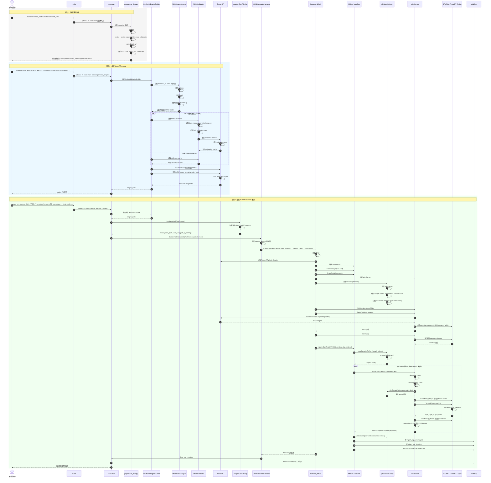

# Support H100

下载 ImageNet

cd /data/home/xli49

wget -O ILSVRC2012_img_val.tar \
  "https://image-net.org/data/ILSVRC/2012/ILSVRC2012_img_val.tar"


```
[xli49@spiedie-ohpc ~]$ mkdir mlperf_scratch
[xli49@spiedie-ohpc ~]$ export MLPERF_SCRATCH_PATH=/data/home/xli49/mlperf_scratch
[xli49@spiedie-ohpc ~]$ mkdir -p $MLPERF_SCRATCH_PATH/data/imagenet
mkdir -p $MLPERF_SCRATCH_PATH/models
mkdir -p $MLPERF_SCRATCH_PATH/preprocessed_data
```


```
[xli49@spiedie-ohpc ~]$ echo $MLPERF_SCRATCH_PATH
ls -lh $MLPERF_SCRATCH_PATH
/data/home/xli49/mlperf_scratch
total 1.5K
drwxr-xr-x 3 xli49 xli49 3 May 14 12:18 data
drwxr-xr-x 2 xli49 xli49 2 May 14 12:18 models
drwxr-xr-x 2 xli49 xli49 2 May 14 12:18 preprocessed_data
```


解压resnet50

mkdir -p $MLPERF_SCRATCH_PATH/data/imagenet

tar -xvf /data/home/xli49/ILSVRC2012_img_val.tar \
  -C $MLPERF_SCRATCH_PATH/data/imagenet

[xli49@spiedie-ohpc ~]$ find $MLPERF_SCRATCH_PATH/data/imagenet -name "*.JPEG" | wc -l

50000


下载镜像

https://catalog.ngc.nvidia.com/orgs/nvidia/teams/mlperf/containers/mlperf-inference/tags

mkdir -p $MLPERF_SCRATCH_PATH/containers

apptainer pull --force /data/home/xli49/mlperf_scratch/containers/mlperf-inference-v6.sif \
  docker://nvcr.io/nvidia/mlperf/mlperf-inference:tensorrt_llm_release-feat-1.2-mlpinf-b5ddff4_mlperf-main-f538816_jan28_x86


下载第三方库

mkdir -p 3rdparty

git clone --depth 1 https://github.com/NVIDIA/TensorRT-LLM.git 3rdparty/trtllm

git clone --depth 1 https://github.com/mlcommons/inference.git 3rdparty/mlc-inference


转成沙盒

[xli49@ghpc007 NVIDIA]$ 

cd /data/home/xli49/mlperf_scratch/containers

[xli49@ghpc007 containers]$ apptainer build --sandbox mlperf-inference-v6-sandbox mlperf-inference-v6.sif

INFO:  Starting build...

INFO:  Verifying bootstrap image mlperf-inference-v6.sif

INFO:  Extracting local image...

```
[xli49@ghpc007 NVIDIA]$ export SANDBOX=/data/home/xli49/mlperf_scratch/containers/mlperf-inference-v6-sandbox
mkdir -p $SANDBOX/data/home/xli49/mlperf_scratch
mkdir -p $SANDBOX/work
[xli49@ghpc007 NVIDIA]$ cd /data/home/xli49/mlperf-h100/inference_results_v6.0/closed/NVIDIA

apptainer shell --nv --writable --fakeroot \
  --bind "$(pwd)":/work \
  --bind "$MLPERF_SCRATCH_PATH:$MLPERF_SCRATCH_PATH" \
  --env MLPERF_SCRATCH_PATH="$MLPERF_SCRATCH_PATH" \
  --pwd /work \
  $SANDBOX
INFO:    User not listed in /etc/subuid, trying root-mapped namespace
INFO:    Using fakeroot command combined with root-mapped namespace
WARNING: nv files may not be bound with --writable
WARNING: Skipping mount /usr/share/glvnd/egl_vendor.d/10_nvidia.json [files]: /usr/share/glvnd/egl_vendor.d/10_nvidia.json doesn't exis
```


```
# 清理
pip uninstall -y opencv-python opencv-python-headless numpy

# 装回正确版本
pip install "numpy==1.26.4"
pip install "opencv-python-headless==4.11.0.86"

# 验证四件套
python3 -c "import numpy; print('numpy', numpy.__version__)"
python3 -c "import cv2; print('cv2', cv2.__version__, cv2.__file__)"
python3 -c "import nvmitten; print('nvmitten ok')"
python3 -c "import torch; print('torch cuda:', torch.cuda.is_available())"

# 如果都 ok，跑任务
cd /work
BENCHMARKS=resnet50 make preprocess_data
```


解决容器和本机看到的GPU不一致问题

```
cd /data/home/xli49/mlperf-h100/inference_results_v6.0/closed/NVIDIA

APPTAINERENV_CUDA_VISIBLE_DEVICES=3 \
APPTAINERENV_NVIDIA_VISIBLE_DEVICES=3 \
apptainer shell --nv --writable \
  --bind "$(pwd)":/work \
  --bind "$MLPERF_SCRATCH_PATH:$MLPERF_SCRATCH_PATH" \
  --env MLPERF_SCRATCH_PATH="$MLPERF_SCRATCH_PATH" \
  --pwd /work \
  $SANDBOX

APPTAINERENV_CUDA_VISIBLE_DEVICES=3 \
APPTAINERENV_NVIDIA_VISIBLE_DEVICES=3 \
apptainer shell --nv --writable --fakeroot \
  --bind "$(pwd)":/work \
  --bind "$MLPERF_SCRATCH_PATH:$MLPERF_SCRATCH_PATH" \
  --env MLPERF_SCRATCH_PATH="$MLPERF_SCRATCH_PATH" \
  --pwd /work \
  $SANDBOX
```


编译loadgen

```
cd /work/3rdparty/mlc-inference/loadgen

python3 setup.py bdist_wheel
pip install dist/*.whl


cd /work/3rdparty/mlc-inference/loadgen

rm -rf build
mkdir build
cd build

cmake .. \
  -DCMAKE_POSITION_INDEPENDENT_CODE=ON \
  -DCMAKE_CXX_FLAGS="-fPIC" \
  -DCMAKE_C_FLAGS="-fPIC"

make -j


cd /work
rm -rf build/harness

PYTHONPATH=/work:$PYTHONPATH \
LD_LIBRARY_PATH=/usr/local/tensorrt/lib:$LD_LIBRARY_PATH \
LIBRARY_PATH=/usr/local/tensorrt/lib:$LIBRARY_PATH \
CPATH=/usr/local/tensorrt/include:$CPATH \
CPLUS_INCLUDE_PATH=/usr/local/tensorrt/include:$CPLUS_INCLUDE_PATH \
make build_harness FFI_UTILS_DIR=/work/build/bin

```


```
cd /work
ls -lh build/bin/harness_default


SYSTEM_NAME=H100-NVL-94GBx1 \
make generate_engines RUN_ARGS="--benchmarks=resnet50 --scenarios=Offline --test_mode=PerformanceOnly"
```


这是 `plugin_map` 没有给 ResNet50 配置插件列表导致的。

报错点：

```python
for plugin in base_plugin_map[benchmark]:
```

当 benchmark 是：

```text
Benchmark.ResNet50
```

但 `base_plugin_map` 只有：

```python
base_plugin_map = {
    Benchmark.DLRMv2: [...],
    Benchmark.Retinanet: [...],
}
```

所以 `base_plugin_map[Benchmark.ResNet50]` 直接 `KeyError`。

**最小改法**

改：

```text
/work/code/plugin/plugin_map.py
```

找到最后的：

```python
base_plugin_map = {
    Benchmark.DLRMv2: [LoadablePlugins.DLRMv2EmbeddingLookupPlugin],
    Benchmark.Retinanet: [LoadablePlugins.NMSOptPlugin, LoadablePlugins.RetinaNetConcatOutputPlugin],
}
```

加一行 ResNet50 空列表：

```python
base_plugin_map = {
    Benchmark.ResNet50: [],
    Benchmark.DLRMv2: [LoadablePlugins.DLRMv2EmbeddingLookupPlugin],
    Benchmark.Retinanet: [LoadablePlugins.NMSOptPlugin, LoadablePlugins.RetinaNetConcatOutputPlugin],
}
```

然后重新跑：

```bash
SYSTEM_NAME=H100-NVL-94GBx1 \
make run_harness RUN_ARGS="--benchmarks=resnet50 --scenarios=Offline --test_mode=PerformanceOnly"
```

**更稳的通用改法**

也可以改：

```text
/work/code/plugin/__init__.py
```

把：

```python
for plugin in base_plugin_map[benchmark]:
```

改成：

```python
for plugin in base_plugin_map.get(benchmark, []):
```

两个函数都改：

```python
def load_trt_plugin_by_network(network_name: str, **kwargs)-> None:
    benchmark = Benchmark.get_match(network_name)
    for plugin in base_plugin_map.get(benchmark, []):
        if plugin.value.can_load(kwargs):
            plugin.value.load(kwargs)


def get_trt_plugin_paths_by_network(benchmark: Benchmark, **kwargs):
    plugins = []
    for plugin in base_plugin_map.get(benchmark, []):
        if plugin.value.can_load(kwargs):
            plugins.append(plugin.value.get_full_path())
    return plugins
```

我更推荐这个，因为没有插件的 benchmark 本来就应该返回空列表，而不是报错。

**一句话**

ResNet50 不需要这里的外部 `.so` 插件，但代码错误地假设所有 benchmark 都在 `base_plugin_map` 里。让它对缺失 key 返回空列表即可。


mkdir -p closed/NVIDIA/configs/H100-NVL-94GBx1/Offline

closed/NVIDIA/configs/H100-NVL-94GBx1/Offline/resnet50.py

```
import code.common.constants as C
import code.fields.harness as harness_fields
import code.fields.loadgen as loadgen_fields
import code.fields.models as model_fields
from nvmitten.constants import Precision


EXPORTS = {
    C.WorkloadSetting(C.HarnessType.Custom, C.AccuracyTarget(0.99), C.PowerSetting.MaxP): {
        model_fields.gpu_batch_size: {
            "resnet50": 256,
        },
        model_fields.precision: Precision.INT8,
        model_fields.input_dtype: Precision.INT8,
        model_fields.input_format: "linear",
        harness_fields.tensor_path: "build/preprocessed_data/imagenet/ResNet50/int8_linear",
        harness_fields.map_path: "data_maps/imagenet/val_map.txt",
        harness_fields.gpu_copy_streams: 4,
        harness_fields.gpu_inference_streams: 4,
        harness_fields.use_graphs: True,
        harness_fields.warmup_duration: 5.0,
        loadgen_fields.performance_sample_count: 1024,
        loadgen_fields.offline_expected_qps: 12500,
    },
}
```


Llama3.1-8b

```
cd /work

python3 -m pip install --user mlc-scripts

export PATH=$HOME/.local/bin:$PATH

which mlcr

```


```
cd /work
mkdir -p build/data/llama3.1-8b

curl -L -o /tmp/mlc-r2-downloader.sh \
  https://raw.githubusercontent.com/mlcommons/r2-downloader/refs/heads/main/mlc-r2-downloader.sh

bash /tmp/mlc-r2-downloader.sh \
  -d build/data/llama3.1-8b \
  https://inference.mlcommons-storage.org/metadata/llama3-1-8b-cnn-eval.uri

bash /tmp/mlc-r2-downloader.sh \
  -d build/data/llama3.1-8b \
  https://inference.mlcommons-storage.org/metadata/llama3-1-8b-cnn-dailymail-calibration.uri

```


git clone https://huggingface.co/nvidia/Llama-3.1-8B-Instruct-FP8 \

 build/models/Llama3.1-8B/llama3_1-8b-instruct-hf-torch-fp8

git clone https://huggingface.co/nvidia/Llama-3.1-8B-Instruct-NVFP4 \

 build/models/Llama3.1-8B/fp4-quantized-modelopt


export MLPERF_SCRATCH_PATH=/data/home/xli49/mlperf_scratch

cd /work
export PYTHONPATH=/work/3rdparty/trtllm:$PYTHONPATH
make generate_engines RUN_ARGS="--benchmarks=llama3.1-8b --scenarios=Offline"
