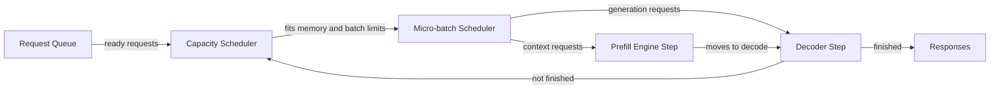
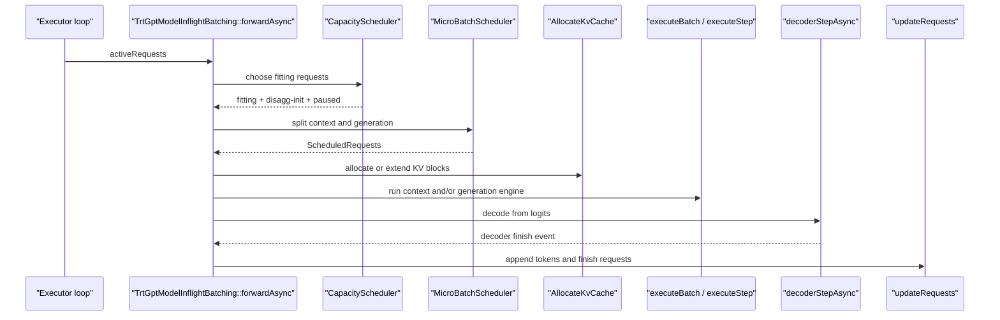

# TensorRT-LLM In-flight Batching

## 1. What it is

==In-flight batching is a rolling batch: finished requests leave, new requests enter, and active requests keep decoding.==

==It avoids making every request wait for the slowest request in a fixed batch.==

It mixes prefill/context work and decode/generation work under batch and token limits.



Algorithm:

1. Read the active request list.
2. Keep already-running decode requests wz hen resources allow.
3. Add new context requests until batch, token, and KV limits are reached.
4. Split selected requests into ==context and generation groups.==
    -   Request A: New request, prompt not yet processed -> contextRequests
    -   Request B: 10 tokens have been generated and it's not over yet -> generationRequests
    -   Request C: New request, but the number of tokens cannot fit -> Do not enter this round
5. Allocate or extend KV-cache blocks for those groups.
6. Run TensorRT context and generation engine steps.
7. Run the decoder, append new tokens, and finish or recycle requests.

<br>

## 2. What it's for / what problem it solves

It solves wasted GPU work from static batches with ==uneven(不均匀) prompt and output lengths==.

Without it, short requests wait behind long requests and padding burns compute.

The rejected simple alternative is static batching, where a batch runs in lockstep until all members finish.

TensorRT-LLM still supports static batching, b==ut `kINFLIGHT` is the default executor batching type.==

```
enum class BatchingType
{
    kSTATIC = 0,
    kINFLIGHT = 1,
};
```

<br>

## 3. Limitations

- ==**Empty schedule**==: the loop may wait for KV transfer or future resource release.

    -   This round may not have any requests scheduled. The common reasons are that the KV cache is still in transmission or the resources have not been released yet.

    -   KV cache transmission is common in **disaggregated serving**. After a request has completed the prompt calculation on the prefill machine, the decode machine needs to continue generating the token. However, the decode machine cannot only take the token ids; it also requires the **KV cache** of this request.

    -   TensorRT-LLM/cpp/tensorrt_llm/batch_manager/trtGptModelInflightBatching.cpp

        ```
        if (fittingRequests.empty() && fittingDisaggGenInitRequests.empty())
        {
            TLLM_LOG_WARNING(
                "CapacityScheduler didn't schedule any requests ... "
                "probably because of insufficient resources such as KV cache, "
                "will try wait for KV cache transfer to complete");
        
            if (mCacheTransceiver)
            {
                mCacheTransceiver->checkContextTransferStatus(1, true);
            }
        }
        ```

- ==**Huge prompts: context may need chunking**== or may fail token limits.

- KV pressure: `MAX_UTILIZATION` can pause started requests to admit better packing.

- Conservative mode: `GUARANTEED_NO_EVICT` avoids pauses but may lower throughput.

- Beam search: generation requests with different beam widths are skipped in the same micro-batch.

- CUDA graphs: graph capture is used only for generation-only states, not context batches.

- Coupling cost: scheduling depends on request state, KV cache, PEFT cache, decoder state, and runtime buffers.

- Wrong choice: use static batching for simple offline replay with uniform lengths and predictable batch shape.

<br>

## 4. How it's implemented in the project

Version read: `TensorRT-LLM` branch `main`, commit `25f7ca8b7`.

Main locations:

- `TensorRT-LLM/cpp/include/tensorrt_llm/executor/types.h` `BatchingType`, `CapacitySchedulerPolicy`, `InflightBatchingStats` (L207-236, L307-353).
- `TensorRT-LLM/cpp/tensorrt_llm/batch_manager/trtGptModelInflightBatching.cpp` `TrtGptModelInflightBatching::forwardAsync` (L998-1228).
- `TensorRT-LLM/cpp/tensorrt_llm/batch_manager/capacityScheduler.cpp` `CapacityScheduler::operator()` and scheduler variants (L147-168, L189-360, L372-469, L508-599).
- `TensorRT-LLM/cpp/tensorrt_llm/batch_manager/microBatchScheduler.cpp` `MicroBatchScheduler::operator()` (L306-480).
- `TensorRT-LLM/cpp/tensorrt_llm/batch_manager/allocateKvCache.cpp` `AllocateKvCache::operator()` (L24-91).
- `TensorRT-LLM/cpp/tensorrt_llm/batch_manager/trtGptModelInflightBatching.cpp` `executeBatch`, `executeStep`, `decoderStepAsync`, `updateRequests` (L1356-1380, L1791-1867, L2224-2269, L2376-2602).



### 1) Public knobs and stats

```cpp
// TensorRT-LLM/cpp/include/tensorrt_llm/executor/types.h (L207-236, L307-353)
enum class BatchingType
{
    kSTATIC = 0,   // traditional lockstep batch
    kINFLIGHT = 1, // rolling batch with dynamic enter/exit
};

enum class CapacitySchedulerPolicy
{
    kMAX_UTILIZATION = 0,    // pack aggressively; may pause requests
    kGUARANTEED_NO_EVICT = 1, // reserve enough KV cache to finish once started
    kSTATIC_BATCH = 2        // schedule no new work until current batch finishes
};

struct InflightBatchingStats
{
    SizeType32 numScheduledRequests;
    SizeType32 numContextRequests;
    SizeType32 numGenRequests;
    SizeType32 numPausedRequests;
    SizeType32 numCtxTokens;
    SizeType32 microBatchId;
    float avgNumDecodedTokensPerIter;
    // ... more queue and KV accounting fields
};
```

INPUT: executor configuration and runtime iteration data. OUTPUT: batching mode, scheduling policy, and per-iteration IFB stats.

- `kINFLIGHT`: enables dynamic request admission and early completion.
- `kMAX_UTILIZATION`: favors throughput and accepts possible preemption.
- `kGUARANTEED_NO_EVICT`: favors stable progress and avoids decode eviction.
- `InflightBatchingStats`: reports what each IFB iteration actually did.

### 2) The main IFB loop

```cpp
// TensorRT-LLM/cpp/tensorrt_llm/batch_manager/trtGptModelInflightBatching.cpp (L998-1228)
void TrtGptModelInflightBatching::forwardAsync(RequestList const& activeRequests)
{
    verifyRequests(activeRequests);

    auto& currRequests = mMicroBatchScheduledRequests.at(mMicroBatchId);

    auto [fittingRequests, fittingDisaggGenInitRequests, requestsToPause]
        = (*mCapacityScheduler)(activeRequests, mKvCacheManager, mPeftCacheManager, mCrossKvCacheManager);

    std::tie(currRequests.contextRequests, currRequests.generationRequests)
        = (*mMicroBatchScheduler)(fittingRequests, mInflightReqIds,
            mMaxBatchSizeRuntime, mMaxNumTokensRuntime);

    (*mPauseRequests)(requestsToPause, mInflightReqIds, mReqIdsToPause,
        false, *mSeqSlotManager, mKvCacheManager, mCrossKvCacheManager, mPeftCacheManager);

    if (!currRequests.empty())
    {
        for (auto const& llmReq : currRequests.contextRequests)
        {
            if (llmReq->isLastContextChunk())
                mInflightReqIds.insert(llmReq->mRequestId); // skip while executing
        }
        for (auto const& llmReq : currRequests.generationRequests)
            mInflightReqIds.insert(llmReq->mRequestId);

        (*mAssignReqSeqSlots)(*mSeqSlotManager,
            currRequests.contextRequests, currRequests.generationRequests);

        (*mAllocateKvCache)(*mKvCacheManager,
            currRequests.contextRequests, currRequests.generationRequests,
            mModelConfig, mCrossKvCacheManager);

        executeBatch(currRequests);                 // TensorRT engine step
        setupDecoderStep(currRequests.contextRequests, ...); // simplified
        decoderStepAsync(currRequests);             // token selection

        // Context requests become generation requests after their final chunk.
        for (auto const& requests : {currRequests.contextRequests, currRequests.generationRequests})
            for (auto const& llmReq : requests)
                if (llmReq->isContextInitState() && llmReq->getContextRemainingLength() == 0)
                    llmReq->setState(LlmRequestState::kGENERATION_IN_PROGRESS);
    }

    mMicroBatchId = getNextMicroBatchId(mMicroBatchId);
}
```

INPUT: `activeRequests`, the executor's currently live requests. OUTPUT: one asynchronous micro-batch launch and updated request states.

- `mCapacityScheduler`: filters requests by capacity and may return pause candidates.
- `mMicroBatchScheduler`: separates context from generation and applies token limits.
- `mInflightReqIds`: prevents scheduling the same request in two micro-batches.
- `mAssignReqSeqSlots`: maps requests to stable runtime sequence slots.
- `mAllocateKvCache`: reserves KV cache before engine execution.
- `executeBatch`: runs the TensorRT engine for selected context and generation work.

### 3) Capacity scheduling

```cpp
// TensorRT-LLM/cpp/tensorrt_llm/batch_manager/capacityScheduler.cpp (L508-599)
CapacityScheduler::CapacityScheduler(SizeType32 maxNumRequests,
    executor::CapacitySchedulerPolicy policy, bool hasKvCacheManager, bool twoStepsLookAhead,
    LlmRequestState noScheduleUntilState, LlmRequestState noScheduleAfterState)
{
    if (!hasKvCacheManager)
        mScheduler = MaxRequestsScheduler{maxNumRequests, noScheduleUntilState, noScheduleAfterState};
    else if (policy == executor::CapacitySchedulerPolicy::kMAX_UTILIZATION)
        mScheduler = MaxUtilizationScheduler{maxNumRequests, twoStepsLookAhead,
            noScheduleUntilState, noScheduleAfterState};
    else if (policy == executor::CapacitySchedulerPolicy::kGUARANTEED_NO_EVICT)
        mScheduler = GuaranteedNoEvictScheduler{maxNumRequests, noScheduleUntilState, noScheduleAfterState};
    else if (policy == executor::CapacitySchedulerPolicy::kSTATIC_BATCH)
        mScheduler = StaticBatchScheduler{maxNumRequests, noScheduleUntilState, noScheduleAfterState};
}

std::tuple<RequestVector, RequestVector, RequestVector>
CapacityScheduler::operator()(RequestList const& activeRequests, ...)
{
    RequestList requestsToSchedule =
        mReorderPolicy ? mReorderPolicy->reorderRequests(activeRequests) : activeRequests;

    return std::visit([&](auto const& scheduler) {
        auto [tmpFittingRequests, pausedRequests] =
            scheduler(*kvCacheManager, crossKvCacheManager, peftCacheManager, requestsToSchedule);

        // Split disaggregated generation-init work from normal schedulable work.
        return splitNormalAndDisaggInit(tmpFittingRequests, pausedRequests); // simplified
    }, mScheduler);
}
```

INPUT: active requests plus KV/PEFT managers. OUTPUT: fitting requests, disaggregated-init requests, and paused requests.

- `MaxRequestsScheduler`: only enforces max request count when no KV manager exists.
- `MaxUtilizationScheduler`: simulates KV allocation and may pause older started requests.
- `GuaranteedNoEvictScheduler`: reserves enough KV to finish admitted requests.
- `StaticBatchScheduler`: admits new requests only when no current batch is active.
- `mReorderPolicy`: optionally reorders requests before scheduling.

### 4) Micro-batch splitting

```cpp
// TensorRT-LLM/cpp/tensorrt_llm/batch_manager/microBatchScheduler.cpp (L306-480)
std::tuple<RequestVector, RequestVector> MicroBatchScheduler::operator()(
    RequestVector& activeRequests, ReqIdsSet const& inflightReqIds,
    SizeType32 maxBatchSizeRuntime, std::optional<SizeType32> maxNumTokensRuntime) const
{
    RequestVector contextRequests, generationRequests;
    SizeType32 batchNumTokens{0};

    for (auto& llmReq : activeRequests)
    {
        if (inflightReqIds.find(llmReq->mRequestId) != inflightReqIds.end())
            continue; // already executing elsewhere

        if (llmReq->isContextInitState())
        {
            SizeType32 reusable = llmReq->isFirstContextChunk()
                ? llmReq->getEstimatedReusableTokens() : 0;
            SizeType32 computeTokens =
                reuse_adjusted_compute(llmReq->getNumTokens(0), reusable,
                    llmReq->getContextRemainingLength());

            if (maxNumTokensRuntime && batchNumTokens + computeTokens > *maxNumTokensRuntime)
                break;

            contextRequests.emplace_back(llmReq);
            batchNumTokens += computeTokens;
        }
        else if (llmReq->isGenerationInProgressState())
        {
            SizeType32 reqNumTokens = llmReq->getBeamWidthByIter() + llmReq->getNumDraftTokens();
            if (maxNumTokensRuntime && batchNumTokens + reqNumTokens > *maxNumTokensRuntime)
                break;

            generationRequests.emplace_back(llmReq);
            batchNumTokens += reqNumTokens;
        }

        if (contextRequests.size() + generationRequests.size() >= maxBatchSizeRuntime)
            break;
    }

    utils::sortRequests(contextRequests, generationRequests, /*chunked*/ false);
    return {std::move(contextRequests), std::move(generationRequests)};
}
```

INPUT: capacity-approved requests and runtime batch/token limits. OUTPUT: context request list and generation request list.

- `batchNumTokens`: counts compute tokens, not fully reused prefix tokens.
- `inflightReqIds`: skips requests already assigned to a running micro-batch.
- `contextRequests`: prefill or context-chunk work.
- `generationRequests`: one decode step, plus draft tokens when present.
- `maxNumTokensRuntime`: stops packing before the engine token limit is exceeded.

### 5) KV-cache allocation and execution

```cpp
// TensorRT-LLM/cpp/tensorrt_llm/batch_manager/allocateKvCache.cpp (L24-91)
void AllocateKvCache::operator()(BaseKVCacheManager& kvCacheManager,
    RequestVector& contextRequests, RequestVector const& generationRequests,
    runtime::ModelConfig const& modelConfig, OptionalRef<BaseKVCacheManager> crossKvCacheManager) const
{
    kvCacheManager.syncTransferManagerWithBufferManager();

    for (auto const& llmReq : contextRequests)
    {
        if (llmReq->isFirstContextChunk())
        {
            kvCacheManager.addSequenceBatch(
                {{{llmReq->mRequestId, llmReq->mPromptLen, llmReq->mSamplingConfig.beamWidth}}},
                {std::ref(*llmReq)}); // allocate or reuse prompt KV blocks
        }
    }

    for (auto const& llmReq : generationRequests)
    {
        auto decodingTokens = llmReq->getNumDraftTokens() + 1;
        for (SizeType32 di = 0; di < decodingTokens; ++di)
            kvCacheManager.addToken(llmReq->mRequestId); // extend decode KV
    }

    kvCacheManager.refreshBlocks();
}
```

INPUT: scheduled context and generation requests. OUTPUT: KV cache block tables ready for runtime buffers.

- `addSequenceBatch`: creates or reuses prompt KV blocks for first context chunks.
- `addToken`: reserves new KV capacity for decode tokens.
- `crossKvCacheManager`: optionally allocates encoder-decoder cross-attention KV.
- `refreshBlocks`: publishes updated block metadata to later buffer preparation.

```cpp
// TensorRT-LLM/cpp/tensorrt_llm/batch_manager/trtGptModelInflightBatching.cpp (L1356-1380, L1791-1867)
void TrtGptModelInflightBatching::executeBatch(ScheduledRequests const& scheduledRequests)
{
    if (!mCtxGenFusion)
    {
        if (!scheduledRequests.contextRequests.empty())
            executeStep(scheduledRequests.contextRequests, {}, getContextBufferId());
        if (!scheduledRequests.generationRequests.empty())
            executeStep({}, scheduledRequests.generationRequests, getGenerationBufferId());
    }
    else
    {
        executeStep(scheduledRequests.contextRequests,
            scheduledRequests.generationRequests, getFusedBufferId());
    }
}

void TrtGptModelInflightBatching::executeStep(
    RequestVector const& contextRequests, RequestVector const& generationRequests, SizeType32 bufferId)
{
    auto [optProfileId, inputMap, outputMap] =
        prepareBuffers(contextRequests, generationRequests, bufferId);

    executeContext(optProfileId, bufferId); // launches TensorRT execution

    if (isCudaGraphMode() && contextRequests.empty())
        prepareGraph(bufferId, optProfileId); // cache generation-only graph
}
```

INPUT: scheduled requests and chosen runtime buffer. OUTPUT: TensorRT context/generation outputs in runtime buffers.

- `mCtxGenFusion`: controls whether context and generation share one fused engine step.
- `prepareBuffers`: builds TensorRT input and output tensor maps from request state.
- `executeContext`: performs the engine enqueue for the selected optimization profile.
- `prepareGraph`: captures reusable CUDA graph only for decode-only batches.

### 6) Decoder update and request lifecycle

```cpp
// TensorRT-LLM/cpp/tensorrt_llm/batch_manager/trtGptModelInflightBatching.cpp (L2224-2269, L2376-2602)
runtime::CudaEvent TrtGptModelInflightBatching::decoderStepAsync(
    ScheduledRequests const& scheduledRequests)
{
    (*mHandleContextLogits)(decoderInputBuffers,
        scheduledRequests.contextRequests, contextRuntimeBuffers->logits, ...);

    (*mHandleGenerationLogits)(decoderInputBuffers,
        scheduledRequests.generationRequests, genRuntimeBuffers->logits, ...);

    (*mMakeDecodingBatchInputOutput)(decoderInputBuffers,
        *mDecoderState, mModelConfig, *fusedRuntimeBuffers);

    auto decoderFinishEvent = mDecoder->forwardAsync(*mDecoderState, decoderInputBuffers);

    return (*mUpdateDecoderBuffers)(mModelConfig, mDecoderOutputBuffers.at(fusedBufferId),
        mRuntime->getBufferManager(), *mDecoderState, returnLogProbs, decoderFinishEvent);
}

void TrtGptModelInflightBatching::updateRequests(ScheduledRequests const& scheduledRequests)
{
    for (auto const& llmReq : scheduledRequests.generationRequests)
    {
        auto seqSlot = llmReq->mSeqSlot.value();
        auto seqLen = sequenceLengthsHostData[seqSlot * mOperatingBeamWidth];
        auto numNewOutputTokens = seqLen - llmReq->getNumTokens(0);

        for (SizeType32 step = 0; step < numNewOutputTokens; ++step)
            llmReq->addNewToken(hostNewOutputTokensData[step], 0);

        if (decoderFinishedSumPtr[seqSlot] == llmReq->getBeamWidthByIter(true))
        {
            postProcessRequest(*llmReq, numDroppedTokens);
            terminateRequest(llmReq);
            llmReq->setState(LlmRequestState::kGENERATION_COMPLETE);
        }
        else
        {
            llmReq->setState(LlmRequestState::kGENERATION_IN_PROGRESS);
        }
    }
}
```

INPUT: logits and decoder output buffers for the scheduled batch. OUTPUT: request tokens, finish reasons, and updated states.

- `mHandleContextLogits`: feeds context logits into the decoder for newly-prefilled requests.
- `mHandleGenerationLogits`: feeds decode logits for continuing requests.
- `mDecoder->forwardAsync`: samples or searches next tokens asynchronously.
- `llmReq->addNewToken`: appends accepted output tokens to request state.
- `terminateRequest`: frees sequence slot, KV cache, and PEFT resources.

<br>

## 5. Minimal implementation

```python
from collections import deque

class Request:
    def __init__(self, rid, prompt, max_new):
        self.rid, self.prompt, self.max_new = rid, prompt, max_new
        self.state, self.out = "context", []

def inflight_batching(requests, max_batch=3, max_tokens=12):
    waiting = deque(requests)
    active = []
    finished = []

    while waiting or active:
        batch, tokens = [], 0

        # Keep decoding active requests first.
        for r in list(active):
            if len(batch) < max_batch and tokens + 1 <= max_tokens:
                batch.append(r)
                tokens += 1

        # Admit new context requests into free capacity.
        while waiting and len(batch) < max_batch:
            r = waiting[0]
            need = len(r.prompt)
            if tokens + need > max_tokens:
                break
            waiting.popleft()
            batch.append(r)
            tokens += need

        for r in batch:
            if r.state == "context":
                r.state = "generation"
                active.append(r)
            else:
                r.out.append(f"T{len(r.out)}")
                if len(r.out) >= r.max_new:
                    active.remove(r)
                    finished.append(r)

    return [(r.rid, r.out) for r in finished]

print(inflight_batching([
    Request(1, [10, 11, 12], 2),
    Request(2, [20, 21], 4),
    Request(3, [30, 31, 32, 33], 1),
]))
```

Memorize checkpoint — the 2-3 lines you must NOT forget: schedule active decode first, admit new context into remaining capacity, remove finished requests immediately.

<br>

## 6. System links

Depends on:

- `LlmRequest` state transitions decide whether a request is context, generation, paused, or complete.
- `CapacityScheduler` decides whether request admission is aggressive or no-evict.
- `MicroBatchScheduler` enforces runtime batch size and token limits.
- `KVCacheManager` provides block allocation, reuse, eviction simulation, and rewind support.
- `RuntimeBuffers` maps scheduled requests into TensorRT input and output tensors.
- `GptDecoderBatched` turns logits into next tokens and finish states.

Depends on it:

- `ExecutorConfig::mBatchingType` selects IFB as the default executor batching strategy.
- Benchmark tools use `--type inflight` to run this path.
- Iteration stats expose IFB counts, paused requests, context tokens, and KV stats.
- Disaggregated serving uses IFB scheduling plus KV transfer readiness checks.

Ripple effects:

- Changing capacity scheduling alters latency, throughput, and pause frequency.
- Changing micro-batch token accounting can overflow engine profiles or waste capacity.
- Changing KV allocation must stay consistent with runtime block-offset tensors.
- Changing request states can break admission, completion, or response streaming.
- Changing context-generation fusion changes buffer ownership and CUDA graph behavior.

<br>

<br>
