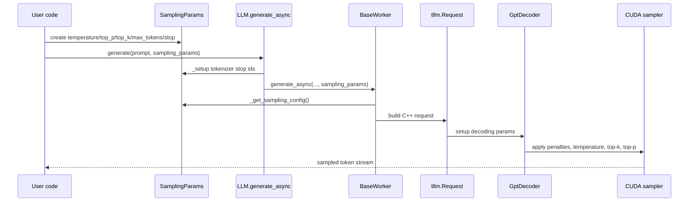

# SamplingParams 

Source read: local `TensorRT-LLM` at commit `c72d43d896`, observed package version `1.3.0rc15`.

## 1. What it is

`SamplingParams` is the per-request decoding contract that turns model logits into output tokens.

It does not run the model itself.
It tells the decoder how random, narrow, long, repeat-safe, and stoppable generation should be.


Core algorithm:

```python
def decode_next_token(logits, params, history):
    logits = apply_repeat_penalties(logits, history, params)
    logits = logits / params.temperature
    candidates = keep_top_k(logits, params.top_k)
    candidates = keep_top_p(candidates, params.top_p)
    token = random_sample(candidates, seed=params.seed)
    stop = token_matches_stop(token, params.stop)
    return token, stop
```

In the real project, Python stores the settings, then C++ and CUDA apply them during decoding.

<br>

## 2. What it's for / what problem it solves

It solves per-request control over generation behavior.

Without it, every request would use the same decoding policy.

`temperature` controls randomness by scaling logits (逻辑值).

`top_k` limits sampling to the strongest `k` tokens.

`top_p` limits sampling to the smallest high-probability nucleus (核采样集合).

`max_tokens` and `min_tokens` bound output length.

Penalty fields reduce repeated tokens and repeated phrases.

`stop` ends text on user-defined stop strings.

`seed` makes random sampling easier to reproduce.

A simpler alternative is greedy decoding only.

Greedy decoding is fast and stable, but it removes useful variation.

<br>

## 3. Limitations

`temperature=0`, `top_k=1`, or `top_p=0` means greedy behavior.

`top_p=0` is normalized internally because some Top-P kernels do not support it.

Huge `max_tokens` is still limited by the engine `max_seq_len`.

`stop=["\n\n"]` is encoded into token IDs, so tokenizer behavior matters.

`seed=42` helps reproducibility, but batching and backend details can still affect exact outputs.

Penalties cost extra work because logits must be adjusted before sampling.

One request using penalties can force the penalty path for the active decoding layer.

Use greedy decoding when you need maximum determinism and lowest sampling overhead.

<br>

## 4. How it's implemented in the project

Locations:

- `tensorrt_llm/sampling_params.py`, class `SamplingParams`, fields and validation `(L152-410)`.
- `tensorrt_llm/sampling_params.py`, `SamplingParams._setup`, stop encoding `(L420-460)`.
- `tensorrt_llm/sampling_params.py`, `SamplingParams._get_sampling_config` `(L504-534)`.
- `tensorrt_llm/llmapi/llm.py`, `LLM.generate_async` `(L431-530)`.
- `tensorrt_llm/executor/base_worker.py`, C++ `tllm.Request` construction `(L544-570)`.
- `cpp/tensorrt_llm/nanobind/executor/request.cpp`, Python binding for C++ `SamplingConfig` `(L110-170)`.
- `cpp/include/tensorrt_llm/executor/executor.h`, C++ `SamplingConfig` fields `(L59-185)`.
- `cpp/tensorrt_llm/runtime/gptDecoder.cpp`, setup into decoding params `(L79-109)`.
- `cpp/tensorrt_llm/layers/penaltyLayer.cpp`, temperature and penalties copied to GPU buffers `(L170-212)`.
- `cpp/tensorrt_llm/kernels/decodingCommon.cu`, temperature scaling `(L71-113)`.
- `cpp/tensorrt_llm/layers/topKSamplingLayer.cpp`, Top-K/Top-P setup for Top-K path `(L86-169)`.
- `cpp/tensorrt_llm/layers/topPSamplingLayer.cpp`, Top-P setup and kernel params `(L117-270)`.



### 1) Python object: fields, validation, and greedy detection

```python
# tensorrt_llm/sampling_params.py (L247-410), simplified
@dataclass(slots=True, kw_only=True)
class SamplingParams:
    max_tokens: int = 32                  # length cap (长度上限)
    stop: Optional[Union[str, List[str]]] = None
    top_k: Optional[int] = None           # Top-K filter (候选数量过滤)
    top_p: Optional[float] = None         # nucleus filter (核采样过滤)
    seed: Optional[int] = None            # RNG seed (随机种子)
    temperature: Optional[float] = None   # logit scale (逻辑值缩放)
    min_tokens: Optional[int] = None
    repetition_penalty: Optional[float] = None
    presence_penalty: Optional[float] = None
    frequency_penalty: Optional[float] = None

    def _validate(self):
        if self.top_p is not None and (self.top_p < 0 or self.top_p > 1):
            raise ValueError(...)
        if self.top_k is not None and self.top_k < 0:
            raise ValueError(...)
        if self.temperature is not None and self.temperature < 0:
            raise ValueError(...)

    @staticmethod
    def params_imply_greedy_decoding(...):
        return (not use_beam_search) and (
            (temperature is None and top_p is None and top_k is None)
            or top_k == 1
            or top_p == 0.0
            or temperature == 0
        )
```

INPUT: User keyword arguments like `temperature=0.8`, `top_p=0.95`, `top_k=50`.
OUTPUT: A validated Python `SamplingParams` object.

- `max_tokens`: limits generated token count before runtime request creation.
- `top_k`: keeps only the highest-logit token candidates.
- `top_p`: keeps the smallest candidates whose probability mass reaches `p`.
- `temperature`: divides logits before softmax-like probability use.
- `seed`: passes random seed to C++ sampling config.
- `_validate`: rejects invalid values before runtime submission.
- `_greedy_decoding`: detects when sampling collapses to greedy decoding.

### 2) Stop strings become token IDs

```python
# tensorrt_llm/sampling_params.py (L420-460), simplified
def _setup(self, tokenizer, hf_model_config, generation_config, add_special_tokens=False):
    if self.end_id is None:
        self.end_id = tokenizer.eos_token_id
        self.pad_id = tokenizer.pad_token_id or self.end_id

    def _encode(tokenizer, text, add_special_tokens):
        return tokenizer.encode(text, add_special_tokens=add_special_tokens)

    if self.stop is not None:
        strs = [self.stop] if isinstance(self.stop, str) else self.stop
        self._stop_word_ids = [_encode(tokenizer, s, add_special_tokens) for s in strs]

    return self
```

INPUT: `stop=["\n\n"]` plus tokenizer.
OUTPUT: `_stop_word_ids`, a token-ID representation of stop strings.

- `end_id`: EOS token used by the runtime.
- `pad_id`: pad token, falling back to EOS.
- `_stop_word_ids`: stop text converted into token sequences.
- `generation_config.eos_token_id`: can add extra stop token IDs.

### 3) LLM passes params into each async request

```python
# tensorrt_llm/llmapi/llm.py (L477-513), simplified
def generate_async(self, inputs, sampling_params=None, ...):
    sampling_params = self._prepare_sampling_params(sampling_params)

    prompt_token_ids, prompt, query_token_ids, multimodal_params = (
        self._preprocess(inputs, sampling_params, disaggregated_params)
    )

    self._check_arguments(len(prompt_token_ids), query_len, sampling_params, ...)

    result = self._executor.generate_async(
        prompt_token_ids,
        query_token_ids=query_token_ids,
        sampling_params=sampling_params,  # per-request decoding policy (解码策略)
        ...
    )
```

INPUT: Prompt inputs and optional `SamplingParams`.
OUTPUT: A submitted executor request future/result.

- `_prepare_sampling_params`: creates defaults and fills tokenizer-dependent fields.
- `_preprocess`: tokenizes text and can use `truncate_prompt_tokens`.
- `_check_arguments`: checks length and beam constraints.
- `_executor.generate_async`: forwards the same object to executor code.

### 4) Python params become a C++ request

```python
# tensorrt_llm/executor/base_worker.py (L544-570), simplified
executor_request = tllm.Request(
    input_token_ids=prompt_token_ids,
    max_tokens=_deduce_max_tokens(request, ...),    # output cap (输出上限)
    sampling_config=request.sampling_params._get_sampling_config(),
    end_id=-1 if request.sampling_params.ignore_eos else request.sampling_params.end_id,
    pad_id=request.sampling_params.pad_id,
    stop_words=[] if request.sampling_params.ignore_eos else
        request.sampling_params._get_stop_words(),
    embedding_bias=request.sampling_params.embedding_bias,
)
```

INPUT: `GenerationRequest` holding token IDs and `SamplingParams`.
OUTPUT: `tllm.Request`, the pybind-facing C++ executor request.

- `max_tokens`: resolved against engine limits before C++ request creation.
- `sampling_config`: C++ `SamplingConfig` created from Python fields.
- `stop_words`: tokenized stop sequences passed to runtime.
- `end_id`: disabled with `-1` when `ignore_eos=True`.

### 5) Mapping into C++ SamplingConfig

```python
# tensorrt_llm/sampling_params.py (L504-534), simplified
def _get_sampling_config(self) -> tllme.SamplingConfig:
    fields = {f for f in dir(tllme.SamplingConfig) if not f.startswith("__")}
    unmatched = {"num_return_sequences", "beam_width", "n", "best_of", "use_beam_search"}

    # Copy same-name fields: top_k, top_p, seed, temperature, penalties, min_tokens.
    kwargs = {f: getattr(self, f) for f in fields if f not in unmatched}

    if self.use_beam_search:
        kwargs["num_return_sequences"] = self.n
        kwargs["beam_width"] = self.best_of
    else:
        kwargs["num_return_sequences"] = self.best_of
        kwargs["beam_width"] = 1

    return tllme.SamplingConfig(**kwargs)
```

INPUT: Python `SamplingParams`.
OUTPUT: pybind `tllme.SamplingConfig`.

- `fields`: discovers C++ binding fields dynamically.
- `kwargs`: carries matching names like `top_p`, `temperature`, and penalties.
- `beam_width`: forced to `1` for normal sampling.
- `num_return_sequences`: maps `best_of` for sampling mode.

### 6) C++ exposes the same fields through nanobind

```cpp
// cpp/tensorrt_llm/nanobind/executor/request.cpp (L110-170), simplified
nb::class_<tle::SamplingConfig>(m, "SamplingConfig")
    .def(nb::init<tle::SizeType32,
        std::optional<tle::SizeType32> const&,  // top_k (Top-K)
        std::optional<tle::FloatType> const&,   // top_p (Top-P)
        std::optional<tle::RandomSeedType> const&, // seed
        std::optional<tle::FloatType> const&,   // temperature
        std::optional<tle::FloatType> const&,   // repetition_penalty
        std::optional<tle::FloatType> const&,   // presence_penalty
        std::optional<tle::FloatType> const&    // frequency_penalty
        /* ... */>(),
        nb::arg("beam_width") = 1,
        nb::kw_only(),
        nb::arg("top_k") = nb::none(),
        nb::arg("top_p") = nb::none(),
        nb::arg("seed") = nb::none(),
        nb::arg("temperature") = nb::none(),
        nb::arg("repetition_penalty") = nb::none(),
        nb::arg("presence_penalty") = nb::none(),
        nb::arg("frequency_penalty") = nb::none())
    .def_prop_rw("top_p", &tle::SamplingConfig::getTopP, &tle::SamplingConfig::setTopP)
    .def_prop_rw("temperature", &tle::SamplingConfig::getTemperature, &tle::SamplingConfig::setTemperature);
```

INPUT: Keyword arguments from Python binding.
OUTPUT: C++ `tle::SamplingConfig`.

- `nb::class_`: exposes C++ class to Python.
- `nb::arg`: names Python keyword arguments.
- `std::optional`: keeps unset params distinct from explicit values.
- `def_prop_rw`: exposes readable and writable properties.

### 7) C++ decoder splits fields into penalty and sampling paths

```cpp
// cpp/tensorrt_llm/runtime/gptDecoder.cpp (L79-109), simplified
mSamplingConfig = samplingConfig.value();
TLLM_CHECK_WITH_INFO(mSamplingConfig.validate(), "Sampling config is invalid");

auto penaltyParams = std::make_shared<tl::PenaltySetupParams>();
penaltyParams->repetitionPenalty = mSamplingConfig.repetitionPenalty;
penaltyParams->presencePenalty = mSamplingConfig.presencePenalty;
penaltyParams->frequencyPenalty = mSamplingConfig.frequencyPenalty;
penaltyParams->temperature = mSamplingConfig.temperature;
penaltyParams->minLength = mSamplingConfig.minLength;

auto samplingParams = std::make_shared<tl::SamplingSetupParams>();
if (mSamplingConfig.topK) {
    auto const& topK = mSamplingConfig.topK.value();
    samplingParams->runtimeTopK = std::vector<SizeType32>(std::begin(topK), std::end(topK));
}
samplingParams->runtimeTopP = mSamplingConfig.topP;
samplingParams->topPDecay = mSamplingConfig.topPDecay;
samplingParams->runtimeMinP = mSamplingConfig.minP;
```

INPUT: C++ `SamplingConfig` inside the runtime.
OUTPUT: `PenaltySetupParams` and `SamplingSetupParams`.

- `PenaltySetupParams`: feeds temperature and repeat penalties.
- `SamplingSetupParams`: feeds Top-K, Top-P, and Min-P samplers.
- `validate`: rechecks C++ runtime constraints.
- `mSamplingConfig`: stores request decoding policy in decoder state.

### 8) Temperature and penalties are copied to GPU buffers

```cpp
// cpp/tensorrt_llm/layers/penaltyLayer.cpp (L170-212), simplified
bool const useTemperature =
    mDecodingMode.isUseTemperature() && penaltyParams->temperature.has_value();
bool const useRepetitionPenalty =
    mDecodingMode.isUseRepetitionPenalty() && penaltyParams->repetitionPenalty.has_value();

if (mUseTemperature) {
    fillBuffers(penaltyParams->temperature,
        DefaultDecodingParams::getTemperature(),
        mTemperature,
        mTemperatureDevice,
        batchSlots,
        getLimitsPenalty(DecodingPenaltyType::Temperature),
        "temperature penalty");
}
```

INPUT: `PenaltySetupParams`.
OUTPUT: host and device buffers for temperature and penalties.

- `has_value`: only enables a feature when the request set it.
- `fillBuffers`: broadcasts scalar or per-request values.
- `mTemperatureDevice`: GPU-side temperature array.
- `mUseTemperature`: keeps feature enabled after one request needs it.

### 9) CUDA applies temperature to logits

```cpp
// cpp/tensorrt_llm/kernels/decodingCommon.cu (L71-113), simplified
__global__ void addBiasSoftMax(..., float const* temperatures, ...) {
    auto const batchSlot = batchSlots ? batchSlots[batchIdx] : batchIdx;

    // inverse temperature (温度倒数): lower temperature makes logits sharper.
    auto const tempInv =
        temperatures ? T{1.f / (temperatures[batchSlot] + EPSILON)} : T{1.f};

    for (int tid = threadIdx.x; tid < vocabSizePadded; tid += blockDim.x) {
        auto logit = logitsPtr[tid];
        logit = temperatures ? logit * tempInv : logit; // logits / temperature
        ...
    }
}
```

INPUT: model logits and optional `temperatures` GPU buffer.
OUTPUT: temperature-adjusted logits/probabilities for sampling.

- `tempInv`: computes `1 / temperature`.
- `logit * tempInv`: implements `logit / temperature`.
- `EPSILON`: avoids division by exact zero.
- `batchSlot`: selects per-request temperature.

### 10) Top-K and Top-P are normalized and sampled

```cpp
// cpp/tensorrt_llm/kernels/samplingTopKKernels.h (L229-276), simplified
inline bool clampTopP(float& topP) {
    if (topP < 0.f || topP > 1.0f) {
        topP = std::clamp(topP, 0.f, 1.f); // keep probability valid
        return true;
    }
    return false;
}

inline bool regularizeTopKTopP(SizeType32& topK, float& topP) {
    if (topK == 0 && topP == 0.0f) {
        topK = 1;      // Top-P 0 means greedy fallback
        return true;
    }
    if (topK > 0 && topP == 0.0f) {
        topP = 1.0f;   // Top-K-only mode
        return true;
    }
    return false;
}
```

INPUT: runtime `topK` and `topP`.
OUTPUT: legal, kernel-friendly `topK` and `topP`.

- `clampTopP`: clips invalid probabilities.
- `regularizeTopKTopP`: removes unsupported ambiguous cases.
- `topK=1`: represents greedy selection.
- `topP=1.0`: disables nucleus filtering while keeping Top-K.

```cpp
// cpp/tensorrt_llm/layers/topPSamplingLayer.cpp (L117-270), simplified
auto runtimeTopK = setupParams->runtimeTopK.value_or(std::vector{DefaultDecodingParams::getTopK()});
auto runtimeTopP = setupParams->runtimeTopP.value();

for (size_t i = 0; i < paramsSize; ++i) {
    clampTopK(runtimeTopK[i]);
    clampTopP(runtimeTopP[i]);
    regularizeTopKTopP(runtimeTopK[i], runtimeTopP[i]);
}

TopPSamplingKernelParams<T> params{};
params.probs = probs;                                      // probabilities (概率)
params.topPs = bufferCastOrNull<float>(mRuntimeTopPDevice);
params.batchSlots = workspace->getDeviceBatchSlotsPtr();
```

INPUT: `SamplingSetupParams` with `runtimeTopK` and `runtimeTopP`.
OUTPUT: CUDA kernel params for Top-P sampling.

- `runtimeTopK`: Top-K value after defaults.
- `runtimeTopP`: Top-P value from user config.
- `params.probs`: already temperature-adjusted probabilities.
- `params.topPs`: per-request Top-P thresholds on device.

<br>

## 5. Minimal implementation

```python
import math
import random

def softmax(xs):
    m = max(xs)
    exps = [math.exp(x - m) for x in xs]
    s = sum(exps)
    return [x / s for x in exps]

def sample_next(logits, history, *, temperature=0.8, top_k=50, top_p=0.95,
                repetition_penalty=1.1, seed=42):
    random.seed(seed)

    # Repeat penalty (重复惩罚): lower scores for seen tokens.
    adjusted = logits[:]
    for token_id in set(history):
        adjusted[token_id] /= repetition_penalty

    # Temperature (温度): logits / temperature.
    adjusted = [x / max(temperature, 1e-6) for x in adjusted]

    # Top-K: keep highest K scores.
    ranked = sorted(enumerate(adjusted), key=lambda x: x[1], reverse=True)[:top_k]
    ids, kept_logits = zip(*ranked)

    # Top-P: keep smallest prefix whose probability mass reaches p.
    probs = softmax(list(kept_logits))
    kept, mass = [], 0.0
    for token_id, prob in zip(ids, probs):
        kept.append((token_id, prob))
        mass += prob
        if mass >= top_p:
            break

    # Renormalize and sample.
    total = sum(prob for _, prob in kept)
    r, acc = random.random(), 0.0
    for token_id, prob in kept:
        acc += prob / total
        if r <= acc:
            return token_id

print(sample_next([5.0, 4.0, 2.0, 1.0], history=[1]))
```

Memorize checkpoint — the 2-3 lines you must NOT forget: divide logits by temperature, filter by Top-K/Top-P, then sample from the renormalized candidates.

<br>

## 6. System links

Depends on:

- Tokenizer, because `stop` strings must become token IDs.
- Python nanobind bindings, because `SamplingParams` becomes C++ `SamplingConfig`.
- Engine limits, because `max_tokens` is capped by sequence length.
- CUDA decoding kernels, because temperature and sampling happen on device.

Depended on by:

- `LLM.generate` and `generate_async`, because every request carries sampling policy.
- C++ `tllm.Request`, because it stores runtime decoding config.
- `GptDecoder`, because it splits config into penalty and sampling setup.
- Result postprocessing, because stop words trim or finish generated text.

Changing it ripples through:

- Adding a new field requires Python dataclass, nanobind binding, C++ config, and decoder support.
- Renaming a field breaks `_get_sampling_config` same-name mapping.
- Changing greedy rules affects validation and multi-return behavior.
- Changing stop handling can alter user-visible text endings.
- Changing temperature or Top-P kernels changes reproducibility and probability semantics.

<br>

<br>
