# TensorRT-LLM PyTorch Backend

`examples/llm-api/llm_inference.py`

**图 1：脚本入口到 LLM 初始化**

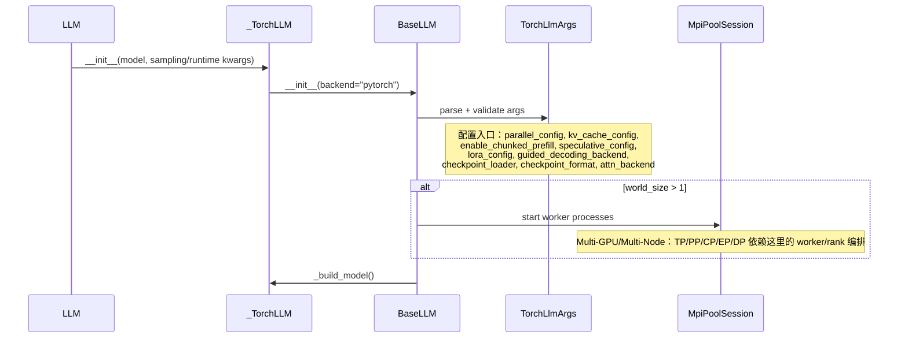

Base-> MpiPoolSession: 这段表示当模型需要多 GPU 推理时，`BaseLLM` 会启动一组 MPI worker 进程。TP/PP/CP 这些并行方式已经体现在 `parallel_config.world_size` 里，这里做的是按这个数量创建 worker。

1. `world_size > 1` 表示需要多进程/多 GPU  
   代码里对应的是：

   ```python
   if self.args.parallel_config.is_multi_gpu:
   ```

   也就是只要 `parallel_config` 判断当前不是单 GPU，就进入多 GPU 初始化逻辑。

2. `BaseLLM->>MpiPoolSession: start worker processes` 对应创建 MPI session  
   代码位置在 `BaseLLM.__init__`：

   ```python
   self.mpi_session = MpiPoolSession(
       n_workers=self.args.parallel_config.world_size
   )
   ```

   这里的 `n_workers` 就是总 rank 数。

3. `TP/PP/CP 等并行 rank 编排` 来自 `parallel_config`  
   `parallel_config` 会根据这些参数组成：

   ```python
   tp_size=self.tensor_parallel_size
   pp_size=self.pipeline_parallel_size
   cp_size=self.context_parallel_size
   ```

   然后得到整体 `world_size`。

4. `MpiPoolSession` 具体做的是启动 `MPIPoolExecutor`  
   它内部会执行：

   ```python
   MPIPoolExecutor(max_workers=self.n_workers)
   ```

   所以如果 `world_size = 4`，就会启动 4 个 MPI worker/rank 来跑模型的不同并行分片。


mpi4py 是 MPI 的 Python 绑定，让 Python 代码也能调用 MPI 的进程管理和通信能力。TensorRT-LLM 里用它来创建 MPI worker、获取 rank/world size、做进程间通信。


world_size=1 只表示**模型并行 rank 数是 1**，所以 BaseLLM 不会为了多 GPU 创建 MPI session。但 PyTorch backend 的 GenerationExecutor 还有一套**单 GPU worker 进程机制**，它也可能用 mpi4py 创建 MpiPoolSession，所以你还是会看到 MPI 创建的是单 GPU worker 的 MpiPoolSession，不是多 GPU 并行的 MpiPoolSession。


**图 2：下载/解析 checkpoint，到创建 GenerationExecutor**

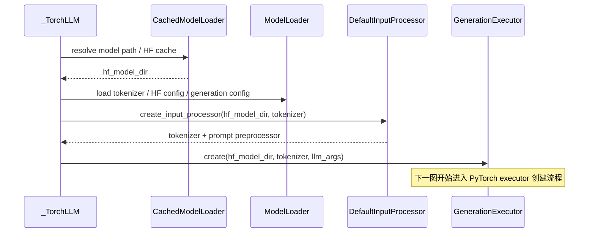

**图 3：模型类分派，决定具体调用哪个模型**
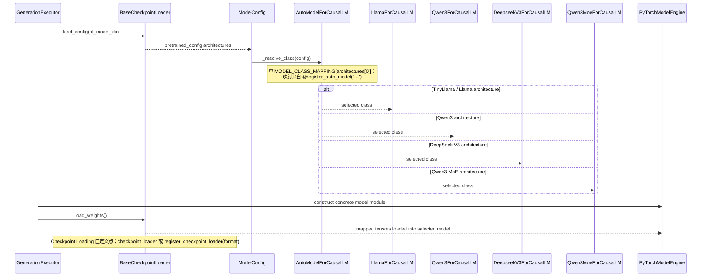

**图 4：Executor 运行时资源构建**
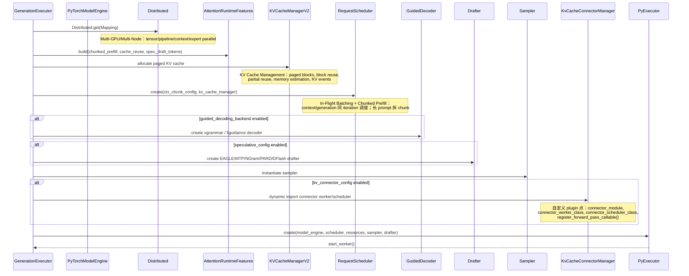

**图 5：generate 请求进入调度循环**
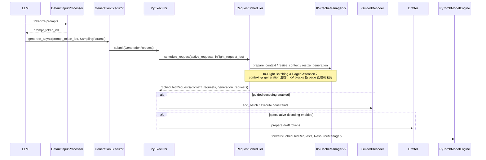

**图 6：PyTorchModelEngine 到具体模型层**
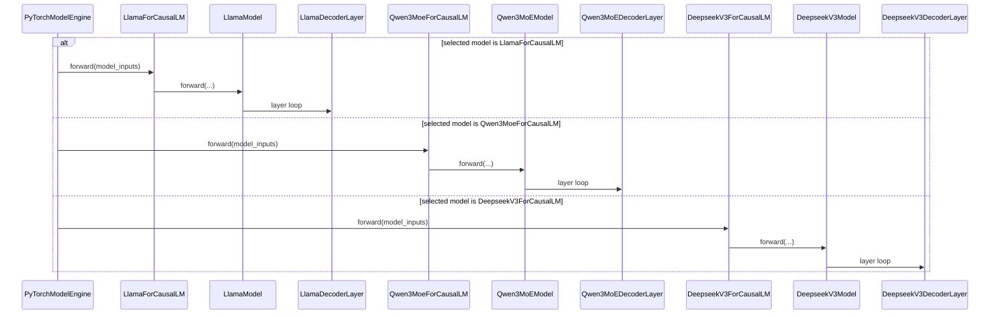

**图 7：DecoderLayer 到 Attention / MLP / MoE / LoRA**
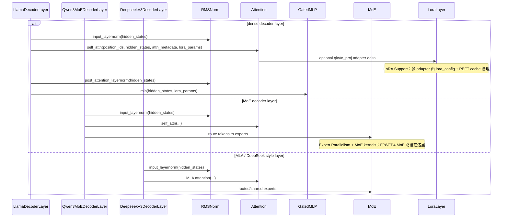

**图 8：Attention 到 CUDA / Triton / Quant kernels**
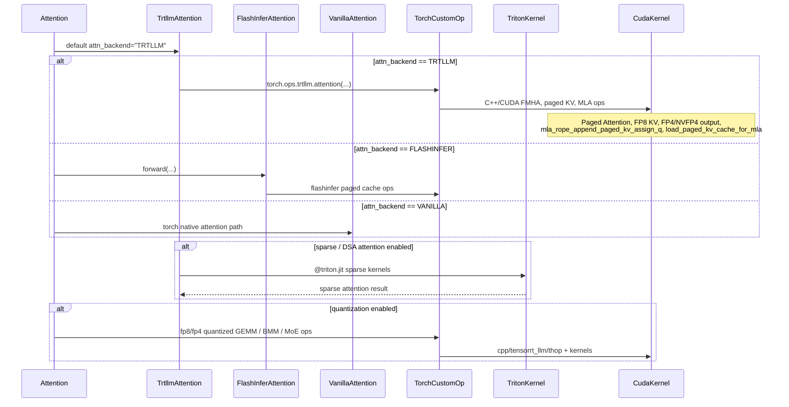

**图 9：logits 到采样，再回到用户输出**
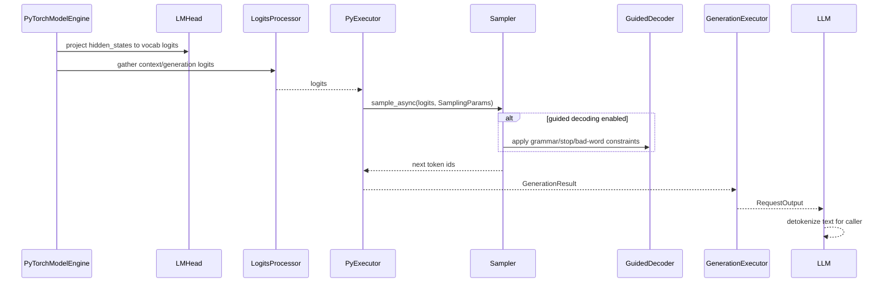

**图 10：Disaggregated Serving 旁路，接在图 5/6 之间**
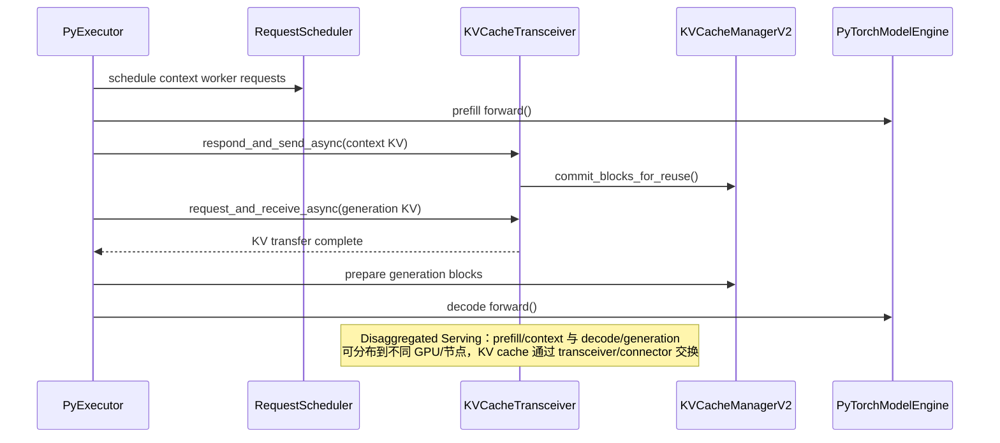

这套图的连续数据流就是：

`LLM.__init__` -> `_TorchLLM._build_model` -> `GenerationExecutor.create` -> `BaseCheckpointLoader + AutoModelForCausalLM` -> `PyTorchModelEngine` -> `PyExecutor` -> `RequestScheduler + KVCacheManagerV2` -> `具体 *ForCausalLM` -> `*Model` -> `*DecoderLayer` -> `Attention / MLP / MoE` -> `torch.ops.trtllm / Triton / CUDA` -> `LMHead` -> `Sampler` -> `RequestOutput`。


# TensorRT-LLM C++ / TensorRT Backend

`from tensorrt_llm._tensorrt_engine import LLM. `

**图 1：入口到 TensorRT Backend 初始化**

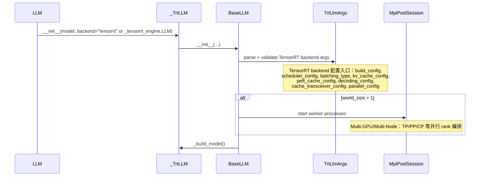

1.   BaseLLM 按 backend 的值选择对应后端的参数类，"pytorch" 对应 TorchLlmArgs，"_autodeploy" 对应 AutoDeployLlmArgs，其余值对应 TrtLlmArgs。

     `backend == "pytorch"`：使用 `TorchLlmArgs`，走 `PyExecutor -> PyTorchModelEngine -> 具体 PyTorch 模型类 -> torch.ops/Triton/CUDA`。  
     `backend == "_autodeploy"`：使用 `AutoDeployLlmArgs`，走 AutoDeploy shim，对 PyTorch 模型做 graph transform / torch.export 后执行。  
     `else`：使用 `TrtLlmArgs`，走 TensorRT engine build/load -> C++ Executor -> BatchManager -> TensorRT Plugin/CUDA。

```
if backend == "pytorch":
    logger.info("Using LLM with PyTorch backend")
    llm_args_cls = TorchLlmArgs
    if self._orchestrator_type == "ray" or mpi_disabled():
        self._orchestrator_type = "ray"
        os.environ["TLLM_DISABLE_MPI"] = "1"
        # Propagate to args construction
        kwargs["orchestrator_type"] = "ray"

elif backend == '_autodeploy':
    logger.info("Using LLM with AutoDeploy backend")
    from .._torch.auto_deploy.llm_args import \
        LlmArgs as AutoDeployLlmArgs
    llm_args_cls = AutoDeployLlmArgs
else:
    logger.info("Using LLM with TensorRT backend")
    llm_args_cls = TrtLlmArgs
```


2.当模型需要多 GPU 推理时，`BaseLLM` 会启动一组 MPI worker 进程。TP/PP/CP 这些并行方式已经体现在 `parallel_config.world_size` 里，这里做的是按这个数量创建 worker。

1. `world_size > 1` 表示需要多进程/多 GPU  
   代码里对应的是：

   ```python
   if self.args.parallel_config.is_multi_gpu:
   ```

   也就是只要 `parallel_config` 判断当前不是单 GPU，就进入多 GPU 初始化逻辑。

2. `BaseLLM->>MpiPoolSession: start worker processes` 对应创建 MPI session  
   代码位置在 `BaseLLM.__init__`：

   ```python
   self.mpi_session = MpiPoolSession(
       n_workers=self.args.parallel_config.world_size
   )
   ```

   这里的 `n_workers` 就是总 rank 数。

3. `TP/PP/CP 等并行 rank 编排` 来自 `parallel_config`  
   `parallel_config` 会根据这些参数组成：

   ```python
   tp_size=self.tensor_parallel_size
   pp_size=self.pipeline_parallel_size
   cp_size=self.context_parallel_size
   ```

   然后得到整体 `world_size`。

4. `MpiPoolSession` 具体做的是启动 `MPIPoolExecutor`  
   它内部会执行：

   ```python
   MPIPoolExecutor(max_workers=self.n_workers)
   ```

   所以如果 `world_size = 4`，就会启动 4 个 MPI worker/rank 来跑模型的不同并行分片。


**图 2：构建/加载 TensorRT Engine**

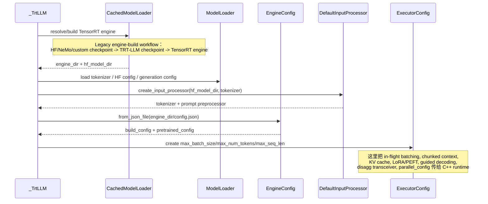

**图 3：创建 C++ Executor**
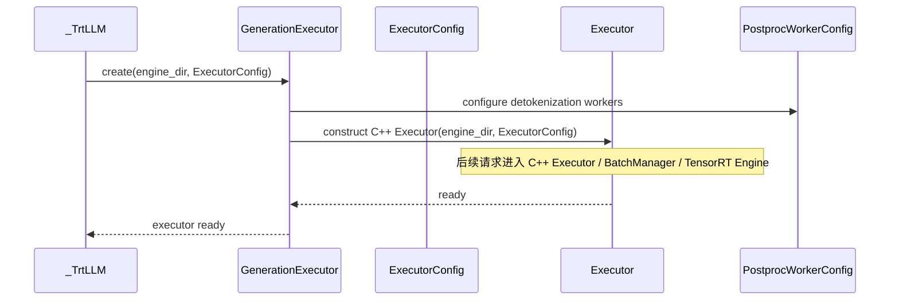

**图 4：generate 请求提交到 C++ Executor**
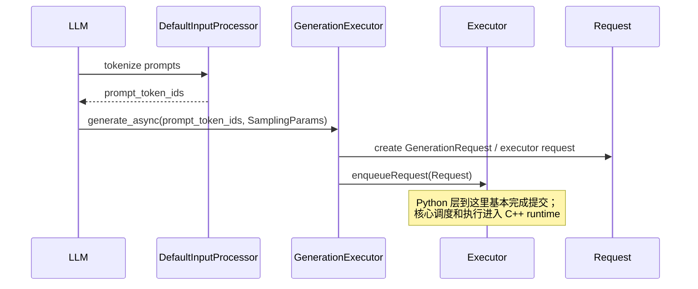

**图 5：C++ In-Flight Batching 调度**
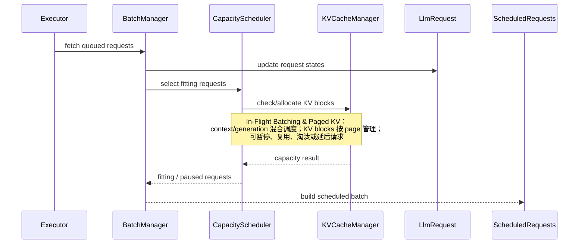

**图 6：Chunked Prefill / LoRA / Guided / Spec Decode 准备**
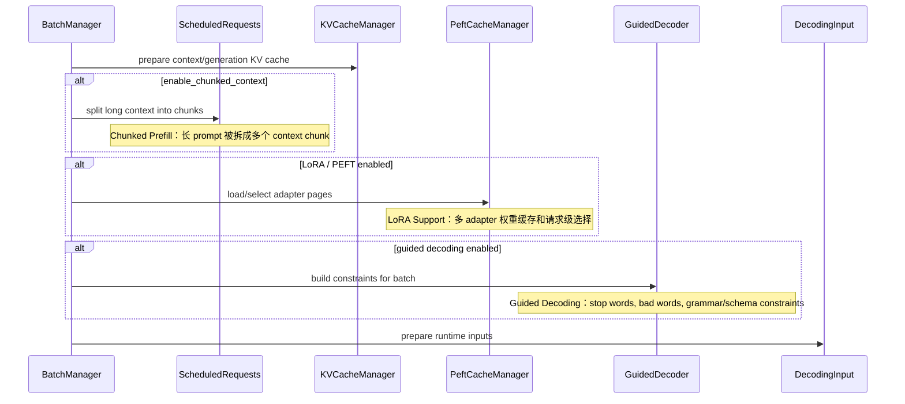

**图 7：TensorRT Engine Forward**
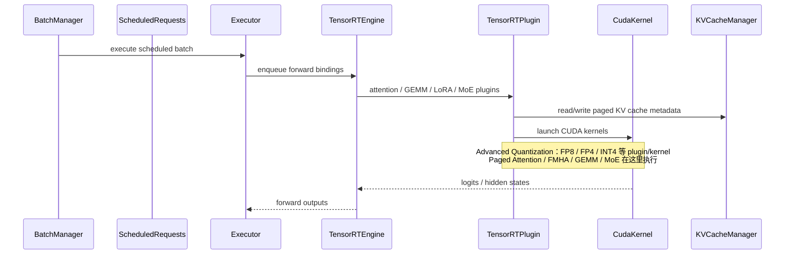

**图 8：C++ Decoder / Sampling**
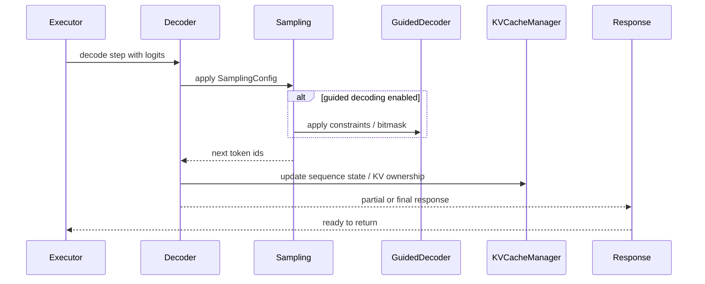

**图 9：返回结果到 Python LLM**
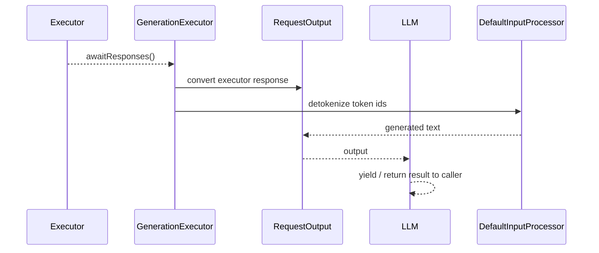

**图 10：Disaggregated Serving 旁路**
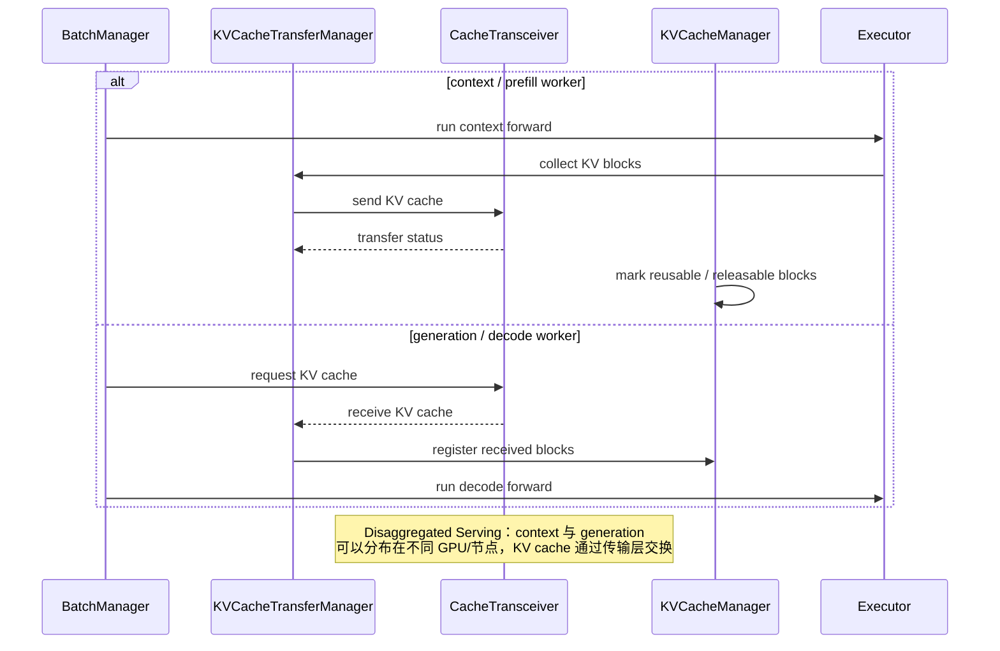

**C++ Backend 连续主链**
```text
LLM
 -> _TrtLLM
 -> BaseLLM
 -> TrtLlmArgs
 -> CachedModelLoader
 -> EngineConfig / ExecutorConfig
 -> GenerationExecutor
 -> C++ Executor
 -> BatchManager
 -> CapacityScheduler
 -> C++ KVCacheManager
 -> ScheduledRequests
 -> TensorRT Engine
 -> TensorRT Plugin
 -> CUDA kernels
 -> Decoder / Sampling
 -> Response
 -> RequestOutput
```

和 PyTorch backend 最大的图上区别是：

```text
PyTorch backend:
会出现 AutoModelForCausalLM、LlamaForCausalLM、Qwen3ForCausalLM、PyTorchModelEngine。

C++ / TensorRT backend:
不会在运行时逐层调用 LlamaForCausalLM.forward；
模型已经固化进 TensorRT Engine，运行时主要看到 Executor、BatchManager、KVCacheManager、TensorRTPlugin、CudaKernel。
```
