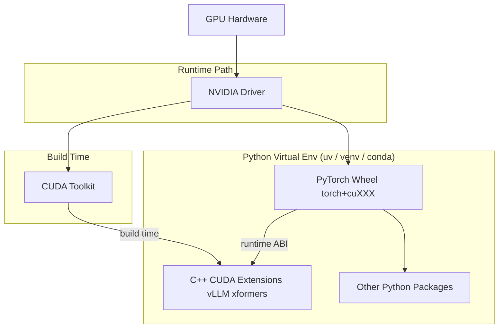

## 1）Contributing to vLLM

贡献方式包括：

-   报 bug / 提 issue
-   新模型支持
-   新功能
-   文档改进
-   给别人答疑、review PR
-   点 star、写文章宣传也算贡献

------

## 2）Developing

### Step 1：拉代码

```bash
git clone https://github.com/vllm-project/vllm.git
cd vllm
```

### Step 2：创建 Python 环境（推荐 uv）

```bash
uv venv --python 3.12 --seed
source .venv/bin/activate
```

如果没有uv，清先安装

```
curl -LsSf https://astral.sh/uv/install.sh | sh
```


为什么推荐 Python 3.12？
因为 vLLM 的 CI（官方自动测试）主要用 3.12，避免你本地跑得过，CI 挂掉。

删除.venv

```
rm -rf .venv
uv cache clean
```

------

## 3）安装 vLLM（分两种情况）

### A：只改 Python 代码（最快、推荐）

```bash
VLLM_USE_PRECOMPILED=1 uv pip install -e .
```

意思是：

-   你安装的是“可编辑模式”（`-e`）
-   但不会本地编译 C++/CUDA
-   会下载对应的预编译 wheel 里的二进制库来用

👉 优点：非常快、适合大多数 PR。

------


### B：改 CUDA/C++（需要本地编译）

如果执行了A步骤，需要：**force-removes the installed `vllm` Python package **

```shell
uv pip uninstall vllm
```

```bash
uv pip install torch torchvision torchaudio \
  --extra-index-url https://download.pytorch.org/whl/cu129
```

当前目录这个项目”用 editable 模式安装

```
CCACHE_NOHASHDIR="true" uv pip install --no-build-isolation -e . -v
CCACHE_NOHASHDIR="true" uv pip install  -e . -v
```

:::error

```
(vllm) [xli49@ghpc008 vllm]$ python examples/offline_inference/basic/basic.py 
Traceback (most recent call last):
  File "/data/home/xli49/vllm/examples/offline_inference/basic/basic.py", line 4, in <module>
    from vllm import LLM, SamplingParams
  File "/data/home/xli49/vllm/vllm/__init__.py", line 74, in __getattr__
    module = import_module(module_name, __package__)
             ^^^^^^^^^^^^^^^^^^^^^^^^^^^^^^^^^^^^^^^
  File "/data/home/xli49/.local/share/uv/python/cpython-3.12.12-linux-x86_64-gnu/lib/python3.12/importlib/__init__.py", line 90, in import_module
    return _bootstrap._gcd_import(name[level:], package, level)
           ^^^^^^^^^^^^^^^^^^^^^^^^^^^^^^^^^^^^^^^^^^^^^^^^^^^^
  File "/data/home/xli49/vllm/vllm/entrypoints/llm.py", line 21, in <module>
    from vllm.config import (
  File "/data/home/xli49/vllm/vllm/config/__init__.py", line 5, in <module>
    from vllm.config.cache import CacheConfig
  File "/data/home/xli49/vllm/vllm/config/cache.py", line 13, in <module>
    from vllm.utils.mem_utils import format_gib, get_cpu_memory
  File "/data/home/xli49/vllm/vllm/utils/mem_utils.py", line 14, in <module>
    from vllm.platforms import current_platform
  File "/data/home/xli49/vllm/vllm/platforms/__init__.py", line 252, in __getattr__
    _current_platform = resolve_obj_by_qualname(platform_cls_qualname)()
                        ^^^^^^^^^^^^^^^^^^^^^^^^^^^^^^^^^^^^^^^^^^^^^^
  File "/data/home/xli49/vllm/vllm/utils/import_utils.py", line 111, in resolve_obj_by_qualname
    module = importlib.import_module(module_name)
             ^^^^^^^^^^^^^^^^^^^^^^^^^^^^^^^^^^^^
  File "/data/home/xli49/.local/share/uv/python/cpython-3.12.12-linux-x86_64-gnu/lib/python3.12/importlib/__init__.py", line 90, in import_module
    return _bootstrap._gcd_import(name[level:], package, level)
           ^^^^^^^^^^^^^^^^^^^^^^^^^^^^^^^^^^^^^^^^^^^^^^^^^^^^
  File "/data/home/xli49/vllm/vllm/platforms/cuda.py", line 16, in <module>
    import vllm._C  # noqa
    ^^^^^^^^^^^^^^
ImportError: /data/home/xli49/vllm/vllm/_C.abi3.so: undefined symbol: _ZN3c104cuda9SetDeviceEa
```


:::


`uv pip install -e .` 把“当前目录这个项目”用 editable 模式安装。`.` = 当前目录（你在 vllm 仓库根目录时，就是 vllm 项目）它会去读取你这个目录里的构建配置，例如：`pyproject.toml`（主要）或 `setup.py`（老项目）。然后把这个项目安装进你的虚拟环境里。

```bash
uv pip install -e . --no-build-isolation
```


### 为什么 vLLM 要求加--no-build-isolation？

因为 vLLM 编译 C++/CUDA 扩展时非常依赖：

-   你当前环境里的 `torch`
-   对应的 CUDA 版本（cu129/cu128 等）
-   以及一些编译相关包

如果用隔离环境，可能会出现：

-   临时环境装了不匹配的 torch
-   找不到你当前 torch 的 CUDA 配置
-   编译失败 or 生成不兼容的二进制


------


### 4）Linting（代码检查/格式化）

vLLM 用 **pre-commit** 来统一代码风格。

-   `uv pip install pre-commit`：安装 pre-commit 工具
-   `pre-commit install`：在当前仓库的 `.git/hooks/` 里安装钩子，以后你每次 `git commit` 会自动跑检查

### 安装并启用：

```bash
uv pip install pre-commit
pre-commit install
```

从此你每次 `git commit` 会自动跑检查 ✅

### 手动跑：

```bash
pre-commit run      # 只检查 staged 的文件
pre-commit run -a   # 检查全部文件（= --all-files）
```

### 一些钩子只在 CI 才跑，本地想跑可以：

```bash
pre-commit run --hook-stage manual markdownlint
pre-commit run --hook-stage manual mypy-3.10
```

------


## 5）Documentation（写文档）

文档用 MkDocs。

### 装文档依赖：

```bash
uv pip install -r requirements/docs.txt
```

### 本地预览文档网站：

```bash
mkdocs serve
```

### 更快的方式（不生成 API ref）：

是为了控制“是否生成 API Reference”。

```bash
API_AUTONAV_EXCLUDE=vllm mkdocs serve
```

------

Ensure that your Python version is compatible with the plugins (e.g., `mkdocs-awesome-nav` requires Python 3.10+)

### Remote Server启动服务

-L = Local port forwarding（本地端口转发）

意思是：**把远程某个端口映射到你本地电脑的端口**。

```
ssh -L 8000:127.0.0.1:8000 xli49@spiedie.binghamton.edu
```


## Remote Server GPU节点启动服务

-J = Jump host（跳板机 / 代理跳转）

意思是：**先连一台机器，再通过它去连另一台机器**。

```shell
ssh -J xli49@spiedie.binghamton.edu -L 8000:127.0.0.1:8000 xli49@ghpc005
```


## 6）Testing（跑测试）

vLLM 用 pytest。

### A.完整 CI 同款（CUDA）

```bash
uv pip install -r requirements/common.txt -r requirements/dev.txt --torch-backend=auto
pytest tests/
```

### B.只装最基本测试工具（通用，会缺失文件等）

```shell
uv pip install pytest pytest-asyncio
pytest tests/
```

跑单个测试文件（方便调试）

```bash
pytest -s -v tests/test_logger.py
```

------


### 7）常见错误：缺 Python.h

如果你编译/装依赖时出现：
`Python.h: No such file or directory`

Ubuntu 解决：

```bash
sudo apt install python3-dev
```

------


## 8）重要提醒（Warnings）

这段很关键：

✅ **仓库还没完全用 mypy 检查完**（别太依赖 mypy 全绿）
⚠️ **CPU 上不是所有测试都能通过**
👉 没 GPU 的话，很多测试你本地跑会失败，官方也说了：这种情况就靠 CI 去跑。

------


## 9）PR 提交规范（很重要）

## DCO 签名

提交 commit 时必须带 `Signed-off-by`：

```bash
git commit -s -m "xxx"
```

## PR 标题必须带前缀分类

比如：

-   `[Bugfix] ...`
-   `[Kernel] ...`
-   `[Core] ...`
-   `[Doc] ...`
-   `[CI/Build] ...`

否则可能不 review。

------

## 总结：你照着做的最短“贡献者流程”

如果你只是改 Python 代码（最常见）：

```bash
git clone https://github.com/vllm-project/vllm.git
cd vllm

uv venv --python 3.12 --seed
source .venv/bin/activate

VLLM_USE_PRECOMPILED=1 uv pip install -e .

uv pip install -r requirements/common.txt -r requirements/dev.txt --torch-backend=auto

pre-commit install
pre-commit run -a
pytest tests/
```

------

如果你告诉我你是要：
1）只改 Python
2）还是要改 CUDA/kernel
我可以给你 **最适合你机器（HPC + CUDA 12.6）的精确命令版本**。。




