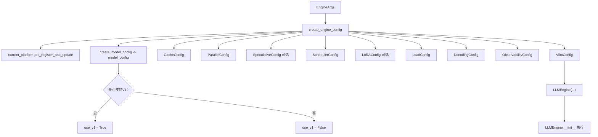

>根据 `EngineArgs`（启动参数）创建并返回一个 `LLMEngine` 实例。EngineArgs -> create_engine_config -> 选择 engine 版本 -> from_vllm_config 初始化并返回引擎实例




```python
# Create the Engine (autoselects V0 vs V1)
self.llm_engine = LLMEngine.from_engine_args(
    engine_args=engine_args, usage_context=UsageContext.LLM_CLASS)
self.engine_class = type(self.llm_engine)
```


 LLMEngine.from_engine_args触发

```python
 @classmethod
    def from_engine_args(
        cls,
        engine_args: EngineArgs,
        usage_context: UsageContext = UsageContext.ENGINE_CONTEXT,
        stat_loggers: Optional[Dict[str, StatLoggerBase]] = None,
    ) -> "LLMEngine":
        """Creates an LLM engine from the engine arguments."""
        # Create the engine configs.
        vllm_config = engine_args.create_engine_config(usage_context)

        engine_cls = cls
        if envs.VLLM_USE_V1:
            from vllm.v1.engine.llm_engine import LLMEngine as V1LLMEngine
            engine_cls = V1LLMEngine

        return engine_cls.from_vllm_config(
            vllm_config=vllm_config,
            usage_context=usage_context,
            stat_loggers=stat_loggers,
            disable_log_stats=engine_args.disable_log_stats,
        )
```

