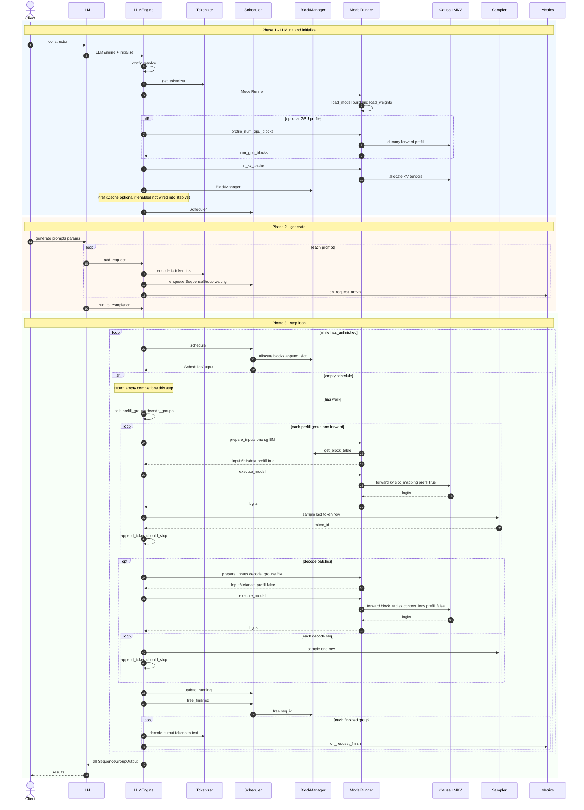

```mermaid
sequenceDiagram
    autonumber
    actor Client
    participant LLM
    participant Engine as LLMEngine
    participant Tok as Tokenizer
    participant Sched as Scheduler
    participant BM as BlockManager
    participant MR as ModelRunner
    participant Model as CausalLMKV
    participant Samp as Sampler
    participant Met as Metrics

    rect rgb(240, 248, 255)
    Note over Client, Met: Phase 1 - LLM init and initialize
    Client->>LLM: constructor
    LLM->>Engine: LLMEngine + initialize
    Engine->>Engine: config.resolve
    Engine->>Tok: get_tokenizer
    Engine->>MR: ModelRunner
    MR->>MR: load_model build and load_weights
    alt optional GPU profile
        Engine->>MR: profile_num_gpu_blocks
        MR->>Model: dummy forward prefill
        MR-->>Engine: num_gpu_blocks
    end
    Engine->>MR: init_kv_cache
    MR->>Model: allocate KV tensors
    Engine->>BM: BlockManager
    Note over Engine: PrefixCache optional if enabled not wired into step yet
    Engine->>Sched: Scheduler
    end

    rect rgb(255, 248, 240)
    Note over Client, Met: Phase 2 - generate
    Client->>LLM: generate prompts params
    loop each prompt
        LLM->>Engine: add_request
        Engine->>Tok: encode to token ids
        Engine->>Sched: enqueue SequenceGroup waiting
        Engine->>Met: on_request_arrival
    end
    LLM->>Engine: run_to_completion
    end

    rect rgb(248, 255, 248)
    Note over Client, Met: Phase 3 - step loop
    loop while has_unfinished
        Engine->>Sched: schedule
        Sched->>BM: allocate blocks append_slot
        Sched-->>Engine: SchedulerOutput

        alt empty schedule
            Note over Engine: return empty completions this step
        else has work
            Engine->>Engine: split prefill_groups decode_groups

            loop each prefill group one forward
                Engine->>MR: prepare_inputs one sg BM
                MR->>BM: get_block_table
                MR-->>Engine: InputMetadata prefill true
                Engine->>MR: execute_model
                MR->>Model: forward kv slot_mapping prefill true
                Model-->>MR: logits
                MR-->>Engine: logits
                Engine->>Samp: sample last token row
                Samp-->>Engine: token_id
                Engine->>Engine: append_token should_stop
            end

            opt decode batches
                Engine->>MR: prepare_inputs decode_groups BM
                MR-->>Engine: InputMetadata prefill false
                Engine->>MR: execute_model
                MR->>Model: forward block_tables context_lens prefill false
                Model-->>MR: logits
                MR-->>Engine: logits
                loop each decode seq
                    Engine->>Samp: sample one row
                    Engine->>Engine: append_token should_stop
                end
            end

            Engine->>Sched: update_running
            Engine->>Sched: free_finished
            Sched->>BM: free seq_id

            loop each finished group
                Engine->>Tok: decode output tokens to text
                Engine->>Met: on_request_finish
            end
        end
    end
    Engine-->>LLM: all SequenceGroupOutput
    LLM-->>Client: results
    end

```
