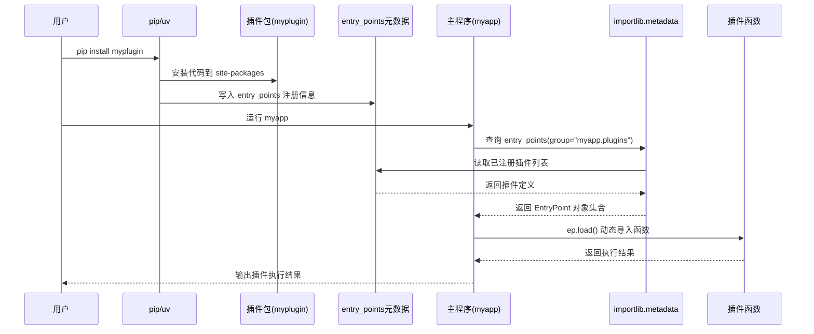

# Installation

## vLLM supports the following hardware platforms

-   GPU
    -   [NVIDIA CUDA](https://docs.vllm.ai/en/latest/getting_started/installation/gpu/#nvidia-cuda)
    -   [AMD ROCm](https://docs.vllm.ai/en/latest/getting_started/installation/gpu/#amd-rocm)
    -   [Intel XPU](https://docs.vllm.ai/en/latest/getting_started/installation/gpu/#intel-xpu)
-   CPU
    -   [Intel/AMD x86](https://docs.vllm.ai/en/latest/getting_started/installation/cpu/#intelamd-x86)
    -   [ARM AArch64](https://docs.vllm.ai/en/latest/getting_started/installation/cpu/#arm-aarch64)
    -   [Apple silicon](https://docs.vllm.ai/en/latest/getting_started/installation/cpu/#apple-silicon)
    -   [IBM Z (S390X)](https://docs.vllm.ai/en/latest/getting_started/installation/cpu/#ibm-z-s390x)

## Hardware Plugins[¶](https://docs.vllm.ai/en/latest/getting_started/installation/#hardware-plugins)

vLLM supports third-party hardware plugins that live **outside** the main `vllm` repository. These follow the [Hardware-Pluggable RFC](https://docs.vllm.ai/en/latest/design/plugin_system/).

A list of all supported hardware can be found on the [vllm.ai website](https://vllm.ai/#hardware). If you want to add new hardware, please contact us on [Slack](https://slack.vllm.ai/) or [Email](mailto:collaboration@vllm.ai).



-   用户：触发安装与运行的人（执行 `pip install` / `myapp`）。
-   pip/uv：包管理器；安装包到 `site-packages` 并写入分发元数据（含 entry_points）。
-   插件包（myplugin）：提供扩展功能的 Python 包，通过配置声明自己是某个“插件组”的成员。
-   site-packages：Python 环境的第三方包安装目录，解释器从这里导入已安装库。
-   安装：把包文件放进环境并写入元数据，使其可被导入/发现。
-   entry_points：包元数据里的“入口声明”，用于生成命令或注册插件。
-   entry_points 元数据：entry_points 声明在安装后落地成的可查询注册信息（通常在 `*.dist-info` 下）。
-   `*.dist-info`：每个已安装分发的元数据目录（版本、依赖、入口点等）。
-   主程序（myapp）：消费插件的应用，运行时扫描并加载已安装插件。
-   插件组（group，如 `"myapp.plugins"`）：插件的命名空间/分类；主程序按组查找插件。
-   插件名（如 `hello`）：同一组内插件的标识符，用于选择/显示/冲突检测。
-   入口目标字符串（如 `"myplugin.plugin:hello"`）：指向“模块路径:对象名”，告诉系统要加载什么。
-   importlib.metadata：Python 标准库模块，用来读取已安装包的元数据（含 entry_points）。
-   `entry_points(group=...)`：查询指定插件组下所有已注册入口点的 API 调用。
-   已注册插件列表：查询结果，表示当前环境中该组有哪些插件。
-   EntryPoint 对象：对单个入口点的封装，包含 name/group/target 等信息。
-   `ep.load()`：按入口目标动态导入并返回对应的函数/类/对象。
-   动态导入：运行时根据字符串路径加载模块与对象（无需主程序提前依赖插件）。
-   插件函数：插件提供的可调用入口（例如 `hello()`），被主程序加载后执行。
-   执行结果：插件函数返回的值或产生的效果（主程序拿来展示/组合/调用）。
-   输出插件执行结果：主程序把执行结果打印到终端或写入日志/返回给调用方。


## [NVIDIA CUDA](https://docs.vllm.ai/en/latest/getting_started/installation/gpu/#nvidia-cuda) 

https://docs.vllm.ai/en/latest/getting_started/installation/gpu

-   GPU: compute capability 7.0 or higher (e.g., V100, T4, RTX20xx, A100, L4, H100, etc.)
-   OS: Linux
-   Python: 3.10 -- 3.13
-   vLLM contains pre-compiled C++ and CUDA (12.8) binaries. 
-   recommended to use [uv](https://docs.astral.sh/uv/)


## Set up using Python

### Create a new Python environment

建议使用[uv](https://docs.astral.sh/uv/)（一款速度非常快的 Python 环境管理器）来创建和管理 Python 环境。请按照[文档](https://docs.astral.sh/uv/#getting-started)进行安装`uv`。安装完成后`uv`，您可以使用以下命令创建新的 Python 环境：

```
uv venv --python 3.12 --seed
source .venv/bin/activate
```

-   Wheel（.whl）就是 Python 包的“预编译安装包”

-   uv 用 **Rust** 写的，通常：比 pip 快 10～100 倍。

    `uv pip` → 管理包（= pip）

    `uv venv` → 建虚拟环境

    `uv python` → 管理 Python 版本

    `uv run` → 运行脚本

    

### Pre-built wheels

uv会检测CUDA，选择合适的**PyTorch wheel**， 安装匹配的 **vLLM**

```
uv pip install vllm --torch-backend=auto # uv pip

pip install vllm --extra-index-url https://download.pytorch.org/whl/cu129 # pip
```

--torch-backend 等价：UV_TORCH_BACKEND=auto

 To select a specific backend (e.g., `cu128`), set `--torch-backend=cu128` (or `UV_TORCH_BACKEND=cu128`). ==If this doesn't work, try running `uv self update` to update `uv` first.==

==NVIDIA Blackwell GPUs (B200, GB200) require a minimum of CUDA 12.8==


uv也可以手动指定CUDA版本：

==As of now, vLLM's binaries are compiled with CUDA 12.9 and public PyTorch release versions by default.==

```
# Install vLLM with a specific CUDA version (e.g., 13.0).
export VLLM_VERSION=$(curl -s https://api.github.com/repos/vllm-project/vllm/releases/latest | jq -r .tag_name | sed 's/^v//')

export CUDA_VERSION=130 # or other

export CPU_ARCH=$(uname -m) # x86_64 or aarch64

uv pip install https://github.com/vllm-project/vllm/releases/download/v${VLLM_VERSION}/vllm-${VLLM_VERSION}+cu${CUDA_VERSION}-cp38-abi3-manylinux_2_35_${CPU_ARCH}.whl --extra-index-url https://download.pytorch.org/whl/cu${CUDA_VERSION}
```


### Install the latest code

allow users to try the latest code without waiting for the next release, vLLM provides wheels for every commit since `v0.5.3` on https://wheels.vllm.ai/nightly.

```
uv pip install -U vllm \
  --torch-backend=auto \
  --extra-index-url https://wheels.vllm.ai/nightly
```


强烈建议使用uv而不是pip：

Using `pip` to install from nightly indices is *not supported*, because `pip` combines packages from `--extra-index-url` and the default index, choosing only the latest version, which makes it difficult to install a development version prior to the released version. In contrast, `uv` gives the extra index [higher priority than the default index](https://docs.astral.sh/uv/pip/compatibility/#packages-that-exist-on-multiple-indexes).


**bisect（二分定位问题）**

-   更新后 **突然变慢**
-   新版本 **出现 bug**

```
export VLLM_COMMIT=72d9c316d3f6ede485146fe5aabd4e61dbc59069 # use full commit hash from the main branch
uv pip install vllm \
    --torch-backend=auto \
    --extra-index-url https://wheels.vllm.ai/${VLLM_COMMIT} # add variant subdirectory here if needed
```


### Build wheel from source

#### Set up using Python-only build (without compilation)

If you only need to change Python code, you can build and install vLLM without compilation. Using `uv pip`'s [`--editable` flag](https://docs.astral.sh/uv/pip/packages/#editable-packages), changes you make to the code will be reflected when you run vLLM:

==pip install: The responsibility of pip is to place libraries where they can be found, they would be copy to site-packages==

==--editable .: create a link in site-packages that points to your original source code directory==

```
git clone https://github.com/vllm-project/vllm.git
cd vllm
VLLM_USE_PRECOMPILED=1 uv pip install --editable .
```


## Set up using Docker

==Docker is a tool, a container that lets you run software inside  a lightweight, isolated environment. Everything is pre-packed in the image==

vLLM offers an official Docker image for deployment. The image can be used to run OpenAI compatible server and is available on Docker Hub as [vllm/vllm-openai](https://hub.docker.com/r/vllm/vllm-openai/tags).

```
docker run --runtime nvidia --gpus all \
    -v ~/.cache/huggingface:/root/.cache/huggingface \
    --env "HF_TOKEN=$HF_TOKEN" \
    -p 8000:8000 \
    --ipc=host \
    vllm/vllm-openai:latest \
    --model Qwen/Qwen3-0.6B
```


The same **Docker image** can be run not only with Docker, but also with **other container tools** like **Podman**.

```
podman run --device nvidia.com/gpu=all \
-v ~/.cache/huggingface:/root/.cache/huggingface \
--env "HF_TOKEN=$HF_TOKEN" \
-p 8000:8000 \
--ipc=host \
docker.io/vllm/vllm-openai:latest \
--model Qwen/Qwen3-0.6B
```

