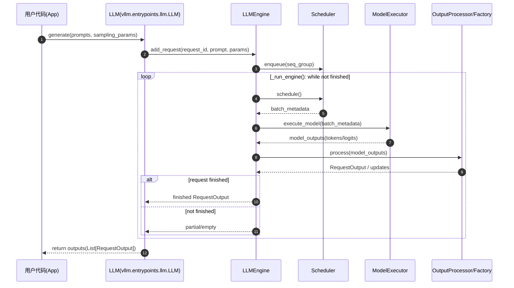
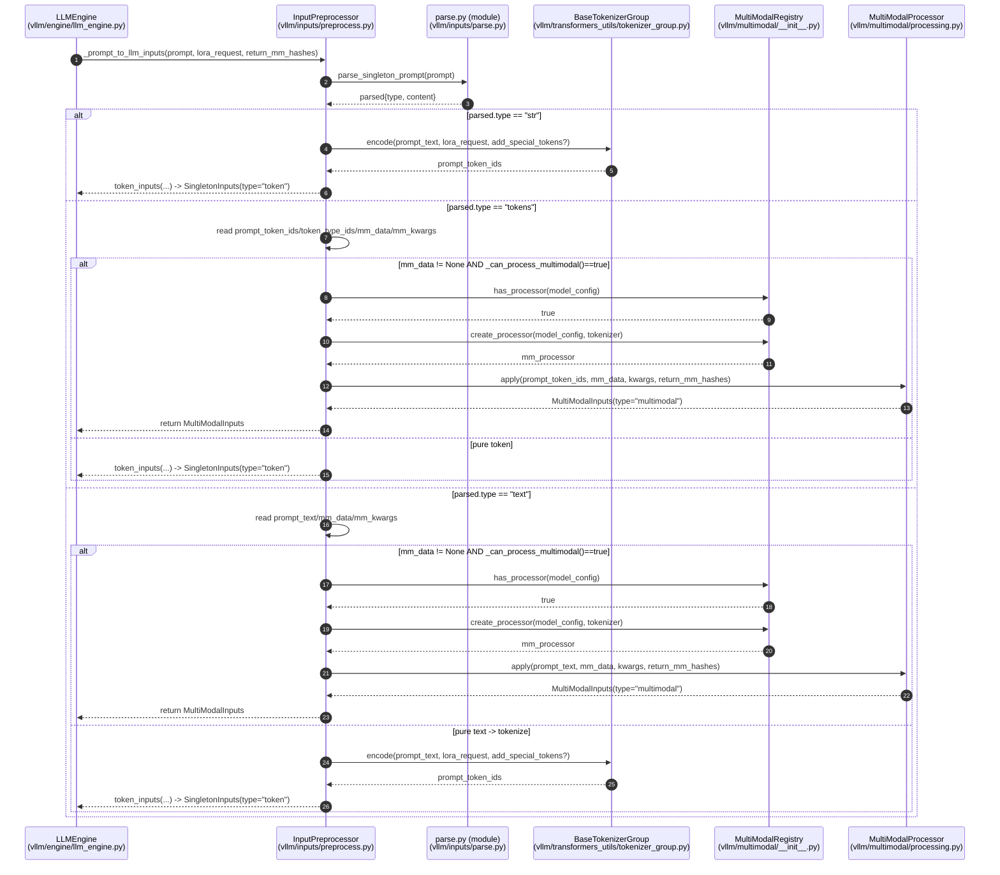
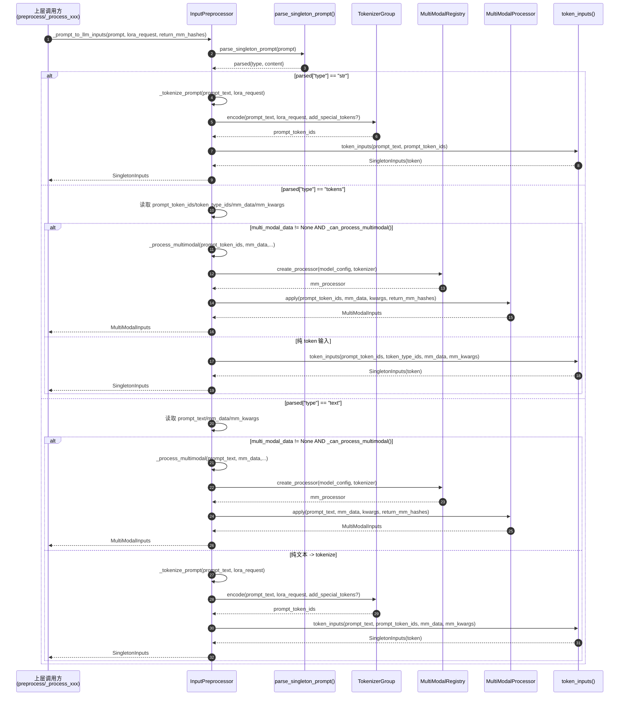
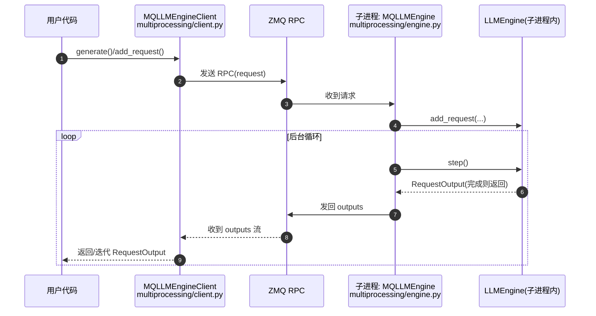
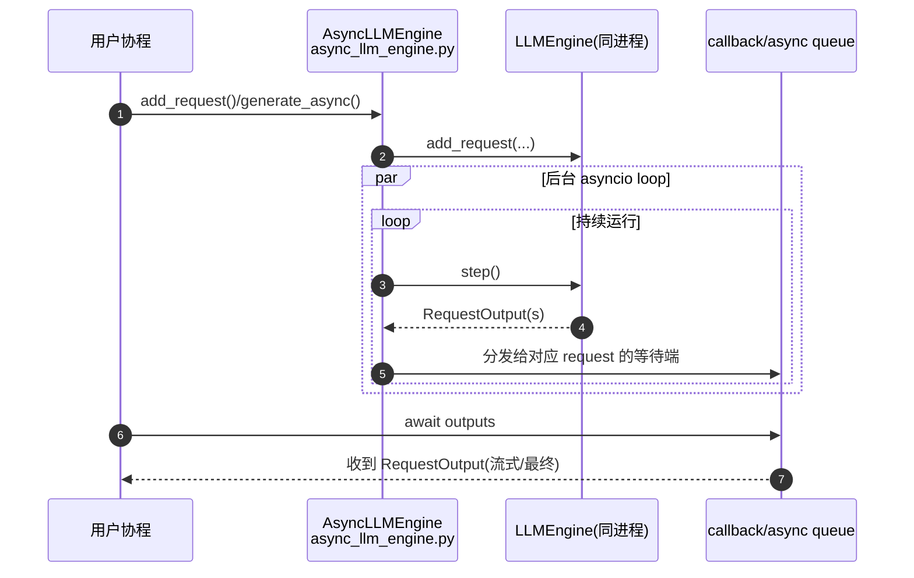

>   下面给你把 **v0 的完整流程画成时序图**（包含：LLM.generate → add_request → scheduler/execute → process_outputs → 返回 RequestOutput，以及多进程/异步外层封装）。

------

# 单进程 v0 主链路







# `InputPreprocessor._prompt_to_llm_inputs()`

-   **Caller（LLMEngine）**：上层入口，最终会调用 `InputPreprocessor._prompt_to_llm_inputs()` 来把“用户 prompt”变成模型可用的输入结构。
-   **IP（InputPreprocessor）**：核心逻辑所在，负责：
    -   解析 prompt 类型
    -   文本 tokenize
    -   多模态处理（如果有 mm_data）
    -   输出统一的 `SingletonInputs`
-   **ParserMod（parse.py）**：解析 prompt 的工具模块，提供 `parse_singleton_prompt()`。
-   **TokGroup（BaseTokenizerGroup）**：tokenizer 管理器，负责把文本转 token ids。
-   **MMReg（MultiModalRegistry）**：多模态处理器注册表，判断模型能不能处理多模态，并创建对应 processor。
-   **MMProc（MultiModalProcessor）**：真正执行多模态处理的 processor，`apply()` 会产出 token ids + mm placeholders + mm kwargs 等。




------

## 1）Caller 调用 IP：开始预处理

图里：

```
Caller->>IP: _prompt_to_llm_inputs(prompt, lora_request, return_mm_hashes)
```

代码意义：

上层把一个 `prompt: SingletonPrompt` 交给 `InputPreprocessor`，要求它转成内部统一的 `SingletonInputs`。这里 `lora_request` 影响 tokenizer（比如 LoRA 专用 tokenizer / special tokens）。`return_mm_hashes` 决定多模态处理器是否返回 multimodal hashes。


------

## 2）IP 调用 ParserMod：先把 prompt “拆类型”

图里：

```
IP->>ParserMod: parse_singleton_prompt(prompt)`
`ParserMod-->>IP: parsed{type, content}
```

对应代码：

```python
<!--vllm/inputs/parse.py-->
parsed = parse_singleton_prompt(prompt)
```


```
<!--vllm/inputs/data.py-->

```


```
<!--vllm/inputs/parse.py-->
class ParsedStrPrompt(TypedDict):
    type: Literal["str"]
    content: str


class ParsedTextPrompt(TypedDict):
    type: Literal["text"]
    content: TextPrompt


class ParsedTokensPrompt(TypedDict):
    type: Literal["tokens"]
    content: TokensPrompt
    
def parse_singleton_prompt(
    prompt: SingletonPrompt, # SingletonPrompt = Union[str, TextPrompt, TokensPrompt] 
) -> Union[ParsedStrPrompt, ParsedTextPrompt, ParsedTokensPrompt]:
    if isinstance(prompt, str):
        return ParsedStrPrompt(type="str", content=prompt)
    elif isinstance(prompt, dict):
        if "prompt_token_ids" in prompt:
            return ParsedTokensPrompt(type="tokens",
                                      content=prompt)  # type: ignore
        elif "prompt" in prompt:
            return ParsedTextPrompt(type="text", content=prompt)

    raise TypeError("inputs must be a string, TextPrompt, or TokensPrompt")

```

### parsed 可能有 3 种类型（关键分叉点）

-   `type == "str"`：prompt 就是普通 Python 字符串
-   `type == "tokens"`：prompt 直接给了 token ids（以及可选 token_type_ids / multi_modal_data / kwargs）
-   `type == "text"`：prompt 是一个 dict，里面有 "prompt" 字符串 + 可选 multi_modal_data

**这个解析步骤的目的**：后续逻辑只需要看 `parsed["type"]`，就知道怎么走。

------

## 3）分支一：parsed.type == "str"

图里：

-   调 tokenizer encode
-   然后 token_inputs 返回

发生了什么（一步一步）

#### 3.1 IP 调用 TokGroup.encode：把文字变 token ids

```
IP->>TokGroup: encode(prompt_text, lora_request, add_special_tokens?)
```

对应代码：

```python
prompt_token_ids = self._tokenize_prompt(prompt_text, lora_request=lora_request)
```

而 `_tokenize_prompt()` 内部：

-   取得 tokenizer：`tokenizer = self.get_tokenizer_group()`
-   某些模型特殊逻辑（比如 whisper 不加 special tokens）
-   可能 lower case（encoder_config.do_lower_case）
-   最后：

```python
return tokenizer.encode(prompt=prompt, lora_request=lora_request, add_special_tokens=add_special_tokens)
```

#### 3.2 IP 组装输出：token_inputs(...)

图里写：
`IP-->>Caller: token_inputs(...) -> SingletonInputs(type="token")`

对应代码：

```python
return token_inputs(prompt=prompt_text, prompt_token_ids=prompt_token_ids)
```

✅ 结果：得到统一结构 `SingletonInputs`（type="token"），交回上层。

------

# 4）分支二：parsed.type == "tokens"

这个分支代表：**调用方已经提供 token ids**，IP 不需要 tokenize 文字，但要检查是否包含多模态。

### 图里：

```
IP->>IP: read prompt_token_ids/token_type_ids/mm_data/mm_kwargs
```

对应代码：

```python
prompt_token_ids = tokens_content["prompt_token_ids"]
token_type_ids = tokens_content.get("token_type_ids")
multi_modal_data = tokens_content.get("multi_modal_data")
mm_processor_kwargs = tokens_content.get("mm_processor_kwargs")
```

接下来又分两条路：

------

## 4A）tokens + multi_modal_data（并且模型支持新多模态 pipeline）

### 图里条件：

```
mm_data != None AND _can_process_multimodal()==true
```

### 4A.1 先检查模型是否能走多模态处理器

图里：
`IP->>MMReg: has_processor(model_config)`
`MMReg-->>IP: true`

对应 `_can_process_multimodal()` 内部的核心判断：

-   如果不是多模态模型 → 直接 ValueError
-   如果是多模态模型：
    -   `mm_registry.has_processor(model_config)` 为 true 才能走新 pipeline
    -   否则说明是 legacy pipeline（会 warning）

### 4A.2 创建 processor

图里：
`IP->>MMReg: create_processor(model_config, tokenizer)`
`MMReg-->>IP: mm_processor`

对应代码：

```python
mm_processor = self.mm_registry.create_processor(self.model_config, tokenizer)
```

这里 tokenizer 可能为 None（某些模型允许无 tokenizer 的多模态初始化）。

### 4A.3 调用 processor.apply 执行多模态处理

图里：
`IP->>MMProc: apply(prompt_token_ids, mm_data, kwargs, return_mm_hashes)`
`MMProc-->>IP: MultiModalInputs(type="multimodal")`

对应代码：

```python
return mm_processor.apply(prompt, mm_data, mm_processor_kwargs, return_mm_hashes)
```

✅ 最终 IP 返回 `MultiModalInputs` 给 Caller。

------

## 4B）tokens 但没有 mm_data（或不能走新多模态 pipeline）

图里：
`else pure token`

对应代码路径：

```python
return token_inputs(
    prompt_token_ids=prompt_token_ids,
    token_type_ids=token_type_ids,
    multi_modal_data=multi_modal_data,
    mm_processor_kwargs=mm_processor_kwargs,
)
```

✅ 结果仍是 `SingletonInputs(type="token")`。

------

# 5）分支三：parsed.type == "text"

这个分支表示：prompt 是 dict，里面有 `"prompt": "...text..."`，可能还有 multi_modal_data。

### 图里：

```
IP->>IP: read prompt_text/mm_data/mm_kwargs
```

对应代码：

```python
prompt_text = text_content["prompt"]
multi_modal_data = text_content.get("multi_modal_data")
mm_processor_kwargs = text_content.get("mm_processor_kwargs")
```

然后同样分两路：

------

## 5A）text + multi_modal_data 且可走多模态

流程与 4A 基本相同，只是 `apply()` 的 prompt 参数是 **prompt_text**（字符串）而不是 token ids。

图里：

-   has_processor
-   create_processor
-   apply(prompt_text, ...)

对应代码：

```python
return self._process_multimodal(
    prompt_text,
    multi_modal_data,
    mm_processor_kwargs,
    lora_request=lora_request,
    return_mm_hashes=return_mm_hashes,
)
```

------

## 5B）纯文本：先 tokenize 再 token_inputs

图里：
`else pure text -> tokenize`

对应代码：

```python
prompt_token_ids = self._tokenize_prompt(prompt_text, lora_request=lora_request)
return token_inputs(
    prompt=prompt_text,
    prompt_token_ids=prompt_token_ids,
    multi_modal_data=multi_modal_data,
    mm_processor_kwargs=mm_processor_kwargs,
)
```

✅ 返回 `SingletonInputs(type="token")`

------

# 6）这张图总结一句话

`_prompt_to_llm_inputs()` 做的事就是：

1.  **parse prompt 类型**
2.  **三种输入形态统一成 SingletonInputs**
    -   纯文本 → tokenize → token_inputs
    -   直接 tokens → 直接 token_inputs（必要时保留 token_type_ids）
    -   带 multi_modal_data → 走 MultiModalProcessor.apply → MultiModalInputs

------

如果你想要更细的“逐行对应”讲解，我也可以把每个分支里关键代码行号/片段标出来（尤其是 `_tokenize_prompt()`、`_can_process_multimodal()`、`_process_multimodal()` 三块）。


## 2) 多进程封装（MQLLMEngine / Client）时序图



------

## 3) 异步封装（AsyncLLMEngine）时序图



------

如果你希望我把它进一步画成 **“组件层级图（类之间的调用关系图）”** 或者 **“带关键数据结构字段（SequenceGroupMetadata / ExecuteModelRequest / SchedulerOutputs）的时序图”**，我也可以继续补一版更细的。
