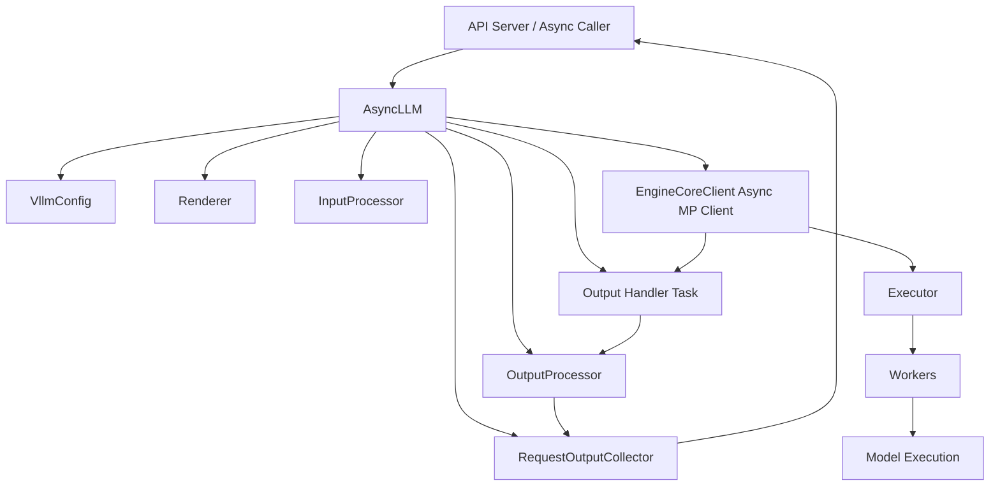

# vLLM `AsyncLLM` Study Notes

## 1. Architecture

### 1) High-level architecture

`AsyncLLM` is the asynchronous engine wrapper used by serving paths, where requests are submitted with `async` APIs and outputs are streamed back through per-request collectors. :contentReference[oaicite:0]{index=0}



### 2) Core components

| Component                | Explanation                                                  |
| ------------------------ | ------------------------------------------------------------ |
| `VllmConfig`             | Stores runtime configuration for model, scheduler, cache, profiler, and parallel execution. |
| `Executor`               | Selects the backend implementation that runs worker-side execution. |
| `renderer`               | Converts configured input formats into model-ready representations. |
| `InputProcessor`         | Converts prompts or engine inputs into `EngineCoreRequest`.  |
| `OutputProcessor`        | Converts engine-core outputs into request-level outputs and pushes them into collectors. |
| `EngineCoreClient`       | Creates the asynchronous multi-process engine-core client.   |
| `RequestOutputCollector` | Buffers streamed outputs for one request.                    |
| `output_handler`         | Runs as a background `asyncio` task and moves outputs from engine core to collectors. |
| `StatLoggerManager`      | Records runtime statistics when logging is enabled.          |
| `profiler`               | Optionally records CPU-side profiling traces.                |

### 3) Initialization flow

`AsyncLLM.__init__()` creates the renderer, input processor, output processor, async engine-core client, optional logger manager, optional output handler, and optional profiler.

```
AsyncLLM(...)
 |
Register serializable transformer configs
 |
Store VllmConfig and model configuration
 |
Initialize tracing if configured
 |
Create renderer
 |
Create InputProcessor
 |
Create OutputProcessor
 |
Create EngineCoreClient async multi-process client
 |
Create StatLoggerManager if logging is enabled
 |
Start output handler if already inside an event loop
 |
Create torch profiler if configured
```

### 4) Request submission flow

`add_request()` validates engine health, converts the prompt into an `EngineCoreRequest`, creates a `RequestOutputCollector`, registers the request with `OutputProcessor`, and submits it to `EngineCoreClient`.

```
add_request()
 |
Check engine health
 |
Validate request type and params
 |
InputProcessor.process_inputs()
 |
InputProcessor.assign_request_id()
 |
_run_output_handler()
 |
Create RequestOutputCollector
 |
OutputProcessor.add_request()
 |
EngineCoreClient.add_request_async()
 |
Return collector
```

### 5) Streaming generation flow

`generate()` submits the request through `add_request()` and then yields outputs from the collector until the request is finished.

```
generate()
 |
await add_request()
 |
Read from RequestOutputCollector
 |
yield RequestOutput
 |
Stop when output.finished is true
 |
Close collector
```

### 6) Background output handling flow

`_run_output_handler()` creates a long-running background task that continuously pulls engine-core outputs, processes them in chunks, aborts stopped requests, and records metrics.

```
output_handler task
 |
await engine_core.get_output_async()
 |
Split outputs into chunks
 |
OutputProcessor.process_outputs()
 |
Push outputs into request collectors
 |
Abort requests stopped by stop strings
 |
Update scheduler stats
 |
Record runtime stats
```

### 7) Streaming input flow

`_add_streaming_input_request()` supports an async input generator by converting each input chunk into a resumable internal request and sending a final empty request when the input stream ends.

```
Async input generator
 |
Validate streaming sampling params
 |
Create final request for validation and finish signal
 |
Create RequestOutputCollector
 |
For each input chunk
 |
Process chunk into resumable EngineCoreRequest
 |
Submit chunk request
 |
Submit final request when stream ends
```

### 8) Error handling flow

`generate()` aborts active requests when the caller disconnects or the generator is cancelled, propagates engine-dead errors directly, and wraps unexpected failures as `EngineGenerateError`.

```
CancelledError / GeneratorExit
 |
abort(request_id, internal=True)
 |
raise original cancellation

EngineDeadError
 |
raise directly

Unexpected Exception
 |
abort request
 |
raise EngineGenerateError
```

<br>

## 2. Interface

### 1) Constructor

`AsyncLLM(vllm_config, executor_class, log_stats, ...)` creates an asynchronous wrapper around the vLLM engine core.

```
import asyncio

from vllm.engine.arg_utils import AsyncEngineArgs
from vllm.usage.usage_lib import UsageContext
from vllm.v1.engine.async_llm import AsyncLLM

async def main():
    engine_args = AsyncEngineArgs(model="facebook/opt-125m")
    engine = AsyncLLM.from_engine_args(
        engine_args,
        usage_context=UsageContext.OPENAI_API_SERVER,
    )

    print(type(engine).__name__)
    engine.shutdown()

asyncio.run(main())

# Output:
# AsyncLLM
```

| Option                     | Explanation                                              |
| -------------------------- | -------------------------------------------------------- |
| `vllm_config`              | Full runtime configuration.                              |
| `executor_class`           | Executor backend used by the engine core.                |
| `log_stats`                | Enables runtime statistics logging.                      |
| `usage_context`            | Identifies where the engine is being used.               |
| `mm_registry`              | Provides multi-modal registration support.               |
| `log_requests`             | Enables request-level logging.                           |
| `start_engine_loop`        | Controls whether the engine loop should start.           |
| `stat_loggers`             | Provides custom statistics loggers.                      |
| `aggregate_engine_logging` | Aggregates logging across engine instances.              |
| `client_addresses`         | Provides client addresses for distributed async clients. |
| `client_count`             | Number of async clients participating.                   |
| `client_index`             | Index of the current async client.                       |

### 2) Factory methods

These methods construct `AsyncLLM` from either `VllmConfig` or `AsyncEngineArgs`.

```
import asyncio

from vllm.engine.arg_utils import AsyncEngineArgs
from vllm.v1.engine.async_llm import AsyncLLM

async def main():
    engine_args = AsyncEngineArgs(model="facebook/opt-125m")
    engine = AsyncLLM.from_engine_args(engine_args)

    print(engine.is_running)
    engine.shutdown()

asyncio.run(main())

# Output:
# True
```

| Interface                            | Explanation                                       |
| ------------------------------------ | ------------------------------------------------- |
| `from_vllm_config(vllm_config, ...)` | Creates `AsyncLLM` from an existing `VllmConfig`. |
| `from_engine_args(engine_args, ...)` | Creates `AsyncLLM` from `AsyncEngineArgs`.        |

### 3) Request lifecycle APIs

These APIs add requests, stream generated outputs, encode pooling outputs, abort requests, and shut down engine resources.

```
import asyncio

from vllm.engine.arg_utils import AsyncEngineArgs
from vllm.sampling_params import SamplingParams
from vllm.v1.engine.async_llm import AsyncLLM

async def main():
    engine_args = AsyncEngineArgs(model="facebook/opt-125m")
    engine = AsyncLLM.from_engine_args(engine_args)

    params = SamplingParams(max_tokens=8)

    async for output in engine.generate(
        prompt="Hello, my name is",
        sampling_params=params,
        request_id="req-1",
    ):
        if output.finished:
            print(output.outputs[0].text)

    engine.shutdown()

asyncio.run(main())

# Output:
# <generated text depends on model>
```

| Interface                                                 | Explanation                                                  |
| --------------------------------------------------------- | ------------------------------------------------------------ |
| `add_request(request_id, prompt, params, ...)`            | Adds a request and returns a `RequestOutputCollector`.       |
| `_add_request(request, prompt, parent_req, index, queue)` | Registers one internal request and submits it to engine core. |
| `generate(prompt, sampling_params, request_id, ...)`      | Streams `RequestOutput` values until the request finishes.   |
| `encode(prompt, pooling_params, request_id, ...)`         | Streams `PoolingRequestOutput` values for pooling-style tasks. |
| `abort(request_id, internal=False)`                       | Aborts one or more requests in both output processing and engine core. |
| `shutdown(timeout=None)`                                  | Cleans up renderer, engine core, Prometheus state, and output handler. |

### 4) Streaming input APIs

Streaming input allows the request prompt to arrive as an async generator instead of a single complete prompt.

```
import asyncio

from vllm.engine.protocol import StreamingInput
from vllm.sampling_params import SamplingParams
from vllm.v1.engine.async_llm import AsyncLLM
from vllm.engine.arg_utils import AsyncEngineArgs

async def input_stream():
    yield StreamingInput(prompt="Hello", sampling_params=None)
    yield StreamingInput(prompt=" world", sampling_params=None)

async def main():
    engine_args = AsyncEngineArgs(model="facebook/opt-125m")
    engine = AsyncLLM.from_engine_args(engine_args)

    params = SamplingParams(max_tokens=8)

    async for output in engine.generate(
        prompt=input_stream(),
        sampling_params=params,
        request_id="stream-req-1",
    ):
        if output.finished:
            print(output.finished)

    engine.shutdown()

asyncio.run(main())

# Output:
# True
```

| Interface                                           | Explanation                                                  |
| --------------------------------------------------- | ------------------------------------------------------------ |
| `_add_streaming_input_request(...)`                 | Converts async input chunks into resumable internal requests. |
| `_validate_streaming_input_sampling_params(params)` | Rejects unsupported streaming-input parameter combinations.  |

### 5) Output handler APIs

`_run_output_handler()` starts the background loop that transfers outputs from engine core into per-request collectors.

```
_run_output_handler()
 |
Create asyncio task
 |
Pull outputs from engine core
 |
Process outputs through OutputProcessor
 |
Push outputs into collectors
```

| Interface               | Explanation                                                  |
| ----------------------- | ------------------------------------------------------------ |
| `_run_output_handler()` | Starts the background output loop if it is not already running. |
| `is_running`            | Returns whether the output handler is active or not stopped. |
| `is_stopped`            | Returns whether the engine has errored.                      |
| `errored`               | Returns whether the engine core is dead or the handler has stopped. |
| `dead_error`            | Returns `EngineDeadError`.                                   |

### 6) Pause and resume APIs

These APIs pause scheduling, resume generation, and check whether scheduling is paused.

```
import asyncio

from vllm.engine.arg_utils import AsyncEngineArgs
from vllm.v1.engine.async_llm import AsyncLLM

async def main():
    engine_args = AsyncEngineArgs(model="facebook/opt-125m")
    engine = AsyncLLM.from_engine_args(engine_args)

    await engine.pause_generation(mode="abort", clear_cache=True)
    print(await engine.is_paused())

    await engine.resume_generation()
    print(await engine.is_paused())

    engine.shutdown()

asyncio.run(main())

# Output:
# True
# False
```

| Interface                                          | Explanation                                                  |
| -------------------------------------------------- | ------------------------------------------------------------ |
| `pause_generation(mode="abort", clear_cache=True)` | Pauses scheduling and handles in-flight requests according to the pause mode. |
| `resume_generation()`                              | Resumes scheduling after a pause.                            |
| `is_paused()`                                      | Returns whether the scheduler is currently paused.           |

### 7) Cache and tokenizer APIs

These APIs expose tokenizer access and reset caches used by multi-modal, prefix, and encoder paths.

```
import asyncio

from vllm.engine.arg_utils import AsyncEngineArgs
from vllm.v1.engine.async_llm import AsyncLLM

async def main():
    engine_args = AsyncEngineArgs(model="facebook/opt-125m")
    engine = AsyncLLM.from_engine_args(engine_args)

    tokenizer = engine.get_tokenizer()
    print(len(tokenizer.encode("AsyncLLM")) > 0)

    await engine.reset_mm_cache()
    await engine.reset_prefix_cache()
    await engine.reset_encoder_cache()

    engine.shutdown()

asyncio.run(main())

# Output:
# True
```

| Interface                                                    | Explanation                                 |
| ------------------------------------------------------------ | ------------------------------------------- |
| `tokenizer`                                                  | Returns the renderer tokenizer.             |
| `get_tokenizer()`                                            | Returns the tokenizer through the renderer. |
| `reset_mm_cache()`                                           | Clears multi-modal cache.                   |
| `reset_prefix_cache(reset_running_requests=False, reset_connector=False)` | Clears Prefix Cache (前缀缓存).             |
| `reset_encoder_cache()`                                      | Clears Encoder Cache (编码器缓存).          |

### 8) Health, profiling, and logging APIs

These APIs check engine health, control profiling, and flush runtime statistics.

```
import asyncio

from vllm.engine.arg_utils import AsyncEngineArgs
from vllm.v1.engine.async_llm import AsyncLLM

async def main():
    engine_args = AsyncEngineArgs(model="facebook/opt-125m")
    engine = AsyncLLM.from_engine_args(engine_args)

    await engine.check_health()
    print(await engine.is_tracing_enabled())

    await engine.start_profile()
    await engine.stop_profile()

    engine.shutdown()

asyncio.run(main())

# Output:
# False
```

| Interface                            | Explanation                                              |
| ------------------------------------ | -------------------------------------------------------- |
| `check_health()`                     | Raises an engine-dead error if the engine has failed.    |
| `is_tracing_enabled()`               | Returns whether OTLP tracing is enabled.                 |
| `do_log_stats()`                     | Flushes runtime statistics if logging is enabled.        |
| `start_profile(profile_prefix=None)` | Starts engine-core profiling and optional CPU profiling. |
| `stop_profile()`                     | Stops engine-core profiling and optional CPU profiling.  |

### 9) Sleep and wake APIs

These APIs suspend and resume the engine core.

```
import asyncio

from vllm.engine.arg_utils import AsyncEngineArgs
from vllm.v1.engine.async_llm import AsyncLLM

async def main():
    engine_args = AsyncEngineArgs(model="facebook/opt-125m")
    engine = AsyncLLM.from_engine_args(engine_args)

    await engine.sleep(level=1)
    print(await engine.is_sleeping())

    await engine.wake_up()
    print(await engine.is_sleeping())

    engine.shutdown()

asyncio.run(main())

# Output:
# True
# False
```

| Interface                      | Explanation                                                  |
| ------------------------------ | ------------------------------------------------------------ |
| `sleep(level=1, mode="abort")` | Puts the engine core into sleep mode.                        |
| `wake_up(tags=None)`           | Wakes the engine core and optionally reloads tagged resources. |
| `is_sleeping()`                | Returns whether the engine core is sleeping.                 |

### 10) LoRA APIs

These APIs manage LoRA (低秩适配) adapters in the engine core.

```
add_lora()
remove_lora()
list_loras()
pin_lora()
```

| Interface                | Explanation                                            |
| ------------------------ | ------------------------------------------------------ |
| `add_lora(lora_request)` | Loads a LoRA (低秩适配) adapter for future requests.   |
| `remove_lora(lora_id)`   | Removes a loaded LoRA (低秩适配) adapter.              |
| `list_loras()`           | Lists registered LoRA (低秩适配) adapter IDs.          |
| `pin_lora(lora_id)`      | Prevents a LoRA (低秩适配) adapter from being evicted. |

### 11) Worker and scaling APIs

These APIs run worker-level operations, wait for requests to drain, and adjust Elastic Expert Parallelism (弹性专家并行) scale.

```
collective_rpc()
 |
engine_core.collective_rpc_async()
```

| Interface                                                    | Explanation                                                  |
| ------------------------------------------------------------ | ------------------------------------------------------------ |
| `collective_rpc(method, timeout=None, args=(), kwargs=None)` | Runs a method on all workers through engine core.            |
| `wait_for_requests_to_drain(drain_timeout=300)`              | Waits until engine-core requests are drained.                |
| `scale_elastic_ep(new_data_parallel_size, drain_timeout=300)` | Changes the data-parallel size for Elastic Expert Parallelism (弹性专家并行). |

### 12) Weight transfer APIs

These APIs initialize and update worker weights for RL training workflows.

```
init_weight_transfer_engine()
 |
collective_rpc("init_weight_transfer_engine")

update_weights()
 |
collective_rpc("update_weights")
```

| Interface                              | Explanation                                        |
| -------------------------------------- | -------------------------------------------------- |
| `init_weight_transfer_engine(request)` | Initializes worker-side weight transfer state.     |
| `update_weights(request)`              | Applies batched weight updates through worker RPC. |

<br> <br> ```
