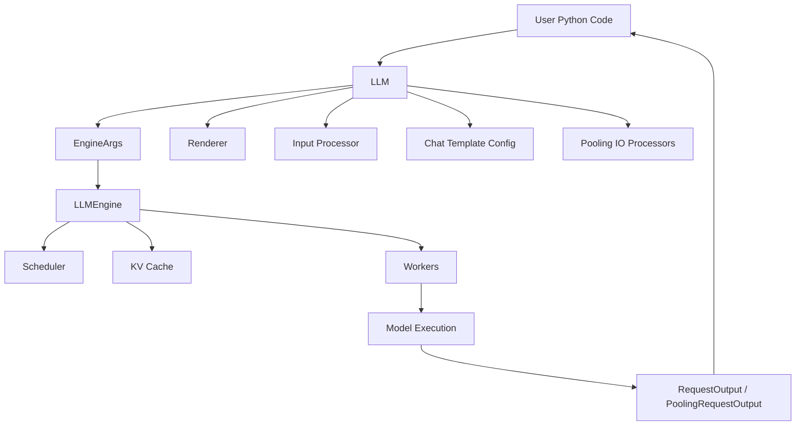

#  `LLM` Class

## 1. Architecture

### 1) High-level architecture

`LLM` is the high-level Python entry point that wraps configuration creation, prompt processing, sampling setup, LoRA (低秩适配) handling, and execution through `LLMEngine`.



### 2) Core components

| Component               | Explanation                                                  |
| ----------------------- | ------------------------------------------------------------ |
| `EngineArgs`            | Collects model, tokenizer, parallelism, memory, quantization, compilation, and runtime configuration. |
| `LLMEngine`             | Executes requests and exposes tokenizer, renderer, input processor, worker RPC, and model inspection operations. |
| `model_config`          | Stores model-level metadata such as runner type, supported tasks, and default sampling parameters. |
| `renderer`              | Converts prompt and chat inputs into internal model-ready sequences. |
| `input_processor`       | Reuses the engine input-processing path for internal request preparation. |
| `chat_template_config`  | Stores the optional chat template used for chat-style inputs. |
| `pooling_io_processors` | Handles task-specific input and output conversion for pooling, scoring, embedding, and classification. |
| `request_counter`       | Generates request IDs for internally submitted requests.     |

### 3) Initialization flow

`LLM.__init__()` normalizes user options, builds `EngineArgs`, creates `LLMEngine`, and caches task-specific helpers.

```
LLM(...)
 |
Normalize deprecated and advanced kwargs
 |
Convert dict configs into config instances
 |
Validate single-process Data Parallelism
 |
Build EngineArgs
 |
LLMEngine.from_engine_args()
 |
Cache model_config, renderer, input_processor, chat template, supported tasks
```

### 4) Generation flow

`generate()` validates that the model uses the `generate` runner, prepares `SamplingParams`, submits completion requests, and runs the engine until outputs are ready.

```
LLM.generate()
 |
Validate runner_type == "generate"
 |
Use provided SamplingParams or default SamplingParams
 |
_run_completion()
 |
_add_completion_requests()
 |
LLMEngine.add_request()
 |
_run_engine()
 |
LLMEngine.step()
 |
RequestOutput
```

### 5) Queue-based flow

`enqueue()` and `wait_for_completion()` split request submission from execution, which is useful when requests need to be accumulated before running the engine.

```
LLM.enqueue()
 |
_add_completion_requests()
 |
Return request IDs
 |
LLM.wait_for_completion()
 |
_run_engine()
 |
Return outputs
```

### 6) Beam search flow

`beam_search()` expands candidate sequences step by step and keeps the best beams according to score.

```
LLM.beam_search()
 |
Preprocess prompts
 |
Create BeamSearchInstance objects
 |
Generate candidate tokens step by step
 |
Sort beams by score
 |
Return BeamSearchOutput
```

<br>

## 2. Interface

### 1) Constructor

`LLM(model, **kwargs)` creates an `LLM` instance from a Hugging Face model name or a local model path.

```
from vllm import LLM

llm = LLM(
    model="facebook/opt-125m",
    tensor_parallel_size=1,
    dtype="auto",
)

print(type(llm).__name__)
# Output: LLM
```

| Option                      | Explanation                                                  |
| --------------------------- | ------------------------------------------------------------ |
| `model`                     | Hugging Face model name or local model path.                 |
| `tokenizer`                 | Optional tokenizer name or local tokenizer path.             |
| `tokenizer_mode`            | Chooses automatic, fast, or slow tokenizer behavior.         |
| `skip_tokenizer_init`       | Skips tokenizer initialization when token IDs are provided directly. |
| `trust_remote_code`         | Allows custom Hugging Face model or tokenizer code.          |
| `tensor_parallel_size`      | Sets Tensor Parallelism (张量并行) size.                     |
| `dtype`                     | Controls weight and activation data type.                    |
| `quantization`              | Enables quantized weight loading such as AWQ, GPTQ, or FP8.  |
| `revision`                  | Selects a specific model branch, tag, or commit.             |
| `tokenizer_revision`        | Selects a specific tokenizer branch, tag, or commit.         |
| `chat_template`             | Provides a custom chat template for conversation inputs.     |
| `seed`                      | Sets the sampling random seed.                               |
| `gpu_memory_utilization`    | Controls the fraction of GPU memory reserved for weights, activations, and KV Cache (键值缓存). |
| `kv_cache_memory_bytes`     | Manually sets KV Cache (键值缓存) memory size.               |
| `cpu_offload_gb`            | Enables CPU offloading for model weights.                    |
| `enforce_eager`             | Disables CUDA Graphs (CUDA 图) and forces eager execution.   |
| `hf_token`                  | Provides Hugging Face authentication.                        |
| `pooler_config`             | Customizes pooling behavior for pooling models.              |
| `structured_outputs_config` | Configures structured output generation.                     |
| `attention_config`          | Configures attention backend and attention-related options.  |
| `compilation_config`        | Configures compilation optimization.                         |
| `logits_processors`         | Registers custom logits processors.                          |

### 2) Factory methods

`from_engine_args(engine_args)` creates an `LLM` instance from an existing `EngineArgs`.

```
from vllm import LLM
from vllm.engine.arg_utils import EngineArgs

engine_args = EngineArgs(model="facebook/opt-125m")
llm = LLM.from_engine_args(engine_args)

print(type(llm).__name__)
# Output: LLM
```

| Interface                       | Explanation                                                |
| ------------------------------- | ---------------------------------------------------------- |
| `from_engine_args(engine_args)` | Reuses an existing `EngineArgs` object to construct `LLM`. |

### 3) Tokenizer and configuration APIs

These APIs expose tokenizer access, parallel world-size information, default sampling parameters, and multi-modal cache reset.

```
from vllm import LLM

llm = LLM(model="facebook/opt-125m")
tokenizer = llm.get_tokenizer()

tokens = tokenizer.encode("Hello vLLM")
print(len(tokens) > 0)
print(llm.get_world_size())

# Output:
# True
# 1
```

| Interface                         | Explanation                                                  |
| --------------------------------- | ------------------------------------------------------------ |
| `get_tokenizer()`                 | Returns the tokenizer used by the internal engine.           |
| `get_world_size(include_dp=True)` | Returns the parallel world size, optionally including Data Parallelism (数据并行). |
| `get_default_sampling_params()`   | Returns model-specific default `SamplingParams` or an empty default object. |
| `reset_mm_cache()`                | Clears cached multi-modal preprocessing data.                |

### 4) Text generation APIs

These APIs submit normal completion requests, optionally separate queueing from execution, and support Beam Search (束搜索).

```
from vllm import LLM, SamplingParams

llm = LLM(model="facebook/opt-125m")

params = SamplingParams(
    temperature=0.0,
    max_tokens=8,
)

outputs = llm.generate(
    prompts=["The capital of France is"],
    sampling_params=params,
    use_tqdm=False,
)

print(outputs[0].prompt)
print(outputs[0].outputs[0].text)

# Output:
# The capital of France is
# <generated text depends on model>
```

| Interface                                      | Explanation                                                  |
| ---------------------------------------------- | ------------------------------------------------------------ |
| `generate(prompts, sampling_params=None, ...)` | Generates completions for one or more prompts and returns outputs in input order. |
| `enqueue(prompts, sampling_params=None, ...)`  | Adds generation requests to the engine queue without immediately running them. |
| `wait_for_completion(output_type=None, ...)`   | Runs queued requests until completion and returns their outputs. |
| `beam_search(prompts, params, ...)`            | Generates sequences using Beam Search (束搜索).              |

### 5) Queue-based generation APIs

`enqueue()` returns request IDs immediately, while `wait_for_completion()` later processes queued requests and returns outputs.

```
from vllm import LLM, SamplingParams

llm = LLM(model="facebook/opt-125m")
params = SamplingParams(max_tokens=8)

request_ids = llm.enqueue(
    prompts=["Hello", "Good morning"],
    sampling_params=params,
    use_tqdm=False,
)

outputs = llm.wait_for_completion(use_tqdm=False)

print(len(request_ids))
print(len(outputs))

# Output:
# 2
# 2
```

| Interface               | Explanation                                                 |
| ----------------------- | ----------------------------------------------------------- |
| `enqueue()`             | Adds prompts to the internal queue and returns request IDs. |
| `wait_for_completion()` | Runs the engine loop until all queued requests finish.      |

### 6) Worker control APIs

These APIs delegate worker-level operations to `LLMEngine`.

```
from vllm import LLM

llm = LLM(model="facebook/opt-125m")

results = llm.collective_rpc("get_node_and_gpu_ids")
print(type(results).__name__)

# Output:
# list
```

| Interface                                                    | Explanation                                               |
| ------------------------------------------------------------ | --------------------------------------------------------- |
| `collective_rpc(method, timeout=None, args=(), kwargs=None)` | Executes a method or callable on all workers.             |
| `apply_model(func)`                                          | Runs a callable directly on the model inside each worker. |

### 7) Beam search API

`beam_search()` uses `BeamSearchParams` and returns `BeamSearchOutput`.

```
from vllm import LLM
from vllm.sampling_params import BeamSearchParams

llm = LLM(model="facebook/opt-125m")

params = BeamSearchParams(
    beam_width=2,
    max_tokens=8,
)

outputs = llm.beam_search(
    prompts=["The future of AI is"],
    params=params,
    use_tqdm=False,
)

print(len(outputs))

# Output:
# 1
```

| Parameter           | Explanation                                                  |
| ------------------- | ------------------------------------------------------------ |
| `prompts`           | A list of string prompts or token-ID prompts.                |
| `params`            | Beam search configuration such as beam width and maximum generated tokens. |
| `lora_request`      | Optional LoRA (低秩适配) request for generation.             |
| `use_tqdm`          | Enables or disables progress display.                        |
| `concurrency_limit` | Limits how many prompts are expanded concurrently.           |

<br> <br> ```
