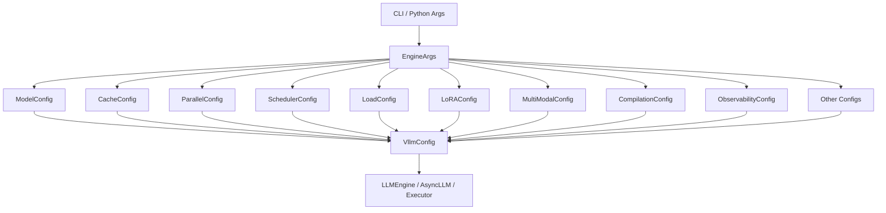

# VllmConfig

## 1. Architecture

### 1) High-level architecture

`vllm/config` manages vLLM’s engine initialization and runtime configuration. It organizes them into(**整理成**) focused(**职责明确的、专注于某一类功能的**) config classes, such as model, cache, parallelism, and scheduling configs.



### 2) Root aggregation model

`VllmConfig` (vllm/config/vllm.py)is the root config that contains model, cache, parallel, scheduler, device, load, offload, attention, Mamba, kernel, LoRA, speculative decoding, structured outputs, observability, compilation, profiler, KV transfer, reasoning, and weight transfer configs. 

As the overall configuration object of vLLM, all the sub-configurations required for model operation are uniformly collected, verified, and completed, and then passed to other modules of the engine for use.

```
VllmConfig
 |-- ModelConfig
 |-- CacheConfig
 |-- ParallelConfig
 |-- SchedulerConfig
 |-- DeviceConfig
 |-- LoadConfig
 |-- OffloadConfig
 |-- AttentionConfig
 |-- MambaConfig
 |-- KernelConfig
 |-- LoRAConfig
 |-- SpeculativeConfig
 |-- StructuredOutputsConfig
 |-- ObservabilityConfig
 |-- CompilationConfig
 |-- ProfilerConfig
 |-- KVTransferConfig
 |-- KVEventsConfig
 |-- ECTransferConfig
 |-- ReasoningConfig
 |-- WeightTransferConfig
 |-- additional_config
```

### 3) Public export model

`vllm/config/__init__.py` exports each config class as the public config API, so other modules can import from `vllm.config` instead of individual files. 

```
from vllm.config.attention import AttentionConfig
from vllm.config.cache import CacheConfig
from vllm.config.compilation import (
    CompilationConfig,
    CompilationMode,
    CUDAGraphMode,
    PassConfig,
)
from vllm.config.device import DeviceConfig
from vllm.config.ec_transfer import ECTransferConfig
from vllm.config.kernel import KernelConfig
from vllm.config.kv_events import KVEventsConfig
from vllm.config.kv_transfer import KVTransferConfig
from vllm.config.load import LoadConfig
from vllm.config.lora import LoRAConfig
from vllm.config.mamba import MambaConfig
from vllm.config.model import (
    ModelConfig,
    iter_architecture_defaults,
    str_dtype_to_torch_dtype,
    try_match_architecture_defaults,
)
from vllm.config.multimodal import MultiModalConfig
from vllm.config.observability import ObservabilityConfig
from vllm.config.offload import (
    OffloadBackend,
    OffloadConfig,
    PrefetchOffloadConfig,
    UVAOffloadConfig,
)
from vllm.config.parallel import EPLBConfig, ParallelConfig
from vllm.config.pooler import PoolerConfig
from vllm.config.profiler import ProfilerConfig
from vllm.config.reasoning import ReasoningConfig
from vllm.config.scheduler import SchedulerConfig
from vllm.config.speculative import SpeculativeConfig
from vllm.config.speech_to_text import SpeechToTextConfig, SpeechToTextParams
from vllm.config.structured_outputs import StructuredOutputsConfig
from vllm.config.utils import (
    ConfigType,
    SupportsMetricsInfo,
    config,
    get_attr_docs,
    is_init_field,
    replace,
    update_config,
)
from vllm.config.vllm import (
    VllmConfig,
    get_cached_compilation_config,
    get_current_vllm_config,
    get_current_vllm_config_or_none,
    get_layers_from_vllm_config,
    set_current_vllm_config,
)
from vllm.config.weight_transfer import WeightTransferConfig

# __all__ should only contain classes and functions.
# Types and globals should be imported from their respective modules.
__all__ = [
    # From vllm.config.attention
    "AttentionConfig",
    # From vllm.config.cache
    "CacheConfig",
    # From vllm.config.compilation
    "CompilationConfig",
    "CompilationMode",
    "CUDAGraphMode",
    "PassConfig",
    # From vllm.config.device
    "DeviceConfig",
    # From vllm.config.ec_transfer
    "ECTransferConfig",
    # From vllm.config.kernel
    "KernelConfig",
    # From vllm.config.kv_events
    "KVEventsConfig",
    # From vllm.config.kv_transfer
    "KVTransferConfig",
    # From vllm.config.load
    "LoadConfig",
    # From vllm.config.lora
    "LoRAConfig",
    # From vllm.config.mamba
    "MambaConfig",
    # From vllm.config.model
    "ModelConfig",
    "iter_architecture_defaults",
    "str_dtype_to_torch_dtype",
    "try_match_architecture_defaults",
    # From vllm.config.multimodal
    "MultiModalConfig",
    # From vllm.config.observability
    "ObservabilityConfig",
    # From vllm.config.offload
    "OffloadBackend",
    "OffloadConfig",
    "PrefetchOffloadConfig",
    "UVAOffloadConfig",
    # From vllm.config.parallel
    "EPLBConfig",
    "ParallelConfig",
    # From vllm.config.pooler
    "PoolerConfig",
    # From vllm.config.reasoning
    "ReasoningConfig",
    # From vllm.config.scheduler
    "SchedulerConfig",
    # From vllm.config.speculative
    "SpeculativeConfig",
    # From vllm.config.speech_to_text
    "SpeechToTextConfig",
    "SpeechToTextParams",
    # From vllm.config.structured_outputs
    "StructuredOutputsConfig",
    # From vllm.config.profiler
    "ProfilerConfig",
    # From vllm.config.utils
    "ConfigType",
    "SupportsMetricsInfo",
    "config",
    "get_attr_docs",
    "is_init_field",
    "replace",
    "update_config",
    # From vllm.config.vllm
    "VllmConfig",
    "get_cached_compilation_config",
    "get_current_vllm_config",
    "get_current_vllm_config_or_none",
    "set_current_vllm_config",
    "get_layers_from_vllm_config",
    "WeightTransferConfig",
]
```

### 4) EngineArgs to VllmConfig flow

`EngineArgs` is the flat user-input layer, while `create_engine_config()` converts those flat fields into structured config objects.

```
EngineArgs
 |
create_model_config()
 |
ModelConfig

EngineArgs
 |
CacheConfig(...)

EngineArgs
 |
ParallelConfig(...)

EngineArgs
 |
SchedulerConfig(...)

All configs
 |
VllmConfig(...)
```

### 5) Validation relationship

`VllmConfig.__post_init__()` verifies cross-config compatibility, updates derived fields, resolves quantization, checks LoRA against model config, and applies runtime defaults. 

```
VllmConfig.__post_init__()
 |
try_verify_and_update_config()
 |
model_config.verify_with_parallel_config()
 |
lora_config.verify_with_model_config()
 |
resolve quant_config
 |
validate scheduler / executor compatibility
```

### 6) Hash relationship

`VllmConfig.compute_hash()` combines hashes from sub-configs that affect the computation graph, which helps identify whether runtime graph-related configuration has changed. 

```
ModelConfig.compute_hash()
CacheConfig.compute_hash()
ParallelConfig.compute_hash()
SchedulerConfig.compute_hash()
DeviceConfig.compute_hash()
LoadConfig.compute_hash()
CompilationConfig.compute_hash()
KernelConfig.compute_hash()
...
 |
VllmConfig.compute_hash()
```

<br>

## 2. Interface

### 1) `VllmConfig`

`VllmConfig` is the top-level container that packages all sub-configs used by the vLLM runtime. 

| Field                       | Description                                                  |
| --------------------------- | ------------------------------------------------------------ |
| `model_config`              | Stores model identity, tokenizer, dtype, architecture, and Hugging Face metadata. |
| `cache_config`              | Stores KV Cache settings such as block size, cache dtype, prefix caching, and memory limits. |
| `parallel_config`           | Stores Tensor Parallelism (张量并行), Pipeline Parallelism (流水线并行), Data Parallelism (数据并行), and worker backend settings. |
| `scheduler_config`          | Stores batching, sequence limits, scheduling policy, and chunked prefill settings. |
| `device_config`             | Stores the target device type.                               |
| `load_config`               | Stores model loading format, download path, and loader-specific options. |
| `offload_config`            | Stores model weight offloading settings.                     |
| `attention_config`          | Stores attention backend and attention execution options.    |
| `mamba_config`              | Stores Mamba backend and Mamba cache behavior.               |
| `kernel_config`             | Stores custom kernel and MoE backend options.                |
| `lora_config`               | Stores LoRA (低秩适配) adapter limits and behavior.          |
| `speculative_config`        | Stores Speculative Decoding (推测解码) configuration.        |
| `structured_outputs_config` | Stores structured generation and reasoning parser settings.  |
| `observability_config`      | Stores metrics, tracing, and runtime observability settings. |
| `compilation_config`        | Stores `torch.compile` and CUDA Graph (CUDA 图) settings.    |
| `profiler_config`           | Stores profiling configuration.                              |
| `kv_transfer_config`        | Stores distributed KV Cache transfer settings.               |
| `kv_events_config`          | Stores KV event publishing settings.                         |
| `ec_transfer_config`        | Stores distributed EC cache transfer settings.               |
| `reasoning_config`          | Stores reasoning parser configuration.                       |
| `weight_transfer_config`    | Stores weight transfer settings for RL training.             |
| `additional_config`         | Stores platform-specific or experimental options.            |

### 2) `ModelConfig`

`ModelConfig` defines what model is loaded, how its tokenizer is loaded, what runner type it uses, and what architecture-level capabilities it exposes.

| Responsibility             | Description                                                  |
| -------------------------- | ------------------------------------------------------------ |
| Model identity             | Tracks model name, model weights, revision, code revision, and served model name. |
| Tokenizer                  | Tracks tokenizer name, tokenizer mode, tokenizer revision, and tokenizer initialization behavior. |
| Runtime dtype              | Controls dtype and quantization-related model behavior.      |
| Model length               | Stores maximum model length and architecture-specific limits. |
| Task type                  | Determines whether the model runs generation, pooling, embedding, scoring, or classification. |
| Multi-modal model metadata | Exposes whether the model has multi-modal behavior and related constraints. |
| Compatibility checks       | Verifies model constraints against parallel and loading configs. |

### 3) `CacheConfig`

`CacheConfig` controls KV Cache layout, memory usage, cache dtype, prefix caching, Mamba cache, KV offloading, and fast-prefill flags.

| Field                        | Description                                                  |
| ---------------------------- | ------------------------------------------------------------ |
| `block_size`                 | Sets the number of tokens in one cache block.                |
| `gpu_memory_utilization`     | Sets the GPU memory fraction reserved for model execution and KV Cache. |
| `cache_dtype`                | Sets KV Cache storage dtype.                                 |
| `num_gpu_blocks_override`    | Overrides profiled GPU block count for testing or tuning.    |
| `sliding_window`             | Stores sliding-window attention cache length.                |
| `enable_prefix_caching`      | Enables Prefix Caching (前缀缓存).                           |
| `prefix_caching_hash_algo`   | Selects the hash algorithm for prefix cache keys.            |
| `calculate_kv_scales`        | Enables deprecated dynamic KV scale calculation.             |
| `kv_cache_dtype_skip_layers` | Skips KV cache quantization for selected layers.             |
| `kv_sharing_fast_prefill`    | Enables metadata path for KV-sharing prefill optimization experiments. |
| `kv_cache_memory_bytes`      | Manually sets KV Cache memory size.                          |
| `kv_offloading_size`         | Enables CPU KV Cache offloading when set.                    |
| `kv_offloading_backend`      | Selects the KV offloading backend.                           |
| `mamba_cache_dtype`          | Sets Mamba cache dtype.                                      |
| `mamba_ssm_cache_dtype`      | Sets Mamba SSM cache dtype.                                  |
| `mamba_block_size`           | Sets Mamba cache block size.                                 |
| `mamba_cache_mode`           | Selects Mamba cache strategy.                                |

### 4) `ParallelConfig`

`ParallelConfig` controls how execution is split across GPUs, nodes, workers, and data-parallel ranks.

| Responsibility       | Description                                                  |
| -------------------- | ------------------------------------------------------------ |
| Tensor Parallelism   | Splits tensor computation across GPUs.                       |
| Pipeline Parallelism | Splits model layers across pipeline stages.                  |
| Data Parallelism     | Runs replicated engines across ranks.                        |
| Context Parallelism  | Splits prefill or decode context work across devices.        |
| Distributed backend  | Selects multiprocessing, Ray, or external launcher behavior. |
| Expert Parallelism   | Controls MoE expert distribution.                            |
| Load balancing       | Supports internal, external, and hybrid data-parallel load balancing. |
| Worker classes       | Selects worker implementation and extension classes.         |
| Communication        | Configures NCCL, all-to-all backend, and distributed timeout settings. |

### 5) `SchedulerConfig`

`SchedulerConfig` controls how requests are batched, scheduled, chunked, and streamed.

| Field                          | Description                                                 |
| ------------------------------ | ----------------------------------------------------------- |
| `runner_type`                  | Tracks whether the scheduler handles generation or pooling. |
| `max_num_batched_tokens`       | Limits total tokens per batch.                              |
| `max_num_seqs`                 | Limits concurrent sequences per batch.                      |
| `max_model_len`                | Stores the maximum sequence length accepted by the model.   |
| `enable_chunked_prefill`       | Enables Chunked Prefill (分块预填充).                       |
| `disable_chunked_mm_input`     | Disables chunking for multi-modal inputs.                   |
| `policy`                       | Selects the scheduling policy.                              |
| `scheduler_cls`                | Allows a custom scheduler implementation.                   |
| `max_num_partial_prefills`     | Controls concurrent partial prefill count.                  |
| `long_prefill_token_threshold` | Defines what counts as a long prefill.                      |
| `async_scheduling`             | Enables or disables asynchronous scheduling.                |
| `stream_interval`              | Controls output streaming frequency.                        |

### 6) `DeviceConfig`

`DeviceConfig` records the target platform device used by the engine.

| Field    | Description                                                  |
| -------- | ------------------------------------------------------------ |
| `device` | Stores the selected device type such as CUDA, CPU, TPU, HPU, or XPU. |

### 7) `LoadConfig`

`LoadConfig` controls how model weights are loaded.

| Field                       | Description                                 |
| --------------------------- | ------------------------------------------- |
| `load_format`               | Selects the weight loading format.          |
| `download_dir`              | Sets the local download directory.          |
| `safetensors_load_strategy` | Controls safetensors loading behavior.      |
| `model_loader_extra_config` | Stores loader-specific options.             |
| `ignore_patterns`           | Skips matching files during loading.        |
| `use_tqdm_on_load`          | Enables progress display while loading.     |
| `pt_load_map_location`      | Controls PyTorch checkpoint device mapping. |

### 8) `OffloadConfig`

`OffloadConfig` groups model weight offloading options.

| Sub-config              | Description                                                |
| ----------------------- | ---------------------------------------------------------- |
| `UVAOffloadConfig`      | Controls CPU offload size and parameter selection.         |
| `PrefetchOffloadConfig` | Controls layer-group prefetch offloading.                  |
| `OffloadConfig`         | Combines backend, UVA offloading, and prefetch offloading. |

### 9) `AttentionConfig`

`AttentionConfig` controls which attention backend and attention-related execution settings are used.

| Responsibility          | Description                                                  |
| ----------------------- | ------------------------------------------------------------ |
| Backend selection       | Chooses the attention backend.                               |
| FlashAttention behavior | Controls FlashAttention-related settings when available.     |
| Backend validation      | Converts string or automatic choices into valid backend values. |

### 10) `MambaConfig`

`MambaConfig` controls backend and stochastic rounding options for Mamba-family layers.

| Responsibility      | Description                                                  |
| ------------------- | ------------------------------------------------------------ |
| Backend selection   | Chooses the Mamba execution backend.                         |
| Stochastic rounding | Enables stochastic rounding for Mamba cache when compatible. |
| Philox rounds       | Controls random-number rounds for stochastic rounding.       |

### 11) `KernelConfig`

`KernelConfig` controls low-level kernel selection and custom kernel tuning.

| Field                        | Description                                                  |
| ---------------------------- | ------------------------------------------------------------ |
| `ir_op_priority`             | Controls preferred implementation order for selected operations. |
| `moe_backend`                | Selects MoE backend.                                         |
| `enable_flashinfer_autotune` | Enables FlashInfer autotuning.                               |

### 12) `LoRAConfig`

`LoRAConfig` controls how LoRA (低秩适配) adapters are loaded, limited, and applied.

| Field                         | Description                                     |
| ----------------------------- | ----------------------------------------------- |
| `max_loras`                   | Limits active LoRA adapters.                    |
| `max_lora_rank`               | Limits maximum LoRA rank.                       |
| `default_mm_loras`            | Maps modalities to default LoRA adapters.       |
| `fully_sharded_loras`         | Enables fully sharded LoRA behavior.            |
| `lora_dtype`                  | Sets LoRA weight dtype.                         |
| `target_modules`              | Restricts LoRA application to selected modules. |
| `max_cpu_loras`               | Limits CPU-resident LoRA adapters.              |
| `enable_tower_connector_lora` | Enables LoRA support for tower connectors.      |
| `specialize_active_lora`      | Specializes execution for active LoRA adapters. |

### 13) `MultiModalConfig`

`MultiModalConfig` controls image, video, audio, and other non-text input behavior.

| Field                     | Description                                           |
| ------------------------- | ----------------------------------------------------- |
| `language_model_only`     | Forces language-model-only behavior.                  |
| `limit_per_prompt`        | Limits media items per prompt.                        |
| `enable_mm_embeds`        | Enables multi-modal embeddings.                       |
| `interleave_mm_strings`   | Allows interleaved text and media placeholders.       |
| `media_io_kwargs`         | Stores media loader options.                          |
| `mm_processor_kwargs`     | Passes options to multi-modal processors.             |
| `mm_processor_cache_gb`   | Controls processor cache size.                        |
| `mm_processor_cache_type` | Selects processor cache backend.                      |
| `mm_encoder_only`         | Runs only the multi-modal encoder path.               |
| `mm_encoder_tp_mode`      | Controls Tensor Parallelism for multi-modal encoders. |
| `mm_encoder_attn_backend` | Selects attention backend for multi-modal encoders.   |

### 14) `SpeculativeConfig`

`SpeculativeConfig` controls Speculative Decoding (推测解码), where draft tokens are generated and then verified by the target model.

| Responsibility          | Description                                         |
| ----------------------- | --------------------------------------------------- |
| Draft model             | Defines the draft model or method.                  |
| Speculative token count | Controls how many draft tokens are proposed.        |
| Verification behavior   | Controls how draft tokens are accepted or rejected. |
| Scheduler interaction   | Affects async scheduling compatibility.             |

### 15) `StructuredOutputsConfig`

`StructuredOutputsConfig` controls structured generation behavior and reasoning parser settings.

| Field                      | Description                                           |
| -------------------------- | ----------------------------------------------------- |
| `reasoning_parser`         | Selects parser for reasoning-style output.            |
| `reasoning_parser_plugin`  | Loads parser plugins.                                 |
| Structured output settings | Controls constrained or schema-aware output behavior. |

### 16) `ReasoningConfig`

`ReasoningConfig` stores reasoning-related parsing configuration.

| Field              | Description                           |
| ------------------ | ------------------------------------- |
| `reasoning_parser` | Stores the selected reasoning parser. |

### 17) `ObservabilityConfig`

`ObservabilityConfig` controls metrics, tracing, and runtime visibility.

| Field                              | Description                                    |
| ---------------------------------- | ---------------------------------------------- |
| `show_hidden_metrics_for_version`  | Exposes hidden metrics for a specific version. |
| `otlp_traces_endpoint`             | Enables OTLP tracing.                          |
| `collect_detailed_traces`          | Selects detailed trace modules.                |
| `kv_cache_metrics`                 | Enables KV Cache metrics.                      |
| `kv_cache_metrics_sample`          | Controls KV Cache metric sampling.             |
| `cudagraph_metrics`                | Enables CUDA Graph metrics.                    |
| `enable_layerwise_nvtx_tracing`    | Enables layer-wise NVTX tracing.               |
| `enable_mfu_metrics`               | Enables model FLOPS utilization metrics.       |
| `enable_mm_processor_stats`        | Enables multi-modal processor statistics.      |
| `enable_logging_iteration_details` | Enables detailed iteration logging.            |

### 18) `CompilationConfig`

`CompilationConfig` controls `torch.compile`, CUDA Graph (CUDA 图), graph partitioning, and optimization passes.

| Sub-config          | Description                                            |
| ------------------- | ------------------------------------------------------ |
| `CompilationConfig` | Stores compilation mode and graph capture settings.    |
| `CompilationMode`   | Defines compilation mode levels.                       |
| `CUDAGraphMode`     | Defines CUDA Graph capture behavior.                   |
| `PassConfig`        | Controls compiler pass toggles such as fusion options. |

### 19) `ProfilerConfig`

`ProfilerConfig` controls runtime profiling behavior.

| Responsibility     | Description                                    |
| ------------------ | ---------------------------------------------- |
| Profiler type      | Selects profiler backend.                      |
| Trace directory    | Stores trace output path.                      |
| Frontend profiling | Controls whether frontend traces are captured. |
| Stack capture      | Controls whether stack traces are collected.   |

### 20) `KVTransferConfig`

`KVTransferConfig` controls distributed KV Cache transfer between workers or components.

| Responsibility         | Description                                                  |
| ---------------------- | ------------------------------------------------------------ |
| Connector selection    | Chooses the KV transfer connector.                           |
| Role selection         | Defines whether the instance sends, receives, or both sends and receives KV data. |
| Extra connector config | Stores connector-specific options.                           |

### 21) `KVEventsConfig`

`KVEventsConfig` controls KV Cache event publishing.

| Responsibility     | Description                                     |
| ------------------ | ----------------------------------------------- |
| Event publication  | Configures whether KV cache events are emitted. |
| Connector behavior | Stores event backend or publishing parameters.  |

### 22) `ECTransferConfig`

`ECTransferConfig` controls distributed EC cache transfer.

| Responsibility        | Description                                                  |
| --------------------- | ------------------------------------------------------------ |
| EC cache transfer     | Stores configuration for EC cache movement across components. |
| Distributed connector | Selects or configures the transfer path.                     |

### 23) `WeightTransferConfig`

`WeightTransferConfig` controls weight transfer for RL training and dynamic weight update workflows.

| Responsibility       | Description                                                 |
| -------------------- | ----------------------------------------------------------- |
| Initialization       | Provides setup information for worker-side weight transfer. |
| Update path          | Configures how new weights are pushed to workers.           |
| Training integration | Supports RL-style training and serving integration.         |

### 24) `PoolerConfig`

`PoolerConfig` controls pooling behavior for pooling, embedding, scoring, and classification models.

| Responsibility        | Description                                   |
| --------------------- | --------------------------------------------- |
| Sequence pooling      | Selects how token outputs are pooled.         |
| Activation behavior   | Controls whether activation is applied.       |
| Pooling normalization | Controls output normalization when supported. |

### 25) `SpeechToTextConfig`

`SpeechToTextConfig` and `SpeechToTextParams` configure speech-to-text model behavior.

| Config               | Description                                   |
| -------------------- | --------------------------------------------- |
| `SpeechToTextConfig` | Stores speech-to-text runtime configuration.  |
| `SpeechToTextParams` | Stores per-request speech-to-text parameters. |

### 26) `utils.py` config helpers

The config utility layer provides common decorators, update helpers, replacement helpers, and documentation extraction.

| Interface             | Description                                                 |
| --------------------- | ----------------------------------------------------------- |
| `config`              | Decorates config dataclasses with vLLM config behavior.     |
| `ConfigType`          | Represents supported config class types.                    |
| `SupportsMetricsInfo` | Defines metrics info support.                               |
| `get_attr_docs`       | Extracts field documentation.                               |
| `is_init_field`       | Checks whether a field is accepted by a config constructor. |
| `replace`             | Replaces config fields immutably.                           |
| `update_config`       | Updates config values from nested keys.                     |

<br> <br>
