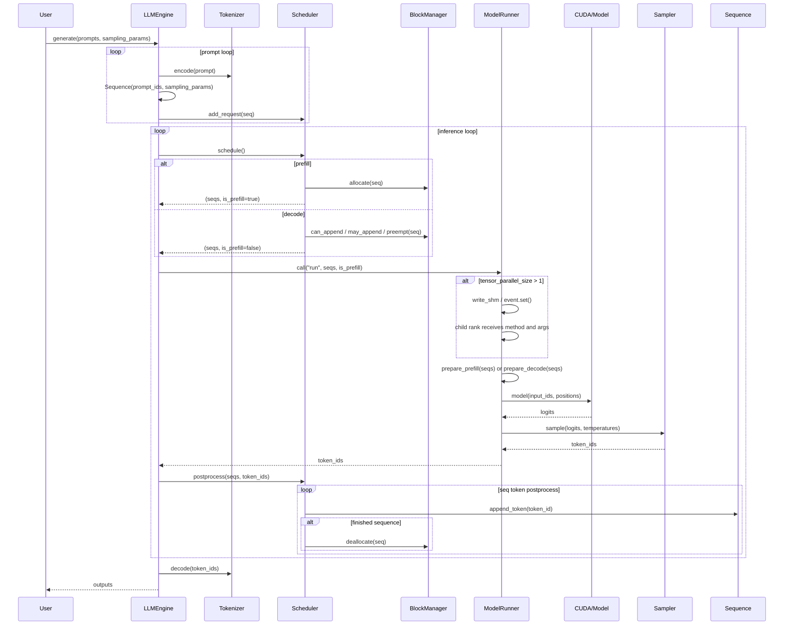

# Nano-vLLM 运行时序图

下面的 Mermaid 时序图展示了 `nanovllm` 的主要推理流程，包含 `LLM.generate()`、调度、模型运行、采样和结果返回过程。

## 关键组件说明

- `LLMEngine.generate()`
  - 负责创建 `Sequence` 对象、将 prompt 编码为 token ids、并驱动调度与推理循环。

- `Scheduler`
  - 负责 `prefill` 和 `decode` 两个阶段的任务调度。
  - 使用 `BlockManager` 管理 KV 缓存块的分配、追加与释放。

- `ModelRunner`
  - 承担模型加载、KV cache 分配、CUDA graph 捕获与执行。
  - `run()` 负责把输入转成 CUDA 张量，调用模型计算 logits，并在 rank 0 上做采样。

- `Sampler`
  - 根据 logits 和 temperature 生成下一个 token id。

- `Tokenizer`
  - 将输入 prompt 编码为 token ids，并在返回结果前 decode 为文本。

## 可选并行结构

当 `tensor_parallel_size > 1` 时，`LLMEngine` 会启动多个 `ModelRunner` 进程；rank 0 负责调度和采样，其他进程通过共享内存与事件同步接收 `run` 调用。
