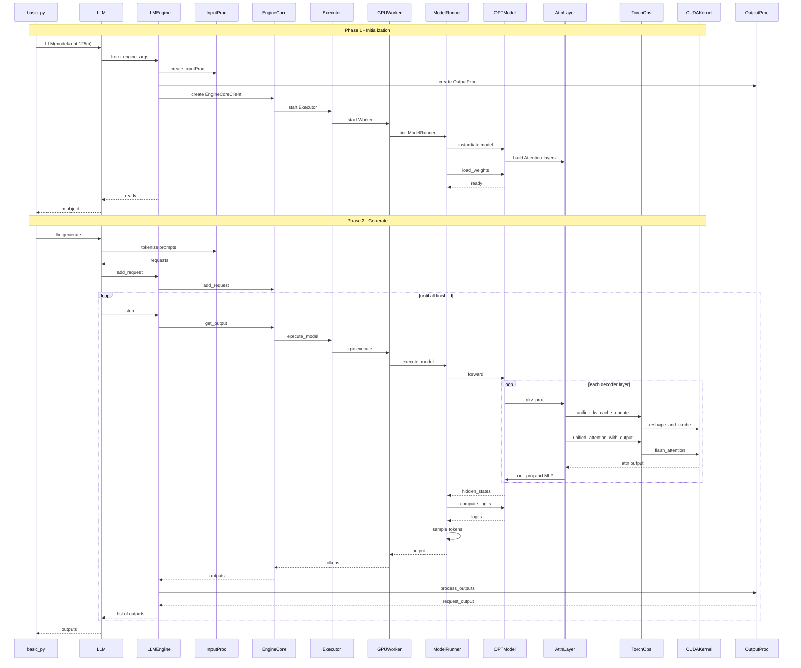

# vLLM Inference Components Study Notes

This note summarizes the main components in a vLLM-style Inference Pipeline (推理流水线).

## 1. LLM / LLMEngine

LLM / LLMEngine (推理引擎) is the main entry point that receives Requests (请求), schedules execution, and returns Outputs (输出).

```python
class LLMEngine:
    def generate(self, prompt):
        return f"Generated text for: {prompt}"

engine = LLMEngine()
print(engine.generate("Hello"))

# Output:
# Generated text for: Hello
```

## 2. InputProc

InputProc (输入处理器) converts raw user input into Model Inputs (模型输入), such as Tokens (词元) and formatted request data.

```python
def tokenize(text):
    return text.split()

tokens = tokenize("hello vllm engine")
print(tokens)

# Output:
# ['hello', 'vllm', 'engine']
```

## 3. EngineCore

EngineCore (核心引擎) manages Scheduling (调度) and KV Cache (键值缓存) for efficient inference.

```python
class EngineCore:
    def __init__(self):
        self.queue = []

    def add_request(self, request):
        self.queue.append(request)

core = EngineCore()
core.add_request("request_1")
print(core.queue)

# Output:
# ['request_1']
```

## 4. Executor

Executor (执行器) dispatches inference Tasks (任务) to Workers (工作进程).

```python
class Executor:
    def dispatch(self, task, worker):
        return worker.run(task)

class Worker:
    def run(self, task):
        return f"Running {task}"

executor = Executor()
worker = Worker()
print(executor.dispatch("decode_step", worker))

# Output:
# Running decode_step
```

## 5. GPUWorker

GPUWorker (GPU 工作进程) runs inference on each GPU (图形处理器) and manages GPU Memory (显存) and Model Loading (模型加载).

```python
class GPUWorker:
    def __init__(self, gpu_id):
        self.gpu_id = gpu_id

    def load_model(self, model_name):
        return f"GPU {self.gpu_id} loaded {model_name}"

worker = GPUWorker(0)
print(worker.load_model("OPT-125M"))

# Output:
# GPU 0 loaded OPT-125M
```

## 6. ModelRunner

ModelRunner (模型运行器) prepares Input Tensors (输入张量) and executes the Model (模型).

```python
class ModelRunner:
    def run(self, tokens):
        return [len(token) for token in tokens]

runner = ModelRunner()
print(runner.run(["hello", "vllm"]))

# Output:
# [5, 4]
```

## 7. OPTModel

OPTModel (OPT 模型) is a concrete Model Implementation (模型实现) based on `torch.nn.Module` (PyTorch 神经网络模块).

```python
class OPTModel:
    def forward(self, input_ids):
        return f"hidden_states for {input_ids}"

model = OPTModel()
print(model.forward([1, 2, 3]))

# Output:
# hidden_states for [1, 2, 3]
```

## 8. AttnLayer

AttnLayer (注意力层) computes Attention (注意力) so each token can use contextual information from other tokens.

```python
def simple_attention(query, keys):
    return [query * key for key in keys]

print(simple_attention(2, [1, 3, 5]))

# Output:
# [2, 6, 10]
```

## 9. TorchOps

TorchOps (PyTorch 算子) are high-level tensor operations used before calling lower-level GPU Kernels (GPU 内核).

```python
a = [1, 2, 3]
b = [4, 5, 6]
result = [x * y for x, y in zip(a, b)]
print(result)

# Output:
# [4, 10, 18]
```

## 10. CUDAKernel

CUDAKernel (CUDA 内核) is the low-level GPU function that performs optimized parallel computation.

```cpp
// Example CUDA-style pseudo code; it illustrates the idea and is not compiled here.
__global__ void add_kernel(float* a, float* b, float* c) {
    int i = threadIdx.x;
    c[i] = a[i] + b[i];
}

// Expected idea:
// a = [1, 2, 3]
// b = [4, 5, 6]
// c = [5, 7, 9]
```

## 11. OutputProc

OutputProc (输出处理器) converts model results such as Token IDs (词元 ID) into final Text Output (文本输出).

```python
vocab = {1: "Hello", 2: "world"}
token_ids = [1, 2]

text = " ".join(vocab[i] for i in token_ids)
print(text)

# Output:
# Hello world
```
