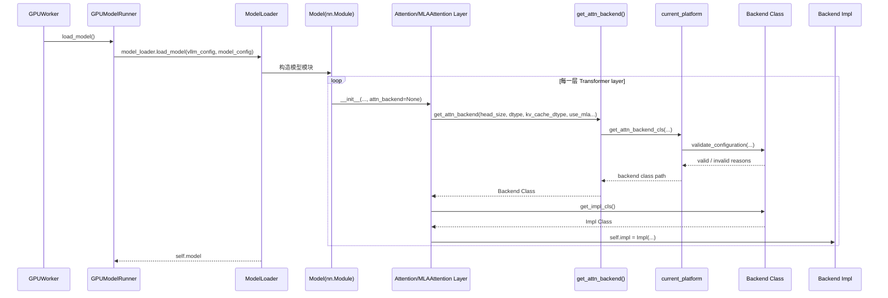
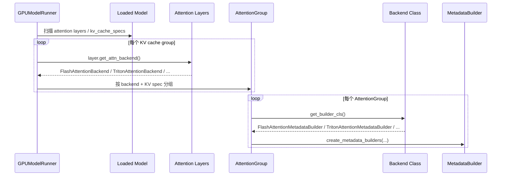
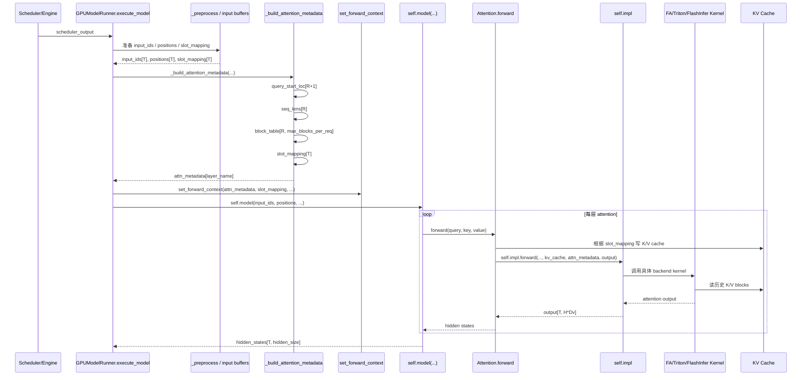
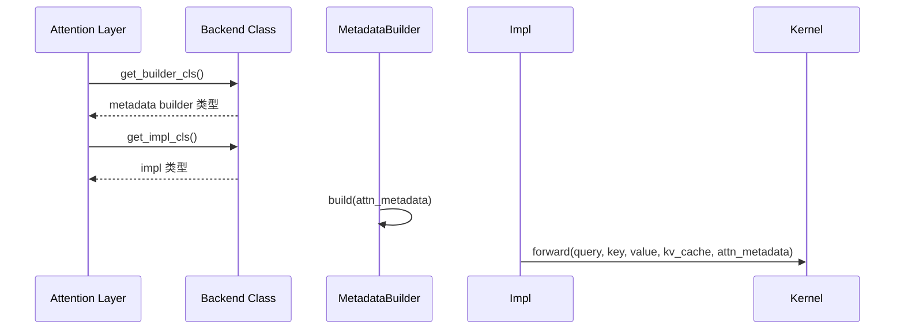

可以。下面按 vLLM V1 GPU 路径画，重点是 **backend 在 load_model / forward / metadata / KV cache 中怎么生效**。

**符号**

```
T  = 本 step 实际调度 token 数 num_tokens
R  = 本 step request 数 num_reqs
L  = 层数
H  = num_heads
Hkv = num_kv_heads
D  = head_size
Dv = value head_size，通常等于 D
B  = KV cache block_size
Nblk = 本 batch 引用的 KV blocks 数
dtype = fp16/bf16/fp8...
```

**1. load_model 阶段**



这里 backend 第一次真正生效：

```
# attention.py
self.attn_backend = get_attn_backend(...)
impl_cls = self.attn_backend.get_impl_cls()
self.impl = impl_cls(...)
```

也就是说，`FLASH_ATTN` / `TRITON_ATTN` / `FLASHINFER` 在 **模型 layer 初始化时** 就已经变成了每层的 `self.impl`。

**2. 初始化 metadata builder / KV cache group**



这一步决定了 **每次 forward 前 metadata 怎么构造**。不同 backend 不只 kernel 不同，metadata builder 也不同。

**3. 每次 execute_model / forward 阶段**



**数据量在哪**
每个 step 里，主要数据量大概是：

```
input_ids:      [T] int
positions:      [T] int
query:          [T, H, D]
key:            [T, Hkv, D]
value:          [T, Hkv, Dv]
output:         [T, H, Dv]
slot_mapping:   [T]
seq_lens:       [R]
query_start_loc:[R + 1]
block_table:    [R, max_blocks_per_req]
KV cache:       [num_blocks, B, Hkv, D/Dv]，按 layer/group 存
```

所以：

```
每层 Q 数据量 ≈ T * H * D * sizeof(dtype)
每层 K 数据量 ≈ T * Hkv * D * sizeof(dtype)
每层 V 数据量 ≈ T * Hkv * Dv * sizeof(dtype)
每层输出量 ≈ T * H * Dv * sizeof(dtype)
KV cache 写入量 ≈ T * Hkv * (D + Dv) * sizeof(kv_cache_dtype)
KV cache 读取量 ≈ attention 实际访问的历史 token 数 * Hkv * (D + Dv)
metadata 通常远小于 Q/K/V/KV cache
```

举个普通 MHA/GQA 的感觉：

```
hidden_size = H * D
query/output 是 [T, hidden_size]
KV cache 写入只写本 step 新 token
KV cache 读取会读历史上下文，所以 decode 时 T 小但读 KV 多
prefill 时 T 大，Q/K/V 和 attention 计算都大
```

**4. backend 到底改变了什么**



所以 backend 主要影响两件事：

```
1. metadata 怎么准备
   FlashAttentionMetadataBuilder / TritonAttentionMetadataBuilder / FlashInferMetadataBuilder ...

2. forward 用哪个实现
   FlashAttentionImpl / TritonAttentionImpl / FlashInferImpl ...
```

**一句话总结**
`load_model()` 时，每个 Attention layer 会选定 backend 并创建 `self.impl`；初始化 KV cache 后，runner 会按 backend 创建 metadata builder；每次 `execute_model()` 时，runner 先根据本 step 的 `T/R/block_table/slot_mapping` 构造 metadata，再进入 `model.forward()`，最后每层 `Attention.forward()` 调用对应 backend 的 `self.impl.forward()`，在那里真正执行 FlashAttention/Triton/FlashInfer kernel。


