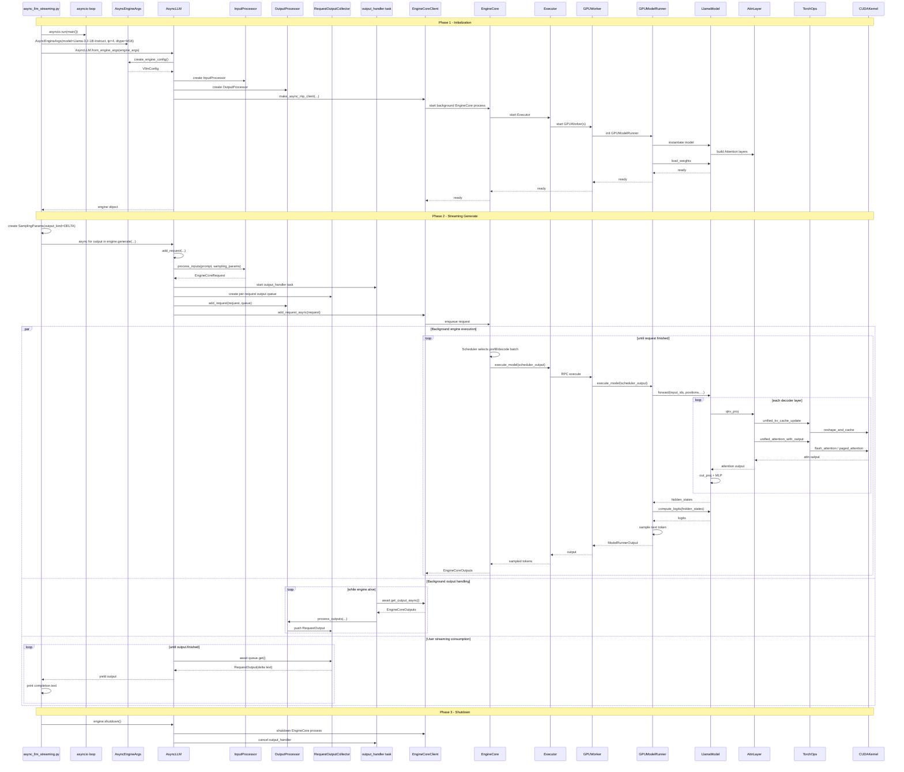

```mermaid
sequenceDiagram
    participant User as async_llm_streaming.py
    participant AsyncIO as asyncio loop
    participant Args as AsyncEngineArgs
    participant AsyncLLM as AsyncLLM
    participant Input as InputProcessor
    participant Out as OutputProcessor
    participant Collector as RequestOutputCollector
    participant Handler as output_handler task
    participant Core as EngineCoreClient
    participant EngineCore as EngineCore
    participant Exec as Executor
    participant Worker as GPUWorker
    participant Runner as GPUModelRunner
    participant Model as LlamaModel
    participant Attn as AttnLayer
    participant TOps as TorchOps
    participant Kernel as CUDAKernel
Note over User,Kernel: Phase 1 - Initialization

User->>AsyncIO: asyncio.run(main())
User->>Args: AsyncEngineArgs(model=Llama-3.2-1B-Instruct, tp=4, dtype=bf16)
User->>AsyncLLM: AsyncLLM.from_engine_args(engine_args)

AsyncLLM->>Args: create_engine_config()
Args-->>AsyncLLM: VllmConfig
AsyncLLM->>Input: create InputProcessor
AsyncLLM->>Out: create OutputProcessor
AsyncLLM->>Core: make_async_mp_client(...)
Core->>EngineCore: start background EngineCore process
EngineCore->>Exec: start Executor
Exec->>Worker: start GPUWorker(s)
Worker->>Runner: init GPUModelRunner
Runner->>Model: instantiate model
Model->>Attn: build Attention layers
Runner->>Model: load_weights
Model-->>Runner: ready
Runner-->>Worker: ready
Worker-->>EngineCore: ready
EngineCore-->>Core: ready
AsyncLLM-->>User: engine object

Note over User,Kernel: Phase 2 - Streaming Generate

User->>User: create SamplingParams(output_kind=DELTA)
User->>AsyncLLM: async for output in engine.generate(...)

AsyncLLM->>AsyncLLM: add_request(...)
AsyncLLM->>Input: process_inputs(prompt, sampling_params)
Input-->>AsyncLLM: EngineCoreRequest

AsyncLLM->>Handler: start output_handler task
AsyncLLM->>Collector: create per-request output queue
AsyncLLM->>Out: add_request(request, queue)
AsyncLLM->>Core: add_request_async(request)
Core->>EngineCore: enqueue request

par Background engine execution
    loop until request finished
        EngineCore->>EngineCore: Scheduler selects prefill/decode batch
        EngineCore->>Exec: execute_model(scheduler_output)
        Exec->>Worker: RPC execute
        Worker->>Runner: execute_model(scheduler_output)
        Runner->>Model: forward(input_ids, positions, ...)

        loop each decoder layer
            Model->>Attn: qkv_proj
            Attn->>TOps: unified_kv_cache_update
            TOps->>Kernel: reshape_and_cache
            Attn->>TOps: unified_attention_with_output
            TOps->>Kernel: flash_attention / paged_attention
            Kernel-->>Attn: attn output
            Attn-->>Model: attention output
            Model->>Model: out_proj + MLP
        end

        Model-->>Runner: hidden_states
        Runner->>Model: compute_logits(hidden_states)
        Model-->>Runner: logits
        Runner->>Runner: sample next token
        Runner-->>Worker: ModelRunnerOutput
        Worker-->>Exec: output
        Exec-->>EngineCore: sampled tokens
        EngineCore-->>Core: EngineCoreOutputs
    end
and Background output handling
    loop while engine alive
        Handler->>Core: await get_output_async()
        Core-->>Handler: EngineCoreOutputs
        Handler->>Out: process_outputs(...)
        Out->>Collector: push RequestOutput
    end
and User streaming consumption
    loop until output.finished
        AsyncLLM->>Collector: await queue.get()
        Collector-->>AsyncLLM: RequestOutput(delta text)
        AsyncLLM-->>User: yield output
        User->>User: print completion.text
    end
end

Note over User,Kernel: Phase 3 - Shutdown

User->>AsyncLLM: engine.shutdown()
AsyncLLM->>Core: shutdown EngineCore process
AsyncLLM->>Handler: cancel output_handler
```